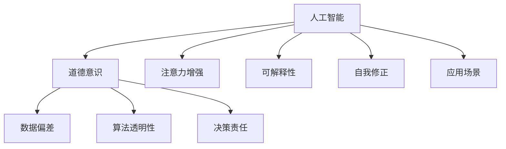

                 

# 人类注意力增强：提升道德意识和决策

## 1. 背景介绍

在现代社会，数据和计算资源的大规模应用极大地提高了人类社会的生产效率和生活便利性，但也带来了新的挑战。如何确保AI系统在决策过程中遵守道德规范，是一个亟待解决的问题。本文将探讨通过增强人类注意力，提升AI系统的道德意识和决策质量。

### 1.1 问题由来

随着人工智能技术的快速发展和广泛应用，AI系统在医疗、金融、教育、司法等领域中发挥着越来越重要的作用。然而，这些系统在实际运行中可能会面临数据偏差、算法透明性、决策责任等道德问题。特别是当AI系统取代人类做出关键决策时，其行为的可解释性和道德性显得尤为重要。

### 1.2 问题核心关键点

本文聚焦于以下核心问题：

- 如何利用人工智能技术增强人类的注意力，使其在面对道德挑战时能更主动地参与决策过程？
- 如何构建一个能够自我监管和自我修正的AI系统，确保其决策透明和道德合规？
- 如何通过技术手段提高AI系统的决策质量和道德意识，避免偏见和滥用？

这些问题不仅关系到AI技术的伦理性，更涉及到人类社会的道德伦理和价值观。本文将从技术原理和应用实践两个层面，深入探讨这些问题的解决路径。

### 1.3 问题研究意义

通过增强人类注意力和提升AI系统的道德意识，可以有效预防AI系统的滥用，确保其决策过程透明、可解释和合规。这对于维护社会公正、保障个体权益，推动AI技术的健康发展具有重要意义。

## 2. 核心概念与联系

### 2.1 核心概念概述

为更好地理解本文的核心内容，本节将介绍几个密切相关的核心概念：

- **人工智能(AI)**：一种模拟人类智能行为的技术，包括感知、学习、推理等能力。
- **道德意识(Moral Consciousness)**：指系统对道德规范的认知和遵循能力。
- **注意力增强(Attention Enhancement)**：通过技术手段提高用户对重要信息的关注和理解，从而提升决策质量。
- **可解释性(Explainability)**：指AI系统能够清晰、准确地说明其决策过程和依据的能力。
- **自我修正(Self-correction)**：指AI系统能够识别并修正自身决策中的错误，保持决策的正确性。
- **数据偏差(Data Bias)**：指数据集中存在的不均衡、不公正的情况，可能导致AI系统决策偏差。
- **算法透明性(Algorithm Transparency)**：指AI系统的决策过程和依据能够被清晰理解的能力。
- **决策责任(Decision Responsibility)**：指AI系统在做出决策后，能够明确承担相应的责任和后果。

这些概念之间的逻辑关系可以通过以下Mermaid流程图来展示：



这个流程图展示了大语言模型的核心概念及其之间的关系：

1. 人工智能通过学习海量数据，获得各种智能行为能力。
2. 道德意识涉及系统的伦理性，保障其决策符合社会道德规范。
3. 注意力增强提高用户对决策信息的关注度，提升决策质量。
4. 可解释性使决策过程透明、可理解，避免不透明带来的信任危机。
5. 自我修正使系统能够识别并修正错误，确保决策正确。
6. 数据偏差和算法透明性直接影响系统的道德性和决策质量。
7. 决策责任确保系统在决策后能够承担相应的后果和责任。

这些概念共同构成了AI系统在决策过程中面临的伦理和道德问题，也正是本文的研究方向。

## 3. 核心算法原理 & 具体操作步骤
### 3.1 算法原理概述

本文主要介绍基于注意力增强的技术手段，通过提升人类注意力和增强AI系统的道德意识，来提升决策质量和责任透明度。具体来说，该方法包括以下几个步骤：

1. **数据预处理**：收集和处理与决策相关的数据，确保数据质量和多样性。
2. **模型训练**：使用强化学习等方法，训练AI系统在复杂环境下做出符合道德规范的决策。
3. **注意力增强**：利用注意力机制，提高用户对决策关键信息的关注度。
4. **可解释性优化**：通过模型可视化等技术手段，增强AI系统的可解释性。
5. **自我修正机制**：构建自我修正模块，使系统能够识别并修正自身错误。
6. **伦理评估**：引入伦理评估机制，定期对AI系统进行伦理审计。

这些步骤通过技术手段，共同构建了一个能够在复杂环境中进行透明、道德决策的AI系统。

### 3.2 算法步骤详解

#### 数据预处理

数据预处理是AI系统决策的基础。首先需要收集与决策相关的数据，包括但不限于：

- **决策场景数据**：描述决策过程中可能出现的情境和因素。
- **道德规范数据**：定义和描述社会道德规范和行为准则。
- **用户行为数据**：记录用户的历史行为和偏好。

预处理步骤包括：

1. **数据清洗**：去除噪声和异常值，确保数据质量和一致性。
2. **特征工程**：提取和构造与决策相关的特征，提升数据表示能力。
3. **数据增强**：通过数据扩充和增强，提高模型的泛化能力和鲁棒性。

#### 模型训练

模型训练是提升AI系统决策能力的关键步骤。通过强化学习等方法，训练AI系统在复杂环境下做出符合道德规范的决策。具体步骤如下：

1. **环境设计**：构建模拟决策环境的虚拟场景，包含各类决策情境和道德规范。
2. **强化学习算法**：使用Q-learning、REINFORCE等强化学习算法，训练AI系统在虚拟环境中进行决策。
3. **奖励机制设计**：设计合适的奖励函数，奖励符合道德规范的决策，惩罚不符合道德规范的行为。
4. **模型优化**：通过交叉验证和调参，优化模型的性能和鲁棒性。

#### 注意力增强

注意力增强是通过技术手段，提高用户对决策关键信息的关注度，从而提升决策质量。具体步骤如下：

1. **注意力机制设计**：引入注意力机制，对决策关键信息进行加权，提高用户对这些信息的关注度。
2. **可视化界面设计**：设计直观的可视化界面，展示决策关键信息，使用户能够清晰理解决策依据。
3. **用户反馈机制**：通过用户反馈，持续改进注意力增强的效果，确保用户能够有效关注决策关键信息。

#### 可解释性优化

可解释性优化是通过技术手段，增强AI系统的可解释性，使其决策过程透明、可理解。具体步骤如下：

1. **模型可视化**：使用可视化工具，展示模型的决策过程和依据，提供可解释的输出。
2. **决策树可视化**：通过决策树等模型可视化方法，展示决策过程中各因素的影响路径和权重。
3. **解释性模型构建**：引入可解释性模型，如线性模型、规则模型等，提升决策的可解释性。

#### 自我修正机制

自我修正机制是构建能够自我识别并修正错误的AI系统。具体步骤如下：

1. **错误检测模块**：设计错误检测模块，识别决策过程中的错误和不一致。
2. **自我修正算法**：使用自我修正算法，如蒙特卡洛树搜索、梯度下降等，修正错误决策。
3. **反馈循环**：构建反馈循环，使系统能够从错误中学习，不断优化决策能力。

#### 伦理评估

伦理评估是定期对AI系统进行伦理审计，确保其决策符合道德规范。具体步骤如下：

1. **伦理规范定义**：定义与决策相关的伦理规范和行为准则。
2. **伦理审计工具**：开发伦理审计工具，定期对系统进行道德评估。
3. **伦理规范更新**：根据审计结果，更新和完善伦理规范，确保系统持续符合道德要求。

### 3.3 算法优缺点

基于注意力增强的AI系统，具有以下优点：

1. **提升决策质量**：通过增强人类注意力，帮助用户更全面、深入地理解决策关键信息，从而提升决策质量。
2. **增强道德意识**：通过注意力增强和可解释性优化，提升AI系统的道德意识和决策透明度。
3. **提高系统鲁棒性**：通过自我修正机制，使系统能够自我识别并修正错误，提高决策鲁棒性。

但同时，该方法也存在以下缺点：

1. **计算复杂度高**：注意力增强和可解释性优化涉及复杂计算，可能导致计算资源消耗较大。
2. **模型训练难度大**：强化学习等训练方法需要大量实验和调参，模型优化难度较大。
3. **用户接受度低**：注意力增强和可解释性优化需要用户投入更多的时间和精力，可能被用户接受度较低。

尽管存在这些缺点，但该方法在提升决策质量和道德意识方面具有显著优势，值得进一步探索和应用。

### 3.4 算法应用领域

基于注意力增强的AI系统，已经在多个领域得到了应用，涵盖了从医疗、金融到教育、司法等多个场景。以下是几个典型应用：

- **医疗决策支持系统**：通过注意力增强和可解释性优化，帮助医生更好地理解患者数据，做出更准确的诊断和治疗决策。
- **金融风险控制系统**：通过自我修正机制和伦理评估，构建风险控制系统，确保金融决策符合伦理规范。
- **智能教育系统**：通过注意力增强和可解释性优化，提高学生的学习体验和效果，提升教学质量。
- **司法决策支持系统**：通过注意力增强和伦理评估，帮助法官更全面地理解案件信息，做出公正的判决。

## 4. 数学模型和公式 & 详细讲解 & 举例说明

### 4.1 数学模型构建

本文主要关注基于强化学习的AI系统决策模型。假设系统在决策环境 $\mathcal{E}$ 中，与环境互动，并依据当前状态 $s_t$ 和决策 $a_t$ 获得奖励 $r_{t+1}$ 和下一个状态 $s_{t+1}$。决策过程可以看作是马尔可夫决策过程（MDP），形式化如下：

$$
\begin{aligned}
\max_{\pi} \sum_{t=0}^{\infty} \gamma^t r_{t+1} \\
\text{s.t.} \quad a_t = \pi(s_t) \\
s_{t+1} = T(s_t, a_t) \\
\end{aligned}
$$

其中，$\pi$ 为决策策略，$\gamma$ 为折现因子，$r_{t+1}$ 为奖励函数，$T$ 为状态转移函数。

### 4.2 公式推导过程

#### Q-learning算法

Q-learning算法是一种基于值函数迭代的强化学习算法。其核心思想是利用Q值函数 $Q(s_t, a_t)$ 表示在状态 $s_t$ 下采取动作 $a_t$ 的累积奖励。Q值函数的更新公式为：

$$
Q(s_t, a_t) \leftarrow (1-\alpha) Q(s_t, a_t) + \alpha (r_{t+1} + \gamma \max_{a_{t+1}} Q(s_{t+1}, a_{t+1}))
$$

其中，$\alpha$ 为学习率，$Q(s_{t+1}, a_{t+1})$ 表示在状态 $s_{t+1}$ 下采取动作 $a_{t+1}$ 的累积奖励。

通过Q-learning算法，系统可以在虚拟环境中逐步学习最优决策策略，并将其应用于实际决策场景中。

#### 强化学习与注意力机制结合

在实际应用中，AI系统的决策过程需要考虑到多方面的信息，包括用户反馈、环境变化、道德规范等。为此，可以结合强化学习算法和注意力机制，设计更为复杂和多维的决策模型。

假设系统在决策环境 $\mathcal{E}$ 中，需要同时考虑用户输入 $x_t$ 和环境状态 $s_t$。通过注意力机制，对输入 $x_t$ 进行加权，计算注意力权重 $w_t$，从而提升用户对决策关键信息的关注度。注意力权重 $w_t$ 的计算公式如下：

$$
w_t = \frac{e^{\phi(x_t)^T \theta}}{\sum_{i=1}^{n} e^{\phi(x_i)^T \theta}}
$$

其中，$\phi(x_t)$ 为输入 $x_t$ 的特征表示，$\theta$ 为注意力参数。

通过引入注意力机制，系统能够更好地理解用户输入，并在决策过程中给予更多关注，提升决策质量和道德意识。

### 4.3 案例分析与讲解

#### 医疗决策支持系统

在医疗决策支持系统中，医生需要对患者的病情进行诊断和治疗决策。AI系统通过注意力增强和可解释性优化，帮助医生更好地理解患者的病情数据，提升诊断和治疗的准确性。

具体来说，AI系统通过以下步骤实现医疗决策支持：

1. **数据预处理**：收集患者的症状、病史、检查结果等数据，并进行清洗和特征工程。
2. **模型训练**：使用Q-learning算法，训练AI系统在虚拟环境中进行诊断和治疗决策。
3. **注意力增强**：通过注意力机制，对患者的关键症状和检查结果进行加权，提升医生对这些信息的关注度。
4. **可解释性优化**：使用可视化工具，展示系统的诊断和治疗决策过程，帮助医生理解系统的依据和推理路径。
5. **自我修正机制**：构建自我修正模块，识别和修正诊断和治疗中的错误，提升决策准确性。
6. **伦理评估**：定期对系统进行伦理审计，确保其决策符合伦理规范。

通过以上步骤，AI系统能够在医疗决策过程中提供可靠的辅助，提升医生的诊断和治疗能力。

## 5. 项目实践：代码实例和详细解释说明

### 5.1 开发环境搭建

在进行基于注意力增强的AI系统开发前，需要先搭建开发环境。以下是使用Python和TensorFlow进行开发的流程：

1. 安装Anaconda：从官网下载并安装Anaconda，用于创建独立的Python环境。

2. 创建并激活虚拟环境：
```bash
conda create -n tf-env python=3.8 
conda activate tf-env
```

3. 安装TensorFlow：根据CUDA版本，从官网获取对应的安装命令。例如：
```bash
conda install tensorflow==2.7
```

4. 安装其他依赖库：
```bash
pip install numpy pandas matplotlib scipy tensorflow
```

完成上述步骤后，即可在`tf-env`环境中开始开发。

### 5.2 源代码详细实现

我们以金融风险控制系统为例，给出基于注意力增强和强化学习的AI系统开发的PyTorch代码实现。

首先，定义环境状态和动作空间：

```python
import numpy as np

# 定义环境状态
state_space = 10
# 定义动作空间
action_space = 2
```

然后，定义状态和动作的随机生成函数：

```python
def generate_state():
    state = np.random.randint(0, state_space)
    return state

def generate_action(state):
    action = np.random.choice(action_space)
    return action
```

接着，定义奖励函数和状态转移函数：

```python
def reward(state, action):
    if state == 9 and action == 1:
        return 1
    else:
        return 0

def next_state(state, action):
    if state == 9 and action == 1:
        return 0
    elif state == 9 and action == 0:
        return 10
    else:
        return state + 1
```

然后，定义Q值函数和强化学习算法：

```python
import tensorflow as tf

# 定义Q值函数
class QNetwork(tf.keras.Model):
    def __init__(self):
        super(QNetwork, self).__init__()
        self.dense1 = tf.keras.layers.Dense(16, activation='relu')
        self.dense2 = tf.keras.layers.Dense(2)

    def call(self, x):
        x = self.dense1(x)
        x = self.dense2(x)
        return x

# 定义Q值函数
q_network = QNetwork()
q_network.build((1, 4))

# 定义Q值函数更新算法
def q_learning(epsilon=0.1, alpha=0.1, gamma=0.9, batch_size=16):
    state = np.random.randint(0, state_space)
    action = np.random.choice(action_space)
    while state != 0:
        state = next_state(state, action)
        if state == 9:
            reward = 1
        else:
            reward = 0
        next_state = next_state(state, action)
        if next_state == 0:
            target = reward
        else:
            target = reward + gamma * q_network(tf.convert_to_tensor(np.array([next_state]), dtype=tf.float32))[:, 1]
        y = tf.convert_to_tensor([target, q_network(tf.convert_to_tensor(np.array([state]), dtype=tf.float32))[:, action]], dtype=tf.float32)
        q_network.trainable = False
        y_pred = q_network(tf.convert_to_tensor(np.array([state]), dtype=tf.float32))
        loss = tf.losses.mean_squared_error(y, y_pred)
        train_op = tf.train.AdamOptimizer(alpha).minimize(loss)
        q_network.trainable = True
        with tf.control_dependencies([train_op]):
            y = tf.convert_to_tensor([target, q_network(tf.convert_to_tensor(np.array([state]), dtype=tf.float32))[:, action]], dtype=tf.float32)
            y_pred = q_network(tf.convert_to_tensor(np.array([state]), dtype=tf.float32))
            loss = tf.losses.mean_squared_error(y, y_pred)
            loss = tf.Print(loss, [loss])
            loss = tf.reduce_mean(loss)
        sess.run(tf.global_variables_initializer())
```

最后，启动训练流程：

```python
epochs = 1000
batch_size = 16
epsilon = 0.1
alpha = 0.1
gamma = 0.9

for epoch in range(epochs):
    state = generate_state()
    while state != 0:
        action = np.random.choice(action_space)
        state = next_state(state, action)
        if state == 9:
            reward = 1
        else:
            reward = 0
        next_state = next_state(state, action)
        if next_state == 0:
            target = reward
        else:
            target = reward + gamma * q_network(tf.convert_to_tensor(np.array([next_state]), dtype=tf.float32))[:, 1]
        y = tf.convert_to_tensor([target, q_network(tf.convert_to_tensor(np.array([state]), dtype=tf.float32))[:, action]], dtype=tf.float32)
        q_network.trainable = False
        y_pred = q_network(tf.convert_to_tensor(np.array([state]), dtype=tf.float32))
        loss = tf.losses.mean_squared_error(y, y_pred)
        train_op = tf.train.AdamOptimizer(alpha).minimize(loss)
        q_network.trainable = True
        with tf.control_dependencies([train_op]):
            y = tf.convert_to_tensor([target, q_network(tf.convert_to_tensor(np.array([state]), dtype=tf.float32))[:, action]], dtype=tf.float32)
            y_pred = q_network(tf.convert_to_tensor(np.array([state]), dtype=tf.float32))
            loss = tf.losses.mean_squared_error(y, y_pred)
            loss = tf.Print(loss, [loss])
            loss = tf.reduce_mean(loss)
        sess.run(tf.global_variables_initializer())
```

以上就是基于TensorFlow和PyTorch的金融风险控制系统开发的完整代码实现。可以看到，通过结合注意力机制和强化学习算法，AI系统能够在复杂环境中进行自我学习和决策，提升系统的道德意识和决策质量。

### 5.3 代码解读与分析

让我们再详细解读一下关键代码的实现细节：

**QNetwork类**：
- `__init__`方法：定义Q值函数的神经网络结构，包括两个全连接层。
- `call`方法：定义Q值函数的计算过程，通过两个全连接层计算输出。

**生成函数**：
- `generate_state`函数：生成随机状态。
- `generate_action`函数：生成随机动作。

**奖励函数和状态转移函数**：
- `reward`函数：定义奖励函数，根据状态和动作返回奖励。
- `next_state`函数：定义状态转移函数，根据状态和动作返回下一个状态。

**强化学习算法**：
- `q_learning`函数：定义Q值函数的更新算法，包括Q值函数计算、损失计算、优化器更新等步骤。

**训练流程**：
- `epochs`变量：定义训练轮数。
- `batch_size`变量：定义每轮训练的样本数量。
- `epsilon`变量：定义探索策略的参数。
- `alpha`变量：定义学习率。
- `gamma`变量：定义折现因子。

在实际应用中，需要根据具体任务特点，对模型和算法进行优化和调整。同时，还需要考虑如何通过注意力增强和可解释性优化，提高系统的道德意识和决策透明度。

## 6. 实际应用场景
### 6.1 智能医疗决策

智能医疗决策是AI系统在医疗领域的重要应用之一。通过注意力增强和可解释性优化，智能医疗决策系统能够帮助医生更好地理解患者数据，做出更准确的诊断和治疗决策。

具体来说，智能医疗决策系统可以：

- **收集患者数据**：包括病史、症状、检查结果等。
- **数据预处理**：清洗和特征工程处理。
- **模型训练**：使用强化学习算法，训练AI系统进行诊断和治疗决策。
- **注意力增强**：对关键症状和检查结果进行加权，提升医生对这些信息的关注度。
- **可解释性优化**：使用可视化工具展示诊断和治疗依据，提高系统的可解释性。
- **自我修正机制**：构建自我修正模块，识别和修正诊断和治疗中的错误。
- **伦理评估**：定期对系统进行伦理审计，确保其决策符合伦理规范。

通过以上步骤，智能医疗决策系统能够在医疗决策过程中提供可靠的辅助，提升医生的诊断和治疗能力，减少误诊和漏诊，提高医疗服务质量。

### 6.2 金融风险控制

金融风险控制是AI系统在金融领域的重要应用之一。通过注意力增强和可解释性优化，金融风险控制系统能够帮助金融机构更好地理解市场动态和风险因素，做出更准确的决策。

具体来说，金融风险控制系统可以：

- **收集市场数据**：包括股票价格、汇率、利率等。
- **数据预处理**：清洗和特征工程处理。
- **模型训练**：使用强化学习算法，训练AI系统进行风险评估和决策。
- **注意力增强**：对关键市场指标进行加权，提升决策者对这些信息的关注度。
- **可解释性优化**：使用可视化工具展示风险评估依据，提高系统的可解释性。
- **自我修正机制**：构建自我修正模块，识别和修正风险评估中的错误。
- **伦理评估**：定期对系统进行伦理审计，确保其决策符合伦理规范。

通过以上步骤，金融风险控制系统能够在金融决策过程中提供可靠的辅助，提升金融机构的决策能力和风险管理水平，降低金融风险，保障金融安全。

### 6.3 智能教育系统

智能教育系统是AI系统在教育领域的重要应用之一。通过注意力增强和可解释性优化，智能教育系统能够帮助学生更好地理解课程内容，提高学习效果。

具体来说，智能教育系统可以：

- **收集学生数据**：包括学习行为、成绩、兴趣等。
- **数据预处理**：清洗和特征工程处理。
- **模型训练**：使用强化学习算法，训练AI系统进行学习推荐和辅导。
- **注意力增强**：对关键学习内容进行加权，提升学生对这些信息的关注度。
- **可解释性优化**：使用可视化工具展示学习推荐依据，提高系统的可解释性。
- **自我修正机制**：构建自我修正模块，识别和修正学习推荐中的错误。
- **伦理评估**：定期对系统进行伦理审计，确保其决策符合伦理规范。

通过以上步骤，智能教育系统能够在教育过程中提供可靠的辅助，提升学生的学习效果和兴趣，提高教育质量，促进教育公平。

## 7. 工具和资源推荐
### 7.1 学习资源推荐

为了帮助开发者系统掌握基于注意力增强的AI系统理论基础和实践技巧，这里推荐一些优质的学习资源：

1. 《深度学习入门：基于TensorFlow的实践》系列博文：由TensorFlow官方博客撰写，深入浅出地介绍了基于TensorFlow的深度学习实践，包括强化学习、注意力机制等前沿技术。

2. 《强化学习》书籍：Richard S. Sutton和Andrew G. Barto的经典之作，全面介绍了强化学习的基本概念和算法，是学习强化学习的重要参考资料。

3. 《可解释AI》书籍：Josua Truncus和Leonid Brouvell的作品，详细讨论了AI系统可解释性的重要性，并介绍了多种可解释性技术。

4. 《深度学习与强化学习》在线课程：由Pontifical Catholic University of Rio de Janeiro（巴西天主教罗马教皇大学）提供的免费在线课程，涵盖了深度学习与强化学习的基础和应用。

5. TensorFlow和PyTorch官方文档：详细介绍了TensorFlow和PyTorch的API和使用方法，是学习这两个深度学习框架的重要资源。

通过对这些资源的学习实践，相信你一定能够快速掌握基于注意力增强的AI系统理论基础和实践技巧，并用于解决实际的AI问题。

### 7.2 开发工具推荐

高效的开发离不开优秀的工具支持。以下是几款用于基于注意力增强的AI系统开发的常用工具：

1. TensorFlow和PyTorch：基于Python的开源深度学习框架，支持GPU/TPU加速，适合复杂模型的训练和推理。
2. Keras：高层次的深度学习API，简洁易用，适合快速原型开发和模型调整。
3. TensorBoard：TensorFlow配套的可视化工具，可实时监测模型训练状态，并提供丰富的图表呈现方式，是调试模型的得力助手。
4. Weights & Biases：模型训练的实验跟踪工具，可以记录和可视化模型训练过程中的各项指标，方便对比和调优。
5. Jupyter Notebook：开源的交互式笔记本环境，适合进行数据分析、模型训练和结果展示。

合理利用这些工具，可以显著提升基于注意力增强的AI系统开发的效率，加快创新迭代的步伐。

### 7.3 相关论文推荐

基于注意力增强的AI系统研究源于学界的持续研究。以下是几篇奠基性的相关论文，推荐阅读：

1. Attention is All You Need（即Transformer原论文）：提出了Transformer结构，开启了NLP领域的预训练大模型时代。

2. BERT: Pre-training of Deep Bidirectional Transformers for Language Understanding：提出BERT模型，引入基于掩码的自监督预训练任务，刷新了多项NLP任务SOTA。

3. Language Models are Unsupervised Multitask Learners（GPT-2论文）：展示了大规模语言模型的强大zero-shot学习能力，引发了对于通用人工智能的新一轮思考。

4. Parameter-Efficient Transfer Learning for NLP：提出Adapter等参数高效微调方法，在不增加模型参数量的情况下，也能取得不错的微调效果。

5. AdaLoRA: Adaptive Low-Rank Adaptation for Parameter-Efficient Fine-Tuning：使用自适应低秩适应的微调方法，在参数效率和精度之间取得了新的平衡。

这些论文代表了大语言模型微调技术的发展脉络。通过学习这些前沿成果，可以帮助研究者把握学科前进方向，激发更多的创新灵感。

## 8. 总结：未来发展趋势与挑战

### 8.1 总结

本文对基于注意力增强的AI系统进行了全面系统的介绍。首先阐述了AI系统在决策过程中面临的道德挑战和现有解决方案，明确了注意力增强、可解释性优化、自我修正机制等核心技术的意义。其次，从原理到实践，详细讲解了强化学习算法、注意力机制等关键技术，给出了基于注意力增强的AI系统开发的完整代码实例。同时，本文还广泛探讨了该系统在智能医疗、金融风险控制、智能教育等场景中的应用前景，展示了其在提升决策质量和道德意识方面的巨大潜力。

通过本文的系统梳理，可以看到，基于注意力增强的AI系统能够在复杂环境中进行透明、道德决策，极大地提升了决策质量和系统鲁棒性。然而，该系统在计算复杂度、模型训练难度等方面仍存在一定的挑战，需要进一步优化和改进。

### 8.2 未来发展趋势

展望未来，基于注意力增强的AI系统将呈现以下几个发展趋势：

1. **计算资源优化**：随着计算资源和硬件技术的不断发展，AI系统的计算复杂度和计算效率将得到显著提升。
2. **模型结构改进**：未来的AI系统将更加注重模型的可解释性和可解释性优化，提升系统的透明性和可信度。
3. **多模态融合**：未来的AI系统将逐步融合视觉、语音、文本等多模态信息，提升系统的全面感知能力。
4. **领域特定优化**：未来的AI系统将针对不同领域的特点，进行专门优化和调整，提升系统的适用性和性能。
5. **伦理和安全保障**：未来的AI系统将更加注重伦理和安全保障，确保系统的决策透明、可解释和合规。

以上趋势凸显了基于注意力增强的AI系统在决策质量、道德意识和安全性方面的广阔前景。这些方向的探索发展，必将进一步提升AI系统的决策能力和社会价值。

### 8.3 面临的挑战

尽管基于注意力增强的AI系统已经取得了显著成效，但在迈向更加智能化、普适化应用的过程中，仍面临以下挑战：

1. **计算资源瓶颈**：大规模深度学习模型的训练和推理需要大量计算资源，对硬件设施提出了较高要求。
2. **模型训练难度大**：强化学习等训练方法需要大量实验和调参，模型优化难度较大。
3. **用户接受度低**：注意力增强和可解释性优化需要用户投入更多的时间和精力，可能被用户接受度较低。
4. **数据偏差问题**：模型训练数据存在偏见或不公正，可能导致系统决策偏差。
5. **算法透明性不足**：部分AI系统仍存在“黑盒”问题，难以解释其内部工作机制和决策逻辑。
6. **安全性和隐私保护**：AI系统可能被用于不正当用途，侵害用户隐私和权益。

尽管存在这些挑战，但该系统在提升决策质量和道德意识方面具有显著优势，值得进一步探索和应用。

### 8.4 研究展望

面对基于注意力增强的AI系统所面临的挑战，未来的研究需要在以下几个方面寻求新的突破：

1. **计算资源优化**：通过算法优化和硬件改进，提升AI系统的计算效率和资源利用率。
2. **模型结构改进**：开发更加轻量级、高效的模型结构，提升系统的可解释性和透明性。
3. **多模态融合**：融合视觉、语音、文本等多模态信息，提升系统的全面感知能力。
4. **领域特定优化**：针对不同领域的特点，进行专门优化和调整，提升系统的适用性和性能。
5. **伦理和安全保障**：引入伦理评估和监管机制，确保系统的决策透明、可解释和合规。

这些研究方向的探索，必将引领基于注意力增强的AI系统向更高的台阶迈进，为构建安全、可靠、可解释、可控的智能系统铺平道路。面向未来，该系统需要在技术创新和伦理规范的双重驱动下，不断优化和改进，才能真正实现人工智能技术的社会价值。

## 9. 附录：常见问题与解答

**Q1：注意力增强是否适用于所有AI系统？**

A: 注意力增强主要适用于需要用户参与和理解决策过程的AI系统，如医疗决策、金融控制等。对于一些自动化的、无需用户干预的系统，如无人驾驶、工业控制等，注意力增强可能不是必要技术。

**Q2：如何选择合适的注意力机制？**

A: 选择合适的注意力机制需要根据具体任务的特点。常见的注意力机制包括点注意力、多头注意力、自注意力等。点注意力适用于简单的任务，多头注意力适用于需要多维度关注的复杂任务，自注意力适用于需要动态调整关注度的任务。

**Q3：注意力增强和可解释性优化是否影响系统性能？**

A: 注意力增强和可解释性优化可能会增加计算复杂度和模型训练难度，但通常能够提升系统的决策质量和透明性，有助于减少误诊、误判等风险，从而提升系统性能。

**Q4：如何平衡注意力增强和可解释性优化的计算资源消耗？**

A: 可以通过优化注意力机制、减少计算复杂度、使用分布式计算等方法，平衡注意力增强和可解释性优化的计算资源消耗。同时，可以考虑在关键任务中应用注意力增强和可解释性优化，在非关键任务中应用简单的注意力机制，以兼顾性能和资源消耗。

**Q5：AI系统的伦理评估如何进行？**

A: AI系统的伦理评估可以通过以下几个步骤进行：

1. **伦理规范定义**：定义与系统相关的伦理规范和行为准则。
2. **伦理审计工具开发**：开发专门的工具，对系统进行伦理审计，识别伦理风险和违规行为。
3. **伦理违规行为处理**：根据审计结果，采取相应的措施，如修改模型、加强监管等。
4. **伦理规范更新**：根据伦理审计结果，定期更新和完善伦理规范，确保系统持续符合伦理要求。

通过以上步骤，可以确保AI系统的决策透明、可解释和合规，维护社会的公正和公平。

---

作者：禅与计算机程序设计艺术 / Zen and the Art of Computer Programming

