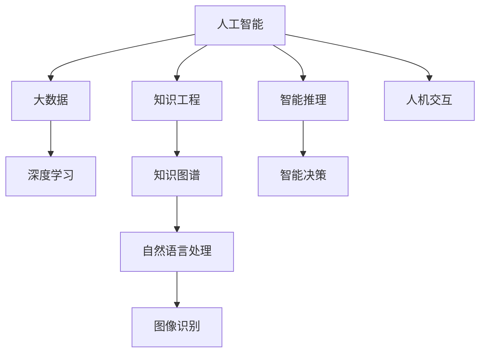

                 

# 人类的知识与自然：理解万物之灵

## 1. 背景介绍

人类自诞生以来，始终不懈地探索自然界的奥秘，以期理解和掌控世界。从古希腊的哲学思辨到现代的科学实验，人类知识体系的积累与拓展，见证了文明的进步与突破。而今天，随着信息技术的飞速发展，我们正处于数据爆炸与知识激增的黄金时代。本文旨在探讨人类知识与自然的关系，理解万物之灵的奥秘，从计算机科学的视角审视人工智能、大数据与知识工程的前沿进展。

## 2. 核心概念与联系

### 2.1 核心概念概述

为更好地理解人类知识与自然的关系，本节将介绍几个关键概念：

- 人工智能（Artificial Intelligence, AI）：一种通过计算机模拟人类智能的技术，包括学习、推理、感知、决策等方面，目标是使机器具备类似人类的智能能力。
- 知识工程（Knowledge Engineering, KE）：通过构建知识库、设计推理规则等方式，将人类知识转化为计算机可处理的形式，实现知识驱动的智能系统。
- 大数据（Big Data）：指规模巨大、种类繁多、速度极快的数据集合，涵盖结构化、半结构化、非结构化等多种形式，用于支持深度学习、知识发现等高级数据分析任务。
- 深度学习（Deep Learning, DL）：一种利用神经网络模型，通过大量数据和计算资源进行训练，实现复杂模式识别的技术，广泛应用于图像识别、自然语言处理等领域。
- 知识图谱（Knowledge Graph,KG）：一种用于描述实体及其关系的图形化表示方式，支持复杂知识推理和智能查询，是知识工程的重要工具。

这些核心概念构成了人类知识与自然的关系的基础，通过构建智能系统，人类可以更深入地理解自然界的规律，探索未知的奥秘，推动科技与社会的进步。

### 2.2 核心概念原理和架构的 Mermaid 流程图



这个流程图展示了各个核心概念之间的联系与相互作用：

- 人工智能通过学习人类知识，实现了对数据的高级处理和决策。
- 知识工程将人类知识结构化，支持智能系统的构建和运行。
- 大数据提供了海量数据支持，使深度学习等算法能够发挥更大潜力。
- 深度学习通过神经网络模型，能够从数据中提取复杂特征，提升智能系统的性能。
- 知识图谱提供了知识表示和推理的框架，支持复杂的知识推理任务。

这些概念共同构成了人工智能技术的核心框架，使得机器能够理解、处理和应用人类的知识，进而推动技术的发展与应用的扩展。

## 3. 核心算法原理 & 具体操作步骤

### 3.1 算法原理概述

基于人类知识的人工智能算法，主要分为监督学习、无监督学习和强化学习三大类。其核心思想是通过学习大量数据，构建知识驱动的模型，实现对未知数据的智能推理和决策。

- **监督学习（Supervised Learning）**：使用带有标签的数据进行训练，目标是学习输入与输出之间的映射关系，如分类、回归、预测等。
- **无监督学习（Unsupervised Learning）**：使用无标签数据进行训练，目标是发现数据的内在结构和模式，如聚类、降维、异常检测等。
- **强化学习（Reinforcement Learning, RL）**：通过试错的方式，学习如何在特定环境中采取最优行动，以获得最大奖励。

这些算法在深度学习、知识工程等领域的结合，形成了多种知识驱动的智能系统，推动了人工智能技术的快速发展。

### 3.2 算法步骤详解

以深度学习中的监督学习为例，介绍其实现步骤：

1. **数据准备**：收集标注数据，将数据分为训练集、验证集和测试集。
2. **模型选择**：选择合适的深度学习模型，如卷积神经网络（CNN）、循环神经网络（RNN）、变压器（Transformer）等。
3. **模型训练**：使用训练集数据，调整模型参数，最小化损失函数。
4. **模型验证**：在验证集上评估模型性能，调整超参数。
5. **模型测试**：在测试集上测试模型性能，评估模型泛化能力。
6. **模型应用**：将训练好的模型应用于实际问题，如分类、预测、推荐等。

以上步骤展示了深度学习模型在监督学习任务中的实现流程，不同的任务和模型可能需要调整具体的步骤。

### 3.3 算法优缺点

深度学习算法在处理大数据和复杂任务时表现优异，但同时也存在一些缺点：

- **计算资源需求高**：深度学习模型参数量大，训练和推理需要大量的计算资源。
- **过拟合风险**：模型复杂度高，容易在训练数据上过度拟合，泛化能力不足。
- **可解释性差**：深度学习模型是“黑盒”模型，难以解释其内部工作机制。
- **数据依赖性强**：深度学习依赖大量高质量标注数据，数据获取和处理成本高。

### 3.4 算法应用领域

深度学习算法在多个领域得到了广泛应用，以下是一些典型的应用场景：

- **自然语言处理（NLP）**：机器翻译、文本分类、情感分析、问答系统等。
- **计算机视觉（CV）**：图像识别、物体检测、人脸识别、图像生成等。
- **语音识别（ASR）**：语音转文本、语音合成、说话人识别等。
- **医疗健康**：疾病诊断、医学影像分析、药物研发等。
- **自动驾驶**：目标检测、路径规划、行为预测等。
- **智能推荐**：商品推荐、新闻推荐、内容推荐等。

这些领域的应用展示了深度学习在处理复杂任务、提取高层次特征方面的强大能力。

## 4. 数学模型和公式 & 详细讲解 & 举例说明

### 4.1 数学模型构建

以卷积神经网络（CNN）为例，介绍其数学模型构建过程：

1. **输入层**：接收输入数据，如图像像素值、文本词向量等。
2. **卷积层**：通过卷积核对输入数据进行卷积操作，提取局部特征。
3. **池化层**：对卷积层输出的特征图进行池化操作，减小特征图大小，提高模型鲁棒性。
4. **全连接层**：将池化层输出的特征图展开为一维向量，通过全连接层进行分类或回归任务。
5. **输出层**：根据任务需求，输出预测结果。

### 4.2 公式推导过程

以卷积神经网络中的卷积层为例，推导卷积运算的公式：

设输入数据为 $x \in \mathbb{R}^{n \times n \times c}$，卷积核为 $w \in \mathbb{R}^{k \times k \times c \times o}$，则卷积运算的公式为：

$$
y_i^{p} = w \ast x = \sum_{k=0}^{k-1}\sum_{l=0}^{l-1}\sum_{c=0}^{c-1} w_{i,j,c,p} x_{i+k,j+l,c}
$$

其中 $i,j,p$ 分别表示卷积操作后的特征图位置和卷积核位置，$n,l,k$ 表示输入数据和卷积核的尺寸，$w_{i,j,c,p}$ 表示卷积核权重，$x_{i+k,j+l,c}$ 表示输入数据在位置 $(i+k,j+l,c)$ 的像素值。

### 4.3 案例分析与讲解

以图像分类任务为例，介绍卷积神经网络的应用：

假设有一个图像分类任务，训练集包含10,000张图片，每个图片大小为28x28像素，类别数为10。首先，将图片转换为28x28的二维数组，并进行归一化处理。然后，设计一个卷积神经网络模型，包含3个卷积层和3个池化层，输出层为全连接层，使用softmax函数进行分类。最后，使用交叉熵损失函数和随机梯度下降算法训练模型，在测试集上验证模型性能。

## 5. 项目实践：代码实例和详细解释说明

### 5.1 开发环境搭建

在进行深度学习项目实践前，我们需要准备好开发环境。以下是使用Python进行PyTorch开发的流程：

1. 安装Anaconda：从官网下载并安装Anaconda，用于创建独立的Python环境。
2. 创建并激活虚拟环境：
```bash
conda create -n pytorch-env python=3.8 
conda activate pytorch-env
```
3. 安装PyTorch：根据CUDA版本，从官网获取对应的安装命令。例如：
```bash
conda install pytorch torchvision torchaudio cudatoolkit=11.1 -c pytorch -c conda-forge
```
4. 安装TensorBoard：用于可视化模型训练过程。
```bash
pip install tensorboard
```

完成上述步骤后，即可在`pytorch-env`环境中开始深度学习项目开发。

### 5.2 源代码详细实现

以下是一个使用卷积神经网络（CNN）进行图像分类任务的代码实现：

```python
import torch
import torch.nn as nn
import torchvision.transforms as transforms
from torch.utils.data import DataLoader
from torchvision.datasets import CIFAR10

# 定义网络结构
class CNN(nn.Module):
    def __init__(self):
        super(CNN, self).__init__()
        self.conv1 = nn.Conv2d(3, 32, 3, 1, 1)
        self.pool = nn.MaxPool2d(2, 2)
        self.conv2 = nn.Conv2d(32, 64, 3, 1, 1)
        self.fc1 = nn.Linear(64 * 4 * 4, 128)
        self.fc2 = nn.Linear(128, 10)
    
    def forward(self, x):
        x = self.pool(nn.functional.relu(self.conv1(x)))
        x = self.pool(nn.functional.relu(self.conv2(x)))
        x = x.view(-1, 64 * 4 * 4)
        x = nn.functional.relu(self.fc1(x))
        x = self.fc2(x)
        return nn.functional.softmax(x, dim=1)

# 加载CIFAR10数据集
transform = transforms.Compose([transforms.ToTensor(),
                               transforms.Normalize((0.5, 0.5, 0.5), (0.5, 0.5, 0.5))])
train_data = CIFAR10(root='./data', train=True, download=True, transform=transform)
test_data = CIFAR10(root='./data', train=False, download=True, transform=transform)
train_loader = DataLoader(train_data, batch_size=64, shuffle=True)
test_loader = DataLoader(test_data, batch_size=64, shuffle=False)

# 初始化模型和优化器
model = CNN()
optimizer = torch.optim.SGD(model.parameters(), lr=0.001, momentum=0.9)
criterion = nn.CrossEntropyLoss()

# 训练模型
for epoch in range(10):
    running_loss = 0.0
    for i, data in enumerate(train_loader, 0):
        inputs, labels = data
        optimizer.zero_grad()
        outputs = model(inputs)
        loss = criterion(outputs, labels)
        loss.backward()
        optimizer.step()
        running_loss += loss.item()
        if i % 100 == 99:
            print('[%d, %5d] loss: %.3f' %
                  (epoch + 1, i + 1, running_loss / 100))
            running_loss = 0.0
```

### 5.3 代码解读与分析

让我们再详细解读一下关键代码的实现细节：

**CNN类**：
- `__init__`方法：初始化网络结构，定义卷积层、池化层和全连接层。
- `forward`方法：定义前向传播过程，将输入数据经过卷积层、池化层和全连接层，最终输出分类结果。

**数据集加载**：
- `CIFAR10`类：加载CIFAR10数据集，并对其进行预处理，包括归一化。
- `transform`类：定义数据预处理方式，包括转换为张量和归一化。
- `train_loader`和`test_loader`：使用`DataLoader`加载训练集和测试集，设置批大小和随机化。

**模型训练**：
- 初始化模型、优化器和损失函数。
- 在训练循环中，对每个批次的数据进行前向传播、反向传播和参数更新。
- 在每个epoch结束时，输出训练集上的损失函数值。

以上代码展示了深度学习模型在图像分类任务中的实现流程。开发者可以根据具体任务需求，设计不同的网络结构，调整超参数，以获得更好的模型性能。

### 5.4 运行结果展示

训练完成后，在测试集上验证模型性能：

```python
correct = 0
total = 0
with torch.no_grad():
    for data in test_loader:
        images, labels = data
        outputs = model(images)
        _, predicted = torch.max(outputs.data, 1)
        total += labels.size(0)
        correct += (predicted == labels).sum().item()

print('Accuracy of the network on the 10000 test images: %d %%' % (
    100 * correct / total))
```

## 6. 实际应用场景

### 6.1 智能医疗

深度学习技术在医疗健康领域的应用，极大地提升了疾病的诊断和治疗效率。例如，通过卷积神经网络进行医学影像分析，可以实现病灶的自动检测和分类，辅助医生进行诊断。此外，基于深度学习的自然语言处理技术，可以实现电子病历的自动化提取和标注，提高医院的信息化水平。

### 6.2 自动驾驶

自动驾驶技术依赖于深度学习进行环境感知和路径规划。通过卷积神经网络进行图像识别，能够准确识别交通标志、行人和其他车辆，实现自动驾驶的决策和控制。结合强化学习算法，自动驾驶车辆可以在复杂的道路环境中进行智能导航，确保行驶安全和效率。

### 6.3 智能推荐

基于深度学习的推荐系统，能够根据用户的历史行为和偏好，推荐个性化商品、新闻和内容。通过卷积神经网络提取用户行为特征，使用全连接层进行推荐，能够实现高效、准确的推荐效果。

### 6.4 未来应用展望

随着深度学习技术的不断进步，未来将在更多领域得到应用，为人类生活带来深远影响：

- **智能家居**：基于深度学习的智能家居系统，能够根据用户行为和环境变化，智能调节家电和环境参数，提高生活质量。
- **智能制造**：通过深度学习进行质量检测和工艺优化，提升制造业的自动化和智能化水平。
- **金融风控**：利用深度学习进行信用评估和欺诈检测，降低金融风险，保障金融安全。
- **智能客服**：基于深度学习的智能客服系统，能够自然流畅地与用户交互，解决各种问题，提升客户体验。

这些领域的应用展示了深度学习技术的强大潜力，未来将会有更多创新应用出现，为人类带来更加智能和便捷的生活体验。

## 7. 工具和资源推荐

### 7.1 学习资源推荐

为了帮助开发者系统掌握深度学习理论基础和实践技巧，这里推荐一些优质的学习资源：

1. **《深度学习》（Ian Goodfellow等著）**：经典的深度学习教材，涵盖了深度学习的基本概念、算法和应用，是深度学习入门的必读书籍。
2. **Coursera深度学习课程**：由斯坦福大学Andrew Ng教授讲授，内容全面、系统，适合初学者和进阶者。
3. **Kaggle数据科学竞赛**：通过参与数据科学竞赛，实践深度学习算法，提升解决实际问题的能力。
4. **PyTorch官方文档**：PyTorch的官方文档，提供了丰富的代码示例和教程，适合深入学习PyTorch的使用。
5. **TensorFlow官方文档**：TensorFlow的官方文档，包含深度学习模型的实现和优化方法，适合开发高性能模型。

通过对这些资源的学习实践，相信你一定能够快速掌握深度学习技术，并应用于解决实际问题。

### 7.2 开发工具推荐

高效的开发离不开优秀的工具支持。以下是几款用于深度学习开发的常用工具：

1. **PyTorch**：基于Python的开源深度学习框架，灵活动态的计算图，适合快速迭代研究。
2. **TensorFlow**：由Google主导开发的开源深度学习框架，生产部署方便，适合大规模工程应用。
3. **Keras**：基于TensorFlow和Theano的高级深度学习库，易于上手，适合快速开发模型。
4. **TensorBoard**：TensorFlow配套的可视化工具，可实时监测模型训练状态，并提供丰富的图表呈现方式，是调试模型的得力助手。
5. **Weights & Biases**：模型训练的实验跟踪工具，可以记录和可视化模型训练过程中的各项指标，方便对比和调优。

合理利用这些工具，可以显著提升深度学习模型的开发效率，加快创新迭代的步伐。

### 7.3 相关论文推荐

深度学习技术的发展源于学界的持续研究。以下是几篇奠基性的相关论文，推荐阅读：

1. **ImageNet Classification with Deep Convolutional Neural Networks**：AlexNet模型，展示了深度卷积神经网络在图像分类任务上的优越性。
2. **Learning Phrase Representations using RNN Encoder-Decoder for Statistical Machine Translation**：Seq2Seq模型，展示了序列到序列的深度学习模型在机器翻译任务上的潜力。
3. **Understanding the difficulty of training deep feedforward neural networks**：Dropout技术，展示了稀疏正则化的重要性，提高了深度神经网络的训练效果。
4. **Convolutional Neural Networks for Sentence Classification**：CNN在文本分类任务上的应用，展示了卷积神经网络在处理序列数据上的优势。
5. **Generative Adversarial Nets**：GAN模型，展示了生成对抗网络在图像生成任务上的能力，推动了生成模型的发展。

这些论文代表了大深度学习技术的发展脉络，通过学习这些前沿成果，可以帮助研究者把握学科前进方向，激发更多的创新灵感。

## 8. 总结：未来发展趋势与挑战

### 8.1 研究成果总结

深度学习技术在多个领域取得了显著的进展，显著提升了模型性能和应用效果。通过学习人类知识，深度学习模型在图像、文本、语音等领域实现了强大的处理能力，推动了人工智能技术的快速发展。

### 8.2 未来发展趋势

展望未来，深度学习技术将呈现以下几个发展趋势：

1. **模型规模不断增大**：随着算力成本的下降和数据规模的扩张，深度学习模型的参数量将继续增长，推动深度学习技术的进一步发展。
2. **模型结构更加复杂**：未来将出现更多的网络结构，如残差网络、注意力机制等，提高深度学习模型的性能和灵活性。
3. **自适应学习**：通过元学习等技术，深度学习模型将具备自适应学习的能力，能够根据不同任务和数据进行自动优化。
4. **知识增强**：结合符号化的先验知识，深度学习模型将具备更强的知识推理能力，实现更加智能的决策。
5. **多模态融合**：通过将视觉、语音、文本等不同模态的信息进行融合，深度学习模型将具备更全面的感知能力。

以上趋势展示了深度学习技术的广阔前景，相信未来将会有更多创新应用出现，推动科技与社会的进步。

### 8.3 面临的挑战

尽管深度学习技术已经取得了瞩目成就，但在迈向更加智能化、普适化应用的过程中，它仍面临着诸多挑战：

1. **计算资源需求高**：深度学习模型参数量大，训练和推理需要大量的计算资源，需要高性能设备支持。
2. **模型泛化能力不足**：深度学习模型容易在训练数据上过度拟合，泛化能力有限，难以处理长尾数据和复杂数据。
3. **可解释性差**：深度学习模型是“黑盒”模型，难以解释其内部工作机制，影响模型的可信度和可靠性。
4. **数据依赖性强**：深度学习依赖大量高质量标注数据，数据获取和处理成本高。

### 8.4 研究展望

为了克服深度学习面临的挑战，未来的研究需要在以下几个方面寻求新的突破：

1. **知识增强和符号学习**：结合符号化的先验知识，提高深度学习模型的知识推理能力，增强模型的泛化能力和解释性。
2. **自适应学习和元学习**：通过自适应学习和元学习技术，使深度学习模型具备更强的自优化能力，适应不同的任务和数据。
3. **多模态融合和跨模态学习**：通过将视觉、语音、文本等不同模态的信息进行融合，提高深度学习模型的感知能力和决策效果。
4. **分布式训练和优化**：通过分布式训练和优化技术，提高深度学习模型的训练效率和性能，支持大规模模型的训练和推理。
5. **模型压缩和加速**：通过模型压缩和加速技术，提高深度学习模型的推理效率和计算性能，支持在资源受限环境下的应用。

这些研究方向将推动深度学习技术的进一步发展，使其能够更好地应用于实际问题，推动科技与社会的进步。

## 9. 附录：常见问题与解答

**Q1：深度学习算法的计算资源需求高，如何优化资源利用？**

A: 深度学习算法的计算资源需求高，可以通过以下方法进行优化：
1. **分布式训练**：使用多台计算设备进行并行训练，加速模型训练速度。
2. **模型压缩**：通过剪枝、量化、蒸馏等技术，减少模型参数量和计算量。
3. **混合精度训练**：使用混合精度（如16位浮点数）进行训练，减少内存占用和计算时间。
4. **模型并行**：将模型分为多个子模块，在多个设备上并行计算，提高训练效率。

这些优化方法可以显著降低深度学习算法的计算资源需求，提升模型的训练和推理效率。

**Q2：深度学习模型在实际应用中容易出现过拟合，如何缓解过拟合问题？**

A: 深度学习模型容易出现过拟合，可以通过以下方法进行缓解：
1. **数据增强**：通过对训练数据进行旋转、裁剪、翻转等操作，增加数据多样性，缓解过拟合问题。
2. **正则化**：使用L2正则化、Dropout等技术，限制模型复杂度，防止过拟合。
3. **早停策略**：在训练过程中，监控验证集上的性能指标，及时停止训练，避免过拟合。
4. **模型集成**：通过集成多个模型，取平均输出或进行加权投票，提高模型的泛化能力。

这些方法可以有效缓解深度学习模型的过拟合问题，提高模型的泛化能力。

**Q3：深度学习算法的可解释性差，如何提高模型可解释性？**

A: 深度学习算法的可解释性差，可以通过以下方法进行提升：
1. **特征可视化**：通过可视化输入数据在模型中的激活状态，理解模型的决策过程。
2. **局部可解释模型**：使用局部可解释模型（如LIME、SHAP等），对模型输出进行解释。
3. **知识增强**：结合符号化的先验知识，提高模型的可解释性和可信度。
4. **知识图谱**：使用知识图谱技术，将知识库与深度学习模型结合，提高模型的可解释性。

这些方法可以提高深度学习算法的可解释性，使其更易于理解和调试。

**Q4：深度学习算法的数据依赖性强，如何降低数据需求？**

A: 深度学习算法的数据依赖性强，可以通过以下方法降低数据需求：
1. **自监督学习**：通过无监督学习方法，利用数据的内在结构进行训练，减少对标注数据的依赖。
2. **数据增强**：通过数据增强技术，生成更多的训练样本，提高模型的泛化能力。
3. **迁移学习**：通过迁移学习，利用已有模型的知识进行微调，减少新任务的数据需求。
4. **半监督学习**：结合少量标注数据和大量未标注数据，进行半监督学习，提高模型的泛化能力。

这些方法可以降低深度学习算法对标注数据的依赖，提升模型的泛化能力和效率。

**Q5：深度学习算法如何在多模态数据中提取特征？**

A: 深度学习算法可以通过以下方法在多模态数据中提取特征：
1. **多模态神经网络**：使用多模态神经网络结构，将视觉、语音、文本等不同模态的信息进行融合，提取多模态特征。
2. **跨模态学习**：通过跨模态学习技术，将不同模态的数据进行联合建模，提取多模态特征。
3. **融合算法**：使用融合算法（如拼接、加权求和等），将不同模态的信息进行融合，提取多模态特征。
4. **多任务学习**：通过多任务学习技术，将多个相关任务结合，提取多模态特征。

这些方法可以帮助深度学习算法在多模态数据中提取丰富的特征，提高模型的性能和泛化能力。

**Q6：深度学习算法如何在医疗健康领域应用？**

A: 深度学习算法可以在医疗健康领域通过以下方式应用：
1. **医学影像分析**：使用卷积神经网络进行医学影像分析，实现病灶的自动检测和分类。
2. **电子病历处理**：使用自然语言处理技术，实现电子病历的自动化提取和标注。
3. **疾病预测**：使用深度学习模型进行疾病预测和风险评估，提高医疗诊断的准确性和效率。
4. **个性化治疗**：使用深度学习模型进行个性化治疗方案的设计和优化，提高治疗效果。

这些应用展示了深度学习技术在医疗健康领域的强大潜力，推动了医疗诊断和治疗的智能化和精准化。

**Q7：深度学习算法如何在自动驾驶领域应用？**

A: 深度学习算法可以在自动驾驶领域通过以下方式应用：
1. **环境感知**：使用卷积神经网络进行图像识别，实现对交通标志、行人和其他车辆的检测。
2. **路径规划**：使用强化学习算法进行路径规划和决策，实现自动驾驶的智能导航。
3. **行为预测**：使用深度学习模型进行行为预测，提高自动驾驶的准确性和安全性。
4. **智能驾驶助手**：结合自然语言处理技术，实现与司机的自然交互，提高驾驶体验。

这些应用展示了深度学习技术在自动驾驶领域的广泛应用，推动了自动驾驶技术的智能化和安全性。

这些问题的解答展示了深度学习技术在多个领域的广泛应用和潜在挑战。通过深入理解这些技术，可以更好地利用深度学习算法，解决实际问题，推动科技与社会的进步。

---

作者：禅与计算机程序设计艺术 / Zen and the Art of Computer Programming

