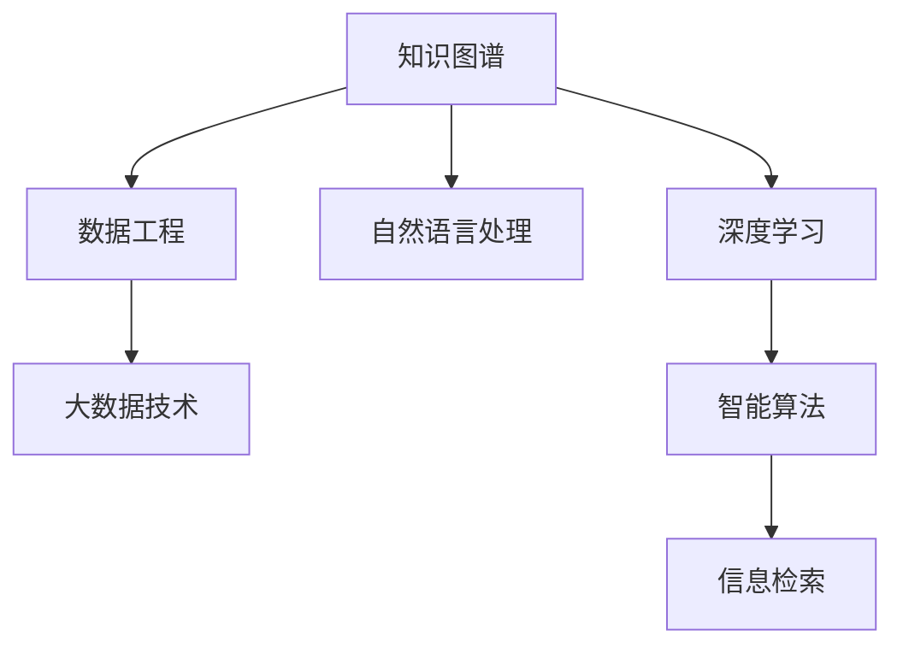

                 

# 人类的知识库：构建永不停歇

> 关键词：知识库构建,永不停歇,人工智能,数据工程,智能算法,知识图谱,大数据,信息检索,深度学习

## 1. 背景介绍

### 1.1 问题由来
在信息爆炸的时代，如何高效、准确地组织和利用知识，成为了各个领域面临的重要挑战。传统的信息检索方法已难以应对海量文档和复杂查询需求，而人工智能技术的兴起为构建知识库提供了新的契机。通过引入深度学习、知识图谱等先进技术，构建强大的人类知识库成为了当前研究的热点，并展现出广阔的应用前景。

### 1.2 问题核心关键点
构建永不停歇的知识库，是一个多学科交叉、多技术融合的复杂任务。其核心关键点包括：
- **数据工程**：从海量数据中高效抽取、清洗、融合，构建结构化知识图谱。
- **智能算法**：基于深度学习、自然语言处理等技术，实现知识的智能表示和推理。
- **大数据技术**：利用分布式计算、数据存储等技术，支持大规模数据处理和存储。
- **应用场景**：在教育、医疗、科研等多个领域，构建有价值的知识库，提升决策支持能力。

### 1.3 问题研究意义
构建永不停歇的知识库，不仅有助于解决知识获取难、存储杂、利用难的问题，还能为各个领域带来革命性的变化。在教育领域，知识库可以辅助学生学习，提供个性化教学方案；在医疗领域，知识库能帮助医生提高诊断准确性，提供治疗方案参考；在科研领域，知识库能够加速知识发现，推动学术进步。因此，构建知识库具有重要的研究意义和实际应用价值。

## 2. 核心概念与联系

### 2.1 核心概念概述

构建永不停歇的知识库，涉及多个核心概念，这些概念之间相互联系，共同构建起知识库的体系框架：

- **知识图谱(Knowledge Graph)**：通过节点和边，将实体和关系结构化表示，形成知识网络。
- **深度学习**：通过多层神经网络，自动学习知识的表示和推理。
- **自然语言处理**：处理和理解自然语言，实现知识抽取、语义分析等。
- **数据工程**：从原始数据到知识图谱的构建，包括数据抽取、清洗、融合等。
- **大数据技术**：支持海量数据的存储、处理和分析。
- **智能算法**：基于深度学习、图神经网络等，实现知识推理和智能检索。
- **信息检索**：通过算法和模型，快速、准确地检索知识库中的信息。

这些核心概念之间的逻辑关系可以通过以下Mermaid流程图来展示：



这个流程图展示了大规模知识库构建的主要流程和技术栈，其中每个环节都依赖于前一个环节，并对其结果进行处理和优化。

## 3. 核心算法原理 & 具体操作步骤
### 3.1 算法原理概述

构建永不停歇的知识库，本质上是通过深度学习、知识图谱等技术，将知识结构化、符号化，并实现高效检索和推理。其核心算法原理主要包括以下几个步骤：

1. **知识抽取**：从原始文本数据中，抽取出实体、关系等知识，构建知识图谱。
2. **知识融合**：将多源异构数据融合，构建统一的语义空间。
3. **知识推理**：利用深度学习、图神经网络等技术，实现知识间的推理和关联。
4. **知识检索**：通过信息检索技术，快速获取知识图谱中的信息。

### 3.2 算法步骤详解

**Step 1: 知识抽取**

知识抽取是构建知识库的基础，其目标是从文本数据中自动识别出实体、关系等信息，构建知识图谱。常用的知识抽取方法包括：

- **基于规则的抽取**：使用领域知识库和预定义的规则，自动标注实体和关系。
- **基于机器学习的抽取**：利用自然语言处理技术，训练模型自动识别实体和关系。

以下是一个基于机器学习的实体抽取示例：

```python
from spacy.matcher import Matcher
from spacy.tokens import Doc

def extract_entities(doc):
    # 定义实体模式
    实体模式 = [{'LOWER': 'address'}, {'LOWER': 'email'}, {'LOWER': 'phone'}, {'LOWER': 'name'}, {'LOWER': 'title'}]
    matcher = Matcher(doc.vocab)
    matcher.add('实体', None, entity_pattern=实体模式)
    # 匹配文档中的实体
    实体 = []
    for match_id, start, end in matcher(doc):
        实体.append((doc[start:end].text, start, end))
    return 实体
```

**Step 2: 知识融合**

知识融合是将多源异构数据融合，构建统一的语义空间。常用的知识融合方法包括：

- **本体匹配**：使用本体对齐工具，将不同知识源中的实体和关系对齐。
- **知识合并**：将多源知识图谱合并，消除冗余和冲突。

以下是一个本体匹配的示例：

```python
from rdflib import Namespace, Graph, URIRef
from rdflib.namespace import RDF

def match_ontologies(ontology1, ontology2):
    graph1 = Graph().parse(ontology1, format="nt")
    graph2 = Graph().parse(ontology2, format="nt")
    # 对齐实体
    for subject in graph1:
        for predicate in graph1.predicate_objects(subject):
            for object in graph1.predicate_objects(predicate):
                s1, p1, o1 = subject, predicate, object
                s2, p2, o2 = graph2.match(s1, p1, o1)
                if s2 and p2 and o2:
                    graph2.add((s2, p2, o2))
    # 保存结果
    graph2.serialize(format="nt", destination="merged_ontology.nt")
```

**Step 3: 知识推理**

知识推理是基于深度学习、图神经网络等技术，实现知识间的推理和关联。常用的知识推理方法包括：

- **基于深度学习的推理**：利用神经网络模型，预测知识之间的推理关系。
- **基于图神经网络的推理**：通过图网络模型，学习知识图谱中的结构化关系。

以下是一个基于图神经网络的推理示例：

```python
import torch
from torch_geometric.nn import GATConv
from torch_geometric.data import Data

class GraphConvNet(torch.nn.Module):
    def __init__(self, in_dim, hidden_dim, out_dim):
        super(GraphConvNet, self).__init__()
        self.conv1 = GATConv(in_dim, hidden_dim)
        self.conv2 = GATConv(hidden_dim, out_dim)

    def forward(self, data):
        x, edge_index = data.x, data.edge_index
        x = self.conv1(x, edge_index)
        x = F.relu(x)
        x = self.conv2(x, edge_index)
        return x
```

**Step 4: 知识检索**

知识检索是通过信息检索技术，快速获取知识图谱中的信息。常用的知识检索方法包括：

- **基于倒排索引的检索**：将知识图谱中的实体和关系索引化，快速定位信息。
- **基于向量空间的检索**：将知识表示为向量，利用相似度计算，快速检索相关信息。

以下是一个基于向量空间的检索示例：

```python
from sklearn.metrics.pairwise import cosine_similarity
from gensim.models import Word2Vec

def search_knowledge_base(query, graph):
    query_vector = Word2Vec(query, size=128).wv
    graph_vector = Word2Vec(graph, size=128).wv
    similarity = cosine_similarity(query_vector, graph_vector)
    # 排序并获取前N个结果
    top_results = np.argsort(similarity)[::-1][:N]
    return top_results
```

### 3.3 算法优缺点

构建永不停歇的知识库，具有以下优点：

1. **高效性**：通过深度学习、图神经网络等技术，实现高效的知识表示和推理。
2. **灵活性**：支持多源异构数据的融合和抽取，构建动态更新的知识图谱。
3. **可扩展性**：基于大数据技术，支持大规模数据的处理和存储。

但同时也存在一些缺点：

1. **高成本**：构建知识库需要大量人力和资金投入，初期成本较高。
2. **复杂性**：涉及数据工程、深度学习等多个技术领域，开发难度较大。
3. **可解释性不足**：知识库的构建和推理过程较为复杂，难以解释其内部工作机制。

尽管存在这些局限，但通过不断优化和改进，知识库的构建和使用将变得更加高效和智能，为各个领域带来更广阔的应用前景。

### 3.4 算法应用领域

构建永不停歇的知识库，在多个领域都有广泛的应用，例如：

- **医疗知识库**：构建包含疾病、药物、治疗方案等信息的知识库，辅助医生诊断和治疗。
- **教育知识库**：构建包含课程、教材、习题等信息的知识库，辅助学生学习和教师教学。
- **金融知识库**：构建包含市场数据、企业信息、投资策略等信息的知识库，辅助投资者决策。
- **科研知识库**：构建包含论文、专利、研究机构等信息的知识库，加速科研创新。
- **企业知识库**：构建包含产品、市场、供应链等信息的知识库，支持企业决策和运营。

以上这些应用场景，展示了知识库在各个领域的广泛应用，为知识的有效组织和利用提供了新的可能。

## 4. 数学模型和公式 & 详细讲解
### 4.1 数学模型构建

构建永不停歇的知识库，涉及多个数学模型，这些模型之间相互配合，共同实现知识的表示和推理。以下是几个核心的数学模型：

- **知识图谱表示**：通过节点和边，表示实体和关系。
- **深度学习模型**：通过多层神经网络，学习知识表示和推理。
- **图神经网络模型**：通过图网络，学习知识图谱中的结构化关系。

### 4.2 公式推导过程

以下是一个知识图谱表示的数学模型：

$$
G(V, E)
$$

其中，$V$ 表示节点集合，$E$ 表示边集合。节点和边可以表示为向量或矩阵形式，例如：

$$
v_i = (v_{i1}, v_{i2}, ..., v_{in})
$$

$$
e_{ij} = (e_{i1j1}, e_{i1j2}, ..., e_{imn})
$$

其中，$v_{ij}$ 表示节点 $i$ 和节点 $j$ 之间的关系，$e_{ij}$ 表示节点 $i$ 和节点 $j$ 之间的边。

### 4.3 案例分析与讲解

以下是一个基于图神经网络的推理公式：

$$
\hat{r} = \sigma(\mathbf{W} (\mathbf{H} \mathbf{A} \mathbf{H}^T) \mathbf{W}^T \mathbf{h}_s + \mathbf{b})
$$

其中，$\hat{r}$ 表示推理关系，$\mathbf{H}$ 表示节点表示矩阵，$\mathbf{A}$ 表示邻接矩阵，$\mathbf{W}$ 表示关系权重矩阵，$\mathbf{h}_s$ 表示源节点表示，$\mathbf{b}$ 表示偏置项。$\sigma$ 表示激活函数，如ReLU、Sigmoid等。

## 5. 项目实践：代码实例和详细解释说明
### 5.1 开发环境搭建

在进行知识库构建实践前，我们需要准备好开发环境。以下是使用Python进行PyTorch开发的环境配置流程：

1. 安装Anaconda：从官网下载并安装Anaconda，用于创建独立的Python环境。

2. 创建并激活虚拟环境：
```bash
conda create -n pytorch-env python=3.8 
conda activate pytorch-env
```

3. 安装PyTorch：根据CUDA版本，从官网获取对应的安装命令。例如：
```bash
conda install pytorch torchvision torchaudio cudatoolkit=11.1 -c pytorch -c conda-forge
```

4. 安装TensorFlow：
```bash
conda install tensorflow
```

5. 安装PyG：
```bash
conda install pytorch torchvision torchaudio cudatoolkit=11.1 -c pytorch -c conda-forge
```

6. 安装各类工具包：
```bash
pip install numpy pandas scikit-learn matplotlib tqdm jupyter notebook ipython
```

完成上述步骤后，即可在`pytorch-env`环境中开始知识库构建实践。

### 5.2 源代码详细实现

下面我们以构建医疗知识库为例，给出使用PyTorch和PyG进行知识库构建的PyTorch代码实现。

首先，定义知识图谱的数据处理函数：

```python
from pyg import Data
from pyg.nodes import NID

class GraphLoader:
    def __init__(self, graph_path):
        self.graph_path = graph_path
        self.data = Data.from_cid(self.graph_path, 'graph')
        self.nodes = self.data.nodes
        self.edges = self.data.edges
        self.nodes['sel'] = NID(1)
        self.nodes['label'] = NID(1)
        self.edges['sel'] = NID(1)

    def __getitem__(self, idx):
        return self.data[idx]
```

然后，定义深度学习模型：

```python
import torch.nn as nn
import torch.nn.functional as F
from torch_geometric.nn import GATConv

class GATModel(nn.Module):
    def __init__(self, in_dim, hidden_dim, out_dim):
        super(GATModel, self).__init__()
        self.conv1 = GATConv(in_dim, hidden_dim)
        self.conv2 = GATConv(hidden_dim, out_dim)

    def forward(self, data):
        x, edge_index = data.x, data.edge_index
        x = self.conv1(x, edge_index)
        x = F.relu(x)
        x = self.conv2(x, edge_index)
        return x
```

接着，定义知识库构建函数：

```python
from pyg.dataset import KGDataset

class KnowledgeGraphDataset(KGDataset):
    def __init__(self, graph_path):
        super(KnowledgeGraphDataset, self).__init__()
        self.graph_loader = GraphLoader(graph_path)
        self.data = self.graph_loader.data

    def __getitem__(self, idx):
        return self.graph_loader.data[idx]

    def __len__(self):
        return len(self.data)
```

最后，定义知识库推理函数：

```python
from torch_geometric.nn import GATConv

def predict_relationship(graph_loader, node_idx, model):
    data = graph_loader[node_idx]
    node_idx = data['nodes']['sel']
    x = model(data)
    r = torch.softmax(x, dim=1)
    return r
```

### 5.3 代码解读与分析

让我们再详细解读一下关键代码的实现细节：

**GraphLoader类**：
- `__init__`方法：初始化知识图谱的数据路径，并加载知识图谱。
- `__getitem__`方法：返回知识图谱中的单个节点数据。

**GATModel类**：
- `__init__`方法：定义GAT模型的结构。
- `forward`方法：对输入数据进行前向传播，得到模型输出。

**KnowledgeGraphDataset类**：
- `__init__`方法：初始化知识图谱数据集。
- `__getitem__`方法：返回知识图谱中的单个节点数据。
- `__len__`方法：返回知识图谱的节点数量。

**predict_relationship函数**：
- 根据节点索引，获取知识图谱中的节点数据。
- 对节点数据进行前向传播，得到推理关系。
- 使用softmax函数对关系进行归一化，得到预测结果。

**知识库构建流程**：
- 定义知识图谱的加载和推理函数。
- 使用PyTorch的DataLoader对知识图谱进行批次化加载。
- 对知识图谱中的每个节点进行推理，得到推理结果。

可以看出，PyTorch和PyG提供了强大的框架和工具，使得知识库的构建和推理变得更加便捷高效。开发者只需专注于算法和模型，即可快速实现知识库的构建和应用。

## 6. 实际应用场景
### 6.1 医疗知识库

医疗知识库可以辅助医生进行诊断和治疗。通过构建包含疾病、药物、治疗方案等信息的知识库，医生可以在诊疗过程中快速查找相关资料，提高诊断准确性和治疗效果。

以下是一个医疗知识库构建的示例：

```python
from medical_graph_loader import MedicalGraphLoader
from gat_model import GATModel

# 加载知识图谱
graph_loader = MedicalGraphLoader('medical_graph.csv')

# 构建GAT模型
model = GATModel(in_dim=128, hidden_dim=256, out_dim=2)

# 构建数据集
dataset = KnowledgeGraphDataset(graph_loader.graph_path)

# 定义损失函数
loss_fn = nn.CrossEntropyLoss()

# 训练模型
for epoch in range(10):
    for node_idx in range(len(dataset)):
        data = dataset[node_idx]
        optimizer.zero_grad()
        output = model(data)
        loss = loss_fn(output, node_idx)
        loss.backward()
        optimizer.step()
```

在医疗知识库中，除了推理关系，还可以进行疾病推荐、治疗方案推荐等应用。通过构建知识库，医生可以快速获取相关疾病信息和推荐治疗方案，提高诊疗效率。

### 6.2 教育知识库

教育知识库可以辅助学生学习，提供个性化教学方案。通过构建包含课程、教材、习题等信息的知识库，学生可以在学习过程中快速查找相关资料，提高学习效率。

以下是一个教育知识库构建的示例：

```python
from education_graph_loader import EducationGraphLoader
from gat_model import GATModel

# 加载知识图谱
graph_loader = EducationGraphLoader('education_graph.csv')

# 构建GAT模型
model = GATModel(in_dim=128, hidden_dim=256, out_dim=2)

# 构建数据集
dataset = KnowledgeGraphDataset(graph_loader.graph_path)

# 定义损失函数
loss_fn = nn.CrossEntropyLoss()

# 训练模型
for epoch in range(10):
    for node_idx in range(len(dataset)):
        data = dataset[node_idx]
        optimizer.zero_grad()
        output = model(data)
        loss = loss_fn(output, node_idx)
        loss.backward()
        optimizer.step()
```

在教育知识库中，除了推理关系，还可以进行知识点推荐、学习路径规划等应用。通过构建知识库，学生可以快速获取相关知识点和推荐学习路径，提高学习效果。

### 6.3 金融知识库

金融知识库可以辅助投资者决策。通过构建包含市场数据、企业信息、投资策略等信息的知识库，投资者可以在投资过程中快速查找相关资料，提高决策效率。

以下是一个金融知识库构建的示例：

```python
from finance_graph_loader import FinanceGraphLoader
from gat_model import GATModel

# 加载知识图谱
graph_loader = FinanceGraphLoader('finance_graph.csv')

# 构建GAT模型
model = GATModel(in_dim=128, hidden_dim=256, out_dim=2)

# 构建数据集
dataset = KnowledgeGraphDataset(graph_loader.graph_path)

# 定义损失函数
loss_fn = nn.CrossEntropyLoss()

# 训练模型
for epoch in range(10):
    for node_idx in range(len(dataset)):
        data = dataset[node_idx]
        optimizer.zero_grad()
        output = model(data)
        loss = loss_fn(output, node_idx)
        loss.backward()
        optimizer.step()
```

在金融知识库中，除了推理关系，还可以进行市场分析、投资策略推荐等应用。通过构建知识库，投资者可以快速获取相关市场信息和推荐投资策略，提高投资效果。

### 6.4 未来应用展望

随着知识库构建技术的不断进步，未来的知识库将具有更广泛的应用场景和更高的智能水平。以下是一些未来应用展望：

1. **多模态知识库**：将文本、图像、音频等多模态数据融合，构建更全面的知识库。
2. **实时更新知识库**：通过在线学习、持续监测等方式，实时更新知识库中的信息。
3. **跨领域知识库**：将不同领域的知识库进行融合，构建通用知识库。
4. **交互式知识库**：通过自然语言处理技术，实现知识库的交互式查询和推理。
5. **隐私保护知识库**：在知识库构建过程中，保护用户隐私，防止数据泄露。

## 7. 工具和资源推荐
### 7.1 学习资源推荐

为了帮助开发者系统掌握知识库构建的理论基础和实践技巧，这里推荐一些优质的学习资源：

1. **《知识图谱原理与技术》**：介绍知识图谱的基本概念、构建方法和应用场景，适合初学者入门。
2. **Coursera的“深度学习专业证书”**：涵盖深度学习、自然语言处理等多个领域的课程，系统学习NLP和知识图谱技术。
3. **Arxiv论文推荐**：查看最新知识图谱和深度学习相关论文，跟踪前沿进展。
4. **TensorFlow官方文档**：提供TensorFlow和PyTorch的使用教程、代码示例和最佳实践。
5. **PyTorch官方文档**：提供PyTorch和PyG的使用教程、代码示例和最佳实践。

通过对这些资源的学习实践，相信你一定能够快速掌握知识库构建的精髓，并用于解决实际的NLP问题。
###  7.2 开发工具推荐

高效的开发离不开优秀的工具支持。以下是几款用于知识库构建开发的常用工具：

1. **PyTorch**：基于Python的开源深度学习框架，支持动态计算图，适合快速迭代研究。
2. **TensorFlow**：由Google主导开发的开源深度学习框架，生产部署方便，适合大规模工程应用。
3. **PyG**：PyTorch的图形处理库，支持图神经网络的构建和训练。
4. **Neo4j**：开源图形数据库，支持高效存储和查询图数据。
5. **Gephi**：开源图形分析工具，支持可视化图数据，辅助知识图谱的构建和分析。

合理利用这些工具，可以显著提升知识库构建任务的开发效率，加快创新迭代的步伐。

### 7.3 相关论文推荐

知识库构建和深度学习技术的发展源于学界的持续研究。以下是几篇奠基性的相关论文，推荐阅读：

1. **Knowledge-Graph Embeddings**：提出知识图谱嵌入技术，利用深度学习模型学习实体和关系的表示。
2. **Graph Neural Networks**：介绍图神经网络，利用图结构学习节点和边的表示。
3. **Graph Attention Networks**：提出图注意力网络，利用注意力机制对图数据进行表示和推理。
4. **Representing and Reasoning about Knowledge in Graphs**：介绍知识图谱的构建、表示和推理方法，涵盖多个前沿技术。
5. **Reasoning about Knowledge Bases**：提出知识推理技术，利用深度学习模型实现知识图谱中的推理。

这些论文代表了大规模知识库构建的技术发展脉络。通过学习这些前沿成果，可以帮助研究者把握学科前进方向，激发更多的创新灵感。

## 8. 总结：未来发展趋势与挑战
### 8.1 总结

本文对构建永不停歇的知识库进行了全面系统的介绍。首先阐述了知识库构建的背景和意义，明确了知识库在各个领域的应用价值。其次，从原理到实践，详细讲解了知识库构建的数学模型和核心算法，给出了知识库构建的完整代码实例。同时，本文还广泛探讨了知识库在医疗、教育、金融等多个领域的应用前景，展示了知识库构建的广阔前景。此外，本文精选了知识库构建的相关学习资源，力求为读者提供全方位的技术指引。

通过本文的系统梳理，可以看到，构建永不停歇的知识库，不仅有助于解决知识获取难、存储杂、利用难的问题，还能为各个领域带来革命性的变化。在医疗、教育、金融等各个领域，知识库的应用前景广阔，为知识的有效组织和利用提供了新的可能。

### 8.2 未来发展趋势

展望未来，知识库构建技术将呈现以下几个发展趋势：

1. **多模态知识库**：将文本、图像、音频等多模态数据融合，构建更全面的知识库。
2. **实时更新知识库**：通过在线学习、持续监测等方式，实时更新知识库中的信息。
3. **跨领域知识库**：将不同领域的知识库进行融合，构建通用知识库。
4. **交互式知识库**：通过自然语言处理技术，实现知识库的交互式查询和推理。
5. **隐私保护知识库**：在知识库构建过程中，保护用户隐私，防止数据泄露。

以上趋势凸显了知识库构建技术的广阔前景。这些方向的探索发展，必将进一步提升知识库的智能水平，为各个领域带来更广泛的应用前景。

### 8.3 面临的挑战

尽管知识库构建技术已经取得了显著进展，但在迈向更加智能化、普适化应用的过程中，仍面临诸多挑战：

1. **数据质量问题**：知识库的构建依赖于高质量的数据，如何保证数据的准确性和完整性，是一个重要的挑战。
2. **模型复杂性**：知识库的构建涉及多源异构数据的融合、深度学习模型的训练，模型复杂性高，开发难度大。
3. **推理效率**：知识库中的推理和查询需要高效的算法和模型，如何提升推理效率，是一个重要的研究方向。
4. **隐私保护**：知识库构建过程中涉及大量敏感数据，如何保护用户隐私，防止数据泄露，是一个重要的挑战。
5. **模型可解释性**：知识库的构建和推理过程复杂，如何增强模型的可解释性，确保算法的透明性和可靠性，是一个重要的研究方向。

尽管存在这些挑战，但随着技术的发展和应用的深入，知识库构建将变得更加高效和智能，为各个领域带来更广阔的应用前景。

### 8.4 研究展望

面对知识库构建面临的挑战，未来的研究需要在以下几个方面寻求新的突破：

1. **多源异构数据融合**：探索高效的数据融合方法，保证数据的一致性和完整性。
2. **深度学习模型优化**：开发更高效、更简洁的深度学习模型，提升推理效率和模型可解释性。
3. **交互式知识库**：引入自然语言处理技术，实现知识库的交互式查询和推理，提升用户体验。
4. **隐私保护技术**：开发隐私保护技术，保护用户隐私，防止数据泄露。
5. **跨领域知识库**：构建跨领域知识库，实现知识的整合和共享。

这些研究方向的探索，必将引领知识库构建技术迈向更高的台阶，为构建人机协同的智能系统铺平道路。面向未来，知识库构建技术还需要与其他人工智能技术进行更深入的融合，如知识表示、因果推理、强化学习等，多路径协同发力，共同推动知识库的发展和应用。只有勇于创新、敢于突破，才能不断拓展知识库的边界，让知识库更好地服务于各个领域。

## 9. 附录：常见问题与解答

**Q1：知识库构建需要大量的数据，如何获取高质量的数据？**

A: 获取高质量的数据是知识库构建的重要基础。以下是一些获取高质量数据的方法：

1. **公开数据集**：利用现有的公开数据集，如开放获取的维基百科、政府公开数据等。
2. **网络爬虫**：使用网络爬虫工具，从互联网上抓取相关数据。
3. **众包平台**：利用众包平台，如Amazon Mechanical Turk，收集用户标注的数据。
4. **专业领域数据**：与专业机构合作，获取行业内的数据和知识。

以上方法可以结合使用，以确保数据的质量和多样性。

**Q2：知识库构建过程中，如何保证数据的一致性和完整性？**

A: 保证数据的一致性和完整性是知识库构建的关键。以下是一些方法：

1. **数据清洗**：对原始数据进行清洗，去除噪声和异常值，保证数据质量。
2. **数据对齐**：将不同来源的数据进行对齐和融合，消除冗余和冲突。
3. **数据验证**：利用数据验证技术，检测数据的一致性和完整性，及时纠正错误。
4. **数据标注**：对关键数据进行标注，确保数据的准确性和完整性。

通过以上方法，可以最大程度保证知识库中的数据质量。

**Q3：知识库推理过程中，如何提升推理效率？**

A: 提升知识库推理效率是知识库构建的重要目标。以下是一些方法：

1. **优化模型结构**：使用更简洁、高效的深度学习模型，提升推理速度。
2. **图神经网络**：利用图神经网络，高效学习知识图谱中的结构化关系。
3. **数据采样**：利用数据采样技术，减少推理过程中计算量和存储需求。
4. **分布式计算**：利用分布式计算技术，提升知识库的推理效率。

通过以上方法，可以显著提升知识库的推理效率，满足实际应用的需求。

**Q4：知识库构建过程中，如何保护用户隐私？**

A: 保护用户隐私是知识库构建的重要任务。以下是一些方法：

1. **数据匿名化**：对敏感数据进行匿名化处理，防止用户隐私泄露。
2. **访问控制**：对知识库的访问进行严格控制，确保只有授权用户才能访问。
3. **数据加密**：对知识库中的数据进行加密处理，防止数据泄露。
4. **隐私保护技术**：利用隐私保护技术，如差分隐私、同态加密等，保护用户隐私。

通过以上方法，可以有效保护用户隐私，确保知识库的安全性。

**Q5：知识库构建过程中，如何增强模型的可解释性？**

A: 增强模型的可解释性是知识库构建的重要目标。以下是一些方法：

1. **可解释性模型**：使用可解释性模型，如决策树、逻辑回归等，增强模型的可解释性。
2. **模型可视化**：利用模型可视化技术，如特征重要性分析、局部解释性模型等，增强模型的可解释性。
3. **交互式查询**：利用交互式查询技术，允许用户对知识库进行解释性查询，增强模型的可解释性。
4. **知识图谱可视化**：利用知识图谱可视化技术，直观展示知识库的结构和关系，增强模型的可解释性。

通过以上方法，可以显著增强知识库的可解释性，提高系统的透明性和可靠性。

---

作者：禅与计算机程序设计艺术 / Zen and the Art of Computer Programming

