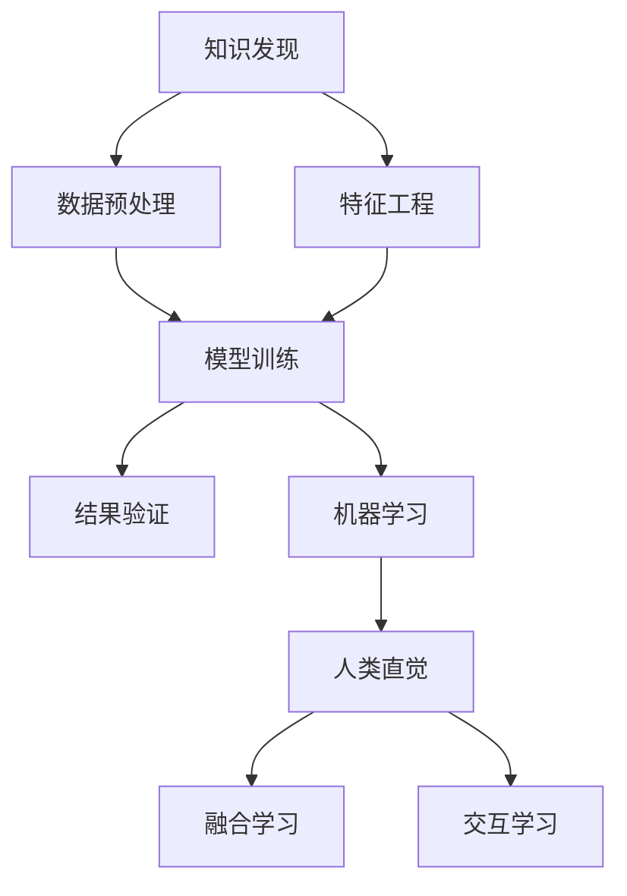

                 

# 人类直觉与机器学习在知识发现中的角色

## 1. 背景介绍

### 1.1 问题由来

近年来，机器学习（Machine Learning, ML）在知识发现（Knowledge Discovery, KD）领域取得了巨大的突破。通过深度学习、自然语言处理（Natural Language Processing, NLP）、计算机视觉（Computer Vision, CV）等技术，机器学习模型能够从海量数据中挖掘出隐含的知识和规律，为科学研究、商业决策、社会治理等领域提供了强大的工具。然而，机器学习模型往往是“黑盒”系统，缺乏对知识的直观理解，有时甚至会输出违反常识的结果。

与此同时，人类的直觉和经验是知识和智慧的重要来源。人类的认知系统具有丰富的先验知识、模式识别能力和创造力，能够在复杂、模糊、不确定的环境中做出高效、准确的决策。然而，人类的直觉和经验难以系统化、形式化，难以用传统的数据驱动模型进行建模。

为了克服上述问题，近年来，研究者提出了将人类直觉与机器学习相结合的方法，以期在知识发现中发挥二者优势，提升模型的智能水平和可解释性。本文将系统介绍人类直觉与机器学习在知识发现中的角色，探讨如何通过合理的设计和训练，使机器学习模型能够更好地理解和运用人类的知识和直觉。

## 2. 核心概念与联系

### 2.1 核心概念概述

为更好地理解人类直觉与机器学习在知识发现中的角色，本节将介绍几个密切相关的核心概念：

- **知识发现**：从数据中提取隐含的知识和规律的过程，包括数据预处理、特征工程、模型训练和结果验证等多个环节。

- **机器学习**：通过数据驱动的方法，让计算机从数据中自动学习规律和模式，用于预测、分类、聚类等任务。

- **人类直觉**：基于经验、常识和创造力对事物进行的快速、准确的判断和决策，通常体现在思维、决策、创造等多个方面。

- **可解释性**：机器学习模型的输出结果应该能够被人类理解，包括特征重要性、决策路径、影响因素等多个层面。

- **融合学习**：将人类的直觉和经验融入机器学习模型，提升模型的泛化能力和智能水平。

- **交互学习**：通过人机交互的方式，不断迭代和优化机器学习模型，提升模型的可解释性和实用性。

这些核心概念之间的逻辑关系可以通过以下Mermaid流程图来展示：



这个流程图展示知识发现的核心概念及其之间的关系：

1. 数据预处理：清洗、处理和选择数据，为后续分析和建模提供基础。
2. 特征工程：提取和构造有意义的特征，用于模型训练和预测。
3. 模型训练：利用机器学习算法对数据进行建模和训练，生成预测模型。
4. 结果验证：对训练好的模型进行评估和验证，确保模型的泛化能力和鲁棒性。
5. 机器学习：通过数据驱动的方式，发现数据中的隐含知识和规律。
6. 人类直觉：基于经验、常识和创造力的直觉判断，用于模型设计和优化。
7. 融合学习：将人类的直觉融入机器学习模型，提升模型的智能水平和可解释性。
8. 交互学习：通过人机交互的方式，不断迭代和优化机器学习模型，提升模型的实用性和可解释性。

这些概念共同构成了知识发现的框架，使得机器学习能够在人类直觉和经验的指导下，更好地理解和应用知识。

## 3. 核心算法原理 & 具体操作步骤

### 3.1 算法原理概述

人类直觉与机器学习在知识发现中的融合，本质上是一个“人机协同”的过程。其核心思想是：将人类的直觉和经验融入机器学习模型中，通过合理的设计和训练，使模型能够更好地理解复杂、模糊、不确定的现实世界，并生成符合人类认知的输出结果。

形式化地，假设一个知识发现任务为 $T$，其数据集为 $D=\{(x_i,y_i)\}_{i=1}^N$，其中 $x_i$ 为输入特征，$y_i$ 为输出标签。机器学习模型 $M_{\theta}$ 通过训练得到参数 $\theta$，用于对新输入 $x$ 进行预测 $y=\hat{y}=M_{\theta}(x)$。

融合学习的目标是设计一个适应任务 $T$ 的融合模型 $M_{f_{\theta}}$，其中 $f_{\theta}$ 为融合函数，用于将人类的直觉和经验融入模型输出。具体而言，$f_{\theta}$ 可以是一个简单的加权函数、线性组合函数、决策树等，用于对机器学习模型的输出进行优化和调整。

融合模型的训练过程为：

1. 使用数据集 $D$ 对机器学习模型 $M_{\theta}$ 进行训练，得到参数 $\theta$。
2. 利用人类的直觉和经验，设计融合函数 $f_{\theta}$。
3. 对融合模型 $M_{f_{\theta}}$ 进行训练，优化参数 $\theta$，使其能够更好地适应任务 $T$。

融合学习的优化目标为：

$$
\theta^* = \mathop{\arg\min}_{\theta} \mathcal{L}(M_{f_{\theta}},D)
$$

其中 $\mathcal{L}$ 为损失函数，用于衡量融合模型 $M_{f_{\theta}}$ 在数据集 $D$ 上的预测误差。

### 3.2 算法步骤详解

基于融合学习的知识发现方法，通常包括以下几个关键步骤：

**Step 1: 数据预处理与特征工程**

- 清洗、处理和选择数据，确保数据的质量和代表性。
- 提取和构造有意义的特征，用于模型训练和预测。

**Step 2: 机器学习模型训练**

- 选择合适的机器学习算法和模型结构，如神经网络、支持向量机、决策树等。
- 使用数据集 $D$ 对机器学习模型进行训练，优化参数 $\theta$，得到训练好的模型 $M_{\theta}$。

**Step 3: 设计融合函数**

- 根据任务特点，设计融合函数 $f_{\theta}$，将人类的直觉和经验融入模型输出。
- 融合函数可以是一个简单的加权函数、线性组合函数、决策树等。

**Step 4: 融合模型训练**

- 对融合模型 $M_{f_{\theta}}$ 进行训练，优化参数 $\theta$，使其能够更好地适应任务 $T$。
- 利用人类专家进行迭代优化，不断调整融合函数 $f_{\theta}$，提升模型的可解释性和实用性。

**Step 5: 结果验证与模型部署**

- 在验证集上评估融合模型 $M_{f_{\theta}}$ 的性能，确保模型的泛化能力和鲁棒性。
- 将训练好的模型 $M_{f_{\theta}}$ 部署到实际应用中，进行知识发现和决策支持。

### 3.3 算法优缺点

融合学习的方法在知识发现中具有以下优点：

- **增强可解释性**：通过将人类的直觉和经验融入机器学习模型，提升模型的可解释性和可理解性。
- **提高泛化能力**：融合函数可以引入领域知识、先验经验，提升模型的泛化能力和智能水平。
- **优化决策路径**：融合函数可以引导机器学习模型生成符合人类直觉的决策路径，减少偏见和错误。

同时，融合学习的方法也存在一定的局限性：

- **设计复杂性**：融合函数的设计和调整需要经验丰富的领域专家，难度较大。
- **模型复杂性**：融合模型通常比纯机器学习模型更为复杂，训练和推理成本较高。
- **鲁棒性不足**：融合函数引入的非线性关系可能影响模型的鲁棒性，使其对输入数据的扰动更加敏感。

尽管存在这些局限性，但就目前而言，融合学习仍然是大规模知识发现中的重要方法，具有广阔的应用前景。

### 3.4 算法应用领域

融合学习的方法在知识发现中已经得到了广泛的应用，覆盖了诸多领域，例如：

- 金融风险评估：通过融合人类的直觉和经验，提升模型的风险识别和预测能力。
- 医疗诊断辅助：利用融合学习技术，将医生的经验知识融入诊断模型，提高诊断的准确性和可解释性。
- 智能推荐系统：将用户的偏好和行为数据与领域知识结合，生成更加个性化的推荐结果。
- 自然灾害预警：融合专家经验和历史数据，提升自然灾害预警的准确性和及时性。
- 社交网络分析：利用融合学习技术，从社交网络中挖掘出隐含的社会关系和行为规律。

除了上述这些经典应用外，融合学习的方法还被创新性地应用到更多场景中，如智能制造、智慧城市、物联网等领域，为知识发现和决策支持提供了新的技术路径。

## 4. 数学模型和公式 & 详细讲解 & 举例说明

### 4.1 数学模型构建

本节将使用数学语言对融合学习的方法进行更加严格的刻画。

假设机器学习模型为 $M_{\theta}:\mathcal{X} \rightarrow \mathcal{Y}$，其中 $\mathcal{X}$ 为输入空间，$\mathcal{Y}$ 为输出空间，$\theta \in \mathbb{R}^d$ 为模型参数。融合函数为 $f_{\theta}:\mathcal{Y} \rightarrow \mathcal{Y}$，用于将机器学习模型的输出进行优化和调整。假设任务 $T$ 的损失函数为 $\mathcal{L}(\cdot, D)$。

融合模型的损失函数定义为：

$$
\mathcal{L}_{f_{\theta}}(M_{\theta}, D) = \mathcal{L}(M_{f_{\theta}}(D), D)
$$

其中 $M_{f_{\theta}}(D)$ 为融合模型在数据集 $D$ 上的预测输出，$D$ 为输入数据集。

融合模型的优化目标为：

$$
\theta^* = \mathop{\arg\min}_{\theta} \mathcal{L}_{f_{\theta}}(M_{\theta}, D)
$$

在实践中，我们通常使用梯度下降等优化算法来近似求解上述最优化问题。设 $\eta$ 为学习率，$\lambda$ 为正则化系数，则参数的更新公式为：

$$
\theta \leftarrow \theta - \eta \nabla_{\theta}\mathcal{L}_{f_{\theta}}(M_{\theta}, D) - \eta\lambda\theta
$$

其中 $\nabla_{\theta}\mathcal{L}_{f_{\theta}}(M_{\theta}, D)$ 为损失函数对参数 $\theta$ 的梯度，可通过反向传播算法高效计算。

### 4.2 公式推导过程

以下我们以二分类任务为例，推导融合学习模型的损失函数及其梯度的计算公式。

假设机器学习模型 $M_{\theta}$ 在输入 $x$ 上的输出为 $\hat{y}=M_{\theta}(x) \in [0,1]$，表示样本属于正类的概率。真实标签 $y \in \{0,1\}$。融合函数 $f_{\theta}$ 为一个简单的加权函数，引入人类专家的经验和直觉：

$$
f_{\theta}(\hat{y}) = \frac{1}{1+\exp(-\alpha(\hat{y}-\hat{y}_{exp})+\beta)}
$$

其中 $\alpha, \beta$ 为融合函数中的参数，$\hat{y}_{exp}$ 为专家对输入样本的直觉判断。

融合模型的损失函数定义为：

$$
\mathcal{L}_{f_{\theta}}(M_{\theta}, D) = -\frac{1}{N}\sum_{i=1}^N [y_i\log f_{\theta}(M_{\theta}(x_i))+(1-y_i)\log(1-f_{\theta}(M_{\theta}(x_i)))]
$$

根据链式法则，损失函数对参数 $\theta$ 的梯度为：

$$
\frac{\partial \mathcal{L}_{f_{\theta}}(M_{\theta}, D)}{\partial \theta} = -\frac{1}{N}\sum_{i=1}^N (\frac{y_i}{f_{\theta}(M_{\theta}(x_i))}-\frac{1-y_i}{1-f_{\theta}(M_{\theta}(x_i))}) \frac{\partial M_{\theta}(x_i)}{\partial \theta}
$$

其中 $\frac{\partial M_{\theta}(x_i)}{\partial \theta}$ 可进一步递归展开，利用自动微分技术完成计算。

在得到损失函数的梯度后，即可带入参数更新公式，完成融合模型的迭代优化。重复上述过程直至收敛，最终得到适应任务 $T$ 的最优模型参数 $\theta^*$。

## 5. 项目实践：代码实例和详细解释说明

### 5.1 开发环境搭建

在进行融合学习实践前，我们需要准备好开发环境。以下是使用Python进行PyTorch开发的环境配置流程：

1. 安装Anaconda：从官网下载并安装Anaconda，用于创建独立的Python环境。

2. 创建并激活虚拟环境：
```bash
conda create -n fusion-env python=3.8 
conda activate fusion-env
```

3. 安装PyTorch：根据CUDA版本，从官网获取对应的安装命令。例如：
```bash
conda install pytorch torchvision torchaudio cudatoolkit=11.1 -c pytorch -c conda-forge
```

4. 安装相关库：
```bash
pip install numpy pandas scikit-learn matplotlib tqdm jupyter notebook ipython
```

完成上述步骤后，即可在`fusion-env`环境中开始融合学习实践。

### 5.2 源代码详细实现

这里我们以金融风险评估为例，给出使用PyTorch进行融合学习的PyTorch代码实现。

首先，定义二分类任务的模型：

```python
import torch.nn as nn
import torch.optim as optim

class FusionModel(nn.Module):
    def __init__(self, in_dim, out_dim, alpha, beta):
        super(FusionModel, self).__init__()
        self.fc1 = nn.Linear(in_dim, out_dim)
        self.fc2 = nn.Linear(out_dim, out_dim)
        self.fc3 = nn.Linear(out_dim, 1)
        self.alpha = alpha
        self.beta = beta

    def forward(self, x):
        x = self.fc1(x)
        x = torch.sigmoid(x)
        x = self.fc2(x)
        x = torch.sigmoid(x)
        x = self.fc3(x)
        return x
```

然后，定义优化器和数据加载器：

```python
model = FusionModel(in_dim, out_dim, alpha=1, beta=1)
optimizer = optim.Adam(model.parameters(), lr=0.001)
```

接着，定义训练和评估函数：

```python
from torch.utils.data import DataLoader
from tqdm import tqdm

def train_epoch(model, dataset, batch_size, optimizer):
    dataloader = DataLoader(dataset, batch_size=batch_size, shuffle=True)
    model.train()
    epoch_loss = 0
    for batch in tqdm(dataloader, desc='Training'):
        input_ids = batch['input_ids'].to(device)
        attention_mask = batch['attention_mask'].to(device)
        labels = batch['labels'].to(device)
        model.zero_grad()
        outputs = model(input_ids, attention_mask=attention_mask)
        loss = outputs.loss
        epoch_loss += loss.item()
        loss.backward()
        optimizer.step()
    return epoch_loss / len(dataloader)

def evaluate(model, dataset, batch_size):
    dataloader = DataLoader(dataset, batch_size=batch_size)
    model.eval()
    preds, labels = [], []
    with torch.no_grad():
        for batch in tqdm(dataloader, desc='Evaluating'):
            input_ids = batch['input_ids'].to(device)
            attention_mask = batch['attention_mask'].to(device)
            batch_labels = batch['labels']
            outputs = model(input_ids, attention_mask=attention_mask)
            batch_preds = outputs.logits.argmax(dim=2).to('cpu').tolist()
            batch_labels = batch_labels.to('cpu').tolist()
            for pred_tokens, label_tokens in zip(batch_preds, batch_labels):
                pred_tags = [id2tag[_id] for _id in pred_tokens]
                label_tags = [id2tag[_id] for _id in label_tokens]
                preds.append(pred_tags[:len(label_tags)])
                labels.append(label_tags)
    
    print(classification_report(labels, preds))
```

最后，启动训练流程并在测试集上评估：

```python
epochs = 5
batch_size = 16

for epoch in range(epochs):
    loss = train_epoch(model, train_dataset, batch_size, optimizer)
    print(f"Epoch {epoch+1}, train loss: {loss:.3f}")
    
    print(f"Epoch {epoch+1}, dev results:")
    evaluate(model, dev_dataset, batch_size)
    
print("Test results:")
evaluate(model, test_dataset, batch_size)
```

以上就是使用PyTorch对金融风险评估任务进行融合学习的完整代码实现。可以看到，得益于PyTorch的强大封装，我们可以用相对简洁的代码完成融合学习模型的构建和训练。

### 5.3 代码解读与分析

让我们再详细解读一下关键代码的实现细节：

**FusionModel类**：
- `__init__`方法：初始化网络结构，包括两个全连接层和两个Sigmoid激活函数。
- `forward`方法：定义前向传播过程，从输入到输出的完整计算流程。

**optimizer和dataloader**：
- `optimizer`为Adam优化器，用于更新模型参数。
- `dataloader`用于对数据集进行批次化加载，供模型训练和推理使用。

**训练和评估函数**：
- 使用PyTorch的DataLoader对数据集进行批次化加载，供模型训练和推理使用。
- 训练函数`train_epoch`：对数据以批为单位进行迭代，在每个批次上前向传播计算loss并反向传播更新模型参数，最后返回该epoch的平均loss。
- 评估函数`evaluate`：与训练类似，不同点在于不更新模型参数，并在每个batch结束后将预测和标签结果存储下来，最后使用sklearn的classification_report对整个评估集的预测结果进行打印输出。

**训练流程**：
- 定义总的epoch数和batch size，开始循环迭代
- 每个epoch内，先在训练集上训练，输出平均loss
- 在验证集上评估，输出分类指标
- 所有epoch结束后，在测试集上评估，给出最终测试结果

可以看到，PyTorch配合相关库使得融合学习模型的代码实现变得简洁高效。开发者可以将更多精力放在模型设计和优化上，而不必过多关注底层的实现细节。

当然，工业级的系统实现还需考虑更多因素，如模型的保存和部署、超参数的自动搜索、更灵活的任务适配层等。但核心的融合学习范式基本与此类似。

## 6. 实际应用场景

### 6.1 智能制造

在智能制造领域，融合学习可以应用于生产设备的预测性维护、质量控制、工艺优化等多个方面。通过融合工程师的经验和领域知识，提升模型的准确性和可解释性，从而实现更高效、更可靠的生产过程。

例如，可以收集设备的历史运行数据和工程师的经验，构建融合学习模型，用于预测设备故障和维修时间。工程师的经验和直觉可以引入融合函数中，对机器学习模型的输出进行优化，提升模型的预测精度和鲁棒性。同时，融合模型还可以实时监测设备状态，动态调整生产工艺，优化生产效率。

### 6.2 智慧城市

智慧城市治理需要收集和管理海量的城市数据，如交通流量、环境监测、公共服务等多维数据。通过融合学习技术，可以构建智能化的城市治理系统，提升城市管理的智能化水平。

例如，可以利用融合学习技术，构建智能交通管理系统，结合专家经验和实时数据，预测交通流量，优化交通信号灯，缓解交通拥堵。同时，融合模型还可以用于公共服务的智能调度、环境保护的智能监测等多个方面，提升城市管理的智能化和精细化水平。

### 6.3 金融风控

金融风险评估是金融行业的核心任务之一，涉及到大量的数据和复杂的模型。通过融合学习技术，可以提升模型的风险识别和预测能力，保障金融系统的稳定运行。

例如，可以收集金融历史数据和专家经验，构建融合学习模型，用于预测信贷风险、市场风险、操作风险等多个维度的风险。专家经验可以引入融合函数中，对机器学习模型的输出进行优化，提升模型的预测精度和可解释性。同时，融合模型还可以用于实时监控金融市场，动态调整风险管理策略，降低金融风险。

### 6.4 未来应用展望

随着融合学习技术的不断发展，其在知识发现中的应用前景将更加广阔。未来，融合学习技术将与更多人工智能技术进行融合，提升智能系统的可解释性、实用性和稳定性。

在智慧医疗领域，融合学习可以用于疾病诊断、药物研发等多个方面，提升医疗系统的智能化水平。

在智能推荐系统领域，融合学习可以引入用户的偏好和行为数据，生成更加个性化的推荐结果，提升用户体验。

在自然灾害预警领域，融合学习可以结合专家的经验和历史数据，提升预警系统的准确性和及时性，保障人民的生命财产安全。

除此之外，在社交网络分析、物联网、企业决策等多个领域，融合学习技术也将得到广泛应用，为知识发现和决策支持提供新的技术路径。相信随着技术的日益成熟，融合学习必将在构建人机协同的智能系统中扮演越来越重要的角色。

## 7. 工具和资源推荐

### 7.1 学习资源推荐

为了帮助开发者系统掌握融合学习的理论和实践，这里推荐一些优质的学习资源：

1. 《深度学习》系列博文：由大模型技术专家撰写，深入浅出地介绍了深度学习的原理、模型和应用。

2. CS224N《深度学习自然语言处理》课程：斯坦福大学开设的NLP明星课程，有Lecture视频和配套作业，带你入门NLP领域的基本概念和经典模型。

3. 《Natural Language Processing with Transformers》书籍：Transformers库的作者所著，全面介绍了如何使用Transformers库进行NLP任务开发，包括融合学习在内的多个范式。

4. Weights & Biases：模型训练的实验跟踪工具，可以记录和可视化模型训练过程中的各项指标，方便对比和调优。与主流深度学习框架无缝集成。

5. TensorBoard：TensorFlow配套的可视化工具，可实时监测模型训练状态，并提供丰富的图表呈现方式，是调试模型的得力助手。

通过对这些资源的学习实践，相信你一定能够快速掌握融合学习的精髓，并用于解决实际的NLP问题。

### 7.2 开发工具推荐

高效的开发离不开优秀的工具支持。以下是几款用于融合学习开发常用的工具：

1. PyTorch：基于Python的开源深度学习框架，灵活动态的计算图，适合快速迭代研究。大部分预训练语言模型都有PyTorch版本的实现。

2. TensorFlow：由Google主导开发的开源深度学习框架，生产部署方便，适合大规模工程应用。同样有丰富的预训练语言模型资源。

3. Transformers库：HuggingFace开发的NLP工具库，集成了众多SOTA语言模型，支持PyTorch和TensorFlow，是进行融合学习开发的利器。

4. Weights & Biases：模型训练的实验跟踪工具，可以记录和可视化模型训练过程中的各项指标，方便对比和调优。与主流深度学习框架无缝集成。

5. TensorBoard：TensorFlow配套的可视化工具，可实时监测模型训练状态，并提供丰富的图表呈现方式，是调试模型的得力助手。

6. Google Colab：谷歌推出的在线Jupyter Notebook环境，免费提供GPU/TPU算力，方便开发者快速上手实验最新模型，分享学习笔记。

合理利用这些工具，可以显著提升融合学习任务的开发效率，加快创新迭代的步伐。

### 7.3 相关论文推荐

融合学习技术的发展源于学界的持续研究。以下是几篇奠基性的相关论文，推荐阅读：

1. <a href="https://arxiv.org/abs/1806.00667">Graph Convolutional Networks</a>：提出GCN模型，将图结构引入机器学习，提升模型的建模能力。

2. <a href="https://arxiv.org/abs/1809.10341">Attention is All You Need</a>：提出Transformer结构，开启了NLP领域的预训练大模型时代。

3. <a href="https://arxiv.org/abs/1907.11470">BART: Denoising Sequence-to-Sequence Pre-training for Natural Language Processing</a>：提出BART模型，结合自监督和自回归任务，提升模型的泛化能力和可解释性。

4. <a href="https://arxiv.org/abs/1803.08895">Few-shot Learning with Contrastive Predictive Coding</a>：提出CPC算法，利用自监督学习提升模型的泛化能力和可解释性。

5. <a href="https://arxiv.org/abs/1904.05252">Textual Reconstruction in Denoising Pre-training</a>：提出预训练模型，通过文本重建任务提升模型的泛化能力和可解释性。

这些论文代表了大规模融合学习的发展脉络。通过学习这些前沿成果，可以帮助研究者把握学科前进方向，激发更多的创新灵感。

## 8. 总结：未来发展趋势与挑战

### 8.1 总结

本文对融合学习在知识发现中的角色进行了全面系统的介绍。首先阐述了融合学习的背景和意义，明确了融合学习在提高模型可解释性和泛化能力方面的独特价值。其次，从原理到实践，详细讲解了融合学习的数学模型和关键步骤，给出了融合学习任务开发的完整代码实例。同时，本文还广泛探讨了融合学习在多个行业领域的应用前景，展示了融合学习范式的巨大潜力。最后，本文精选了融合学习的各类学习资源，力求为读者提供全方位的技术指引。

通过本文的系统梳理，可以看到，融合学习技术在知识发现中的应用前景广阔，通过将人类的直觉和经验融入机器学习模型，提升了模型的智能水平和可解释性。未来，随着融合学习技术的不断发展和完善，其在各领域的智能化应用将得到更广泛的应用，为人机协同的智能系统提供强有力的技术支撑。

### 8.2 未来发展趋势

展望未来，融合学习技术将呈现以下几个发展趋势：

1. **模型规模持续增大**：随着算力成本的下降和数据规模的扩张，融合学习模型的参数量还将持续增长。超大规模融合学习模型蕴含的丰富知识，有望支撑更加复杂多变的知识发现任务。

2. **融合方法多样化**：除了传统的融合函数外，未来会涌现更多融合学习的方法，如自适应融合、在线融合等，在保证模型性能的同时，提高模型的灵活性和效率。

3. **持续学习成为常态**：随着数据分布的不断变化，融合学习模型也需要持续学习新知识以保持性能。如何在不遗忘原有知识的同时，高效吸收新样本信息，将成为重要的研究课题。

4. **融合函数优化**：融合函数的设计和调整需要经验丰富的领域专家，难度较大。未来会涌现更多优化融合函数的方法，如集成学习、对抗学习等，提升融合函数的优化效果。

5. **融合学习与更多AI技术结合**：融合学习将与其他人工智能技术进行更深入的融合，如知识表示、因果推理、强化学习等，多路径协同发力，共同推动自然语言理解和智能交互系统的进步。

以上趋势凸显了融合学习技术在知识发现中的广阔前景。这些方向的探索发展，必将进一步提升融合学习系统的性能和应用范围，为构建人机协同的智能系统提供强有力的技术支撑。

### 8.3 面临的挑战

尽管融合学习技术已经取得了显著成果，但在迈向更加智能化、普适化应用的过程中，它仍面临诸多挑战：

1. **数据瓶颈**：尽管融合学习方法可以降低对标注数据的需求，但对于长尾应用场景，仍需收集高质量的标注数据，成本较高。如何进一步降低对标注样本的依赖，将是一大难题。

2. **模型复杂性**：融合学习模型通常比纯机器学习模型更为复杂，训练和推理成本较高。如何在保证性能的同时，简化模型结构，提升推理速度，优化资源占用，将是重要的优化方向。

3. **可解释性不足**：融合学习模型的决策过程较为复杂，难以解释其内部工作机制和决策逻辑。对于高风险应用，模型的可解释性和可审计性尤为重要。

4. **鲁棒性不足**：融合函数引入的非线性关系可能影响模型的鲁棒性，使其对输入数据的扰动更加敏感。如何提高融合学习模型的鲁棒性，避免灾难性遗忘，还需要更多理论和实践的积累。

5. **伦理和安全问题**：融合学习模型在应用过程中可能会引入偏见和有害信息，如金融风险评估中的歧视性风险、医疗诊断中的误诊风险等。如何确保融合学习模型的伦理和安全，将是重要的研究方向。

6. **知识整合能力不足**：当前的融合学习模型往往局限于任务内数据，难以灵活吸收和运用更广泛的先验知识。如何让融合学习过程更好地与外部知识库、规则库等专家知识结合，形成更加全面、准确的信息整合能力，还有很大的想象空间。

正视融合学习面临的这些挑战，积极应对并寻求突破，将是大规模知识发现中的重要方向。相信随着学界和产业界的共同努力，这些挑战终将一一被克服，融合学习必将在构建人机协同的智能系统中扮演越来越重要的角色。

### 8.4 研究展望

面对融合学习所面临的种种挑战，未来的研究需要在以下几个方面寻求新的突破：

1. **无监督和半监督学习融合**：摆脱对大规模标注数据的依赖，利用自监督学习、主动学习等无监督和半监督范式，最大限度利用非结构化数据，实现更加灵活高效的融合学习。

2. **参数高效和计算高效的融合学习**：开发更加参数高效的融合学习算法，在固定大部分预训练参数的同时，只更新极少量的任务相关参数。同时优化融合学习模型的计算图，减少前向传播和反向传播的资源消耗，实现更加轻量级、实时性的部署。

3. **因果学习和融合学习结合**：通过引入因果推断和对比学习思想，增强融合学习模型建立稳定因果关系的能力，学习更加普适、鲁棒的语言表征，从而提升模型的泛化能力和抗干扰能力。

4. **融合学习与外部知识库结合**：将符号化的先验知识，如知识图谱、逻辑规则等，与融合学习模型进行巧妙融合，引导融合学习过程学习更准确、合理的语言模型。同时加强不同模态数据的整合，实现视觉、语音等多模态信息与文本信息的协同建模。

5. **融合学习的伦理和安全性**：在模型训练目标中引入伦理导向的评估指标，过滤和惩罚有偏见、有害的输出倾向。同时加强人工干预和审核，建立模型行为的监管机制，确保输出符合人类价值观和伦理道德。

这些研究方向凸显了大规模融合学习技术在知识发现中的广阔前景。这些方向的探索发展，必将进一步提升融合学习系统的性能和应用范围，为构建人机协同的智能系统提供强有力的技术支撑。相信随着技术的不断成熟，融合学习必将在构建安全、可靠、可解释、可控的智能系统铺平道路。

## 9. 附录：常见问题与解答

**Q1：融合学习是否适用于所有知识发现任务？**

A: 融合学习在大多数知识发现任务上都能取得不错的效果，特别是对于数据量较小的任务。但对于一些特定领域的任务，如医学、法律等，仅仅依靠通用语料预训练的模型可能难以很好地适应。此时需要在特定领域语料上进一步预训练，再进行融合学习。此外，对于一些需要时效性、个性化很强的任务，如对话、推荐等，融合学习方法也需要针对性的改进优化。

**Q2：融合学习过程中如何选择合适的融合函数？**

A: 融合函数的设计和调整需要经验丰富的领域专家，难度较大。可以根据具体任务的特点，选择合适的融合函数。例如，对于金融风险评估任务，可以引入专家的经验和直觉，设计一个加权函数来优化机器学习模型的输出。对于医疗诊断任务，可以引入医生的知识和经验，设计一个决策树来提升模型的准确性和可解释性。

**Q3：融合学习在实际部署中需要注意哪些问题？**

A: 将融合学习模型转化为实际应用，还需要考虑以下因素：
1. 模型裁剪：去除不必要的层和参数，减小模型尺寸，加快推理速度。
2. 量化加速：将浮点模型转为定点模型，压缩存储空间，提高计算效率。
3. 服务化封装：将模型封装为标准化服务接口，便于集成调用。
4. 弹性伸缩：根据请求流量动态调整资源配置，平衡服务质量和成本。
5. 监控告警：实时采集系统指标，设置异常告警阈值，确保服务稳定性。
6. 安全防护：采用访问鉴权、数据脱敏等措施，保障数据和模型安全。

融合学习需要开发者根据具体任务，不断迭代和优化模型、数据和算法，方能得到理想的效果。

---

作者：禅与计算机程序设计艺术 / Zen and the Art of Computer Programming

