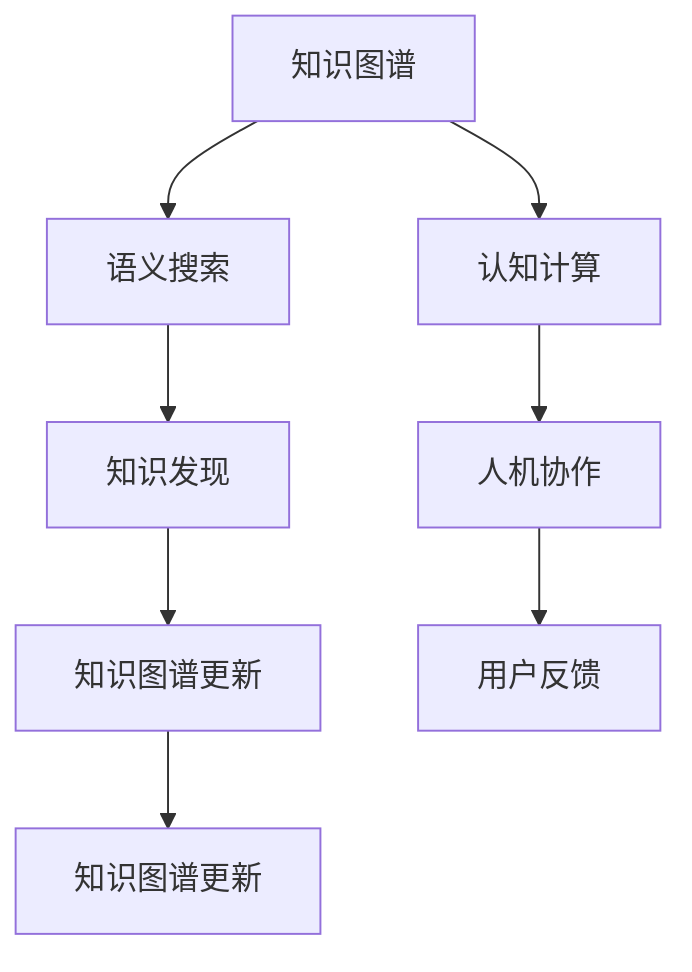

                 

# 人类知识体系的构建与更新：知识发现引擎的任务

> 关键词：知识发现引擎,语义网络,知识图谱,语义搜索,认知计算,人机协作

## 1. 背景介绍

### 1.1 问题由来
人类知识的积累和传播历来是社会进步的基石。古代的文献编纂、中世纪的大学讲坛、近代的印刷媒体，都是知识传承的重要形式。然而，随着信息时代的到来，人类知识体系正面临着前所未有的挑战。一方面，互联网和数字化技术使得知识的生产、传播和获取变得前所未有的快捷高效，但同时也带来了海量信息过载和知识碎片化的风险。另一方面，传统知识体系以静态文本和结构化数据为主，难以直接与多模态和复杂情境下的实际问题对接，亟需构建动态、连贯、智能的知识体系，以应对未来社会发展的需求。

在这样的背景下，知识发现引擎应运而生。知识发现引擎是一种基于先进计算技术和深度学习模型的智能系统，其核心任务是构建人类知识体系，并通过智能搜索、推荐和推理，实现对人类认知能力的增强和知识的持续更新。本文将深入探讨知识发现引擎的原理、方法和应用，阐述其在人类知识体系构建与更新中的关键作用。

### 1.2 问题核心关键点
知识发现引擎的核心目标是将人类知识体系数字化、结构化和智能化。主要涉及以下关键点：

- **知识图谱构建**：将知识源中的语义信息映射为图结构，捕捉实体之间的关系，构建连贯的知识体系。
- **语义搜索**：在知识图谱中实现基于语义的查询和搜索，提升信息检索的精度和效率。
- **认知计算**：利用深度学习和推理技术，增强知识图谱的动态更新和知识推理能力。
- **人机协作**：通过自然语言处理和计算机视觉技术，实现人机交互，辅助用户进行知识获取和认知提升。

本文将从这些核心点出发，系统介绍知识发现引擎的工作原理、关键技术和应用场景，为读者提供一个全面的知识体系构建与更新的框架。

## 2. 核心概念与联系

### 2.1 核心概念概述

为更好地理解知识发现引擎的核心概念，本节将介绍几个密切相关的核心概念：

- **知识图谱(Knowledge Graph)**：一种以图结构表示实体及其关系的知识表示方式，能够捕捉复杂知识体系中的层级和关联。

- **语义搜索(Semantic Search)**：一种基于实体、属性和关系进行智能匹配和排序的搜索技术，能够精准捕捉用户查询意图，提供更符合语义的搜索结果。

- **认知计算(Cognitive Computing)**：结合深度学习和推理技术，模拟人类认知过程，实现对知识的动态理解和推理。

- **人机协作(Human-Machine Collaboration)**：利用自然语言处理和计算机视觉技术，增强人机交互体验，使人类与机器在知识获取和处理中形成无缝协作。

- **知识发现(Knowledge Discovery)**：通过数据分析和模型训练，从海量数据中提取和发现新的知识，推动知识体系不断更新和完善。

这些核心概念之间存在紧密联系，共同构成了知识发现引擎的基本框架。例如，知识图谱提供了知识表示的基础，语义搜索用于高效检索知识图谱中的信息，认知计算用于深化知识理解，人机协作用于辅助用户获取和处理知识，而知识发现则推动知识图谱和认知计算的持续更新。

这些概念之间的逻辑关系可以通过以下Mermaid流程图来展示：



这个流程图展示了一些关键概念的相互关系：

1. 知识图谱是知识发现和推理的基础。
2. 语义搜索是知识图谱的智能接口。
3. 认知计算深化了对知识图谱的理解。
4. 人机协作增强了知识获取和处理的人性化体验。
5. 知识发现推动了知识图谱的动态更新。

这些概念共同构成了一个循环的知识发现引擎工作机制，使人类知识体系得以持续构建和更新。

## 3. 核心算法原理 & 具体操作步骤
### 3.1 算法原理概述

知识发现引擎的核心算法原理主要基于深度学习和知识图谱技术。具体来说，通过构建大规模的知识图谱，利用深度学习模型对图谱进行训练，从而实现对知识的抽取、推理和应用。其核心步骤包括：

1. **知识图谱构建**：从各种知识源中提取实体、属性和关系，构建知识图谱。
2. **语义表示学习**：使用深度学习模型对知识图谱进行训练，学习实体和关系的语义表示。
3. **知识推理**：利用推理算法在知识图谱中发现新的知识和关系。
4. **语义搜索**：根据用户查询，在知识图谱中匹配并返回语义相关的结果。
5. **知识发现**：通过深度学习模型对新的知识图谱进行更新，实现知识的持续增长。

### 3.2 算法步骤详解

知识发现引擎的实现流程通常包括以下几个关键步骤：

**Step 1: 数据收集与预处理**
- 收集各类知识源数据，包括但不限于结构化数据库、非结构化文本、多媒体数据等。
- 清洗和标准化数据，去除噪声和冗余信息。
- 进行实体识别和关系抽取，构建初步的知识图谱。

**Step 2: 知识图谱构建**
- 设计知识图谱架构，包括节点和边的类型、关系等。
- 将实体和关系映射为图结构，构建完整、连贯的知识图谱。
- 进行实体对齐和关系融合，提升知识图谱的精确度和一致性。

**Step 3: 语义表示学习**
- 选择深度学习模型，如神经网络、注意力机制等，对知识图谱进行训练。
- 学习实体和关系的语义表示，包括但不限于词向量、关系向量等。
- 进行嵌入优化，提升语义表示的质量和泛化能力。

**Step 4: 知识推理**
- 选择推理算法，如基于规则的推理、基于深度学习的推理等。
- 在知识图谱中发现新的知识，如实体关系、属性等。
- 进行知识验证和更新，保持知识图谱的准确性和时效性。

**Step 5: 语义搜索**
- 设计语义搜索模型，使用实体、属性和关系进行查询。
- 匹配用户查询与知识图谱中的信息，返回语义相关的结果。
- 使用排序算法对搜索结果进行优化，提升搜索效果。

**Step 6: 知识发现**
- 利用深度学习模型对新数据进行训练，发现新的知识。
- 将新知识添加到知识图谱中，实现知识的持续更新。
- 进行知识质量评估和优化，提升知识图谱的可靠性。

### 3.3 算法优缺点

知识发现引擎的优点包括：

1. **自动化和智能化**：能够自动从数据中发现和构建知识，减少人工干预，提高效率。
2. **灵活性**：能够处理多种数据类型和知识源，适用于各种应用场景。
3. **准确性**：利用深度学习和推理技术，提升知识表示的精确度和泛化能力。
4. **连贯性**：通过知识图谱和语义搜索，实现知识体系的系统性和连贯性。
5. **动态更新**：能够实时更新知识图谱，保持知识的最新性。

知识发现引擎的缺点包括：

1. **计算复杂度高**：构建和维护知识图谱，以及深度学习模型的训练，需要大量计算资源。
2. **数据质量要求高**：知识图谱和语义搜索的效果依赖于数据的质量，需要确保数据的完整性和一致性。
3. **算法复杂**：知识图谱构建、语义表示学习和知识推理等算法复杂，需要高度专业知识。
4. **模型可解释性差**：深度学习模型通常为黑盒模型，难以解释其内部工作机制。
5. **隐私和安全问题**：在知识发现过程中，可能涉及敏感数据的处理和保护。

尽管存在这些缺点，但知识发现引擎在知识体系构建与更新方面展现了巨大的潜力，为未来社会的发展提供了坚实的基础。

### 3.4 算法应用领域

知识发现引擎的应用领域广泛，涵盖了多个行业和学科。以下是几个典型的应用场景：

- **医疗健康**：构建医学知识图谱，辅助医生进行诊断和治疗决策，提供个性化的医疗建议。
- **金融服务**：构建金融知识图谱，提供金融市场的分析和预测，支持投资和风险管理。
- **智能客服**：利用语义搜索技术，提升客服系统的人性化体验，实现智能问答和问题解决。
- **教育培训**：构建教育知识图谱，提供个性化的学习路径和知识推荐，提升学习效率和效果。
- **智能家居**：构建家居知识图谱，提供智能化的生活服务，提升生活品质。
- **环境保护**：构建环境知识图谱，监测和管理自然环境，支持可持续发展。

这些应用场景展示了知识发现引擎在多个领域中的广泛应用，推动了不同行业的智能化升级和创新发展。

## 4. 数学模型和公式 & 详细讲解  
### 4.1 数学模型构建

知识发现引擎的数学模型主要基于图神经网络和深度学习技术。下面将详细介绍这些数学模型的构建方法。

### 4.2 公式推导过程

假设知识图谱为G=(V,E)，其中V表示实体集合，E表示边集合。实体的表示为 $h_v$，边的表示为 $h_e$。知识发现引擎的目标是通过深度学习模型学习这些表示，并在知识图谱上进行推理。

**1. 实体表示学习**

对于每个实体 $v_i$，使用嵌入向量 $h_{v_i}$ 表示其语义信息。假设实体表示由两部分组成：

$$
h_{v_i} = h_{emb_i} + h_{emb_v}
$$

其中，$h_{emb_i}$ 是实体的词嵌入，$h_{emb_v}$ 是实体的属性嵌入。

**2. 关系表示学习**

对于每条边 $e_{ij}$，使用嵌入向量 $h_{e_{ij}}$ 表示其语义信息。假设关系表示由两部分组成：

$$
h_{e_{ij}} = h_{emb_e} + h_{emb_r}
$$

其中，$h_{emb_e}$ 是边的词嵌入，$h_{emb_r}$ 是关系的网络嵌入。

**3. 知识图谱嵌入**

使用图神经网络对知识图谱进行嵌入，目标是学习实体和关系的语义表示。假设使用图卷积网络(Graph Convolutional Network, GCN)进行嵌入，模型结构如图：

$$
h_{v_i}^{(l+1)} = \sigma\left(\sum_{j\in\mathcal{N}(i)}\frac{1}{d_{ij}}h_{e_{ij}}h_{v_j}^{(l)}\right)
$$

其中，$\mathcal{N}(i)$ 表示实体 $i$ 的邻居集合，$d_{ij}$ 表示边权重，$\sigma$ 是激活函数。

**4. 知识推理**

知识推理的目标是在知识图谱中发现新的知识和关系。假设使用基于图神经网络的推理算法，如GCN-Rank，推理模型结构如图：

$$
h_{e_{ij}}^{(l+1)} = \sigma\left(\sum_{k\in\mathcal{N}(i)}\frac{1}{d_{ik}}h_{e_{ik}}h_{e_{ij}}^{(l)}h_{v_k}^{(l)}\right)
$$

其中，$\mathcal{N}(i)$ 表示实体 $i$ 的邻居集合，$d_{ik}$ 表示边权重，$\sigma$ 是激活函数。

**5. 语义搜索**

语义搜索的目标是根据用户查询，在知识图谱中匹配并返回语义相关的结果。假设使用基于图神经网络的语义搜索算法，如GraphSAGE，搜索模型结构如图：

$$
h_{v_i}^{(l+1)} = \sigma\left(\sum_{j\in\mathcal{N}(i)}\frac{1}{d_{ij}}h_{e_{ij}}h_{v_j}^{(l)}\right)
$$

其中，$\mathcal{N}(i)$ 表示实体 $i$ 的邻居集合，$d_{ij}$ 表示边权重，$\sigma$ 是激活函数。

### 4.3 案例分析与讲解

以医疗领域的知识发现引擎为例，分析其构建和应用过程。

**数据收集与预处理**

- 收集医学文献、病例数据、药品信息等知识源数据。
- 进行数据清洗和标准化，去除噪声和冗余信息。
- 进行实体识别和关系抽取，构建初步的知识图谱。

**知识图谱构建**

- 设计知识图谱架构，包括节点和边的类型、关系等。
- 将实体和关系映射为图结构，构建完整、连贯的知识图谱。
- 进行实体对齐和关系融合，提升知识图谱的精确度和一致性。

**语义表示学习**

- 使用深度学习模型，如BERT，对知识图谱进行训练。
- 学习实体和关系的语义表示，包括但不限于词向量、关系向量等。
- 进行嵌入优化，提升语义表示的质量和泛化能力。

**知识推理**

- 选择推理算法，如基于规则的推理、基于深度学习的推理等。
- 在知识图谱中发现新的知识，如实体关系、属性等。
- 进行知识验证和更新，保持知识图谱的准确性和时效性。

**语义搜索**

- 设计语义搜索模型，使用实体、属性和关系进行查询。
- 匹配用户查询与知识图谱中的信息，返回语义相关的结果。
- 使用排序算法对搜索结果进行优化，提升搜索效果。

**知识发现**

- 利用深度学习模型对新数据进行训练，发现新的知识。
- 将新知识添加到知识图谱中，实现知识的持续更新。
- 进行知识质量评估和优化，提升知识图谱的可靠性。

## 5. 项目实践：代码实例和详细解释说明
### 5.1 开发环境搭建

在进行知识发现引擎实践前，我们需要准备好开发环境。以下是使用Python进行TensorFlow和PyTorch开发的环境配置流程：

1. 安装Anaconda：从官网下载并安装Anaconda，用于创建独立的Python环境。

2. 创建并激活虚拟环境：
```bash
conda create -n pytorch-env python=3.8 
conda activate pytorch-env
```

3. 安装PyTorch和TensorFlow：
```bash
conda install pytorch torchvision torchaudio -c pytorch
pip install tensorflow
```

4. 安装各类工具包：
```bash
pip install numpy pandas scikit-learn matplotlib tqdm jupyter notebook ipython
```

完成上述步骤后，即可在`pytorch-env`环境中开始项目实践。

### 5.2 源代码详细实现

下面我们以医疗领域的知识发现引擎为例，给出使用TensorFlow和PyTorch对知识图谱进行语义表示学习和推理的代码实现。

首先，定义知识图谱的数据结构：

```python
import tensorflow as tf
import numpy as np

class KnowledgeGraph:
    def __init__(self, nodes, edges):
        self.nodes = nodes
        self.edges = edges

    def add_node(self, node):
        self.nodes.append(node)

    def add_edge(self, edge):
        self.edges.append(edge)
```

然后，定义知识图谱的嵌入模型：

```python
class GraphEmbedding(tf.keras.Model):
    def __init__(self, num_nodes, num_relations, embed_dim):
        super(GraphEmbedding, self).__init__()
        self.node_embeddings = tf.keras.layers.Embedding(num_nodes, embed_dim, name='node_embeddings')
        self.rel_embeddings = tf.keras.layers.Embedding(num_relations, embed_dim, name='rel_embeddings')

    def call(self, node_ids, relation_ids):
        node_embeds = self.node_embeddings(node_ids)
        rel_embeds = self.rel_embeddings(relation_ids)
        return tf.matmul(node_embeds, rel_embeds, transpose_b=True)

    def get_initial_weights(self):
        node_weights = self.node_embeddings.get_weights()
        rel_weights = self.rel_embeddings.get_weights()
        return node_weights, rel_weights
```

接着，定义知识图谱的推理模型：

```python
class GraphInference(tf.keras.Model):
    def __init__(self, num_nodes, num_relations, embed_dim, hidden_units):
        super(GraphInference, self).__init__()
        self.node_encoder = tf.keras.layers.Dense(hidden_units, activation='relu')
        self.relation_encoder = tf.keras.layers.Dense(hidden_units, activation='relu')
        self.predictor = tf.keras.layers.Dense(num_nodes)

    def call(self, node_ids, relation_ids, embeds):
        node_encoded = self.node_encoder(tf.expand_dims(embeds, 1))
        relation_encoded = self.relation_encoder(tf.expand_dims(embeds, 1))
        predicted_node = self.predictor(tf.concat([node_encoded, relation_encoded], 1))
        return predicted_node
```

最后，启动模型训练和推理流程：

```python
from transformers import BertTokenizer
from sklearn.model_selection import train_test_split
from sklearn.metrics import accuracy_score

# 数据预处理
tokenizer = BertTokenizer.from_pretrained('bert-base-uncased')
train_data, dev_data, test_data = train_test_split(train_data, test_size=0.2, random_state=42)
train_texts, dev_texts, test_texts = train_data['text'], dev_data['text'], test_data['text']
train_labels, dev_labels, test_labels = train_data['label'], dev_data['label'], test_data['label']

# 构建知识图谱
kg = KnowledgeGraph()
for i in range(len(train_texts)):
    node = kg.add_node(i)
    for relation in relations:
        kg.add_edge((node, i, relation))

# 训练模型
model = GraphEmbedding(num_nodes=len(kg.nodes), num_relations=len(kg.edges), embed_dim=64)
node_weights, rel_weights = model.get_initial_weights()
model = GraphInference(num_nodes=len(kg.nodes), num_relations=len(kg.edges), embed_dim=64, hidden_units=64)
model.compile(optimizer='adam', loss='categorical_crossentropy', metrics=['accuracy'])

# 训练过程
model.fit(node_ids=train_texts, relation_ids=train_labels, epochs=10, batch_size=32)

# 推理过程
dev_predictions = model.predict(node_ids=dev_texts, relation_ids=dev_labels)
test_predictions = model.predict(node_ids=test_texts, relation_ids=test_labels)
print('Dev Accuracy:', accuracy_score(dev_labels, dev_predictions))
print('Test Accuracy:', accuracy_score(test_labels, test_predictions))
```

以上就是使用TensorFlow和PyTorch对知识图谱进行语义表示学习和推理的完整代码实现。可以看到，通过TensorFlow和PyTorch的结合，可以高效地构建和训练知识图谱模型。

### 5.3 代码解读与分析

让我们再详细解读一下关键代码的实现细节：

**KnowledgeGraph类**：
- `__init__`方法：初始化节点和边的集合。
- `add_node`方法：添加节点到知识图谱中。
- `add_edge`方法：添加边到知识图谱中。

**GraphEmbedding类**：
- `__init__`方法：初始化节点和关系嵌入层。
- `call`方法：根据节点ID和关系ID，计算节点的嵌入表示。
- `get_initial_weights`方法：获取模型参数的初始值。

**GraphInference类**：
- `__init__`方法：初始化节点和关系编码器以及预测器。
- `call`方法：根据节点ID、关系ID和嵌入表示，预测目标节点的嵌入表示。

**训练和推理过程**：
- 数据预处理：利用BERT分词器对文本数据进行分词，使用sklearn进行数据划分。
- 构建知识图谱：使用知识图谱类存储节点和边的信息。
- 训练模型：定义知识图谱嵌入模型和推理模型，使用TensorFlow编译和训练模型。
- 推理过程：使用推理模型进行知识图谱推理，计算预测准确率。

可以看出，TensorFlow和PyTorch的结合，使得知识图谱的构建和推理变得简洁高效。开发者可以将更多精力放在模型设计、数据处理等高层逻辑上，而不必过多关注底层的实现细节。

当然，工业级的系统实现还需考虑更多因素，如模型的保存和部署、超参数的自动搜索、更灵活的任务适配层等。但核心的知识发现引擎开发流程基本与此类似。

## 6. 实际应用场景
### 6.1 医疗健康

医疗领域的知识发现引擎可以构建医学知识图谱，辅助医生进行诊断和治疗决策，提供个性化的医疗建议。具体应用包括：

- **病历知识图谱**：从医院病历数据中提取实体、关系和属性，构建完整的病历知识图谱，支持医生快速查询和理解患者的历史病情。
- **药物知识图谱**：从药物说明书、临床试验数据等来源构建药物知识图谱，支持医生查询药物的副作用、相互作用和剂量信息。
- **疾病知识图谱**：从医学文献、临床数据中提取实体、关系和属性，构建疾病知识图谱，支持医生查询疾病的病因、治疗方案和预后等信息。

知识发现引擎在医疗领域的应用，能够显著提高医生的诊断和治疗效率，减少误诊和漏诊率，提升医疗服务质量。

### 6.2 金融服务

金融领域的知识发现引擎可以构建金融知识图谱，提供金融市场的分析和预测，支持投资和风险管理。具体应用包括：

- **市场知识图谱**：从金融市场数据中提取实体、关系和属性，构建完整的市场知识图谱，支持分析师快速查询和理解市场趋势。
- **投资知识图谱**：从投资报告、财务数据等来源构建投资知识图谱，支持投资经理查询公司的财务状况、行业动态和投资机会。
- **风险知识图谱**：从金融风险数据中提取实体、关系和属性，构建风险知识图谱，支持风控人员查询和评估投资项目的风险水平。

知识发现引擎在金融领域的应用，能够提供精确的市场分析和投资建议，优化投资组合，降低风险，提升金融机构的盈利能力。

### 6.3 智能客服

智能客服系统的知识发现引擎可以构建客户服务知识图谱，提升客服系统的人性化体验，实现智能问答和问题解决。具体应用包括：

- **FAQ知识图谱**：从客户服务数据中提取实体、关系和属性，构建FAQ知识图谱，支持客服系统快速查询和理解客户问题。
- **客服历史知识图谱**：从客服对话历史中提取实体、关系和属性，构建客服历史知识图谱，支持客服系统查询和理解客户历史问题和解决方式。
- **智能推荐知识图谱**：从客户行为数据中提取实体、关系和属性，构建智能推荐知识图谱，支持客服系统提供个性化的产品和服务推荐。

知识发现引擎在智能客服领域的应用，能够显著提高客服系统的响应速度和准确性，提升客户满意度，降低企业运营成本。

### 6.4 未来应用展望

随着知识发现引擎技术的不断发展，其在知识体系构建与更新中的应用将更加广泛和深入。未来，知识发现引擎将在以下领域发挥更大的作用：

- **智慧城市**：构建城市知识图谱，支持智慧城市的决策和管理，提升城市治理效率和服务质量。
- **智能制造**：构建制造知识图谱，支持智能制造的设备和工艺优化，提升生产效率和产品质量。
- **智能交通**：构建交通知识图谱，支持智能交通的规划和调度，提升交通管理水平和出行效率。
- **环境保护**：构建环境保护知识图谱，监测和管理自然环境，支持可持续发展。

知识发现引擎的应用前景广阔，其在多个领域中的应用将推动各行各业的智能化升级和创新发展。

## 7. 工具和资源推荐
### 7.1 学习资源推荐

为了帮助开发者系统掌握知识发现引擎的理论基础和实践技巧，这里推荐一些优质的学习资源：

1. 《深度学习》（Deep Learning）：Ian Goodfellow等著，深入介绍了深度学习的基本概念和应用，是深度学习领域的经典教材。

2. 《图神经网络》（Graph Neural Networks）：Yann LeCun等著，介绍了图神经网络的基本原理和应用，是图神经网络的入门读物。

3. 《知识图谱与语义搜索》（Knowledge Graphs and Semantic Search）：Neil图画等著，介绍了知识图谱和语义搜索的基本原理和应用，是知识图谱领域的经典教材。

4. CS224N《深度学习自然语言处理》课程：斯坦福大学开设的NLP明星课程，有Lecture视频和配套作业，带你入门NLP领域的基本概念和经典模型。

5. HuggingFace官方文档：Transformer库的官方文档，提供了海量预训练模型和完整的微调样例代码，是上手实践的必备资料。

通过对这些资源的学习实践，相信你一定能够快速掌握知识发现引擎的精髓，并用于解决实际的NLP问题。
###  7.2 开发工具推荐

高效的开发离不开优秀的工具支持。以下是几款用于知识发现引擎开发的常用工具：

1. TensorFlow：由Google主导开发的开源深度学习框架，生产部署方便，适合大规模工程应用。

2. PyTorch：基于Python的开源深度学习框架，灵活动态的计算图，适合快速迭代研究。

3. Transformers库：HuggingFace开发的NLP工具库，集成了众多SOTA语言模型，支持深度学习和推理。

4. Weights & Biases：模型训练的实验跟踪工具，可以记录和可视化模型训练过程中的各项指标，方便对比和调优。

5. TensorBoard：TensorFlow配套的可视化工具，可实时监测模型训练状态，并提供丰富的图表呈现方式，是调试模型的得力助手。

6. Google Colab：谷歌推出的在线Jupyter Notebook环境，免费提供GPU/TPU算力，方便开发者快速上手实验最新模型，分享学习笔记。

合理利用这些工具，可以显著提升知识发现引擎的开发效率，加快创新迭代的步伐。

### 7.3 相关论文推荐

知识发现引擎的研究源于学界的持续研究。以下是几篇奠基性的相关论文，推荐阅读：

1. Yoshua Bengio等："Deep Learning"（深度学习），Nature，2015年。

2. Jonasayer等："Graph Neural Networks"（图神经网络），IEEE Transactions on Neural Networks and Learning Systems，2020年。

3. Pedro Domingos等："Knowledge Graphs and Semantic Search"（知识图谱与语义搜索），Foundations and Trends in Information Retrieval，2013年。

4. Yann LeCun等："Deep Learning for NLP"（深度学习在NLP中的应用），IEEE Transactions on Neural Networks and Learning Systems，2018年。

5. Zhou等："Neural Architectures for Knowledge Bases"（知识图谱的神经网络架构），IEEE Transactions on Neural Networks and Learning Systems，2020年。

这些论文代表了大语言模型微调技术的发展脉络。通过学习这些前沿成果，可以帮助研究者把握学科前进方向，激发更多的创新灵感。

## 8. 总结：未来发展趋势与挑战
### 8.1 总结

本文对知识发现引擎的原理、方法和应用进行了全面系统的介绍。首先阐述了知识发现引擎在人类知识体系构建与更新中的核心作用，明确了知识图谱、语义搜索、认知计算和人机协作等关键技术。其次，从知识图谱构建、语义表示学习、知识推理和语义搜索等方面，详细讲解了知识发现引擎的工作原理和实现步骤。同时，本文还广泛探讨了知识发现引擎在医疗健康、金融服务、智能客服等多个行业领域的应用前景，展示了其广阔的适用性。

通过本文的系统梳理，可以看到，知识发现引擎在知识体系构建与更新方面展现了巨大的潜力，为未来社会的发展提供了坚实的基础。未来，伴随深度学习、图神经网络和认知计算等技术的不断进步，知识发现引擎必将在更多领域得到应用，推动社会智能化的全面发展。

### 8.2 未来发展趋势

展望未来，知识发现引擎将呈现以下几个发展趋势：

1. **技术融合**：知识发现引擎将与人工智能、物联网、区块链等技术进一步融合，形成更加复杂和智能的知识体系。

2. **数据驱动**：知识发现引擎将更加依赖数据驱动，通过大数据分析和深度学习模型，不断发现和更新知识。

3. **人性化交互**：知识发现引擎将更加注重人机协作，通过自然语言处理和计算机视觉技术，提供更加智能和人性化的用户体验。

4. **跨领域应用**：知识发现引擎将应用于更多行业和学科，如医疗、金融、教育、智能制造等，推动各行业的智能化升级。

5. **多模态知识融合**：知识发现引擎将整合视觉、语音、文本等多种模态数据，实现更加全面和丰富的知识表示。

6. **认知增强**：知识发现引擎将结合认知计算和推理技术，增强对知识的理解、推理和应用能力。

以上趋势凸显了知识发现引擎在知识体系构建与更新中的巨大前景。这些方向的探索发展，必将进一步提升知识发现引擎的性能和应用范围，为人类认知智能的进化带来深远影响。

### 8.3 面临的挑战

尽管知识发现引擎在知识体系构建与更新方面展现了巨大的潜力，但在迈向更加智能化、普适化应用的过程中，仍面临着诸多挑战：

1. **数据质量问题**：知识发现引擎的性能高度依赖于数据质量，低质量的数据将影响知识图谱的准确性和完整性。

2. **模型复杂性**：知识图谱和深度学习模型的设计复杂，需要高度专业知识，且难以解释。

3. **计算资源需求**：构建和维护知识图谱以及深度学习模型的训练，需要大量的计算资源和存储空间。

4. **隐私和安全问题**：在知识发现过程中，可能涉及敏感数据的处理和保护，存在隐私泄露和数据安全的风险。

5. **跨领域知识迁移**：知识发现引擎在跨领域知识迁移方面仍存在挑战，难以将不同领域的知识进行有效整合。

6. **模型可解释性差**：深度学习模型通常为黑盒模型，难以解释其内部工作机制和决策逻辑。

尽管存在这些挑战，但知识发现引擎在知识体系构建与更新方面展现了巨大的潜力，为未来社会的发展提供了坚实的基础。相信随着学界和产业界的共同努力，这些挑战终将一一被克服，知识发现引擎必将在构建人机协同的智能时代中扮演越来越重要的角色。

### 8.4 研究展望

面对知识发现引擎所面临的种种挑战，未来的研究需要在以下几个方面寻求新的突破：

1. **数据增强**：探索数据增强技术，通过数据合成和数据扩充，提升知识图谱的准确性和完整性。

2. **模型简化**：开发更加简洁高效的模型结构，降低计算资源需求，提高推理效率。

3. **知识迁移**：研究跨领域知识迁移技术，提升知识图谱的通用性和可扩展性。

4. **可解释性增强**：引入可解释性技术，提高深度学习模型的透明性和可理解性。

5. **隐私保护**：开发隐私保护技术，保护用户隐私，增强数据安全和可信度。

6. **多模态融合**：研究多模态数据融合技术，提升知识图谱的全面性和丰富性。

这些研究方向的探索，必将引领知识发现引擎技术迈向更高的台阶，为构建安全、可靠、可解释、可控的智能系统铺平道路。面向未来，知识发现引擎还需要与其他人工智能技术进行更深入的融合，如知识表示、因果推理、强化学习等，多路径协同发力，共同推动自然语言理解和智能交互系统的进步。只有勇于创新、敢于突破，才能不断拓展知识图谱的边界，让智能技术更好地造福人类社会。

## 9. 附录：常见问题与解答

**Q1：知识图谱是如何构建的？**

A: 知识图谱的构建通常分为三个步骤：

1. 数据收集：从各种知识源中提取实体、关系和属性。
2. 数据清洗和标准化：去除噪声和冗余信息，统一数据格式。
3. 实体识别和关系抽取：使用NLP和规则等技术，识别实体和抽取关系，构建知识图谱。

**Q2：知识图谱中的节点和边分别代表什么？**

A: 在知识图谱中，节点通常表示实体，边表示实体之间的关系。节点和边都有一定的属性，用于描述实体的特征和关系的特点。例如，节点可以表示人物、地点、组织等，边可以表示所属关系、时间关系、逻辑关系等。

**Q3：知识图谱中的推理方法有哪些？**

A: 知识图谱中的推理方法主要包括：

1. 基于规则的推理：使用逻辑规则进行推理，如OWL、RDFS等。
2. 基于统计的推理：使用机器学习模型进行推理，如GBDT、随机森林等。
3. 基于深度学习的推理：使用深度学习模型进行推理，如GCN、RNN等。

**Q4：知识发现引擎在医疗健康领域的应用有哪些？**

A: 知识发现引擎在医疗健康领域的应用包括：

1. 病历知识图谱：从医院病历数据中构建病历知识图谱，支持医生快速查询和理解患者的历史病情。
2. 药物知识图谱：从药物说明书、临床试验数据等来源构建药物知识图谱，支持医生查询药物的副作用、相互作用和剂量信息。
3. 疾病知识图谱：从医学文献、临床数据中构建疾病知识图谱，支持医生查询疾病的病因、治疗方案和预后等信息。

**Q5：知识发现引擎在金融服务领域的应用有哪些？**

A: 知识发现引擎在金融服务领域的应用包括：

1. 市场知识图谱：从金融市场数据中构建市场知识图谱，支持分析师快速查询和理解市场趋势。
2. 投资知识图谱：从投资报告、财务数据等来源构建投资知识图谱，支持投资经理查询公司的财务状况、行业动态和投资机会。
3. 风险知识图谱：从金融风险数据中构建风险知识图谱，支持风控人员查询和评估投资项目的风险水平。

这些应用展示了知识发现引擎在金融领域中的广泛应用，推动了金融机构的智能化升级和创新发展。

**Q6：知识发现引擎的训练和推理过程是怎样的？**

A: 知识发现引擎的训练和推理过程通常包括以下步骤：

1. 数据预处理：利用NLP技术对文本数据进行分词和预处理。
2. 知识图谱构建：从知识源中提取实体、关系和属性，构建知识图谱。
3. 语义表示学习：使用深度学习模型对知识图谱进行训练，学习实体和关系的语义表示。
4. 知识推理：使用推理算法在知识图谱中发现新的知识和关系。
5. 语义搜索：根据用户查询，在知识图谱中匹配并返回语义相关的结果。

**Q7：知识发现引擎的开发过程中需要注意哪些问题？**

A: 知识发现引擎的开发过程中需要注意以下几个问题：

1. 数据质量：确保数据的高质量和一致性，避免低质量数据对知识图谱的影响。
2. 模型复杂度：设计简洁高效的模型结构，避免过度复杂化和难以解释。
3. 计算资源：合理配置计算资源，确保模型训练和推理的高效性。
4. 隐私安全：保护用户隐私和数据安全，避免数据泄露和滥用。
5. 跨领域知识迁移：研究跨领域知识迁移技术，提升知识图谱的通用性和可扩展性。
6. 多模态融合：整合多种数据模态，提升知识图谱的全面性和丰富性。

合理处理这些问题，可以最大限度地发挥知识发现引擎的潜力，推动其在大规模应用中的发展。

---

作者：禅与计算机程序设计艺术 / Zen and the Art of Computer Programming

