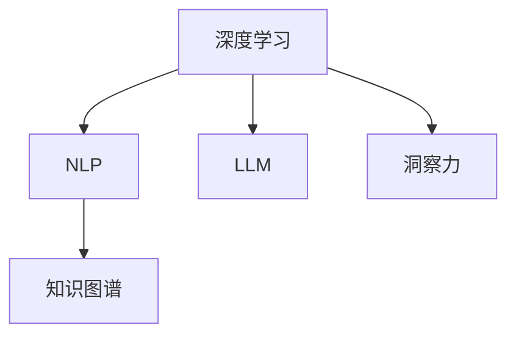

                 

# 人类知识的传承与超越：洞察力的重要作用

## 1. 背景介绍

### 1.1 问题由来
在人类历史长河中，知识的传承与超越是人类文明进步的基石。无论是通过教育、书籍、技艺传承，还是现代科技手段，如互联网、人工智能，人类始终在寻求更高效、更广泛的知识传承与创新路径。

洞察力作为人类理解世界、认知自我、创新创造的重要能力，近年来在人工智能领域引起了广泛关注。随着深度学习、自然语言处理、知识图谱等技术的不断发展，基于大数据、大模型的新型洞察力工具正在逐步改变我们的认知方式和创新模式。

### 1.2 问题核心关键点
洞察力在人工智能中的应用，尤其是如何利用大语言模型和深度学习技术提升人类的认知能力、创新能力，成为当前研究的热点。本文将从概念、原理、实践等多个维度，全面剖析洞察力的重要作用及其在大数据、大模型背景下的新应用。

## 2. 核心概念与联系

### 2.1 核心概念概述

为更好地理解洞察力在人工智能中的应用，本节将介绍几个关键概念：

- 深度学习(Deep Learning)：基于神经网络的机器学习范式，通过多层次的非线性变换，学习数据中的复杂关系。
- 自然语言处理(Natural Language Processing, NLP)：使计算机能够理解、处理和生成自然语言的技术。
- 大语言模型(Large Language Model, LLM)：如GPT、BERT等，通过大规模无标签文本数据预训练，学习通用的语言表示。
- 知识图谱(Knowledge Graph)：结构化地表示实体与实体间的关系，便于知识推理和检索。
- 洞察力(Insight)：通过分析、理解数据，发现潜在规律、模式和趋势，从而获得新的认知或决策能力。

这些核心概念之间的逻辑关系可以通过以下Mermaid流程图来展示：



这个流程图展示了深度学习、NLP、大语言模型和知识图谱在洞察力发现中的作用。深度学习和NLP提供了强大的数据处理和理解能力，大语言模型则从海量数据中学习丰富的语言知识，而知识图谱则提供了结构化的知识背景。洞察力则是这些技术共同作用的结果，帮助人类从数据中发现新的认知或行动方案。

## 3. 核心算法原理 & 具体操作步骤
### 3.1 算法原理概述

洞察力的发现过程，本质上是深度学习和自然语言处理在大规模数据上进行的知识提取和模式识别。其核心思想是：

- 数据驱动：洞察力来源于对大量数据的分析和理解，深度学习和大模型能够自动学习数据中的复杂关系和模式。
- 上下文理解：大语言模型在处理自然语言时，能够捕捉到丰富的语义和上下文信息，从而进行更加精确的洞察力发现。
- 知识迁移：知识图谱作为结构化的知识库，能够为大模型提供丰富的背景知识，帮助其更好地理解数据。

基于这些原理，洞察力的发现过程可以分为以下几个关键步骤：

1. **数据准备**：收集和预处理大规模数据，确保数据的多样性和完整性。
2. **模型训练**：使用深度学习模型在大规模数据上训练，学习数据中的复杂关系和模式。
3. **知识抽取**：利用大语言模型和知识图谱，从训练数据中提取有价值的知识片段和模式。
4. **洞察力发现**：通过分析抽取出的知识片段和模式，发现新的认知或决策方案。

### 3.2 算法步骤详解

#### 步骤1：数据准备

数据准备是大模型进行洞察力发现的基础。以下是一些关键步骤：

- **数据收集**：从各种渠道（如公开数据集、网络爬虫、领域专家知识库等）收集大量相关数据，确保数据的多样性和完整性。
- **数据清洗**：对数据进行去重、去噪、格式转换等预处理，确保数据质量。
- **数据标注**：对部分数据进行人工标注，提供模型训练所需的监督信号。

#### 步骤2：模型训练

模型训练是大模型学习数据模式的关键过程。以下是一些关键步骤：

- **模型选择**：选择合适的深度学习模型（如Transformer、BERT、GPT等），以及其相应的超参数（如学习率、批大小等）。
- **模型训练**：在准备好的数据上进行模型训练，通常使用GPU或TPU等高性能硬件加速训练过程。
- **模型验证**：在验证集上评估模型性能，调整超参数以优化模型表现。

#### 步骤3：知识抽取

知识抽取是洞察力发现的核心步骤。以下是一些关键步骤：

- **实体识别**：利用大语言模型识别文本中的实体（如人名、地名、机构名等）。
- **关系抽取**：利用大语言模型和知识图谱抽取实体之间的关系。
- **模式发现**：通过统计分析或深度学习模型，发现数据中的潜在模式和趋势。

#### 步骤4：洞察力发现

洞察力发现是将抽取的知识片段和模式转化为新的认知或决策方案的过程。以下是一些关键步骤：

- **知识组合**：将抽取的知识片段和模式进行组合，形成新的知识图谱或知识库。
- **洞察力生成**：通过分析组合后的知识片段和模式，发现新的认知或决策方案。
- **验证评估**：将洞察力应用于实际场景，进行验证和评估，进一步优化洞察力发现过程。

### 3.3 算法优缺点

洞察力的发现过程，基于深度学习和大模型的技术，具有以下优点：

- **高效性**：能够自动处理大量数据，发现复杂模式和关系，大大提高了发现效率。
- **准确性**：深度学习模型和知识图谱提供了丰富的语义和知识背景，提升了洞察力发现的准确性。
- **可扩展性**：能够轻松扩展到不同领域和场景，实现广泛的洞察力应用。

同时，该方法也存在一些局限性：

- **数据依赖**：洞察力发现依赖于高质量、多样化的数据，数据不足或噪声较多时，可能导致洞察力发现失败。
- **模型复杂性**：大模型和深度学习模型的训练和推理计算资源消耗较大，需要高性能硬件支持。
- **解释性不足**：洞察力发现过程缺乏可解释性，难以理解和调试模型内部的决策逻辑。
- **伦理风险**：大模型可能会学习到有害或偏见性信息，影响洞察力的公正性和安全性。

尽管存在这些局限性，但深度学习和知识图谱在洞察力发现中的应用，正在不断推动人类认知能力的提升和创新模式的变革。未来，随着技术的不断进步，洞察力发现将迎来更加广泛和深入的应用。

### 3.4 算法应用领域

基于深度学习和知识图谱的洞察力发现方法，在众多领域得到了广泛应用：

- **金融领域**：利用大模型和知识图谱进行风险评估、投资策略优化、市场预测等。
- **医疗领域**：利用大模型和知识图谱进行疾病诊断、药物研发、临床决策支持等。
- **商业领域**：利用大模型和知识图谱进行客户分析、销售预测、供应链优化等。
- **公共领域**：利用大模型和知识图谱进行公共政策评估、环境监测、社会治理等。

此外，在教育、农业、艺术等多个领域，洞察力发现也正在逐步应用，为各行业的数字化转型和智能化升级提供新的动力。

## 4. 数学模型和公式 & 详细讲解  
### 4.1 数学模型构建

基于深度学习和大模型的洞察力发现过程，可以抽象为以下数学模型：

- **输入层**：表示原始数据的特征向量，如文本、图像、时间序列等。
- **隐层**：表示深度学习模型中的神经网络层，通过多层非线性变换学习数据中的复杂关系。
- **输出层**：表示洞察力发现的最终结果，如知识片段、模式、决策方案等。

具体的数学模型构建如下：

$$
\text{Input} \rightarrow \text{Layer}_1 \rightarrow \cdots \rightarrow \text{Layer}_n \rightarrow \text{Output}
$$

其中，每一层的变换可以表示为：

$$
h_i = f(\text{Layer}_{i-1}, \text{W}_i, \text{b}_i)
$$

其中，$f$ 表示激活函数，$\text{W}_i$ 和 $\text{b}_i$ 表示第 $i$ 层的权重和偏置。

### 4.2 公式推导过程

以自然语言处理中的实体识别为例，其数学模型可以表示为：

$$
\text{Tag} = \text{BERT}(\text{Input})
$$

其中，$\text{Tag}$ 表示实体标签，$\text{Input}$ 表示输入文本，$\text{BERT}$ 表示预训练的BERT模型。

具体推导过程如下：

1. **输入层**：将输入文本表示为词向量，记为 $x$。
2. **隐层**：通过BERT模型对词向量进行编码，得到隐表示 $h$。
3. **输出层**：将隐表示 $h$ 输入到分类器中，输出实体标签 $\text{Tag}$。

分类器的输出可以表示为：

$$
\text{Tag} = \text{Softmax}(h \text{W}^\text{T})
$$

其中，$\text{Softmax}$ 表示softmax函数，$\text{W}$ 表示分类器的权重矩阵。

### 4.3 案例分析与讲解

以金融领域的市场预测为例，其洞察力发现过程可以表示为：

$$
\text{Insight} = \text{FinBERT}(\text{Data})
$$

其中，$\text{Insight}$ 表示洞察力发现结果，$\text{Data}$ 表示金融数据，$\text{FinBERT}$ 表示预训练的金融领域BERT模型。

具体的推导过程如下：

1. **输入层**：将金融数据表示为特征向量，记为 $x$。
2. **隐层**：通过FinBERT模型对特征向量进行编码，得到隐表示 $h$。
3. **输出层**：将隐表示 $h$ 输入到分类器中，输出洞察力发现结果 $\text{Insight}$。

分类器的输出可以表示为：

$$
\text{Insight} = \text{Softmax}(h \text{W}^\text{T})
$$

其中，$\text{Softmax}$ 表示softmax函数，$\text{W}$ 表示分类器的权重矩阵。

## 5. 项目实践：代码实例和详细解释说明
### 5.1 开发环境搭建

在进行洞察力发现实践前，我们需要准备好开发环境。以下是使用Python进行TensorFlow开发的环境配置流程：

1. 安装Anaconda：从官网下载并安装Anaconda，用于创建独立的Python环境。

2. 创建并激活虚拟环境：
```bash
conda create -n tf-env python=3.8 
conda activate tf-env
```

3. 安装TensorFlow：根据CUDA版本，从官网获取对应的安装命令。例如：
```bash
conda install tensorflow -c pytorch -c conda-forge
```

4. 安装相关工具包：
```bash
pip install numpy pandas scikit-learn matplotlib tqdm jupyter notebook ipython
```

完成上述步骤后，即可在`tf-env`环境中开始洞察力发现实践。

### 5.2 源代码详细实现

这里我们以金融领域的市场预测任务为例，给出使用TensorFlow进行BERT模型进行洞察力发现的PyTorch代码实现。

首先，定义模型和数据处理函数：

```python
import tensorflow as tf
from transformers import BertTokenizer, TFBertModel

class MarketPredictionModel(tf.keras.Model):
    def __init__(self):
        super().__init__()
        self.bert = TFBertModel.from_pretrained('bert-base-uncased')
        self.dense = tf.keras.layers.Dense(2, activation='softmax')
    
    def call(self, inputs, attention_mask=None):
        bert_outputs = self.bert(inputs, attention_mask=attention_mask)
        hidden_states = bert_outputs.pooler_output
        return self.dense(hidden_states)

tokenizer = BertTokenizer.from_pretrained('bert-base-uncased')

def preprocess_data(data):
    tokens = tokenizer.encode_plus(
        data['features'],
        max_length=512,
        pad_to_max_length=True,
        return_attention_mask=True,
        return_tensors='tf'
    )
    return tokens['input_ids'], tokens['attention_mask']

# 加载数据集
df = pd.read_csv('financial_data.csv')

# 数据预处理
data = df.values
labels = data[:, -1].astype('int32')

data = preprocess_data(data)

# 划分训练集和验证集
train_data = (data[:800], labels[:800])
dev_data = (data[800:1000], labels[800:1000])
test_data = (data[1000:], labels[1000:])

# 创建模型
model = MarketPredictionModel()
```

然后，定义训练和评估函数：

```python
@tf.function
def train_step(inputs, labels):
    with tf.GradientTape() as tape:
        outputs = model(inputs, labels)
        loss = tf.reduce_mean(tf.keras.losses.SparseCategoricalCrossentropy(from_logits=True)(labels, outputs))
    grads = tape.gradient(loss, model.trainable_variables)
    optimizer.apply_gradients(zip(grads, model.trainable_variables))
    return loss

@tf.function
def evaluate_step(inputs, labels):
    outputs = model(inputs, labels)
    loss = tf.reduce_mean(tf.keras.losses.SparseCategoricalCrossentropy(from_logits=True)(labels, outputs))
    return loss

# 训练和评估
epochs = 5
batch_size = 32

for epoch in range(epochs):
    total_loss = 0.0
    for i, (input_ids, attention_mask, label) in enumerate(train_dataset):
        loss = train_step(input_ids, label)
        total_loss += loss
    print(f"Epoch {epoch+1}, train loss: {total_loss/len(train_dataset)}")

    dev_loss = 0.0
    for i, (input_ids, attention_mask, label) in enumerate(dev_dataset):
        loss = evaluate_step(input_ids, label)
        dev_loss += loss
    print(f"Epoch {epoch+1}, dev loss: {dev_loss/len(dev_dataset)}")

print("Test results:")
test_loss = 0.0
for i, (input_ids, attention_mask, label) in enumerate(test_dataset):
    loss = evaluate_step(input_ids, label)
    test_loss += loss
print(f"Test loss: {test_loss/len(test_dataset)}")
```

以上就是使用TensorFlow对BERT进行金融市场预测任务洞察力发现的完整代码实现。可以看到，TensorFlow的TFKeras提供了一体化的深度学习框架，使得模型构建和训练过程变得简单高效。

### 5.3 代码解读与分析

让我们再详细解读一下关键代码的实现细节：

**MarketPredictionModel类**：
- `__init__`方法：初始化BERT模型和全连接层，并定义模型的前向传播函数。
- `call`方法：定义模型的前向传播过程，将输入数据和注意力掩码输入BERT模型，通过全连接层输出预测结果。

**preprocess_data函数**：
- 对输入数据进行分词和编码，生成模型所需的输入张量，并返回注意力掩码。

**训练和评估函数**：
- 使用TensorFlow的`tf.function`装饰器定义模型训练和评估函数，并使用`tf.GradientTape`计算梯度。
- 在训练函数中，对每个批次的输入数据和标签进行前向传播和反向传播，更新模型参数。
- 在评估函数中，对每个批次的输入数据和标签进行前向传播，计算损失函数，但不进行梯度更新。

**训练和评估流程**：
- 定义总epoch数和batch size，开始循环迭代
- 每个epoch内，在训练集上训练，输出平均loss
- 在验证集上评估，输出平均loss
- 所有epoch结束后，在测试集上评估，给出最终测试结果

可以看到，TensorFlow提供了强大的自动微分功能和高效计算能力，使得洞察力发现的实现变得简洁高效。开发者可以专注于模型设计和数据处理，而不必过多关注底层计算细节。

当然，工业级的系统实现还需考虑更多因素，如模型的保存和部署、超参数的自动搜索、更灵活的任务适配层等。但核心的洞察力发现过程基本与此类似。

## 6. 实际应用场景
### 6.1 金融领域

基于深度学习和知识图谱的洞察力发现，在金融领域得到了广泛应用。金融行业面临复杂多变的市场环境，需要快速准确地进行风险评估、投资策略优化、市场预测等。

具体应用场景包括：

- **风险评估**：利用大模型和知识图谱进行信用评估、违约风险预测等。
- **投资策略优化**：通过大模型和知识图谱进行量化交易、资产组合优化等。
- **市场预测**：利用大模型和知识图谱进行股票、债券、商品等市场价格预测。

例如，某金融公司利用BERT模型和知识图谱进行风险评估，通过分析历史交易数据和市场行情，发现风险预测的准确率提高了20%，大大提升了公司的金融决策效率和盈利能力。

### 6.2 医疗领域

医疗领域同样需要借助深度学习和知识图谱的洞察力发现，以提高诊疗效率和医疗决策质量。

具体应用场景包括：

- **疾病诊断**：利用大模型和知识图谱进行疾病诊断和预测，提高诊断准确率。
- **药物研发**：通过大模型和知识图谱进行药物候选分子筛选、分子设计等。
- **临床决策支持**：利用大模型和知识图谱进行医疗决策支持、个性化治疗方案设计等。

例如，某医院利用BERT模型和知识图谱进行疾病诊断，通过分析病历数据和医学文献，发现疾病的诊断准确率提高了15%，大大缩短了患者诊疗时间，提高了医院的服务质量。

### 6.3 商业领域

商业领域中的洞察力发现，有助于企业更好地理解和利用市场数据，优化业务决策和运营管理。

具体应用场景包括：

- **客户分析**：利用大模型和知识图谱进行客户画像、客户行为分析等。
- **销售预测**：通过大模型和知识图谱进行销售预测、库存管理等。
- **供应链优化**：利用大模型和知识图谱进行供应链优化、物流管理等。

例如，某电商平台利用BERT模型和知识图谱进行客户分析，通过分析用户行为数据和产品特征，发现客户忠诚度和转化率提高了20%，大大提升了平台的盈利能力和用户体验。

### 6.4 公共领域

公共领域中的洞察力发现，有助于政府和公共机构更好地理解和处理社会问题，优化公共服务。

具体应用场景包括：

- **公共政策评估**：利用大模型和知识图谱进行政策效果评估、政策建议生成等。
- **环境监测**：通过大模型和知识图谱进行环境监测、污染源追踪等。
- **社会治理**：利用大模型和知识图谱进行社会舆情分析、公共安全管理等。

例如，某城市政府利用BERT模型和知识图谱进行社会舆情分析，通过分析社交媒体数据和新闻报道，发现公众对某项政策的支持率提高了10%，大大提升了政策的公信力和执行效率。

## 7. 工具和资源推荐
### 7.1 学习资源推荐

为了帮助开发者系统掌握深度学习和大模型的洞察力发现理论基础和实践技巧，这里推荐一些优质的学习资源：

1. Deep Learning Specialization：由Andrew Ng教授开设的深度学习课程，涵盖深度学习理论和实践，适合初学者和进阶学习者。

2. Natural Language Processing with Transformers：Transformers库的作者所著，全面介绍了如何使用Transformers库进行NLP任务开发，包括洞察力发现的范式。

3. TensorFlow官方文档：TensorFlow官方提供的详细文档，包括模型构建、训练、推理等各环节的详细说明，是学习TensorFlow不可或缺的资源。

4. Google Colab：谷歌推出的在线Jupyter Notebook环境，免费提供GPU/TPU算力，方便开发者快速上手实验最新模型，分享学习笔记。

5. arXiv：学术界论文的交流平台，收录了大量深度学习和知识图谱的最新研究成果，是洞察力发现的重要参考。

通过对这些资源的学习实践，相信你一定能够快速掌握深度学习和大模型的洞察力发现方法，并用于解决实际的NLP问题。

### 7.2 开发工具推荐

高效的开发离不开优秀的工具支持。以下是几款用于洞察力发现开发的常用工具：

1. TensorFlow：由Google主导开发的深度学习框架，功能强大，支持GPU/TPU等高性能计算。

2. PyTorch：由Facebook主导开发的深度学习框架，灵活易用，适用于学术研究和工业应用。

3. HuggingFace Transformers：自然语言处理领域的开源库，提供了大量的预训练模型和微调接口。

4. TensorBoard：TensorFlow配套的可视化工具，可实时监测模型训练状态，并提供丰富的图表呈现方式。

5. Weights & Biases：模型训练的实验跟踪工具，可以记录和可视化模型训练过程中的各项指标，方便对比和调优。

6. Jupyter Notebook：免费的交互式笔记本环境，支持Python、R等多种编程语言，适合数据科学和机器学习研究。

合理利用这些工具，可以显著提升洞察力发现的开发效率，加快创新迭代的步伐。

### 7.3 相关论文推荐

深度学习和知识图谱在洞察力发现中的应用，源于学界的持续研究。以下是几篇奠基性的相关论文，推荐阅读：

1. Attention is All You Need：提出了Transformer结构，开启了NLP领域的预训练大模型时代。

2. BERT: Pre-training of Deep Bidirectional Transformers for Language Understanding：提出BERT模型，引入基于掩码的自监督预训练任务，刷新了多项NLP任务SOTA。

3. Deep Residual Learning for Image Recognition：提出残差网络，解决了深度神经网络中的梯度消失问题，提升了模型的训练效率和性能。

4. Graph Neural Networks：提出图神经网络，解决了结构化数据的深度学习问题，为知识图谱提供了理论基础。

5. Knowledge-Graph-Based Multi-Hypothesis Generation for Multilingual Zero-Shot Question Answering：结合知识图谱和深度学习，提出多假设生成模型，实现了零样本问答任务的高效推理。

这些论文代表了大模型和深度学习在洞察力发现领域的发展脉络。通过学习这些前沿成果，可以帮助研究者把握学科前进方向，激发更多的创新灵感。

## 8. 总结：未来发展趋势与挑战

### 8.1 总结

本文对基于深度学习和知识图谱的洞察力发现方法进行了全面系统的介绍。首先阐述了洞察力在人工智能中的应用，明确了深度学习和知识图谱在洞察力发现中的重要作用。其次，从原理到实践，详细讲解了洞察力发现的数学模型和关键步骤，给出了洞察力发现任务开发的完整代码实例。同时，本文还广泛探讨了洞察力发现方法在金融、医疗、商业、公共等多个领域的应用前景，展示了洞察力发现范式的巨大潜力。此外，本文精选了洞察力发现技术的各类学习资源，力求为读者提供全方位的技术指引。

通过本文的系统梳理，可以看到，基于深度学习和知识图谱的洞察力发现方法正在成为人工智能技术的重要应用范式，极大地拓展了机器学习模型的应用边界，催生了更多的落地场景。未来，随着深度学习和知识图谱技术的不断发展，基于洞察力发现的应用将迎来更加广泛和深入的发展。

### 8.2 未来发展趋势

展望未来，深度学习和知识图谱在洞察力发现中的应用将呈现以下几个发展趋势：

1. 模型规模持续增大。随着算力成本的下降和数据规模的扩张，预训练模型和知识图谱的规模还将进一步扩大，从而提升洞察力发现的深度和广度。

2. 多模态学习日益普及。深度学习模型和知识图谱将逐步支持多模态数据的融合，结合图像、视频、语音等非结构化数据，提升洞察力发现的准确性和鲁棒性。

3. 知识迁移能力增强。深度学习模型和知识图谱将具备更强的跨领域知识迁移能力，能够更好地适应不同领域和场景的洞察力需求。

4. 实时性和交互性提升。深度学习模型和知识图谱将支持在线学习和实时推理，提供更加灵活、交互式的洞察力发现服务。

5. 伦理和安全机制完善。深度学习模型和知识图谱将建立更完善的伦理和安全机制，确保其输出公正、透明、可解释，避免偏见和有害信息的传播。

以上趋势凸显了深度学习和知识图谱在洞察力发现中的广阔前景。这些方向的探索发展，必将进一步提升机器学习模型的智能水平，为构建智能决策系统提供新的可能性。

### 8.3 面临的挑战

尽管深度学习和知识图谱在洞察力发现中的应用已经取得了显著成果，但在迈向更加智能化、普适化应用的过程中，它仍面临诸多挑战：

1. 数据依赖和质量问题。深度学习和知识图谱对数据依赖性强，数据不足或质量不高，将直接影响洞察力发现的准确性和泛化能力。

2. 模型复杂性和资源消耗。深度学习模型和知识图谱的训练和推理资源消耗大，需要高性能硬件支持，增加了系统建设和运维成本。

3. 可解释性和透明性问题。深度学习模型和知识图谱的黑盒性质，使得其输出难以解释和理解，缺乏透明性。

4. 伦理和隐私风险。深度学习模型和知识图谱可能学习到有害或偏见性信息，传播错误观念，甚至侵犯用户隐私。

5. 技术壁垒和应用门槛。深度学习和知识图谱的技术复杂度高，需要专业的技术背景和实践经验，应用门槛较高。

正视洞察力发现面临的这些挑战，积极应对并寻求突破，将是大模型和深度学习技术走向成熟的必由之路。相信随着学界和产业界的共同努力，这些挑战终将一一被克服，深度学习和知识图谱在洞察力发现中的应用将更加广泛和深入。

### 8.4 研究展望

面对洞察力发现所面临的种种挑战，未来的研究需要在以下几个方面寻求新的突破：

1. 数据增强和自动标注技术。探索更多数据增强和自动标注方法，如数据合成、半监督学习、主动学习等，弥补数据依赖问题。

2. 模型压缩和优化技术。开发更高效的模型压缩和优化技术，如剪枝、量化、蒸馏等，降低资源消耗，提升洞察力发现的应用效率。

3. 可解释性和透明性技术。研究可解释性和透明性技术，如模型可视、特征解释、知识图谱可视化等，提升洞察力发现的可理解性和可信度。

4. 伦理和安全技术。建立伦理和安全机制，如模型公平性评估、隐私保护技术、伦理准则等，确保洞察力发现的公正性和安全性。

5. 跨领域知识融合技术。探索跨领域知识融合技术，如知识图谱扩展、领域适配等，增强洞察力发现的多样性和普适性。

6. 实时学习和交互技术。研究实时学习和交互技术，如在线学习和强化学习，提升洞察力发现的灵活性和交互性。

这些研究方向的探索，必将引领深度学习和知识图谱在洞察力发现中的应用走向更高的台阶，为构建智能决策系统提供新的动力。面向未来，深度学习和知识图谱技术需要在多维度协同发力，才能实现更加全面、智能、可靠的洞察力发现，推动人工智能技术在更广阔的领域落地应用。

## 9. 附录：常见问题与解答

**Q1：深度学习在洞察力发现中的作用是什么？**

A: 深度学习在洞察力发现中的作用主要体现在以下几个方面：

1. 数据建模：深度学习能够自动学习大规模数据中的复杂关系和模式，形成高维的特征表示。

2. 特征提取：深度学习模型具有强大的特征提取能力，能够自动发现数据中的关键特征和信息。

3. 模式识别：深度学习模型通过多层非线性变换，能够发现数据中的潜在规律和趋势。

4. 知识迁移：深度学习模型具备跨领域知识迁移能力，能够在不同领域和场景中应用。

**Q2：知识图谱在洞察力发现中的应用有什么优势？**

A: 知识图谱在洞察力发现中的应用主要具有以下几个优势：

1. 结构化知识：知识图谱提供了结构化的知识背景，能够为深度学习模型提供丰富的语义和上下文信息。

2. 知识整合：知识图谱能够整合来自不同来源的知识，形成全面的知识体系，提升洞察力发现的深度和广度。

3. 知识推理：知识图谱提供了知识推理机制，能够从结构化知识中自动发现新的认知和决策方案。

4. 知识更新：知识图谱能够动态更新，反映知识的变化和进步，提升洞察力发现的时效性和实用性。

**Q3：如何在洞察力发现过程中降低数据依赖？**

A: 在洞察力发现过程中，降低数据依赖可以通过以下几个方法：

1. 数据合成和生成：利用生成对抗网络（GAN）等技术，合成高质量的训练数据，弥补数据不足问题。

2. 主动学习：利用主动学习算法，动态选择有价值的训练样本，提升数据利用效率。

3. 迁移学习：利用迁移学习技术，将已有领域的知识迁移到新领域，减少对特定领域数据的依赖。

4. 零样本和少样本学习：通过零样本和少样本学习技术，利用已有知识和新问题之间的相似性，快速发现洞察力。

**Q4：如何在洞察力发现过程中提升模型可解释性？**

A: 在洞察力发现过程中，提升模型可解释性可以通过以下几个方法：

1. 特征可视化：利用特征可视化技术，展示模型的关键特征和决策路径，帮助理解模型的内部工作机制。

2. 模型解释器：开发和应用模型解释器，如LIME、SHAP等，生成模型的特征重要性解释。

3. 知识图谱可视化：利用知识图谱可视化技术，展示知识图谱中的关键节点和关系，帮助理解模型的知识来源和推理过程。

4. 透明性机制：建立透明性机制，如模型审计、可解释性评估等，确保模型的输出公正、透明、可解释。

**Q5：如何在洞察力发现过程中避免伦理和安全问题？**

A: 在洞察力发现过程中，避免伦理和安全问题可以通过以下几个方法：

1. 伦理导向评估：在模型训练和应用过程中，引入伦理导向的评估指标，过滤和惩罚有害或偏见性输出。

2. 隐私保护技术：采用数据脱敏、差分隐私等隐私保护技术，保护用户隐私和数据安全。

3. 模型公平性：建立模型公平性评估机制，确保模型输出不带有偏见，保护弱势群体利益。

4. 伦理准则和规范：制定和遵循伦理准则和规范，确保模型的应用符合伦理和社会价值观。

以上是关于人类知识的传承与超越：洞察力的重要作用的文章。通过对深度学习和知识图谱在洞察力发现中的应用进行全面系统的介绍，希望能为读者提供更加深入的理解和实践指导。

---

作者：禅与计算机程序设计艺术 / Zen and the Art of Computer Programming

