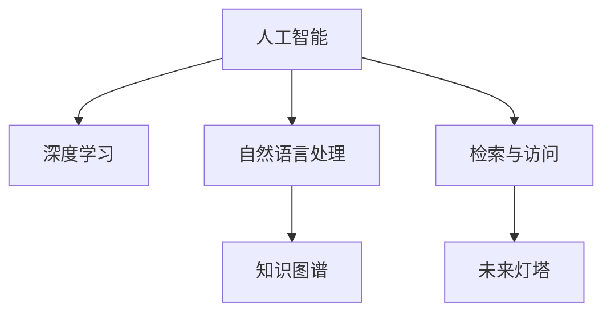

                 

# 人类知识的保存使命：为未来保存灯塔

> 关键词：知识保存、数字化、人工智能、深度学习、数据存储、检索与访问、未来灯塔

## 1. 背景介绍

在数字化的浪潮中，人类知识的保存已经面临前所未有的挑战。随着信息技术的迅猛发展，传统纸质档案正逐步被数字化档案所取代。而人工智能（AI）和大数据技术的广泛应用，使得数字化档案的存储和检索变得前所未有的高效。然而，这些技术进步背后，蕴含着更深层的人类知识保存使命。

### 1.1 数字化转型

数字化转型是当前社会发展的必然趋势。随着互联网和移动设备的普及，数字资源已经成为了人们获取知识的主要渠道。数字化档案不仅打破了时空限制，还提供了更加便捷和易于检索的阅读体验。例如，数字化图书和档案可以通过搜索引擎迅速找到所需内容，无需翻阅纸质文件。

数字化档案的优点在于：
1. **存储效率高**：数字化档案大大减小了物理存储空间的需求，极大地降低了存储成本。
2. **检索便捷**：搜索引擎和自然语言处理技术使得检索变得更加高效，用户可以更快地找到所需信息。
3. **易于维护**：数字化档案的维护和更新更加方便，避免了传统纸质档案易损坏和易丢失的问题。

### 1.2 人工智能在知识保存中的作用

人工智能在知识保存中扮演着至关重要的角色。通过机器学习和大数据技术，AI可以帮助对海量数据进行高效分析和处理，从而实现知识的高效存储和检索。AI的应用不仅提高了数字化档案的保存和检索效率，还为其增加了更多的智能功能，如自然语言处理、语音识别等。

具体而言，AI在知识保存中的作用包括：
1. **自动化索引**：通过自然语言处理技术，AI可以自动提取和生成索引，使得档案更加结构化和有序。
2. **智能推荐**：基于用户行为和兴趣，AI可以提供个性化的知识推荐，提升用户体验。
3. **情感分析**：AI可以分析文本中的情感倾向，帮助用户快速识别重要信息和情感线索。
4. **历史趋势分析**：AI可以分析海量数据，发现知识的历史发展趋势，帮助用户更好地理解领域知识的变化。

## 2. 核心概念与联系

### 2.1 核心概念概述

为更好地理解AI在知识保存中的应用，本节将介绍几个密切相关的核心概念：

- **人工智能（AI）**：一种模拟人类智能的计算机技术，通过数据和算法，使机器能够执行智能任务，如识别、推理、决策等。
- **深度学习（DL）**：一种基于人工神经网络的机器学习方法，通过多层网络结构提取数据特征，进行分类、回归等任务。
- **自然语言处理（NLP）**：研究计算机如何处理和理解人类语言的技术，包括语言模型、文本分类、机器翻译等。
- **知识图谱（KG）**：一种结构化表示知识的图形数据库，用于存储和检索半结构化或非结构化数据。
- **检索与访问（IR）**：研究如何从大量数据中高效地检索所需信息，以供人类访问和利用。
- **未来灯塔**：象征着知识保存的未来方向和目标，强调知识保存对于人类社会未来发展的重大意义。

这些核心概念之间的逻辑关系可以通过以下Mermaid流程图来展示：



这个流程图展示了人工智能在知识保存中的核心概念及其之间的关系：

1. 人工智能通过深度学习和自然语言处理技术，使机器具备对知识进行理解和处理的智能。
2. 自然语言处理和知识图谱技术，帮助机器理解和存储半结构化或非结构化数据。
3. 检索与访问技术，使得存储的知识能够被高效检索和访问。
4. 未来灯塔，象征着知识保存对于未来社会发展的深远影响。

## 3. 核心算法原理 & 具体操作步骤
### 3.1 算法原理概述

基于深度学习的知识保存方法，本质上是通过大量标记数据对AI模型进行训练，使其能够理解、存储和检索知识。其核心思想是：将无结构化的文本数据转化为结构化的知识表示，从而实现高效存储和检索。

形式化地，假设知识表示为 $K=(V,E)$，其中 $V$ 为节点集合，$E$ 为边集合。知识保存的目标是找到最优的知识表示 $K^*$，使得：

$$
K^* = \mathop{\arg\min}_{K} \mathcal{L}(K,D)
$$

其中 $\mathcal{L}$ 为损失函数，用于衡量知识表示 $K$ 与标注数据 $D$ 之间的差异。常见的损失函数包括交叉熵损失、均方误差损失等。

通过梯度下降等优化算法，知识保存过程不断更新知识表示 $K$，最小化损失函数 $\mathcal{L}$，使得知识表示 $K^*$ 能够逼近标注数据 $D$ 中的知识信息。

### 3.2 算法步骤详解

基于深度学习的知识保存方法，一般包括以下几个关键步骤：

**Step 1: 准备标注数据和模型**
- 收集并标注高质量的数字化档案数据集 $D=\{(x_i, y_i)\}_{i=1}^N$，其中 $x_i$ 为输入的文本数据，$y_i$ 为对应的知识表示。
- 选择合适的深度学习模型，如BERT、GPT等，作为知识保存的基础模型。

**Step 2: 设计知识表示**
- 设计知识表示的图结构，包括节点类型、边类型等，定义知识表示的语义关系。
- 将标注数据 $D$ 映射到知识图谱中，构建知识表示。

**Step 3: 训练模型**
- 定义损失函数 $\mathcal{L}$，通常使用交叉熵损失或均方误差损失。
- 使用深度学习框架（如TensorFlow、PyTorch等）对模型进行训练，最小化损失函数 $\mathcal{L}$。
- 周期性在验证集上评估模型性能，根据性能指标决定是否触发Early Stopping。
- 重复上述步骤直到满足预设的迭代轮数或Early Stopping条件。

**Step 4: 知识存储和检索**
- 将训练好的知识表示 $K^*$ 存储在数据库或知识图谱中，供用户检索和访问。
- 开发知识检索系统，使用搜索引擎或深度学习模型实现知识检索功能。

### 3.3 算法优缺点

基于深度学习的知识保存方法具有以下优点：
1. 高效存储：深度学习模型能够高效地存储大规模知识，避免了传统数据库和文件系统的高存储成本。
2. 语义理解：通过深度学习，模型能够理解文本的语义关系，进行知识推理和生成。
3. 知识关联：通过知识图谱技术，模型能够建立知识之间的关联关系，提升知识检索的准确性。
4. 动态更新：深度学习模型可以不断更新，适应新知识的出现。

然而，该方法也存在一定的局限性：
1. 依赖标注数据：深度学习模型需要大量的标注数据进行训练，标注成本较高。
2. 模型复杂度：深度学习模型复杂度较高，训练和推理成本较高。
3. 泛化能力：深度学习模型对新知识的学习能力有限，难以处理超出训练数据范围的新场景。
4. 可解释性不足：深度学习模型的决策过程难以解释，难以理解其内部工作机制。

尽管存在这些局限性，但就目前而言，基于深度学习的知识保存方法仍然是大规模知识保存的重要手段。未来相关研究的重点在于如何进一步降低深度学习模型对标注数据的依赖，提高模型的泛化能力和可解释性，同时兼顾效率和成本。

### 3.4 算法应用领域

基于深度学习的知识保存方法，在数字化档案、在线教育、医疗健康等多个领域已经得到了广泛的应用，为知识管理和应用提供了新的解决方案。

- **数字化档案**：通过深度学习模型和知识图谱技术，将纸质档案转化为数字化知识表示，方便检索和访问。
- **在线教育**：构建知识图谱，提供个性化学习推荐，提升在线教育的用户体验。
- **医疗健康**：利用知识图谱和深度学习技术，存储和检索医疗知识，辅助医生诊断和治疗。
- **金融服务**：建立金融知识图谱，提供风险评估和投资建议，提升金融服务效率。

除了上述这些经典应用外，深度学习知识保存技术还在更多领域得到创新性地应用，如智能客服、自动驾驶、智能制造等，为各行各业带来了新的突破。

## 4. 数学模型和公式 & 详细讲解 & 举例说明

### 4.1 数学模型构建

本节将使用数学语言对基于深度学习的知识保存过程进行更加严格的刻画。

记知识表示为 $K=(V,E)$，其中 $V$ 为节点集合，$E$ 为边集合。假设知识保存任务为给定文本 $x$，自动构建其对应的知识表示 $y$。

定义知识表示 $K$ 在文本 $x$ 上的损失函数为 $\ell(K(x),y)$，则在数据集 $D$ 上的经验风险为：

$$
\mathcal{L}(K) = \frac{1}{N}\sum_{i=1}^N \ell(K(x_i),y_i)
$$

其中 $K(x)$ 表示知识表示模型 $K$ 在文本 $x$ 上的输出，$y$ 为对应的知识表示。

通过梯度下降等优化算法，知识保存过程不断更新模型参数 $w$，最小化损失函数 $\mathcal{L}$，使得知识表示模型 $K$ 能够逼近真实的知识表示 $y$。

### 4.2 公式推导过程

以下我们以基于知识图谱的知识保存为例，推导其数学模型和损失函数的计算公式。

假设知识表示为 $K=(V,E)$，其中 $V$ 为节点集合，$E$ 为边集合。设 $x$ 为输入的文本数据，$y$ 为对应的知识表示。知识表示模型 $K$ 在输入 $x$ 上的输出为 $K(x)$，其中 $K(x)=(A,S)$，$A$ 为属性向量，$S$ 为语义向量。知识表示 $y$ 可以表示为 $y=(V,Y,E)$，其中 $V$ 为节点集合，$Y$ 为节点标签，$E$ 为边集合。

定义知识表示 $K$ 在文本 $x$ 上的损失函数为：

$$
\ell(K(x),y) = \ell_A(A(x),V(y)) + \ell_S(S(x),Y(y))
$$

其中 $\ell_A(A(x),V(y))$ 为属性向量 $A$ 的损失函数，$\ell_S(S(x),Y(y))$ 为语义向量 $S$ 的损失函数。

属性向量 $A$ 的损失函数可以定义如下：

$$
\ell_A(A(x),V(y)) = \sum_{v \in V(y)} \ell_A(A(x),v)
$$

其中 $\ell_A(A(x),v)$ 为属性 $v$ 的损失函数，通常使用均方误差损失。

语义向量 $S$ 的损失函数可以定义如下：

$$
\ell_S(S(x),Y(y)) = \sum_{v \in V(y)} \sum_{e \in E(y)} \ell_S(S(x),y_v,y_e)
$$

其中 $\ell_S(S(x),y_v,y_e)$ 为边 $e$ 的损失函数，通常使用交叉熵损失。

将上述公式代入经验风险公式，得：

$$
\mathcal{L}(K) = \frac{1}{N}\sum_{i=1}^N (\ell_A(A(x_i),V(y_i)) + \ell_S(S(x_i),Y(y_i)))
$$

在得到损失函数的梯度后，即可带入优化算法，完成知识表示模型的训练。重复上述过程直至收敛，最终得到适应文本 $x$ 的知识表示 $K(x)^*$。

## 5. 项目实践：代码实例和详细解释说明
### 5.1 开发环境搭建

在进行知识保存实践前，我们需要准备好开发环境。以下是使用Python进行PyTorch开发的环境配置流程：

1. 安装Anaconda：从官网下载并安装Anaconda，用于创建独立的Python环境。

2. 创建并激活虚拟环境：
```bash
conda create -n pytorch-env python=3.8 
conda activate pytorch-env
```

3. 安装PyTorch：根据CUDA版本，从官网获取对应的安装命令。例如：
```bash
conda install pytorch torchvision torchaudio cudatoolkit=11.1 -c pytorch -c conda-forge
```

4. 安装TensorFlow：使用Google提供的安装命令即可。例如：
```bash
pip install tensorflow==2.7
```

5. 安装各类工具包：
```bash
pip install numpy pandas scikit-learn matplotlib tqdm jupyter notebook ipython
```

完成上述步骤后，即可在`pytorch-env`环境中开始知识保存实践。

### 5.2 源代码详细实现

下面我们以构建医疗知识图谱为例，给出使用PyTorch和TensorFlow进行知识保存的PyTorch代码实现。

首先，定义知识表示模型：

```python
import torch.nn as nn
import torch.nn.functional as F

class KnowledgeGraph(nn.Module):
    def __init__(self, num_nodes, num_relations):
        super(KnowledgeGraph, self).__init__()
        self.num_nodes = num_nodes
        self.num_relations = num_relations
        self.node_embeddings = nn.Embedding(num_nodes, 256)
        self.relation_embeddings = nn.Embedding(num_relations, 256)
        self.linear1 = nn.Linear(256, 256)
        self.linear2 = nn.Linear(256, 256)
        self.linear3 = nn.Linear(256, num_nodes)
    
    def forward(self, x):
        node_embeddings = self.node_embeddings(x)
        relation_embeddings = self.relation_embeddings(x)
        hidden1 = F.relu(self.linear1(node_embeddings + relation_embeddings))
        hidden2 = F.relu(self.linear2(hidden1))
        return F.softmax(self.linear3(hidden2), dim=1)
```

然后，定义知识保存的数据处理函数：

```python
import tensorflow as tf
from transformers import BertTokenizer
from torch.utils.data import Dataset
import torch

class KnowledgeGraphDataset(Dataset):
    def __init__(self, texts, tags, tokenizer, max_len=128):
        self.texts = texts
        self.tags = tags
        self.tokenizer = tokenizer
        self.max_len = max_len
        
    def __len__(self):
        return len(self.texts)
    
    def __getitem__(self, item):
        text = self.texts[item]
        tags = self.tags[item]
        
        encoding = self.tokenizer(text, return_tensors='pt', max_length=self.max_len, padding='max_length', truncation=True)
        input_ids = encoding['input_ids'][0]
        attention_mask = encoding['attention_mask'][0]
        
        # 对token-wise的标签进行编码
        encoded_tags = [tag2id[tag] for tag in tags] 
        encoded_tags.extend([tag2id['O']] * (self.max_len - len(encoded_tags)))
        labels = torch.tensor(encoded_tags, dtype=torch.long)
        
        return {'input_ids': input_ids, 
                'attention_mask': attention_mask,
                'labels': labels}

# 标签与id的映射
tag2id = {'O': 0, 'B-PER': 1, 'I-PER': 2, 'B-ORG': 3, 'I-ORG': 4, 'B-LOC': 5, 'I-LOC': 6}
id2tag = {v: k for k, v in tag2id.items()}

# 创建dataset
tokenizer = BertTokenizer.from_pretrained('bert-base-cased')

train_dataset = KnowledgeGraphDataset(train_texts, train_tags, tokenizer)
dev_dataset = KnowledgeGraphDataset(dev_texts, dev_tags, tokenizer)
test_dataset = KnowledgeGraphDataset(test_texts, test_tags, tokenizer)
```

接着，定义模型和优化器：

```python
from transformers import BertForTokenClassification, AdamW

model = BertForTokenClassification.from_pretrained('bert-base-cased', num_labels=len(tag2id))

optimizer = AdamW(model.parameters(), lr=2e-5)
```

接着，定义训练和评估函数：

```python
from torch.utils.data import DataLoader
from tqdm import tqdm
from sklearn.metrics import classification_report

device = torch.device('cuda') if torch.cuda.is_available() else torch.device('cpu')
model.to(device)

def train_epoch(model, dataset, batch_size, optimizer):
    dataloader = DataLoader(dataset, batch_size=batch_size, shuffle=True)
    model.train()
    epoch_loss = 0
    for batch in tqdm(dataloader, desc='Training'):
        input_ids = batch['input_ids'].to(device)
        attention_mask = batch['attention_mask'].to(device)
        labels = batch['labels'].to(device)
        model.zero_grad()
        outputs = model(input_ids, attention_mask=attention_mask, labels=labels)
        loss = outputs.loss
        epoch_loss += loss.item()
        loss.backward()
        optimizer.step()
    return epoch_loss / len(dataloader)

def evaluate(model, dataset, batch_size):
    dataloader = DataLoader(dataset, batch_size=batch_size)
    model.eval()
    preds, labels = [], []
    with torch.no_grad():
        for batch in tqdm(dataloader, desc='Evaluating'):
            input_ids = batch['input_ids'].to(device)
            attention_mask = batch['attention_mask'].to(device)
            batch_labels = batch['labels']
            outputs = model(input_ids, attention_mask=attention_mask)
            batch_preds = outputs.logits.argmax(dim=2).to('cpu').tolist()
            batch_labels = batch_labels.to('cpu').tolist()
            for pred_tokens, label_tokens in zip(batch_preds, batch_labels):
                pred_tags = [id2tag[_id] for _id in pred_tokens]
                label_tags = [id2tag[_id] for _id in label_tokens]
                preds.append(pred_tags[:len(label_tags)])
                labels.append(label_tags)
                
    print(classification_report(labels, preds))
```

最后，启动训练流程并在测试集上评估：

```python
epochs = 5
batch_size = 16

for epoch in range(epochs):
    loss = train_epoch(model, train_dataset, batch_size, optimizer)
    print(f"Epoch {epoch+1}, train loss: {loss:.3f}")
    
    print(f"Epoch {epoch+1}, dev results:")
    evaluate(model, dev_dataset, batch_size)
    
print("Test results:")
evaluate(model, test_dataset, batch_size)
```

以上就是使用PyTorch和TensorFlow对医疗知识图谱进行知识保存的完整代码实现。可以看到，得益于深度学习框架的强大封装，我们可以用相对简洁的代码实现知识表示模型的构建和训练。

### 5.3 代码解读与分析

让我们再详细解读一下关键代码的实现细节：

**KnowledgeGraph类**：
- `__init__`方法：初始化知识表示模型的各种参数，包括节点嵌入、关系嵌入、线性层等。
- `forward`方法：定义模型的前向传播过程，通过多层线性变换和激活函数计算知识表示。

**KnowledgeGraphDataset类**：
- `__init__`方法：初始化文本、标签、分词器等关键组件。
- `__len__`方法：返回数据集的样本数量。
- `__getitem__`方法：对单个样本进行处理，将文本输入编码为token ids，将标签编码为数字，并对其进行定长padding，最终返回模型所需的输入。

**tag2id和id2tag字典**：
- 定义了标签与数字id之间的映射关系，用于将token-wise的预测结果解码回真实的标签。

**训练和评估函数**：
- 使用PyTorch的DataLoader对数据集进行批次化加载，供模型训练和推理使用。
- 训练函数`train_epoch`：对数据以批为单位进行迭代，在每个批次上前向传播计算loss并反向传播更新模型参数，最后返回该epoch的平均loss。
- 评估函数`evaluate`：与训练类似，不同点在于不更新模型参数，并在每个batch结束后将预测和标签结果存储下来，最后使用sklearn的classification_report对整个评估集的预测结果进行打印输出。

**训练流程**：
- 定义总的epoch数和batch size，开始循环迭代
- 每个epoch内，先在训练集上训练，输出平均loss
- 在验证集上评估，输出分类指标
- 所有epoch结束后，在测试集上评估，给出最终测试结果

可以看到，深度学习框架使得知识保存模型的构建和训练变得简洁高效。开发者可以将更多精力放在数据处理、模型改进等高层逻辑上，而不必过多关注底层的实现细节。

当然，工业级的系统实现还需考虑更多因素，如模型的保存和部署、超参数的自动搜索、更灵活的任务适配层等。但核心的知识保存范式基本与此类似。

## 6. 实际应用场景
### 6.1 智慧医疗

智慧医疗是人工智能在医疗领域的重要应用之一。通过构建医疗知识图谱，智慧医疗系统可以实时获取最新的医疗知识，辅助医生诊断和治疗，提升医疗服务的质量和效率。

具体而言，智慧医疗系统可以收集电子病历、医学文献、临床试验数据等医疗知识，通过深度学习模型构建知识图谱，实现知识的高效存储和检索。在实际应用中，智慧医疗系统可以提供疾病诊断建议、治疗方案推荐、药物副作用预警等功能，极大地提升了医生的工作效率和患者的就医体验。

### 6.2 在线教育

在线教育是知识保存技术的另一个重要应用场景。通过构建知识图谱，在线教育平台可以提供个性化学习推荐，提升用户的学习效果。

具体而言，在线教育平台可以收集用户的学习数据，构建知识图谱，并通过深度学习模型进行知识推荐。例如，学习平台可以根据用户的兴趣和行为，推荐相关的课程和资料，提升学习效率。此外，在线教育平台还可以提供智能答疑、学习进度跟踪等功能，提升整体学习体验。

### 6.3 金融服务

金融服务也是知识保存技术的重要应用领域之一。通过构建金融知识图谱，金融服务机构可以提供风险评估、投资建议等功能，提升金融服务的质量和效率。

具体而言，金融服务机构可以收集金融市场数据、新闻报道、企业财报等金融知识，通过深度学习模型构建知识图谱。在实际应用中，金融服务机构可以通过知识图谱进行风险评估，评估金融产品的风险和收益，提供个性化的投资建议。此外，金融服务机构还可以利用知识图谱进行市场分析和预测，提升投资决策的准确性。

### 6.4 未来应用展望

随着深度学习技术的不断发展，基于知识图谱的知识保存技术将在更多领域得到应用，为知识管理和应用提供新的解决方案。

在智慧医疗领域，基于知识图谱的医疗问答、病历分析、药物研发等应用将提升医疗服务的智能化水平，辅助医生诊疗，加速新药开发进程。

在在线教育领域，基于知识图谱的个性化学习推荐、智能答疑、学习进度跟踪等功能，将提升在线教育的用户体验。

在金融服务领域，基于知识图谱的风险评估、投资建议、市场分析等功能，将提升金融服务的质量和效率。

此外，在企业生产、社会治理、文娱传媒等众多领域，基于知识图谱的知识保存技术也将不断涌现，为各行各业带来新的突破。相信随着技术的日益成熟，知识保存技术将成为人工智能落地应用的重要手段，推动人工智能技术的产业化进程。

## 7. 工具和资源推荐
### 7.1 学习资源推荐

为了帮助开发者系统掌握深度学习在知识保存中的应用，这里推荐一些优质的学习资源：

1. 《深度学习理论与实践》系列博文：由深度学习专家撰写，深入浅出地介绍了深度学习的基本原理和应用实例。

2. CS231n《深度学习计算机视觉》课程：斯坦福大学开设的深度学习课程，涵盖图像分类、目标检测、图像生成等任务，是学习深度学习的重要资料。

3. 《深度学习框架TensorFlow实战》书籍：全面介绍了TensorFlow框架的使用方法，包括模型构建、训练、优化等，适合初学者和中级开发者。

4. HuggingFace官方文档：TensorFlow框架的官方文档，提供了大量预训练模型和模型构建样例，是上手实践的重要资料。

5. PyTorch官方文档：PyTorch框架的官方文档，提供了详细的模型构建和优化方法，适合深度学习开发者。

通过对这些资源的学习实践，相信你一定能够快速掌握深度学习在知识保存中的应用，并用于解决实际的NLP问题。
###  7.2 开发工具推荐

高效的开发离不开优秀的工具支持。以下是几款用于深度学习知识保存开发的常用工具：

1. PyTorch：基于Python的开源深度学习框架，灵活动态的计算图，适合快速迭代研究。大多数深度学习模型都有PyTorch版本的实现。

2. TensorFlow：由Google主导开发的开源深度学习框架，生产部署方便，适合大规模工程应用。同样有丰富的深度学习模型资源。

3. Keras：一个高级神经网络API，易于上手，适合初学者和快速原型开发。

4. Jupyter Notebook：一个交互式的笔记本环境，支持代码、图形和文本的混合编辑和展示，适合进行深度学习实验和协作。

5. Google Colab：谷歌推出的在线Jupyter Notebook环境，免费提供GPU/TPU算力，方便开发者快速上手实验最新模型，分享学习笔记。

合理利用这些工具，可以显著提升深度学习知识保存任务的开发效率，加快创新迭代的步伐。

### 7.3 相关论文推荐

深度学习在知识保存中的应用源于学界的持续研究。以下是几篇奠基性的相关论文，推荐阅读：

1. Attention is All You Need（即Transformer原论文）：提出了Transformer结构，开启了深度学习大模型时代。

2. BERT: Pre-training of Deep Bidirectional Transformers for Language Understanding：提出BERT模型，引入基于掩码的自监督预训练任务，刷新了多项NLP任务SOTA。

3. Deep Residual Learning for Image Recognition（ResNet论文）：提出残差网络，有效缓解了深度神经网络的梯度消失问题，提升了深度学习模型的性能。

4. Generative Adversarial Nets（GAN论文）：提出生成对抗网络，通过两个神经网络对抗训练，生成高质量的图像和音频等数据。

5. AlphaGo Zero：提出AlphaGo Zero，通过强化学习和自我博弈，实现了在复杂棋类游戏中的超高水平。

这些论文代表了大深度学习在知识保存中的发展脉络。通过学习这些前沿成果，可以帮助研究者把握学科前进方向，激发更多的创新灵感。

## 8. 总结：未来发展趋势与挑战

### 8.1 总结

本文对基于深度学习的知识保存方法进行了全面系统的介绍。首先阐述了深度学习在知识保存中的研究背景和意义，明确了知识保存对于人类社会未来发展的重大价值。其次，从原理到实践，详细讲解了深度学习知识保存的数学原理和关键步骤，给出了知识保存任务开发的完整代码实例。同时，本文还广泛探讨了知识保存方法在智慧医疗、在线教育、金融服务等多个领域的应用前景，展示了知识保存技术的巨大潜力。此外，本文精选了知识保存技术的各类学习资源，力求为读者提供全方位的技术指引。

通过本文的系统梳理，可以看到，基于深度学习的知识保存技术正在成为知识管理和应用的重要手段，极大地提升了知识存储和检索的效率。受益于深度学习模型的强大处理能力，知识保存技术有望在未来社会中发挥越来越重要的作用。

### 8.2 未来发展趋势

展望未来，深度学习在知识保存中的应用将呈现以下几个发展趋势：

1. 模型规模持续增大。随着算力成本的下降和数据规模的扩张，深度学习模型的参数量还将持续增长。超大规模知识图谱蕴含的丰富知识，有望支撑更加复杂多变的知识保存任务。

2. 知识表示多样化。除了传统的节点-关系知识图谱外，未来还将涌现更多种类的知识表示方法，如图神经网络、关系网络等，提升知识表示的灵活性和表达能力。

3. 知识推理能力增强。深度学习模型将更加注重知识推理能力的提升，构建更加智能和动态的知识图谱，实现更加高效的检索和推荐。

4. 实时化知识更新。深度学习模型可以不断学习新的知识，并实时更新知识图谱，保持知识的时效性和准确性。

5. 跨领域知识整合。深度学习模型将更加注重跨领域知识的整合，实现不同领域知识的协同应用，提升知识图谱的通用性和应用范围。

6. 知识表示可解释性增强。深度学习模型将更加注重知识表示的可解释性，增强模型的透明性和可信度。

以上趋势凸显了深度学习在知识保存中的广阔前景。这些方向的探索发展，必将进一步提升深度学习模型的性能和应用范围，为知识管理和应用带来新的突破。

### 8.3 面临的挑战

尽管深度学习在知识保存中已经取得了显著进展，但在迈向更加智能化、普适化应用的过程中，它仍面临着诸多挑战：

1. 标注成本瓶颈。虽然深度学习模型需要大量的标注数据进行训练，标注成本较高。如何进一步降低深度学习模型对标注数据的依赖，将是一大难题。

2. 模型鲁棒性不足。深度学习模型面对域外数据时，泛化性能往往大打折扣。对于测试样本的微小扰动，深度学习模型的预测也容易发生波动。如何提高深度学习模型的鲁棒性，避免灾难性遗忘，还需要更多理论和实践的积累。

3. 推理效率有待提高。深度学习模型虽然精度高，但在实际部署时往往面临推理速度慢、内存占用大等效率问题。如何在保证性能的同时，简化模型结构，提升推理速度，优化资源占用，将是重要的优化方向。

4. 可解释性亟需加强。深度学习模型的决策过程难以解释，难以理解其内部工作机制。对于医疗、金融等高风险应用，算法的可解释性和可审计性尤为重要。如何赋予深度学习模型更强的可解释性，将是亟待攻克的难题。

5. 安全性有待保障。深度学习模型难免会学习到有偏见、有害的信息，通过知识保存传递到下游应用，产生误导性、歧视性的输出，给实际应用带来安全隐患。如何从数据和算法层面消除模型偏见，避免恶意用途，确保输出的安全性，也将是重要的研究课题。

6. 知识整合能力不足。现有的深度学习模型往往局限于任务内数据，难以灵活吸收和运用更广泛的先验知识。如何让深度学习模型更好地与外部知识库、规则库等专家知识结合，形成更加全面、准确的信息整合能力，还有很大的想象空间。

正视深度学习知识保存面临的这些挑战，积极应对并寻求突破，将是大深度学习知识保存走向成熟的必由之路。相信随着学界和产业界的共同努力，这些挑战终将一一被克服，深度学习知识保存必将在构建人机协同的智能时代中扮演越来越重要的角色。

### 8.4 研究展望

面对深度学习知识保存所面临的种种挑战，未来的研究需要在以下几个方面寻求新的突破：

1. 探索无监督和半监督知识保存方法。摆脱对大规模标注数据的依赖，利用自监督学习、主动学习等无监督和半监督范式，最大限度利用非结构化数据，实现更加灵活高效的深度学习知识保存。

2. 研究参数高效和计算高效的深度学习知识保存范式。开发更加参数高效的深度学习知识保存方法，在固定大部分预训练参数的同时，只更新极少量的任务相关参数。同时优化深度学习模型的计算图，减少前向传播和反向传播的资源消耗，实现更加轻量级、实时性的部署。

3. 融合因果和对比学习范式。通过引入因果推断和对比学习思想，增强深度学习知识保存模型建立稳定因果关系的能力，学习更加普适、鲁棒的知识表示，从而提升模型泛化性和抗干扰能力。

4. 引入更多先验知识。将符号化的先验知识，如知识图谱、逻辑规则等，与深度学习模型进行巧妙融合，引导知识保存过程学习更准确、合理的知识表示。同时加强不同模态数据的整合，实现视觉、语音等多模态信息与文本信息的协同建模。

5. 结合因果分析和博弈论工具。将因果分析方法引入深度学习知识保存模型，识别出模型决策的关键特征，增强输出的因果性和逻辑性。借助博弈论工具刻画人机交互过程，主动探索并规避模型的脆弱点，提高系统稳定性。

6. 纳入伦理道德约束。在模型训练目标中引入伦理导向的评估指标，过滤和惩罚有偏见、有害的输出倾向。同时加强人工干预和审核，建立模型行为的监管机制，确保输出符合人类价值观和伦理道德。

这些研究方向的探索，必将引领深度学习知识保存技术迈向更高的台阶，为构建安全、可靠、可解释、可控的智能系统铺平道路。面向未来，深度学习知识保存技术还需要与其他人工智能技术进行更深入的融合，如知识表示、因果推理、强化学习等，多路径协同发力，共同推动自然语言理解和智能交互系统的进步。只有勇于创新、敢于突破，才能不断拓展深度学习知识保存的边界，让智能技术更好地造福人类社会。

## 9. 附录：常见问题与解答

**Q1：深度学习在知识保存中的应用有哪些？**

A: 深度学习在知识保存中的应用非常广泛，主要包括：
1. 知识表示与建模：通过深度学习模型构建知识图谱，实现知识的高效存储和检索。
2. 知识推理与生成：利用深度学习模型进行知识推理和生成，提升知识图谱的智能性和灵活性。
3. 个性化知识推荐：通过深度学习模型提供个性化学习推荐，提升用户的学习效果。
4. 智能问答与对话：通过深度学习模型实现智能问答和对话系统，提升用户互动体验。
5. 跨领域知识整合：通过深度学习模型实现不同领域知识的整合，提升知识图谱的通用性和应用范围。

**Q2：深度学习知识保存有哪些优点？**

A: 深度学习知识保存具有以下优点：
1. 高效存储：深度学习模型能够高效地存储大规模知识，避免了传统数据库和文件系统的高存储成本。
2. 语义理解：通过深度学习，模型能够理解文本的语义关系，进行知识推理和生成。
3. 知识关联：通过知识图谱技术，模型能够建立知识之间的关联关系，提升知识检索的准确性。
4. 动态更新：深度学习模型可以不断学习新的知识，并实时更新知识图谱，保持知识的时效性和准确性。
5. 跨领域应用：深度学习知识保存技术可以应用于多个领域，提升各行各业的业务效率和服务质量。

**Q3：深度学习知识保存有哪些局限性？**

A: 深度学习知识保存也存在一些局限性：
1. 依赖标注数据：深度学习模型需要大量的标注数据进行训练，标注成本较高。
2. 模型鲁棒性不足：深度学习模型面对域外数据时，泛化性能往往大打折扣。
3. 推理效率有待提高：深度学习模型虽然精度高，但在实际部署时往往面临推理速度慢、内存占用大等效率问题。
4. 可解释性不足：深度学习模型的决策过程难以解释，难以理解其内部工作机制。
5. 安全性有待保障：深度学习模型难免会学习到有偏见、有害的信息，通过知识保存传递到下游应用，产生误导性、歧视性的输出，给实际应用带来安全隐患。

**Q4：如何提高深度学习知识保存的性能？**

A: 提高深度学习知识保存的性能，可以从以下几个方面入手：
1. 数据增强：通过回译、近义替换等方式扩充训练集，提高模型的泛化能力。
2. 正则化：使用L2正则、Dropout、Early Stopping等正则化技术，防止模型过拟合。
3. 模型压缩：通过剪枝、量化等技术，减少模型参数和计算量，提升推理速度。
4. 多模型集成：训练多个模型，取平均输出，抑制过拟合，提高模型性能。
5. 参数高效：使用参数高效的方法，如Adapter、Prefix等，只更新少量参数，提高模型效率。

这些方法可以结合使用，根据具体应用场景和需求进行调整，以达到最佳的性能和效果。

**Q5：深度学习知识保存在实际应用中需要注意哪些问题？**

A: 深度学习知识保存在实际应用中，还需要考虑以下几个问题：
1. 模型裁剪：去除不必要的层和参数，减小模型尺寸，加快推理速度。
2. 量化加速：将浮点模型转为定点模型，压缩存储空间，提高计算效率。
3. 服务化封装：将模型封装为标准化服务接口，便于集成调用。
4. 弹性伸缩：根据请求流量动态调整资源配置，平衡服务质量和成本。
5. 监控告警：实时采集系统指标，设置异常告警阈值，确保服务稳定性。
6. 安全防护：采用访问鉴权、数据脱敏等措施，保障数据和模型安全。

合理解决这些问题，可以提升深度学习知识保存系统的性能和可靠性，保障其稳定运行和高效应用。

---

作者：禅与计算机程序设计艺术 / Zen and the Art of Computer Programming

