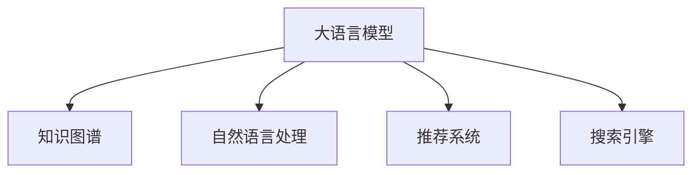

                 

# 人类知识的共享时代：知识就是力量

## 1. 背景介绍

### 1.1 问题由来

在当前信息爆炸的时代，知识的获取和传播方式发生了根本性的变革。传统的书籍、期刊等纸质媒介已不再是唯一的信息来源，互联网、社交媒体、在线教育平台等数字渠道正在成为知识获取的主流方式。这些数字平台利用算法推荐、搜索优化、社交网络等技术手段，将海量知识以高效、精准、个性化的方式呈现给用户，极大地扩展了人类的知识获取范围和深度。

与此同时，大模型、大数据、深度学习等人工智能技术的发展，也为知识的自动化处理和智能化推荐提供了新的工具和方法。这些技术不仅在学术研究、产品开发等方面发挥了重要作用，还逐步渗透到教育、医疗、商业等多个领域，推动了社会的全面进步。

### 1.2 问题核心关键点

在知识共享的时代背景下，如何高效、精准、个性化地获取和推荐知识，成为推动社会发展的重要课题。人工智能技术，特别是大语言模型和知识图谱等方法，为这一问题提供了新的解决方案。

大语言模型（如GPT-3、BERT等）通过在海量文本数据上预训练，学习到丰富的语言和知识表示，能够理解自然语言并生成自然语言，在问答、摘要、翻译、生成文本等领域展现了卓越的性能。知识图谱则通过将实体、关系、属性等信息组织成结构化数据，提供了一种高效的知识组织和检索方式，为信息检索、推荐系统、智能问答等应用提供了强有力的支撑。

这些技术不仅提升了信息处理和知识推荐的效率，还使得知识共享更加便捷、普惠，推动了知识的广泛传播和应用。通过这些技术手段，我们可以从互联网上的任意文本、网页、视频、音频等多种信息源中，高效地检索出符合自己兴趣和需求的知识点，实现个性化、主动化的学习。

## 2. 核心概念与联系

### 2.1 核心概念概述

为更好地理解人工智能技术在知识共享中的应用，本节将介绍几个关键概念及其之间的关系：

- **大语言模型**：以自回归或自编码模型为代表的预训练语言模型。通过在海量无标签文本数据上进行预训练，学习到通用语言表示，具备强大的语言理解和生成能力。
- **知识图谱**：由实体、关系、属性等信息构成的结构化知识库，通过图形表示法来组织和管理知识，支持知识的查询、推理和推荐。
- **自然语言处理**：通过计算机算法实现人机之间的自然语言交流，包括语言理解、生成、翻译、问答等任务。
- **推荐系统**：利用用户行为数据、物品属性、知识图谱等，预测用户可能感兴趣的物品或知识，实现个性化推荐。
- **搜索引擎**：利用算法和索引技术，从海量的文本、网页、多媒体数据中检索出符合用户查询意图的结果。

这些概念之间的逻辑关系可以通过以下Mermaid流程图来展示：



这个流程图展示了大语言模型与其他关键技术之间的关系：

1. 大语言模型通过预训练学习通用语言表示，为自然语言处理和推荐系统提供基础。
2. 知识图谱通过结构化知识组织，为搜索引擎和推荐系统提供高效的信息检索和推荐方式。
3. 自然语言处理和大语言模型通过算法处理用户查询，并调用知识图谱进行搜索和推荐，最终实现个性化知识共享。

## 3. 核心算法原理 & 具体操作步骤
### 3.1 算法原理概述

人工智能技术在知识共享中的应用，主要体现在以下几个核心算法上：

- **大语言模型预训练**：通过在大规模无标签文本数据上自监督学习，学习通用语言表示，用于下游任务的微调。
- **知识图谱构建**：通过自动或半自动的方式，从结构化数据和半结构化数据中构建知识图谱，支持高效的查询和推理。
- **自然语言处理**：通过算法实现自然语言的理解和生成，实现知识检索和知识推荐。
- **推荐系统**：利用用户行为数据、物品属性、知识图谱等，预测用户可能感兴趣的物品或知识，实现个性化推荐。
- **搜索引擎**：利用算法和索引技术，从海量的文本、网页、多媒体数据中检索出符合用户查询意图的结果。

这些算法相互配合，共同构建了人工智能在知识共享中的应用框架。以下将详细讲解其中的核心算法原理和具体操作步骤。

### 3.2 算法步骤详解

**大语言模型预训练**：

1. **数据收集与预处理**：收集大规模无标签文本数据，并进行清洗、去重、分词等预处理操作。
2. **构建训练集**：将预处理后的数据划分为训练集和验证集，准备用于模型的训练。
3. **选择预训练模型**：根据任务需求选择合适的预训练模型，如GPT、BERT、XLNet等。
4. **微调模型**：在预训练模型的基础上，使用标注数据进行有监督微调，优化模型在特定任务上的性能。
5. **性能评估**：在验证集上评估微调后的模型性能，根据评估结果调整超参数和微调策略。

**知识图谱构建**：

1. **数据收集**：收集结构化数据和半结构化数据，如数据库、网页、API文档等。
2. **实体识别**：通过命名实体识别、关系抽取等技术，从文本中识别出实体和关系。
3. **关系抽取**：对识别出的实体关系进行去重、清洗和标准化处理，构建知识图谱的边。
4. **实体属性抽取**：从结构化数据中抽取实体属性信息，填充到知识图谱中。
5. **图谱优化**：利用图谱优化算法，如知识压缩、图谱嵌入等，提升知识图谱的查询效率和推理能力。

**自然语言处理**：

1. **任务定义**：根据具体任务需求，定义自然语言处理的目标，如问答、翻译、摘要、命名实体识别等。
2. **选择模型**：选择适合任务的预训练模型，如BERT、GPT等，并进行微调。
3. **数据准备**：准备标注数据集，划分为训练集、验证集和测试集。
4. **模型训练**：在标注数据集上训练模型，优化模型参数。
5. **性能评估**：在验证集和测试集上评估模型性能，根据评估结果调整模型和训练策略。

**推荐系统**：

1. **数据收集**：收集用户行为数据、物品属性数据和知识图谱数据。
2. **模型选择**：根据任务需求选择合适的推荐算法，如协同过滤、内容推荐、基于知识的推荐等。
3. **模型训练**：在用户行为数据和知识图谱上训练推荐模型，优化模型参数。
4. **推荐预测**：在测试数据集上评估模型预测能力，根据评估结果调整模型和训练策略。
5. **推荐实现**：将训练好的模型部署到实际推荐系统中，实现个性化推荐。

**搜索引擎**：

1. **数据收集**：收集文本、网页、多媒体等数据。
2. **索引构建**：对数据进行分词、去重、建立索引等预处理操作，构建索引库。
3. **查询处理**：根据用户输入的查询词，通过算法匹配索引库中的文本，找到匹配结果。
4. **排序和展示**：对匹配结果进行排序，展示给用户。
5. **性能优化**：利用搜索算法和索引技术，优化查询效率和搜索结果的相关性。

### 3.3 算法优缺点

**大语言模型预训练**：

- **优点**：预训练模型学习到通用语言表示，适用于多种自然语言处理任务，提升模型性能。
- **缺点**：预训练模型需要大规模无标签数据，训练成本高，模型大小可能造成内存和计算资源占用高。

**知识图谱构建**：

- **优点**：提供结构化知识库，支持高效的信息检索和推理，提升知识推荐和问答系统性能。
- **缺点**：构建和维护知识图谱需要大量人工干预，图谱复杂度增加可能影响查询效率。

**自然语言处理**：

- **优点**：通过算法处理自然语言，实现知识的自动化理解和生成，提升处理效率。
- **缺点**：处理复杂语言结构时可能出现理解错误，需要大量的标注数据进行微调。

**推荐系统**：

- **优点**：通过用户行为和知识图谱预测用户兴趣，实现个性化推荐，提升用户体验。
- **缺点**：需要大量用户行为数据和物品属性信息，数据隐私和安全问题需要关注。

**搜索引擎**：

- **优点**：利用算法和索引技术，实现高效的信息检索，支持大规模数据处理。
- **缺点**：查询结果的相关性和召回率需要持续优化，复杂查询可能影响查询效率。

## 4. 数学模型和公式 & 详细讲解  
### 4.1 数学模型构建

本节将使用数学语言对上述核心算法进行更加严格的刻画。

- **大语言模型预训练**：

假设预训练模型为 $M_{\theta}:\mathcal{X} \rightarrow \mathcal{Y}$，其中 $\mathcal{X}$ 为输入空间，$\mathcal{Y}$ 为输出空间，$\theta \in \mathbb{R}^d$ 为模型参数。定义损失函数 $\mathcal{L}(\theta)$ 为：

$$
\mathcal{L}(\theta) = \frac{1}{N}\sum_{i=1}^N \ell(M_{\theta}(x_i),y_i)
$$

其中 $\ell$ 为损失函数，$\frac{1}{N}\sum_{i=1}^N \ell(M_{\theta}(x_i),y_i)$ 为模型在训练集 $D$ 上的经验风险。通过优化算法（如Adam、SGD等）最小化损失函数，更新模型参数 $\theta$。

- **知识图谱构建**：

知识图谱由实体 $E$、关系 $R$、属性 $A$ 构成，表示为三元组 $(e,r,a)$。构建知识图谱的过程包括实体识别、关系抽取和属性抽取等。

- **自然语言处理**：

假设自然语言处理任务为问答、翻译、摘要等，模型为 $M_{\theta}$。定义损失函数 $\mathcal{L}(\theta)$ 为：

$$
\mathcal{L}(\theta) = \frac{1}{N}\sum_{i=1}^N \ell(M_{\theta}(x_i),y_i)
$$

其中 $\ell$ 为任务特定损失函数。通过优化算法（如Adam、SGD等）最小化损失函数，更新模型参数 $\theta$。

- **推荐系统**：

推荐系统基于协同过滤、内容推荐、基于知识的推荐等算法。假设模型为 $M_{\theta}$，定义损失函数 $\mathcal{L}(\theta)$ 为：

$$
\mathcal{L}(\theta) = \frac{1}{N}\sum_{i=1}^N \ell(M_{\theta}(u_i),y_i)
$$

其中 $\ell$ 为推荐损失函数，$u_i$ 为用户行为数据，$y_i$ 为推荐结果。通过优化算法（如Adam、SGD等）最小化损失函数，更新模型参数 $\theta$。

- **搜索引擎**：

搜索引擎通过倒排索引、向量空间模型等算法实现信息检索。假设查询词为 $q$，搜索结果为 $R(q)$，定义损失函数 $\mathcal{L}(q)$ 为：

$$
\mathcal{L}(q) = \frac{1}{N}\sum_{i=1}^N \ell(q,r_i)
$$

其中 $\ell$ 为检索损失函数，$r_i$ 为搜索结果。通过优化算法（如Adam、SGD等）最小化损失函数，更新模型参数 $\theta$。

### 4.2 公式推导过程

**大语言模型预训练**：

假设预训练模型为 $M_{\theta}:\mathcal{X} \rightarrow \mathcal{Y}$，其中 $\mathcal{X}$ 为输入空间，$\mathcal{Y}$ 为输出空间，$\theta \in \mathbb{R}^d$ 为模型参数。定义损失函数 $\mathcal{L}(\theta)$ 为：

$$
\mathcal{L}(\theta) = \frac{1}{N}\sum_{i=1}^N \ell(M_{\theta}(x_i),y_i)
$$

其中 $\ell$ 为损失函数，$\frac{1}{N}\sum_{i=1}^N \ell(M_{\theta}(x_i),y_i)$ 为模型在训练集 $D$ 上的经验风险。通过优化算法（如Adam、SGD等）最小化损失函数，更新模型参数 $\theta$。

**知识图谱构建**：

知识图谱由实体 $E$、关系 $R$、属性 $A$ 构成，表示为三元组 $(e,r,a)$。构建知识图谱的过程包括实体识别、关系抽取和属性抽取等。

**自然语言处理**：

假设自然语言处理任务为问答、翻译、摘要等，模型为 $M_{\theta}$。定义损失函数 $\mathcal{L}(\theta)$ 为：

$$
\mathcal{L}(\theta) = \frac{1}{N}\sum_{i=1}^N \ell(M_{\theta}(x_i),y_i)
$$

其中 $\ell$ 为任务特定损失函数。通过优化算法（如Adam、SGD等）最小化损失函数，更新模型参数 $\theta$。

**推荐系统**：

推荐系统基于协同过滤、内容推荐、基于知识的推荐等算法。假设模型为 $M_{\theta}$，定义损失函数 $\mathcal{L}(\theta)$ 为：

$$
\mathcal{L}(\theta) = \frac{1}{N}\sum_{i=1}^N \ell(M_{\theta}(u_i),y_i)
$$

其中 $\ell$ 为推荐损失函数，$u_i$ 为用户行为数据，$y_i$ 为推荐结果。通过优化算法（如Adam、SGD等）最小化损失函数，更新模型参数 $\theta$。

**搜索引擎**：

搜索引擎通过倒排索引、向量空间模型等算法实现信息检索。假设查询词为 $q$，搜索结果为 $R(q)$，定义损失函数 $\mathcal{L}(q)$ 为：

$$
\mathcal{L}(q) = \frac{1}{N}\sum_{i=1}^N \ell(q,r_i)
$$

其中 $\ell$ 为检索损失函数，$r_i$ 为搜索结果。通过优化算法（如Adam、SGD等）最小化损失函数，更新模型参数 $\theta$。

## 5. 项目实践：代码实例和详细解释说明
### 5.1 开发环境搭建

在进行人工智能技术在知识共享中的应用实践前，我们需要准备好开发环境。以下是使用Python进行PyTorch开发的环境配置流程：

1. 安装Anaconda：从官网下载并安装Anaconda，用于创建独立的Python环境。

2. 创建并激活虚拟环境：
```bash
conda create -n pytorch-env python=3.8 
conda activate pytorch-env
```

3. 安装PyTorch：根据CUDA版本，从官网获取对应的安装命令。例如：
```bash
conda install pytorch torchvision torchaudio cudatoolkit=11.1 -c pytorch -c conda-forge
```

4. 安装TensorFlow：由Google主导开发的开源深度学习框架，生产部署方便，适合大规模工程应用。同样有丰富的预训练语言模型资源。

5. 安装Transformers库：
```bash
pip install transformers
```

6. 安装各类工具包：
```bash
pip install numpy pandas scikit-learn matplotlib tqdm jupyter notebook ipython
```

完成上述步骤后，即可在`pytorch-env`环境中开始人工智能技术在知识共享中的应用实践。

### 5.2 源代码详细实现

这里我们以问答系统为例，给出使用Transformers库对BERT模型进行微调的PyTorch代码实现。

首先，定义问答任务的数据处理函数：

```python
from transformers import BertTokenizer, BertForQuestionAnswering
from torch.utils.data import Dataset, DataLoader
import torch

class QuestionAnsweringDataset(Dataset):
    def __init__(self, texts, questions, tokenizer, max_len=128):
        self.texts = texts
        self.questions = questions
        self.tokenizer = tokenizer
        self.max_len = max_len
        
    def __len__(self):
        return len(self.texts)
    
    def __getitem__(self, item):
        text = self.texts[item]
        question = self.questions[item]
        
        encoding = self.tokenizer(question, text, return_tensors='pt', max_length=self.max_len, padding='max_length', truncation=True)
        input_ids = encoding['input_ids'][0]
        attention_mask = encoding['attention_mask'][0]
        return {'input_ids': input_ids, 
                'attention_mask': attention_mask,
                'labels': encoding['labels'][0]}

# 创建dataset
tokenizer = BertTokenizer.from_pretrained('bert-base-cased')
train_dataset = QuestionAnsweringDataset(train_texts, train_questions, tokenizer)
dev_dataset = QuestionAnsweringDataset(dev_texts, dev_questions, tokenizer)
test_dataset = QuestionAnsweringDataset(test_texts, test_questions, tokenizer)
```

然后，定义模型和优化器：

```python
from transformers import BertForQuestionAnswering, AdamW

model = BertForQuestionAnswering.from_pretrained('bert-base-cased')

optimizer = AdamW(model.parameters(), lr=2e-5)
```

接着，定义训练和评估函数：

```python
from tqdm import tqdm

device = torch.device('cuda') if torch.cuda.is_available() else torch.device('cpu')
model.to(device)

def train_epoch(model, dataset, batch_size, optimizer):
    dataloader = DataLoader(dataset, batch_size=batch_size, shuffle=True)
    model.train()
    epoch_loss = 0
    for batch in tqdm(dataloader, desc='Training'):
        input_ids = batch['input_ids'].to(device)
        attention_mask = batch['attention_mask'].to(device)
        labels = batch['labels'].to(device)
        model.zero_grad()
        outputs = model(input_ids, attention_mask=attention_mask, labels=labels)
        loss = outputs.loss
        epoch_loss += loss.item()
        loss.backward()
        optimizer.step()
    return epoch_loss / len(dataloader)

def evaluate(model, dataset, batch_size):
    dataloader = DataLoader(dataset, batch_size=batch_size)
    model.eval()
    correct = 0
    total = 0
    for batch in dataloader:
        input_ids = batch['input_ids'].to(device)
        attention_mask = batch['attention_mask'].to(device)
        labels = batch['labels'].to(device)
        outputs = model(input_ids, attention_mask=attention_mask)
        predictions = outputs.logits.argmax(dim=1).to('cpu').tolist()
        labels = labels.to('cpu').tolist()
        for pred, label in zip(predictions, labels):
            if pred == label:
                correct += 1
            total += 1
    print('Accuracy:', correct/total)
```

最后，启动训练流程并在测试集上评估：

```python
epochs = 5
batch_size = 16

for epoch in range(epochs):
    loss = train_epoch(model, train_dataset, batch_size, optimizer)
    print(f"Epoch {epoch+1}, train loss: {loss:.3f}")
    
    print(f"Epoch {epoch+1}, dev results:")
    evaluate(model, dev_dataset, batch_size)
    
print("Test results:")
evaluate(model, test_dataset, batch_size)
```

以上就是使用PyTorch对BERT进行问答系统微调的完整代码实现。可以看到，得益于Transformers库的强大封装，我们可以用相对简洁的代码完成BERT模型的加载和微调。

### 5.3 代码解读与分析

让我们再详细解读一下关键代码的实现细节：

**QuestionAnsweringDataset类**：
- `__init__`方法：初始化文本、问题和分词器等关键组件。
- `__len__`方法：返回数据集的样本数量。
- `__getitem__`方法：对单个样本进行处理，将问题和文本输入编码为token ids，返回模型所需的输入和标签。

**tokenizer**：
- 使用BERT分词器进行文本和问题的分词，并将其转化为模型所需的输入。

**训练和评估函数**：
- 使用PyTorch的DataLoader对数据集进行批次化加载，供模型训练和推理使用。
- 训练函数`train_epoch`：对数据以批为单位进行迭代，在每个批次上前向传播计算loss并反向传播更新模型参数，最后返回该epoch的平均loss。
- 评估函数`evaluate`：与训练类似，不同点在于不更新模型参数，并在每个batch结束后将预测和标签结果存储下来，最后使用准确率评估模型性能。

**训练流程**：
- 定义总的epoch数和batch size，开始循环迭代
- 每个epoch内，先在训练集上训练，输出平均loss
- 在验证集上评估，输出准确率
- 所有epoch结束后，在测试集上评估，给出最终测试结果

可以看到，PyTorch配合Transformers库使得BERT微调的代码实现变得简洁高效。开发者可以将更多精力放在数据处理、模型改进等高层逻辑上，而不必过多关注底层的实现细节。

当然，工业级的系统实现还需考虑更多因素，如模型的保存和部署、超参数的自动搜索、更灵活的任务适配层等。但核心的微调范式基本与此类似。

## 6. 实际应用场景
### 6.1 智能客服系统

基于人工智能技术在知识共享中的应用，智能客服系统可以大幅度提升客户咨询体验。传统客服往往需要配备大量人力，高峰期响应缓慢，且一致性和专业性难以保证。而使用问答系统，可以通过预训练的语言模型和知识图谱，实现24小时不间断服务，快速响应客户咨询，用自然流畅的语言解答各类常见问题。

在技术实现上，可以收集企业内部的历史客服对话记录，将问题和最佳答复构建成监督数据，在此基础上对预训练模型进行微调。微调后的问答系统能够自动理解用户意图，匹配最合适的答案模板进行回复。对于客户提出的新问题，还可以接入检索系统实时搜索相关内容，动态组织生成回答。如此构建的智能客服系统，能大幅提升客户咨询体验和问题解决效率。

### 6.2 金融舆情监测

金融机构需要实时监测市场舆论动向，以便及时应对负面信息传播，规避金融风险。传统的人工监测方式成本高、效率低，难以应对网络时代海量信息爆发的挑战。基于问答系统，可以利用预训练语言模型和知识图谱，对金融领域的财经新闻、评论、市场报告等文本进行自动化的信息提取和分析，从而实现实时的舆情监测。

具体而言，可以收集金融领域相关的新闻、报道、评论等文本数据，并对其进行实体抽取和关系抽取。利用问答系统，对抽取出的实体和关系进行关联和推理，从而实时监测市场舆情变化。一旦发现负面信息激增等异常情况，系统便会自动预警，帮助金融机构快速应对潜在风险。

### 6.3 个性化推荐系统

当前的推荐系统往往只依赖用户的历史行为数据进行物品推荐，无法深入理解用户的真实兴趣偏好。基于问答系统，可以通过预训练的语言模型和知识图谱，实现更全面、更精准的个性化推荐。

在实践中，可以收集用户浏览、点击、评论、分享等行为数据，提取和用户交互的物品标题、描述、标签等文本内容。将文本内容作为模型输入，用户的后续行为（如是否点击、购买等）作为监督信号，在此基础上微调预训练语言模型。微调后的模型能够从文本内容中准确把握用户的兴趣点。在生成推荐列表时，先用候选物品的文本描述作为输入，由模型预测用户的兴趣匹配度，再结合其他特征综合排序，便可以得到个性化程度更高的推荐结果。

### 6.4 未来应用展望

随着人工智能技术在知识共享中的应用不断深入，基于问答系统和大语言模型的应用将更加广泛。未来，这些技术有望在更多领域得到应用，为传统行业带来变革性影响。

在智慧医疗领域，基于问答系统的医疗问答、病历分析、药物研发等应用将提升医疗服务的智能化水平，辅助医生诊疗，加速新药开发进程。

在智能教育领域，问答系统可应用于作业批改、学情分析、知识推荐等方面，因材施教，促进教育公平，提高教学质量。

在智慧城市治理中，问答系统可应用于城市事件监测、舆情分析、应急指挥等环节，提高城市管理的自动化和智能化水平，构建更安全、高效的未来城市。

此外，在企业生产、社会治理、文娱传媒等众多领域，基于问答系统的人工智能应用也将不断涌现，为经济社会发展注入新的动力。相信随着技术的日益成熟，问答系统必将在构建人机协同的智能时代中扮演越来越重要的角色。

## 7. 工具和资源推荐
### 7.1 学习资源推荐

为了帮助开发者系统掌握人工智能技术在知识共享中的应用，这里推荐一些优质的学习资源：

1. 《深度学习》系列课程：由斯坦福大学Andrew Ng教授开设，涵盖深度学习的基础知识和应用，适合初学者和进阶者。

2. 《自然语言处理》课程：由斯坦福大学Liang-Ping Koo教授开设，涵盖自然语言处理的基本概念和技术，从语言模型、词向量到语义理解、信息检索等。

3. 《知识图谱与语义Web》课程：由中国人民大学刘世昌教授开设，涵盖知识图谱的基本概念、构建方法和应用，适合对知识表示和推理感兴趣的学习者。

4. 《智能问答系统》书籍：全面介绍问答系统的前沿技术，包括自然语言处理、知识图谱、深度学习等，适合希望深入学习问答系统的读者。

5. Kaggle：全球最大的数据科学竞赛平台，提供了丰富的数据集和算法挑战，有助于实践学习和算法迭代。

通过对这些资源的学习实践，相信你一定能够快速掌握人工智能技术在知识共享中的应用，并用于解决实际的NLP问题。
###  7.2 开发工具推荐

高效的开发离不开优秀的工具支持。以下是几款用于人工智能技术在知识共享中的应用开发的常用工具：

1. PyTorch：基于Python的开源深度学习框架，灵活动态的计算图，适合快速迭代研究。大部分预训练语言模型都有PyTorch版本的实现。

2. TensorFlow：由Google主导开发的开源深度学习框架，生产部署方便，适合大规模工程应用。同样有丰富的预训练语言模型资源。

3. Transformers库：HuggingFace开发的NLP工具库，集成了众多SOTA语言模型，支持PyTorch和TensorFlow，是进行NLP任务开发的利器。

4. Weights & Biases：模型训练的实验跟踪工具，可以记录和可视化模型训练过程中的各项指标，方便对比和调优。与主流深度学习框架无缝集成。

5. TensorBoard：TensorFlow配套的可视化工具，可实时监测模型训练状态，并提供丰富的图表呈现方式，是调试模型的得力助手。

6. Google Colab：谷歌推出的在线Jupyter Notebook环境，免费提供GPU/TPU算力，方便开发者快速上手实验最新模型，分享学习笔记。

合理利用这些工具，可以显著提升人工智能技术在知识共享中的应用开发效率，加快创新迭代的步伐。

### 7.3 相关论文推荐

人工智能技术在知识共享中的应用源于学界的持续研究。以下是几篇奠基性的相关论文，推荐阅读：

1. Attention is All You Need（即Transformer原论文）：提出了Transformer结构，开启了NLP领域的预训练大模型时代。

2. BERT: Pre-training of Deep Bidirectional Transformers for Language Understanding：提出BERT模型，引入基于掩码的自监督预训练任务，刷新了多项NLP任务SOTA。

3. Knowledge Graph Embeddings：通过向量空间表示法将知识图谱中的实体和关系映射到低维向量空间，支持高效的信息检索和推理。

4. Graph Convolutional Networks for Knowledge Graph Completion：利用图卷积网络（GCN）对知识图谱进行嵌入，提升知识图谱的查询和推理能力。

5. Neural Topic Models for Document Question Answering：基于深度学习模型对文档进行主题建模，提升问答系统的准确率和泛化能力。

这些论文代表了大语言模型微调技术的发展脉络。通过学习这些前沿成果，可以帮助研究者把握学科前进方向，激发更多的创新灵感。

## 8. 总结：未来发展趋势与挑战

### 8.1 总结

本文对人工智能技术在知识共享中的应用进行了全面系统的介绍。首先阐述了人工智能技术在知识共享中的背景和意义，明确了基于问答系统和大语言模型的重要价值。其次，从原理到实践，详细讲解了人工智能技术在知识共享中的应用框架，给出了问答系统和大语言模型的完整代码实例。同时，本文还广泛探讨了人工智能技术在智能客服、金融舆情、个性化推荐等多个领域的应用前景，展示了人工智能技术在知识共享中的广阔前景。

通过本文的系统梳理，可以看到，人工智能技术在知识共享中的应用正在成为推动社会进步的重要力量。这些技术不仅提升了信息处理和知识推荐的效率，还使得知识共享更加便捷、普惠，推动了知识的广泛传播和应用。未来，伴随人工智能技术的持续演进，人工智能技术在知识共享中的应用将更加广泛和深入，为构建智能社会奠定坚实基础。

### 8.2 未来发展趋势

展望未来，人工智能技术在知识共享中的应用将呈现以下几个发展趋势：

1. **模型规模持续增大**：随着算力成本的下降和数据规模的扩张，预训练语言模型的参数量还将持续增长。超大规模语言模型蕴含的丰富语言知识，有望支撑更加复杂多变的下游任务微调。

2. **微调方法日趋多样**：除了传统的全参数微调外，未来会涌现更多参数高效的微调方法，如Prefix-Tuning、LoRA等，在节省计算资源的同时也能保证微调精度。

3. **持续学习成为常态**：随着数据分布的不断变化，微调模型也需要持续学习新知识以保持性能。如何在不遗忘原有知识的同时，高效吸收新样本信息，将成为重要的研究课题。

4. **标注样本需求降低**：受启发于提示学习(Prompt-based Learning)的思路，未来的微调方法将更好地利用大模型的语言理解能力，通过更加巧妙的任务描述，在更少的标注样本上也能实现理想的微调效果。

5. **多模态微调崛起**：当前的微调主要聚焦于纯文本数据，未来会进一步拓展到图像、视频、语音等多模态数据微调。多模态信息的融合，将显著提升语言模型对现实世界的理解和建模能力。

6. **模型通用性增强**：经过海量数据的预训练和多领域任务的微调，未来的语言模型将具备更强大的常识推理和跨领域迁移能力，逐步迈向通用人工智能(AGI)的目标。

以上趋势凸显了人工智能技术在知识共享中的应用前景。这些方向的探索发展，必将进一步提升人工智能技术在知识共享中的应用性能和应用范围，为社会带来更加广泛的影响。

### 8.3 面临的挑战

尽管人工智能技术在知识共享中的应用已经取得了瞩目成就，但在迈向更加智能化、普适化应用的过程中，它仍面临着诸多挑战：

1. **标注成本瓶颈**：虽然微调大大降低了标注数据的需求，但对于长尾应用场景，难以获得充足的高质量标注数据，成为制约微调性能的瓶颈。如何进一步降低微调对标注样本的依赖，将是一大难题。

2. **模型鲁棒性不足**：当前微调模型面对域外数据时，泛化性能往往大打折扣。对于测试样本的微小扰动，微调模型的预测也容易发生波动。如何提高微调模型的鲁棒性，避免灾难性遗忘，还需要更多理论和实践的积累。

3. **推理效率有待提高**：大规模语言模型虽然精度高，但在实际部署时往往面临推理速度慢、内存占用大等效率问题。如何在保证性能的同时，简化模型结构，提升推理速度，优化资源占用，将是重要的优化方向。

4. **可解释性亟需加强**：当前微调模型更像是"黑盒"系统，难以解释其内部工作机制和决策逻辑。对于医疗、金融等高风险应用，算法的可解释性和可审计性尤为重要。如何赋予微调模型更强的可解释性，将是亟待攻克的难题。

5. **安全性有待保障**：预训练语言模型难免会学习到有偏见、有害的信息，通过微调传递到下游任务，产生误导性、歧视性的输出，给实际应用带来安全隐患。如何从数据和算法层面消除模型偏见，避免恶意用途，确保输出的安全性，也将是重要的研究课题。

6. **知识整合能力不足**：现有的微调模型往往局限于任务内数据，难以灵活吸收和运用更广泛的先验知识。如何让微调过程更好地与外部知识库、规则库等专家知识结合，形成更加全面、准确的信息整合能力，还有很大的想象空间。

正视人工智能技术在知识共享中面临的这些挑战，积极应对并寻求突破，将是大语言模型微调走向成熟的必由之路。相信随着学界和产业界的共同努力，这些挑战终将一一被克服，人工智能技术在知识共享中的应用必将在构建智能社会中扮演越来越重要的角色。

### 8.4 未来突破

面对人工智能技术在知识共享中所面临的种种挑战，未来的研究需要在以下几个方面寻求新的突破：

1. **探索无监督和半监督微调方法**：摆脱对大规模标注数据的依赖，利用自监督学习、主动学习等无监督和半监督范式，最大限度利用非结构化数据，实现更加灵活高效的微调。

2. **研究参数高效和计算高效的微调范式**：开发更加参数高效的微调方法，在固定大部分预训练参数的同时，只更新极少量的任务相关参数。同时优化微调模型的计算图，减少前向传播和反向传播的资源消耗，实现更加轻量级、实时性的部署。

3. **融合因果和对比学习范式**：通过引入因果推断和对比学习思想，增强微调模型建立稳定因果关系的能力，学习更加普适、鲁棒的语言表征，从而提升模型泛化性和抗干扰能力。

4. **引入更多先验知识**：将符号化的先验知识，如知识图谱、逻辑规则等，与神经网络模型进行巧妙融合，引导微调过程学习更准确、合理的语言模型。同时加强不同模态数据的整合，实现视觉、语音等多模态信息与文本信息的协同建模。

5. **结合因果分析和博弈论工具**：将因果分析方法引入微调模型，识别出模型决策的关键特征，增强输出解释的因果性和逻辑性。借助博弈论工具刻画人机交互过程，主动探索并规避模型的脆弱点，提高系统稳定性。

6. **纳入伦理道德约束**：在模型训练目标中引入伦理导向的评估指标，过滤和惩罚有偏见、有害的输出倾向。同时加强人工干预和审核，建立模型行为的监管机制，确保输出符合人类价值观和伦理道德。

这些研究方向的探索，必将引领人工智能技术在知识共享中的应用走向更高的台阶，为构建安全、可靠、可解释、可控的智能系统铺平道路。面向未来，人工智能技术在知识共享中的应用还需要与其他人工智能技术进行更深入的融合，如知识表示、因果推理、强化学习等，多路径协同发力，共同推动自然语言理解和智能交互系统的进步。只有勇于创新、敢于突破，才能不断拓展语言模型的边界，让智能技术更好地造福人类社会。

## 9. 附录：常见问题与解答

**Q1：人工智能技术在知识共享中的优势是什么？**

A: 人工智能技术在知识共享中的优势主要体现在以下几个方面：

1. **高效性**：通过自动化算法处理海量数据，快速提取和检索信息，提升信息获取效率。
2. **准确性**：利用深度学习模型和知识图谱，提供精准的信息推荐和检索，减少人工错误。
3. **个性化**：根据用户行为和偏好，推荐个性化内容，提升用户体验。
4. **可扩展性**：支持多语言、多模态数据处理，适应不同应用场景。
5. **普惠性**：打破时间和空间限制，提供便捷的信息获取途径，推动知识普惠。

**Q2：人工智能技术在知识共享中的应用主要有哪些？**

A: 人工智能技术在知识共享中的应用主要包括以下几个方面：

1. **智能问答系统**：利用自然语言处理和知识图谱技术，实现高效、准确的信息检索和回答。
2. **推荐系统**：通过用户行为数据和知识图谱，提供个性化的信息推荐。
3. **搜索引擎**：利用算法和索引技术，实现高效的信息检索和排序。
4. **智能客服系统**：通过问答系统实现智能客服，提升客户咨询体验和问题解决效率。
5. **金融舆情监测**：利用自然语言处理和知识图谱技术，实时监测市场舆情变化。

**Q3：人工智能技术在知识共享中面临的挑战有哪些？**

A: 人工智能技术在知识共享中面临的挑战主要包括以下几个方面：

1. **标注数据不足**：对于某些特定领域或长尾应用场景，难以获取高质量的标注数据，影响模型性能。
2. **模型鲁棒性不足**：模型对域外数据的泛化能力有限，易受到数据扰动的影响。
3. **推理效率低下**：大规模语言模型虽精度高，但推理速度慢，内存占用大。
4. **可解释性差**：模型输出缺乏可解释性，难以理解其决策逻辑。
5. **安全性问题**：模型可能学习到有害信息，给实际应用带来安全隐患。
6. **知识整合能力不足**：模型难以灵活吸收和运用外部先验知识。

**Q4：如何提高人工智能技术在知识共享中的性能？**

A: 提高人工智能技术在知识共享中的性能，可以从以下几个方面入手：

1. **数据增强**：通过数据增强技术，扩充训练数据集，提高模型泛化能力。
2. **模型优化**：优化模型结构，提高推理速度和内存占用效率。
3. **知识融合**：将先验知识与神经网络模型结合，提升模型的知识整合能力。
4. **算法改进**：引入因果分析、对比学习等技术，增强模型的鲁棒性和泛化能力。
5. **模型可解释性**：开发可解释性强的模型，提供用户友好的解释机制。

**Q5：人工智能技术在知识共享中的未来发展方向有哪些？**

A: 人工智能技术在知识共享中的未来发展方向主要包括以下几个方面：

1. **模型规模增大**：通过预训练大模型，提升模型的语言理解和知识表示能力。
2. **微调方法多样化**：开发更多参数高效、计算高效的微调方法，提升微调效率和效果。
3. **持续学习**：使模型能够持续学习新知识，适应数据分布变化。
4. **少样本学习**：通过提示学习等技术，实现少样本高效学习。
5. **多模态融合**：将文本、图像、语音等多模态数据融合，提升模型的综合处理能力。
6. **伦理约束**：引入伦理导向的评估指标，确保模型的输出符合人类价值观和伦理道德。

通过以上这些突破，人工智能技术在知识共享中的应用将更加智能化、普适化和安全可靠，推动构建智能社会。

---

作者：禅与计算机程序设计艺术 / Zen and the Art of Computer Programming

