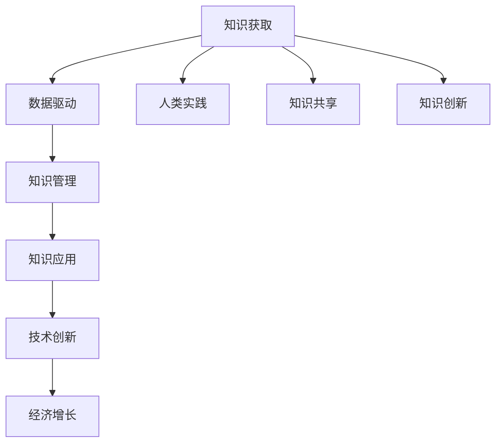

                 

# 人类知识的来源：实践、思考与交流

> 关键词：知识获取, 知识管理, 知识创新, 数据驱动, 信息时代

## 1. 背景介绍

### 1.1 问题由来
随着信息时代的到来，知识的生产、传播和应用方式发生了深刻变革。大数据、人工智能等技术的迅猛发展，为人类知识的获取、管理和创新带来了前所未有的机遇和挑战。人们如何有效地获取、处理和利用知识，已成为现代社会必须面对的重要问题。

### 1.2 问题核心关键点
在当前信息时代，人类知识的来源主要包括以下几个方面：

- **数据驱动**：通过大数据分析、机器学习等技术，从海量数据中挖掘有价值的信息和知识。
- **人类实践**：通过实践经验、实验验证等方式积累知识。
- **知识共享**：通过书籍、论文、培训等形式，实现知识的传播和共享。
- **知识创新**：基于已有知识，通过推理、试验等方法，产生新的知识。

这些知识来源构成了现代知识体系的基础，并在不同领域以不同的方式被应用。例如，科学研究依赖实验数据和文献，工程设计需要大量的实验和实践经验，而商业决策则基于市场数据和业务分析。

### 1.3 问题研究意义
探索人类知识的来源和获取方式，对于推动知识管理和应用、提升创新能力具有重要意义。通过对知识获取机制的深入研究，可以优化知识管理流程，提高知识共享和利用的效率，从而加速社会和经济的进步。

## 2. 核心概念与联系

### 2.1 核心概念概述

为更好地理解人类知识的来源，本节将介绍几个密切相关的核心概念：

- **知识获取**：指通过各种方式获取新知识的过程，包括数据挖掘、实验验证、文献查阅等。
- **知识管理**：指对知识进行组织、存储、检索和共享的过程，包括知识的分类、索引、存储和管理等。
- **知识创新**：指基于已有知识，通过推理、试验等方法，产生新的知识或应用。
- **数据驱动**：指利用大数据和机器学习技术，从海量数据中提取知识和洞见。
- **信息时代**：指以信息技术为核心的时代，强调信息的重要性及其在知识获取和应用中的作用。

这些核心概念之间的逻辑关系可以通过以下Mermaid流程图来展示：



这个流程图展示了几类知识来源及其之间的关系：

1. 知识获取通过数据驱动和人类实践等方式进行。
2. 数据驱动利用大数据和机器学习技术，从数据中挖掘知识。
3. 人类实践通过实验和经验积累知识。
4. 知识共享通过文献和培训等方式传播知识。
5. 知识创新基于已有知识，通过推理试验产生新知识。
6. 知识管理对知识进行组织和存储，便于应用。
7. 知识应用通过技术创新，推动经济增长。

## 3. 核心算法原理 & 具体操作步骤

### 3.1 算法原理概述

基于数据驱动的知识获取，本质上是一个从数据到知识的过程。其核心思想是：通过分析大量数据，提取有价值的信息和模式，从而产生新的知识。

形式化地，设输入数据集为 $D=\{(x_i,y_i)\}_{i=1}^N$，其中 $x_i$ 为输入特征，$y_i$ 为标签。知识获取的目标是找到映射函数 $f$，使得 $y=f(x)$。

假设 $f$ 为线性函数，则目标函数为：

$$
\min_{f} \frac{1}{N} \sum_{i=1}^N \|y_i - f(x_i)\|^2
$$

常用的算法包括线性回归、逻辑回归、支持向量机等。通过最小化损失函数，可以找到最优的 $f$。

### 3.2 算法步骤详解

基于数据驱动的知识获取一般包括以下几个关键步骤：

**Step 1: 数据预处理**

- 清洗和处理原始数据，去除噪声和错误。
- 特征选择和提取，找到对知识获取有意义的特征。
- 数据归一化和标准化，提高模型的收敛速度。

**Step 2: 模型训练**

- 选择适当的模型，如线性回归、逻辑回归、支持向量机等。
- 训练模型，最小化损失函数，得到最优的模型参数。

**Step 3: 模型评估**

- 在验证集上评估模型的性能，如准确率、召回率、F1值等。
- 调整模型参数，进一步优化模型性能。

**Step 4: 模型应用**

- 使用模型进行知识预测，生成新的知识。
- 对预测结果进行后处理，保证知识的准确性和可靠性。

### 3.3 算法优缺点

基于数据驱动的知识获取方法具有以下优点：

- **效率高**：利用机器学习算法，可以大规模处理海量数据，快速提取知识。
- **精度高**：通过优化模型，可以获得较为准确的预测结果。
- **适用性强**：适用于各种类型的知识获取，如分类、回归、聚类等。

同时，该方法也存在一定的局限性：

- **依赖数据质量**：模型的性能很大程度上取决于数据的完整性和准确性。
- **缺乏因果关系**：机器学习模型只能发现相关性，无法直接推断因果关系。
- **解释性不足**：模型通常是黑盒系统，难以解释其内部决策过程。
- **数据隐私和安全**：模型使用大量数据，可能涉及隐私和安全问题。

尽管存在这些局限性，但就目前而言，基于数据驱动的知识获取方法仍是知识获取的主流范式。未来相关研究的重点在于如何进一步提高模型的解释性，保护数据隐私，以及发现更加深刻的因果关系。

### 3.4 算法应用领域

基于数据驱动的知识获取方法在多个领域得到了广泛的应用，例如：

- **科学研究**：通过分析实验数据，发现新的科学规律。
- **金融分析**：利用历史交易数据，预测股市走势。
- **医疗诊断**：分析患者数据，诊断疾病并提出治疗方案。
- **市场营销**：通过市场数据，分析消费者行为，优化广告策略。
- **自然语言处理**：利用文本数据，进行情感分析、文本分类等任务。

这些应用领域展示了数据驱动方法在知识获取中的强大能力，并推动了各行业的发展。随着数据量的不断增加和机器学习技术的不断进步，基于数据驱动的知识获取方法将在更多领域得到应用，为各行各业带来新的突破。

## 4. 数学模型和公式 & 详细讲解 & 举例说明

### 4.1 数学模型构建

本节将使用数学语言对基于数据驱动的知识获取过程进行更加严格的刻画。

假设输入数据集为 $D=\{(x_i,y_i)\}_{i=1}^N$，其中 $x_i \in \mathbb{R}^d$ 为特征向量，$y_i \in \mathbb{R}$ 为标签。

定义模型 $f$ 为线性函数，即 $f(x)=\theta^Tx$，其中 $\theta \in \mathbb{R}^d$ 为模型参数。目标函数为：

$$
\min_{\theta} \frac{1}{N} \sum_{i=1}^N (y_i - \theta^Tx_i)^2
$$

通过求解上述优化问题，可以找到最优的 $\theta$，从而得到知识获取模型。

### 4.2 公式推导过程

以下我们以线性回归为例，推导目标函数及其梯度计算公式。

假设模型 $f(x)=\theta^Tx$，其中 $\theta$ 为模型参数。目标函数为：

$$
\min_{\theta} \frac{1}{N} \sum_{i=1}^N (y_i - \theta^Tx_i)^2
$$

根据梯度下降算法，目标函数的梯度为：

$$
\nabla_{\theta}\mathcal{L}(\theta) = -\frac{2}{N}\sum_{i=1}^N (y_i - \theta^Tx_i)x_i
$$

通过求解上述梯度方程，可以得到最优的 $\theta$。

### 4.3 案例分析与讲解

假设我们要分析某超市的销售数据，以预测未来的销售额。设数据集 $D=\{(x_i,y_i)\}_{i=1}^N$，其中 $x_i$ 为日期、天气、促销活动等特征，$y_i$ 为当天的销售额。

- **数据预处理**：清洗和处理原始数据，去除噪声和错误。选择天气、促销活动等对销售额有显著影响的特征。归一化和标准化处理数据。
- **模型训练**：选择线性回归模型 $f(x)=\theta^Tx$，训练模型，最小化损失函数。
- **模型评估**：在验证集上评估模型性能，如准确率、召回率等。
- **模型应用**：使用模型进行未来销售额的预测，生成新的知识。对预测结果进行后处理，确保其准确性和可靠性。

## 5. 项目实践：代码实例和详细解释说明

### 5.1 开发环境搭建

在进行知识获取实践前，我们需要准备好开发环境。以下是使用Python进行Scikit-learn开发的Python环境配置流程：

1. 安装Anaconda：从官网下载并安装Anaconda，用于创建独立的Python环境。

2. 创建并激活虚拟环境：
```bash
conda create -n sklearn-env python=3.8 
conda activate sklearn-env
```

3. 安装Scikit-learn和其他相关库：
```bash
conda install scikit-learn numpy pandas matplotlib tqdm jupyter notebook ipython
```

完成上述步骤后，即可在`sklearn-env`环境中开始知识获取实践。

### 5.2 源代码详细实现

这里我们以销售数据分析为例，给出使用Scikit-learn进行线性回归模型训练的Python代码实现。

```python
from sklearn.model_selection import train_test_split
from sklearn.linear_model import LinearRegression
from sklearn.metrics import mean_squared_error, r2_score
import numpy as np
import pandas as pd

# 读取数据
df = pd.read_csv('sales_data.csv')

# 数据预处理
X = df[['date', 'weather', 'promotion']]
y = df['sales']
X = X.values
y = y.values

# 划分训练集和测试集
X_train, X_test, y_train, y_test = train_test_split(X, y, test_size=0.2, random_state=42)

# 训练模型
model = LinearRegression()
model.fit(X_train, y_train)

# 模型评估
y_pred = model.predict(X_test)
mse = mean_squared_error(y_test, y_pred)
r2 = r2_score(y_test, y_pred)

print('MSE:', mse)
print('R2:', r2)
```

### 5.3 代码解读与分析

让我们再详细解读一下关键代码的实现细节：

**数据预处理**：
- 使用Pandas库读取销售数据，并进行数据清洗和特征选择。
- 将数据转换为Numpy数组，方便Scikit-learn库进行模型训练。

**模型训练**：
- 使用Scikit-learn库中的LinearRegression类训练线性回归模型。
- 使用训练集数据拟合模型，得到最优的模型参数。

**模型评估**：
- 使用测试集数据进行模型预测，计算均方误差和R2值，评估模型性能。
- 通过均方误差衡量预测结果的准确性，通过R2值衡量模型的拟合程度。

**模型应用**：
- 使用模型进行未来销售额的预测，生成新的知识。
- 对预测结果进行后处理，确保其准确性和可靠性。

可以看到，Scikit-learn库提供了便捷的API接口，使得模型训练和评估过程变得简洁高效。开发者可以将更多精力放在数据处理和特征工程上，而不必过多关注底层的实现细节。

当然，工业级的系统实现还需考虑更多因素，如模型保存和部署、超参数的自动搜索、更灵活的模型架构等。但核心的知识获取流程基本与此类似。

## 6. 实际应用场景

### 6.1 科学研究

在大数据和机器学习技术的支持下，科学研究的知识获取过程变得更加高效和精准。通过对海量实验数据的分析，科学家可以发现新的科学规律，加速科学发现的步伐。

例如，在天文学领域，科学家可以通过分析Hubble望远镜的观测数据，发现新的星系和天体。在生物学领域，通过对基因序列的数据分析，发现新的疾病相关基因。在物理学领域，通过对粒子加速器的数据进行深入分析，验证新的物理理论。

### 6.2 金融分析

金融市场的数据量庞大且复杂，利用机器学习模型，可以从中提取有价值的信息和洞见，帮助投资者做出更好的决策。

例如，利用历史交易数据，预测股市走势和市场波动。通过分析新闻和社交媒体数据，捕捉市场情绪变化。利用信用评分数据，评估客户的信用风险。

### 6.3 医疗诊断

医疗数据包含大量复杂的信息，通过机器学习模型，可以从中发现疾病的规律和特征，辅助医生进行诊断和治疗。

例如，通过对患者电子病历和医疗影像的数据分析，发现新的疾病预测指标。利用基因组数据，发现新的治疗方案。通过自然语言处理技术，自动分析患者病历，提供诊断建议。

### 6.4 未来应用展望

随着数据量的不断增加和机器学习技术的不断进步，基于数据驱动的知识获取方法将在更多领域得到应用，为各行各业带来新的突破。

在智慧城市治理中，利用物联网和传感器数据，实时监测城市运行状态，提高城市管理的自动化和智能化水平，构建更安全、高效的未来城市。在智慧农业中，通过分析气象和土壤数据，优化农业生产过程，提高农作物产量和质量。在智慧教育中，利用学生数据和教育资源，优化教学方法和资源配置，提高教学质量。

## 7. 工具和资源推荐

### 7.1 学习资源推荐

为了帮助开发者系统掌握基于数据驱动的知识获取理论基础和实践技巧，这里推荐一些优质的学习资源：

1. 《机器学习》教材：由Tom Mitchell等人撰写，系统介绍了机器学习的基本概念、算法和应用。
2. Coursera《机器学习》课程：由Andrew Ng等人开设，讲解了机器学习的基础理论和常用算法。
3. Kaggle数据科学竞赛平台：提供大量真实世界的数据集和竞赛任务，是实践机器学习的绝佳平台。
4. Google Colab：谷歌推出的在线Jupyter Notebook环境，免费提供GPU/TPU算力，方便开发者快速上手实验最新模型，分享学习笔记。
5. GitHub代码库：汇聚了大量的开源项目和代码库，是学习机器学习算法和实践的重要资源。

通过对这些资源的学习实践，相信你一定能够快速掌握基于数据驱动的知识获取的精髓，并用于解决实际的科学研究、金融分析、医疗诊断等问题。

### 7.2 开发工具推荐

高效的开发离不开优秀的工具支持。以下是几款用于知识获取开发的常用工具：

1. Scikit-learn：基于Python的机器学习库，提供了丰富的算法和模型，易于使用和集成。
2. TensorFlow：由Google主导开发的深度学习框架，适用于复杂模型的训练和部署。
3. PyTorch：基于Python的深度学习框架，灵活动态，支持多种模型和算法。
4. Weights & Biases：模型训练的实验跟踪工具，可以记录和可视化模型训练过程中的各项指标，方便对比和调优。
5. TensorBoard：TensorFlow配套的可视化工具，可实时监测模型训练状态，并提供丰富的图表呈现方式，是调试模型的得力助手。
6. Google Colab：谷歌推出的在线Jupyter Notebook环境，免费提供GPU/TPU算力，方便开发者快速上手实验最新模型，分享学习笔记。

合理利用这些工具，可以显著提升知识获取任务的开发效率，加快创新迭代的步伐。

### 7.3 相关论文推荐

基于数据驱动的知识获取技术的发展源于学界的持续研究。以下是几篇奠基性的相关论文，推荐阅读：

1. "A Framework of Knowledge Discovery"：提出了知识发现的框架，详细介绍了知识获取的基本流程和方法。
2. "Learning to Discover Multi-Agent Strategies with Deep Reinforcement Learning"：利用深度强化学习，从多代理交互中发现知识。
3. "Deep Learning for Healthcare: A Review"：综述了深度学习在医疗诊断中的应用，展示了知识获取的强大能力。
4. "Big Data Mining and Statistical Learning"：介绍了大数据挖掘和统计学习的理论和方法，强调了数据驱动的知识获取。
5. "The Elements of Statistical Learning"：介绍了统计学习的理论基础和常用算法，是机器学习的经典教材。

这些论文代表了大数据驱动知识获取技术的发展脉络。通过学习这些前沿成果，可以帮助研究者把握学科前进方向，激发更多的创新灵感。

## 8. 总结：未来发展趋势与挑战

### 8.1 总结

本文对基于数据驱动的知识获取方法进行了全面系统的介绍。首先阐述了数据驱动知识获取的研究背景和意义，明确了其在大数据时代的重要作用。其次，从原理到实践，详细讲解了数据驱动知识获取的数学原理和关键步骤，给出了知识获取任务开发的完整代码实例。同时，本文还广泛探讨了数据驱动方法在科学研究、金融分析、医疗诊断等多个领域的应用前景，展示了数据驱动知识获取的强大能力。最后，本文精选了知识获取技术的各类学习资源，力求为读者提供全方位的技术指引。

通过本文的系统梳理，可以看到，基于数据驱动的知识获取方法正在成为知识获取的主流范式，极大地推动了科学研究、金融分析、医疗诊断等领域的进步。随着数据量的不断增加和机器学习技术的不断进步，数据驱动的知识获取方法将在更多领域得到应用，为各行各业带来新的突破。

### 8.2 未来发展趋势

展望未来，基于数据驱动的知识获取方法将呈现以下几个发展趋势：

1. **模型复杂化**：随着数据量的增加和算力的提升，复杂模型如深度神经网络将得到更广泛的应用，提高知识获取的精度和效果。
2. **自动化优化**：利用自动机器学习（AutoML）技术，自动选择模型和超参数，减少人工干预，提高知识获取的效率。
3. **跨领域融合**：将知识获取与自然语言处理、计算机视觉等技术结合，实现跨领域知识融合和协同。
4. **数据隐私保护**：随着数据泄露事件频发，如何在保护数据隐私的同时，提高知识获取的精度和效果，成为重要的研究方向。
5. **因果关系发现**：利用因果推断方法，发现知识获取过程中的因果关系，提高知识获取的解释性和可信度。

以上趋势展示了数据驱动知识获取技术的未来发展方向，预示着其将在更多领域得到广泛应用，推动科学、金融、医疗等领域的发展。

### 8.3 面临的挑战

尽管基于数据驱动的知识获取方法已经取得了瞩目成就，但在迈向更加智能化、普适化应用的过程中，仍面临诸多挑战：

1. **数据质量问题**：数据质量对知识获取的精度有很大影响，如何保证数据的完整性、准确性和代表性，是一个重要的研究方向。
2. **模型复杂性**：复杂模型虽然精度高，但训练和推理复杂度也较高，如何平衡模型的复杂性和可解释性，是亟需解决的问题。
3. **数据隐私和安全**：知识获取涉及大量敏感数据，如何保护数据隐私和安全，是一个重要的话题。
4. **模型解释性**：复杂模型的决策过程往往难以解释，如何提高模型的解释性，增强其可信度，是一个亟需解决的问题。
5. **跨领域应用**：知识获取方法在不同领域的应用存在差异，如何设计通用化的知识获取框架，是一个重要的研究方向。

这些挑战凸显了数据驱动知识获取技术在实际应用中的复杂性和难度，需要研究者不断探索和优化，才能实现其广泛应用。

### 8.4 研究展望

面对数据驱动知识获取所面临的种种挑战，未来的研究需要在以下几个方面寻求新的突破：

1. **跨模态知识融合**：将知识获取与自然语言处理、计算机视觉等技术结合，实现跨领域知识融合和协同。
2. **因果关系发现**：利用因果推断方法，发现知识获取过程中的因果关系，提高知识获取的解释性和可信度。
3. **模型解释性增强**：利用可解释性方法，如决策树、LIME等，提高复杂模型的解释性。
4. **数据隐私保护**：利用差分隐私、联邦学习等技术，保护数据隐私和安全。
5. **自动化优化**：利用自动机器学习（AutoML）技术，自动选择模型和超参数，减少人工干预，提高知识获取的效率。

这些研究方向将推动数据驱动知识获取技术的发展，为各领域的知识获取和应用提供新的思路和方法。

## 9. 附录：常见问题与解答

**Q1：基于数据驱动的知识获取方法是否适用于所有领域？**

A: 基于数据驱动的知识获取方法适用于数据量较大、结构化程度较高的领域，如金融、医疗、科学研究等。但对于一些非结构化数据较多的领域，如新闻分析、社交媒体分析等，需要结合自然语言处理等技术进行知识获取。

**Q2：如何提高数据驱动知识获取的精度？**

A: 提高数据驱动知识获取的精度，可以从以下几个方面入手：
1. 数据预处理：清洗和处理原始数据，去除噪声和错误。
2. 特征选择和提取：选择对知识获取有意义的特征，提取有价值的信息。
3. 模型选择：选择合适的模型，如线性回归、逻辑回归、支持向量机等。
4. 超参数调优：调整模型参数，找到最优的超参数组合。
5. 模型评估：在验证集上评估模型性能，如准确率、召回率、F1值等。

**Q3：如何处理缺失数据和异常数据？**

A: 处理缺失数据和异常数据，可以通过以下方法：
1. 缺失值填充：利用均值、中位数、插值等方法填充缺失值。
2. 异常值检测：利用统计方法和机器学习算法检测和处理异常值。
3. 数据增强：通过数据增强技术，扩充训练集，提高模型的泛化能力。

**Q4：如何保护数据隐私和安全？**

A: 保护数据隐私和安全，可以从以下几个方面入手：
1. 数据匿名化：对敏感数据进行匿名化处理，保护隐私。
2. 差分隐私：利用差分隐私技术，保证数据隐私和安全。
3. 联邦学习：利用联邦学习技术，在分布式环境中保护数据隐私。
4. 安全计算：利用安全计算技术，保护数据在计算过程中的安全性。

**Q5：如何提高知识获取的解释性？**

A: 提高知识获取的解释性，可以通过以下方法：
1. 模型选择：选择可解释性强的模型，如决策树、线性回归等。
2. 模型解释方法：利用可解释性方法，如LIME、SHAP等，解释模型的决策过程。
3. 可视化：通过可视化技术，展示模型的特征重要性和决策路径。

这些方法将帮助提高知识获取的精度和解释性，使其更好地服务于实际应用。

---

作者：禅与计算机程序设计艺术 / Zen and the Art of Computer Programming

