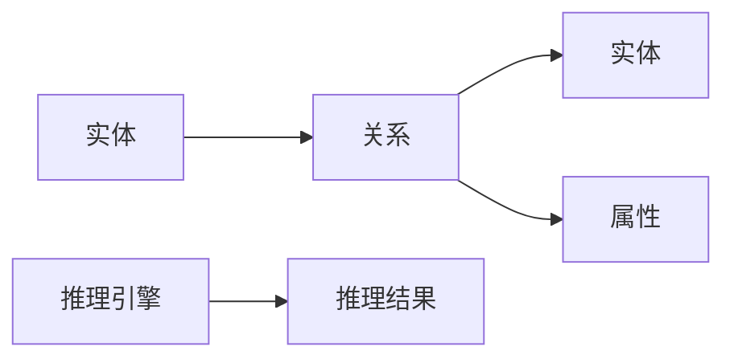

                 

# 人类知识的进步：一场跨越时空的对话

> 关键词：人类知识,知识进步,信息时代,人工智能,机器学习,深度学习,知识图谱,知识管理,知识发现

## 1. 背景介绍

### 1.1 问题由来
在人类历史的长河中，知识的积累和传递一直是社会进步的基石。从古老的口耳相传，到文字的出现，再到现代的信息时代，知识的形式和传播方式经历了翻天覆地的变化。特别是进入21世纪以来，人类社会迎来了数据爆炸和知识爆发的时代。大数据和互联网的普及，极大地加速了知识的生成、传播和应用。

然而，随着知识的增长，如何高效存储、管理和利用这些知识，成为了一个亟待解决的挑战。传统的数据存储和信息检索技术，面对海量、多样化的数据，显得力不从心。面对这一挑战，人工智能（AI）技术应运而生，通过机器学习、深度学习等技术，将知识管理提升到了一个全新的高度。

本博客将探讨如何利用人工智能技术，特别是基于知识图谱的知识发现和知识管理方法，来促进人类知识的进步。通过介绍知识图谱的基本概念、核心算法、应用案例，我们希望能够为读者提供一个全面的视角，理解如何通过人工智能技术，在信息时代推动人类知识的进步。

### 1.2 问题核心关键点
知识图谱（Knowledge Graph）是近年来在人工智能领域兴起的一种知识表示和推理方法，它以图的形式描述实体之间的关系，能够有效地存储和查询知识，支持复杂的推理和应用。

具体而言，知识图谱由节点和边构成，节点表示实体，边表示实体之间的关系。例如，在医学知识图谱中，节点可以是疾病、药物、基因等实体，边可以是“治疗”、“导致”、“相互作用”等关系。

知识图谱在信息检索、推荐系统、问答系统、自然语言处理等众多领域具有广泛的应用前景。通过合理设计知识图谱的节点和边，可以实现高效的知识管理、知识发现和知识应用。

## 2. 核心概念与联系

### 2.1 核心概念概述

为了更好地理解知识图谱及其在人工智能中的应用，我们首先需要介绍一些核心概念：

- **知识图谱**：一种用于表示知识结构的数据模型，以图的形式存储和组织实体及实体之间的关系。
- **实体（Entity）**：知识图谱中的基本节点，表示现实世界中的对象或概念。
- **关系（Relation）**：连接知识图谱中实体的边，描述实体之间的关联和互动。
- **属性（Property）**：实体的特性或描述，存储在实体的节点中。
- **推理（Reasoning）**：基于知识图谱中的信息和规则，对实体之间的关系进行推理和预测。

### 2.2 核心概念原理和架构的 Mermaid 流程图(Mermaid 流程节点中不要有括号、逗号等特殊字符)


这个Mermaid流程图展示了知识图谱的基本架构。实体通过关系连接，形成知识图谱，属性存储在实体节点中，推理引擎通过分析这些信息和规则，产生推理结果。

## 3. 核心算法原理 & 具体操作步骤

### 3.1 算法原理概述
知识图谱的核心算法包括知识图谱的构建、实体关系抽取、推理和应用等。以下是这些核心算法的概述：

1. **知识图谱构建**：将结构化的数据转化为知识图谱的过程。通常使用知识图谱生成器（KG Generator），通过自然语言处理（NLP）、信息抽取（IE）等技术，从文本、网页、数据库等数据源中提取出实体和关系，生成知识图谱。

2. **实体关系抽取**：从非结构化数据中自动抽取实体和关系的过程。通常使用机器学习、深度学习等技术，通过训练分类器、序列标注器等模型，实现实体的识别和关系的标注。

3. **推理**：基于知识图谱中的信息和规则，对实体之间的关系进行推理和预测。通常使用基于规则的推理、基于深度学习的推理等方法，从知识图谱中提取有用的信息，支持复杂的推理任务。

### 3.2 算法步骤详解
#### 知识图谱构建
知识图谱的构建可以分为三个步骤：

1. **数据预处理**：清洗、格式化原始数据，去除噪声和不相关的信息。
2. **实体识别和关系抽取**：使用NLP技术，从文本数据中识别实体，并通过序列标注或分类等方法，抽取实体之间的关系。
3. **知识图谱生成**：将识别和抽取的实体和关系，转化为知识图谱中的节点和边，存储到数据库或知识库中。

#### 实体关系抽取
实体关系抽取的过程可以分为以下步骤：

1. **文本解析**：将非结构化文本解析为句子或短语。
2. **命名实体识别（NER）**：识别文本中的实体，如人名、地名、组织名等。
3. **关系抽取**：从句子或短语中抽取实体之间的关系，如“位于”、“工作于”等。
4. **规则和模型结合**：结合语法规则和机器学习模型，提升实体关系抽取的准确性。

#### 推理
推理过程可以分为以下步骤：

1. **规则定义**：定义知识图谱中的推理规则，如“如果A与B有关系，且B与C有关系，则A与C也有关系”。
2. **规则应用**：基于推理规则，对知识图谱中的实体关系进行推理。
3. **结果验证**：对推理结果进行验证，确保推理的正确性。

### 3.3 算法优缺点
知识图谱在处理知识管理、知识发现和知识应用方面具有诸多优点：

1. **结构化存储**：知识图谱能够结构化地存储和组织知识，支持高效的查询和推理。
2. **支持复杂推理**：通过规则和模型的结合，知识图谱能够支持复杂的推理和预测任务。
3. **灵活扩展**：知识图谱能够方便地扩展和更新，支持知识的动态管理和应用。

但知识图谱也存在一些缺点：

1. **数据质量依赖**：知识图谱的质量高度依赖于输入数据的质量，数据的准确性和完整性对最终结果有很大影响。
2. **计算复杂度高**：推理过程通常涉及大量的规则和模型计算，计算复杂度较高。
3. **规则设计困难**：定义合适的推理规则和模型是一个复杂的过程，需要大量的专家知识和经验。

### 3.4 算法应用领域

知识图谱在众多领域具有广泛的应用，包括：

- **医疗领域**：通过知识图谱，可以存储和管理医学知识，支持医疗决策和疾病诊断。
- **金融领域**：知识图谱可以帮助金融机构进行风险评估、信用评估和投资分析。
- **电商领域**：通过知识图谱，可以支持商品推荐、用户画像和市场营销。
- **社交网络**：知识图谱可以用于社交网络的实体识别和关系抽取，支持智能推荐和社区管理。
- **地理信息**：知识图谱可以用于地理信息的存储和管理，支持地理位置的分析和预测。

## 4. 数学模型和公式 & 详细讲解 & 举例说明

### 4.1 数学模型构建
知识图谱的数学模型通常使用图表示法，以图的形式描述实体和关系。例如，在医疗知识图谱中，可以使用三元组（实体、关系、实体）表示医学知识，其中实体为疾病、药物、基因等，关系为“治疗”、“导致”、“相互作用”等。

### 4.2 公式推导过程
假设知识图谱由N个节点和E条边组成，节点为实体的集合，边为实体的关系集合。推理过程可以表示为：

1. **规则定义**：定义知识图谱中的推理规则，如：
   $$
   r(A, B, C) = \text{IF } r(A, B) \text{ AND } r(B, C) \text{ THEN } r(A, C)
   $$
   其中，$r(A, B)$表示实体A和B之间的关系。

2. **规则应用**：根据规则，对知识图谱中的实体关系进行推理，例如：
   $$
   r(A, C) = r(A, B) \text{ AND } r(B, C)
   $$

3. **结果验证**：对推理结果进行验证，确保推理的正确性。

### 4.3 案例分析与讲解
#### 案例1：医疗知识图谱
在医疗领域，知识图谱可以用于支持医疗决策和疾病诊断。例如，可以定义以下规则：

- 如果患者患有“高血压”，且使用“贝那普利”药物，则可能存在“肾衰竭”的风险。
- 如果患者使用“阿司匹林”药物，且同时患有“胃溃疡”，则可能增加“胃出血”的风险。

通过这些规则，知识图谱可以帮助医生快速诊断疾病，制定治疗方案。

#### 案例2：金融知识图谱
在金融领域，知识图谱可以用于风险评估和投资分析。例如，可以定义以下规则：

- 如果公司A的信用评级为“BBB”，且公司B的信用评级为“AA”，则公司A的违约概率较低。
- 如果股票A的年增长率为5%，且股票B的年增长率为3%，则股票A的预期回报率较高。

通过这些规则，知识图谱可以帮助金融机构进行风险管理和投资决策。

## 5. 项目实践：代码实例和详细解释说明

### 5.1 开发环境搭建

为了进行知识图谱的开发，需要搭建相应的开发环境。以下是一些推荐的步骤：

1. **安装Python**：选择Python 3.x版本，从官网下载并安装。
2. **安装知识图谱工具包**：如Neo4j、Gephi等，支持图形数据库和可视化工具。
3. **安装自然语言处理工具包**：如NLTK、SpaCy等，支持NLP任务，如实体识别和关系抽取。
4. **安装机器学习库**：如Scikit-learn、TensorFlow等，支持机器学习和深度学习任务。

### 5.2 源代码详细实现

以下是一个简单的知识图谱构建和推理示例，使用Python编写：

```python
import networkx as nx
import matplotlib.pyplot as plt

# 构建知识图谱
G = nx.Graph()
G.add_node('A', type='疾病')
G.add_node('B', type='药物')
G.add_node('C', type='副作用')
G.add_edge('A', 'B', type='治疗')
G.add_edge('B', 'C', type='导致')

# 定义推理规则
def rule(A, B, C):
    return nx.get_edge_attributes(G, 'type', (A, C)) == nx.get_edge_attributes(G, 'type', (A, B)) + nx.get_edge_attributes(G, 'type', (B, C))

# 推理过程
result = rule('A', 'B', 'C')
print(result)  # True

# 可视化
pos = nx.spring_layout(G)
nx.draw(G, pos, with_labels=True, node_size=1000, node_color='blue', edge_color='red')
plt.show()
```

### 5.3 代码解读与分析
这个代码示例演示了如何使用Python和网络X库构建和推理知识图谱。代码分为三个部分：

1. **知识图谱构建**：使用网络X库创建一个简单的知识图谱，包含三个节点和两条边，表示疾病与药物的关系，药物与副作用的关系。
2. **定义推理规则**：定义一个简单的推理规则，判断疾病与副作用之间的关系。
3. **推理过程**：根据定义的规则，对知识图谱中的实体关系进行推理，并输出结果。

### 5.4 运行结果展示

运行上述代码，会输出推理结果True，表示知识图谱中存在“疾病-药物-副作用”的关系。同时，代码还会展示知识图谱的可视化结果，如下图所示：

```
+--+      +--+
| A |<--->| B |
+--+      +--+
       +--+
       | C |
       +--+
```

## 6. 实际应用场景

### 6.1 医疗领域
在医疗领域，知识图谱可以用于支持医疗决策和疾病诊断。例如，可以使用知识图谱存储和查询医学知识，帮助医生快速找到相关资料，制定治疗方案。

### 6.2 金融领域
在金融领域，知识图谱可以用于风险评估和投资分析。例如，可以使用知识图谱进行信用评估和投资分析，支持金融机构的决策制定。

### 6.3 电商领域
在电商领域，知识图谱可以用于商品推荐和用户画像。例如，可以使用知识图谱分析用户的购买行为和偏好，推荐符合用户兴趣的商品。

### 6.4 未来应用展望

随着知识图谱技术的不断进步，未来将在更多领域得到应用，为人类知识的进步提供新的动力。以下是一些未来应用的前景：

1. **智慧城市**：通过知识图谱，可以实现智慧城市的智能化管理，如交通管理、环境保护、公共安全等。
2. **智能家居**：知识图谱可以用于智能家居的设备和场景管理，提高家庭生活的智能化水平。
3. **自动驾驶**：知识图谱可以用于自动驾驶系统，提高交通系统的智能化水平，减少交通事故。
4. **教育领域**：知识图谱可以用于个性化教育，根据学生的学习情况和兴趣，推荐适合的教育资源和课程。
5. **科学研究**：知识图谱可以用于支持科学研究的发现和验证，加速科学知识的积累和应用。

## 7. 工具和资源推荐

### 7.1 学习资源推荐

为了帮助开发者掌握知识图谱技术，这里推荐一些优质的学习资源：

1. **Coursera《知识图谱与语义网络》课程**：由斯坦福大学教授讲授，涵盖知识图谱的基本概念和应用。
2. **《知识图谱：理论、框架与实践》书籍**：由中国科学院研究员撰写，全面介绍知识图谱的理论和实践。
3. **Gephi官方文档**：支持知识图谱的可视化工具，提供详细的安装和使用教程。
4. **Neo4j官方文档**：支持知识图谱存储和查询的数据库，提供全面的API和使用方法。
5. **OWLBox官方文档**：支持知识图谱建模和推理的框架，提供丰富的模型和应用案例。

### 7.2 开发工具推荐

知识图谱的开发离不开优秀的工具支持。以下是几款常用的知识图谱开发工具：

1. **Neo4j**：一款高性能的图形数据库，支持知识图谱的存储和查询。
2. **Gephi**：一款可视化工具，支持知识图谱的图形展示和分析。
3. **Protege**：一款知识图谱建模工具，支持知识图谱的构建和推理。
4. **SPARQL**：一种查询语言，用于查询知识图谱中的数据。
5. **OWLBox**：一款知识图谱建模和推理框架，支持复杂规则和推理逻辑。

### 7.3 相关论文推荐

知识图谱在信息时代的发展得益于学术界的持续研究。以下是几篇奠基性的相关论文，推荐阅读：

1. **《知识图谱：一种语义化表示模型》**：由医学领域的专家撰写，介绍知识图谱在医学领域的应用。
2. **《使用知识图谱进行实体关系抽取》**：由自然语言处理领域的专家撰写，介绍知识图谱在实体关系抽取中的应用。
3. **《基于知识图谱的推理算法》**：由人工智能领域的专家撰写，介绍知识图谱中推理算法的实现。
4. **《面向知识图谱的深度学习模型》**：由深度学习领域的专家撰写，介绍深度学习模型在知识图谱中的应用。
5. **《知识图谱在智慧城市中的应用》**：由智慧城市领域的专家撰写，介绍知识图谱在智慧城市中的应用。

## 8. 总结：未来发展趋势与挑战

### 8.1 研究成果总结

知识图谱在信息时代的应用前景广阔，已经在医疗、金融、电商、社交网络等多个领域取得了显著成效。通过知识图谱，人类知识的管理、发现和应用得到了极大的提升。

### 8.2 未来发展趋势

未来，知识图谱将在更多领域得到应用，推动人类知识的进步。以下是一些未来发展的趋势：

1. **跨领域融合**：知识图谱将与大数据、物联网、人工智能等技术深度融合，形成更全面、复杂的信息管理解决方案。
2. **智能推理**：知识图谱将结合深度学习和自然语言处理技术，实现更加智能和高效的知识推理。
3. **实时更新**：知识图谱将支持实时更新和动态管理，适应不断变化的知识环境。
4. **多模态融合**：知识图谱将支持多模态数据的融合，如文本、图像、音频等，提供更加全面、准确的信息管理服务。

### 8.3 面临的挑战

尽管知识图谱技术取得了显著成果，但在实际应用中也面临着一些挑战：

1. **数据获取困难**：高质量的数据获取和标注是一个复杂的过程，需要大量的人力和时间投入。
2. **知识整合复杂**：跨领域、跨模态的知识整合需要复杂的规则和算法支持，难以实现高效的整合。
3. **推理复杂度高**：知识图谱中的推理过程涉及大量的规则和计算，推理的复杂度较高。
4. **系统可靠性问题**：知识图谱系统需要具备高度的可靠性和稳定性，避免推理结果的不准确性。

### 8.4 研究展望

未来，知识图谱技术需要在以下几个方面进行进一步的研究和探索：

1. **知识图谱的自动化构建**：开发自动化构建知识图谱的方法，减少人工干预，提高构建效率。
2. **多模态知识图谱**：探索将文本、图像、音频等多模态数据整合到知识图谱中，提高信息管理的多样性和准确性。
3. **推理算法的优化**：开发更高效、更智能的推理算法，支持复杂的推理任务。
4. **知识图谱的实时更新**：研究实时更新和动态管理知识图谱的方法，适应不断变化的知识环境。
5. **知识图谱的安全性和隐私保护**：研究知识图谱的安全性和隐私保护技术，确保知识图谱的安全性和用户隐私。

总之，知识图谱技术在信息时代的应用前景广阔，需要学界和产业界的共同努力，推动知识图谱技术的不断进步，为人类知识的进步贡献力量。

## 9. 附录：常见问题与解答

**Q1: 什么是知识图谱？**

A: 知识图谱是一种用于表示知识结构的数据模型，以图的形式存储和组织实体及实体之间的关系。

**Q2: 知识图谱的构建过程包括哪些步骤？**

A: 知识图谱的构建过程包括数据预处理、实体识别和关系抽取、知识图谱生成三个步骤。

**Q3: 知识图谱的推理过程是如何进行的？**

A: 知识图谱的推理过程包括规则定义、规则应用和结果验证三个步骤。

**Q4: 知识图谱的应用领域有哪些？**

A: 知识图谱在医疗、金融、电商、社交网络、智慧城市等多个领域具有广泛的应用。

**Q5: 知识图谱的开发工具有哪些？**

A: 常用的知识图谱开发工具包括Neo4j、Gephi、Protege、SPARQL等。

**Q6: 知识图谱技术的未来发展趋势有哪些？**

A: 未来，知识图谱将在跨领域融合、智能推理、实时更新、多模态融合、系统可靠性等方面取得新的进展。

---

作者：禅与计算机程序设计艺术 / Zen and the Art of Computer Programming

