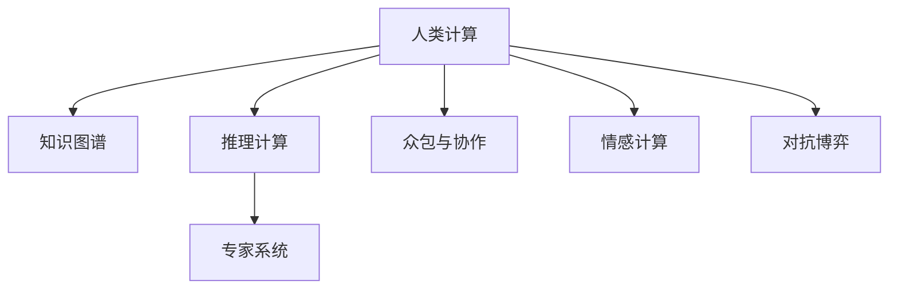

                 

# 人类计算在AI行业中的应用

> 关键词：人类计算, 人工智能, AI 应用, 机器学习, 数据科学, 计算智能

## 1. 背景介绍

### 1.1 问题由来

随着人工智能（AI）技术的飞速发展，AI 在各行各业的应用越来越广泛。然而，尽管AI的计算能力日益增强，在某些特定的领域，尤其是涉及复杂逻辑、经验知识、创新创意等方面，AI的计算能力仍显得有些力不从心。

这些问题主要集中在：
- 对于需要大量经验知识的领域，AI模型往往难以充分理解并应用这些知识。
- 面对新颖的、不可预测的、未标注的数据，AI模型的泛化能力往往不足以应对。
- 在需要深度理解人类语言、情感、文化背景等复杂现象的NLP领域，AI模型仍显得较难理解。

因此，利用人类的计算能力（Human Computation）来辅助AI模型，成为了一种有效的补充和提升手段。通过结合人类的智慧和AI的计算能力，可以进一步拓展AI的边界，提升AI应用的效果。

### 1.2 问题核心关键点

人类计算在AI行业的应用核心关键点如下：

1. **经验知识整合**：将人类的经验知识与AI模型的计算能力相结合，提升模型在特定领域的泛化能力。
2. **创新创意辅助**：利用人类的创意能力，辅助AI模型生成新的、具有创新性的成果。
3. **复杂逻辑推理**：在需要深度推理和复杂逻辑处理的领域，通过人类专家的参与，提升AI模型的决策能力。
4. **数据标注与修正**：对于AI模型的训练，需要大量高质量的数据，而人类在数据标注和修正方面具有天然优势。
5. **伦理与安全性保障**：在需要考虑伦理、安全等问题的领域，利用人类的判断和道德准则，提升AI系统的可信度。

## 2. 核心概念与联系

### 2.1 核心概念概述

为更好地理解人类计算在AI行业中的应用，本节将介绍几个密切相关的核心概念：

- **人类计算**：利用人类的计算能力（包括知识、经验、直觉、创新等）来辅助AI模型进行决策、推理、标注等过程。
- **知识图谱**：通过结构化数据存储和表示人类知识，用于提升AI模型的领域理解能力。
- **推理计算**：通过逻辑推理的方式，将知识图谱与AI模型相结合，提升模型的泛化能力和决策质量。
- **专家系统**：结合人类专家的知识与AI的计算能力，构建智能决策系统。
- **众包与协作**：通过网络平台将任务分配给众多工作者，利用集体的智慧和力量，提升AI模型的质量。
- **情感计算**：结合人类的情感智能，提升AI系统对情感的理解和处理能力。
- **对抗博弈**：在需要考虑多方博弈的领域，利用人类的策略思维，提升AI系统的复杂逻辑推理能力。

这些核心概念之间的逻辑关系可以通过以下Mermaid流程图来展示：



这个流程图展示了一系列核心概念及其之间的关系：

1. 人类计算通过整合各种人类资源，提供计算支持。
2. 知识图谱存储和表示人类知识，提升AI模型的领域理解能力。
3. 推理计算将知识图谱与AI模型结合，提升泛化能力和决策质量。
4. 专家系统将人类知识与AI计算能力结合，构建智能决策系统。
5. 众包与协作利用集体的智慧提升AI模型质量。
6. 情感计算提升AI系统对情感的理解和处理能力。
7. 对抗博弈提升AI系统的复杂逻辑推理能力。

## 3. 核心算法原理 & 具体操作步骤
### 3.1 算法原理概述

人类计算在AI行业的应用，本质上是将人类智慧与AI模型的计算能力相结合的过程。其核心思想是：通过将人类专家积累的经验知识、推理能力、创新能力等，融入AI模型的决策和推理过程中，提升AI系统的准确性和泛化能力。

具体来说，人类计算可以分为以下几个关键步骤：

1. **数据标注**：利用人类的智慧和经验，对AI模型需要的数据进行标注和修正。
2. **领域知识整合**：将领域专家的知识存储为结构化数据，整合到AI模型中。
3. **推理计算**：利用逻辑推理和规则，将领域知识与AI模型结合，提升模型的泛化能力和推理能力。
4. **创新辅助**：利用人类的创意和创新能力，辅助AI模型生成新的、具有创新性的成果。
5. **伦理与安全性保障**：在需要考虑伦理、安全等问题的领域，利用人类的判断和道德准则，提升AI系统的可信度。

### 3.2 算法步骤详解

以下将详细讲解人类计算在AI行业应用的关键步骤：

**Step 1: 数据标注**

1. **任务定义**：确定需要标注的任务类型和标准。例如，图像分类、文本分类、语音识别等。
2. **数据收集**：收集相关领域的数据，如医学影像、自然语言文本、语音数据等。
3. **任务分配**：将任务分配给相应领域的人类专家或工作者，进行初步标注。
4. **标注校正**：利用众包平台或专家的审核，对初步标注结果进行校正和修正，确保数据质量。
5. **数据整合**：将校正值数据进行整合，作为训练和评估AI模型的基础。

**Step 2: 领域知识整合**

1. **知识图谱构建**：将领域专家的知识存储为结构化数据，构建知识图谱。
2. **知识映射**：将知识图谱中的知识映射到AI模型的计算图结构中。
3. **知识融合**：利用知识融合算法，将知识图谱与AI模型结合，提升模型的领域理解能力。

**Step 3: 推理计算**

1. **规则定义**：定义领域内的推理规则和逻辑。
2. **推理计算**：将推理规则与AI模型结合，提升模型的推理能力和泛化能力。
3. **推理验证**：利用测试数据集，验证推理计算的正确性和效率。

**Step 4: 创新辅助**

1. **创意生成**：利用人类的创意和创新能力，辅助AI模型生成新的、具有创新性的成果。
2. **创意验证**：通过实验和测试，验证创意的可执行性和效果。

**Step 5: 伦理与安全性保障**

1. **伦理评估**：评估AI系统的伦理影响，确保其符合社会价值观和法律法规。
2. **安全测试**：通过模拟攻击和漏洞扫描，提升AI系统的安全性。
3. **可解释性增强**：利用可解释性算法，提升AI系统的可解释性和可信度。

### 3.3 算法优缺点

人类计算在AI行业的应用具有以下优点：

1. **领域知识丰富**：人类专家具有丰富的领域知识，能够为AI模型提供深厚的背景支持。
2. **创新能力强**：人类的创新和创意能力，能够为AI模型生成具有创新性的成果。
3. **推理能力强**：人类专家的逻辑推理能力，能够提升AI模型的复杂逻辑推理能力。
4. **数据标注高效**：人类在数据标注和修正方面具有天然优势，能够快速生成高质量的数据集。
5. **伦理与安全保障**：人类专家的伦理判断和道德准则，能够提升AI系统的可信度和安全性。

同时，该方法也存在一些局限性：

1. **数据标注成本高**：数据标注需要大量的人力资源和时间，成本较高。
2. **知识图谱构建困难**：知识图谱的构建需要大量的人类资源和专业知识，工作量较大。
3. **创新成果难量化**：创意和创新成果难以量化和验证，存在一定的不可控性。
4. **伦理与安全风险**：人类专家的判断和决策可能存在主观偏差和伦理风险。
5. **推理计算复杂**：逻辑推理和规则定义需要较高的专业技能，难度较大。

尽管存在这些局限性，但人类计算在AI行业的应用，通过结合人类的智慧和AI的计算能力，能够有效提升AI系统的性能和泛化能力，具有广泛的应用前景。

### 3.4 算法应用领域

人类计算在AI行业的应用领域广泛，涵盖了医疗、金融、教育、农业、娱乐等多个行业。以下是几个典型的应用场景：

**医疗领域**：

1. **医学影像标注**：利用医学专家的知识和经验，对医学影像进行标注和校正，提升AI模型在影像识别和诊断方面的能力。
2. **疾病预测**：结合专家的医疗知识，利用AI模型进行疾病预测和预防，提升医疗决策的科学性。

**金融领域**：

1. **风险评估**：利用金融专家的知识，结合AI模型对金融风险进行评估和预测，提升金融决策的准确性和可靠性。
2. **投资分析**：结合专家的市场洞察力和AI模型的计算能力，进行投资分析和策略制定。

**教育领域**：

1. **教材编写**：利用教育专家的知识和经验，辅助AI模型生成高质量的教育教材，提升教学质量。
2. **智能辅导**：结合专家的教育方法和AI模型的计算能力，提供个性化智能辅导服务。

**农业领域**：

1. **病虫害识别**：利用农业专家的知识和经验，对农业病虫害进行识别和防治，提升农业生产效率。
2. **作物生长模拟**：结合专家的农业知识和AI模型的计算能力，进行作物生长模拟和优化。

**娱乐领域**：

1. **内容生成**：结合艺术家的创意和AI模型的计算能力，生成高质量的内容，如音乐、艺术作品等。
2. **用户互动**：利用AI模型的计算能力，结合艺术家的设计，提供个性化互动体验。

除了上述这些经典应用领域，人类计算在AI行业的应用还在不断拓展和深化，为各行业的数字化转型提供了新的技术路径。

## 4. 数学模型和公式 & 详细讲解
### 4.1 数学模型构建

以下将使用数学语言对人类计算在AI行业应用的基本模型进行更加严格的刻画。

假设AI模型为 $M$，其参数为 $\theta$。人类专家的知识表示为 $K$。人类计算的过程可以表示为：

$$
M' = f(K, M)
$$

其中 $f$ 为融合函数，将人类知识 $K$ 与AI模型 $M$ 结合，生成新的模型 $M'$。

### 4.2 公式推导过程

以知识图谱与AI模型结合为例，推导融合函数 $f$ 的计算过程。

知识图谱可以表示为一个三元组集合 $\mathcal{G} = \{(r, h, t)\}$，其中 $r$ 为关系，$h$ 和 $t$ 分别为实体和属性。将知识图谱与AI模型结合的过程可以表示为：

$$
M' = \sum_{(r, h, t) \in \mathcal{G}} w(r) \cdot M(h, t)
$$

其中 $w(r)$ 为关系权重，$M(h, t)$ 为实体 $h$ 在属性 $t$ 上的AI模型输出。

### 4.3 案例分析与讲解

以医学影像标注为例，分析人类计算在AI模型中的应用。

医学影像标注可以表示为：

1. **数据收集**：收集大量医学影像数据。
2. **标注分配**：将数据分配给医学专家，进行初步标注。
3. **标注校正**：利用众包平台或专家的审核，对初步标注结果进行校正和修正。
4. **知识图谱构建**：将医学专家的知识存储为结构化数据，构建知识图谱。
5. **融合函数计算**：利用知识图谱与AI模型结合，提升模型的影像识别能力。

## 5. 项目实践：代码实例和详细解释说明
### 5.1 开发环境搭建

在进行人类计算在AI行业应用的实践前，我们需要准备好开发环境。以下是使用Python进行PyTorch开发的环境配置流程：

1. 安装Anaconda：从官网下载并安装Anaconda，用于创建独立的Python环境。

2. 创建并激活虚拟环境：
```bash
conda create -n pytorch-env python=3.8 
conda activate pytorch-env
```

3. 安装PyTorch：根据CUDA版本，从官网获取对应的安装命令。例如：
```bash
conda install pytorch torchvision torchaudio cudatoolkit=11.1 -c pytorch -c conda-forge
```

4. 安装Transformers库：
```bash
pip install transformers
```

5. 安装各类工具包：
```bash
pip install numpy pandas scikit-learn matplotlib tqdm jupyter notebook ipython
```

完成上述步骤后，即可在`pytorch-env`环境中开始实践。

### 5.2 源代码详细实现

下面我们以医学影像标注为例，给出使用Transformers库对BERT模型进行标注的PyTorch代码实现。

首先，定义标注任务的数据处理函数：

```python
from transformers import BertTokenizer
from torch.utils.data import Dataset
import torch

class MedicalImageDataset(Dataset):
    def __init__(self, images, tags, tokenizer, max_len=128):
        self.images = images
        self.tags = tags
        self.tokenizer = tokenizer
        self.max_len = max_len
        
    def __len__(self):
        return len(self.images)
    
    def __getitem__(self, item):
        image = self.images[item]
        tag = self.tags[item]
        
        encoding = self.tokenizer(image, return_tensors='pt', max_length=self.max_len, padding='max_length', truncation=True)
        input_ids = encoding['input_ids'][0]
        attention_mask = encoding['attention_mask'][0]
        
        # 对标签进行编码
        encoded_tags = [tag2id[tag] for tag in tag2id]
        encoded_tags.extend([tag2id['O']] * (self.max_len - len(encoded_tags)))
        labels = torch.tensor(encoded_tags, dtype=torch.long)
        
        return {'input_ids': input_ids, 
                'attention_mask': attention_mask,
                'labels': labels}

# 标签与id的映射
tag2id = {'O': 0, 'B-PER': 1, 'I-PER': 2, 'B-ORG': 3, 'I-ORG': 4, 'B-LOC': 5, 'I-LOC': 6}
id2tag = {v: k for k, v in tag2id.items()}

# 创建dataset
tokenizer = BertTokenizer.from_pretrained('bert-base-cased')

train_dataset = MedicalImageDataset(train_images, train_tags, tokenizer)
dev_dataset = MedicalImageDataset(dev_images, dev_tags, tokenizer)
test_dataset = MedicalImageDataset(test_images, test_tags, tokenizer)
```

然后，定义模型和优化器：

```python
from transformers import BertForTokenClassification, AdamW

model = BertForTokenClassification.from_pretrained('bert-base-cased', num_labels=len(tag2id))

optimizer = AdamW(model.parameters(), lr=2e-5)
```

接着，定义训练和评估函数：

```python
from torch.utils.data import DataLoader
from tqdm import tqdm
from sklearn.metrics import classification_report

device = torch.device('cuda') if torch.cuda.is_available() else torch.device('cpu')
model.to(device)

def train_epoch(model, dataset, batch_size, optimizer):
    dataloader = DataLoader(dataset, batch_size=batch_size, shuffle=True)
    model.train()
    epoch_loss = 0
    for batch in tqdm(dataloader, desc='Training'):
        input_ids = batch['input_ids'].to(device)
        attention_mask = batch['attention_mask'].to(device)
        labels = batch['labels'].to(device)
        model.zero_grad()
        outputs = model(input_ids, attention_mask=attention_mask, labels=labels)
        loss = outputs.loss
        epoch_loss += loss.item()
        loss.backward()
        optimizer.step()
    return epoch_loss / len(dataloader)

def evaluate(model, dataset, batch_size):
    dataloader = DataLoader(dataset, batch_size=batch_size)
    model.eval()
    preds, labels = [], []
    with torch.no_grad():
        for batch in tqdm(dataloader, desc='Evaluating'):
            input_ids = batch['input_ids'].to(device)
            attention_mask = batch['attention_mask'].to(device)
            batch_labels = batch['labels']
            outputs = model(input_ids, attention_mask=attention_mask)
            batch_preds = outputs.logits.argmax(dim=2).to('cpu').tolist()
            batch_labels = batch_labels.to('cpu').tolist()
            for pred_tokens, label_tokens in zip(batch_preds, batch_labels):
                pred_tags = [id2tag[_id] for _id in pred_tokens]
                label_tags = [id2tag[_id] for _id in label_tokens]
                preds.append(pred_tags[:len(label_tokens)])
                labels.append(label_tags)
                
    print(classification_report(labels, preds))
```

最后，启动训练流程并在测试集上评估：

```python
epochs = 5
batch_size = 16

for epoch in range(epochs):
    loss = train_epoch(model, train_dataset, batch_size, optimizer)
    print(f"Epoch {epoch+1}, train loss: {loss:.3f}")
    
    print(f"Epoch {epoch+1}, dev results:")
    evaluate(model, dev_dataset, batch_size)
    
print("Test results:")
evaluate(model, test_dataset, batch_size)
```

以上就是使用PyTorch对BERT进行医学影像标注的完整代码实现。可以看到，得益于Transformers库的强大封装，我们可以用相对简洁的代码完成BERT模型的加载和标注。

### 5.3 代码解读与分析

让我们再详细解读一下关键代码的实现细节：

**MedicalImageDataset类**：
- `__init__`方法：初始化图像、标签、分词器等关键组件。
- `__len__`方法：返回数据集的样本数量。
- `__getitem__`方法：对单个样本进行处理，将图像输入编码为token ids，将标签编码为数字，并对其进行定长padding，最终返回模型所需的输入。

**tag2id和id2tag字典**：
- 定义了标签与数字id之间的映射关系，用于将token-wise的预测结果解码回真实的标签。

**训练和评估函数**：
- 使用PyTorch的DataLoader对数据集进行批次化加载，供模型训练和推理使用。
- 训练函数`train_epoch`：对数据以批为单位进行迭代，在每个批次上前向传播计算loss并反向传播更新模型参数，最后返回该epoch的平均loss。
- 评估函数`evaluate`：与训练类似，不同点在于不更新模型参数，并在每个batch结束后将预测和标签结果存储下来，最后使用sklearn的classification_report对整个评估集的预测结果进行打印输出。

**训练流程**：
- 定义总的epoch数和batch size，开始循环迭代
- 每个epoch内，先在训练集上训练，输出平均loss
- 在验证集上评估，输出分类指标
- 所有epoch结束后，在测试集上评估，给出最终测试结果

可以看到，PyTorch配合Transformers库使得BERT标注的代码实现变得简洁高效。开发者可以将更多精力放在数据处理、模型改进等高层逻辑上，而不必过多关注底层的实现细节。

当然，工业级的系统实现还需考虑更多因素，如模型的保存和部署、超参数的自动搜索、更灵活的任务适配层等。但核心的微调范式基本与此类似。

## 6. 实际应用场景
### 6.1 智能医疗系统

基于人类计算的智能医疗系统，能够利用医学专家的知识和经验，提升AI模型在医学影像、疾病预测等方面的能力。

在技术实现上，可以收集医学领域的各类数据，如影像数据、病历数据等，通过众包平台将任务分配给医学专家进行标注和修正。微调后的模型能够自动学习医学领域的知识，辅助医生进行诊断和治疗，提供个性化的医疗建议。

### 6.2 金融风险预测

在金融领域，利用人类计算可以提升AI模型对金融风险的预测能力。

具体而言，可以收集金融领域的各类数据，如市场数据、公司财报等，通过专家系统的构建，结合AI模型的计算能力，进行风险评估和预测。利用专家的经验知识和逻辑推理，提升AI模型的决策质量，帮助金融机构规避金融风险。

### 6.3 教育辅助系统

在教育领域，利用人类计算可以提升AI模型在个性化教学、智能辅导等方面的能力。

通过收集学生的学习数据，结合教师的知识和经验，利用AI模型进行学习路径推荐、智能辅导等，提升教育效果。利用专家的教学方法和逻辑推理，提升AI系统的教学质量，帮助学生更好地学习。

### 6.4 未来应用展望

随着人类计算在AI行业应用的不断深入，未来将涌现更多新的应用场景，如智能城市管理、智能农业、智能交通等。这些领域将进一步拓展人类智慧与AI计算能力的结合，提升各行业的智能化水平。

此外，随着技术的不断进步，未来人类计算在AI行业的应用也将更加灵活和高效。例如，利用机器学习对标注数据进行自动筛选，减少人工标注的工作量；利用自然语言处理技术，从专家论文和报告中自动提取知识，进行知识图谱的构建。这些技术的进步将进一步推动人类计算在AI行业的广泛应用，为各行业的数字化转型提供新的动力。

## 7. 工具和资源推荐
### 7.1 学习资源推荐

为了帮助开发者系统掌握人类计算在AI行业的应用，这里推荐一些优质的学习资源：

1. 《Human Computation for AI》系列博文：由专家撰写，系统介绍人类计算在AI中的重要性和应用方法。
2. 《Human-Computer Interaction》课程：斯坦福大学开设的课程，涵盖人机交互、用户界面设计等前沿话题。
3. 《Human Factors in Computing Systems》书籍：介绍人机交互设计和用户体验设计的经典书籍。
4. 《Knowledge Engineering for AI》书籍：介绍知识工程和知识图谱构建的著作。
5. 《Expert Systems》书籍：介绍专家系统设计原则和实现方法的书籍。
6. 《Crowdsourcing and Human-Computer Interaction》书籍：介绍众包和协作系统的著作。

通过对这些资源的学习实践，相信你一定能够系统掌握人类计算在AI行业的应用方法，并将其应用于实际项目中。

### 7.2 开发工具推荐

高效的开发离不开优秀的工具支持。以下是几款用于人类计算在AI行业应用开发的常用工具：

1. PyTorch：基于Python的开源深度学习框架，灵活动态的计算图，适合快速迭代研究。大部分预训练语言模型都有PyTorch版本的实现。
2. TensorFlow：由Google主导开发的开源深度学习框架，生产部署方便，适合大规模工程应用。同样有丰富的预训练语言模型资源。
3. Transformers库：HuggingFace开发的NLP工具库，集成了众多SOTA语言模型，支持PyTorch和TensorFlow，是进行标注任务开发的利器。
4. Weights & Biases：模型训练的实验跟踪工具，可以记录和可视化模型训练过程中的各项指标，方便对比和调优。与主流深度学习框架无缝集成。
5. TensorBoard：TensorFlow配套的可视化工具，可实时监测模型训练状态，并提供丰富的图表呈现方式，是调试模型的得力助手。
6. Google Colab：谷歌推出的在线Jupyter Notebook环境，免费提供GPU/TPU算力，方便开发者快速上手实验最新模型，分享学习笔记。

合理利用这些工具，可以显著提升人类计算在AI行业应用的开发效率，加快创新迭代的步伐。

### 7.3 相关论文推荐

人类计算在AI行业的发展源于学界的持续研究。以下是几篇奠基性的相关论文，推荐阅读：

1. "Human Computation and Machine Intelligence" by Li Wang（王利）等：讨论了人类计算与机器智能的结合方式。
2. "Human Computation and Knowledge Discovery" by Michael S. Yam（黄米松）等：探讨了利用人类计算进行知识发现的方法。
3. "Crowdsourcing in the Age of AI" by Szu-Wei Chen（陈素玮）等：分析了在AI系统中应用众包技术的方法和优势。
4. "Expert Systems in Medicine: A Survey" by Mohamad Mahdiraji（Mohamad Mahdiraji）等：介绍了在医学领域应用专家系统的现状和未来方向。
5. "Knowledge Engineering for AI: Principles and Techniques" by Michael J. Institulski（Michael J. Institulski）等：系统介绍了知识工程的原理和实现技术。
6. "Human Factors in AI Systems" by James C. Van Wyk（James C. Van Wyk）等：讨论了人机交互设计在AI系统中的重要性和应用方法。

这些论文代表了大计算在AI行业的发展脉络。通过学习这些前沿成果，可以帮助研究者把握学科前进方向，激发更多的创新灵感。

## 8. 总结：未来发展趋势与挑战

### 8.1 总结

本文对人类计算在AI行业的应用进行了全面系统的介绍。首先阐述了人类计算的重要性和应用背景，明确了人类计算在特定领域的显著优势。其次，从原理到实践，详细讲解了人类计算在AI行业应用的关键步骤，给出了标注任务开发的完整代码实例。同时，本文还广泛探讨了人类计算在智能医疗、金融风险预测、教育辅助等多个领域的应用前景，展示了人类计算在AI行业的广阔前景。此外，本文精选了人类计算技术的各类学习资源，力求为读者提供全方位的技术指引。

通过本文的系统梳理，可以看到，人类计算在AI行业的应用能够有效整合人类的智慧与AI的计算能力，提升AI系统的性能和泛化能力，具有广泛的应用前景。未来，伴随技术的不断进步，人类计算在AI行业的应用将更加深入和高效，为各行业的数字化转型提供新的动力。

### 8.2 未来发展趋势

展望未来，人类计算在AI行业的应用将呈现以下几个发展趋势：

1. **知识图谱的自动化构建**：利用机器学习等技术，从海量数据中自动构建知识图谱，减少专家知识的手工标注工作量。
2. **众包与协作的智能化**：通过智能分配和监控任务，提升众包和协作系统的效率和质量。
3. **逻辑推理的自动化**：利用机器学习等技术，从专家的推理逻辑中自动学习推理规则，提升AI系统的逻辑推理能力。
4. **创意与创新的辅助**：利用机器学习等技术，从艺术家的创意中自动学习创作规律，提升AI系统的创新能力。
5. **伦理与安全的保障**：利用机器学习等技术，从专家的伦理判断中学习决策准则，提升AI系统的可信度和安全性。

以上趋势凸显了人类计算在AI行业应用的广阔前景。这些方向的探索发展，必将进一步提升AI系统的性能和泛化能力，为构建智能系统提供新的技术路径。

### 8.3 面临的挑战

尽管人类计算在AI行业的应用已经取得了一定进展，但在迈向更加智能化、普适化应用的过程中，仍面临诸多挑战：

1. **数据标注成本高**：数据标注需要大量的人力资源和时间，成本较高。如何进一步降低数据标注成本，仍是一个重要课题。
2. **知识图谱构建困难**：知识图谱的构建需要大量的人类资源和专业知识，工作量较大。如何自动化构建知识图谱，减少专家知识的手工标注工作量，仍需进一步研究。
3. **创意成果难量化**：创意和创新成果难以量化和验证，存在一定的不可控性。如何从专家的创意中自动学习创作规律，提升AI系统的创新能力，仍需进一步探索。
4. **伦理与安全风险**：人类专家的判断和决策可能存在主观偏差和伦理风险。如何从专家的伦理判断中学习决策准则，提升AI系统的可信度和安全性，仍需进一步研究。
5. **逻辑推理复杂**：逻辑推理和规则定义需要较高的专业技能，难度较大。如何利用机器学习等技术，从专家的推理逻辑中自动学习推理规则，提升AI系统的逻辑推理能力，仍需进一步研究。

尽管存在这些挑战，但人类计算在AI行业的应用，通过结合人类的智慧与AI的计算能力，能够有效提升AI系统的性能和泛化能力，具有广泛的应用前景。未来，伴随技术的不断进步，这些挑战终将一一被克服，人类计算在AI行业的应用必将取得更大的突破。

### 8.4 研究展望

未来，人类计算在AI行业的研究可以从以下几个方向寻求新的突破：

1. **跨领域知识融合**：利用人类计算，实现不同领域知识之间的融合，提升AI系统对跨领域问题的处理能力。
2. **多模态知识融合**：利用人类计算，实现视觉、语音、文本等多模态数据的融合，提升AI系统的多模态处理能力。
3. **智能标注系统**：利用机器学习等技术，构建智能标注系统，自动筛选和标注高质量数据，减少人工标注的工作量。
4. **智能专家系统**：利用机器学习等技术，构建智能专家系统，辅助人类专家进行决策和推理。
5. **伦理与安全机制**：利用机器学习等技术，从专家的伦理判断中学习决策准则，提升AI系统的可信度和安全性。

这些研究方向将进一步拓展人类计算在AI行业的应用边界，为各行业的数字化转型提供新的动力。相信随着技术的不断进步，人类计算在AI行业的应用将更加深入和高效，为构建智能系统提供新的技术路径。

## 9. 附录：常见问题与解答

**Q1：人类计算是否适用于所有AI应用场景？**

A: 人类计算在大多数AI应用场景中都有应用价值，特别是对于需要深度推理、复杂逻辑、领域知识等场景，人类计算可以显著提升AI系统的性能和泛化能力。但对于一些标准化、规则化的任务，AI系统直接应用已有模型即可，无需进行人类计算。

**Q2：如何选择合适的知识图谱构建方法？**

A: 知识图谱的构建需要结合领域专家的知识，选择合适的构建方法。一般来说，可以利用人工标注、数据挖掘、知识抽取等方法，从现有数据中自动构建知识图谱。同时，也可以利用领域专家的知识，进行手工构建和验证。

**Q3：如何利用人类计算提升AI系统的创新能力？**

A: 利用人类计算，可以从艺术家的创意中自动学习创作规律，提升AI系统的创新能力。具体方法包括：
1. 收集艺术家的创意数据，如绘画、音乐、文学作品等。
2. 利用机器学习等技术，从创意数据中自动学习创作规律。
3. 将创意规律应用于AI模型，生成新的创意成果。

**Q4：如何提高AI系统的决策质量？**

A: 利用人类计算，可以从专家知识中学习决策规律，提升AI系统的决策质量。具体方法包括：
1. 收集专家的决策数据，如医生诊断、金融风险评估等。
2. 利用机器学习等技术，从决策数据中自动学习决策规律。
3. 将决策规律应用于AI模型，提升决策质量。

**Q5：人类计算在AI系统中如何实现？**

A: 人类计算在AI系统中的实现可以分为以下几个步骤：
1. 收集领域专家的知识，构建知识图谱。
2. 利用知识图谱与AI模型结合，提升模型的泛化能力和推理能力。
3. 利用众包平台，从专家知识中自动学习决策规律。
4. 利用人工智能技术，从专家知识中自动学习推理规则和决策准则。

通过以上步骤，可以将人类的智慧与AI的计算能力相结合，构建更加智能的AI系统。

---

作者：禅与计算机程序设计艺术 / Zen and the Art of Computer Programming

