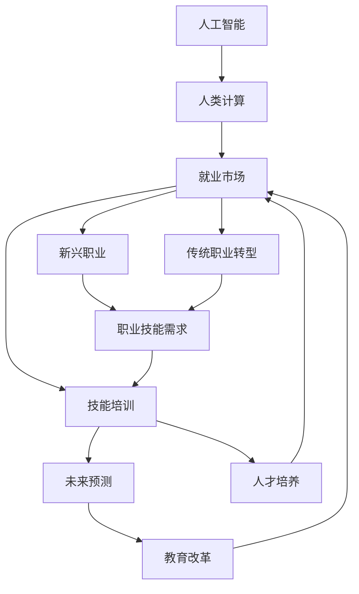
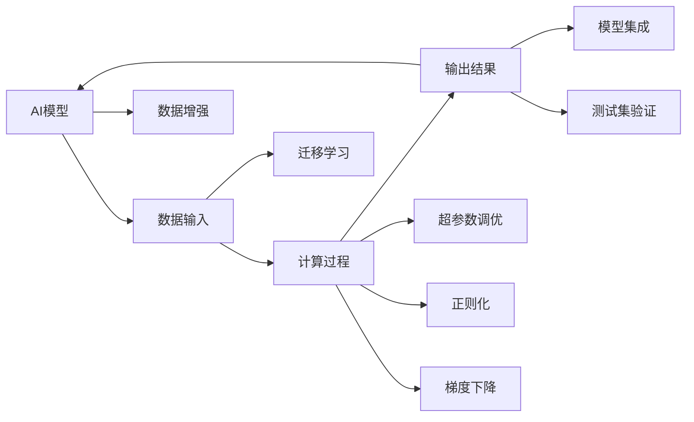

                 

# 人类计算：AI时代的未来就业市场与技能培训发展趋势预测分析

> 关键词：人工智能,就业市场,技能培训,未来预测,教育改革,职业转型

## 1. 背景介绍

随着人工智能技术的迅猛发展，人类计算方式和就业市场正在发生翻天覆地的变化。一方面，AI系统的广泛应用替代了部分传统人力工作，如数据处理、客户服务、财务审计等，释放出大量的劳动力。另一方面，AI技术催生了新的行业和职位，如机器人维护、AI算法开发、数据科学家等，这些新兴岗位需要专业的技能和知识储备。

这种变革不仅影响个体的就业选择和职业路径，也深刻改变了整个就业市场的结构和发展趋势。为了更好地应对未来，各大企业和教育机构需要重新审视人才培养和职业技能培训的发展方向，以期培养出符合时代需求的复合型人才。

## 2. 核心概念与联系

### 2.1 核心概念概述

本节将介绍几个关键概念，以帮助我们更好地理解AI时代就业市场和技能培训的发展趋势：

- **人工智能(AI)**：涉及机器学习、深度学习、自然语言处理等技术，旨在模拟人类智能过程，实现自主决策和复杂问题解决。

- **人类计算**：指使用人类智能处理数据和执行计算的过程。AI时代下，大量重复性、低价值的计算任务被自动化，而人类将更多地从事创造性、复杂性工作。

- **就业市场**：涉及劳动力供给和需求，受技术进步、经济环境、政策法规等多种因素影响，呈现动态变化。

- **技能培训**：指通过教育或培训，提升个体职业能力和竞争力，适应技术变革的需求。

- **未来预测**：基于当前趋势和数据，预测未来一段时间内的发展方向和可能出现的新情况。

- **教育改革**：涉及教育目标、内容、方法、评价等方面的变革，以适应社会和技术的发展需求。

这些概念之间的关系可以通过以下Mermaid流程图来展示：



这个流程图展示了AI时代下各概念间的联系：

1. 人工智能推动了人类计算方式的变革，导致就业市场的结构性变化。
2. 技能培训需要适应新兴职业需求和传统职业转型，以提升劳动力的适应性。
3. 未来预测有助于教育改革，预判技术发展趋势，调整教育目标和内容。
4. 教育改革反过来影响就业市场，培养符合未来需求的人才。

### 2.2 核心概念原理和架构的 Mermaid 流程图



这个流程图示意了AI模型的一般训练过程，包括数据输入、模型计算、输出结果等关键环节，以及常用的优化技术如数据增强、迁移学习、正则化、梯度下降等。

## 3. 核心算法原理 & 具体操作步骤
### 3.1 算法原理概述

AI时代下，就业市场和技能培训的发展趋势预测，本质上是基于现有数据和模型，通过机器学习和统计分析，预测未来一段时间内的就业市场变化和技能需求。具体来说，可以采用以下算法原理：

1. **时间序列分析**：通过历史数据的时间序列分析，预测未来的就业市场趋势和技能需求变化。

2. **回归分析**：利用回归模型预测未来就业率、工资水平等指标的变化。

3. **预测模型**：基于历史数据和当前趋势，使用各种预测模型（如ARIMA、GARCH等）预测就业市场和技能需求。

4. **多因素分析**：考虑多种因素如技术变革、经济环境、政策法规等，综合分析对就业市场和技能需求的影响。

5. **情景分析**：设定不同情景（如乐观、悲观），预测不同情况下的就业市场和技能需求变化。

### 3.2 算法步骤详解

基于上述算法原理，以下是具体的预测分析操作步骤：

1. **数据收集**：收集历史就业市场数据、技术发展趋势、行业报告、政策法规等，作为模型输入。

2. **数据清洗**：对原始数据进行清洗、处理，去除异常值、缺失值，确保数据质量。

3. **特征提取**：从原始数据中提取关键特征，如就业率、工资水平、技术发展速度等。

4. **模型训练**：使用时间序列分析、回归分析、预测模型等技术，对数据进行训练，得到预测模型。

5. **结果分析**：根据预测模型，分析未来一段时间内就业市场和技能需求的变化趋势。

6. **政策建议**：根据分析结果，提出相应的教育改革和技能培训建议，指导企业和教育机构。

### 3.3 算法优缺点

基于上述算法原理和操作步骤，AI时代就业市场和技能培训的发展趋势预测具有以下优缺点：

**优点**：

- 利用大数据和先进算法，提高预测准确性和时效性。
- 可量化分析多种因素对就业市场和技能需求的影响。
- 提供客观数据支持，有助于制定科学决策。

**缺点**：

- 数据质量和处理方法对预测结果影响较大，需要精细的数据处理和特征选择。
- 模型复杂度较高，需要较强的计算资源和时间。
- 预测结果受外界因素影响较大，存在不确定性。

### 3.4 算法应用领域

基于AI技术的就业市场和技能培训发展趋势预测，可以在多个领域得到应用：

- **企业招聘与培训**：帮助企业了解未来就业市场需求，制定招聘和培训计划。
- **政府政策制定**：提供就业市场和技能需求的预测分析，指导教育政策和就业政策。
- **职业规划与教育改革**：帮助个人和教育机构了解未来职业趋势，调整教育和培训方向。
- **行业发展分析**：分析不同行业在未来一段时间内的就业和技能需求变化，指导行业发展策略。

## 4. 数学模型和公式 & 详细讲解 & 举例说明

### 4.1 数学模型构建

本节将基于回归分析，构建一个简单的就业市场和技能需求预测模型。

假设我们有$N$个历史数据点，每个数据点包含时间$t_i$和对应的就业率$y_i$，可以构建一个线性回归模型：

$$ y = \alpha + \beta t + \epsilon $$

其中，$y$为预测的就业率，$t$为时间，$\alpha$为截距，$\beta$为斜率，$\epsilon$为误差项。

### 4.2 公式推导过程

线性回归模型的推导如下：

1. 最小二乘法：最小化误差项$\epsilon$的平方和，得到回归系数$\alpha$和$\beta$。
2. 残差分析：计算残差$\epsilon_i = y_i - (\alpha + \beta t_i)$，判断模型的拟合效果。
3. 预测未来就业率：根据模型，预测未来时间点$t$的就业率。

### 4.3 案例分析与讲解

假设我们收集了过去5年的就业数据，使用线性回归模型进行预测。

**案例分析**：

1. 数据收集：收集2015-2019年的就业数据。
2. 数据清洗：处理缺失值，选择无异常值的时间序列数据。
3. 特征提取：提取时间$t$和就业率$y$作为特征。
4. 模型训练：使用最小二乘法训练线性回归模型，得到系数$\alpha$和$\beta$。
5. 结果分析：评估模型拟合效果，预测2020年的就业率。
6. 政策建议：根据预测结果，调整教育培训计划，准备2020年就业市场变化。

## 5. 项目实践：代码实例和详细解释说明
### 5.1 开发环境搭建

在进行就业市场和技能培训预测分析前，我们需要准备好开发环境。以下是Python环境配置步骤：

1. 安装Anaconda：从官网下载并安装Anaconda，用于创建独立的Python环境。

2. 创建并激活虚拟环境：
```bash
conda create -n job_predict_env python=3.8
conda activate job_predict_env
```

3. 安装相关库：
```bash
conda install numpy pandas scikit-learn statsmodels matplotlib
```

完成上述步骤后，即可在`job_predict_env`环境中开始项目开发。

### 5.2 源代码详细实现

下面是一个简单的线性回归模型实现，用于预测未来就业市场变化。

```python
import pandas as pd
import numpy as np
from sklearn.linear_model import LinearRegression

# 读取数据
data = pd.read_csv('employment_data.csv')

# 数据清洗
data.dropna(inplace=True)
data = data[(data['year'] >= 2015) & (data['year'] <= 2019)]

# 特征提取
X = data[['year']]
y = data['employment_rate']

# 模型训练
model = LinearRegression()
model.fit(X, y)

# 结果分析
residuals = model.predict(X) - y
print('Mean Residuals:', np.mean(residuals))
print('Standard Deviation:', np.std(residuals))

# 预测未来就业率
future_year = 2020
future_X = np.array([[future_year]])
future_y = model.predict(future_X)
print('Predicted Employment Rate in 2020:', future_y[0])
```

### 5.3 代码解读与分析

让我们详细解读一下关键代码的实现细节：

**数据读取与处理**：
- 使用`pandas`读取CSV文件，处理缺失值，选择2015-2019年的数据作为训练集。

**特征提取**：
- 提取年份作为时间序列数据，就业率作为目标变量。

**模型训练**：
- 使用`LinearRegression`训练线性回归模型，得到回归系数。

**结果分析**：
- 计算残差，评估模型拟合效果。

**预测未来就业率**：
- 输入2020年的年份数据，使用模型预测就业率。

**代码解释**：
- 线性回归模型使用历史数据进行训练，预测未来就业率。
- 残差分析帮助评估模型效果，调整预测参数。

## 6. 实际应用场景

### 6.1 智能招聘系统

AI技术在招聘领域的应用日益广泛，企业可以通过智能招聘系统，自动化筛选简历，推荐合适人选。预测未来就业市场和技能需求，可以帮助企业提前准备人力资源需求，优化招聘策略。

在技术实现上，可以使用AI模型预测未来行业发展趋势，分析关键技能需求，从而调整招聘方向和重点。

### 6.2 教育培训项目

未来就业市场的变化趋势，对教育培训项目也提出了新的要求。通过预测分析，教育机构可以更好地制定课程内容和教学方法，确保培养出符合市场需求的复合型人才。

具体而言，可以根据预测结果，调整课程设置，引入新兴技术和应用场景，提高学生的就业竞争力。

### 6.3 行业发展分析

AI技术催生了新的行业和职业，预测未来就业市场和技能需求变化，可以帮助行业从业者和决策者了解未来发展趋势，制定相应的发展策略。

例如，数据分析师可以分析未来数据科学和AI领域的发展趋势，预测相关职位需求，提前进行技能培训和职业规划。

### 6.4 未来应用展望

随着AI技术的不断进步，未来就业市场和技能培训将呈现以下几个趋势：

1. **智能化管理**：智能化招聘、智能化培训、智能化管理，提高效率和精准度。
2. **跨学科融合**：AI技术与其他学科的融合，如生物信息学、金融工程、工业工程等，培养复合型人才。
3. **个性化培养**：根据个人兴趣和能力，提供个性化的教育和培训方案，提高学习效果。
4. **全球化视野**：跨国企业和跨国教育机构合作，培养具备全球视野和跨文化沟通能力的人才。
5. **持续学习**：终身学习理念，持续更新知识和技能，适应快速变化的技术和市场环境。

## 7. 工具和资源推荐
### 7.1 学习资源推荐

为了帮助开发者系统掌握就业市场和技能培训的发展趋势预测，这里推荐一些优质的学习资源：

1. **《人工智能与就业市场》系列文章**：深入探讨AI技术对就业市场的影响，提供实用的就业预测和技能培训建议。

2. **Coursera《机器学习与就业市场预测》课程**：斯坦福大学开设的机器学习课程，涵盖时间序列分析、回归分析等关键技术，适合初学者入门。

3. **《未来就业市场与技能培训》书籍**：系统介绍未来就业市场变化和技能培训发展趋势，提供丰富的案例和解决方案。

4. **Kaggle《就业市场预测竞赛》**：通过实际竞赛，锻炼就业市场预测和技能培训技能，积累实战经验。

5. **LinkedIn Learning《数据分析与就业市场预测》课程**：基于实际数据集，详细讲解就业市场预测的方法和技巧。

通过对这些资源的学习实践，相信你一定能够快速掌握就业市场和技能培训的预测分析方法，并用于解决实际的就业问题。

### 7.2 开发工具推荐

高效的开发离不开优秀的工具支持。以下是几款用于就业市场和技能培训预测分析开发的常用工具：

1. **Python**：开源、高效、灵活的编程语言，适合数据处理、模型训练和预测分析。

2. **Pandas**：强大的数据处理和分析库，适合处理和清洗大规模数据集。

3. **Scikit-learn**：机器学习库，提供多种回归模型和评估指标，适合就业市场预测。

4. **TensorFlow**：开源深度学习框架，适合复杂模型训练和预测。

5. **Jupyter Notebook**：交互式笔记本，方便调试和展示分析结果。

6. **Matplotlib**：数据可视化库，适合生成图表和图形。

合理利用这些工具，可以显著提升就业市场和技能培训预测分析的开发效率，加快创新迭代的步伐。

### 7.3 相关论文推荐

就业市场和技能培训预测技术的发展，源于学界的持续研究。以下是几篇奠基性的相关论文，推荐阅读：

1. **《就业市场预测模型》**：详细介绍时间序列分析和回归模型在就业市场预测中的应用。

2. **《技能需求变化研究》**：分析技术变革对技能需求的影响，提供未来技能培训的建议。

3. **《未来就业市场趋势预测》**：基于多种因素分析就业市场变化，提供综合预测方法。

4. **《教育培训与就业市场匹配研究》**：探讨教育培训和就业市场之间的匹配关系，提出改进建议。

5. **《数据科学与就业市场预测》**：结合数据科学和就业市场预测，提出未来的技术和应用方向。

这些论文代表了大就业市场和技能培训预测技术的发展脉络。通过学习这些前沿成果，可以帮助研究者把握学科前进方向，激发更多的创新灵感。

## 8. 总结：未来发展趋势与挑战
### 8.1 研究成果总结

本文对基于AI技术的就业市场和技能培训发展趋势预测进行了全面系统的介绍。首先阐述了AI技术对就业市场和技能培训的深远影响，明确了预测分析在人才需求和教育培训中的重要价值。其次，从原理到实践，详细讲解了预测模型的构建和操作步骤，提供了预测分析的完整代码实现。同时，本文还广泛探讨了预测分析在智能招聘、教育培训、行业发展等领域的应用前景，展示了AI技术在就业市场预测中的巨大潜力。此外，本文精选了预测分析的各类学习资源，力求为读者提供全方位的技术指引。

通过本文的系统梳理，可以看到，AI技术正在深刻改变就业市场和技能培训的发展方向，催生出新的职业机会和培训需求。未来，伴随AI技术的不断演进，预测分析将更加精准、高效，为人才需求和教育培训提供更可靠的决策依据。

### 8.2 未来发展趋势

展望未来，就业市场和技能培训预测分析将呈现以下几个发展趋势：

1. **数据驱动**：利用大数据和先进算法，提高预测的准确性和时效性。
2. **模型多样性**：引入更多预测模型和技术，如深度学习、神经网络等，增强预测能力。
3. **跨领域融合**：与其他学科和技术结合，如生物信息学、金融工程等，提供跨领域的预测和分析。
4. **持续更新**：定期更新数据和模型，适应技术发展和市场变化，保持预测的及时性和准确性。
5. **个性化推荐**：结合个人兴趣和能力，提供个性化的预测和建议，提高培训效果。
6. **全球视角**：考虑全球就业市场和技能需求变化，提供全球化的预测和分析。

### 8.3 面临的挑战

尽管AI技术在就业市场和技能培训预测分析中取得了显著进展，但在迈向更加智能化、普适化应用的过程中，仍面临诸多挑战：

1. **数据质量**：预测的准确性依赖于数据质量，数据缺失、异常值等问题影响模型效果。
2. **模型复杂度**：预测模型复杂，需要较强的计算资源和时间。
3. **结果解释性**：模型结果缺乏可解释性，难以理解和调试。
4. **数据隐私**：涉及大量个人和企业数据，隐私保护和数据安全问题亟待解决。
5. **应用场景限制**：预测模型在特定场景和行业中的应用效果有限。
6. **持续更新**：预测模型需要定期更新，以适应市场和技术的变化。

### 8.4 研究展望

面对预测分析面临的挑战，未来的研究需要在以下几个方面寻求新的突破：

1. **提高数据质量**：改进数据收集和处理技术，提升数据质量和准确性。
2. **简化模型**：开发更简单、高效的预测模型，降低计算资源和时间成本。
3. **增强解释性**：引入可解释性技术，提高模型结果的可理解性。
4. **加强隐私保护**：采用数据脱敏、差分隐私等技术，保护数据隐私和安全。
5. **扩展应用场景**：结合具体行业需求，开发更加灵活和精准的预测模型。
6. **定期更新**：建立定期更新机制，确保预测模型始终符合市场和技术变化。

这些研究方向将进一步提升就业市场和技能培训预测分析的科学性和实用性，为应对未来挑战提供有力的技术支持。相信随着学界和产业界的共同努力，就业市场和技能培训预测分析必将迎来更加成熟和可靠的应用，为人工智能技术的落地和发展提供坚实的保障。

## 9. 附录：常见问题与解答

**Q1：AI技术对就业市场和技能培训有哪些影响？**

A: AI技术正在逐步替代重复性、低价值的计算任务，释放出大量的劳动力。同时，AI技术催生了新的行业和职业，如数据分析师、AI工程师、机器学习工程师等，这些新兴岗位需要专业的技能和知识储备。因此，就业市场和技能培训正在发生结构性变化，需要适应新技术和市场需求。

**Q2：如何进行就业市场和技能培训预测分析？**

A: 就业市场和技能培训预测分析主要基于历史数据和模型，通过时间序列分析、回归分析等技术，预测未来一段时间内的就业市场和技能需求变化。具体步骤包括数据收集、数据清洗、特征提取、模型训练、结果分析、政策建议等。

**Q3：AI技术在就业市场和技能培训中的应用场景有哪些？**

A: AI技术在就业市场和技能培训中的应用场景非常广泛，包括：
1. 智能招聘系统：自动化筛选简历，推荐合适人选。
2. 教育培训项目：根据市场需求调整课程内容和教学方法。
3. 行业发展分析：预测未来行业发展趋势，制定相应的发展策略。
4. 职业规划与转型：帮助个人和教育机构了解未来职业趋势，调整教育和培训方向。
5. 全球化视野：跨国企业和跨国教育机构合作，培养具备全球视野和跨文化沟通能力的人才。

**Q4：如何应对AI技术带来的就业市场和技能培训挑战？**

A: 应对AI技术带来的挑战需要从多个方面入手：
1. 提高数据质量：改进数据收集和处理技术，提升数据质量和准确性。
2. 简化模型：开发更简单、高效的预测模型，降低计算资源和时间成本。
3. 增强解释性：引入可解释性技术，提高模型结果的可理解性。
4. 加强隐私保护：采用数据脱敏、差分隐私等技术，保护数据隐私和安全。
5. 扩展应用场景：结合具体行业需求，开发更加灵活和精准的预测模型。
6. 定期更新：建立定期更新机制，确保预测模型始终符合市场和技术变化。

这些策略将帮助企业和教育机构更好地应对AI技术带来的挑战，培养出符合未来市场需求的人才。

---

作者：禅与计算机程序设计艺术 / Zen and the Art of Computer Programming

