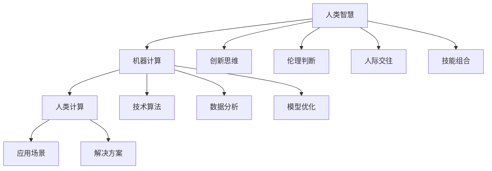

                 

# 人类计算：AI时代的未来就业市场趋势与技能培训需求

## 1. 背景介绍

### 1.1 问题由来

随着人工智能(AI)技术的飞速发展，尤其是机器学习(ML)和深度学习(DL)的应用，人类计算(Computational Humanity)的概念逐渐浮出水面。人类计算强调利用人的智慧和能力与机器的计算能力相结合，进行更高效、更有创造性的工作。在AI时代，计算不再仅仅是机器的任务，人类智慧与计算的结合将开辟新的就业市场和发展方向。

在人工智能的推动下，许多传统行业的就业市场正在经历深刻变革。一方面，机器自动化和智能化导致一些职业被替代；另一方面，新的AI技术创造了新的职业和就业机会。如何在这个转变中找到平衡，培养和培训人类计算所需的技能，成为亟待解决的问题。

### 1.2 问题核心关键点

人类计算的核心在于如何有效整合人类的智慧与计算能力，以解决复杂、高维、非结构化的问题。以下是该问题的几个关键点：

1. **技术融合**：人类计算强调跨学科融合，将AI技术与人文、艺术、社会科学等领域结合，创造新的应用场景和解决方案。
2. **技能需求**：不仅需要传统的编程、数据分析等技能，还需要更强的批判性思维、创意思维和人际交往能力。
3. **就业趋势**：AI技术的引入带来了就业市场的分化，部分岗位被取代，但同时也创造了新的岗位需求，如AI伦理学家、数据标注员、模型解释员等。
4. **培训需求**：随着AI技术的发展，对人类的技能培训需求也在不断变化，传统教育体系需要更新课程内容，培养新的技能组合。

### 1.3 问题研究意义

理解人类计算的概念及其对就业市场的影响，对于教育机构、企业和政策制定者都具有重要意义：

1. **教育体系改革**：促进教育体系改革，增加AI、数据科学等新兴学科的课程设置，培养符合未来市场需求的人才。
2. **企业转型升级**：帮助企业识别并适应AI带来的变化，调整人才结构和招聘策略，提升组织适应性。
3. **政策制定**：为政策制定者提供数据支持，制定有利于人才流动和技能培训的政策，推动经济社会的可持续发展。

## 2. 核心概念与联系

### 2.1 核心概念概述

人类计算是指通过结合人类的智慧和机器的计算能力，共同解决复杂问题的计算范式。其核心概念包括：

- **AI与人类智慧的融合**：利用机器学习、深度学习等技术，提升人类在解决问题中的效率和精度。
- **跨学科融合**：跨越多学科领域，结合人工智能、心理学、社会学等，创造新的应用场景和解决方案。
- **技能组合**：不仅需要技术技能，还需要创新思维、伦理判断和人际交往能力。

### 2.2 核心概念原理和架构的 Mermaid 流程图



### 2.3 核心概念的联系

上述概念之间的关系可以通过以下箭头表示：

- 人类智慧与机器计算相结合，形成人类计算。
- 创新思维、伦理判断和人际交往能力，是人类智慧的重要组成部分。
- 技术算法、数据分析和模型优化，是机器计算的核心能力。
- 应用场景和解决方案，是人类计算的最终目标。

## 3. 核心算法原理 & 具体操作步骤

### 3.1 算法原理概述

人类计算的核心算法原理在于如何有效结合人类的智慧与机器的计算能力，解决复杂、高维、非结构化的问题。

人类计算通常包括以下几个步骤：

1. **问题定义**：明确需要解决的问题，包括问题的规模、复杂度和解决目标。
2. **数据准备**：收集和整理相关数据，准备用于机器学习和模型训练。
3. **模型构建**：选择合适的机器学习模型，设计合适的训练和评估流程。
4. **模型训练**：利用人类智慧指导机器进行模型训练，优化模型参数。
5. **模型评估**：通过实验和测试，评估模型的效果和可靠性。
6. **解决方案实施**：将模型应用到实际问题中，解决复杂问题。

### 3.2 算法步骤详解

以下是人类计算中常见的算法步骤：

1. **问题定义**：
   - 具体描述问题，如情感分析、推荐系统、图像识别等。
   - 确定问题的规模和复杂度，如数据量大小、维度高等。

2. **数据准备**：
   - 收集相关的数据集，如文本、图像、音频等。
   - 数据预处理，包括数据清洗、归一化、特征提取等。

3. **模型构建**：
   - 选择合适的机器学习算法，如监督学习、无监督学习、强化学习等。
   - 设计合适的模型架构，如图形化神经网络、深度学习模型等。

4. **模型训练**：
   - 利用人类智慧，选择合理的训练策略和超参数。
   - 使用机器进行模型训练，优化模型参数。

5. **模型评估**：
   - 利用测试集进行模型评估，评估模型的准确性、泛化能力等。
   - 利用误差分析等技术，识别模型的局限性和改进点。

6. **解决方案实施**：
   - 将训练好的模型应用到实际问题中，解决问题。
   - 持续优化模型，提升模型效果。

### 3.3 算法优缺点

人类计算的优点在于：

1. **高效性**：利用机器的高效计算能力，解决复杂问题。
2. **创新性**：结合人类的智慧，创造新的解决方案和应用场景。
3. **可解释性**：人类智慧的参与，使得模型具有更好的可解释性和可信度。

缺点在于：

1. **依赖高质量数据**：高质量数据的获取和准备是关键，成本较高。
2. **技术门槛高**：需要具备较强的技术能力和跨学科知识。
3. **伦理风险**：人工智能可能带来伦理和隐私问题，需要严格监管。

### 3.4 算法应用领域

人类计算的应用领域非常广泛，包括但不限于：

- **医疗健康**：通过结合医学知识和AI技术，进行疾病诊断、治疗方案优化等。
- **金融服务**：利用AI进行风险评估、投资分析、客户服务优化等。
- **教育培训**：结合教育学和AI技术，进行个性化教学、学习效果评估等。
- **社会治理**：利用AI进行社会问题分析、政策制定、公共安全管理等。
- **艺术创作**：结合艺术创作和AI技术，进行音乐创作、图像生成、文学创作等。

## 4. 数学模型和公式 & 详细讲解 & 举例说明

### 4.1 数学模型构建

人类计算的数学模型通常包括以下几个部分：

1. **输入数据**：问题相关的输入数据，如文本、图像、音频等。
2. **模型参数**：模型中需要优化的参数，如权重、偏置等。
3. **损失函数**：衡量模型预测与真实结果之间的差异，如均方误差、交叉熵等。
4. **优化算法**：用于优化模型参数，如梯度下降、Adam、RMSprop等。
5. **评估指标**：衡量模型效果的指标，如准确率、召回率、F1-score等。

### 4.2 公式推导过程

以下以情感分析任务为例，推导常见的交叉熵损失函数和梯度下降优化算法：

假设模型的输入为文本 $x$，输出为情感标签 $y \in \{0,1\}$。模型的输出为概率 $p$，则交叉熵损失函数为：

$$
L = -y \log p - (1-y) \log(1-p)
$$

其中 $y$ 为真实标签，$p$ 为模型预测的概率。

使用梯度下降优化算法更新模型参数 $\theta$，其更新公式为：

$$
\theta \leftarrow \theta - \eta \nabla_{\theta}L
$$

其中 $\eta$ 为学习率，$\nabla_{\theta}L$ 为损失函数对模型参数 $\theta$ 的梯度。

### 4.3 案例分析与讲解

以图像识别任务为例，分析人类计算在该任务中的应用：

1. **问题定义**：识别图像中的物体类别。
2. **数据准备**：收集并预处理图像数据集，如ImageNet、COCO等。
3. **模型构建**：选择卷积神经网络（CNN）作为模型架构，设计合适的层数和参数。
4. **模型训练**：利用人类智慧，选择合适的训练策略和超参数。
5. **模型评估**：使用测试集评估模型效果，通过误差分析识别改进点。
6. **解决方案实施**：将训练好的模型应用到实际问题中，进行物体识别。

## 5. 项目实践：代码实例和详细解释说明

### 5.1 开发环境搭建

在实践中，可以使用Python和TensorFlow等工具进行人类计算的开发。以下是环境搭建的步骤：

1. 安装Anaconda：从官网下载并安装Anaconda，用于创建独立的Python环境。
2. 创建并激活虚拟环境：
```bash
conda create -n pytorch-env python=3.8 
conda activate pytorch-env
```
3. 安装必要的工具包：
```bash
pip install tensorflow numpy pandas scikit-learn matplotlib tqdm jupyter notebook ipython
```

### 5.2 源代码详细实现

以图像分类任务为例，使用TensorFlow实现人类计算：

```python
import tensorflow as tf
import numpy as np
from tensorflow.keras import layers, models
import matplotlib.pyplot as plt

# 数据准备
(x_train, y_train), (x_test, y_test) = tf.keras.datasets.cifar10.load_data()
x_train = x_train / 255.0
x_test = x_test / 255.0

# 模型构建
model = models.Sequential([
    layers.Conv2D(32, (3,3), activation='relu', input_shape=(32, 32, 3)),
    layers.MaxPooling2D((2, 2)),
    layers.Conv2D(64, (3, 3), activation='relu'),
    layers.MaxPooling2D((2, 2)),
    layers.Conv2D(64, (3, 3), activation='relu'),
    layers.Flatten(),
    layers.Dense(64, activation='relu'),
    layers.Dense(10)
])

# 模型训练
model.compile(optimizer='adam', loss=tf.keras.losses.SparseCategoricalCrossentropy(from_logits=True), metrics=['accuracy'])

history = model.fit(x_train, y_train, epochs=10, validation_data=(x_test, y_test))

# 模型评估
test_loss, test_acc = model.evaluate(x_test, y_test, verbose=2)
print(f'Test accuracy: {test_acc * 100:.2f}%')

# 可视化训练过程
plt.plot(history.history['accuracy'], label='accuracy')
plt.plot(history.history['val_accuracy'], label='val_accuracy')
plt.xlabel('Epoch')
plt.ylabel('Accuracy')
plt.legend()
plt.show()
```

### 5.3 代码解读与分析

上述代码实现了一个简单的卷积神经网络，用于CIFAR-10图像分类任务。分析如下：

1. **数据准备**：使用TensorFlow自带的CIFAR-10数据集，进行数据预处理，将像素值归一化到0-1之间。
2. **模型构建**：定义一个简单的卷积神经网络，包括卷积层、池化层、全连接层等。
3. **模型训练**：使用Adam优化器进行模型训练，设定训练轮数为10轮。
4. **模型评估**：在测试集上评估模型效果，输出准确率。
5. **可视化训练过程**：绘制训练过程中准确率的变化曲线，观察模型训练效果。

## 6. 实际应用场景

### 6.1 智能医疗

在智能医疗领域，人类计算可以结合医学知识和AI技术，进行疾病诊断、治疗方案优化等。例如，利用机器学习算法分析病人的历史数据和症状，帮助医生进行疾病预测和个性化治疗。

### 6.2 金融服务

金融服务领域可以应用人类计算进行风险评估、投资分析、客户服务优化等。例如，结合金融知识库和机器学习算法，进行信用评分、贷款审批、金融市场预测等。

### 6.3 教育培训

教育培训领域可以利用人类计算进行个性化教学、学习效果评估等。例如，结合学习行为数据和AI技术，进行学生学习状态分析和个性化推荐。

### 6.4 社会治理

社会治理领域可以应用人类计算进行问题分析和政策制定。例如，结合社会大数据和机器学习算法，进行公共安全监测、社会事件预测等。

## 7. 工具和资源推荐

### 7.1 学习资源推荐

1. **《深度学习》课程**：斯坦福大学的深度学习课程，涵盖深度学习的基本概念和经典模型。
2. **《机器学习实战》书籍**：一本实战性很强的机器学习入门书籍，适合初学者快速上手。
3. **《人类计算》论文**：分析人类计算的概念、方法和应用场景的论文，提供理论基础和前沿思路。
4. **Coursera平台**：提供各类机器学习和人工智能课程，涵盖从入门到高级的多个层次。

### 7.2 开发工具推荐

1. **TensorFlow**：Google开源的深度学习框架，功能丰富、社区活跃。
2. **PyTorch**：Facebook开源的深度学习框架，易于使用、生态完善。
3. **Jupyter Notebook**：强大的交互式笔记本，支持多种编程语言，便于调试和展示代码。
4. **GitHub**：代码托管平台，方便团队协作和代码版本管理。

### 7.3 相关论文推荐

1. **《AI对就业市场的影响》论文**：分析AI技术对就业市场的影响，提供数据支持和政策建议。
2. **《跨学科融合的AI应用》论文**：探讨AI与不同学科领域的融合应用，提供理论和实践案例。
3. **《人类计算在教育中的应用》论文**：研究人类计算在教育培训中的具体应用，提供实证数据和分析。

## 8. 总结：未来发展趋势与挑战

### 8.1 研究成果总结

人类计算的探索和发展，为AI技术的落地应用提供了新的思路和方法。通过结合人类的智慧和机器的计算能力，可以在解决复杂问题上取得更好的效果。

### 8.2 未来发展趋势

1. **技术融合深化**：跨学科融合的趋势将更加明显，AI技术与更多领域的结合将带来更多创新应用。
2. **技能需求更新**：随着技术的演进，技能培训需求也在不断变化，教育体系需要不断更新课程内容。
3. **就业市场调整**：AI技术将带来就业市场的分化，新的岗位需求将不断涌现。

### 8.3 面临的挑战

1. **数据依赖**：高质量数据的获取和准备是关键，成本较高。
2. **技术门槛**：需要具备较强的技术能力和跨学科知识。
3. **伦理风险**：人工智能可能带来伦理和隐私问题，需要严格监管。

### 8.4 研究展望

未来的研究可以从以下几个方面进行：

1. **数据质量提升**：提高数据获取和准备的效率和质量，降低成本。
2. **技能培训体系建设**：建立适应未来需求的培训体系，培养跨学科、跨领域的人才。
3. **伦理和社会影响研究**：研究AI技术的伦理和社会影响，制定相应的监管政策。

## 9. 附录：常见问题与解答

**Q1: 人类计算和人工智能有什么区别？**

A: 人工智能强调机器的智能，而人类计算强调人类智慧与机器计算的结合。人类计算利用机器的高效计算能力，提升人类在解决问题中的效率和精度。

**Q2: 人类计算的优势和劣势是什么？**

A: 优势在于高效性、创新性和可解释性，能够解决复杂、高维、非结构化的问题。劣势在于依赖高质量数据、技术门槛高和伦理风险。

**Q3: 如何培养人类计算所需的技能？**

A: 培养跨学科的知识和技能，如编程、数据分析、创新思维、伦理判断和人际交往能力。

**Q4: 人类计算在实际应用中需要注意哪些问题？**

A: 高质量数据的获取、技术实现的复杂性、伦理风险等。

**Q5: 未来人类计算的发展趋势是什么？**

A: 技术融合深化、技能需求更新、就业市场调整等。

作者：禅与计算机程序设计艺术 / Zen and the Art of Computer Programming

