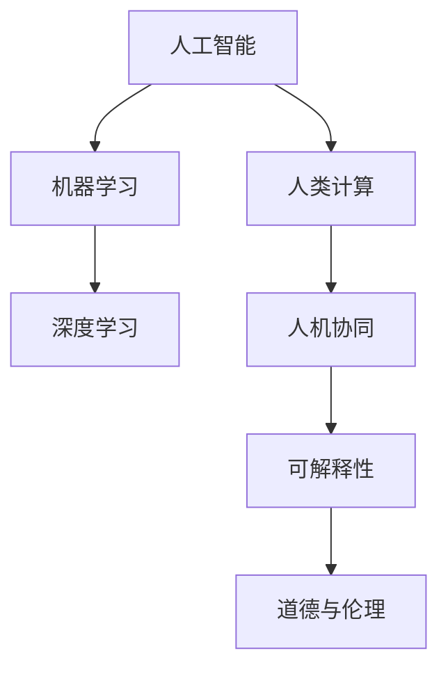

                 

# 人类计算：AI时代的未来技能

> 关键词：人类计算, 人工智能, 未来技能, 深度学习, 自动化, 可解释性, 可持续性

## 1. 背景介绍

### 1.1 问题由来

随着人工智能(AI)技术的迅速发展，自动化和智能化已经成为当前各行各业的热门话题。无论是制造业的智能工厂、金融业的智能投顾、医疗行业的智能诊断，还是客服行业的智能客服，人工智能都在推动各个领域的变革。然而，人工智能技术并非完全独立存在，而是需要与人类技能相互融合，才能发挥其最大效用。

在AI时代，人类的计算能力、数据分析能力、创新能力、决策能力等，都是不可替代的核心技能。但随着技术的快速发展，人工智能在各个领域的应用，也带来了新的挑战和需求。如何平衡人类与AI，如何提升人类在AI时代的技能，成为了当前亟待解决的问题。

### 1.2 问题核心关键点

人工智能与人类计算的核心关键点主要包括以下几个方面：

1. **协作与融合**：AI技术并非完全替代人类，而是与人类技能相结合，共同完成复杂的任务。

2. **可解释性与透明度**：在实际应用中，人类需要理解AI模型的决策过程，才能更好地与AI协作。

3. **可持续性**：AI技术的长期发展需要考虑到能源消耗、环境影响等因素，实现可持续发展。

4. **道德与伦理**：AI在应用过程中，需要遵守道德和伦理规范，避免对社会和人类造成伤害。

5. **多样性与包容性**：AI系统需要能够处理多样化的数据和情境，保障包容性和公平性。

这些核心关键点不仅决定了人工智能的发展方向，也决定了人类在AI时代所需具备的技能和能力。

### 1.3 问题研究意义

研究人类计算与AI的协作融合，具有重要意义：

1. **提升生产力**：通过AI技术与人类技能的结合，提升各行业的生产效率和决策质量。

2. **培养人才**：帮助人类掌握AI技术，提升跨学科综合能力，培养复合型人才。

3. **推动创新**：激发人类与AI的创新活力，推动科学技术和社会进步。

4. **构建未来**：为AI时代的可持续发展和社会公平构建坚实基础。

5. **保障安全**：确保AI技术的应用符合道德伦理规范，保障人类安全。

在AI时代，人类计算能力和AI技术的深度融合，将成为推动社会发展的关键力量。

## 2. 核心概念与联系

### 2.1 核心概念概述

为更好地理解人类计算与AI的协作融合，本节将介绍几个密切相关的核心概念：

- **人工智能(AI)**：通过计算机系统模拟人类智能，包括感知、学习、推理、决策等能力。

- **机器学习(ML)**：一种数据驱动的学习方式，使计算机系统具备自主学习能力。

- **深度学习(Deep Learning)**：一种基于神经网络的机器学习技术，通过多层神经网络模拟人脑的学习过程。

- **人类计算**：人类在计算过程中所展现出的思维、判断、决策、创新等能力。

- **人机协同**：人类与机器之间的协作关系，强调两者互补，共同完成任务。

- **可解释性(Explainability)**：AI模型的决策过程需要可解释，便于人类理解和使用。

- **道德与伦理(Ethics)**：AI技术应用中需要遵守的道德规范，保障社会的公平正义。

这些核心概念之间的逻辑关系可以通过以下Mermaid流程图来展示：



这个流程图展示了大语言模型的核心概念及其之间的关系：

1. 人工智能通过机器学习和深度学习技术，具备智能决策和学习能力。
2. 人类计算通过思维和创新，弥补机器学习的局限性。
3. 人机协同强调人类与AI的互补关系，共同完成复杂任务。
4. 可解释性使得AI决策过程透明化，便于人类理解和信任。
5. 道德与伦理确保AI技术的应用符合社会价值观，保障公平正义。

这些概念共同构成了AI时代人类计算与AI协作的框架，使得人类与AI能够和谐共存，共同推动社会的进步。

## 3. 核心算法原理 & 具体操作步骤
### 3.1 算法原理概述

人类计算与AI的协作融合，本质上是将人类思维与AI技术相结合，实现智能化的决策和执行。这种协作融合的核心在于数据驱动的AI技术，通过机器学习、深度学习等算法，提取和利用数据中的知识，结合人类的经验、直觉和判断，完成复杂任务的决策和执行。

具体而言，人类计算与AI的协作流程包括以下几个关键步骤：

1. **数据采集与处理**：收集和处理相关领域的数据，为AI技术提供训练和推理的基础。

2. **模型训练与优化**：通过机器学习和深度学习算法，训练AI模型，使其具备智能决策能力。

3. **人机交互与协同**：设计人机交互界面，使人类能够与AI模型进行交互，共同完成任务。

4. **结果评估与反馈**：评估AI模型的性能，通过人类反馈进一步优化模型。

5. **应用部署与维护**：将优化后的模型部署到实际应用场景中，进行持续的监测和维护。

### 3.2 算法步骤详解

以下是人类计算与AI协作融合的具体操作步骤：

**Step 1: 数据采集与处理**
- 收集相关领域的数据，包括文本、图像、语音等。
- 清洗数据，去除噪声和异常值。
- 进行特征提取和归一化处理，为后续训练做准备。

**Step 2: 模型训练与优化**
- 选择合适的机器学习或深度学习模型，如神经网络、支持向量机、决策树等。
- 使用数据集对模型进行训练，最小化损失函数。
- 应用正则化技术，如L2正则、Dropout等，防止过拟合。
- 使用交叉验证等方法，评估模型性能，选择最佳模型。

**Step 3: 人机交互与协同**
- 设计用户界面(UI)，方便人类与AI模型进行交互。
- 集成AI模型到实际应用中，提供自动化决策支持。
- 设计算法，使AI模型能够理解人类输入，提供合适的输出。

**Step 4: 结果评估与反馈**
- 使用评估指标，如精确度、召回率、F1分数等，评估AI模型性能。
- 收集人类反馈，进行模型优化。
- 不断迭代优化，提高模型性能。

**Step 5: 应用部署与维护**
- 将优化后的模型部署到生产环境中。
- 进行持续的监测和维护，保证系统稳定运行。
- 根据实际情况，及时进行模型更新和维护。

### 3.3 算法优缺点

人类计算与AI协作融合的算法具有以下优点：

1. **高效性**：通过AI技术与人类技能的结合，可以大幅提升效率和决策质量。

2. **可解释性**：人类可以通过理解AI模型的决策过程，增强对模型的信任和接受度。

3. **灵活性**：人类可以根据任务需求，灵活调整AI模型的参数和算法，实现个性化定制。

4. **可持续性**：结合人类技能和AI技术，可以实现更加可持续的解决方案。

5. **创新性**：人类与AI的结合，可以激发新的创新思路和方法，推动技术进步。

同时，这种协作融合也存在一些局限性：

1. **数据依赖**：AI模型的性能很大程度上取决于数据质量，数据获取和处理成本较高。

2. **复杂性**：人机协同系统设计复杂，需要多方协作。

3. **成本**：高质量的AI模型开发和维护需要较大的投入。

4. **安全性**：人机协同系统需要严格的安全措施，防止数据泄露和滥用。

5. **伦理问题**：AI模型可能带来的道德伦理问题，需要仔细考虑和处理。

尽管存在这些局限性，但人类计算与AI协作融合的算法依然是大数据时代的重要趋势，其优势远远大于局限性。

### 3.4 算法应用领域

人类计算与AI协作融合的算法已经在多个领域得到了广泛应用，例如：

- **金融科技**：利用AI进行风险评估、智能投顾、量化交易等。
- **医疗健康**：利用AI进行疾病诊断、治疗方案推荐、健康监测等。
- **智能制造**：利用AI进行生产计划优化、质量控制、设备维护等。
- **智慧城市**：利用AI进行交通管理、环境监测、公共安全等。
- **智能客服**：利用AI进行自动回复、情绪识别、用户画像等。
- **教育培训**：利用AI进行个性化学习推荐、智能评估、教学辅助等。
- **零售电商**：利用AI进行商品推荐、价格优化、库存管理等。

这些领域的应用，展示了人类计算与AI协作融合的巨大潜力，推动了各行各业的数字化转型和智能化升级。

## 4. 数学模型和公式 & 详细讲解  
### 4.1 数学模型构建

人类计算与AI协作融合的数学模型构建，需要综合考虑机器学习、深度学习和人机交互等多个方面。以下是一个典型的数据驱动的AI模型构建过程：

- **输入层**：输入数据的特征向量，如文本、图像、音频等。
- **隐藏层**：神经网络中的多个层次，提取和抽象输入数据的特征。
- **输出层**：模型最终的输出结果，如分类标签、回归值、预测概率等。

以一个简单的二分类任务为例，其数学模型可以表示为：

$$
y = f(x; \theta)
$$

其中 $y$ 为分类标签，$x$ 为输入特征向量，$\theta$ 为模型参数。假设模型为线性分类器，则：

$$
y = \sigma(\theta^T x)
$$

其中 $\sigma$ 为激活函数，如 sigmoid 函数。

### 4.2 公式推导过程

假设模型为线性回归模型，输入数据 $x$ 和输出数据 $y$ 满足线性关系：

$$
y = \theta^T x + b
$$

其中 $\theta$ 为权重向量，$b$ 为偏置项。损失函数为均方误差损失函数：

$$
L(\theta) = \frac{1}{N} \sum_{i=1}^N (y_i - \theta^T x_i - b)^2
$$

最小化损失函数的过程为梯度下降法：

$$
\theta \leftarrow \theta - \eta \frac{\partial L(\theta)}{\partial \theta}
$$

其中 $\eta$ 为学习率。

### 4.3 案例分析与讲解

以一个简单的情感分析任务为例，分析其数据驱动的AI模型构建过程：

- **数据准备**：收集带有情感标签的文本数据集。
- **特征提取**：使用词袋模型或TF-IDF等方法，将文本转化为特征向量。
- **模型训练**：使用线性分类器对数据集进行训练，最小化损失函数。
- **结果评估**：使用精确度、召回率、F1分数等指标，评估模型性能。
- **优化与部署**：根据评估结果，对模型进行优化，部署到实际应用中。

## 5. 项目实践：代码实例和详细解释说明
### 5.1 开发环境搭建

在进行人类计算与AI协作融合的实践前，我们需要准备好开发环境。以下是使用Python进行PyTorch开发的环境配置流程：

1. 安装Anaconda：从官网下载并安装Anaconda，用于创建独立的Python环境。

2. 创建并激活虚拟环境：
```bash
conda create -n pytorch-env python=3.8 
conda activate pytorch-env
```

3. 安装PyTorch：根据CUDA版本，从官网获取对应的安装命令。例如：
```bash
conda install pytorch torchvision torchaudio cudatoolkit=11.1 -c pytorch -c conda-forge
```

4. 安装TensorFlow：由Google主导开发的开源深度学习框架，生产部署方便，适合大规模工程应用。同样有丰富的预训练语言模型资源。

5. 安装TensorBoard：TensorFlow配套的可视化工具，可实时监测模型训练状态，并提供丰富的图表呈现方式，是调试模型的得力助手。

6. 安装Weights & Biases：模型训练的实验跟踪工具，可以记录和可视化模型训练过程中的各项指标，方便对比和调优。

完成上述步骤后，即可在`pytorch-env`环境中开始实践。

### 5.2 源代码详细实现

下面我们以情感分析任务为例，给出使用Transformers库对BERT模型进行微调的PyTorch代码实现。

首先，定义情感分析任务的数据处理函数：

```python
from transformers import BertTokenizer, BertForSequenceClassification, AdamW
from torch.utils.data import Dataset
import torch

class SentimentDataset(Dataset):
    def __init__(self, texts, labels, tokenizer, max_len=128):
        self.texts = texts
        self.labels = labels
        self.tokenizer = tokenizer
        self.max_len = max_len
        
    def __len__(self):
        return len(self.texts)
    
    def __getitem__(self, item):
        text = self.texts[item]
        label = self.labels[item]
        
        encoding = self.tokenizer(text, return_tensors='pt', max_length=self.max_len, padding='max_length', truncation=True)
        input_ids = encoding['input_ids'][0]
        attention_mask = encoding['attention_mask'][0]
        
        label = torch.tensor(label, dtype=torch.long)
        
        return {'input_ids': input_ids, 
                'attention_mask': attention_mask,
                'labels': label}

# 标签与id的映射
label2id = {'negative': 0, 'positive': 1}
id2label = {v: k for k, v in label2id.items()}

# 创建dataset
tokenizer = BertTokenizer.from_pretrained('bert-base-uncased')

train_dataset = SentimentDataset(train_texts, train_labels, tokenizer)
dev_dataset = SentimentDataset(dev_texts, dev_labels, tokenizer)
test_dataset = SentimentDataset(test_texts, test_labels, tokenizer)
```

然后，定义模型和优化器：

```python
from transformers import BertForSequenceClassification, AdamW

model = BertForSequenceClassification.from_pretrained('bert-base-uncased', num_labels=2)

optimizer = AdamW(model.parameters(), lr=2e-5)
```

接着，定义训练和评估函数：

```python
from torch.utils.data import DataLoader
from tqdm import tqdm
from sklearn.metrics import classification_report

device = torch.device('cuda') if torch.cuda.is_available() else torch.device('cpu')
model.to(device)

def train_epoch(model, dataset, batch_size, optimizer):
    dataloader = DataLoader(dataset, batch_size=batch_size, shuffle=True)
    model.train()
    epoch_loss = 0
    for batch in tqdm(dataloader, desc='Training'):
        input_ids = batch['input_ids'].to(device)
        attention_mask = batch['attention_mask'].to(device)
        labels = batch['labels'].to(device)
        model.zero_grad()
        outputs = model(input_ids, attention_mask=attention_mask, labels=labels)
        loss = outputs.loss
        epoch_loss += loss.item()
        loss.backward()
        optimizer.step()
    return epoch_loss / len(dataloader)

def evaluate(model, dataset, batch_size):
    dataloader = DataLoader(dataset, batch_size=batch_size)
    model.eval()
    preds, labels = [], []
    with torch.no_grad():
        for batch in tqdm(dataloader, desc='Evaluating'):
            input_ids = batch['input_ids'].to(device)
            attention_mask = batch['attention_mask'].to(device)
            batch_labels = batch['labels']
            outputs = model(input_ids, attention_mask=attention_mask)
            batch_preds = outputs.logits.argmax(dim=1).to('cpu').tolist()
            batch_labels = batch_labels.to('cpu').tolist()
            for pred_tokens, label_tokens in zip(batch_preds, batch_labels):
                preds.append(pred_tokens)
                labels.append(label_tokens)
                
    print(classification_report(labels, preds))
```

最后，启动训练流程并在测试集上评估：

```python
epochs = 5
batch_size = 16

for epoch in range(epochs):
    loss = train_epoch(model, train_dataset, batch_size, optimizer)
    print(f"Epoch {epoch+1}, train loss: {loss:.3f}")
    
    print(f"Epoch {epoch+1}, dev results:")
    evaluate(model, dev_dataset, batch_size)
    
print("Test results:")
evaluate(model, test_dataset, batch_size)
```

以上就是使用PyTorch对BERT进行情感分析任务微调的完整代码实现。可以看到，得益于Transformers库的强大封装，我们可以用相对简洁的代码完成BERT模型的加载和微调。

### 5.3 代码解读与分析

让我们再详细解读一下关键代码的实现细节：

**SentimentDataset类**：
- `__init__`方法：初始化文本、标签、分词器等关键组件。
- `__len__`方法：返回数据集的样本数量。
- `__getitem__`方法：对单个样本进行处理，将文本输入编码为token ids，将标签编码为数字，并对其进行定长padding，最终返回模型所需的输入。

**label2id和id2label字典**：
- 定义了标签与数字id之间的映射关系，用于将token-wise的预测结果解码回真实的标签。

**训练和评估函数**：
- 使用PyTorch的DataLoader对数据集进行批次化加载，供模型训练和推理使用。
- 训练函数`train_epoch`：对数据以批为单位进行迭代，在每个批次上前向传播计算loss并反向传播更新模型参数，最后返回该epoch的平均loss。
- 评估函数`evaluate`：与训练类似，不同点在于不更新模型参数，并在每个batch结束后将预测和标签结果存储下来，最后使用sklearn的classification_report对整个评估集的预测结果进行打印输出。

**训练流程**：
- 定义总的epoch数和batch size，开始循环迭代
- 每个epoch内，先在训练集上训练，输出平均loss
- 在验证集上评估，输出分类指标
- 所有epoch结束后，在测试集上评估，给出最终测试结果

可以看到，PyTorch配合Transformers库使得BERT微调的代码实现变得简洁高效。开发者可以将更多精力放在数据处理、模型改进等高层逻辑上，而不必过多关注底层的实现细节。

当然，工业级的系统实现还需考虑更多因素，如模型的保存和部署、超参数的自动搜索、更灵活的任务适配层等。但核心的微调范式基本与此类似。

## 6. 实际应用场景
### 6.1 智能客服系统

基于大语言模型微调的对话技术，可以广泛应用于智能客服系统的构建。传统客服往往需要配备大量人力，高峰期响应缓慢，且一致性和专业性难以保证。而使用微调后的对话模型，可以7x24小时不间断服务，快速响应客户咨询，用自然流畅的语言解答各类常见问题。

在技术实现上，可以收集企业内部的历史客服对话记录，将问题和最佳答复构建成监督数据，在此基础上对预训练对话模型进行微调。微调后的对话模型能够自动理解用户意图，匹配最合适的答案模板进行回复。对于客户提出的新问题，还可以接入检索系统实时搜索相关内容，动态组织生成回答。如此构建的智能客服系统，能大幅提升客户咨询体验和问题解决效率。

### 6.2 金融舆情监测

金融机构需要实时监测市场舆论动向，以便及时应对负面信息传播，规避金融风险。传统的人工监测方式成本高、效率低，难以应对网络时代海量信息爆发的挑战。基于大语言模型微调的文本分类和情感分析技术，为金融舆情监测提供了新的解决方案。

具体而言，可以收集金融领域相关的新闻、报道、评论等文本数据，并对其进行主题标注和情感标注。在此基础上对预训练语言模型进行微调，使其能够自动判断文本属于何种主题，情感倾向是正面、中性还是负面。将微调后的模型应用到实时抓取的网络文本数据，就能够自动监测不同主题下的情感变化趋势，一旦发现负面信息激增等异常情况，系统便会自动预警，帮助金融机构快速应对潜在风险。

### 6.3 个性化推荐系统

当前的推荐系统往往只依赖用户的历史行为数据进行物品推荐，无法深入理解用户的真实兴趣偏好。基于大语言模型微调技术，个性化推荐系统可以更好地挖掘用户行为背后的语义信息，从而提供更精准、多样的推荐内容。

在实践中，可以收集用户浏览、点击、评论、分享等行为数据，提取和用户交互的物品标题、描述、标签等文本内容。将文本内容作为模型输入，用户的后续行为（如是否点击、购买等）作为监督信号，在此基础上微调预训练语言模型。微调后的模型能够从文本内容中准确把握用户的兴趣点。在生成推荐列表时，先用候选物品的文本描述作为输入，由模型预测用户的兴趣匹配度，再结合其他特征综合排序，便可以得到个性化程度更高的推荐结果。

### 6.4 未来应用展望

随着大语言模型微调技术的发展，基于微调范式将在更多领域得到应用，为传统行业带来变革性影响。

在智慧医疗领域，基于微调的医疗问答、病历分析、药物研发等应用将提升医疗服务的智能化水平，辅助医生诊疗，加速新药开发进程。

在智能教育领域，微调技术可应用于作业批改、学情分析、知识推荐等方面，因材施教，促进教育公平，提高教学质量。

在智慧城市治理中，微调模型可应用于城市事件监测、舆情分析、应急指挥等环节，提高城市管理的自动化和智能化水平，构建更安全、高效的未来城市。

此外，在企业生产、社会治理、文娱传媒等众多领域，基于大模型微调的人工智能应用也将不断涌现，为经济社会发展注入新的动力。相信随着技术的日益成熟，微调方法将成为人工智能落地应用的重要范式，推动人工智能技术向更广阔的领域加速渗透。

## 7. 工具和资源推荐
### 7.1 学习资源推荐

为了帮助开发者系统掌握大语言模型微调的理论基础和实践技巧，这里推荐一些优质的学习资源：

1. 《Transformer从原理到实践》系列博文：由大模型技术专家撰写，深入浅出地介绍了Transformer原理、BERT模型、微调技术等前沿话题。

2. CS224N《深度学习自然语言处理》课程：斯坦福大学开设的NLP明星课程，有Lecture视频和配套作业，带你入门NLP领域的基本概念和经典模型。

3. 《Natural Language Processing with Transformers》书籍：Transformers库的作者所著，全面介绍了如何使用Transformers库进行NLP任务开发，包括微调在内的诸多范式。

4. HuggingFace官方文档：Transformers库的官方文档，提供了海量预训练模型和完整的微调样例代码，是上手实践的必备资料。

5. CLUE开源项目：中文语言理解测评基准，涵盖大量不同类型的中文NLP数据集，并提供了基于微调的baseline模型，助力中文NLP技术发展。

通过对这些资源的学习实践，相信你一定能够快速掌握大语言模型微调的精髓，并用于解决实际的NLP问题。
###  7.2 开发工具推荐

高效的开发离不开优秀的工具支持。以下是几款用于大语言模型微调开发的常用工具：

1. PyTorch：基于Python的开源深度学习框架，灵活动态的计算图，适合快速迭代研究。大部分预训练语言模型都有PyTorch版本的实现。

2. TensorFlow：由Google主导开发的开源深度学习框架，生产部署方便，适合大规模工程应用。同样有丰富的预训练语言模型资源。

3. Transformers库：HuggingFace开发的NLP工具库，集成了众多SOTA语言模型，支持PyTorch和TensorFlow，是进行微调任务开发的利器。

4. Weights & Biases：模型训练的实验跟踪工具，可以记录和可视化模型训练过程中的各项指标，方便对比和调优。与主流深度学习框架无缝集成。

5. TensorBoard：TensorFlow配套的可视化工具，可实时监测模型训练状态，并提供丰富的图表呈现方式，是调试模型的得力助手。

6. Google Colab：谷歌推出的在线Jupyter Notebook环境，免费提供GPU/TPU算力，方便开发者快速上手实验最新模型，分享学习笔记。

合理利用这些工具，可以显著提升大语言模型微调任务的开发效率，加快创新迭代的步伐。

### 7.3 相关论文推荐

大语言模型和微调技术的发展源于学界的持续研究。以下是几篇奠基性的相关论文，推荐阅读：

1. Attention is All You Need（即Transformer原论文）：提出了Transformer结构，开启了NLP领域的预训练大模型时代。

2. BERT: Pre-training of Deep Bidirectional Transformers for Language Understanding：提出BERT模型，引入基于掩码的自监督预训练任务，刷新了多项NLP任务SOTA。

3. Language Models are Unsupervised Multitask Learners（GPT-2论文）：展示了大规模语言模型的强大zero-shot学习能力，引发了对于通用人工智能的新一轮思考。

4. Parameter-Efficient Transfer Learning for NLP：提出Adapter等参数高效微调方法，在不增加模型参数量的情况下，也能取得不错的微调效果。

5. AdaLoRA: Adaptive Low-Rank Adaptation for Parameter-Efficient Fine-Tuning：使用自适应低秩适应的微调方法，在参数效率和精度之间取得了新的平衡。

这些论文代表了大语言模型微调技术的发展脉络。通过学习这些前沿成果，可以帮助研究者把握学科前进方向，激发更多的创新灵感。

## 8. 总结：未来发展趋势与挑战

### 8.1 总结

本文对人类计算与AI协作融合的技术进行了全面系统的介绍。首先阐述了人类计算与AI协作融合的背景和意义，明确了微调在提升生产效率、推动技术创新、保障安全稳定等方面的重要作用。其次，从原理到实践，详细讲解了微调模型的构建和优化，给出了微调任务开发的完整代码实例。同时，本文还探讨了微调技术在多个行业领域的应用前景，展示了微调范式的巨大潜力。最后，本文精选了微调技术的各类学习资源，力求为开发者提供全方位的技术指引。

通过本文的系统梳理，可以看到，人类计算与AI协作融合的微调技术正在成为AI时代的重要趋势，极大地拓展了AI技术的应用边界，推动了各行业的智能化升级。未来，伴随技术的不断演进，微调方法将成为AI技术应用的关键范式，为各行业带来深远影响。

### 8.2 未来发展趋势

展望未来，人类计算与AI协作融合的微调技术将呈现以下几个发展趋势：

1. **自动化与智能化**：随着AI技术的不断进步，微调过程将更加自动化和智能化，通过机器学习算法优化微调参数，提高微调效率。

2. **多模态融合**：微调技术将与视觉、音频等多模态数据融合，提升AI系统对复杂情境的建模能力。

3. **可解释性与透明性**：AI模型的决策过程将更加透明，通过可解释性技术，使人类更好地理解和信任AI系统。

4. **持续学习与动态优化**：微调模型将具备持续学习的能力，不断适应数据分布的变化，动态优化模型参数。

5. **跨领域迁移能力**：微调模型将具备更强的跨领域迁移能力，能够更好地适应新的应用场景。

6. **高效计算与资源优化**：微调模型的计算图将不断优化，提升计算效率，减少资源消耗。

7. **伦理与合规**：微调模型的开发和应用将更加注重伦理和合规，确保AI技术的应用符合社会价值观。

以上趋势凸显了人类计算与AI协作融合的微调技术的广阔前景。这些方向的探索发展，必将进一步提升AI系统的性能和应用范围，为人类社会的智能化转型提供有力支撑。

### 8.3 面临的挑战

尽管人类计算与AI协作融合的微调技术取得了显著进展，但在迈向更加智能化、普适化应用的过程中，仍面临诸多挑战：

1. **数据质量与标注成本**：高质量数据和标注是微调技术的前提，数据获取和标注成本较高。

2. **模型鲁棒性与泛化能力**：微调模型可能对域外数据泛化能力不足，需要进一步提升模型的鲁棒性。

3. **计算资源与硬件限制**：大规模语言模型的训练和推理需要大量的计算资源，硬件瓶颈限制了技术的普及。

4. **安全与隐私**：微调模型可能面临数据泄露和隐私侵犯的风险，需要严格的保护措施。

5. **伦理与法律问题**：微调模型的应用可能涉及伦理和法律问题，需要谨慎处理。

6. **可解释性与透明性**：微调模型的决策过程缺乏透明性，需要进一步提升模型的可解释性。

7. **持续学习与知识更新**：微调模型需要不断更新知识，以适应数据分布的变化。

这些挑战需要科技界和产业界共同努力，通过不断的技术创新和实践探索，逐步克服这些难题，推动人类计算与AI协作融合技术的成熟和普及。

### 8.4 研究展望

面对人类计算与AI协作融合技术的挑战，未来的研究需要在以下几个方面寻求新的突破：

1. **数据增强与迁移学习**：通过数据增强和迁移学习技术，扩大数据集规模，提升微调效果。

2. **多模态融合与跨领域迁移**：探索多模态数据的融合与跨领域迁移方法，提升模型的泛化能力。

3. **高效计算与优化算法**：开发高效计算与优化算法，提升微调模型的计算效率。

4. **可解释性与透明性技术**：研究可解释性与透明性技术，提升模型的可解释性。

5. **持续学习与知识更新**：探索持续学习与知识更新方法，使微调模型具备持续学习能力。

6. **伦理与法律研究**：研究伦理与法律问题，确保微调模型符合社会价值观和法律规范。

7. **安全与隐私保护**：研究安全与隐私保护技术，确保微调模型的安全可靠。

8. **跨学科合作**：加强跨学科合作，推动AI技术与人类计算的融合发展。

这些研究方向的探索，必将引领人类计算与AI协作融合技术的进一步突破，为构建智能未来奠定坚实基础。相信随着科技界和产业界的共同努力，人类计算与AI协作融合技术必将在推动社会进步、提升人类福祉等方面发挥更大的作用。

## 9. 附录：常见问题与解答

**Q1：人类计算与AI协作融合是否适用于所有应用场景？**

A: 人类计算与AI协作融合的微调技术在大多数应用场景上都能取得不错的效果，但具体效果取决于数据质量、模型设计和任务需求。对于一些特定的应用场景，如金融、医疗等，可能需要额外的预处理和定制化设计。

**Q2：如何选择合适的微调模型？**

A: 选择合适的微调模型需要综合考虑数据规模、任务需求、计算资源等因素。对于大规模数据和高性能计算资源，可以选择大模型进行微调；对于小规模数据和低性能计算资源，可以选择小模型或参数高效微调方法。

**Q3：微调过程中如何优化模型性能？**

A: 优化模型性能需要综合考虑损失函数、正则化技术、学习率、批大小、优化器等关键因素。通常需要进行超参数调优，使用交叉验证等技术评估模型性能，选择最佳模型。

**Q4：微调模型的应用部署需要注意哪些问题？**

A: 应用部署需要注意模型裁剪、量化加速、服务化封装、弹性伸缩、监控告警、安全防护等多个方面。需要综合考虑实际应用场景，选择适合的优化技术和部署方案。

**Q5：微调模型的未来发展方向是什么？**

A: 微调模型的未来发展方向包括自动化与智能化、多模态融合、可解释性与透明性、持续学习与动态优化、跨领域迁移能力、高效计算与资源优化、伦理与合规等多个方面。需要不断探索新技术，提升模型性能和应用范围。

通过本文的系统梳理，可以看到，人类计算与AI协作融合的微调技术正在成为AI时代的重要趋势，极大地拓展了AI技术的应用边界，推动了各行业的智能化升级。未来，伴随技术的不断演进，微调方法将成为AI技术应用的关键范式，为各行业带来深远影响。

