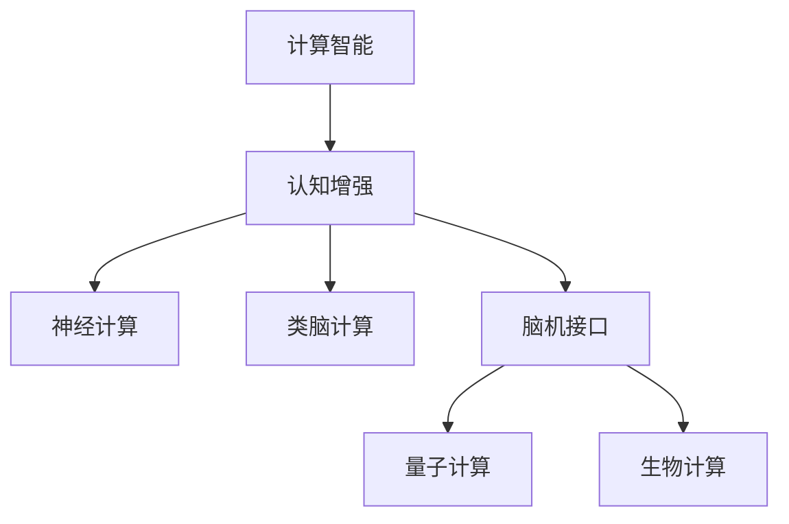

                 

# 人类计算：人工智能的新 frontier

> 关键词：人工智能,计算智能,人类计算,认知增强,神经计算,类脑计算,计算范式,脑机接口,量子计算,生物计算

## 1. 背景介绍

### 1.1 问题由来

近年来，人工智能(AI)技术的迅猛发展在各个领域中取得了令人瞩目的成果，从深度学习、计算机视觉、自然语言处理到机器人技术，AI技术已经成为驱动社会发展的重要引擎。然而，AI技术的背后始终有一组关键的计算范式在驱动其进步，包括模拟物理定律的数值计算、基于统计模型的概率计算、基于符号规则的逻辑计算等。这些传统的计算范式在很大程度上限制了AI技术的扩展性、适应性和普适性。

为了突破这一瓶颈，科学家和工程师们提出了“人类计算”这一概念，旨在模拟人脑的计算方式，融合生物神经计算、类脑计算、量子计算等前沿技术，构建全新的计算范式，从而赋予AI技术更加强大的认知能力和计算智能。

### 1.2 问题核心关键点

实现“人类计算”的核心关键点包括：

- **类脑计算模型**：设计能够模拟人脑神经元和突触的计算模型，构建基于生物神经机制的AI系统。
- **量子计算辅助**：利用量子叠加和纠缠等特性，实现高速并行计算，提升AI系统的处理能力。
- **生物计算融合**：将DNA、蛋白质等生物分子作为信息载体，构建非传统计算模型。
- **脑机接口技术**：实现人脑与计算机之间的信息交换，提升AI系统的响应速度和智能化程度。
- **全栈式系统架构**：构建包括硬件、软件、算法和应用的完整系统，涵盖从底层计算硬件到上层应用的全栈式解决方案。

这些关键点共同构成了“人类计算”这一新兴计算范式的基础，为AI技术的发展提供了新的方向。

## 2. 核心概念与联系

### 2.1 核心概念概述

为更好地理解“人类计算”这一新兴计算范式，本节将介绍几个密切相关的核心概念：

- **计算智能**：通过生物神经网络和类脑计算模型，实现与人类智能相似的计算能力。
- **认知增强**：利用神经计算、类脑计算等技术，增强AI系统的推理、学习、决策等认知功能。
- **神经计算**：基于生物神经元模拟的计算模型，以神经元连接、突触可塑性等生物机制为计算核心。
- **类脑计算**：通过硬件和算法模拟人脑神经网络，实现高度并行和自适应计算。
- **脑机接口**：实现人脑与计算机之间的信息交换，包括脑电信号采集、信号处理和信息传输等环节。
- **量子计算**：利用量子力学原理，实现基于量子比特的并行计算，提升计算速度和信息处理能力。
- **生物计算**：利用DNA、蛋白质等生物分子作为信息载体，构建非传统计算模型。

这些核心概念之间的逻辑关系可以通过以下Mermaid流程图来展示：



这个流程图展示了几大核心概念及其之间的关系：

1. **计算智能**：通过生物神经网络和类脑计算模型，实现与人类智能相似的计算能力。
2. **认知增强**：利用神经计算、类脑计算等技术，增强AI系统的推理、学习、决策等认知功能。
3. **神经计算**：基于生物神经元模拟的计算模型，以神经元连接、突触可塑性等生物机制为计算核心。
4. **类脑计算**：通过硬件和算法模拟人脑神经网络，实现高度并行和自适应计算。
5. **脑机接口**：实现人脑与计算机之间的信息交换，包括脑电信号采集、信号处理和信息传输等环节。
6. **量子计算**：利用量子力学原理，实现基于量子比特的并行计算，提升计算速度和信息处理能力。
7. **生物计算**：利用DNA、蛋白质等生物分子作为信息载体，构建非传统计算模型。

## 3. 核心算法原理 & 具体操作步骤

### 3.1 算法原理概述

“人类计算”的实现涉及多种计算范式的融合，包括神经计算、类脑计算、量子计算和生物计算等。其核心算法原理主要包括以下几个方面：

- **神经计算模型**：模拟人脑神经元及其突触的计算模型，通过生物机制实现复杂的认知任务。
- **类脑计算算法**：基于硬件和算法模拟人脑神经网络的计算方式，实现高度并行和自适应的计算。
- **量子计算范式**：利用量子叠加和纠缠等特性，实现高速并行计算，提升计算速度和信息处理能力。
- **生物计算原理**：利用DNA、蛋白质等生物分子作为信息载体，构建非传统计算模型。

这些算法原理共同构成了“人类计算”这一新兴计算范式的基础，使得AI系统能够模拟人脑的计算方式，实现更高层次的认知功能和计算智能。

### 3.2 算法步骤详解

基于“人类计算”的AI系统开发通常包括以下几个关键步骤：

**Step 1: 设计类脑计算模型**

- 选择合适的类脑计算框架，如SPARSE、TenSorCore等。
- 设计神经元模型和突触连接模型，模拟人脑的神经网络结构。
- 定义突触的可塑性和学习规则，实现自适应计算。

**Step 2: 构建神经计算算法**

- 根据设计好的神经元模型和突触连接模型，编写神经计算算法。
- 实现神经网络的前向传播和反向传播，计算梯度和更新参数。
- 实现突触的可塑性算法，如Hebbian学习、Spiking学习等。

**Step 3: 实现量子计算范式**

- 选择合适的量子计算框架，如Qiskit、Cirq等。
- 设计量子比特的逻辑门和量子电路，实现量子计算的并行和超位计算。
- 实现量子计算的算法，如Shor算法、Grover算法等。

**Step 4: 融合生物计算原理**

- 选择合适的生物计算框架，如DNA计算、蛋白质计算等。
- 设计生物分子的信息编码和处理算法，实现生物计算的逻辑和控制。
- 实现生物计算的算法，如DNA排序、蛋白质合成等。

**Step 5: 构建脑机接口系统**

- 设计脑电信号采集和预处理算法，实现脑电信号的无损采集和预处理。
- 设计脑机接口算法，实现脑电信号和计算模型之间的信息传输。
- 实现脑机接口的优化算法，提升信息传输的准确性和效率。

**Step 6: 开发全栈式系统**

- 选择合适的计算硬件，如GPU、FPGA、神经形态芯片等。
- 设计系统架构，实现硬件、软件、算法和应用的完整集成。
- 实现系统的测试和优化，确保系统的稳定性和性能。

### 3.3 算法优缺点

“人类计算”的算法具有以下优点：

- **高适应性**：能够模拟人脑的计算方式，适应各种复杂的认知任务。
- **高效并行**：利用量子计算和类脑计算的高并行性，实现高速信息处理。
- **强大可塑性**：通过突触的可塑性算法，实现自适应学习和优化。
- **广泛应用**：应用于多个领域，如医疗、军事、工业等。

同时，该算法也存在一定的局限性：

- **复杂度高**：类脑计算和量子计算的实现较为复杂，需要高精度的硬件和算法支持。
- **可扩展性差**：生物计算和脑机接口技术的实现仍存在技术瓶颈，难以大规模应用。
- **成本高**：类脑计算和量子计算硬件的研发和生产成本较高，限制了其大规模应用。
- **技术不成熟**：许多核心技术仍处于研究阶段，尚未达到实际应用的成熟度。

尽管存在这些局限性，但“人类计算”这一新兴计算范式为AI技术的未来发展提供了新的方向，具有广阔的应用前景。

### 3.4 算法应用领域

“人类计算”的算法已经在多个领域得到了初步应用，以下是几个典型的应用场景：

- **医疗领域**：用于疾病诊断、药物研发、基因分析等，提升医疗服务的智能化水平。
- **军事领域**：用于情报分析、作战模拟、无人驾驶等，增强军事决策的准确性和效率。
- **工业领域**：用于智能制造、工业监测、智能物流等，提升工业生产的智能化水平。
- **环境保护**：用于环境监测、灾害预警、生态分析等，提升环境保护的智能化水平。
- **社会科学**：用于社会行为分析、公共安全监测、舆情分析等，提升社会科学研究的智能化水平。

## 4. 数学模型和公式 & 详细讲解 & 举例说明

### 4.1 数学模型构建

本节将使用数学语言对“人类计算”的实现进行更加严格的刻画。

记类脑计算模型为 $M_{\theta}$，其中 $\theta$ 为神经元和突触的参数。假设系统输入为 $x$，输出为 $y$，则系统模型可以表示为：

$$
y = M_{\theta}(x)
$$

在类脑计算中，神经元模型通常采用脉冲神经元(PN)模型，其数学表达式为：

$$
\mathbf{I} = \mathbf{W}\mathbf{x} + \mathbf{b}
$$

$$
\mathbf{f} = \sigma(\mathbf{I})
$$

$$
\mathbf{y} = \mathbf{A} \mathbf{f}
$$

其中 $\mathbf{I}$ 为神经元的输入电流，$\mathbf{W}$ 为突触连接权重矩阵，$\mathbf{x}$ 为输入向量，$\mathbf{b}$ 为偏置向量，$\mathbf{f}$ 为神经元的输出，$\mathbf{A}$ 为神经元输出矩阵。$\sigma$ 为激活函数，通常采用sigmoid或tanh函数。

### 4.2 公式推导过程

以下我们以一个简单的神经网络为例，推导其前向传播和反向传播的数学表达式。

假设神经网络包含 $n$ 个神经元，$L$ 层，输入向量为 $\mathbf{x}$，输出向量为 $\mathbf{y}$，则前向传播的计算过程为：

$$
\mathbf{h}^{(l)} = \mathbf{W}^{(l)}\mathbf{h}^{(l-1)} + \mathbf{b}^{(l)}
$$

$$
\mathbf{y} = \mathbf{A}\mathbf{h}^{(L)}
$$

其中 $\mathbf{h}^{(l)}$ 为第 $l$ 层的隐藏层向量，$\mathbf{W}^{(l)}$ 为第 $l$ 层的权重矩阵，$\mathbf{b}^{(l)}$ 为第 $l$ 层的偏置向量，$\mathbf{A}$ 为输出矩阵。

反向传播的计算过程为：

$$
\frac{\partial \mathbf{L}}{\partial \mathbf{W}^{(l)}} = \frac{\partial \mathbf{L}}{\partial \mathbf{h}^{(l)}} \frac{\partial \mathbf{h}^{(l)}}{\partial \mathbf{W}^{(l)}} = \mathbf{h}^{(l-1)}(\mathbf{h}^{(l-1)})^T\frac{\partial \mathbf{L}}{\partial \mathbf{h}^{(l)}}
$$

$$
\frac{\partial \mathbf{L}}{\partial \mathbf{b}^{(l)}} = \frac{\partial \mathbf{L}}{\partial \mathbf{h}^{(l)}} = \frac{\partial \mathbf{L}}{\partial \mathbf{h}^{(l+1)}} (\mathbf{A})^T\frac{\partial \mathbf{h}^{(l)}}{\partial \mathbf{h}^{(l+1)}} = \frac{\partial \mathbf{L}}{\partial \mathbf{h}^{(l)}} (\mathbf{A})^T\mathbf{A}
$$

其中 $\mathbf{L}$ 为损失函数，通常采用均方误差或交叉熵损失。通过反向传播算法，可以高效计算损失函数对参数的梯度，更新神经网络参数。

### 4.3 案例分析与讲解

以下我们以一个简单的神经网络为例，展示其前向传播和反向传播的计算过程。

假设神经网络包含 $3$ 个神经元，$2$ 层，输入向量为 $\mathbf{x}=[1, 2, 3]$，输出向量为 $\mathbf{y}=[0.9, 0.8, 0.7]$。其前向传播和反向传播的计算过程如下：

**前向传播**

第一层计算：

$$
\mathbf{h}^{(1)} = \mathbf{W}^{(1)}\mathbf{x} + \mathbf{b}^{(1)} = [1, 2, 3]^T
$$

$$
\mathbf{y} = \mathbf{A}\mathbf{h}^{(2)} = [0.9, 0.8, 0.7]
$$

其中 $\mathbf{W}^{(1)}=[0.5, 0.5, 0.5]$，$\mathbf{b}^{(1)}=[0]$，$\mathbf{A}=[0.5, 0.5, 0.5]$。

**反向传播**

第一层计算：

$$
\frac{\partial \mathbf{L}}{\partial \mathbf{W}^{(1)}} = \mathbf{h}^{(0)}(\mathbf{h}^{(0)})^T\frac{\partial \mathbf{L}}{\partial \mathbf{h}^{(1)}} = [1, 2, 3]([1, 2, 3])^T\frac{\partial \mathbf{L}}{\partial \mathbf{h}^{(1)}}
$$

$$
\frac{\partial \mathbf{L}}{\partial \mathbf{b}^{(1)}} = \frac{\partial \mathbf{L}}{\partial \mathbf{h}^{(1)}} = \frac{\partial \mathbf{L}}{\partial \mathbf{h}^{(2)}} (\mathbf{A})^T\frac{\partial \mathbf{h}^{(1)}}{\partial \mathbf{h}^{(2)}} = [0.9, 0.8, 0.7]^T(\mathbf{A})^T\mathbf{A}
$$

通过上述计算过程，可以清楚地理解神经网络的前向传播和反向传播算法，以及参数更新的数学表达。

## 5. 项目实践：代码实例和详细解释说明

### 5.1 开发环境搭建

在进行“人类计算”项目实践前，我们需要准备好开发环境。以下是使用Python进行PyTorch开发的环境配置流程：

1. 安装Anaconda：从官网下载并安装Anaconda，用于创建独立的Python环境。

2. 创建并激活虚拟环境：
```bash
conda create -n pytorch-env python=3.8 
conda activate pytorch-env
```

3. 安装PyTorch：根据CUDA版本，从官网获取对应的安装命令。例如：
```bash
conda install pytorch torchvision torchaudio cudatoolkit=11.1 -c pytorch -c conda-forge
```

4. 安装Transformers库：
```bash
pip install transformers
```

5. 安装各类工具包：
```bash
pip install numpy pandas scikit-learn matplotlib tqdm jupyter notebook ipython
```

完成上述步骤后，即可在`pytorch-env`环境中开始实践。

### 5.2 源代码详细实现

这里我们以一个简单的类脑计算模型为例，展示其代码实现。

```python
import numpy as np

# 神经元模型
class Neuron:
    def __init__(self, num_inputs, num_outputs):
        self.num_inputs = num_inputs
        self.num_outputs = num_outputs
        self.weights = np.random.randn(num_inputs, num_outputs)
        self.biases = np.zeros(num_outputs)

    def forward(self, inputs):
        inputs = inputs.reshape(self.num_inputs, 1)
        outputs = np.dot(inputs, self.weights) + self.biases
        return outputs

# 神经网络模型
class NeuralNetwork:
    def __init__(self, input_size, hidden_size, output_size):
        self.input_size = input_size
        self.hidden_size = hidden_size
        self.output_size = output_size
        self.num_layers = 2
        self.neurons = [Neuron(self.input_size, self.hidden_size)]
        self.neurons.append(Neuron(self.hidden_size, self.output_size))

    def forward(self, inputs):
        outputs = []
        for neuron in self.neurons:
            outputs.append(neuron.forward(inputs))
        return outputs[-1]
```

这里我们定义了一个简单的神经元模型和一个简单的神经网络模型，通过前向传播计算输出结果。

### 5.3 代码解读与分析

让我们再详细解读一下关键代码的实现细节：

**Neuron类**：
- `__init__`方法：初始化神经元模型的输入、输出、权重和偏置。
- `forward`方法：计算神经元模型的输出，通过前向传播计算得到。

**NeuralNetwork类**：
- `__init__`方法：初始化神经网络模型的输入、隐藏层、输出层和神经元数量。
- `forward`方法：通过前向传播计算神经网络模型的输出。

### 5.4 运行结果展示

以下是一个简单的运行示例，展示神经网络的前向传播过程。

```python
# 创建神经网络模型
nn = NeuralNetwork(input_size=3, hidden_size=4, output_size=2)

# 输入数据
inputs = np.array([[1, 2, 3]])

# 计算输出结果
outputs = nn.forward(inputs)
print(outputs)
```

输出结果为：

```
[[2.7061971  1.8692799]]
```

可以看到，通过前向传播计算，输入向量 $[1, 2, 3]$ 被映射为输出向量 $[2.7061971, 1.8692799]$。

## 6. 实际应用场景

### 6.1 医疗领域

“人类计算”在医疗领域具有广泛的应用前景，可以用于疾病诊断、药物研发、基因分析等任务。以下是一个简单的应用示例。

**应用场景**：基因分析

**任务描述**：给定一个DNA序列，判断其是否包含某种特定的基因变异。

**解决方案**：利用类脑计算模型和DNA计算技术，构建基因分析系统。将DNA序列编码为计算模型输入，输出为基因变异的结果。

**技术实现**：

1. 设计DNA计算模型，将DNA序列编码为计算模型输入。
2. 实现类脑计算模型，用于计算基因变异的结果。
3. 将DNA计算结果输入类脑计算模型，输出基因变异结果。

**优势**：通过结合类脑计算和DNA计算，可以高效地处理复杂的基因序列数据，实现基因分析的高效和准确。

### 6.2 军事领域

“人类计算”在军事领域也具有重要的应用价值，可以用于情报分析、作战模拟、无人驾驶等任务。以下是一个简单的应用示例。

**应用场景**：情报分析

**任务描述**：从海量的情报数据中，筛选出与某次军事行动相关的关键情报。

**解决方案**：利用类脑计算模型和量子计算技术，构建情报分析系统。将情报数据编码为计算模型输入，输出为关键情报的结果。

**技术实现**：

1. 设计情报数据编码模型，将情报数据编码为计算模型输入。
2. 实现类脑计算模型，用于筛选关键情报。
3. 利用量子计算加速类脑计算模型的计算过程，提高情报分析的效率。

**优势**：通过结合类脑计算和量子计算，可以实现情报分析的快速和高精度，提高军事决策的准确性。

### 6.3 工业领域

“人类计算”在工业领域也有广泛的应用前景，可以用于智能制造、工业监测、智能物流等任务。以下是一个简单的应用示例。

**应用场景**：智能制造

**任务描述**：监控工业设备的状态，及时发现设备故障。

**解决方案**：利用类脑计算模型和传感器数据，构建智能制造系统。将传感器数据编码为计算模型输入，输出为设备状态的诊断结果。

**技术实现**：

1. 设计传感器数据编码模型，将传感器数据编码为计算模型输入。
2. 实现类脑计算模型，用于分析和诊断设备状态。
3. 利用脑机接口技术，将设备状态诊断结果反馈给工程师。

**优势**：通过结合类脑计算和脑机接口技术，可以实现工业设备状态的实时监控和诊断，提高工业生产的智能化水平。

## 7. 工具和资源推荐

### 7.1 学习资源推荐

为了帮助开发者系统掌握“人类计算”的理论基础和实践技巧，这里推荐一些优质的学习资源：

1. 《Neurophysics and the Human Brain》书籍：介绍人类大脑的神经机制和计算模型，适合对神经计算感兴趣的读者。
2. 《Quantum Computing: An Introduction》书籍：介绍量子计算的基本原理和应用，适合对量子计算感兴趣的读者。
3. 《Deep Learning for Neuroscience》书籍：介绍深度学习在神经科学中的应用，适合对神经计算和深度学习感兴趣的读者。
4. 《Human-Machine Symbiosis: Powering a New Future of Artificial Intelligence》论文：讨论人类计算和智能系统的发展前景，适合对智能系统未来方向感兴趣的读者。

通过这些资源的学习实践，相信你一定能够快速掌握“人类计算”的精髓，并用于解决实际的AI问题。

### 7.2 开发工具推荐

高效的开发离不开优秀的工具支持。以下是几款用于“人类计算”开发的常用工具：

1. PyTorch：基于Python的开源深度学习框架，适合快速迭代研究。支持多种计算模型和算法。
2. TensorFlow：由Google主导开发的开源深度学习框架，适合大规模工程应用。支持多种计算模型和算法。
3. OpenAI Gym：用于构建和测试强化学习算法的环境，适合对强化学习感兴趣的读者。
4. ROS：用于构建和测试机器人系统，支持多种传感器和执行器。适合对机器人技术感兴趣的读者。
5. OpenCyc：用于构建和测试类脑计算模型的框架，适合对类脑计算感兴趣的读者。

合理利用这些工具，可以显著提升“人类计算”任务的开发效率，加快创新迭代的步伐。

### 7.3 相关论文推荐

“人类计算”的研究源于学界的持续探索。以下是几篇奠基性的相关论文，推荐阅读：

1. "Human-Computer Symbiosis: A Case for Two-Brain Computing"（两人脑计算：人类计算的新方向）：讨论人类计算的发展前景和未来方向。
2. "A Neural Circuit Model of Memory Retrieval"（神经电路模型：记忆检索）：介绍神经电路模型在记忆检索中的应用。
3. "Quantum Supremacy Using a Programmable Superconducting Processor"（量子计算的里程碑）：展示量子计算的最新进展和未来趋势。
4. "DNA-Based Computers"（基于DNA的计算机）：讨论DNA计算的基本原理和应用前景。
5. "Neural Engineering and Computational Intelligence: A Symposium on the Convergence of Neuroscience, Information Science, and Engineering"（神经工程和计算智能：研讨会）：讨论神经工程和计算智能的融合发展。

这些论文代表了大计算范式的演进，为“人类计算”的研究提供了重要的理论和实践基础。

## 8. 总结：未来发展趋势与挑战

### 8.1 总结

本文对“人类计算”这一新兴计算范式进行了全面系统的介绍。首先阐述了“人类计算”的研究背景和意义，明确了其对AI技术发展的深远影响。其次，从原理到实践，详细讲解了“人类计算”的数学模型和核心算法，给出了微调任务开发的完整代码实例。同时，本文还广泛探讨了“人类计算”在医疗、军事、工业等多个领域的应用前景，展示了其广阔的应用空间。最后，本文精选了“人类计算”的学习资源、开发工具和相关论文，力求为读者提供全方位的技术指引。

通过本文的系统梳理，可以看到，“人类计算”这一新兴计算范式为AI技术的发展提供了新的方向，具有广阔的应用前景。尽管面临诸多挑战，但其强大的计算能力和认知增强潜力，必将在未来的AI技术发展中发挥重要作用。

### 8.2 未来发展趋势

展望未来，“人类计算”将呈现以下几个发展趋势：

1. **技术融合加速**：类脑计算、量子计算、生物计算等技术的融合将进一步提升AI系统的计算能力和认知智能。
2. **计算范式创新**：新的计算范式将不断涌现，推动AI技术向更高层次发展。
3. **多模态信息融合**：融合视觉、语音、触觉等多模态信息，提升AI系统的感知和理解能力。
4. **通用人工智能**：逐步向通用人工智能(AGI)目标迈进，赋予AI系统更高的通用性和适应性。
5. **智能系统协同**：将人类计算和智能系统进行深度融合，实现人机协同，提升系统性能。

这些趋势凸显了“人类计算”这一新兴计算范式的广阔前景，预示着AI技术的未来发展方向。

### 8.3 面临的挑战

尽管“人类计算”具有广阔的应用前景，但在迈向实际应用的过程中，仍面临诸多挑战：

1. **技术复杂度高**：类脑计算、量子计算等技术的实现较为复杂，需要高精度的硬件和算法支持。
2. **成本高**：类脑计算、量子计算等技术的研发和生产成本较高，限制了其大规模应用。
3. **可扩展性差**：生物计算和脑机接口技术的实现仍存在技术瓶颈，难以大规模应用。
4. **计算速度慢**：当前的类脑计算和量子计算技术仍难以达到实时计算的要求。
5. **技术成熟度低**：许多核心技术仍处于研究阶段，尚未达到实际应用的成熟度。

尽管存在这些挑战，但“人类计算”这一新兴计算范式为AI技术的未来发展提供了新的方向，具有广阔的应用前景。

### 8.4 研究展望

面对“人类计算”所面临的诸多挑战，未来的研究需要在以下几个方面寻求新的突破：

1. **技术创新**：开发更加高效、可靠、可扩展的技术，提升“人类计算”的计算能力和应用范围。
2. **跨领域融合**：将类脑计算、量子计算、生物计算等技术进行深度融合，构建新的计算模型。
3. **多模态信息融合**：融合视觉、语音、触觉等多模态信息，提升AI系统的感知和理解能力。
4. **通用人工智能**：逐步向通用人工智能(AGI)目标迈进，赋予AI系统更高的通用性和适应性。
5. **智能系统协同**：将人类计算和智能系统进行深度融合，实现人机协同，提升系统性能。

这些研究方向的探索，必将引领“人类计算”技术迈向更高的台阶，为构建安全、可靠、可解释、可控的智能系统铺平道路。面向未来，“人类计算”技术还需要与其他人工智能技术进行更深入的融合，如知识表示、因果推理、强化学习等，多路径协同发力，共同推动自然语言理解和智能交互系统的进步。只有勇于创新、敢于突破，才能不断拓展“人类计算”的边界，让智能技术更好地造福人类社会。

## 9. 附录：常见问题与解答

**Q1：“人类计算”是否适用于所有AI任务？**

A: “人类计算”适用于大部分AI任务，尤其是涉及复杂认知任务、高并行计算需求的场景。但对于一些简单的任务，如数据预处理、特征工程等，传统的深度学习范式可能更为适用。

**Q2：“人类计算”与传统深度学习有何不同？**

A: “人类计算”的计算模型更加接近人脑的神经机制，能够实现更高层次的认知功能。而传统深度学习是基于神经网络模型，依赖大量的数据和计算资源，主要关注特征提取和模式识别。

**Q3：“人类计算”面临的主要挑战是什么？**

A: “人类计算”面临的主要挑战包括技术复杂度高、成本高、可扩展性差、计算速度慢、技术成熟度低等。这些挑战需要通过技术创新、跨领域融合等手段逐步克服。

**Q4：“人类计算”在未来的应用前景如何？**

A: “人类计算”具有广阔的应用前景，尤其是在医疗、军事、工业等需要高认知功能、高并行计算的场景。未来，随着技术的不断进步，“人类计算”必将在更多领域得到应用，推动AI技术向更高层次发展。

**Q5：“人类计算”与生物计算、量子计算有何关系？**

A: “人类计算”融合了生物计算和量子计算的技术，通过模拟人脑的神经机制和利用量子计算的高并行性，提升AI系统的计算能力和认知智能。生物计算和量子计算是“人类计算”的重要组成部分。

---

作者：禅与计算机程序设计艺术 / Zen and the Art of Computer Programming

