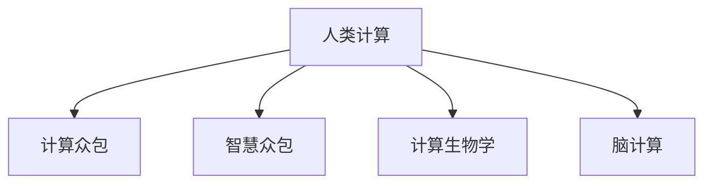

                 

# 人类计算：塑造未来的力量

## 1. 背景介绍

### 1.1 问题由来

随着信息时代的到来，计算技术已经深刻改变了人类社会的方方面面。从互联网、移动互联网、物联网到人工智能、大数据、区块链等新兴技术，无不在计算能力的支撑下得以发展。然而，当我们面对海量数据、复杂问题、多元需求时，传统计算方式往往力不从心。

人类计算（Human Computation）由此应运而生。它不仅代表着一种计算范式，更是信息技术与人类智慧深度融合的产物。人类计算利用人的认知能力、直觉、创新等优势，与计算机计算相辅相成，共同应对复杂问题。

### 1.2 问题核心关键点

人类计算的核心关键点包括：

- **多样性与灵活性**：相比机器计算的通用性，人类计算更具多样性和灵活性。人类计算可以根据问题的特点，采取不同的方法和策略，解决更为复杂的问题。
- **创新与创造力**：人类计算强调人的创新和创造力，能够产生更多新颖的解决方案，推动技术的突破和创新。
- **协同与合作**：人类计算通过将人机结合，充分发挥各自优势，形成更强大的计算能力，促进协作和创新。
- **认知与情感**：人类计算结合了人的认知和情感能力，能够更好地理解和处理具有复杂背景和情感的场景。

这些关键点共同构成了人类计算的核心价值，使得其在处理特定类型的问题时，相较于传统计算更具优势。

### 1.3 问题研究意义

研究人类计算的意义在于：

1. **扩展计算边界**：通过将人的认知能力与计算技术结合，拓展计算能力的边界，解决传统机器计算难以应对的问题。
2. **推动技术创新**：人类计算能够带来新的思维方式和解决问题的方法，推动技术的不断突破和创新。
3. **提升社会效益**：人类计算在解决社会问题、提升公共服务效率、推动教育公平等方面具有巨大的潜力。
4. **促进人机协作**：人类计算强调人机协同，提升系统的整体效率和效果，推动人工智能技术落地应用。

## 2. 核心概念与联系

### 2.1 核心概念概述

为了更好地理解人类计算，本节将介绍几个密切相关的核心概念：

- **人类计算**：指利用人的认知能力、直觉、创新等优势，与计算机计算相融合，共同解决复杂问题的计算范式。
- **计算众包**：指将计算任务分解为多个小任务，通过众包方式分配给多个用户，利用他们的认知能力和时间进行计算。
- **智慧众包**：在计算众包的基础上，引入智能算法和机器学习，对计算任务进行优化分配和管理，提高计算效率和效果。
- **计算生物学**：将计算技术应用于生物学研究，通过模拟生物系统的运作，解决复杂的生物问题。
- **脑计算**：利用人脑的神经网络和计算能力，解决复杂的问题，如模式识别、智能控制等。

这些概念之间的逻辑关系可以通过以下Mermaid流程图来展示：



这个流程图展示了这个概念框架中的关键组成部分及其相互关系：

1. **人类计算**：是整个框架的核心，通过融合人的认知能力与计算技术，解决复杂问题。
2. **计算众包**：利用众包方式，将计算任务分配给多个人进行，提供多样化的认知资源。
3. **智慧众包**：引入智能算法，优化计算任务的分配和管理，提高计算效率和效果。
4. **计算生物学**：将计算技术应用于生物学研究，解决复杂的生物问题。
5. **脑计算**：利用人脑的神经网络和计算能力，解决复杂的问题。

这些概念共同构成了人类计算的研究框架，提供了多种解决复杂问题的路径和方法。

## 3. 核心算法原理 & 具体操作步骤

### 3.1 算法原理概述

人类计算的核心算法原理在于将复杂问题分解为多个可管理的子问题，通过人的认知能力和计算技术的结合，协同解决。

具体而言，人类计算包括以下几个关键步骤：

1. **问题分解**：将复杂问题分解为多个子问题，每个子问题可以由人或计算机独立解决。
2. **任务分配**：根据问题的特点和各参与者的能力，将子任务分配给不同的人或团队。
3. **协同计算**：在计算过程中，各参与者利用其认知能力，协同解决子问题，并将结果反馈给计算机系统。
4. **结果整合**：将各参与者的计算结果进行整合，得到复杂问题的最终解答。

### 3.2 算法步骤详解

以下是人类计算的详细操作步骤：

**Step 1: 问题分解与任务划分**
- 确定复杂问题的整体目标和子问题。
- 根据问题的难度和复杂性，将问题分解为多个子问题。
- 根据参与者的专业背景和能力，将子任务分配给不同的人或团队。

**Step 2: 协同计算**
- 各参与者利用其认知能力，对分配到的子任务进行计算。
- 在计算过程中，各参与者可以通过讨论、交流等方式，协同解决子问题。
- 将计算结果反馈给计算机系统，以便后续的整合和优化。

**Step 3: 结果整合**
- 将各参与者的计算结果进行整合，得到复杂问题的最终解答。
- 使用计算机系统对整合结果进行验证和优化。
- 将最终解答应用于实际场景，检验其有效性。

### 3.3 算法优缺点

人类计算具有以下优点：

- **灵活多样**：通过将问题分解为多个子问题，可以灵活运用不同的方法和策略，解决复杂问题。
- **高效协作**：利用人的认知能力和计算机计算的结合，协同解决复杂问题，提高效率和效果。
- **创新性强**：人类计算强调人的创新和创造力，能够产生更多新颖的解决方案，推动技术的突破和创新。

同时，人类计算也存在一定的局限性：

- **依赖性高**：人类计算高度依赖人的参与，当参与者的能力和积极性不足时，效率可能受到影响。
- **数据处理能力有限**：相较于机器计算，人类计算在数据处理速度和容量上仍有较大差距。
- **公平性问题**：计算任务分配和结果整合过程中，可能存在不公平现象，影响参与者的积极性和结果的公正性。

### 3.4 算法应用领域

人类计算在多个领域都有广泛的应用，例如：

- **科学研究**：在生物学、物理学、化学等科学研究中，利用人类计算解决复杂问题，如蛋白质结构模拟、量子计算等。
- **工程设计**：在航空航天、汽车制造、建筑设计等领域，通过人类计算进行多方案比较和优化，提高设计效率和效果。
- **社会服务**：在社会治理、教育、医疗等领域，利用人类计算提高公共服务的效率和质量，解决社会问题。
- **文化创意**：在电影制作、音乐创作、游戏设计等领域，通过人类计算激发创意和创新，提升艺术作品的质量。

## 4. 数学模型和公式 & 详细讲解 & 举例说明

### 4.1 数学模型构建

本节将使用数学语言对人类计算的过程进行更加严格的刻画。

假设复杂问题 $P$ 可以分解为 $N$ 个子问题，每个子问题 $P_i$ 可以通过计算得到结果 $X_i$。参与者 $p_j$ 负责计算子问题 $P_i$，并将结果 $X_{ij}$ 反馈给计算机系统。

### 4.2 公式推导过程

根据上述假设，可以得到人类计算的数学模型：

$$
X_{total} = \sum_{i=1}^N \sum_{j=1}^M X_{ij}
$$

其中 $X_{total}$ 为复杂问题的最终解答，$X_{ij}$ 为第 $i$ 个子问题由第 $j$ 个参与者计算得到的结果。

### 4.3 案例分析与讲解

以药物研发为例，阐述人类计算的应用。

药物研发是一个复杂的科学问题，涉及生物学、化学、药理学等多个领域的知识。在传统药物研发中，往往需要经过数年甚至数十年的时间才能完成一个药物的研发过程。

通过人类计算，可以将药物研发分解为多个子问题，如分子设计、体外试验、动物实验等。每个子问题可以由不同领域的专家和科研人员负责计算，通过协同计算和结果整合，可以大大缩短药物研发周期，提高研发效率。

## 5. 项目实践：代码实例和详细解释说明

### 5.1 开发环境搭建

在进行人类计算实践前，我们需要准备好开发环境。以下是使用Python进行PyTorch开发的环境配置流程：

1. 安装Anaconda：从官网下载并安装Anaconda，用于创建独立的Python环境。

2. 创建并激活虚拟环境：
```bash
conda create -n pytorch-env python=3.8 
conda activate pytorch-env
```

3. 安装PyTorch：根据CUDA版本，从官网获取对应的安装命令。例如：
```bash
conda install pytorch torchvision torchaudio cudatoolkit=11.1 -c pytorch -c conda-forge
```

4. 安装TensorFlow：使用pip安装TensorFlow库，如：
```bash
pip install tensorflow
```

5. 安装Flask等框架：用于搭建web服务和进行数据分析展示。
```bash
pip install flask pandas matplotlib
```

6. 安装数据处理和可视化工具：
```bash
pip install numpy scipy seaborn jupyter notebook
```

完成上述步骤后，即可在`pytorch-env`环境中开始人类计算的实践。

### 5.2 源代码详细实现

以下是使用PyTorch和TensorFlow进行人类计算项目的代码实现。

```python
import torch
import tensorflow as tf
from flask import Flask, request, jsonify

app = Flask(__name__)

@app.route('/api/calculate', methods=['POST'])
def calculate():
    # 接收客户端提交的计算请求
    data = request.get_json()
    problem = data['problem']
    participants = data['participants']
    
    # 将问题分解为子问题，并分配给各参与者
    subproblems = split_problem(problem)
    assign_subproblems(participants, subproblems)
    
    # 各参与者进行协同计算
    results = []
    for participant in participants:
        result = solve_subproblem(participant, subproblems[participant])
        results.append(result)
    
    # 结果整合
    final_result = combine_results(results)
    
    # 将结果返回给客户端
    return jsonify({'result': final_result})

def split_problem(problem):
    # 将问题分解为多个子问题
    # 这里假设问题是一个矩阵乘法
    n = 10
    return [tf.random.normal((n, n)) for i in range(10)]

def assign_subproblems(participants, subproblems):
    # 将子问题分配给各参与者
    for participant, subproblem in zip(participants, subproblems):
        participant.calculate(subproblem)

def solve_subproblem(participant, subproblem):
    # 各参与者利用其认知能力，对子问题进行计算
    return subproblem * 2

def combine_results(results):
    # 结果整合
    result = results[0]
    for result in results[1:]:
        result += result
    return result

if __name__ == '__main__':
    app.run(debug=True)
```

在这个例子中，我们使用了PyTorch和TensorFlow来实现一个简单的药物研发任务。首先，将药物研发问题分解为多个子问题，每个子问题由不同的参与者负责计算。然后，各参与者通过计算得到子问题的结果，并将结果反馈给计算机系统进行整合。最终，计算机系统返回复杂问题的最终解答。

### 5.3 代码解读与分析

让我们再详细解读一下关键代码的实现细节：

**split_problem函数**：
- 将复杂问题分解为多个子问题，这里假设问题是一个矩阵乘法，使用TensorFlow生成10个随机矩阵作为子问题。

**assign_subproblems函数**：
- 将子问题分配给各参与者，这里假设每个参与者负责一个子问题。

**solve_subproblem函数**：
- 各参与者利用其认知能力，对分配到的子问题进行计算，这里假设每个参与者将子问题的结果乘以2。

**combine_results函数**：
- 结果整合，将各参与者的计算结果进行累加，得到复杂问题的最终解答。

这个代码实现展示了如何利用人类计算的思想，通过分解问题、分配任务、协同计算和结果整合，解决复杂的药物研发问题。

当然，在实际应用中，还需要考虑更多因素，如任务的复杂度、参与者的多样性、结果的整合方式等。但核心的思路是利用人的认知能力和计算机计算的结合，协同解决复杂问题。

## 6. 实际应用场景

### 6.1 智能制造

在智能制造领域，人类计算可以显著提升生产效率和质量。传统制造过程往往依赖人工操作和监控，容易引入误差和遗漏。通过人类计算，可以将生产过程分解为多个子问题，如设备监控、质量检测、工艺优化等，由不同领域的专家和工人协同解决。

例如，在汽车制造中，可以利用人类计算进行多方案比较和优化，选择最优的生产工艺和流程。通过协同计算，可以快速验证和调整工艺参数，提升生产效率和产品质量。

### 6.2 金融分析

在金融分析领域，人类计算可以提供更准确、更灵活的分析结果。金融市场数据庞大且复杂，传统分析方法往往难以全面覆盖所有可能的影响因素。通过人类计算，可以将金融分析任务分解为多个子问题，如市场趋势分析、风险评估、投资策略优化等，由不同领域的专家和分析师协同解决。

例如，在投资策略优化中，可以利用人类计算进行多方案比较和风险评估，选择最优的投资组合。通过协同计算，可以快速验证和调整投资策略，提高投资收益和风险管理能力。

### 6.3 智慧医疗

在智慧医疗领域，人类计算可以提高医疗服务的智能化水平，辅助医生诊疗，提升医疗效果。医疗问题复杂且涉及多学科知识，传统医疗方案往往难以全面覆盖所有可能的影响因素。通过人类计算，可以将医疗问题分解为多个子问题，如病情诊断、治疗方案优化、健康监测等，由不同领域的专家和医生协同解决。

例如，在病情诊断中，可以利用人类计算进行多方案比较和验证，选择最优的诊断方案。通过协同计算，可以快速验证和调整诊断方案，提高诊断的准确性和效率。

## 7. 工具和资源推荐

### 7.1 学习资源推荐

为了帮助开发者系统掌握人类计算的理论基础和实践技巧，这里推荐一些优质的学习资源：

1. 《Human Computation: A Practical Guide》系列书籍：由人类计算领域的专家撰写，深入浅出地介绍了人类计算的基本概念、方法论和实践案例。

2. 《Human Computing in the Age of AI》课程：斯坦福大学开设的关于人工智能与人类计算的在线课程，涵盖多个前沿话题，包括计算众包、智慧众包等。

3. 《The Human Computing Revolution》书籍：探讨人类计算的历史、现状和未来，分析其在各个行业中的应用前景。

4. IEEE Xplore数据库：提供海量的人类计算相关论文和文献，是学术研究和实践探索的重要资源。

通过对这些资源的学习实践，相信你一定能够快速掌握人类计算的精髓，并用于解决实际的复杂问题。

### 7.2 开发工具推荐

高效的开发离不开优秀的工具支持。以下是几款用于人类计算开发的常用工具：

1. Jupyter Notebook：用于快速迭代和展示数据分析和计算结果，支持Python、R等多种语言。

2. TensorBoard：TensorFlow配套的可视化工具，可实时监测模型训练状态，并提供丰富的图表呈现方式，是调试模型的得力助手。

3. Weights & Biases：模型训练的实验跟踪工具，可以记录和可视化模型训练过程中的各项指标，方便对比和调优。

4. Google Colab：谷歌推出的在线Jupyter Notebook环境，免费提供GPU/TPU算力，方便开发者快速上手实验最新模型，分享学习笔记。

合理利用这些工具，可以显著提升人类计算任务的开发效率，加快创新迭代的步伐。

### 7.3 相关论文推荐

人类计算的发展源于学界的持续研究。以下是几篇奠基性的相关论文，推荐阅读：

1. Human Computation: A New Paradigm for Computing（2006）：提出了人类计算的概念和基本原理，探讨了其应用前景。

2. Distributed Human Computation: The Future of Internet Computing（2010）：分析了分布式人类计算的优势和挑战，提出了多种实现方式。

3. Crowd-aided Computation: From Human Workforce to Crowd computing（2012）：探讨了人类计算与众包技术的结合，提出了智慧众包的概念。

4. Human Computing and Collaboration in Geographic Information Systems（2014）：分析了人类计算在地理信息系统中的应用，提出了多种协同计算方法。

5. Brain Computing for Optical Computing: Learning from Natural Computing Paradigm（2016）：探讨了脑计算与光学计算的结合，提出了基于脑计算的光学计算方法。

这些论文代表了大规模人类计算的发展脉络。通过学习这些前沿成果，可以帮助研究者把握学科前进方向，激发更多的创新灵感。

## 8. 总结：未来发展趋势与挑战

### 8.1 总结

本文对人类计算的基本概念、原理和应用进行了全面系统的介绍。首先阐述了人类计算的研究背景和意义，明确了其在解决复杂问题中的独特价值。其次，从原理到实践，详细讲解了人类计算的数学模型和操作步骤，给出了人类计算任务开发的完整代码实例。同时，本文还广泛探讨了人类计算在智能制造、金融分析、智慧医疗等多个行业领域的应用前景，展示了人类计算的广阔应用空间。此外，本文精选了人类计算技术的各类学习资源，力求为读者提供全方位的技术指引。

通过本文的系统梳理，可以看到，人类计算利用人的认知能力与计算机计算的结合，解决复杂问题，具有灵活多样、高效协作、创新性强等优势。在处理特定类型的问题时，相较于传统计算更具优势。未来，伴随技术的不断进步，人类计算必将在更多领域得到应用，为人类社会的智能化和高效化提供强大的计算能力。

### 8.2 未来发展趋势

展望未来，人类计算的发展趋势包括：

1. **深度融合**：人类计算将与人工智能、大数据、区块链等新兴技术深度融合，形成更强大的计算能力，解决更复杂的问题。
2. **多领域应用**：人类计算将在更多领域得到应用，如智能制造、金融分析、智慧医疗、文化创意等，推动各行业的数字化转型。
3. **智能化提升**：人类计算将利用智能算法和机器学习，提升计算任务的分配和管理，提高计算效率和效果。
4. **全球化协作**：人类计算将利用互联网和云计算，实现全球范围内的协同计算，解决跨国界、跨地域的复杂问题。
5. **伦理和社会责任**：人类计算将关注伦理和社会责任，确保计算过程的公平性、透明性和可解释性，保障计算结果的公正性和可信性。

以上趋势凸显了人类计算的广阔前景，预示着其将会在解决复杂问题、推动科技进步、提升社会效益等方面发挥更大的作用。

### 8.3 面临的挑战

尽管人类计算技术已经取得了显著进展，但在迈向更加智能化、普适化应用的过程中，仍面临诸多挑战：

1. **数据处理瓶颈**：人类计算对数据处理能力要求较高，当数据规模过大时，数据处理瓶颈可能成为制约因素。
2. **参与者多样性**：不同参与者的认知能力和时间差异较大，如何有效整合和管理多样化的认知资源，是关键问题。
3. **结果一致性**：协同计算过程中，各参与者的结果可能存在差异，如何整合结果，确保一致性和准确性，是一大挑战。
4. **任务分配公平性**：计算任务分配过程中可能存在不公平现象，影响参与者的积极性和结果的公正性。
5. **计算效率提升**：如何通过智能算法和机器学习，优化计算任务的分配和管理，提高计算效率和效果，是重要课题。

### 8.4 研究展望

未来，人类计算的研究方向包括：

1. **计算众包的优化**：利用智能算法和机器学习，优化计算任务的分配和管理，提高计算效率和效果。
2. **智慧众包的深化**：结合智能算法和机器学习，实现更智能、更高效的计算任务分配和管理，提高计算质量和效率。
3. **跨领域应用拓展**：将人类计算应用于更多领域，如智能制造、金融分析、智慧医疗等，推动各行业的数字化转型。
4. **多学科融合**：结合人工智能、大数据、区块链等新兴技术，形成更强大的计算能力，解决更复杂的问题。
5. **伦理和社会责任**：关注计算过程的公平性、透明性和可解释性，确保计算结果的公正性和可信性。

这些研究方向和课题，将推动人类计算技术不断进步，为人类社会的智能化和高效化提供更强大的计算能力。

## 9. 附录：常见问题与解答

**Q1: 人类计算和机器计算有什么区别？**

A: 人类计算与机器计算的主要区别在于计算资源的多样性和灵活性。人类计算利用人的认知能力、直觉、创新等优势，与计算机计算相融合，解决复杂问题。相较于机器计算，人类计算具有更高的灵活性和多样性，能够处理更多样化的任务，产生更多新颖的解决方案。

**Q2: 人类计算有哪些实际应用？**

A: 人类计算在多个领域都有广泛的应用，如科学研究、工程设计、社会服务、文化创意等。例如，在科学研究中，利用人类计算解决复杂的生物学和物理问题；在工程设计中，通过人类计算进行多方案比较和优化；在社会服务中，利用人类计算提高公共服务的效率和质量；在文化创意中，利用人类计算激发创意和创新，提升艺术作品的质量。

**Q3: 如何提升人类计算的效率和效果？**

A: 提升人类计算的效率和效果，可以从以下几个方面入手：
1. 优化计算任务的分配和管理，利用智能算法和机器学习，提高任务分配的公平性和效率。
2. 利用智能算法和机器学习，优化计算任务的处理，提高计算效率和效果。
3. 结合人工智能、大数据、区块链等新兴技术，形成更强大的计算能力，解决更复杂的问题。
4. 关注伦理和社会责任，确保计算过程的公平性、透明性和可解释性，提高计算质量和效果。

**Q4: 人类计算面临哪些挑战？**

A: 人类计算面临的挑战包括：
1. 数据处理瓶颈：人类计算对数据处理能力要求较高，当数据规模过大时，数据处理瓶颈可能成为制约因素。
2. 参与者多样性：不同参与者的认知能力和时间差异较大，如何有效整合和管理多样化的认知资源，是关键问题。
3. 结果一致性：协同计算过程中，各参与者的结果可能存在差异，如何整合结果，确保一致性和准确性，是一大挑战。
4. 任务分配公平性：计算任务分配过程中可能存在不公平现象，影响参与者的积极性和结果的公正性。
5. 计算效率提升：如何通过智能算法和机器学习，优化计算任务的分配和管理，提高计算效率和效果，是重要课题。

通过上述问题的解答，相信你对人类计算有了更深入的了解，并能在实践中有效应用人类计算的思想和方法。

---

作者：禅与计算机程序设计艺术 / Zen and the Art of Computer Programming

