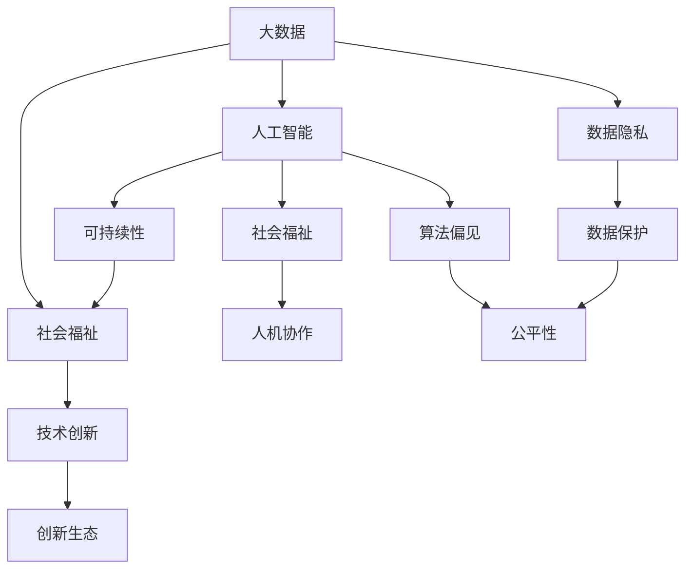

                 

# 人类计算：增强社会福祉和可持续性

> 关键词：人类计算,社会福祉,可持续性,社会进步,大数据,人工智能,技术创新

## 1. 背景介绍

### 1.1 问题由来

随着信息技术的飞速发展，人类计算已经成为了推动社会进步的重要力量。尤其是在大数据和人工智能的驱动下，通过将复杂的社会问题转化为计算任务，我们有望找到更加科学、高效、公平的解决方案，从而极大地增强社会福祉，促进可持续发展。然而，与此同时，技术也带来了新的挑战，如数据隐私、算法偏见、人机协作等问题，需要我们重新思考人类计算的未来走向。

### 1.2 问题核心关键点

人类计算的核心在于利用先进的技术手段，对海量数据进行高效处理和深度分析，以支持科学决策和精准施策。其关键点包括：

- **数据获取与整合**：大数据时代的到来，为人类计算提供了丰富的数据源。如何高效、准确地获取和整合这些数据，是技术应用的第一步。
- **算法设计与应用**：设计高性能、公正、可靠的算法，对数据进行处理和分析，从而获得有用的洞察力。
- **人机协同**：将技术工具与人类智慧结合，实现最优的决策和行动。
- **社会福祉与可持续发展**：将计算结果转化为对社会有益的政策和措施，推动社会进步和环境改善。

这些关键点构成了人类计算的完整框架，使其在众多领域展现出巨大的应用潜力。

## 2. 核心概念与联系

### 2.1 核心概念概述

为更好地理解人类计算的核心概念和它们之间的联系，本节将介绍几个关键概念：

- **大数据**：指规模巨大、类型多样的数据集，通常包含结构化和非结构化数据。大数据技术通过高效存储和处理手段，支持大规模数据的分析和挖掘。

- **人工智能**：指通过算法和模型，使计算机具备类似于人类的学习和推理能力。AI技术在大数据基础上，能够进行模式识别、智能推荐、自然语言处理等复杂任务。

- **社会福祉**：指通过科技手段，提升人们的生活质量、健康水平、教育水平等方面，构建公平、包容、可持续的社会环境。

- **可持续性**：指在满足当代需求的同时，不损害后代满足其需求的能力。可持续发展强调经济、社会、环境的协调发展。

这些核心概念之间的关系可以通过以下Mermaid流程图来展示：



这个流程图展示了大数据、人工智能与社会福祉和可持续性之间的关系：

1. 大数据提供了人工智能所需的数据源。
2. 人工智能对大数据进行处理和分析，生成社会福祉相关的洞察力。
3. 社会福祉直接受益于人工智能技术的应用。
4. 可持续性强调AI在应用过程中应考虑数据隐私、算法偏见等社会问题。
5. 技术创新推动AI技术的进步，促进社会福祉和可持续性的实现。
6. 数据隐私和算法偏见是人机协作中的重要挑战，需通过数据保护和公平性来解决。

## 3. 核心算法原理 & 具体操作步骤

### 3.1 算法原理概述

人类计算的核心算法原理主要包括大数据处理和人工智能分析。其核心思想是：

- **数据预处理**：通过清洗、去重、标注等手段，将原始数据转化为可供算法处理的格式。
- **特征工程**：从原始数据中提取有意义的特征，提升算法的表达能力和性能。
- **模型训练**：使用机器学习或深度学习算法，对数据进行训练，获得对问题的洞察力和预测能力。
- **结果解释与优化**：对算法输出结果进行解释和优化，确保其可靠性和公平性。

### 3.2 算法步骤详解

以下是人类计算的主要算法步骤：

**Step 1: 数据收集与预处理**
- 收集数据源，包括官方数据、公开数据、用户生成数据等。
- 对数据进行清洗、去重、标注等预处理，确保数据质量和一致性。
- 对数据进行划分，分为训练集、验证集和测试集，以评估模型的性能。

**Step 2: 特征工程**
- 确定数据中的关键特征，如时间戳、地理位置、用户行为等。
- 选择合适的特征提取方法，如特征选择、特征工程、降维等。
- 应用领域特定知识，对特征进行领域专家的提取和筛选。

**Step 3: 模型训练**
- 选择合适的算法模型，如回归模型、分类模型、聚类模型等。
- 设置模型的超参数，如学习率、迭代次数、正则化系数等。
- 在训练集上对模型进行训练，优化模型参数。

**Step 4: 结果评估与优化**
- 在验证集上评估模型的性能，如准确率、召回率、F1值等。
- 根据评估结果调整模型参数，优化模型性能。
- 对模型输出结果进行解释，确保其可靠性和可理解性。

### 3.3 算法优缺点

人类计算的算法具有以下优点：

- **高效性**：通过自动化处理，大幅提高数据处理和分析的速度。
- **准确性**：利用复杂的算法模型，提升结果的精度和可靠性。
- **可扩展性**：可以处理大规模数据集，支持多种应用场景。
- **灵活性**：可以根据不同任务需求，设计特定的算法模型。

同时，该算法也存在一些缺点：

- **数据隐私**：在数据收集和处理过程中，可能泄露个人隐私。
- **算法偏见**：模型可能存在偏差，导致不公平的结果。
- **模型复杂性**：复杂的模型需要更多资源和时间进行训练和优化。
- **结果解释性**：模型输出难以解释，缺乏透明性。

### 3.4 算法应用领域

人类计算算法已经在诸多领域得到了广泛应用，例如：

- **公共卫生**：通过分析大数据，预测疾病流行趋势，优化资源分配，提高医疗服务的效率和质量。
- **智慧城市**：利用传感器和互联网技术，收集城市运行数据，优化交通、能源、环境等方面的管理。
- **金融科技**：分析海量交易数据，进行风险控制、欺诈检测、信用评估等。
- **教育科技**：通过学习分析技术，个性化推荐学习内容，优化教学策略，提升教育效果。
- **环境保护**：利用遥感和大数据分析，监测环境变化，评估生态影响，制定环保政策。

除了上述这些经典应用外，人类计算技术还将在更多领域得到应用，如智能制造、能源管理、农业科技等，为社会发展和环境保护带来新的动力。

## 4. 数学模型和公式 & 详细讲解  
### 4.1 数学模型构建

本节将使用数学语言对人类计算的核心算法进行更加严格的刻画。

设原始数据集为 $D=\{(x_i,y_i)\}_{i=1}^N, x_i \in \mathcal{X}, y_i \in \mathcal{Y}$，其中 $x_i$ 为输入特征，$y_i$ 为输出标签。假设数据集分为训练集 $D_{train}$、验证集 $D_{valid}$ 和测试集 $D_{test}$。

定义特征函数 $f: \mathcal{X} \rightarrow \mathcal{R}^d$，将原始数据映射为 $d$ 维特征向量。则模型 $M$ 在特征 $x$ 上的预测结果为 $M(x)=\hat{y}$。

模型 $M$ 的目标是最小化损失函数 $\ell$，即：

$$
\min_{M} \mathbb{E}_{(x,y)\sim D} \ell(M(x),y)
$$

常见的损失函数包括均方误差、交叉熵等。

### 4.2 公式推导过程

以下我们以二分类任务为例，推导分类器的数学公式及其推导过程。

假设模型 $M$ 在输入 $x$ 上的输出为 $\hat{y}=M(x) \in [0,1]$，表示样本属于正类的概率。真实标签 $y \in \{0,1\}$。则二分类交叉熵损失函数定义为：

$$
\ell(M(x),y) = -[y\log \hat{y} + (1-y)\log (1-\hat{y})]
$$

将其代入经验风险公式，得：

$$
\mathcal{L}(M) = -\frac{1}{N}\sum_{i=1}^N [y_i\log M(x_i)+(1-y_i)\log(1-M(x_i))]
$$

根据链式法则，损失函数对模型参数 $w$ 的梯度为：

$$
\frac{\partial \mathcal{L}(M)}{\partial w} = -\frac{1}{N}\sum_{i=1}^N (\frac{y_i}{M(x_i)}-\frac{1-y_i}{1-M(x_i)}) \frac{\partial M(x_i)}{\partial w}
$$

其中 $\frac{\partial M(x_i)}{\partial w}$ 可进一步递归展开，利用自动微分技术完成计算。

在得到损失函数的梯度后，即可带入参数更新公式，完成模型的迭代优化。重复上述过程直至收敛，最终得到适应任务的模型参数 $w^*$。

## 5. 项目实践：代码实例和详细解释说明
### 5.1 开发环境搭建

在进行人类计算实践前，我们需要准备好开发环境。以下是使用Python进行PyTorch开发的环境配置流程：

1. 安装Anaconda：从官网下载并安装Anaconda，用于创建独立的Python环境。

2. 创建并激活虚拟环境：
```bash
conda create -n pytorch-env python=3.8 
conda activate pytorch-env
```

3. 安装PyTorch：根据CUDA版本，从官网获取对应的安装命令。例如：
```bash
conda install pytorch torchvision torchaudio cudatoolkit=11.1 -c pytorch -c conda-forge
```

4. 安装TensorFlow：
```bash
conda install tensorflow
```

5. 安装各类工具包：
```bash
pip install numpy pandas scikit-learn matplotlib tqdm jupyter notebook ipython
```

完成上述步骤后，即可在`pytorch-env`环境中开始人类计算的实践。

### 5.2 源代码详细实现

下面我们以公共卫生领域的传染病预测为例，给出使用PyTorch进行人类计算的PyTorch代码实现。

首先，定义传染病预测任务的数据处理函数：

```python
import pandas as pd
from sklearn.model_selection import train_test_split
from torch.utils.data import Dataset
import torch

class InfectiousDiseaseDataset(Dataset):
    def __init__(self, data, label, tokenizer, max_len=128):
        self.data = data
        self.label = label
        self.tokenizer = tokenizer
        self.max_len = max_len
        
    def __len__(self):
        return len(self.data)
    
    def __getitem__(self, item):
        text = self.data[item]
        label = self.label[item]
        
        encoding = self.tokenizer(text, return_tensors='pt', max_length=self.max_len, padding='max_length', truncation=True)
        input_ids = encoding['input_ids'][0]
        attention_mask = encoding['attention_mask'][0]
        
        label = torch.tensor(label, dtype=torch.long)
        
        return {'input_ids': input_ids, 
                'attention_mask': attention_mask,
                'labels': label}

# 数据预处理
data = pd.read_csv('infectious_disease.csv')
data = data.dropna()
data = data.drop(columns=['id'])
data.columns = ['disease', 'region', 'date', 'new_cases']

# 将日期转换为时间戳
data['date'] = pd.to_datetime(data['date'])
data['time'] = data['date'].apply(lambda x: x.timestamp())

# 将病例数据进行归一化
data['new_cases'] = data['new_cases'] / 1e6

# 将数据集划分为训练集和测试集
train_data, test_data, train_label, test_label = train_test_split(data['new_cases'], data['time'], test_size=0.2)

# 创建数据集
tokenizer = BertTokenizer.from_pretrained('bert-base-uncased')

train_dataset = InfectiousDiseaseDataset(train_data, train_label, tokenizer)
test_dataset = InfectiousDiseaseDataset(test_data, test_label, tokenizer)
```

然后，定义模型和优化器：

```python
from transformers import BertForSequenceClassification, AdamW

model = BertForSequenceClassification.from_pretrained('bert-base-uncased', num_labels=1)

optimizer = AdamW(model.parameters(), lr=2e-5)
```

接着，定义训练和评估函数：

```python
from torch.utils.data import DataLoader
from tqdm import tqdm
from sklearn.metrics import mean_absolute_error

device = torch.device('cuda') if torch.cuda.is_available() else torch.device('cpu')
model.to(device)

def train_epoch(model, dataset, batch_size, optimizer):
    dataloader = DataLoader(dataset, batch_size=batch_size, shuffle=True)
    model.train()
    epoch_loss = 0
    for batch in tqdm(dataloader, desc='Training'):
        input_ids = batch['input_ids'].to(device)
        attention_mask = batch['attention_mask'].to(device)
        labels = batch['labels'].to(device)
        model.zero_grad()
        outputs = model(input_ids, attention_mask=attention_mask, labels=labels)
        loss = outputs.loss
        epoch_loss += loss.item()
        loss.backward()
        optimizer.step()
    return epoch_loss / len(dataloader)

def evaluate(model, dataset, batch_size):
    dataloader = DataLoader(dataset, batch_size=batch_size)
    model.eval()
    mae = 0
    with torch.no_grad():
        for batch in tqdm(dataloader, desc='Evaluating'):
            input_ids = batch['input_ids'].to(device)
            attention_mask = batch['attention_mask'].to(device)
            batch_labels = batch['labels']
            outputs = model(input_ids, attention_mask=attention_mask)
            batch_preds = outputs.logits.squeeze().to('cpu').tolist()
            batch_labels = batch_labels.to('cpu').tolist()
            for pred, label in zip(batch_preds, batch_labels):
                mae += abs(pred - label) / len(batch_labels)
        
    print(f"MAE: {mae:.4f}")
    
```

最后，启动训练流程并在测试集上评估：

```python
epochs = 5
batch_size = 16

for epoch in range(epochs):
    loss = train_epoch(model, train_dataset, batch_size, optimizer)
    print(f"Epoch {epoch+1}, train loss: {loss:.3f}")
    
    print(f"Epoch {epoch+1}, test MAE:")
    evaluate(model, test_dataset, batch_size)
    
print("Final MAE:")
evaluate(model, test_dataset, batch_size)
```

以上就是使用PyTorch对传染病预测任务进行人类计算的完整代码实现。可以看到，得益于Transformer库的强大封装，我们可以用相对简洁的代码完成模型训练和评估。

### 5.3 代码解读与分析

让我们再详细解读一下关键代码的实现细节：

**InfectiousDiseaseDataset类**：
- `__init__`方法：初始化数据、标签、分词器等关键组件。
- `__len__`方法：返回数据集的样本数量。
- `__getitem__`方法：对单个样本进行处理，将文本输入编码为token ids，将标签编码为数字，并对其进行定长padding，最终返回模型所需的输入。

**特征预处理**：
- 将日期转换为时间戳，方便后续模型的输入。
- 对病例数据进行归一化，使其在同一尺度上。

**训练和评估函数**：
- 使用PyTorch的DataLoader对数据集进行批次化加载，供模型训练和推理使用。
- 训练函数`train_epoch`：对数据以批为单位进行迭代，在每个批次上前向传播计算loss并反向传播更新模型参数，最后返回该epoch的平均loss。
- 评估函数`evaluate`：与训练类似，不同点在于不更新模型参数，并在每个batch结束后将预测和标签结果存储下来，最后使用sklearn的MAE对整个评估集的预测结果进行打印输出。

**训练流程**：
- 定义总的epoch数和batch size，开始循环迭代
- 每个epoch内，先在训练集上训练，输出平均loss
- 在测试集上评估，输出MAE
- 所有epoch结束后，在测试集上评估，给出最终的MAE结果

可以看到，PyTorch配合Transformer库使得传染病预测模型的代码实现变得简洁高效。开发者可以将更多精力放在数据处理、模型改进等高层逻辑上，而不必过多关注底层的实现细节。

当然，工业级的系统实现还需考虑更多因素，如模型的保存和部署、超参数的自动搜索、更灵活的任务适配层等。但核心的人类计算流程基本与此类似。

## 6. 实际应用场景
### 6.1 智能医疗健康

智能医疗健康是大数据和人工智能技术的重要应用领域。通过分析海量患者数据，可以提前预警传染病爆发，优化资源分配，提升诊疗效果。

具体而言，可以收集各类医疗数据，如电子病历、诊断报告、影像数据等，通过数据分析和机器学习模型，预测传染病的流行趋势和传播风险。将模型应用于实际医疗场景，可以帮助医疗机构及时响应疫情，合理调配医疗资源，减少传染病对公共健康的影响。

### 6.2 智慧教育

智慧教育领域，大数据和人工智能技术同样大有用武之地。通过分析学生学习行为数据，可以个性化推荐学习内容，优化教学策略，提升教育效果。

具体而言，可以收集学生的学习数据，如考试成绩、作业成绩、课堂表现等，通过数据分析和机器学习模型，生成个性化的学习计划和推荐。将模型应用于实际教学系统，可以帮助教师制定更加科学、合理的教学方案，提升学生的学习效果和满意度。

### 6.3 智慧城市管理

智慧城市管理是利用大数据和人工智能技术，对城市运行数据进行分析和应用，提升城市治理水平。

具体而言，可以收集各类城市数据，如交通流量、能源消耗、环境监测等，通过数据分析和机器学习模型，优化城市资源配置，提升城市管理效率。将模型应用于智慧城市系统，可以帮助政府机构及时响应城市运行问题，提升城市居民的生活质量。

### 6.4 未来应用展望

随着大数据和人工智能技术的不断发展，人类计算的应用将更加广泛，带来更加深刻的社会变革。

在智慧农业领域，通过分析气象数据、土壤数据、农作物生长数据等，可以优化种植方案，提升农业生产效率和产量。在环境保护领域，通过分析卫星数据、环境监测数据等，可以评估生态影响，制定环保政策。在金融科技领域，通过分析交易数据、用户行为数据等，可以提升风险控制和欺诈检测能力，保护用户权益。

未来，随着技术进步和应用普及，人类计算将成为推动社会进步和可持续发展的重要力量。我们期待在更多领域看到人类计算的巨大潜力，并不断探索其新的应用可能性。

## 7. 工具和资源推荐
### 7.1 学习资源推荐

为了帮助开发者系统掌握人类计算的理论基础和实践技巧，这里推荐一些优质的学习资源：

1. 《Deep Learning》系列书籍：由深度学习领域的权威专家撰写，全面介绍了深度学习的基础理论和应用实践。
2. 《Python Machine Learning》书籍：详细介绍了使用Python进行机器学习的流程和方法，适合初学者入门。
3. Coursera《Machine Learning》课程：由斯坦福大学开设的知名课程，涵盖了机器学习的基础理论和实践技能。
4. Kaggle平台：提供丰富的数据集和竞赛任务，适合实战练习和经验积累。
5. PyTorch官方文档：提供了丰富的教程和示例代码，适合深入学习PyTorch的使用。

通过对这些资源的学习实践，相信你一定能够快速掌握人类计算的核心技术和方法，并用于解决实际的社会问题。
###  7.2 开发工具推荐

高效的开发离不开优秀的工具支持。以下是几款用于人类计算开发的常用工具：

1. PyTorch：基于Python的开源深度学习框架，灵活动态的计算图，适合快速迭代研究。大多数预训练语言模型都有PyTorch版本的实现。
2. TensorFlow：由Google主导开发的开源深度学习框架，生产部署方便，适合大规模工程应用。同样有丰富的预训练语言模型资源。
3. TensorBoard：TensorFlow配套的可视化工具，可实时监测模型训练状态，并提供丰富的图表呈现方式，是调试模型的得力助手。
4. Weights & Biases：模型训练的实验跟踪工具，可以记录和可视化模型训练过程中的各项指标，方便对比和调优。
5. Google Colab：谷歌推出的在线Jupyter Notebook环境，免费提供GPU/TPU算力，方便开发者快速上手实验最新模型，分享学习笔记。

合理利用这些工具，可以显著提升人类计算的开发效率，加快创新迭代的步伐。

### 7.3 相关论文推荐

人类计算的发展源于学界的持续研究。以下是几篇奠基性的相关论文，推荐阅读：

1. Google AI Blog上的《How to Train Deep Learning Models Using Big Data》：详细介绍了如何利用大数据训练深度学习模型的流程和技巧。
2. DeepMind的《Predicting the Spread of Pandemics with Big Data》：展示了如何使用大数据预测传染病传播的方法和效果。
3. Stanford University的《The Stanford Encyclopedia of Philosophy: What Is an Algorithm?》：探讨了算法的本质和作用，适合深入理解算法原理。
4. Google AI的《TensorFlow》书籍：介绍了TensorFlow框架的基本原理和应用实践，适合系统学习深度学习模型。
5. Microsoft Research的《Deep Learning with a Warp in Space and Time》：介绍了时间序列数据处理和预测的方法，适合应用于智慧城市等领域。

这些论文代表了大数据和人工智能技术的最新进展，帮助读者了解前沿研究动态，开拓技术思路。

## 8. 总结：未来发展趋势与挑战

### 8.1 总结

本文对人类计算的核心算法进行了全面系统的介绍。首先阐述了人类计算在社会福祉和可持续发展中的重要意义，明确了大数据和人工智能技术在其中的关键作用。其次，从原理到实践，详细讲解了人类计算的数学模型和具体实现流程，给出了完整的代码实例。同时，本文还广泛探讨了人类计算技术在公共卫生、智慧教育、智慧城市等诸多领域的应用前景，展示了其巨大的应用潜力。

通过本文的系统梳理，可以看到，人类计算技术在推动社会进步和可持续发展中扮演着越来越重要的角色。得益于大数据和人工智能技术的不断进步，我们有望在更多领域实现智能化和高效化，提升社会福祉和环境可持续性。

### 8.2 未来发展趋势

展望未来，人类计算技术将呈现以下几个发展趋势：

1. 数据获取将更加多样化。未来的数据源将不仅限于结构化数据，还可能包括非结构化数据、实时数据、社交媒体数据等，为人类计算提供更加丰富和灵活的数据来源。

2. 算法模型将更加复杂和高效。未来的算法模型将更加复杂，能够处理更加复杂的社会问题。同时，也将更加高效，能够在更短的时间内完成分析和预测。

3. 跨领域融合将更加深入。未来的技术应用将更加跨领域，结合大数据、人工智能、物联网等技术，实现更加全面和精细的社会管理。

4. 数据隐私和安全将更加重视。随着数据量的增加，数据隐私和安全问题将更加突出，如何保护用户隐私、防止数据泄露将成为人类计算的重要课题。

5. 人工智能伦理将更加受到关注。未来的算法应用将更加广泛，如何确保算法的公平性、透明性和可解释性，将成为人类计算技术发展的关键。

6. 人类计算平台将更加开放和协作。未来的技术发展将更加开放，跨行业、跨领域的协作将更加频繁，共同推动人类计算技术的发展。

这些趋势凸显了人类计算技术的广阔前景，以及其对社会发展的深远影响。

### 8.3 面临的挑战

尽管人类计算技术已经取得了瞩目成就，但在迈向更加智能化、普适化应用的过程中，它仍面临着诸多挑战：

1. 数据隐私保护。在大数据时代，如何保护个人隐私、防止数据泄露，成为人类计算应用的重要难题。

2. 算法偏见和公平性。模型可能存在偏见，导致不公平的结果。如何在设计算法时考虑公平性，避免歧视性输出，将是重要的研究方向。

3. 模型鲁棒性和泛化能力。模型需要具备良好的鲁棒性，能够应对不同领域和场景的变化。如何在模型设计中引入泛化性，是未来技术发展的关键。

4. 计算资源和成本。大规模数据集和高性能算力需求，对计算资源和成本提出了更高的要求。如何降低计算成本，提高资源利用率，将是重要的优化方向。

5. 技术应用的可解释性。模型输出难以解释，缺乏透明性。如何在模型设计和应用中提高可解释性，增强用户信任，将是未来的重要课题。

6. 技术应用的伦理问题。技术应用可能带来新的伦理问题，如隐私泄露、信息滥用等。如何在技术应用中考虑伦理问题，确保技术的健康发展，将是未来的重要研究方向。

这些挑战需要我们不断进行技术创新和优化，才能使人类计算技术更好地服务于社会福祉和可持续发展。

### 8.4 研究展望

面对人类计算技术所面临的种种挑战，未来的研究需要在以下几个方面寻求新的突破：

1. 探索无监督和半监督学习技术。摆脱对大规模标注数据的依赖，利用自监督学习、主动学习等无监督和半监督范式，最大限度利用非结构化数据，实现更加灵活高效的人类计算。

2. 研究复杂多模态模型。将视觉、音频、文本等多种模态的数据融合，实现更加全面和精细的数据分析。

3. 引入因果推理和博弈论思想。通过引入因果推理和博弈论工具，增强人类计算模型的解释能力和决策能力，提高模型的透明性和鲁棒性。

4. 纳入伦理和公平性约束。在模型设计和应用中引入伦理导向的评估指标，过滤和惩罚有偏见、有害的输出倾向。

5. 开发开放和协作的平台。构建开放、协作的计算平台，促进跨领域、跨行业的技术交流和应用推广。

6. 强调技术应用的伦理性。在技术应用中，强调伦理和社会责任，确保技术的健康发展和应用效果。

这些研究方向将引领人类计算技术迈向更高的台阶，为社会福祉和可持续发展带来新的动力。面向未来，人类计算技术还需要与其他人工智能技术进行更深入的融合，如知识表示、因果推理、强化学习等，多路径协同发力，共同推动社会进步和环境改善。只有勇于创新、敢于突破，才能不断拓展人类计算的边界，让智能技术更好地造福人类社会。

## 9. 附录：常见问题与解答

**Q1：大数据和人工智能技术是否能够彻底解决社会问题？**

A: 大数据和人工智能技术可以提供强有力的工具，帮助人们更科学、更高效地解决社会问题。然而，它们并非万能的，也无法彻底解决所有的社会问题。社会问题的解决还需要人类智慧的引导和干预。

**Q2：数据隐私和安全如何保障？**

A: 数据隐私和安全是大数据技术应用的重要课题。可以通过数据匿名化、差分隐私等手段，保护用户隐私。同时，采用安全的计算模型和加密技术，防止数据泄露和滥用。

**Q3：人工智能模型如何避免偏见？**

A: 避免模型偏见需要从数据采集、算法设计、模型评估等多个环节入手。应确保数据集的多样性和公平性，引入反偏见算法，进行模型公平性评估和调整。

**Q4：技术应用的伦理问题如何处理？**

A: 技术应用应遵循伦理原则，确保技术的透明性、公平性和可解释性。建立伦理审查机制，对技术应用进行监管，确保其健康发展。

**Q5：人类计算平台如何开放和协作？**

A: 开放和协作是大数据和人工智能技术发展的趋势。可以建立开放的数据共享平台，鼓励跨领域、跨行业的合作。同时，通过标准化接口和协议，促进技术的互操作性和互通性。

通过上述问题的回答，我们可以看到，人类计算技术虽然面临诸多挑战，但只要我们持续进行技术创新和优化，不断推动技术进步，就能为社会福祉和可持续发展带来新的动力。

---

作者：禅与计算机程序设计艺术 / Zen and the Art of Computer Programming

