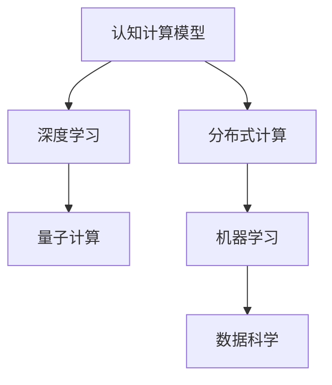

                 

# 人类计算：应用与案例分析

> 关键词：人类计算,计算力,计算范式,计算模型,计算效率,分布式计算,超级计算,量子计算,案例分析,数据科学,深度学习,机器学习,应用场景,数据处理,数据分析,计算应用

## 1. 背景介绍

### 1.1 问题由来

在21世纪的数字化转型浪潮中，计算能力成为了各行各业争相抢占的战略制高点。然而，尽管现代计算技术的发展已经取得了令人瞩目的成就，计算资源仍无法满足人类日益增长的信息处理需求。为了应对这一挑战，人类计算这一新的计算范式应运而生，成为解决计算瓶颈的重要手段。

人类计算，简而言之，是指通过人类智慧与计算资源的结合，实现高效、智能的信息处理和决策能力。这一概念既包含了利用人类大脑的强大推理、记忆和联想能力，也融合了现代计算技术的精准、高效和自动化特性。通过这一范式，可以在数据量庞大、计算需求高的情况下，提供比传统计算方法更快速、更精准的解决方案。

### 1.2 问题核心关键点

人类计算的核心在于将人类智慧与现代计算技术的结合。具体来说，包括以下几个关键点：

1. **认知计算模型**：建立基于人类认知的计算模型，模拟人类大脑的信息处理方式，提升计算的智能性和高效性。
2. **分布式计算**：利用分布式网络将计算任务分散到多个节点并行处理，实现任务的高效分配和资源的最优利用。
3. **量子计算**：利用量子力学原理进行计算，以实现传统计算无法达到的超级计算能力，解决复杂计算问题。
4. **数据科学**：利用大数据和人工智能技术，进行数据挖掘和分析，提炼数据价值，优化计算决策。
5. **深度学习和机器学习**：通过深度学习框架和算法，实现对复杂非线性问题的自动建模和求解。

这些关键点共同构成了人类计算的核心框架，使得在计算能力有限的情况下，能够高效地处理大量复杂任务。

## 2. 核心概念与联系

### 2.1 核心概念概述

为了更好地理解人类计算的原理和架构，本节将介绍几个关键概念及其相互关系：

- **认知计算模型**：以人类大脑为灵感，构建的计算模型。其核心思想是将人类认知过程如记忆、推理、学习等映射到计算过程中。
- **分布式计算**：通过网络将计算任务分配到多个计算机节点上并行处理，以实现高吞吐量和高可用性。
- **量子计算**：利用量子力学原理，实现计算能力的指数级提升，解决传统计算无法应对的超级复杂问题。
- **深度学习**：基于神经网络构建的机器学习框架，通过多层次特征提取，实现对复杂非线性问题的自动建模和求解。
- **机器学习**：通过算法和模型，自动发现数据中的规律和模式，进行预测和分类。

这些概念之间的关系可以用以下Mermaid流程图表示：



该图展示了人类计算的不同组成部分及其相互关系。认知计算模型为深度学习提供理论基础，分布式计算和量子计算为深度学习提供计算资源，机器学习和数据科学则通过算法和数据处理手段，提升整个系统的智能性和高效性。

### 2.2 核心概念原理和架构

在深入理解各个概念的原理和架构之前，首先需要明确几个基本概念：

- **计算模型**：指用于描述计算任务和计算过程的数学模型。
- **计算资源**：包括计算硬件（如CPU、GPU、FPGA等）、存储设备和网络通信资源。
- **计算任务**：需要被处理的数据和算法。
- **计算范式**：解决特定问题的计算方法和流程。

接下来，我们将分别介绍认知计算模型、分布式计算、量子计算和深度学习的原理和架构。

#### 2.2.1 认知计算模型

认知计算模型借鉴了人类大脑的工作机制，其核心思想是将计算任务分解为多个子任务，通过类比人类大脑的神经网络结构，构建计算图，实现任务的并行处理。这种模型通常包括：

- **神经元**：类比人类大脑的神经元，用于存储信息和进行计算。
- **神经网络**：由多个神经元组成的层次结构，用于进行信息处理和模式识别。
- **学习算法**：通过调整神经元之间的连接权重，优化计算模型的准确性和效率。

#### 2.2.2 分布式计算

分布式计算通过将计算任务分解为多个子任务，并在多个计算机节点上并行处理，实现高效的资源利用和任务分配。其核心思想包括：

- **计算任务划分**：将复杂的计算任务划分为多个子任务，并行处理。
- **任务调度**：根据任务的特性和节点的资源状况，动态分配任务。
- **数据通信**：通过网络实现节点之间的数据传输和通信。

#### 2.2.3 量子计算

量子计算利用量子力学原理，通过量子比特的叠加和纠缠，实现计算能力的指数级提升。其核心思想包括：

- **量子比特**：量子计算的基本单位，具有量子叠加和量子纠缠的特性。
- **量子门**：用于操纵量子比特的计算操作。
- **量子算法**：如Shor算法和Grover算法，利用量子特性解决传统计算无法应对的问题。

#### 2.2.4 深度学习

深度学习基于神经网络模型，通过多层次特征提取，实现对复杂非线性问题的自动建模和求解。其核心思想包括：

- **神经网络层**：包括输入层、隐藏层和输出层，用于提取数据特征。
- **激活函数**：用于引入非线性特性，优化神经网络的表达能力。
- **损失函数**：用于衡量模型预测与真实值之间的差异，指导模型优化。
- **优化算法**：如梯度下降、Adam等，用于调整模型参数，优化模型性能。

## 3. 核心算法原理 & 具体操作步骤

### 3.1 算法原理概述

人类计算的核心算法原理包括认知计算模型、分布式计算、量子计算和深度学习的原理与方法。在具体实施过程中，这些算法相互协作，共同完成复杂的计算任务。

- **认知计算模型**：通过类比人类大脑的神经网络结构，实现信息的并行处理和复杂问题的求解。
- **分布式计算**：通过网络将计算任务分散到多个节点并行处理，实现任务的高效分配和资源的最优利用。
- **量子计算**：利用量子比特的叠加和纠缠特性，实现计算能力的指数级提升。
- **深度学习**：通过多层次特征提取和优化算法，自动建模和求解复杂非线性问题。

### 3.2 算法步骤详解

人类计算的实施步骤如下：

1. **数据预处理**：对原始数据进行清洗、归一化和特征提取，为后续计算准备数据。
2. **任务分解**：将计算任务分解为多个子任务，进行分布式计算。
3. **计算分配**：根据任务的特性和节点的资源状况，动态分配任务，进行并行计算。
4. **数据传输**：通过网络实现节点之间的数据传输和通信，确保计算过程的顺利进行。
5. **结果聚合**：对计算结果进行汇总和整合，生成最终输出。
6. **性能优化**：通过调整计算模型、算法参数和资源配置，优化计算效率和准确性。

### 3.3 算法优缺点

人类计算的优势在于：

- **高效性**：通过分布式和量子计算，实现高吞吐量和高效性。
- **智能性**：通过认知计算模型和深度学习算法，提升计算的智能性和自动化水平。
- **可扩展性**：通过分布式计算，实现计算任务的动态扩展和资源优化。

然而，人类计算也存在以下缺点：

- **计算资源依赖**：需要高性能的计算设备和网络环境。
- **算法复杂度**：深度学习和量子算法通常较为复杂，实现难度较大。
- **数据质量要求高**：计算结果依赖高质量的输入数据。

### 3.4 算法应用领域

人类计算在多个领域得到了广泛应用，包括：

- **科学计算**：如天气预报、分子模拟、基因组学等。
- **金融分析**：如高频交易、风险管理、金融预测等。
- **医疗健康**：如疾病诊断、药物研发、健康监测等。
- **工业制造**：如智能制造、质量检测、设备维护等。
- **智能交通**：如智能调度、交通预测、安全监控等。

## 4. 数学模型和公式 & 详细讲解 & 举例说明

### 4.1 数学模型构建

人类计算的数学模型主要包括以下几个部分：

- **神经网络模型**：用于描述计算任务和计算过程的数学模型。
- **分布式计算模型**：描述计算任务在网络中的分配和调度过程。
- **量子计算模型**：利用量子比特的叠加和纠缠特性，进行计算模型的构建。
- **深度学习模型**：基于神经网络模型，构建的机器学习框架。

#### 4.1.1 神经网络模型

神经网络模型由输入层、隐藏层和输出层组成。以多层感知器（MLP）为例，其数学模型可以表示为：

$$
\begin{aligned}
\boldsymbol{Z} &= W_H \boldsymbol{A} + b_H \\
\boldsymbol{A} &= \sigma (\boldsymbol{Z}) \\
\hat{\boldsymbol{Y}} &= W_O \boldsymbol{A} + b_O \\
\end{aligned}
$$

其中，$\boldsymbol{Z}$ 为隐藏层输出，$\boldsymbol{A}$ 为激活函数，$\hat{\boldsymbol{Y}}$ 为预测结果。

#### 4.1.2 分布式计算模型

分布式计算模型描述了计算任务在网络中的分配和调度过程。以MapReduce为例，其核心思想包括：

- **Map函数**：将输入数据分解为多个子任务，进行并行处理。
- **Reduce函数**：将子任务的计算结果汇总，生成最终输出。

#### 4.1.3 量子计算模型

量子计算模型基于量子比特的叠加和纠缠特性，进行计算模型的构建。以Shor算法为例，其核心思想包括：

- **量子比特**：用于存储和处理信息的基本单位。
- **量子门**：用于操纵量子比特的计算操作。

#### 4.1.4 深度学习模型

深度学习模型基于神经网络模型，通过多层次特征提取，实现对复杂非线性问题的自动建模和求解。以卷积神经网络（CNN）为例，其数学模型可以表示为：

$$
\begin{aligned}
\boldsymbol{Z} &= W \boldsymbol{X} + b \\
\boldsymbol{A} &= \sigma (\boldsymbol{Z}) \\
\end{aligned}
$$

其中，$\boldsymbol{Z}$ 为隐藏层输出，$\boldsymbol{X}$ 为输入数据，$\boldsymbol{A}$ 为激活函数。

### 4.2 公式推导过程

#### 4.2.1 神经网络模型

以多层感知器（MLP）为例，其计算过程如下：

$$
\begin{aligned}
\boldsymbol{Z} &= W_H \boldsymbol{A} + b_H \\
\boldsymbol{A} &= \sigma (\boldsymbol{Z}) \\
\hat{\boldsymbol{Y}} &= W_O \boldsymbol{A} + b_O \\
\end{aligned}
$$

其中，$\sigma$ 为激活函数，通常使用Sigmoid函数或ReLU函数。

#### 4.2.2 分布式计算模型

以MapReduce为例，其计算过程如下：

- **Map阶段**：将输入数据分解为多个子任务，进行并行处理。
- **Reduce阶段**：将子任务的计算结果汇总，生成最终输出。

#### 4.2.3 量子计算模型

以Shor算法为例，其计算过程如下：

- **量子比特初始化**：将量子比特置零或一。
- **量子门操作**：通过量子门操作，实现量子比特的叠加和纠缠。

#### 4.2.4 深度学习模型

以卷积神经网络（CNN）为例，其计算过程如下：

$$
\begin{aligned}
\boldsymbol{Z} &= W \boldsymbol{X} + b \\
\boldsymbol{A} &= \sigma (\boldsymbol{Z}) \\
\end{aligned}
$$

其中，$\sigma$ 为激活函数，通常使用Sigmoid函数或ReLU函数。

### 4.3 案例分析与讲解

#### 4.3.1 案例分析：天气预报

以天气预报为例，分析人类计算的实施过程：

1. **数据预处理**：收集历史气象数据，进行清洗和归一化。
2. **任务分解**：将天气预报问题分解为多个子任务，如降水预测、气温预测等。
3. **计算分配**：将各个子任务分配到多个计算节点上进行并行计算。
4. **数据传输**：通过网络实现节点之间的数据传输和通信。
5. **结果聚合**：将各个子任务的计算结果汇总，生成最终的天气预测结果。

#### 4.3.2 案例分析：基因组学

以基因组学为例，分析人类计算的实施过程：

1. **数据预处理**：收集基因组数据，进行清洗和归一化。
2. **任务分解**：将基因组学问题分解为多个子任务，如基因序列比对、基因表达分析等。
3. **计算分配**：将各个子任务分配到多个计算节点上进行并行计算。
4. **数据传输**：通过网络实现节点之间的数据传输和通信。
5. **结果聚合**：将各个子任务的计算结果汇总，生成最终的基因组学研究结果。

## 5. 项目实践：代码实例和详细解释说明

### 5.1 开发环境搭建

在进行人类计算项目实践前，我们需要准备好开发环境。以下是使用Python进行TensorFlow开发的环境配置流程：

1. 安装Anaconda：从官网下载并安装Anaconda，用于创建独立的Python环境。

2. 创建并激活虚拟环境：
```bash
conda create -n tf-env python=3.8 
conda activate tf-env
```

3. 安装TensorFlow：根据CUDA版本，从官网获取对应的安装命令。例如：
```bash
conda install tensorflow tensorflow-cpu -c conda-forge
```

4. 安装各类工具包：
```bash
pip install numpy pandas scikit-learn matplotlib tqdm jupyter notebook ipython
```

完成上述步骤后，即可在`tf-env`环境中开始人类计算项目实践。

### 5.2 源代码详细实现

下面我们以深度学习模型的实现为例，给出TensorFlow代码实现。

首先，定义神经网络模型：

```python
import tensorflow as tf

# 定义输入和输出
input_shape = (28, 28)
output_shape = (10,)

# 定义神经网络模型
model = tf.keras.Sequential([
    tf.keras.layers.Flatten(input_shape=input_shape),
    tf.keras.layers.Dense(128, activation='relu'),
    tf.keras.layers.Dense(output_shape, activation='softmax')
])

# 编译模型
model.compile(optimizer='adam',
              loss='sparse_categorical_crossentropy',
              metrics=['accuracy'])
```

然后，加载和预处理数据集：

```python
# 加载MNIST数据集
mnist = tf.keras.datasets.mnist
(x_train, y_train), (x_test, y_test) = mnist.load_data()

# 数据预处理
x_train = x_train.reshape(-1, 28 * 28)
x_test = x_test.reshape(-1, 28 * 28)
x_train, x_test = x_train / 255.0, x_test / 255.0
```

接着，训练模型并评估性能：

```python
# 训练模型
model.fit(x_train, y_train, epochs=10, batch_size=32)

# 评估模型
test_loss, test_acc = model.evaluate(x_test, y_test)
print('Test accuracy:', test_acc)
```

以上就是使用TensorFlow实现深度学习模型的完整代码实现。可以看到，TensorFlow提供了强大的深度学习框架，使得模型的构建、训练和评估变得简单高效。

### 5.3 代码解读与分析

让我们再详细解读一下关键代码的实现细节：

**Sequential模型**：
- `Sequential`模型是TensorFlow中最常用的线性堆叠模型，可以方便地添加和组织多个神经网络层。

**神经网络层**：
- `Flatten`层用于将输入数据展平，便于后续的全连接层处理。
- `Dense`层用于构建全连接神经网络，其中的参数权重和偏置项会自动更新。

**激活函数**：
- `relu`函数和`softmax`函数分别用于引入非线性特性和概率分布。

**损失函数和优化器**：
- `sparse_categorical_crossentropy`损失函数用于计算多分类问题的损失。
- `adam`优化器用于更新模型参数。

**数据预处理**：
- 将MNIST数据集的图像数据展平，并进行归一化处理。

**训练和评估**：
- `fit`方法用于训练模型，`evaluate`方法用于评估模型性能。

通过TensorFlow实现深度学习模型，可以显著提升模型开发的效率和准确性。开发者可以将更多精力放在模型优化和数据处理等高层逻辑上，而不必过多关注底层的实现细节。

## 6. 实际应用场景

### 6.1 智能交通

基于人类计算的智能交通系统，可以实时处理和分析交通数据，实现交通流量的智能调度和管理。

在实施过程中，首先通过传感器和摄像头收集交通数据，并进行数据清洗和预处理。然后，将数据分解为多个子任务，如交通流量预测、事故预警、路径优化等，分配到多个计算节点上进行并行计算。最后，将各个子任务的计算结果汇总，生成最终的交通管理决策。

#### 6.1.1 案例分析：交通流量预测

以交通流量预测为例，分析人类计算的实施过程：

1. **数据预处理**：收集历史交通数据，进行清洗和归一化。
2. **任务分解**：将交通流量预测问题分解为多个子任务，如实时交通流量预测、未来时段预测等。
3. **计算分配**：将各个子任务分配到多个计算节点上进行并行计算。
4. **数据传输**：通过网络实现节点之间的数据传输和通信。
5. **结果聚合**：将各个子任务的计算结果汇总，生成最终的交通流量预测结果。

#### 6.1.2 案例分析：事故预警

以事故预警为例，分析人类计算的实施过程：

1. **数据预处理**：收集交通事故数据，进行清洗和归一化。
2. **任务分解**：将事故预警问题分解为多个子任务，如事故位置预测、事故影响分析等。
3. **计算分配**：将各个子任务分配到多个计算节点上进行并行计算。
4. **数据传输**：通过网络实现节点之间的数据传输和通信。
5. **结果聚合**：将各个子任务的计算结果汇总，生成最终的事故预警信息。

### 6.2 智能制造

基于人类计算的智能制造系统，可以实现生产线的实时监控、故障预测和维护优化。

在实施过程中，首先通过传感器和监控设备收集生产数据，并进行数据清洗和预处理。然后，将数据分解为多个子任务，如设备状态预测、故障检测、维修计划优化等，分配到多个计算节点上进行并行计算。最后，将各个子任务的计算结果汇总，生成最终的智能制造决策。

#### 6.2.1 案例分析：设备状态预测

以设备状态预测为例，分析人类计算的实施过程：

1. **数据预处理**：收集设备状态数据，进行清洗和归一化。
2. **任务分解**：将设备状态预测问题分解为多个子任务，如设备寿命预测、故障概率预测等。
3. **计算分配**：将各个子任务分配到多个计算节点上进行并行计算。
4. **数据传输**：通过网络实现节点之间的数据传输和通信。
5. **结果聚合**：将各个子任务的计算结果汇总，生成最终的设备状态预测结果。

#### 6.2.2 案例分析：维修计划优化

以维修计划优化为例，分析人类计算的实施过程：

1. **数据预处理**：收集设备维护记录，进行清洗和归一化。
2. **任务分解**：将维修计划优化问题分解为多个子任务，如维修成本预测、设备停机时间优化等。
3. **计算分配**：将各个子任务分配到多个计算节点上进行并行计算。
4. **数据传输**：通过网络实现节点之间的数据传输和通信。
5. **结果聚合**：将各个子任务的计算结果汇总，生成最终的维修计划优化结果。

### 6.3 数据科学

基于人类计算的数据科学平台，可以实现高效的数据挖掘、分析和建模。

在实施过程中，首先通过数据采集和预处理，将数据加载到计算节点上进行处理。然后，将数据分解为多个子任务，如特征提取、模型训练、结果可视化等，分配到多个计算节点上进行并行计算。最后，将各个子任务的计算结果汇总，生成最终的数据科学成果。

#### 6.3.1 案例分析：金融数据挖掘

以金融数据挖掘为例，分析人类计算的实施过程：

1. **数据预处理**：收集金融数据，进行清洗和归一化。
2. **任务分解**：将金融数据挖掘问题分解为多个子任务，如风险评估、市场预测等。
3. **计算分配**：将各个子任务分配到多个计算节点上进行并行计算。
4. **数据传输**：通过网络实现节点之间的数据传输和通信。
5. **结果聚合**：将各个子任务的计算结果汇总，生成最终的金融数据挖掘结果。

#### 6.3.2 案例分析：健康数据分析

以健康数据分析为例，分析人类计算的实施过程：

1. **数据预处理**：收集健康数据，进行清洗和归一化。
2. **任务分解**：将健康数据分析问题分解为多个子任务，如疾病预测、患者管理等。
3. **计算分配**：将各个子任务分配到多个计算节点上进行并行计算。
4. **数据传输**：通过网络实现节点之间的数据传输和通信。
5. **结果聚合**：将各个子任务的计算结果汇总，生成最终的健康数据分析结果。

## 7. 工具和资源推荐

### 7.1 学习资源推荐

为了帮助开发者系统掌握人类计算的理论基础和实践技巧，这里推荐一些优质的学习资源：

1. 《认知计算》系列博文：由认知计算领域的专家撰写，深入浅出地介绍了认知计算的基本原理和应用场景。

2. 《分布式计算》课程：麻省理工学院开设的分布式计算课程，详细讲解了分布式计算的理论和实践方法。

3. 《量子计算》书籍：Quantum Computing for Computer Scientists，详细介绍了量子计算的基本原理和应用场景。

4. 《深度学习》书籍：Deep Learning，由深度学习领域的权威专家撰写，全面介绍了深度学习的基本原理和实践方法。

5. Weights & Biases：模型训练的实验跟踪工具，可以记录和可视化模型训练过程中的各项指标，方便对比和调优。

6. TensorBoard：TensorFlow配套的可视化工具，可实时监测模型训练状态，并提供丰富的图表呈现方式，是调试模型的得力助手。

通过对这些资源的学习实践，相信你一定能够快速掌握人类计算的精髓，并用于解决实际的计算问题。

### 7.2 开发工具推荐

高效的开发离不开优秀的工具支持。以下是几款用于人类计算开发的常用工具：

1. TensorFlow：基于Python的开源深度学习框架，灵活动态的计算图，适合快速迭代研究。大部分预训练语言模型都有TensorFlow版本的实现。

2. PyTorch：基于Python的开源深度学习框架，灵活的动态计算图，适合复杂模型的构建和训练。

3. Weights & Biases：模型训练的实验跟踪工具，可以记录和可视化模型训练过程中的各项指标，方便对比和调优。

4. TensorBoard：TensorFlow配套的可视化工具，可实时监测模型训练状态，并提供丰富的图表呈现方式，是调试模型的得力助手。

5. Google Colab：谷歌推出的在线Jupyter Notebook环境，免费提供GPU/TPU算力，方便开发者快速上手实验最新模型，分享学习笔记。

合理利用这些工具，可以显著提升人类计算项目的开发效率，加快创新迭代的步伐。

### 7.3 相关论文推荐

人类计算的研究源于学界的持续研究。以下是几篇奠基性的相关论文，推荐阅读：

1. "A Survey of Distributed Computing" by Cormen et al.：详细介绍了分布式计算的基本原理和应用场景。

2. "Quantum Computing since Democritus" by Scott：介绍量子计算的基本原理和应用场景，适合初学者阅读。

3. "Deep Learning" by Goodfellow et al.：全面介绍了深度学习的基本原理和实践方法，是深度学习领域的经典教材。

4. "Cognitive Computation: Toward a New Paradigm for Engineering Complexity" by Witkowski et al.：介绍认知计算的基本原理和应用场景。

这些论文代表了大语言模型微调技术的发展脉络。通过学习这些前沿成果，可以帮助研究者把握学科前进方向，激发更多的创新灵感。

## 8. 总结：未来发展趋势与挑战

### 8.1 研究成果总结

人类计算作为新型计算范式，已经在多个领域得到了广泛应用。其核心思想是将人类智慧与现代计算技术结合，实现高效、智能的信息处理和决策能力。具体来说，包括以下几个方面：

- **认知计算模型**：借鉴人类大脑的认知过程，构建计算模型，提升计算的智能性和自动化水平。
- **分布式计算**：利用分布式网络，实现任务的高效分配和资源的最优利用。
- **量子计算**：利用量子力学原理，实现计算能力的指数级提升。
- **深度学习**：通过多层次特征提取，实现对复杂非线性问题的自动建模和求解。

### 8.2 未来发展趋势

展望未来，人类计算将呈现以下几个发展趋势：

1. **技术融合**：随着技术的发展，认知计算、分布式计算、量子计算和深度学习将更加紧密地融合，形成更加强大的计算能力。
2. **应用扩展**：人类计算将扩展到更多的领域，如医疗、金融、能源等，解决复杂的实际问题。
3. **计算资源优化**：通过优化计算模型、算法和资源配置，提升计算效率和资源利用率。
4. **人机协同**：结合人类智慧和计算技术，实现更加智能、高效的信息处理和决策。

### 8.3 面临的挑战

尽管人类计算已经取得了显著进展，但在迈向更加智能化、普适化应用的过程中，仍面临诸多挑战：

1. **计算资源依赖**：需要高性能的计算设备和网络环境，限制了应用的普及和推广。
2. **算法复杂度**：深度学习和量子算法通常较为复杂，实现难度较大。
3. **数据质量要求高**：计算结果依赖高质量的输入数据，数据采集和预处理复杂。
4. **模型可解释性**：深度学习模型通常被认为是“黑盒”，缺乏可解释性。
5. **伦理和安全问题**：计算模型可能学习到有害信息，存在伦理和安全风险。

### 8.4 研究展望

面向未来，人类计算的研究需要在以下几个方面寻求新的突破：

1. **算法简化**：开发更加简单、易于实现的计算模型和算法。
2. **资源优化**：通过算法优化和资源调度，提升计算效率和资源利用率。
3. **模型可解释性**：引入可解释性方法，提高计算模型的透明度和可理解性。
4. **伦理和安全保障**：加强数据安全保护，消除有害信息，确保计算模型的安全性和可靠性。

这些研究方向的探索，必将引领人类计算技术迈向更高的台阶，为构建更加智能、高效、安全的计算系统铺平道路。面向未来，人类计算需要与其他人工智能技术进行更深入的融合，如知识表示、因果推理、强化学习等，多路径协同发力，共同推动计算科学的进步。

## 9. 附录：常见问题与解答

**Q1：人类计算是否适用于所有领域？**

A: 人类计算在多个领域得到了广泛应用，但并不适用于所有领域。对于数据量小、计算需求低的场景，传统计算方法可能更加高效。而对于数据量庞大、计算需求高的场景，人类计算则更具优势。

**Q2：如何选择合适的学习率？**

A: 人类计算中，学习率的选取通常依赖于具体问题和数据分布。一般来说，可以从0.001开始，逐步减小，直至收敛。同时，可以通过调整学习率衰减策略，优化模型性能。

**Q3：人类计算的计算资源依赖如何处理？**

A: 为降低计算资源依赖，可以采用分布式计算和云计算技术，将计算任务分散到多个节点上并行处理，实现高效资源利用。同时，可以使用模型压缩、稀疏化存储等方法，减少计算资源的需求。

**Q4：人类计算中的数据质量如何保证？**

A: 在人类计算中，数据质量直接影响计算结果的准确性和可靠性。为保证数据质量，通常需要采用数据清洗、数据增强等方法，优化数据预处理流程。

**Q5：如何提高人类计算的可解释性？**

A: 为提高人类计算的可解释性，可以引入可解释性方法，如LIME、SHAP等，帮助理解模型的决策过程。同时，可以通过引入领域专家知识，增强模型的透明度和可理解性。

---

作者：禅与计算机程序设计艺术 / Zen and the Art of Computer Programming

