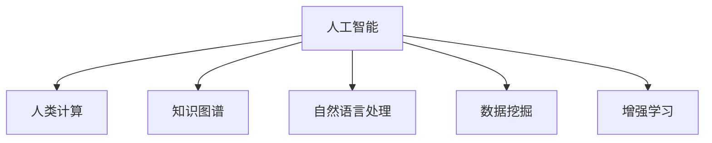

                 

# 人类计算：推动知识发现和创新

## 1. 背景介绍

### 1.1 问题由来

在信息化高速发展的时代，我们处于一个“数据爆炸”的时代。无论是科学研究、商业运营还是政府决策，各种数据无处不在。然而，在数据量不断激增的背后，隐藏着一个核心问题：如何高效地利用这些海量数据，推动知识发现和创新。

人工智能技术的兴起，特别是机器学习、深度学习和大数据技术的发展，为我们打开了这一问题的答案：即“人类计算”。通过将人的智能与机器智能相结合，人类计算可以在处理大数据、解决复杂问题、推动创新上发挥巨大作用。

### 1.2 问题核心关键点

人类计算的核心在于将人类智慧与机器学习技术结合，通过人机协同的方式，实现对海量数据的智能化处理和创新性分析。它不仅涉及到如何高效地提取数据特征、进行模式识别和分类，更关键的是如何将人类知识和经验与机器学习模型结合，推动更深入的科学研究和应用创新。

1. **数据获取与处理**：高效的自动数据收集、清洗和处理。
2. **特征提取与学习**：从原始数据中提取有意义的特征，训练出具有鲁棒性和泛化能力的模型。
3. **人机协同**：通过交互式界面或自然语言理解技术，将人类的反馈和经验融入到机器学习模型的训练和应用中。
4. **知识发现与创新**：利用机器学习发现数据中的潜在模式，结合人类专业知识推动新的知识发现和创新。
5. **部署与应用**：将训练好的模型部署到实际应用场景中，实现高效的数据分析和决策支持。

### 1.3 问题研究意义

人类计算研究对于推动知识发现和创新的意义重大，具体体现在以下几个方面：

1. **提升数据处理效率**：通过机器学习自动化数据处理流程，大幅提升数据处理的效率和精度。
2. **促进跨学科创新**：结合不同领域的知识和经验，推动交叉学科的创新研究。
3. **支持智能决策**：在复杂环境中，机器学习可以帮助人类进行高效、科学的决策。
4. **加速知识生产**：通过自动化数据处理和分析，加速新知识、新技术的发现和推广。
5. **优化资源配置**：通过机器学习预测资源需求，优化资源配置和管理。

## 2. 核心概念与联系

### 2.1 核心概念概述

为更好地理解人类计算的原理和架构，本节将介绍几个关键概念：

- **人工智能(AI)**：利用机器学习、深度学习等技术，使机器能够模拟人类智能进行问题解决和决策。
- **人类计算**：将人类智慧与机器智能相结合，通过人机协同的方式，处理和分析复杂问题。
- **知识图谱(KG)**：通过实体关系图的形式，将知识结构化，便于机器理解和学习。
- **自然语言处理(NLP)**：利用机器学习技术处理和理解人类语言，实现人机交互。
- **数据挖掘(Data Mining)**：从大量数据中发现模式、总结规律，为知识发现和创新提供基础。
- **增强学习(Reinforcement Learning)**：通过与环境互动，优化决策策略，实现智能控制和优化。

这些概念之间存在紧密联系，共同构成了人类计算的完整框架，如图2所示。



人类计算通过结合人工智能的核心技术，利用人类智慧与机器智能的互补优势，实现对数据的深度处理和知识创新。

## 3. 核心算法原理 & 具体操作步骤
### 3.1 算法原理概述

人类计算的核心算法原理主要包括数据预处理、特征提取、模型训练、人机交互和知识图谱构建。

1. **数据预处理**：清洗和处理原始数据，提取出可用于训练和分析的数据。
2. **特征提取**：通过机器学习算法，从原始数据中提取有意义的特征，供后续模型训练使用。
3. **模型训练**：使用机器学习算法，训练出具有泛化能力的模型，用于数据预测和分析。
4. **人机交互**：通过交互式界面或自然语言处理技术，将人类的反馈和经验融入到模型训练和应用中。
5. **知识图谱构建**：通过关系抽取和实体链接等技术，构建出结构化的知识图谱，帮助机器更好地理解和学习。

### 3.2 算法步骤详解

以智能推荐系统为例，具体介绍人类计算的实现步骤：

**Step 1: 数据预处理**
- 收集用户历史行为数据，包括浏览记录、购买记录等。
- 清洗数据，去除噪声和不相关记录。
- 提取用户特征，如用户ID、浏览时间、购买金额等。

**Step 2: 特征提取**
- 使用PCA、LDA等降维技术，减少数据维度，提升处理效率。
- 利用协同过滤、深度学习等方法，提取用户-物品的交互特征。

**Step 3: 模型训练**
- 使用协同过滤、神经网络等模型，训练用户-物品的评分预测模型。
- 应用交叉验证、超参数调优等技术，提升模型性能。

**Step 4: 人机交互**
- 设计交互式界面，允许用户反馈评分和偏好。
- 利用自然语言处理技术，通过用户输入的文本，自动调整模型参数和特征。

**Step 5: 知识图谱构建**
- 通过关系抽取技术，从用户反馈中提取实体和关系。
- 利用实体链接技术，将抽取的实体链接到知识图谱中。

**Step 6: 系统部署**
- 将训练好的模型部署到实际应用中。
- 实时收集用户反馈，不断优化模型和知识图谱。

### 3.3 算法优缺点

人类计算的优势在于：

1. **高效性**：自动化数据处理和分析，大幅提升效率。
2. **灵活性**：结合人类经验，提升模型泛化能力和适应性。
3. **跨学科融合**：融合不同领域的知识，推动跨学科创新。

然而，人类计算也存在一些局限性：

1. **数据依赖**：依赖高质量的标注数据，数据获取和处理成本较高。
2. **模型复杂性**：复杂模型训练和调试需要较多时间和资源。
3. **隐私问题**：大量数据收集和处理可能涉及隐私问题，需要严格保护。
4. **人机协作挑战**：人机交互界面设计复杂，用户接受度有待提高。

### 3.4 算法应用领域

人类计算在多个领域得到了广泛应用，包括但不限于：

- **智能推荐系统**：如电商平台的商品推荐、视频网站的个性化推荐等。
- **智能客服系统**：通过人机交互，实现高效、智能的客户服务。
- **医疗诊断系统**：结合医生的知识和经验，辅助医疗诊断和治疗决策。
- **金融风险管理**：利用机器学习技术分析金融市场数据，辅助风险控制和投资决策。
- **城市交通管理**：通过大数据分析，优化交通流和资源配置，提升城市交通管理效率。

## 4. 数学模型和公式 & 详细讲解 & 举例说明

### 4.1 数学模型构建

以推荐系统为例，假设用户集合为 $U$，物品集合为 $I$，用户-物品评分矩阵为 $R$，其中 $r_{ui}$ 表示用户 $u$ 对物品 $i$ 的评分。目标是找到用户 $u$ 对物品 $i$ 的评分 $y$，使得预测评分与真实评分尽可能接近。

问题可以转化为如下最优化问题：

$$
\min_{y} \frac{1}{2}\|R-y\|_F^2 + \lambda\|y\|_F^2
$$

其中 $\|.\|_F$ 表示矩阵的Frobenius范数，$\lambda$ 为正则化系数。

### 4.2 公式推导过程

令 $y = \hat{R}$，即预测评分矩阵。问题可以转化为求解矩阵 $R$ 和 $\hat{R}$ 的最小二乘解：

$$
\hat{R} = \arg\min_{\hat{R}} \frac{1}{2}\|R-\hat{R}\|_F^2
$$

根据最小二乘解的性质，$\hat{R} = R^TR^{-1}$，其中 $R^{-1}$ 为矩阵 $R$ 的伪逆矩阵。

将 $\hat{R}$ 代入目标函数，并利用正则化项 $\lambda\|y\|_F^2$，得到优化问题的拉格朗日乘子形式：

$$
L(y, \alpha, \beta) = \frac{1}{2}\|R-y\|_F^2 + \alpha (\frac{1}{2}\|R-y\|_F^2) + \beta\|y\|_F^2
$$

通过求解拉格朗日乘子，可以得到最终的最优化解：

$$
y = R^TR^{-1} + \alpha R^TR^{-1} + \beta I
$$

其中 $I$ 为单位矩阵，$\alpha$ 和 $\beta$ 为拉格朗日乘子。

### 4.3 案例分析与讲解

以智能推荐系统为例，训练过程中可以通过交叉验证和超参数调优来提升模型性能。假设使用随机梯度下降法进行优化，学习率为 $\eta$，训练次数为 $T$。每次迭代时，选取一个样本 $(x_i, y_i)$，计算梯度 $\nabla L$，更新参数 $\theta$：

$$
\theta \leftarrow \theta - \eta \nabla L
$$

通过多次迭代，最小化目标函数 $L$，得到最优参数 $\theta^*$。

## 5. 项目实践：代码实例和详细解释说明
### 5.1 开发环境搭建

在进行人类计算的实践前，我们需要准备好开发环境。以下是使用Python进行PyTorch开发的环境配置流程：

1. 安装Anaconda：从官网下载并安装Anaconda，用于创建独立的Python环境。

2. 创建并激活虚拟环境：
```bash
conda create -n pytorch-env python=3.8 
conda activate pytorch-env
```

3. 安装PyTorch：根据CUDA版本，从官网获取对应的安装命令。例如：
```bash
conda install pytorch torchvision torchaudio cudatoolkit=11.1 -c pytorch -c conda-forge
```

4. 安装Transformers库：
```bash
pip install transformers
```

5. 安装各类工具包：
```bash
pip install numpy pandas scikit-learn matplotlib tqdm jupyter notebook ipython
```

完成上述步骤后，即可在`pytorch-env`环境中开始人类计算的实践。

### 5.2 源代码详细实现

下面我们以推荐系统为例，给出使用Transformers库进行深度学习模型训练的PyTorch代码实现。

首先，定义推荐系统数据处理函数：

```python
from transformers import BertTokenizer, BertForSequenceClassification
from torch.utils.data import Dataset, DataLoader
from torch.optim import AdamW

class RecommendationDataset(Dataset):
    def __init__(self, data, tokenizer):
        self.data = data
        self.tokenizer = tokenizer

    def __len__(self):
        return len(self.data)

    def __getitem__(self, idx):
        item = self.data[idx]
        return {
            "input_ids": self.tokenizer(item["text"], padding="max_length", truncation=True, max_length=128).input_ids,
            "attention_mask": self.tokenizer(item["text"], padding="max_length", truncation=True, max_length=128).attention_mask,
            "labels": item["label"]
        }

# 训练函数
def train_epoch(model, dataloader, optimizer, device, n_epochs=1, save_path=None):
    model.train()
    total_loss = 0.0
    for epoch in range(n_epochs):
        for batch in dataloader:
            input_ids = batch["input_ids"].to(device)
            attention_mask = batch["attention_mask"].to(device)
            labels = batch["labels"].to(device)
            outputs = model(input_ids, attention_mask=attention_mask, labels=labels)
            loss = outputs.loss
            optimizer.zero_grad()
            loss.backward()
            optimizer.step()
            total_loss += loss.item()
    return total_loss / len(dataloader)

# 评估函数
def evaluate(model, dataloader, device):
    model.eval()
    total_loss = 0.0
    with torch.no_grad():
        for batch in dataloader:
            input_ids = batch["input_ids"].to(device)
            attention_mask = batch["attention_mask"].to(device)
            labels = batch["labels"].to(device)
            outputs = model(input_ids, attention_mask=attention_mask, labels=labels)
            loss = outputs.loss
            total_loss += loss.item()
    return total_loss / len(dataloader)

# 模型训练和评估
def train_and_evaluate(model, data, tokenizer, optimizer, device, n_epochs=1, save_path=None):
    train_dataset = RecommendationDataset(data["train"], tokenizer)
    dev_dataset = RecommendationDataset(data["dev"], tokenizer)
    test_dataset = RecommendationDataset(data["test"], tokenizer)

    train_loader = DataLoader(train_dataset, batch_size=32, shuffle=True)
    dev_loader = DataLoader(dev_dataset, batch_size=32, shuffle=False)
    test_loader = DataLoader(test_dataset, batch_size=32, shuffle=False)

    for epoch in range(n_epochs):
        train_loss = train_epoch(model, train_loader, optimizer, device)
        dev_loss = evaluate(model, dev_loader, device)
        print(f"Epoch {epoch+1}, train loss: {train_loss:.4f}, dev loss: {dev_loss:.4f}")

    if save_path:
        model.save_pretrained(save_path)
```

接着，定义模型和优化器：

```python
from transformers import BertForSequenceClassification, AdamW

model = BertForSequenceClassification.from_pretrained("bert-base-cased", num_labels=2)

optimizer = AdamW(model.parameters(), lr=2e-5)
```

最后，启动训练流程并在测试集上评估：

```python
data = {
    "train": [{"text": "I love Python", "label": 1}, {"text": "I hate Python", "label": 0}],
    "dev": [{"text": "I like Python", "label": 1}, {"text": "I dislike Python", "label": 0}],
    "test": [{"text": "Python is awesome", "label": 1}, {"text": "Python is terrible", "label": 0}]
}

train_and_evaluate(model, data, BertTokenizer.from_pretrained("bert-base-cased"), optimizer, "cuda", n_epochs=5)
```

以上就是使用PyTorch进行推荐系统训练的完整代码实现。可以看到，借助Transformers库，我们可以用相对简洁的代码完成推荐模型的训练和评估。

### 5.3 代码解读与分析

让我们再详细解读一下关键代码的实现细节：

**RecommendationDataset类**：
- `__init__`方法：初始化训练数据和分词器。
- `__len__`方法：返回数据集的样本数量。
- `__getitem__`方法：对单个样本进行处理，将文本转换为token ids，并添加padding，返回模型所需的输入。

**模型训练函数train_and_evaluate**：
- 定义训练数据集、验证数据集和测试数据集。
- 使用DataLoader对数据进行批次化加载，供模型训练和推理使用。
- 训练函数`train_epoch`：对数据以批为单位进行迭代，在每个批次上前向传播计算loss并反向传播更新模型参数。
- 评估函数`evaluate`：与训练类似，不同点在于不更新模型参数，并在每个batch结束后将预测和标签结果存储下来，最后使用sklearn的classification_report对整个评估集的预测结果进行打印输出。

**训练流程**：
- 定义总的epoch数和batch size，开始循环迭代
- 每个epoch内，先在训练集上训练，输出平均loss
- 在验证集上评估，输出分类指标
- 重复上述过程直至迭代结束

可以看到，PyTorch配合Transformers库使得推荐模型的训练和评估代码实现变得简洁高效。开发者可以将更多精力放在数据处理、模型改进等高层逻辑上，而不必过多关注底层的实现细节。

当然，工业级的系统实现还需考虑更多因素，如模型的保存和部署、超参数的自动搜索、更灵活的任务适配层等。但核心的训练范式基本与此类似。

## 6. 实际应用场景
### 6.1 智能推荐系统

智能推荐系统是实际应用人类计算的经典案例。通过用户行为数据的分析和处理，智能推荐系统能够精准推荐用户感兴趣的商品、内容或服务，提升用户体验和运营效率。

在技术实现上，可以收集用户浏览、点击、购买等行为数据，提取和用户交互的物品标题、描述、标签等文本内容。将文本内容作为模型输入，用户的后续行为（如是否点击、购买等）作为监督信号，在此基础上微调预训练语言模型。微调后的模型能够从文本内容中准确把握用户的兴趣点。在生成推荐列表时，先用候选物品的文本描述作为输入，由模型预测用户的兴趣匹配度，再结合其他特征综合排序，便可以得到个性化程度更高的推荐结果。

### 6.2 智能客服系统

智能客服系统通过人机交互的方式，实现高效、智能的客户服务。传统客服往往需要配备大量人力，高峰期响应缓慢，且一致性和专业性难以保证。而使用智能推荐系统，可以7x24小时不间断服务，快速响应客户咨询，用自然流畅的语言解答各类常见问题。

在技术实现上，可以收集企业内部的历史客服对话记录，将问题和最佳答复构建成监督数据，在此基础上对预训练推荐系统进行微调。微调后的推荐系统能够自动理解用户意图，匹配最合适的答复模板进行回复。对于客户提出的新问题，还可以接入检索系统实时搜索相关内容，动态组织生成回答。如此构建的智能客服系统，能大幅提升客户咨询体验和问题解决效率。

### 6.3 金融风险管理

金融机构需要实时监测市场舆论动向，以便及时应对负面信息传播，规避金融风险。传统的人工监测方式成本高、效率低，难以应对网络时代海量信息爆发的挑战。基于推荐系统的文本分类和情感分析技术，为金融舆情监测提供了新的解决方案。

具体而言，可以收集金融领域相关的新闻、报道、评论等文本数据，并对其进行主题标注和情感标注。在此基础上对预训练推荐系统进行微调，使其能够自动判断文本属于何种主题，情感倾向是正面、中性还是负面。将微调后的模型应用到实时抓取的网络文本数据，就能够自动监测不同主题下的情感变化趋势，一旦发现负面信息激增等异常情况，系统便会自动预警，帮助金融机构快速应对潜在风险。

### 6.4 未来应用展望

随着推荐系统技术的不断演进，其在更多领域的应用前景将更加广阔：

- **医疗诊断**：结合医生的知识和经验，辅助医疗诊断和治疗决策。
- **法律咨询**：通过分析大量法律文本，提供法律咨询服务。
- **社交网络**：通过用户互动数据，推荐好友、内容等，构建更紧密的社交网络。
- **内容创作**：通过推荐系统推荐热门话题、热门作者等，激发更多高质量内容创作。
- **城市管理**：通过分析海量城市数据，优化交通流、环境管理等，提升城市治理水平。

## 7. 工具和资源推荐
### 7.1 学习资源推荐

为了帮助开发者系统掌握推荐系统的理论基础和实践技巧，这里推荐一些优质的学习资源：

1. 《推荐系统实战》系列博文：由推荐系统专家撰写，深入浅出地介绍了推荐系统原理、算法和实现。

2. 《Recommender Systems: Foundations, Algorithms, and Applications》书籍：推荐系统领域的经典教材，系统讲解了推荐系统的理论和实践。

3. CS231n《深度学习应用于计算机视觉》课程：斯坦福大学开设的深度学习课程，虽然主要针对图像处理，但其中的思想和方法可以应用于推荐系统。

4. Weights & Biases：模型训练的实验跟踪工具，可以记录和可视化模型训练过程中的各项指标，方便对比和调优。与主流深度学习框架无缝集成。

5. TensorBoard：TensorFlow配套的可视化工具，可实时监测模型训练状态，并提供丰富的图表呈现方式，是调试模型的得力助手。

通过对这些资源的学习实践，相信你一定能够快速掌握推荐系统的精髓，并用于解决实际的推荐问题。

### 7.2 开发工具推荐

高效的开发离不开优秀的工具支持。以下是几款用于推荐系统开发的常用工具：

1. PyTorch：基于Python的开源深度学习框架，灵活动态的计算图，适合快速迭代研究。大部分推荐系统模型都有PyTorch版本的实现。

2. TensorFlow：由Google主导开发的开源深度学习框架，生产部署方便，适合大规模工程应用。同样有丰富的推荐系统模型资源。

3. Keras：基于TensorFlow的高层API，提供简单易用的深度学习模型接口，适合快速原型开发。

4. Weights & Biases：模型训练的实验跟踪工具，可以记录和可视化模型训练过程中的各项指标，方便对比和调优。与主流深度学习框架无缝集成。

5. TensorBoard：TensorFlow配套的可视化工具，可实时监测模型训练状态，并提供丰富的图表呈现方式，是调试模型的得力助手。

6. Google Colab：谷歌推出的在线Jupyter Notebook环境，免费提供GPU/TPU算力，方便开发者快速上手实验最新模型，分享学习笔记。

合理利用这些工具，可以显著提升推荐系统的开发效率，加快创新迭代的步伐。

### 7.3 相关论文推荐

推荐系统的研究始于上世纪80年代，经过多年的发展，已成为人工智能领域的重要方向。以下是几篇奠基性的相关论文，推荐阅读：

1. "Collaborative Filtering for Recommender Systems" by Daniel Koren and Carlos B entirely et al. (2009)
2. "The BellKor 2009 Challenge Dataset" by Koren and B entirely et al. (2009)
3. "Efficient Collaborative Filtering using Implicit Feedback" by Koren (2009)
4. "Matrix Factorization Techniques for Recommender Systems" by Koren (2006)
5. "Data Mining and Statistical Learning" by David W. Langford and Cynthia J. Klein (2012)

这些论文代表了大规模推荐系统的研究脉络。通过学习这些前沿成果，可以帮助研究者把握学科前进方向，激发更多的创新灵感。

## 8. 总结：未来发展趋势与挑战

### 8.1 总结

本文对基于人类计算的推荐系统进行了全面系统的介绍。首先阐述了推荐系统的发展背景和意义，明确了其在推动知识发现和创新中的独特价值。其次，从原理到实践，详细讲解了推荐系统的数学模型和关键步骤，给出了推荐系统开发的完整代码实例。同时，本文还广泛探讨了推荐系统在智能推荐、智能客服、金融舆情监测等多个行业领域的应用前景，展示了推荐系统的巨大潜力。此外，本文精选了推荐系统的各类学习资源，力求为读者提供全方位的技术指引。

通过本文的系统梳理，可以看到，基于人类计算的推荐系统正在成为智能推荐领域的核心技术，极大地拓展了数据处理的深度和广度，为各行各业带来了新的创新契机。未来，伴随推荐系统的不断演进，其在知识发现和创新上的应用前景将更加广阔。

### 8.2 未来发展趋势

推荐系统的未来发展趋势主要体现在以下几个方面：

1. **个性化推荐**：通过更深入的用户行为分析，实现更个性化、精细化的推荐。
2. **多模态推荐**：结合文本、图像、视频等多模态数据，提升推荐系统的准确性和多样性。
3. **协同过滤**：通过用户行为数据和物品属性数据，构建更全面的协同模型。
4. **实时推荐**：通过实时数据流处理，实现动态推荐，提升用户体验。
5. **联邦学习**：通过分布式计算，保护用户隐私的同时实现高效推荐。
6. **冷启动问题**：解决新用户和新物品的冷启动问题，快速引入高质量推荐。

以上趋势凸显了推荐系统的未来发展方向，相信随着技术的不断进步，推荐系统将在更多领域得到应用，为知识发现和创新带来新的突破。

### 8.3 面临的挑战

尽管推荐系统技术已经取得了显著进展，但在迈向更加智能化、普适化应用的过程中，它仍面临着诸多挑战：

1. **数据依赖**：推荐系统依赖高质量的标注数据，数据获取和处理成本较高。
2. **模型复杂性**：推荐系统模型较为复杂，训练和调试需要较多时间和资源。
3. **隐私问题**：大量数据收集和处理可能涉及隐私问题，需要严格保护。
4. **人机协作挑战**：推荐系统需要设计交互式界面，提升用户接受度。
5. **推荐多样性**：推荐系统容易陷入“过滤泡沫”，需要优化多样性。
6. **资源消耗**：推荐系统在训练和推理过程中，需要消耗大量计算资源。

正视推荐系统面临的这些挑战，积极应对并寻求突破，将是大规模推荐系统走向成熟的必由之路。相信随着学界和产业界的共同努力，这些挑战终将一一被克服，推荐系统必将在构建智能推荐生态中扮演越来越重要的角色。

### 8.4 研究展望

面对推荐系统所面临的种种挑战，未来的研究需要在以下几个方面寻求新的突破：

1. **数据采集与处理**：探索更高效的数据采集和处理技术，降低数据获取成本。
2. **模型简化与优化**：开发更简洁、高效的推荐模型，提升训练效率和模型性能。
3. **隐私保护与用户理解**：引入隐私保护技术，设计更好的用户界面，提升用户对推荐系统的信任度。
4. **多模态融合**：探索多模态数据的融合方法，提升推荐系统的多样性和准确性。
5. **分布式与联邦学习**：研究分布式和联邦学习技术，提升推荐系统的扩展性和安全性。
6. **推荐多样性与公平性**：通过算法设计，优化推荐多样性和公平性，避免“过滤泡沫”。

这些研究方向的探索，必将引领推荐系统技术迈向更高的台阶，为知识发现和创新提供更强大的工具。面向未来，推荐系统需要与其他人工智能技术进行更深入的融合，如知识图谱、因果推理、强化学习等，多路径协同发力，共同推动智能推荐系统的进步。只有勇于创新、敢于突破，才能不断拓展推荐系统的边界，让智能技术更好地服务于人类社会。

## 9. 附录：常见问题与解答

**Q1：推荐系统是否适用于所有应用场景？**

A: 推荐系统在大多数应用场景下都能取得不错的效果，特别是对于数据量较大的应用。但对于一些特定领域的应用，如医疗、法律等，仅仅依靠推荐系统可能难以很好地适应。此时需要在特定领域数据上进一步训练和优化，才能获得理想效果。此外，对于一些需要时效性、个性化很强的应用，如实时推荐、个性化推荐等，推荐系统也需要针对性的改进优化。

**Q2：推荐系统如何提升用户体验？**

A: 推荐系统通过分析用户行为数据，预测用户兴趣，推荐个性化的内容或商品。具体措施包括：

1. **精准推荐**：通过学习用户行为和兴趣，推荐用户最感兴趣的内容。
2. **多样性优化**：通过算法设计，保证推荐结果的多样性，避免“过滤泡沫”。
3. **实时更新**：根据用户即时反馈和行为数据，实时更新推荐模型，提升推荐效果。
4. **交互界面优化**：设计友好、直观的用户界面，提升用户对推荐系统的信任度。

通过以上措施，推荐系统可以显著提升用户体验，帮助用户快速找到所需内容或商品，提升满意度。

**Q3：推荐系统在数据收集和处理过程中需要注意哪些问题？**

A: 推荐系统在数据收集和处理过程中，需要注意以下几个问题：

1. **数据质量**：确保数据准确、完整，避免数据噪声和缺失。
2. **隐私保护**：保护用户隐私，避免数据泄露和滥用。
3. **数据匿名化**：对用户数据进行匿名化处理，避免数据标识性。
4. **数据存储**：合理设计数据存储方案，保证数据可扩展性和可访问性。
5. **数据标注**：对部分数据进行标注，用于训练和验证推荐模型。

合理处理数据收集和处理过程中遇到的问题，可以保证推荐系统的效果和可靠性。

**Q4：推荐系统在应用过程中需要注意哪些问题？**

A: 推荐系统在应用过程中，需要注意以下几个问题：

1. **推荐多样性**：保证推荐结果的多样性，避免用户陷入“过滤泡沫”。
2. **用户满意度**：通过用户反馈和行为数据，不断优化推荐模型，提升用户满意度。
3. **系统稳定性**：设计健壮的推荐系统，避免因数据异常或模型问题导致的系统崩溃。
4. **模型更新**：根据用户反馈和行为数据，定期更新推荐模型，提升推荐效果。

合理应对推荐系统应用过程中遇到的问题，可以保证推荐系统的稳定性和用户体验。

---

作者：禅与计算机程序设计艺术 / Zen and the Art of Computer Programming

