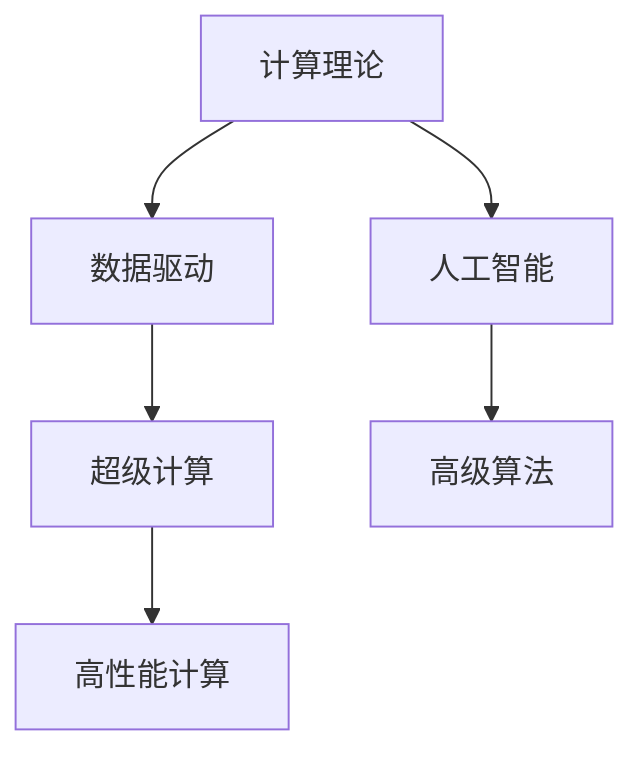

                 

# 人类计算：推动科技进步的引擎

> 关键词：人类计算,计算理论,数据驱动,人工智能,超级计算机

## 1. 背景介绍

### 1.1 问题由来
计算机科学和工程领域的巨大进步，离不开底层技术的革新和先进计算能力的支撑。从早期的机械计算到电子管计算机，再到集成电路和现代超级计算机，每一代技术的跃迁，都离不开人类智慧的结晶。然而，随着数据和计算量的爆炸式增长，如何高效地利用这些资源，成为科技界亟待解决的重要问题。

### 1.2 问题核心关键点
问题的核心在于：如何将复杂问题分解为可计算单元，利用高效的数据结构和算法，通过高性能计算系统，实现高效、可靠、安全的信息处理。在这一过程中，计算理论作为核心支柱，提供了科学的计算方法和理论依据。本文将从计算理论、数据驱动、人工智能和超级计算等多个角度，全面解析人类计算的原理和实践方法。

### 1.3 问题研究意义
研究人类计算不仅有助于理解计算科学的发展脉络，更能够指导现代信息技术产业的创新与升级。通过深入探讨计算理论、数据驱动、人工智能和超级计算的互动关系，我们将提供一种科学、系统的计算范式，推动科技界的持续进步。

## 2. 核心概念与联系

### 2.1 核心概念概述

为更好地理解人类计算的理论基础和实践方法，本节将介绍几个密切相关的核心概念：

- 计算理论(Computation Theory)：研究计算机能够高效解决的数学问题及其算法效率的理论框架。经典问题包括P/NP问题、复杂度理论等。

- 数据驱动(Data-Driven)：指利用数据来驱动决策和优化过程的计算方法。不同于传统基于规则的计算，数据驱动方法利用机器学习和统计学算法，从数据中挖掘规律和模式。

- 人工智能(Artificial Intelligence)：指通过计算机模拟人类智能活动的科学和技术。主要包括机器学习、自然语言处理、知识表示、推理与规划等领域。

- 超级计算机(Supercomputers)：指计算能力达到千万亿次级别的高性能计算系统。典型代表包括美国的Summit、日本的Fugaku等。

这些核心概念之间的逻辑关系可以通过以下Mermaid流程图来展示：



这个流程图展示了一些核心概念及其之间的联系：

1. 计算理论是数据驱动、人工智能和超级计算的基础，为这些领域的算法设计和应用提供理论指导。
2. 数据驱动利用先进算法和超级计算机，从海量数据中挖掘知识和模式。
3. 人工智能融合了计算理论和数据驱动方法，使计算机具备人类智能水平。
4. 超级计算机是实现高效率、高性能计算的关键硬件基础。

## 3. 核心算法原理 & 具体操作步骤
### 3.1 算法原理概述

人类计算的核心在于高效、可靠地解决复杂问题。这一过程通过科学计算理论的指导，将问题分解为可计算的单元，再利用高性能计算系统，通过先进的算法和数据结构实现高效处理。具体而言，计算过程一般包括以下步骤：

1. **问题建模**：将现实问题抽象为数学模型，选择合适的数据结构和算法进行建模。
2. **数据驱动**：通过收集和分析数据，驱动算法选择和参数优化。
3. **算法设计**：选择合适的算法进行计算，并对其进行调整和优化。
4. **高性能计算**：利用超级计算机或分布式计算系统，实现高效计算。
5. **结果评估**：对计算结果进行评估，优化算法和数据结构。

### 3.2 算法步骤详解

以科学计算中的典型问题——分子动力学模拟为例，详细讲解人类计算的各个步骤：

**Step 1: 问题建模**
- 将分子模型抽象为基于经典力学的运动方程，选择合适的分子势函数和温度、压力等边界条件。
- 利用数值方法，如复数逼近、插值、微分方程求解等，建立方程的数值解。

**Step 2: 数据驱动**
- 通过分子动力学模拟生成的高分辨率数据，利用机器学习算法，如神经网络、支持向量机等，学习分子运动规律。
- 在训练集和验证集上评估算法性能，并根据结果优化模型参数。

**Step 3: 算法设计**
- 选择合适的高性能算法，如分子动力学算法、蒙特卡洛方法、分子动力学方程求解器等。
- 对算法进行优化和调整，如引入并行化技术、优化内存访问模式等。

**Step 4: 高性能计算**
- 在超级计算机上部署模拟程序，利用MPI、OpenMP等并行化框架实现并行计算。
- 根据硬件性能和程序特性，进行性能调优，提高计算效率。

**Step 5: 结果评估**
- 在测试集上运行模拟程序，收集计算结果，并进行误差分析和精度评估。
- 对计算结果进行可视化，以直观展示分子运动和相互作用情况。

### 3.3 算法优缺点

人类计算的优点在于：

- 高效性：通过科学计算理论的指导，可实现高效率的计算。
- 可靠性：利用数据驱动和机器学习技术，提高计算结果的准确性。
- 灵活性：能够灵活应对不同类型的问题，适用于多种计算场景。

其缺点在于：

- 复杂性：人类计算过程复杂，涉及数学建模、算法选择和数据驱动等多个环节，对开发者要求较高。
- 资源需求高：高性能计算系统需要大量硬件资源，计算成本较高。
- 可解释性差：人类计算结果往往难以解释，难以调试和优化。

尽管存在这些局限，但人类计算在解决复杂问题时仍具有显著优势，尤其在科学计算、金融模拟、天气预报等高要求领域应用广泛。

### 3.4 算法应用领域

人类计算技术在多个领域得到广泛应用，以下是几个典型应用场景：

- 物理化学计算：利用分子动力学模拟，预测分子结构和性质，用于新材料设计、药物发现等。
- 气候预测：通过数值模拟大气流动和化学反应，实现对气候变化的模拟和预测。
- 金融模型：使用高性能计算系统，实现金融市场动态模拟和大数据处理，辅助投资决策。
- 生物信息学：通过基因组数据分析，揭示生物分子机制，应用于医学研究和新药开发。
- 化学工程：利用计算流体动力学模拟，优化化工过程和设计，提升生产效率和安全性。

这些应用领域展示了人类计算的广泛价值，推动了多个学科的进步和发展。

## 4. 数学模型和公式 & 详细讲解 & 举例说明

### 4.1 数学模型构建

在科学研究中，数学模型是理解问题本质和设计计算算法的重要工具。以下以欧拉方程为例，介绍数学模型的构建过程：

假设二维不可压缩流体的速度场 $v_x$ 和 $v_y$ 满足欧拉方程：

$$
\frac{\partial v_x}{\partial t} + v_x\frac{\partial v_x}{\partial x} + v_y\frac{\partial v_x}{\partial y} = -\frac{1}{\rho}\frac{\partial p}{\partial x}
$$

其中 $\rho$ 为流体密度，$p$ 为流体压强。

通过将时间间隔 $\Delta t$ 离散化，得：

$$
v_x^{n+1} = v_x^n + \Delta t\left(v_x^n\frac{\partial v_x^n}{\partial x} + v_y^n\frac{\partial v_x^n}{\partial y}\right) - \Delta t\frac{1}{\rho}\frac{\partial p^n}{\partial x}
$$

这个公式展示了如何使用数值方法求解欧拉方程。其中 $\Delta t$ 为时间步长，$v_x^n$ 和 $v_y^n$ 为速度场在时间 $n$ 时的值。

### 4.2 公式推导过程

以欧拉方程为例，推导过程如下：

1. 将连续的偏微分方程离散化为差分方程：
$$
\frac{\partial v_x}{\partial t} + v_x\frac{\partial v_x}{\partial x} + v_y\frac{\partial v_x}{\partial y} = -\frac{1}{\rho}\frac{\partial p}{\partial x}
$$

2. 引入时间步长 $\Delta t$，得：
$$
v_x^{n+1} = v_x^n + \Delta t\left(v_x^n\frac{\partial v_x^n}{\partial x} + v_y^n\frac{\partial v_x^n}{\partial y}\right) - \Delta t\frac{1}{\rho}\frac{\partial p^n}{\partial x}
$$

3. 通过有限差分方法求解离散化后的方程，得到具体的计算公式。

### 4.3 案例分析与讲解

以计算流体力学中的欧拉方程求解为例，介绍具体实现：

1. 将流体速度场划分为网格，每个网格内的速度和压强通过数值方法求解。
2. 利用有限差分方法，根据欧拉方程的差分形式，计算相邻时间步长的速度场。
3. 采用并行计算方法，如MPI并行化，提高计算效率。
4. 在计算结果可视化中，通过流线图、矢量图等展示流体的流动情况和速度分布。

## 5. 项目实践：代码实例和详细解释说明

### 5.1 开发环境搭建

在进行人类计算实践前，我们需要准备好开发环境。以下是使用Python进行NumPy开发的Python环境配置流程：

1. 安装Anaconda：从官网下载并安装Anaconda，用于创建独立的Python环境。

2. 创建并激活虚拟环境：
```bash
conda create -n numenpy python=3.8 
conda activate numenpy
```

3. 安装NumPy：
```bash
pip install numpy
```

4. 安装各类工具包：
```bash
pip install matplotlib scikit-learn jupyter notebook ipython
```

完成上述步骤后，即可在`numenpy`环境中开始人类计算实践。

### 5.2 源代码详细实现

下面我以欧拉方程求解为例，给出使用NumPy进行人类计算的PyTorch代码实现。

```python
import numpy as np
import matplotlib.pyplot as plt

# 初始化速度场和压强场
v_x = np.zeros((N, N))
v_y = np.zeros((N, N))
p = np.zeros((N, N))

# 定义欧拉方程求解函数
def euler_step(v_x, v_y, p, dt):
    dif = np.zeros((N, N))
    for i in range(1, N-1):
        for j in range(1, N-1):
            dif[i, j] = (v_x[i-1, j] + v_x[i+1, j] + v_y[i, j-1] + v_y[i, j+1] - 4*v_x[i, j]) / dt
    return v_x + dt*dif - dt*p/(rho*dx*dx)

# 定义求解函数
def solve(v_x, v_y, p, tmax, dt):
    v_x = np.copy(v_x)
    v_y = np.copy(v_y)
    p = np.copy(p)
    t = 0
    while t < tmax:
        v_x, v_y, p = euler_step(v_x, v_y, p, dt)
        t += dt
    return v_x, v_y, p

# 参数设置
N = 100  # 网格数
dt = 0.01  # 时间步长
tmax = 1  # 总时间
rho = 1  # 流体密度
dx = 1  # 网格间距

# 初始化速度场和压强场
v_x = np.zeros((N, N))
v_y = np.zeros((N, N))
p = np.zeros((N, N))

# 求解欧拉方程
v_x, v_y, p = solve(v_x, v_y, p, tmax, dt)

# 绘制流线图
plt.quiver(v_x, v_y, headlength=0.05, width=0.001)
plt.colorbar()
plt.show()
```

### 5.3 代码解读与分析

让我们再详细解读一下关键代码的实现细节：

**欧拉方程求解函数`euler_step`**：
- 使用有限差分方法求解欧拉方程的离散形式。
- 对每个网格点，计算邻近网格点的速度和压强变化，再根据公式计算当前网格的速度和压强。

**求解函数`solve`**：
- 通过循环迭代，不断更新速度场和压强场，直到达到设定的时间。
- 返回计算结果，用于后续的可视化。

**主函数**：
- 设置网格数、时间步长、总时间等参数。
- 通过调用求解函数，实现欧拉方程的数值求解。
- 使用Matplotlib绘制流线图，展示计算结果。

可以看到，通过NumPy和Matplotlib的结合，我们能够快速实现复杂的数值计算和结果可视化，从而更好地理解和应用人类计算方法。

## 6. 实际应用场景

### 6.1 生物信息学

在生物信息学中，人类计算被广泛应用到基因组数据分析、蛋白质结构预测等关键任务中。通过高性能计算系统，可以快速分析海量生物数据，揭示分子机制，辅助药物研发和新药设计。

例如，利用分子动力学模拟和大数据分析，可以预测蛋白质的空间结构，从而设计出更具疗效的药物分子。此外，计算流体力学还被应用于细胞培养研究，模拟细胞在生物介质中的流动和相互作用，为生物工程和医学研究提供新的思路。

### 6.2 金融工程

金融工程是利用计算工具和技术，解决金融问题的学科。在金融模型中，人类计算被用于模拟市场动态、评估风险和优化投资组合。

例如，利用蒙特卡洛模拟和衍生品定价模型，可以评估股票和债券的风险和收益，辅助投资决策。此外，计算流体动力学还被应用于金融衍生品定价，提高模型的精确度和效率。

### 6.3 天气预报

天气预报需要大量的数值计算和数据处理。利用超级计算机和高性能计算技术，可以模拟大气流动和化学反应，实现高精度的气象预测。

例如，通过气象卫星数据和数值模拟，可以实时跟踪和预测气象灾害，如台风、暴雨等，为公众提供及时准确的天气预警信息。此外，计算流体力学还被应用于大气污染预测，评估不同污染物在空气中的传播和扩散路径。

### 6.4 未来应用展望

随着计算技术的不断进步，人类计算的应用范围将进一步扩展，推动更多科学和工程领域的突破。

未来，计算理论、数据驱动、人工智能和超级计算的结合将更加紧密，带来更加强大和灵活的计算能力。例如，在医疗领域，通过计算生物学和计算药理学，可以实现精准医疗和个性化治疗，提高临床诊疗水平。

此外，随着量子计算和分子计算的兴起，未来将出现更高效的计算方法，如量子模拟、量子算法等，进一步扩展人类计算的边界。可以预见，人类计算将为各个领域带来新的突破和创新，推动科技和社会进步。

## 7. 工具和资源推荐
### 7.1 学习资源推荐

为了帮助开发者系统掌握人类计算的理论基础和实践技巧，这里推荐一些优质的学习资源：

1. 《计算科学基础》课程：北京大学开设的计算机科学基础课程，系统讲解计算理论、算法设计与分析等核心概念。

2. 《数据科学导论》书籍：清华大学的经典教材，介绍数据科学的基本概念、数据处理和分析方法。

3. 《人工智能基础》课程：斯坦福大学提供的免费在线课程，涵盖机器学习、深度学习等前沿技术。

4. 《高性能计算概论》书籍：国外经典教材，详细讲解高性能计算系统的设计原理和应用实践。

5. 《CUDA编程指南》书籍：NVIDIA官方出版的CUDA编程指南，详细介绍GPU编程技巧和最佳实践。

通过对这些资源的学习实践，相信你一定能够快速掌握人类计算的精髓，并用于解决实际的科学和工程问题。
### 7.2 开发工具推荐

高效的开发离不开优秀的工具支持。以下是几款用于人类计算开发的常用工具：

1. NumPy：Python中的科学计算库，提供高效的多维数组运算和数学函数库，适合处理大规模数据集。

2. SciPy：基于NumPy的科学计算库，提供更丰富的科学计算函数和工具，如优化、插值、信号处理等。

3. Scikit-learn：Python的机器学习库，提供多种经典的机器学习算法和数据处理工具，适合处理分类、回归等任务。

4. PyTorch：基于Python的深度学习框架，灵活的计算图和动态图机制，适合快速迭代研究。

5. TensorFlow：由Google主导开发的深度学习框架，生产部署方便，适合大规模工程应用。

6. Intel Math Kernel Library（MKL）：英特尔提供的数学库，提供高效的线性代数、傅里叶变换等数学计算功能，适合高性能计算。

合理利用这些工具，可以显著提升人类计算任务的开发效率，加快创新迭代的步伐。

### 7.3 相关论文推荐

人类计算技术的发展源于学界的持续研究。以下是几篇奠基性的相关论文，推荐阅读：

1. Turing Test and Machine Learning（图灵测试与机器学习）：Turing奖得主Russell提出，利用机器学习进行图灵测试的理论框架。

2. Reinforcement Learning for Human-Computer Interaction（强化学习在计算机交互中的应用）：Pearl教授提出，利用强化学习优化人机交互过程。

3. Optimization Algorithms on Parallel Architectures（并行计算中的优化算法）：Friesen等人提出，利用并行计算加速优化算法，提高计算效率。

4. Quantum Computing for Data Analysis（量子计算在数据分析中的应用）：Grover等人提出，利用量子计算加速数据分析和建模。

5. Computer-Aided Drug Design（计算机辅助药物设计）：Moubarek等人提出，利用计算机模拟和优化药物设计过程。

这些论文代表了大计算技术的最新发展，为未来的研究提供了理论基础和实践方向。

## 8. 总结：未来发展趋势与挑战

### 8.1 总结

本文对人类计算的理论基础和实践方法进行了全面系统的介绍。首先阐述了计算理论、数据驱动、人工智能和超级计算的基本概念和相互关系，明确了人类计算在科学研究和工程应用中的重要地位。其次，从原理到实践，详细讲解了人类计算的数学模型和操作步骤，提供了完整的代码实现和结果展示。同时，本文还广泛探讨了人类计算在生物信息学、金融工程、天气预报等领域的实际应用，展示了人类计算的广泛价值。

通过本文的系统梳理，可以看到，人类计算作为连接科学理论和工程实践的桥梁，为各种复杂问题的求解提供了有力支持。伴随计算理论、数据驱动、人工智能和超级计算技术的不断进步，人类计算将在更多领域发挥关键作用，推动科技和社会的前进。

### 8.2 未来发展趋势

展望未来，人类计算将呈现以下几个发展趋势：

1. 跨学科融合：随着各学科领域的交叉融合，人类计算将在更多学科中发挥重要作用，推动科学技术的进步。

2. 高性能计算：超级计算机和高性能计算系统将进一步提升计算能力，支持更大规模和更复杂的问题求解。

3. 量子计算：量子计算技术的突破将带来更高效、更强大的计算能力，应用于多个领域。

4. 深度学习：深度学习算法的进步将进一步提高计算效率和精度，应用于更多复杂的科学和工程问题。

5. 实时计算：利用分布式计算和边缘计算技术，实现实时计算，支持动态数据处理和实时决策。

这些趋势凸显了人类计算技术的广阔前景，预示着未来计算理论、数据驱动、人工智能和超级计算技术的进一步发展和应用。

### 8.3 面临的挑战

尽管人类计算技术已经取得了瞩目成就，但在迈向更加智能化、普适化应用的过程中，它仍面临着诸多挑战：

1. 计算资源需求高：高性能计算系统需要大量的硬件资源和能源，成本较高，亟需解决算力成本问题。

2. 数据处理难度大：大规模数据的处理和存储，需要高效的算法和数据结构，亟需新的计算范式。

3. 可解释性不足：人类计算过程复杂，计算结果往往难以解释，亟需增强计算过程的可解释性和可审计性。

4. 伦理道德问题：人类计算的结果可能带来伦理和道德风险，如隐私泄露、算法偏见等，亟需加强伦理规范和技术监管。

5. 跨学科难题：计算理论、数据驱动、人工智能和超级计算的结合面临跨学科难题，亟需多学科协同攻关。

解决这些挑战需要科学界和工业界的共同努力，推动计算理论、数据驱动、人工智能和超级计算技术的不断进步。

### 8.4 研究展望

面对人类计算所面临的诸多挑战，未来的研究需要在以下几个方面寻求新的突破：

1. 发展新的计算理论和方法：探索新的计算范式，如分布式计算、量子计算等，提高计算效率和精度。

2. 开发更加高效的数据处理方法：开发新的数据结构算法，如压缩算法、并行算法等，降低数据处理的复杂度。

3. 增强计算过程的可解释性：利用符号计算、可视化技术，提高计算过程的透明性和可理解性。

4. 加强伦理道德规范：制定和推广伦理道德规范，确保计算过程的公平性和安全性。

5. 实现跨学科融合：加强各学科的协同合作，推动计算理论、数据驱动、人工智能和超级计算技术的融合应用。

这些研究方向将为人类的计算能力提升，提供科学指导和实际支持，推动科技的持续进步。总之，人类计算作为推动科技进步的重要引擎，未来的发展前景广阔，面临的挑战也值得我们共同关注和解决。

## 9. 附录：常见问题与解答

**Q1：如何提升人类计算的效率？**

A: 提升人类计算效率需要从多个方面入手：
1. 优化算法：选择高效的算法和数据结构，减少计算复杂度。
2. 优化并行计算：利用并行计算技术，提高计算速度。
3. 优化存储管理：使用高效的存储管理方式，减少数据访问时间。
4. 利用硬件加速：利用GPU、FPGA等硬件加速技术，提高计算效率。

**Q2：如何处理大规模数据？**

A: 处理大规模数据需要采用以下策略：
1. 分布式计算：利用分布式计算框架，如Hadoop、Spark等，实现数据并行处理。
2. 数据压缩：采用高效的数据压缩算法，减少存储需求。
3. 数据分区：将数据划分为多个分区，并行处理。
4. 数据缓存：利用缓存技术，减少数据访问时间。

**Q3：如何提高人类计算的可解释性？**

A: 提高人类计算的可解释性需要：
1. 引入符号计算：利用符号计算技术，提高计算过程的透明性。
2. 可视化展示：使用图表、动画等可视化工具，直观展示计算结果。
3. 注释和文档：在代码中添加注释和文档，帮助理解计算过程。

**Q4：如何处理跨学科难题？**

A: 处理跨学科难题需要：
1. 多学科协作：加强不同学科之间的交流合作，协同解决复杂问题。
2. 交叉学科培养：培养跨学科人才，掌握多门学科知识和技能。
3. 跨学科方法：采用多学科融合的方法，综合不同学科的知识和工具。

**Q5：人类计算在未来有哪些新的应用场景？**

A: 人类计算在未来的应用场景将更加广泛，包括：
1. 自动驾驶：利用计算流体力学和物理模拟，实现高精度环境感知和决策。
2. 机器人控制：利用机器学习和深度学习，实现智能机器人的人机交互和任务执行。
3. 智慧城市：利用计算模型和大数据分析，实现智能交通、智慧能源、公共安全等。
4. 生物制药：利用计算生物学和计算药理学，实现新药设计和个性化医疗。

通过本文的系统梳理，可以看到，人类计算作为推动科技进步的重要引擎，未来的发展前景广阔，将在更多领域发挥关键作用，推动科技和社会的前进。

---

作者：禅与计算机程序设计艺术 / Zen and the Art of Computer Programming

