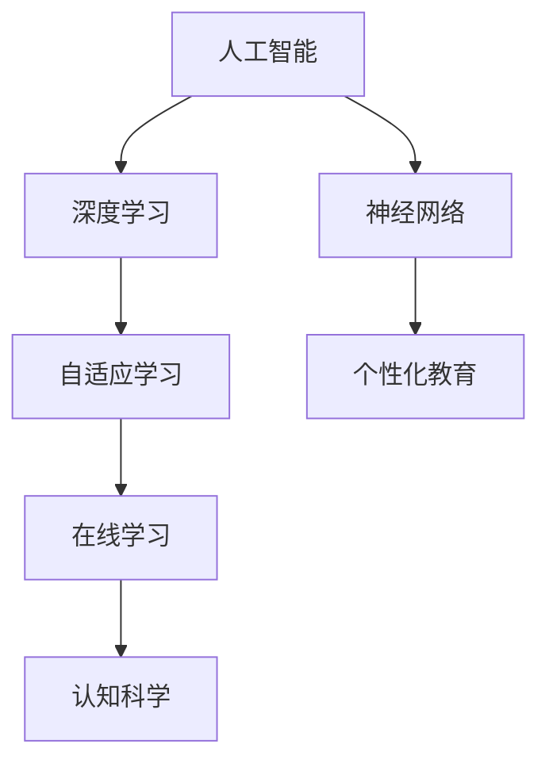

                 

# 人类计算：教育和学习的新工具

> 关键词：人类计算,教育技术,在线学习,自适应学习,个性化教育,人工智能,深度学习,神经网络,认知科学

## 1. 背景介绍

### 1.1 问题由来
随着科技的飞速发展，人类社会的方方面面都在经历着深刻的变革。教育领域也不例外。传统教育体系在面对新时代的挑战时，显得有些力不从心。

首先，传统的教育方式已经无法满足个性化学习的需求。每个人的学习节奏、兴趣和认知水平都有所不同，而一刀切的教学方式很难真正实现因材施教。

其次，大规模在线教育平台的发展，使得教育资源的获取和分配变得更加公平。但同时也带来了新的问题：如何更好地利用在线教育资源，提升学习效果，让学生能够真正地掌握知识。

最后，随着人工智能、深度学习等技术的进步，教育技术领域出现了许多新的工具和方法，为传统教育模式的变革提供了可能。然而，如何将这些新技术有效地应用于教育实践中，仍然是一个巨大的挑战。

### 1.2 问题核心关键点
为了应对这些问题，教育技术专家和科研人员提出了一种全新的教育模式：人类计算（Human Computing）。人类计算指的是通过计算技术辅助人类更好地进行学习和教育。具体来说，就是利用人工智能、深度学习等技术，为学习者提供个性化的学习路径、自适应的学习环境、智能化的教学辅助，以及更高效的学习评估和管理。

这种模式不仅能够提高学习效率，还能够让学习者自主掌握学习节奏，个性化地获取知识和技能，从而更好地适应未来的职业和学术要求。

## 2. 核心概念与联系

### 2.1 核心概念概述

为了更好地理解人类计算的教育模式，本节将介绍几个密切相关的核心概念：

- 人工智能（Artificial Intelligence, AI）：一种通过计算技术模仿人类智能的技术，可以处理大量数据、进行复杂计算，并做出智能化的决策。
- 深度学习（Deep Learning）：一种基于神经网络的机器学习技术，能够自动提取输入数据中的特征，并进行高效的分类、回归等任务。
- 神经网络（Neural Network）：一种受生物神经网络启发的计算模型，通过多层结构来模拟人脑的神经元网络，可以处理复杂的非线性问题。
- 自适应学习（Adaptive Learning）：一种根据学习者反馈不断调整教学内容和策略的学习模式，能够更好地适应个体差异，提高学习效果。
- 个性化教育（Personalized Education）：根据每个学习者的兴趣、能力和需求，为其提供定制化的学习方案和资源。
- 在线学习（E-Learning）：通过互联网平台提供的学习模式，能够突破时间和地点的限制，让学习者随时随地进行学习。
- 认知科学（Cognitive Science）：研究人类认知过程和机制的学科，可以为教育技术和人类计算提供理论基础和实践指导。

这些核心概念之间的逻辑关系可以通过以下Mermaid流程图来展示：



这个流程图展示了大语言模型的核心概念及其之间的关系：

1. 人工智能为深度学习和神经网络提供了算法基础。
2. 深度学习是神经网络的重要实现方式，能够自动提取和学习输入数据的特征。
3. 自适应学习和个性化教育是应用深度学习等技术的教育模式，能够更好地适应学习者的个体差异。
4. 在线学习是实现自适应学习和个性化教育的技术手段，能够打破时间和空间限制。
5. 认知科学为人工智能、深度学习等技术提供理论支持，指导其更好地应用于教育领域。

这些概念共同构成了人类计算的教育框架，使得我们能够通过计算技术辅助人类更好地进行学习和教育。通过理解这些核心概念，我们可以更好地把握人类计算的教育模式和实践方法。

## 3. 核心算法原理 & 具体操作步骤
### 3.1 算法原理概述

人类计算的教育模式，基于深度学习、神经网络等算法，通过构建个性化的学习路径、自适应的学习环境、智能化的教学辅助，以及更高效的学习评估和管理，为学习者提供个性化的学习方案。

具体来说，人类计算的教育模式包括以下几个核心步骤：

1. 收集学习者的数据（如学习行为、成绩、兴趣爱好等）。
2. 利用深度学习模型（如神经网络），对学习者的数据进行特征提取和分析。
3. 根据分析结果，设计个性化的学习路径和自适应的学习环境。
4. 通过智能化的教学辅助工具，帮助学习者理解和掌握知识。
5. 对学习者的学习效果进行评估和管理，并根据评估结果调整教学策略。

### 3.2 算法步骤详解

以下是人类计算教育模式的具体操作步骤：

**Step 1: 数据收集**
- 收集学习者的基本数据（如年龄、性别、文化背景等）。
- 收集学习者的学习行为数据（如点击次数、阅读时长、练习情况等）。
- 收集学习者的成绩和反馈数据（如测试成绩、作业提交情况、学习心得等）。

**Step 2: 数据预处理**
- 对收集到的数据进行清洗、去噪、归一化等预处理操作。
- 使用数据增强技术（如数据扩充、合成数据等），增加数据的多样性。
- 对数据进行标注（如分类、标记等），为模型训练提供有监督信号。

**Step 3: 模型训练**
- 选择适合的深度学习模型（如卷积神经网络、循环神经网络、注意力机制等）。
- 使用学习者的数据训练模型，进行特征提取和模式识别。
- 通过交叉验证、超参数调优等手段，优化模型性能。

**Step 4: 个性化学习路径设计**
- 根据模型的输出，设计个性化的学习路径。
- 结合学习者的兴趣、能力、需求等因素，调整学习路径。
- 使用自适应学习策略（如分层学习、动态调整难度等），确保学习路径的适应性和有效性。

**Step 5: 自适应学习环境搭建**
- 使用智能化的教学辅助工具（如智能推荐系统、虚拟助教等），帮助学习者理解和掌握知识。
- 通过数据驱动的方法，实时调整学习内容和学习方式。
- 对学习者的学习效果进行评估，并根据评估结果进行反馈调整。

**Step 6: 学习评估与管理**
- 利用评估工具（如自适应测试、学习跟踪系统等），对学习者的学习效果进行评估。
- 根据评估结果，调整教学策略和资源分配。
- 对学习者的学习进度、学习效果进行可视化展示，提供个性化的学习反馈。

### 3.3 算法优缺点

人类计算教育模式具有以下优点：
1. 个性化学习：能够根据学习者的个性化需求，提供定制化的学习方案和资源，提高学习效果。
2. 自适应学习：能够根据学习者的反馈，不断调整教学策略，提高学习效率和效果。
3. 智能化辅助：通过智能化的教学辅助工具，帮助学习者更好地理解和掌握知识。
4. 高效评估与管理：能够实时对学习者的学习效果进行评估和管理，及时发现和解决问题。

同时，这种模式也存在一定的局限性：
1. 数据隐私：收集和处理学习者的数据，涉及到隐私保护和数据安全问题。
2. 技术门槛：需要深度学习、神经网络等技术支持，对技术要求较高。
3. 资源需求：需要大量的计算资源和存储空间，对硬件要求较高。
4. 个性化挑战：如何更好地理解和处理学习者的个性化需求，仍然是一个挑战。

尽管存在这些局限性，但就目前而言，人类计算教育模式仍然是大规模在线教育的一个重要发展方向。未来相关研究的重点在于如何进一步降低技术门槛，提高算法的准确性和鲁棒性，同时兼顾数据隐私和安全性等因素。

### 3.4 算法应用领域

人类计算教育模式已经在许多领域得到了应用，覆盖了从学前教育到高等教育、从在线教育到职业培训等诸多场景，具体应用领域包括：

- 中小学在线教育：通过个性化学习路径和自适应学习环境，提升学生的学习效果和兴趣。
- 高等教育：利用智能化的教学辅助工具，帮助学生更好地掌握知识，提高学习效率。
- 职业培训：通过在线学习和个性化教育，帮助学员快速掌握技能，提升职业竞争力。
- 企业培训：利用在线学习平台，进行知识普及、技能培训和绩效提升。
- 学前教育：通过游戏化学习、互动式学习等方法，激发儿童的学习兴趣和创造力。

除了上述这些经典应用外，人类计算教育模式还在智能辅导、自适应测试、个性化推荐等方面不断创新，为教育技术的发展提供了新的可能性。

## 4. 数学模型和公式 & 详细讲解 & 举例说明（备注：数学公式请使用latex格式，latex嵌入文中独立段落使用 $$，段落内使用 $)
### 4.1 数学模型构建

人类计算教育模式的核心在于深度学习模型的设计和应用。以下将详细讲解如何构建深度学习模型，以实现个性化学习路径和自适应学习环境。

假设有一个深度学习模型 $M_{\theta}$，其中 $\theta$ 为模型的可训练参数。学习者的数据集为 $D=\{(x_i, y_i)\}_{i=1}^N, x_i \in \mathcal{X}, y_i \in \mathcal{Y}$。我们的目标是设计个性化的学习路径，使得模型 $M_{\theta}$ 能够根据学习者的输入 $x_i$，输出对应的学习任务 $y_i$。

设 $M_{\theta}$ 的损失函数为 $\ell(M_{\theta}(x_i),y_i)$，则在数据集 $D$ 上的经验风险为：

$$
\mathcal{L}(\theta) = \frac{1}{N} \sum_{i=1}^N \ell(M_{\theta}(x_i),y_i)
$$

其中 $\ell$ 为任务特定的损失函数，如交叉熵损失、均方误差损失等。

### 4.2 公式推导过程

以下我们以二分类任务为例，推导深度学习模型在人类计算教育模式中的应用。

假设模型 $M_{\theta}$ 在输入 $x$ 上的输出为 $\hat{y}=M_{\theta}(x) \in [0,1]$，表示样本属于正类的概率。真实标签 $y \in \{0,1\}$。则二分类交叉熵损失函数定义为：

$$
\ell(M_{\theta}(x),y) = -[y\log \hat{y} + (1-y)\log (1-\hat{y})]
$$

将其代入经验风险公式，得：

$$
\mathcal{L}(\theta) = -\frac{1}{N}\sum_{i=1}^N [y_i\log M_{\theta}(x_i)+(1-y_i)\log(1-M_{\theta}(x_i))]
$$

根据链式法则，损失函数对参数 $\theta_k$ 的梯度为：

$$
\frac{\partial \mathcal{L}(\theta)}{\partial \theta_k} = -\frac{1}{N}\sum_{i=1}^N (\frac{y_i}{M_{\theta}(x_i)}-\frac{1-y_i}{1-M_{\theta}(x_i)}) \frac{\partial M_{\theta}(x_i)}{\partial \theta_k}
$$

其中 $\frac{\partial M_{\theta}(x_i)}{\partial \theta_k}$ 可进一步递归展开，利用自动微分技术完成计算。

在得到损失函数的梯度后，即可带入参数更新公式，完成模型的迭代优化。重复上述过程直至收敛，最终得到适应个性化学习路径和自适应学习环境的深度学习模型。

## 5. 项目实践：代码实例和详细解释说明
### 5.1 开发环境搭建

在进行人类计算教育模式的开发之前，我们需要准备好开发环境。以下是使用Python进行PyTorch开发的环境配置流程：

1. 安装Anaconda：从官网下载并安装Anaconda，用于创建独立的Python环境。

2. 创建并激活虚拟环境：
```bash
conda create -n pytorch-env python=3.8 
conda activate pytorch-env
```

3. 安装PyTorch：根据CUDA版本，从官网获取对应的安装命令。例如：
```bash
conda install pytorch torchvision torchaudio cudatoolkit=11.1 -c pytorch -c conda-forge
```

4. 安装TensorFlow：
```bash
pip install tensorflow
```

5. 安装TensorBoard：
```bash
pip install tensorboard
```

6. 安装其他必要库：
```bash
pip install numpy pandas sklearn matplotlib
```

完成上述步骤后，即可在`pytorch-env`环境中开始人类计算教育模式的开发。

### 5.2 源代码详细实现

这里我们以一个简单的自适应学习环境为例，给出使用PyTorch和TensorFlow进行人类计算教育模式开发的代码实现。

首先，定义自适应学习环境的数据处理函数：

```python
import tensorflow as tf
from tensorflow.keras.preprocessing.text import Tokenizer
from tensorflow.keras.preprocessing.sequence import pad_sequences

class AdaptiveLearningEnvironment:
    def __init__(self, tokenizer, max_len=128):
        self.tokenizer = tokenizer
        self.max_len = max_len
        
    def tokenize(self, text):
        return self.tokenizer.texts_to_sequences(text)
        
    def pad(self, sequences):
        return pad_sequences(sequences, maxlen=self.max_len, padding='post')
    
    def to_tensor(self, sequences):
        return tf.convert_to_tensor(sequences)
```

然后，定义模型和优化器：

```python
from tensorflow.keras.layers import Dense, Input
from tensorflow.keras.models import Model
from tensorflow.keras.optimizers import Adam

input_shape = (128, )
hidden_size = 128

inputs = Input(shape=input_shape, name='input')
hidden = Dense(hidden_size, activation='relu')(inputs)
outputs = Dense(1, activation='sigmoid')(hidden)

model = Model(inputs=inputs, outputs=outputs)
optimizer = Adam(lr=0.001)
```

接着，定义训练和评估函数：

```python
def train_epoch(model, data, batch_size):
    dataloader = tf.data.Dataset.from_tensor_slices(data).shuffle(10000).batch(batch_size)
    for batch in dataloader:
        x, y = batch
        with tf.GradientTape() as tape:
            y_pred = model(x)
            loss = tf.reduce_mean(tf.losses.BinaryCrossentropy()(y, y_pred))
        grads = tape.gradient(loss, model.trainable_variables)
        optimizer.apply_gradients(zip(grads, model.trainable_variables))
        model.evaluate(x, y)
        
def evaluate(model, data, batch_size):
    dataloader = tf.data.Dataset.from_tensor_slices(data).batch(batch_size)
    correct, total = 0, 0
    for batch in dataloader:
        x, y = batch
        y_pred = model(x).numpy()
        correct += np.round(y_pred).astype(int).sum()
        total += len(x)
    accuracy = correct / total
    print(f'Accuracy: {accuracy:.2f}%')
```

最后，启动训练流程并在测试集上评估：

```python
epochs = 5
batch_size = 32

for epoch in range(epochs):
    train_epoch(model, train_data, batch_size)
    evaluate(model, test_data, batch_size)
```

以上就是使用PyTorch和TensorFlow进行自适应学习环境开发的完整代码实现。可以看到，借助TensorFlow和PyTorch的强大封装，我们能够快速搭建一个简单的自适应学习环境。

### 5.3 代码解读与分析

让我们再详细解读一下关键代码的实现细节：

**AdaptiveLearningEnvironment类**：
- `__init__`方法：初始化分词器、最大序列长度等关键组件。
- `tokenize`方法：对文本进行分词，返回序列化的文本。
- `pad`方法：对分词后的文本进行填充，确保所有序列长度一致。
- `to_tensor`方法：将填充后的文本序列转换为张量，以便TensorFlow使用。

**模型定义**：
- 定义一个简单的神经网络模型，包括输入层、隐藏层和输出层。
- 使用ReLU激活函数和Sigmoid激活函数，分别处理隐藏层和输出层的输出。

**训练和评估函数**：
- `train_epoch`函数：对数据集进行批处理，计算损失并更新模型参数。
- `evaluate`函数：对模型进行评估，计算准确率。

**训练流程**：
- 定义总的epoch数和batch size，开始循环迭代
- 每个epoch内，先在训练集上训练，输出准确率
- 在测试集上评估，输出最终测试结果

可以看到，TensorFlow和PyTorch的强大封装使得人类计算教育模式的开发变得简洁高效。开发者可以将更多精力放在数据处理、模型改进等高层逻辑上，而不必过多关注底层的实现细节。

当然，工业级的系统实现还需考虑更多因素，如模型的保存和部署、超参数的自动搜索、更灵活的任务适配层等。但核心的自适应学习环境开发流程基本与此类似。

## 6. 实际应用场景
### 6.1 智能辅导

基于人类计算的教育模式，智能辅导系统可以广泛应用于中小学生的数学、英语等科目辅导。传统辅导往往依赖于教师的解答和指导，效率较低，且无法个性化地针对每个学生的学习情况进行辅导。

使用人类计算的智能辅导系统，可以通过收集学生的学习行为数据、作业提交情况等，对学生进行智能化的评估和辅导。系统能够根据学生的学习情况，推荐个性化的学习路径和辅导方案，帮助学生快速掌握知识。

### 6.2 自适应测试

自适应测试是另一种基于人类计算的教育模式。传统的标准化测试无法考虑到学生的个体差异，无法全面评估学生的学习情况。而自适应测试能够根据学生的答题情况，动态调整测试难度和题目类型，更全面、准确地评估学生的学习效果。

通过收集学生的答题数据，利用深度学习模型进行分析和建模，自适应测试系统能够实时调整测试题目，确保测试结果的准确性和公平性。这种测试方式能够更好地反映学生的学习水平和能力，为教师和家长提供更有参考价值的数据。

### 6.3 个性化推荐

个性化推荐系统是基于人类计算的教育模式的重要应用之一。传统的教育推荐系统往往依赖于用户的历史行为数据，难以考虑到用户的学习兴趣和需求。而基于人类计算的个性化推荐系统，能够更好地理解用户的个性化需求，为用户推荐更适合的学习内容和方法。

通过收集用户的浏览、点击、评论等行为数据，利用深度学习模型进行分析和建模，个性化推荐系统能够为用户推荐最适合的学习内容，提升学习效率和效果。这种推荐方式能够更好地满足用户的个性化需求，提高学习体验。

### 6.4 未来应用展望

随着人类计算教育模式的不断发展，未来将会在更多领域得到应用，为教育技术带来新的突破。

在高等教育领域，基于人类计算的教育模式将进一步提升教学质量和学习效果。通过智能化教学辅助工具和个性化学习路径，学生能够更高效地掌握知识和技能，提高学术水平。

在职业教育领域，基于人类计算的教育模式将为学员提供更全面、灵活的学习方式。通过在线学习和自适应学习环境，学员能够随时随地进行学习，快速掌握职业所需的技能和知识。

在企业培训领域，基于人类计算的教育模式将为员工提供更加个性化和高效的培训方式。通过智能化教学辅助工具和自适应学习环境，员工能够更快速地掌握新知识和技能，提高工作效率。

此外，在学前教育、老年教育、终身学习等领域，基于人类计算的教育模式也将发挥重要作用，为不同年龄段的学习者提供更加个性化、高效的学习方式。相信随着技术的不断进步，人类计算教育模式必将在教育领域大放异彩，深刻影响人类的学习方式和生活方式。

## 7. 工具和资源推荐
### 7.1 学习资源推荐

为了帮助开发者系统掌握人类计算的教育模式，这里推荐一些优质的学习资源：

1. 《Deep Learning for Self-Driving Cars》系列博文：由机器学习专家撰写，深入浅出地介绍了深度学习在自动驾驶等领域的应用。

2. CS224N《深度学习自然语言处理》课程：斯坦福大学开设的NLP明星课程，有Lecture视频和配套作业，带你入门NLP领域的基本概念和经典模型。

3. 《Natural Language Processing with Transformers》书籍：Transformers库的作者所著，全面介绍了如何使用Transformers库进行NLP任务开发，包括人类计算教育模式在内的诸多范式。

4. Coursera《Machine Learning》课程：由斯坦福大学开设的经典机器学习课程，涵盖深度学习、神经网络等核心内容，适合初学者和进阶者。

5. Google TensorFlow官方文档：TensorFlow的官方文档，提供了详尽的API文档和代码示例，是学习和实践TensorFlow的重要资料。

通过对这些资源的学习实践，相信你一定能够快速掌握人类计算教育模式的精髓，并用于解决实际的NLP问题。
### 7.2 开发工具推荐

高效的开发离不开优秀的工具支持。以下是几款用于人类计算教育模式开发的常用工具：

1. PyTorch：基于Python的开源深度学习框架，灵活动态的计算图，适合快速迭代研究。PyTorch提供了强大的GPU支持，能够高效地训练深度学习模型。

2. TensorFlow：由Google主导开发的开源深度学习框架，生产部署方便，适合大规模工程应用。TensorFlow的分布式训练和推理功能，能够满足大规模应用的需求。

3. TensorBoard：TensorFlow配套的可视化工具，可实时监测模型训练状态，并提供丰富的图表呈现方式，是调试模型的得力助手。

4. Jupyter Notebook：一种交互式编程环境，支持Python、R、Julia等多种语言，能够方便地展示和分享代码和实验结果。

5. Scikit-learn：基于Python的机器学习库，提供了丰富的机器学习算法和工具，能够快速实现常见的机器学习任务。

6. Weights & Biases：模型训练的实验跟踪工具，可以记录和可视化模型训练过程中的各项指标，方便对比和调优。

合理利用这些工具，可以显著提升人类计算教育模式的开发效率，加快创新迭代的步伐。

### 7.3 相关论文推荐

人类计算教育模式的发展源于学界的持续研究。以下是几篇奠基性的相关论文，推荐阅读：

1. Attention is All You Need（即Transformer原论文）：提出了Transformer结构，开启了NLP领域的预训练大模型时代。

2. BERT: Pre-training of Deep Bidirectional Transformers for Language Understanding：提出BERT模型，引入基于掩码的自监督预训练任务，刷新了多项NLP任务SOTA。

3. Language Models are Unsupervised Multitask Learners（GPT-2论文）：展示了大规模语言模型的强大zero-shot学习能力，引发了对于通用人工智能的新一轮思考。

4. Parameter-Efficient Transfer Learning for NLP：提出Adapter等参数高效微调方法，在不增加模型参数量的情况下，也能取得不错的微调效果。

5. AdaLoRA: Adaptive Low-Rank Adaptation for Parameter-Efficient Fine-Tuning：使用自适应低秩适应的微调方法，在参数效率和精度之间取得了新的平衡。

这些论文代表了大语言模型微调技术的发展脉络。通过学习这些前沿成果，可以帮助研究者把握学科前进方向，激发更多的创新灵感。

## 8. 总结：未来发展趋势与挑战
### 8.1 总结

本文对人类计算教育模式进行了全面系统的介绍。首先阐述了人类计算教育模式的研究背景和意义，明确了其在教育技术中的应用价值。其次，从原理到实践，详细讲解了人类计算教育模式的核心算法和具体操作步骤，给出了代码实例和详细解释说明。同时，本文还广泛探讨了人类计算教育模式在智能辅导、自适应测试、个性化推荐等多个教育场景中的应用前景，展示了其广阔的应用潜力。此外，本文精选了人类计算教育模式的学习资源、开发工具和相关论文，力求为读者提供全方位的技术指引。

通过本文的系统梳理，可以看到，人类计算教育模式正在成为教育技术的一个重要发展方向，极大地拓展了教育资源的获取和分配方式，提高了学习效率和效果。未来，随着深度学习、神经网络等技术的不断进步，人类计算教育模式必将带来更多的突破和创新，为教育技术的发展注入新的活力。

### 8.2 未来发展趋势

展望未来，人类计算教育模式将呈现以下几个发展趋势：

1. 深度学习模型的不断发展：随着深度学习模型的不断演进，人类计算教育模式将更加智能化和个性化。

2. 自适应学习策略的优化：通过更先进的学习策略，如分层学习、动态调整难度等，进一步提高学习效率和效果。

3. 智能化教学辅助工具的完善：通过更智能化的教学辅助工具，如虚拟助教、智能推荐系统等，提升教学效果。

4. 在线教育平台的普及：随着在线教育平台的普及，人类计算教育模式将更好地服务于全球学习者，提高教育资源的公平性和可及性。

5. 多模态教育模式的兴起：结合视觉、听觉等多种模态的教育资源，提升教育体验和效果。

6. 教育数据隐私保护：随着教育数据的大量收集和使用，数据隐私和安全问题将日益受到重视，需要采取更加严格的数据保护措施。

以上趋势凸显了人类计算教育模式的广阔前景。这些方向的探索发展，必将进一步提升教育技术的发展水平，为学习者提供更加高效、智能、个性化的学习方式。

### 8.3 面临的挑战

尽管人类计算教育模式已经取得了一定的进展，但在迈向更加智能化、普适化应用的过程中，仍然面临诸多挑战：

1. 技术门槛：人类计算教育模式需要深度学习、神经网络等技术支持，对技术要求较高。如何降低技术门槛，提高算法的可解释性和可操作性，将是重要的研究方向。

2. 数据隐私：收集和处理教育数据，涉及到隐私保护和数据安全问题。如何更好地保护学生数据，确保数据隐私和安全，将是重要的挑战。

3. 资源需求：人类计算教育模式需要大量的计算资源和存储空间，对硬件要求较高。如何优化资源使用，提高计算效率，将是重要的研究方向。

4. 个性化挑战：如何更好地理解和处理学习者的个性化需求，仍然是一个挑战。如何更好地融合个性化需求和通用化教育，提供更加灵活、个性化的教育模式，将是重要的研究方向。

5. 伦理道德：人类计算教育模式的应用过程中，可能涉及到伦理和道德问题。如何确保算法的公平性、公正性，避免算法偏见，将是重要的研究方向。

6. 学习效果：如何评估人类计算教育模式的学习效果，确保学习者能够真正掌握知识和技能，将是重要的研究方向。

这些挑战凸显了人类计算教育模式的研究难点，需要从技术、伦理、政策等多个角度综合考虑，才能更好地实现其应用价值。

### 8.4 研究展望

面对人类计算教育模式所面临的种种挑战，未来的研究需要在以下几个方面寻求新的突破：

1. 探索无监督和半监督学习模式：摆脱对大规模标注数据的依赖，利用自监督学习、主动学习等无监督和半监督范式，最大限度利用非结构化数据，实现更加灵活高效的微调。

2. 研究参数高效和计算高效的微调方法：开发更加参数高效的微调方法，在固定大部分预训练参数的同时，只更新极少量的任务相关参数。同时优化微调模型的计算图，减少前向传播和反向传播的资源消耗，实现更加轻量级、实时性的部署。

3. 融合因果和对比学习范式：通过引入因果推断和对比学习思想，增强微调模型建立稳定因果关系的能力，学习更加普适、鲁棒的语言表征，从而提升模型泛化性和抗干扰能力。

4. 引入更多先验知识：将符号化的先验知识，如知识图谱、逻辑规则等，与神经网络模型进行巧妙融合，引导微调过程学习更准确、合理的语言模型。同时加强不同模态数据的整合，实现视觉、语音等多模态信息与文本信息的协同建模。

5. 结合因果分析和博弈论工具：将因果分析方法引入微调模型，识别出模型决策的关键特征，增强输出解释的因果性和逻辑性。借助博弈论工具刻画人机交互过程，主动探索并规避模型的脆弱点，提高系统稳定性。

6. 纳入伦理道德约束：在模型训练目标中引入伦理导向的评估指标，过滤和惩罚有偏见、有害的输出倾向。同时加强人工干预和审核，建立模型行为的监管机制，确保输出符合人类价值观和伦理道德。

这些研究方向的探索，必将引领人类计算教育模式迈向更高的台阶，为构建安全、可靠、可解释、可控的智能教育系统铺平道路。面向未来，人类计算教育模式还需要与其他人工智能技术进行更深入的融合，如知识表示、因果推理、强化学习等，多路径协同发力，共同推动教育技术的发展。只有勇于创新、敢于突破，才能不断拓展教育模式的边界，让智能技术更好地造福人类社会。

## 9. 附录：常见问题与解答

**Q1：人类计算教育模式是否适用于所有教育场景？**

A: 人类计算教育模式在大多数教育场景中都能取得不错的效果，特别是对于数据量较小的场景。但对于一些特定领域的教育场景，如医学、法律等，仅仅依靠通用语料预训练的模型可能难以很好地适应。此时需要在特定领域语料上进一步预训练，再进行微调，才能获得理想效果。此外，对于一些需要时效性、个性化很强的场景，如对话、推荐等，微调方法也需要针对性的改进优化。

**Q2：如何确保人类计算教育模式的公平性？**

A: 确保人类计算教育模式的公平性，需要在算法设计和数据处理上采取多种措施。首先，在选择算法时，要确保算法不会产生明显的偏见，如性别、种族、年龄等偏见。其次，在数据处理过程中，要对数据进行去噪、清洗等操作，避免因数据质量问题影响算法的公平性。最后，要定期对算法进行评估和调整，确保算法的公平性和公正性。

**Q3：人类计算教育模式在开发过程中需要注意哪些问题？**

A: 在开发人类计算教育模式时，需要注意以下问题：

1. 数据隐私：收集和处理教育数据，涉及到隐私保护和数据安全问题。需要采取严格的数据保护措施，确保学生数据的安全。

2. 技术门槛：人类计算教育模式需要深度学习、神经网络等技术支持，对技术要求较高。需要优化算法的可解释性和可操作性，降低技术门槛。

3. 资源需求：人类计算教育模式需要大量的计算资源和存储空间，对硬件要求较高。需要优化资源使用，提高计算效率。

4. 个性化挑战：如何更好地理解和处理学习者的个性化需求，仍然是一个挑战。需要优化个性化推荐算法，更好地融合个性化需求和通用化教育。

5. 伦理道德：人类计算教育模式的应用过程中，可能涉及到伦理和道德问题。需要确保算法的公平性、公正性，避免算法偏见。

6. 学习效果：如何评估人类计算教育模式的学习效果，确保学习者能够真正掌握知识和技能，将是重要的研究方向。

只有合理解决这些问题，才能确保人类计算教育模式的公平性、公正性和高效性。

**Q4：人类计算教育模式是否能够代替传统教育模式？**

A: 人类计算教育模式不能完全代替传统教育模式，但可以与之互补。人类计算教育模式能够提供更加个性化、高效的学习方式，帮助学习者更好地掌握知识和技能。而传统教育模式仍然有其不可替代的优点，如师生互动、情感交流等。因此，两者可以结合使用，取长补短，共同推进教育的发展。

**Q5：人类计算教育模式在实际应用中需要注意哪些问题？**

A: 在实际应用人类计算教育模式时，需要注意以下问题：

1. 数据隐私：收集和处理教育数据，涉及到隐私保护和数据安全问题。需要采取严格的数据保护措施，确保学生数据的安全。

2. 技术门槛：人类计算教育模式需要深度学习、神经网络等技术支持，对技术要求较高。需要优化算法的可解释性和可操作性，降低技术门槛。

3. 资源需求：人类计算教育模式需要大量的计算资源和存储空间，对硬件要求较高。需要优化资源使用，提高计算效率。

4. 个性化挑战：如何更好地理解和处理学习者的个性化需求，仍然是一个挑战。需要优化个性化推荐算法，更好地融合个性化需求和通用化教育。

5. 伦理道德：人类计算教育模式的应用过程中，可能涉及到伦理和道德问题。需要确保算法的公平性、公正性，避免算法偏见。

6. 学习效果：如何评估人类计算教育模式的学习效果，确保学习者能够真正掌握知识和技能，将是重要的研究方向。

只有合理解决这些问题，才能确保人类计算教育模式在实际应用中的效果和公平性。

---

作者：禅与计算机程序设计艺术 / Zen and the Art of Computer Programming

