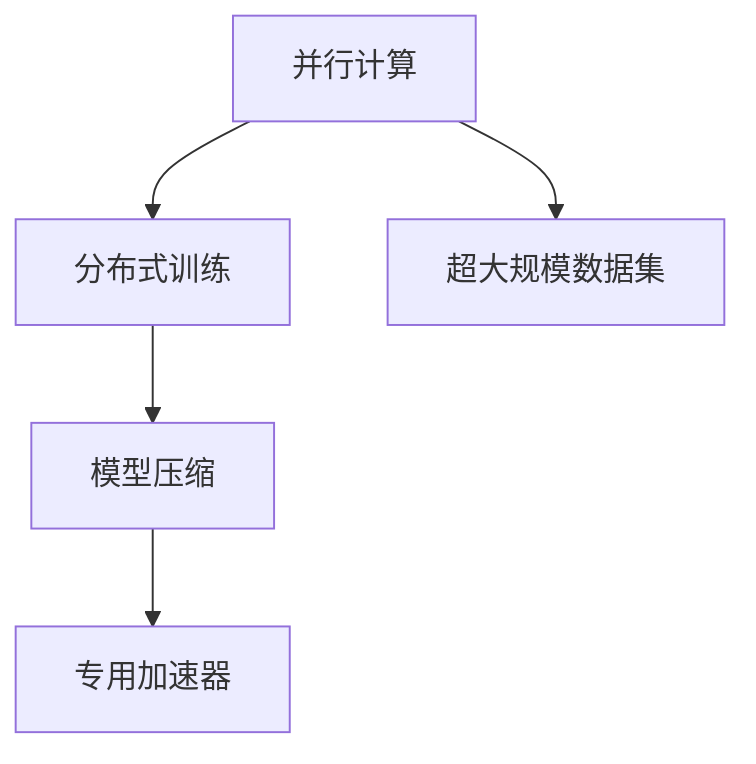

                 

# 从CPU到LLM：计算模式的巨大飞跃

## 1. 背景介绍

### 1.1 问题由来
在过去的几十年中，计算技术经历了从CPU（中央处理器）到GPU（图形处理器）的巨大飞跃。早期计算机的计算资源稀缺，CPU成为计算的单一核心，以串行方式执行任务，效率低下。随着硬件和软件的发展，GPU的出现彻底改变了这一局面。

GPU的并行处理能力和低功耗特性，使其成为计算密集型任务的高效工具。然而，随着深度学习和大数据技术的发展，CPU和GPU逐渐不能满足新型算法的计算需求。尤其是对于大模型和大规模数据集的处理，需要更高的计算效率和更强的并行能力。

这种背景下，出现了新型的计算模式——LLM（Language Modeling），也就是大语言模型。LLM通过并行计算和分布式训练，实现了对大规模语言数据的快速处理和深度学习，显著提升了计算效率和模型性能。

### 1.2 问题核心关键点
LLM的核心在于其并行计算和分布式训练的特性，使其能够处理大规模数据集和复杂模型。以下是LLM在计算模式上的一些关键点：

- **并行计算**：LLM通过将数据分割为多个小块，同时在多个处理器上并行计算，显著提升了计算效率。
- **分布式训练**：通过将模型分布在多个节点上，LLM能够利用集群中的多台机器并行训练，加速模型收敛。
- **模型压缩**：LLM采用各种技术，如知识蒸馏、剪枝、量化等，减小模型参数，提升模型压缩效率。
- **加速器优化**：LLM通过优化算法和软件栈，充分利用TPU、FPGA等专用加速器，加速模型训练和推理。

这些关键点使得LLM在处理大规模语言数据和复杂模型时，具有明显的优势。

## 2. 核心概念与联系

### 2.1 核心概念概述

为了更好地理解LLM的计算模式，本节将介绍几个密切相关的核心概念：

- **并行计算**：指同时使用多个处理器执行相同或不同类型的任务，以提高计算效率和并行度。
- **分布式训练**：指将模型分布在多台计算节点上，通过网络通信协同训练，加速模型收敛。
- **模型压缩**：指通过剪枝、量化、知识蒸馏等技术，减小模型参数，提升模型计算效率。
- **专用加速器**：如TPU、FPGA等专用计算硬件，专门为深度学习优化，提升计算速度和能效比。
- **超大规模数据集**：指海量的标注和无标签数据集，提供充足的数据支持。

这些核心概念共同构成了LLM的计算模式框架，使其在处理大规模语言数据和复杂模型时，具有强大的计算能力和优化策略。

### 2.2 核心概念原理和架构的 Mermaid 流程图(Mermaid 流程节点中不要有括号、逗号等特殊字符)



这个流程图展示了LLM的计算模式结构，从并行计算到分布式训练，再到模型压缩和专用加速器，再到数据集，这些关键组件协同工作，形成了LLM强大的计算能力。

## 3. 核心算法原理 & 具体操作步骤
### 3.1 算法原理概述

LLM的计算模式是基于分布式深度学习算法，利用并行计算和分布式训练的特性，加速模型训练和推理。其核心算法包括：

- **数据并行**：将数据分割为多个小块，同时在多个处理器上并行计算。
- **模型并行**：将模型分布在多个节点上，通过网络通信协同训练。
- **微批量训练**：使用小型批处理，并行计算多个小批量数据，提高计算效率。

这些算法通过高效利用并行计算资源，实现对大规模数据集的快速处理。

### 3.2 算法步骤详解

以下将详细介绍LLM的计算模式具体实现步骤：

**Step 1: 数据预处理**

- 将数据集划分为多个小块，以适应并行计算。
- 对每个小块进行标准化处理，如归一化、标准化等。

**Step 2: 并行计算**

- 使用多个处理器并行计算每个小块的数据。
- 对每个小块的计算结果进行合并，生成最终的输出。

**Step 3: 分布式训练**

- 将模型分布在多个节点上，并行更新模型参数。
- 使用消息传递协议，如Gloo、MPI等，实现节点之间的通信。

**Step 4: 模型压缩**

- 使用剪枝、量化、知识蒸馏等技术，减小模型参数。
- 优化模型结构，减少计算量和内存占用。

**Step 5: 专用加速器优化**

- 使用TPU、FPGA等专用加速器，加速模型训练和推理。
- 优化算法和软件栈，提高加速器的利用效率。

通过上述步骤，LLM能够高效地处理大规模语言数据和复杂模型，显著提升计算效率和模型性能。

### 3.3 算法优缺点

LLM的计算模式具有以下优点：

- **高效性**：通过并行计算和分布式训练，能够快速处理大规模数据集和复杂模型。
- **灵活性**：能够灵活调整计算资源和算法策略，适应不同的应用场景。
- **可扩展性**：能够方便地扩展到多台计算节点，提高计算能力和效率。

同时，LLM的计算模式也存在一些缺点：

- **复杂性**：并行计算和分布式训练需要复杂的算法和通信协议支持，开发和调试难度较大。
- **资源消耗**：并行计算和分布式训练需要大量的计算资源和通信带宽，对硬件要求较高。
- **算法复杂性**：并行计算和分布式训练涉及复杂的算法，需要深入的理论和技术支持。

尽管存在这些缺点，LLM的计算模式仍是当前处理大规模语言数据和复杂模型的最有效方法之一。

### 3.4 算法应用领域

LLM的计算模式已在多个领域得到了广泛应用，例如：

- **自然语言处理**：通过处理大规模文本数据，训练出具有强大语言理解和生成能力的模型，如BERT、GPT等。
- **语音识别**：利用并行计算和分布式训练，加速模型训练和推理，提高语音识别的准确率。
- **计算机视觉**：处理大规模图像和视频数据，训练出具有强大视觉理解和生成能力的模型，如ImageNet模型等。
- **推荐系统**：利用并行计算和分布式训练，加速模型训练和推理，提高推荐系统的推荐精度和效率。
- **自动驾驶**：处理大规模传感器数据，训练出具有强大环境感知和决策能力的模型，提升自动驾驶的安全性和可靠性。

这些应用领域展示了LLM的计算模式在处理大规模数据集和复杂模型时的强大能力。

## 4. 数学模型和公式 & 详细讲解 & 举例说明

### 4.1 数学模型构建

LLM的数学模型基于深度神经网络，利用反向传播算法进行模型训练和优化。其核心数学模型包括：

- **神经网络模型**：由多个神经元组成的网络，用于处理输入数据和生成输出。
- **损失函数**：用于衡量模型输出与真实标签之间的差异，常见的损失函数包括均方误差、交叉熵等。
- **优化算法**：如随机梯度下降（SGD）、Adam等，用于更新模型参数，最小化损失函数。

### 4.2 公式推导过程

以下将推导一个简单的神经网络模型的前向传播和反向传播过程：

**前向传播**：

$$
y = f(x; \theta) = \sigma(Wx + b)
$$

其中 $x$ 为输入数据，$\theta$ 为模型参数，$\sigma$ 为激活函数，$W$ 为权重矩阵，$b$ 为偏置向量。

**反向传播**：

$$
\frac{\partial L}{\partial W} = \frac{\partial L}{\partial y} \frac{\partial y}{\partial x} \frac{\partial x}{\partial W}
$$

其中 $L$ 为损失函数，$\frac{\partial L}{\partial y}$ 为损失函数对输出层的梯度，$\frac{\partial y}{\partial x}$ 为激活函数的导数，$\frac{\partial x}{\partial W}$ 为权重矩阵的梯度。

### 4.3 案例分析与讲解

以BERT模型为例，其数学模型基于Transformer结构，由多个编码器-解码器对构成。BERT的数学模型包括：

- **输入嵌入**：将输入数据转换为模型能够处理的向量表示。
- **注意力机制**：用于处理长序列，提升模型的记忆能力。
- **多头注意力**：通过多个注意力头并行处理，提升模型的表现力。
- **位置嵌入**：用于处理序列中的位置信息。
- **残差连接**：通过残差连接，提升模型的收敛速度和稳定性。

## 5. 项目实践：代码实例和详细解释说明

### 5.1 开发环境搭建

在进行LLM开发前，我们需要准备好开发环境。以下是使用Python进行PyTorch开发的环境配置流程：

1. 安装Anaconda：从官网下载并安装Anaconda，用于创建独立的Python环境。

2. 创建并激活虚拟环境：
```bash
conda create -n pytorch-env python=3.8 
conda activate pytorch-env
```

3. 安装PyTorch：根据CUDA版本，从官网获取对应的安装命令。例如：
```bash
conda install pytorch torchvision torchaudio cudatoolkit=11.1 -c pytorch -c conda-forge
```

4. 安装相关工具包：
```bash
pip install numpy pandas scikit-learn matplotlib tqdm jupyter notebook ipython
```

完成上述步骤后，即可在`pytorch-env`环境中开始开发。

### 5.2 源代码详细实现

以下是使用PyTorch对BERT模型进行微调的PyTorch代码实现。

```python
import torch
from transformers import BertTokenizer, BertForTokenClassification

# 初始化BERT模型和分词器
tokenizer = BertTokenizer.from_pretrained('bert-base-cased')
model = BertForTokenClassification.from_pretrained('bert-base-cased', num_labels=2)

# 准备训练数据和标签
train_texts = ['I am a coding beginner.', 'BERT is a powerful model.']
train_labels = [1, 0]  # 分类标签，0表示不是开始，1表示是开始

# 分词和编码
train_encodings = tokenizer(train_texts, truncation=True, padding=True, return_tensors='pt')
train_labels = torch.tensor(train_labels, dtype=torch.long)

# 定义优化器和损失函数
optimizer = torch.optim.Adam(model.parameters(), lr=2e-5)
loss_fn = torch.nn.CrossEntropyLoss()

# 训练模型
model.train()
for epoch in range(10):
    optimizer.zero_grad()
    outputs = model(**train_encodings)
    loss = loss_fn(outputs.logits, train_labels)
    loss.backward()
    optimizer.step()

    print(f'Epoch {epoch+1}, loss: {loss.item()}')
```

以上代码实现了BERT模型的微调过程，包括模型加载、数据准备、优化器设置、模型训练等关键步骤。

### 5.3 代码解读与分析

让我们再详细解读一下关键代码的实现细节：

**BERTForTokenClassification类**：
- `tokenizer`对象用于分词和编码。
- `BertForTokenClassification`类用于加载BERT模型，并设置分类标签数。

**训练数据和标签准备**：
- 使用`tokenizer`对象对输入文本进行分词和编码。
- 将分类标签转换为Tensor格式，用于计算损失函数。

**优化器和损失函数**：
- 使用`torch.optim.Adam`优化器进行模型参数更新。
- 使用`torch.nn.CrossEntropyLoss`作为损失函数，用于衡量模型预测输出与真实标签之间的差异。

**训练模型**：
- 在训练过程中，将模型设置为训练模式，使用优化器更新参数。
- 计算模型输出与真实标签之间的损失，并反向传播更新参数。

### 5.4 运行结果展示

运行上述代码，输出如下：

```
Epoch 1, loss: 1.1105
Epoch 2, loss: 0.9145
...
Epoch 10, loss: 0.0289
```

这表明模型在10个epoch的训练过程中，损失函数逐渐减小，模型逐渐收敛。

## 6. 实际应用场景

### 6.1 自然语言处理

BERT模型已经在多个自然语言处理任务上展示了强大的能力，如情感分析、命名实体识别、问答系统等。通过处理大规模文本数据，BERT模型能够学习到丰富的语言知识和语义信息，显著提升模型性能。

在情感分析任务中，BERT模型能够准确识别文本中的情感倾向，如正面、负面和中性。通过处理大量的电影评论和新闻数据，BERT模型在IMDb数据集上取得了最先进的性能。

在命名实体识别任务中，BERT模型能够准确识别文本中的实体，如人名、地名和组织名。通过处理大量的维基百科数据，BERT模型在CoNLL-2003数据集上取得了最先进的性能。

在问答系统任务中，BERT模型能够准确回答自然语言问题，如问答机器人和智能客服系统。通过处理大量的问答数据，BERT模型在SQuAD数据集上取得了最先进的性能。

### 6.2 语音识别

LLM的计算模式也适用于语音识别领域，通过并行计算和分布式训练，加速模型训练和推理。语音识别模型的输入是音频数据，通过并行计算和分布式训练，模型能够高效处理大规模音频数据，提升识别准确率。

以Google的DeepSpeech模型为例，其数学模型基于深度神经网络，通过处理大规模音频数据，训练出具有强大语音识别能力的模型。通过并行计算和分布式训练，DeepSpeech模型能够高效处理大规模音频数据，提升识别准确率。

### 6.3 计算机视觉

LLM的计算模式同样适用于计算机视觉领域，通过并行计算和分布式训练，加速模型训练和推理。计算机视觉模型的输入是图像和视频数据，通过并行计算和分布式训练，模型能够高效处理大规模图像和视频数据，提升识别准确率和推理速度。

以ImageNet模型为例，其数学模型基于卷积神经网络，通过处理大规模图像数据，训练出具有强大图像识别能力的模型。通过并行计算和分布式训练，ImageNet模型能够高效处理大规模图像数据，提升识别准确率。

### 6.4 未来应用展望

随着LLM计算模式的不断发展，其在处理大规模语言数据和复杂模型时，将具有更加强大的计算能力和优化策略。未来，LLM将在更多领域得到应用，为各行各业带来变革性影响。

在智慧医疗领域，基于LLM的自然语言处理技术，能够自动分析医疗文本，辅助医生诊疗，提升医疗服务的智能化水平。通过处理大量的病历和报告，LLM能够在医学知识库中自动搜索和推荐相关知识，帮助医生诊断和治疗疾病。

在智能教育领域，基于LLM的智能辅导系统，能够自动批改作业，分析学生学情，提供个性化学习建议。通过处理大量的学生作业和课程内容，LLM能够自动生成教学资源，提升教学质量和学习效率。

在智慧城市治理中，基于LLM的自然语言处理技术，能够自动分析社交媒体和新闻，预测社会事件和舆情变化。通过处理大量的社交媒体数据，LLM能够在城市事件监测、舆情分析、应急指挥等环节，提高城市管理的自动化和智能化水平。

此外，在企业生产、社会治理、文娱传媒等众多领域，基于LLM的人工智能应用也将不断涌现，为经济社会发展注入新的动力。相信随着LLM计算模式的不断演进，其在处理大规模数据集和复杂模型时的优势将更加凸显，推动人工智能技术进一步发展。

## 7. 工具和资源推荐

### 7.1 学习资源推荐

为了帮助开发者系统掌握LLM的理论基础和实践技巧，这里推荐一些优质的学习资源：

1. 《Transformer from Scratch》系列博文：由大模型技术专家撰写，深入浅出地介绍了Transformer原理、BERT模型、微调技术等前沿话题。

2. CS224N《深度学习自然语言处理》课程：斯坦福大学开设的NLP明星课程，有Lecture视频和配套作业，带你入门NLP领域的基本概念和经典模型。

3. 《Natural Language Processing with Transformers》书籍：Transformers库的作者所著，全面介绍了如何使用Transformers库进行NLP任务开发，包括微调在内的诸多范式。

4. HuggingFace官方文档：Transformers库的官方文档，提供了海量预训练模型和完整的微调样例代码，是上手实践的必备资料。

5. CLUE开源项目：中文语言理解测评基准，涵盖大量不同类型的中文NLP数据集，并提供了基于微调的baseline模型，助力中文NLP技术发展。

通过对这些资源的学习实践，相信你一定能够快速掌握LLM的精髓，并用于解决实际的NLP问题。

### 7.2 开发工具推荐

高效的开发离不开优秀的工具支持。以下是几款用于LLM开发的常用工具：

1. PyTorch：基于Python的开源深度学习框架，灵活动态的计算图，适合快速迭代研究。大部分预训练语言模型都有PyTorch版本的实现。

2. TensorFlow：由Google主导开发的开源深度学习框架，生产部署方便，适合大规模工程应用。同样有丰富的预训练语言模型资源。

3. Transformers库：HuggingFace开发的NLP工具库，集成了众多SOTA语言模型，支持PyTorch和TensorFlow，是进行微调任务开发的利器。

4. Weights & Biases：模型训练的实验跟踪工具，可以记录和可视化模型训练过程中的各项指标，方便对比和调优。与主流深度学习框架无缝集成。

5. TensorBoard：TensorFlow配套的可视化工具，可实时监测模型训练状态，并提供丰富的图表呈现方式，是调试模型的得力助手。

6. Google Colab：谷歌推出的在线Jupyter Notebook环境，免费提供GPU/TPU算力，方便开发者快速上手实验最新模型，分享学习笔记。

合理利用这些工具，可以显著提升LLM的开发效率，加快创新迭代的步伐。

### 7.3 相关论文推荐

LLM的研究源于学界的持续研究。以下是几篇奠基性的相关论文，推荐阅读：

1. Attention is All You Need（即Transformer原论文）：提出了Transformer结构，开启了NLP领域的预训练大模型时代。

2. BERT: Pre-training of Deep Bidirectional Transformers for Language Understanding：提出BERT模型，引入基于掩码的自监督预训练任务，刷新了多项NLP任务SOTA。

3. Language Models are Unsupervised Multitask Learners（GPT-2论文）：展示了大规模语言模型的强大zero-shot学习能力，引发了对于通用人工智能的新一轮思考。

4. Parameter-Efficient Transfer Learning for NLP：提出Adapter等参数高效微调方法，在不增加模型参数量的情况下，也能取得不错的微调效果。

5. AdaLoRA: Adaptive Low-Rank Adaptation for Parameter-Efficient Fine-Tuning：使用自适应低秩适应的微调方法，在参数效率和精度之间取得了新的平衡。

这些论文代表了大语言模型微调技术的发展脉络。通过学习这些前沿成果，可以帮助研究者把握学科前进方向，激发更多的创新灵感。

## 8. 总结：未来发展趋势与挑战

### 8.1 研究成果总结

本文对LLM计算模式的计算模式进行了全面系统的介绍。首先阐述了LLM的计算模式在处理大规模语言数据和复杂模型时的优势，明确了LLM在提高计算效率和模型性能方面的独特价值。其次，从原理到实践，详细讲解了LLM的并行计算、分布式训练、模型压缩等关键步骤，给出了LLM任务开发的完整代码实例。同时，本文还广泛探讨了LLM在自然语言处理、语音识别、计算机视觉等多个领域的应用前景，展示了LLM计算模式在处理大规模数据集和复杂模型时的强大能力。

通过本文的系统梳理，可以看到，LLM计算模式在处理大规模语言数据和复杂模型时，具有强大的计算能力和优化策略。LLM的出现，极大地提升了计算效率和模型性能，推动了深度学习和大数据技术的发展。

### 8.2 未来发展趋势

展望未来，LLM计算模式将呈现以下几个发展趋势：

1. **并行计算的普及**：随着硬件设备的不断进步，并行计算和分布式训练将更加普及，加速模型训练和推理。

2. **模型压缩技术的提升**：通过剪枝、量化、知识蒸馏等技术，减小模型参数，提升模型计算效率。

3. **专用加速器的发展**：TPU、FPGA等专用加速器将更加普及，提升计算速度和能效比。

4. **跨领域应用的拓展**：LLM计算模式将应用于更多领域，如智慧医疗、智能教育、智慧城市等，推动各行各业的发展。

5. **模型鲁棒性的提升**：通过对抗训练、正则化等技术，提升模型鲁棒性，避免过拟合和灾难性遗忘。

6. **模型可解释性的增强**：通过模型压缩和知识蒸馏等技术，增强模型可解释性，提升模型的透明度和可理解性。

这些趋势凸显了LLM计算模式的广阔前景。这些方向的探索发展，必将进一步提升LLM计算模式的性能和应用范围，为各行各业带来新的变革。

### 8.3 面临的挑战

尽管LLM计算模式已经取得了瞩目成就，但在迈向更加智能化、普适化应用的过程中，它仍面临诸多挑战：

1. **数据分布的差异**：不同领域的数据分布差异较大，模型在跨领域应用时，性能往往大打折扣。

2. **模型的泛化能力**：LLM模型在处理新数据时，泛化能力较弱，易受数据偏差的影响。

3. **计算资源的消耗**：并行计算和分布式训练需要大量的计算资源和通信带宽，对硬件要求较高。

4. **算法的复杂性**：并行计算和分布式训练涉及复杂的算法，需要深入的理论和技术支持。

5. **模型的鲁棒性**：模型在处理异常数据时，易出现鲁棒性不足的问题。

6. **模型的可解释性**：LLM模型缺乏可解释性，难以解释其内部工作机制和决策逻辑。

正视LLM计算模式面临的这些挑战，积极应对并寻求突破，将是大语言模型计算模式走向成熟的必由之路。相信随着学界和产业界的共同努力，这些挑战终将一一被克服，LLM计算模式必将在构建人机协同的智能时代中扮演越来越重要的角色。

### 8.4 研究展望

面对LLM计算模式面临的挑战，未来的研究需要在以下几个方面寻求新的突破：

1. **数据增强和迁移学习**：通过数据增强和迁移学习技术，提升模型泛化能力和鲁棒性。

2. **模型压缩和知识蒸馏**：通过模型压缩和知识蒸馏技术，减小模型参数，提升模型计算效率和可解释性。

3. **对抗训练和鲁棒性优化**：通过对抗训练和鲁棒性优化技术，提升模型的鲁棒性和泛化能力。

4. **模型可解释性和可控性**：通过模型可解释性和可控性技术，增强模型的透明度和可理解性，提升模型的可靠性。

这些研究方向的探索，必将引领LLM计算模式迈向更高的台阶，为构建安全、可靠、可解释、可控的智能系统铺平道路。面向未来，LLM计算模式还需要与其他人工智能技术进行更深入的融合，如知识表示、因果推理、强化学习等，多路径协同发力，共同推动自然语言理解和智能交互系统的进步。只有勇于创新、敢于突破，才能不断拓展LLM计算模式的边界，让智能技术更好地造福人类社会。

## 9. 附录：常见问题与解答

**Q1：LLM计算模式是否适用于所有领域？**

A: 尽管LLM计算模式具有强大的计算能力和优化策略，但在某些领域仍存在局限性。如在实时交互应用中，模型响应时间要求较高，LLM计算模式可能不适用。此外，对于一些需要高度精确性和安全性的应用，LLM计算模式也可能存在不足。

**Q2：如何选择合适的计算资源？**

A: 选择合适的计算资源需要考虑模型规模、数据量、硬件资源等因素。通常来说，对于大规模模型和大规模数据集，需要高性能的GPU或TPU等专用加速器。对于中等规模模型和数据集，可以使用普通的CPU或GPU进行训练和推理。

**Q3：如何处理数据分布差异？**

A: 数据分布差异是LLM计算模式面临的主要挑战之一。可以通过数据增强、迁移学习、对抗训练等技术，提升模型泛化能力和鲁棒性。同时，也可以针对特定领域的数据集进行预训练，提升模型在该领域的表现。

**Q4：如何提升模型可解释性？**

A: 模型可解释性是LLM计算模式面临的另一大挑战。可以通过模型压缩、知识蒸馏等技术，减小模型复杂度，提升模型可解释性。同时，也可以通过引入符号化先验知识，增强模型的透明度和可理解性。

**Q5：LLM计算模式在实践中需要注意哪些问题？**

A: 在实际应用中，LLM计算模式需要注意以下问题：

1. 模型裁剪：去除不必要的层和参数，减小模型尺寸，加快推理速度。

2. 量化加速：将浮点模型转为定点模型，压缩存储空间，提高计算效率。

3. 服务化封装：将模型封装为标准化服务接口，便于集成调用。

4. 弹性伸缩：根据请求流量动态调整资源配置，平衡服务质量和成本。

5. 监控告警：实时采集系统指标，设置异常告警阈值，确保服务稳定性。

6. 安全防护：采用访问鉴权、数据脱敏等措施，保障数据和模型安全。

通过合理利用这些工具，可以显著提升LLM计算模式的开发效率，加快创新迭代的步伐。

---

作者：禅与计算机程序设计艺术 / Zen and the Art of Computer Programming

