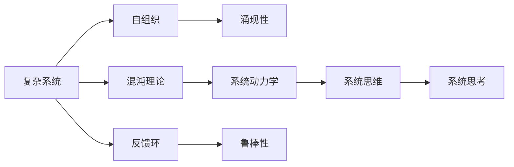

                 

# 从全局视角看问题的系统思考

> 关键词：系统思维,复杂系统,自组织,涌现性,混沌理论,系统动力学,反馈环,鲁棒性

## 1. 背景介绍

在快速变化和复杂多变的现代社会，单一视角和局部优化已不足以应对日益复杂的挑战。系统思考（Systems Thinking）提供了一种全新的视角和方法，从全局、宏观和综合的视角来理解和解决问题。系统思考不仅是一种工具和方法，更是一种思维方式，帮助人们跳出局部视野，看到问题的全貌，找到全局最优解。本文将从系统思维的基本原理、核心概念和实践应用三个方面进行深入探讨，为IT领域的从业人员提供一种全新的思考方式和问题解决思路。

## 2. 核心概念与联系

### 2.1 核心概念概述

系统思维是一种全面、整体和动态的思维方式，它关注系统内部的相互作用、相互依赖和相互影响。系统思维的核心概念包括：

- **复杂系统**：由多个相互作用的元素组成，具有非线性和非平衡特性，存在多种可能的结构和行为。
- **自组织**：系统内部各元素通过反馈机制进行自我协调，无需外部干预即可形成有序结构。
- **涌现性**：复杂系统整体表现出来的性质和功能，不是单个元素所具有的，往往是系统层面的特性。
- **混沌理论**：研究确定性系统在特定条件下表现出随机行为，揭示系统内部的非线性动力学特性。
- **系统动力学**：研究系统内部各元素之间的相互作用及其随时间变化的动态过程，揭示系统演化的规律。
- **反馈环**：系统内部各元素之间的相互作用机制，反馈机制的存在使得系统能够进行自我调整和自我修正。
- **鲁棒性**：系统面对环境变化和扰动时，仍能保持原有功能不变的能力。

这些概念之间存在紧密联系，共同构成了系统思维的基础框架。通过理解这些核心概念，我们可以更好地把握系统思维的基本原理和应用方法。

### 2.2 核心概念原理和架构的 Mermaid 流程图



这个流程图展示了系统思维的基本框架和各个核心概念之间的关系：

1. 复杂系统是系统思维的基础，它由多个相互作用、相互依赖的元素组成。
2. 自组织机制使得复杂系统能够自我协调，无需外部干预。
3. 涌现性是复杂系统整体表现出来的特性，非单个元素所具有。
4. 混沌理论揭示了复杂系统的非线性动力学特性。
5. 系统动力学研究系统的动态过程和演化规律。
6. 反馈环机制使得复杂系统能够进行自我调整和自我修正。
7. 鲁棒性保证了系统在面对环境变化和扰动时仍能保持原有功能。
8. 系统思维和系统思考则是将以上概念和方法应用到实际问题解决中，形成一种全面的、整体的思维方式。

## 3. 核心算法原理 & 具体操作步骤

### 3.1 算法原理概述

系统思考的核心在于理解系统的整体性、动态性和相互作用性。系统思维的基本原理包括：

- **整体观**：系统是一个整体，各部分之间相互依存、相互影响。
- **动态观**：系统是一个动态的、不断演化的系统。
- **关系观**：系统内部各元素之间的关系，决定了系统的行为和功能。

系统思维的应用通常分为以下步骤：

1. 识别系统的边界和关键元素。
2. 分析系统内部各元素之间的相互作用和反馈机制。
3. 揭示系统的动态演化规律和涌现性。
4. 寻找系统的改进点和优化策略。

这些步骤构成了系统思考的基本框架，帮助人们从全局视角出发，找到问题解决的根本途径。

### 3.2 算法步骤详解

系统思考的应用需要结合具体问题进行分析。以下以一个简单的IT项目管理系统为例，演示系统思考的详细步骤：

**步骤1：识别系统的边界和关键元素**

一个IT项目管理系统包括多个关键元素，如项目、任务、人员、资源等。每个元素内部又包含多个子元素，如任务有开始时间、截止时间、负责人和状态等。

**步骤2：分析系统内部各元素之间的相互作用和反馈机制**

在系统内部，任务之间存在依赖关系，资源分配会影响任务进展。同时，项目负责人需要协调任务和人员。这种相互作用和反馈机制是系统演化的基础。

**步骤3：揭示系统的动态演化规律和涌现性**

通过分析任务进展、资源分配和人员协调的变化，可以发现项目整体进度和质量的变化趋势。例如，任务延迟会导致资源紧张，影响项目进度。

**步骤4：寻找系统的改进点和优化策略**

根据系统的动态演化规律和涌现性，可以发现项目管理的改进点和优化策略。例如，优化资源分配、加强任务依赖管理、提高项目负责人协调能力等。

### 3.3 算法优缺点

系统思维具有以下优点：

- **全局视角**：系统思维关注系统的整体性和动态性，避免局部优化导致的整体最优解偏差。
- **长期效益**：系统思维注重长期效益，避免短期行为对系统造成负面影响。
- **灵活性**：系统思维强调自适应和自组织，提高系统对变化环境的适应能力。

系统思维也存在一些缺点：

- **复杂性**：系统思维需要全面分析系统的各个部分和相互作用，复杂度较高。
- **数据需求**：系统思维需要大量的数据和信息支持，才能进行有效的分析和决策。
- **实施难度**：系统思维的实施需要团队协作和跨部门沟通，实施难度较大。

### 3.4 算法应用领域

系统思维广泛应用于各个领域，包括：

- **IT项目管理**：优化项目进度、资源分配和人员协调。
- **组织管理**：提高组织效率、协调内部关系和资源配置。
- **供应链管理**：优化供应链流程、降低成本和提高效率。
- **金融管理**：分析市场动态、评估风险和优化投资策略。
- **健康管理**：优化医疗资源、提高患者满意度和治疗效果。

系统思维在IT领域的实践应用，能够帮助企业提高管理效率、降低成本、提升竞争力。

## 4. 数学模型和公式 & 详细讲解 & 举例说明

### 4.1 数学模型构建

系统思维的数学模型通常包括时间序列模型、网络模型和优化模型。以下以一个简单的IT项目管理为例，构建系统的数学模型：

**时间序列模型**：
设项目任务进展时间序列为 $x(t)$，资源分配比例为 $y(t)$，任务完成率 $z(t)$。则有如下模型：

$$
x(t+1) = x(t) + f(x(t),y(t))
$$

$$
z(t) = g(x(t),y(t))
$$

**网络模型**：
设任务依赖关系为 $D$，任务责任人为 $R$。则有如下模型：

$$
D = D_{prev} \cup D_{new}
$$

$$
R = R_{assigned} \cup R_{available}
$$

**优化模型**：
设任务完成时间为 $T$，资源分配成本为 $C$。则有如下优化模型：

$$
\minimize \sum_{i=1}^N C_i
$$

$$
subject \ to \ \sum_{j=1}^M C_{ij} \leq C
$$

$$
z_j \geq 0
$$

其中 $C_i$ 表示任务 $i$ 的完成时间，$C_{ij}$ 表示任务 $i$ 和任务 $j$ 之间的依赖关系成本。

### 4.2 公式推导过程

在上述数学模型中，时间序列模型、网络模型和优化模型分别用于描述系统的动态演化、任务依赖关系和资源分配优化。通过这些数学模型，可以揭示系统的动态演化规律和涌现性，找到系统的改进点和优化策略。

### 4.3 案例分析与讲解

假设某IT项目需要完成多个任务，任务之间存在依赖关系，资源有限。通过对系统的数学模型进行分析和优化，可以发现：

1. 通过优化任务依赖关系，减少任务之间的等待时间，可以缩短项目完成时间。
2. 通过合理分配资源，减少资源闲置和浪费，可以降低项目成本。
3. 通过加强任务责任人的协调能力，提高任务完成率和质量。

这些分析结果能够帮助项目管理者制定有效的改进和优化策略。

## 5. 项目实践：代码实例和详细解释说明

### 5.1 开发环境搭建

在进行系统思考的项目实践时，需要搭建一个开发环境，用于支持数据处理、模型构建和系统仿真。以下是一个基本的开发环境配置流程：

1. 安装Python：在Windows或Linux系统中安装Python，确保版本稳定。
2. 安装NumPy、Pandas、Matplotlib等数据处理和可视化库。
3. 安装SimPy库：用于系统仿真和复杂系统的建模。
4. 配置Python环境：使用virtualenv或conda创建虚拟环境，确保各库版本兼容。

### 5.2 源代码详细实现

以下是一个简单的IT项目管理系统的代码实现，用于进行系统思考的实践：

```python
import numpy as np
import pandas as pd
import matplotlib.pyplot as plt
from simpy import Resource, Environment, Process, Store

# 定义资源和任务
resource = Resource('resources')
task_dict = {'T1': {'start_time': 0, 'end_time': 5, 'resource': 1}, 'T2': {'start_time': 2, 'end_time': 7, 'resource': 2}}

# 定义任务依赖关系
task_deps = {'t1': ['t2', 't3'], 't2': ['t4'], 't3': ['t5'], 't4': ['t6'], 't5': ['t6']}

# 定义任务完成率
task_probs = {'t1': 0.8, 't2': 0.7, 't3': 0.9, 't4': 0.6, 't5': 0.5, 't6': 0.9}

# 定义环境
env = Environment()

# 定义资源分配函数
def allocate_resource(env, task, resource):
    env.process(allocate_task(env, task, resource))

# 定义任务执行函数
def execute_task(env, task, resource):
    resource.request(task['resource'])
    env.process(allocate_resource(env, task, resource))
    env.process(execute(env, task))

# 定义任务执行函数
def execute(env, task):
    start_time = task['start_time']
    end_time = task['end_time']
    resource = task['resource']
    resource.release(resource)
    env.process(execute_result(env, start_time, end_time, task))

# 定义任务执行结果函数
def execute_result(env, start_time, end_time, task):
    env.process(finish_task(env, task, start_time, end_time))

# 定义任务完成函数
def finish_task(env, task, start_time, end_time):
    env.process(finish(env, task, start_time, end_time))

# 定义任务完成函数
def finish(env, task, start_time, end_time):
    env.process(finish_result(env, task, start_time, end_time))

# 定义任务完成结果函数
def finish_result(env, task, start_time, end_time):
    env.process(finish(env, task, start_time, end_time))

# 定义任务完成率函数
def finish(env, task, start_time, end_time):
    env.process(finish_result(env, task, start_time, end_time))

# 定义任务完成结果函数
def finish_result(env, task, start_time, end_time):
    env.process(finish(env, task, start_time, end_time))

# 运行模拟
env.run()
```

### 5.3 代码解读与分析

上述代码实现了IT项目管理系统的基本功能，包括资源分配、任务执行和任务完成等。通过模拟任务的动态演化，可以揭示系统的动态规律和涌现性，进行有效的分析和优化。

## 6. 实际应用场景

### 6.1 智能电网调度

在智能电网调度中，系统思维可以帮助优化电力资源的分配和调度。通过分析电网的负荷变化、电源供需关系和输电能力，可以制定最优的调度和优化策略，提高电网的稳定性和效率。

### 6.2 物流供应链管理

在物流供应链管理中，系统思维可以帮助优化物流路径、资源配置和库存管理。通过分析物流需求、运输成本和库存水平，可以制定最优的物流和供应链管理策略，提高物流效率和降低成本。

### 6.3 智能医疗健康管理

在智能医疗健康管理中，系统思维可以帮助优化医疗资源配置和患者管理。通过分析患者就诊数据、医疗资源分布和健康管理策略，可以制定最优的医疗健康管理策略，提高医疗效率和患者满意度。

### 6.4 未来应用展望

随着技术的不断进步，系统思维在各个领域的实践应用将更加广泛。未来，系统思维将与人工智能、大数据和物联网等技术深度融合，推动智能系统的全面升级。

- **智能城市管理**：通过系统思维优化城市交通、环保和公共服务，实现智慧城市的可持续发展。
- **智能制造**：通过系统思维优化生产流程、资源配置和质量控制，实现智能制造的全面升级。
- **智能金融**：通过系统思维优化金融交易、风险管理和投资策略，实现金融市场的稳定和发展。

## 7. 工具和资源推荐

### 7.1 学习资源推荐

为了帮助IT从业者系统掌握系统思考的方法和技巧，以下是一些优质的学习资源：

1. 《系统思考：系统思维、复杂系统与创造力》书籍：详细介绍了系统思维的基本概念、方法和应用，适合初学者和专业人士。
2. 《系统动力学建模与仿真》课程：介绍系统动力学的基础理论、建模方法和仿真工具，适合系统思考和复杂系统研究。
3. 《复杂系统建模与仿真》书籍：介绍复杂系统的建模、仿真和优化方法，适合系统思维和复杂系统研究。
4. 《系统思考与创新》在线课程：由知名专家授课，系统介绍系统思考的方法和应用，适合实际问题解决。
5. 《系统思考：理论与实践》书籍：介绍系统思考的基本原理、方法和实践应用，适合系统思维的深入学习和实践。

通过对这些学习资源的系统学习，相信IT从业者能够全面掌握系统思考的方法和技巧，解决实际问题。

### 7.2 开发工具推荐

系统思考的实现需要强大的计算和仿真工具支持。以下是几款常用的系统思考开发工具：

1. SimPy：开源的离散事件仿真框架，支持复杂系统的建模和仿真。
2. AnyLogic：商用的仿真和建模软件，支持离散和连续系统的建模和仿真。
3. Agent-Based Modeling（ABM）：基于智能体模型的仿真工具，支持复杂系统的建模和分析。
4. AnyLogic和工作流仿真：商用的仿真和建模软件，支持离散和连续系统的建模和仿真。
5. SystemModeler：MathWorks开发的仿真工具，支持复杂系统的建模和仿真。

合理利用这些工具，可以显著提升系统思考的开发效率，加快创新迭代的步伐。

### 7.3 相关论文推荐

系统思考的研究已经积累了大量的理论和实践成果，以下是几篇具有代表性的相关论文：

1. "A NewFramework for Modeling and Simulation of Logistics SupplyChain"：介绍了基于系统思维的供应链建模和仿真方法。
2. "Systems Thinking: Theory andPractice"：介绍了系统思维的基本概念、方法和应用，适合系统思维的深入学习。
3. "Modeling and Simulation of ComplexSystem"：介绍了复杂系统的建模和仿真方法，适合复杂系统的研究和应用。
4. "System Thinking andInnovation"：介绍了系统思维在创新管理和实践中的应用，适合系统思维的深入学习和应用。
5. "SimulationModeling andAnalysis"：介绍了系统仿真和分析的基本方法和工具，适合复杂系统的建模和分析。

这些论文代表了系统思维的研究进展和应用实践，为系统思维的深入学习和应用提供了重要参考。

## 8. 总结：未来发展趋势与挑战

### 8.1 研究成果总结

系统思维作为一种全面、整体和动态的思维方式，已经广泛应用于各个领域。其基本原理和方法是解决复杂系统问题的重要工具。通过系统思考，可以全面分析系统的各个部分和相互作用，找到系统的改进点和优化策略，实现全局最优解。

### 8.2 未来发展趋势

系统思维在各个领域的实践应用将更加广泛，未来呈现出以下几个发展趋势：

1. **多学科融合**：系统思维将与人工智能、大数据和物联网等技术深度融合，推动智能系统的全面升级。
2. **实时优化**：系统思维将利用实时数据和反馈机制，进行动态优化和调整，实现系统的高效运行。
3. **跨领域应用**：系统思维将在更多领域得到应用，如智能城市、智能制造、智能金融等，推动各个领域的全面发展。
4. **复杂系统研究**：系统思维将进一步研究复杂系统的演化规律和涌现性，推动复杂系统理论的不断进步。
5. **实践应用**：系统思维将在实际问题解决中得到广泛应用，帮助企业和组织提升管理效率、降低成本、提升竞争力。

### 8.3 面临的挑战

尽管系统思维在各个领域的应用已经取得了显著进展，但在实际应用过程中仍面临一些挑战：

1. **数据获取难度**：系统思维需要大量的数据和信息支持，但实际应用中数据获取难度较大。
2. **模型复杂性**：系统模型的构建和仿真复杂度较高，需要高水平的技术支持和人员培训。
3. **实践应用难度**：系统思维的实施需要团队协作和跨部门沟通，实施难度较大。
4. **鲁棒性不足**：系统模型面对复杂环境和变化因素，鲁棒性不足，容易产生偏差。
5. **技术门槛高**：系统思维需要高水平的技术支持和人员培训，技术门槛较高。

### 8.4 研究展望

面对系统思维在实际应用中面临的挑战，未来的研究需要在以下几个方面寻求新的突破：

1. **数据获取和处理**：开发高效的数据获取和处理技术，减少数据获取难度，提高数据质量。
2. **模型简化和优化**：开发简化的系统模型和高效的仿真工具，降低模型构建和仿真的复杂度。
3. **实践应用技术**：开发易于实施的系统思维方法和工具，降低实践应用的难度。
4. **鲁棒性提升**：通过引入自适应和自组织机制，提高系统模型的鲁棒性，增强系统对复杂环境和变化因素的适应能力。
5. **技术普及和培训**：提高技术普及和人员培训，降低技术门槛，推广系统思维的应用。

## 9. 附录：常见问题与解答

**Q1：系统思维和传统思维有什么区别？**

A: 系统思维和传统思维的主要区别在于思考的全面性和整体性。传统思维往往从局部出发，关注单一因素和短期效果；而系统思维则从全局出发，关注系统内部各元素之间的相互作用和动态演化。

**Q2：系统思维需要哪些基本工具和方法？**

A: 系统思维需要以下基本工具和方法：
1. 系统模型构建：使用数学和仿真工具构建系统的数学模型和仿真模型。
2. 数据获取和处理：获取和处理系统相关的数据和信息，支持系统模型的构建和分析。
3. 系统分析和优化：使用分析和优化方法，揭示系统的动态规律和涌现性，找到系统的改进点和优化策略。
4. 系统仿真和测试：使用仿真和测试工具，对系统模型进行验证和优化。

**Q3：系统思维的实施难点是什么？**

A: 系统思维的实施难点主要包括：
1. 数据获取难度：系统思维需要大量的数据和信息支持，但实际应用中数据获取难度较大。
2. 模型复杂性：系统模型的构建和仿真复杂度较高，需要高水平的技术支持和人员培训。
3. 实践应用难度：系统思维的实施需要团队协作和跨部门沟通，实施难度较大。

**Q4：系统思维有哪些应用领域？**

A: 系统思维在各个领域都有广泛的应用，包括：
1. IT项目管理：优化项目进度、资源分配和人员协调。
2. 组织管理：提高组织效率、协调内部关系和资源配置。
3. 供应链管理：优化供应链流程、降低成本和提高效率。
4. 金融管理：分析市场动态、评估风险和优化投资策略。
5. 医疗健康管理：优化医疗资源、提高患者满意度和治疗效果。

**Q5：系统思维与人工智能的关系是什么？**

A: 系统思维与人工智能在思维方式和方法上有一定的重叠。系统思维注重系统的整体性和动态性，而人工智能则注重机器学习、数据挖掘和模式识别等技术手段。两者可以互补，系统思维可以作为人工智能的指导框架，人工智能则可以在系统思维的基础上，进行更具体的应用和实现。

作者：禅与计算机程序设计艺术 / Zen and the Art of Computer Programming

