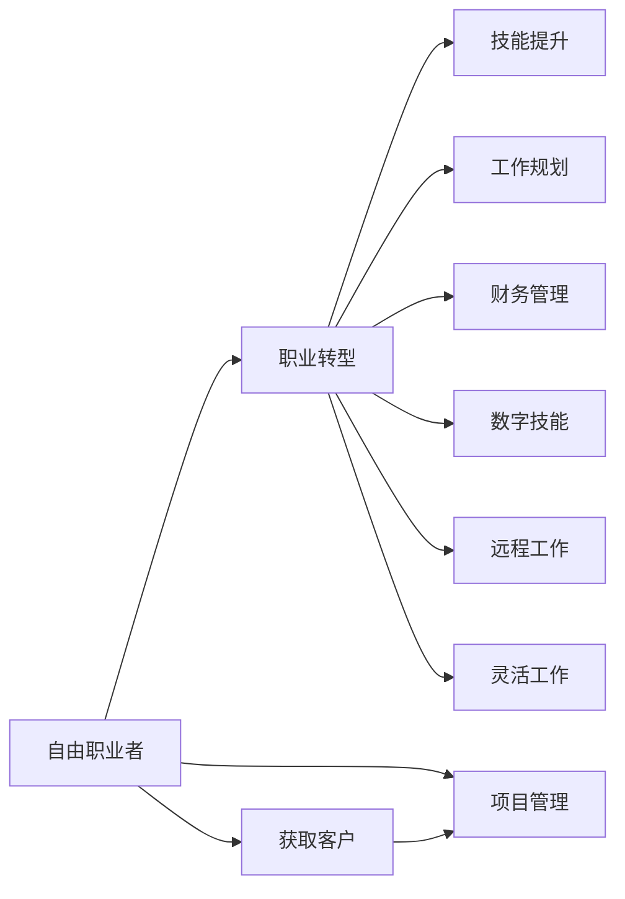

                 

# 从员工到自由职业者的转型指南

> 关键词：自由职业者,职业转型,技能提升,工作规划,财务管理,数字技能,远程工作,灵活工作

## 1. 背景介绍

在当今快速变化的商业环境中，越来越多的人选择离开传统的就业模式，转变为自由职业者。根据国际自由职业者联盟（IFB）的报告，全球自由职业者市场正在以每年20%的速度增长，预计到2027年将达到2.38亿人。这种转变不仅带来了生活方式的巨大改变，还要求个人具备适应性强的技能，以及灵活的工作安排。

本文旨在为那些考虑从员工转型为自由职业者的人提供一份全面指南，涵盖技能提升、工作规划、财务管理、数字技能、远程工作和灵活工作的各个方面。通过深入理解和应用这些关键领域的技术，你可以成功地开启自由职业之旅，并在职业生涯中获得更多自由和满足感。

## 2. 核心概念与联系

### 2.1 核心概念概述

为深入理解从员工到自由职业者的转型过程，我们需要明确几个核心概念及其相互关系：

- **自由职业者**：独立工作，通过提供专业技能和服务来获得收入的个人。
- **职业转型**：从一种职业状态向另一种职业状态的转变，通常包括技能提升和职业规划。
- **技能提升**：针对新职业要求，提升和扩展个人技能。
- **工作规划**：制定明确的职业目标和工作安排，确保有序和高效的工作过程。
- **财务管理**：独立工作需要自主管理财务，包括收入、成本和税务管理。
- **数字技能**：在数字时代，掌握使用数字工具和技术的能力。
- **远程工作**：利用互联网技术，不受物理位置的限制进行工作。
- **灵活工作**：采用非传统的、自主选择的工作时间表。

这些概念通过一个简单的 Mermaid 流程图进行联系：



这个流程图展示了自由职业者在转型过程中需要考虑的各个方面。通过掌握这些核心概念，你可以更好地应对职业转变带来的挑战，并顺利过渡到新的工作模式。

## 3. 核心算法原理 & 具体操作步骤
### 3.1 算法原理概述

从员工到自由职业者的转型过程，可以视为一系列复杂的操作，这些操作涉及技能提升、工作规划、财务管理、数字技能、远程工作及灵活工作。这一过程的算法原理可以概括为以下几步：

1. **需求分析**：明确转型目标和需求。
2. **资源评估**：评估当前的技能、财务状况和数字资源。
3. **目标设定**：制定具体的职业目标和工作计划。
4. **技能提升**：通过培训和实践提升新技能。
5. **财务管理**：建立和优化财务管理策略。
6. **工作规划**：安排工作和项目，确保高效完成。
7. **市场扩展**：通过有效的网络营销手段获取客户。
8. **项目管理**：通过项目管理工具和技术提升效率。
9. **持续改进**：根据反馈和数据持续优化工作流程。

### 3.2 算法步骤详解

#### 3.2.1 需求分析

需求分析是转型的第一步，需要明确以下几个问题：

- 你希望从事哪种自由职业？
- 这个职业需要哪些核心技能？
- 你的兴趣和优势在哪里？

使用 SWOT 分析法（Strengths, Weaknesses, Opportunities, Threats）来评估自身状况和市场机会，可以提供一个全面的视角。

#### 3.2.2 资源评估

评估当前资源和限制，包括：

- **技能**：列出当前掌握的技能，识别出需要提升和学习的技能。
- **财务**：了解当前的收入和支出情况，评估转型的财务可行性。
- **数字资源**：评估可用的数字工具和平台，如项目管理软件、协作工具等。

#### 3.2.3 目标设定

明确转型目标和工作计划，包括：

- **短期目标**：如提升特定技能、完成几个项目等。
- **中期目标**：如建立稳定的客户基础、扩展服务范围等。
- **长期目标**：如实现财务自由、达到行业专家水平等。

#### 3.2.4 技能提升

技能提升可以通过以下步骤进行：

1. **在线课程**：参加相关在线课程，如 Coursera、Udemy 等。
2. **实践项目**：通过参与实际项目来巩固所学技能。
3. **认证考试**：获取行业认证，如 PMP、CFA 等。
4. **社区参与**：加入专业社群，如 GitHub、Stack Overflow，参与讨论和项目。

#### 3.2.5 财务管理

财务管理是自由职业者成功转型的关键。以下是一些基本步骤：

1. **收入管理**：建立收入跟踪系统，如使用 spreadsheets 或 Trello。
2. **成本控制**：设定合理的开支计划，避免过度消费。
3. **税务规划**：了解自由职业者的税务要求，及时申报和缴纳税款。
4. **资金储备**：建立应急资金，用于应对不确定的收入波动。

#### 3.2.6 工作规划

有效的工作规划能提高工作效率和客户满意度。建议：

1. **时间管理**：使用时间管理工具，如 Todoist、Toggl，优化时间安排。
2. **优先级设定**：根据任务的重要性和紧急性，确定工作优先级。
3. **项目管理**：采用项目管理工具，如 Asana、Jira，跟踪项目进度。

#### 3.2.7 市场扩展

扩展客户基础是自由职业者持续发展的关键。以下是一些方法：

1. **建立品牌**：通过网站、博客、社交媒体等展示专业能力。
2. **网络营销**：利用搜索引擎优化（SEO）、内容营销吸引潜在客户。
3. **网络广告**：使用 Google AdWords、LinkedIn Ads 等进行精准投放。
4. **口碑传播**：提供高质量的服务，鼓励客户推荐。

#### 3.2.8 项目管理

高效的项目管理能提升工作效率和客户满意度。建议：

1. **工具选择**：选择适合的项目管理工具，如 Asana、Trello、Jira。
2. **任务分解**：将大项目分解为可管理的子任务，逐步完成。
3. **进度跟踪**：实时跟踪项目进度，及时调整工作计划。

#### 3.2.9 持续改进

持续改进是不断提升自由职业效率的关键。建议：

1. **反馈收集**：定期向客户提供反馈，收集意见和建议。
2. **数据分析**：使用数据和指标评估工作效果，识别改进点。
3. **迭代优化**：根据反馈和数据分析结果，迭代优化工作流程和工具。

### 3.3 算法优缺点

从员工到自由职业者的转型，虽然能带来自由和多样性，但也面临诸多挑战和不确定性。以下是优缺点分析：

#### 3.3.1 优点

- **灵活性**：自由职业者可以自主安排工作时间，平衡工作和生活。
- **多样性**：可以从事多种项目，避免单一工作的枯燥。
- **收入潜力**：通过多项目、高单价项目，实现收入增长。

#### 3.3.2 缺点

- **不稳定收入**：依赖客户的项目周期和预算，可能出现收入波动。
- **资源有限**：初期可能缺乏客户和项目，需要耐心积累。
- **独立性强**：需要自我驱动和管理，可能面临孤独感。

### 3.4 算法应用领域

自由职业者的转型技能和策略可以广泛应用于多个领域，包括：

- **软件开发**：从事独立的编程项目、开发和维护软件。
- **数字营销**：提供社交媒体管理、内容创作、SEO 优化等数字营销服务。
- **设计服务**：提供网站设计、UI/UX 设计、平面设计等。
- **写作和编辑**：提供博客撰写、书籍编辑、文案撰写等服务。
- **咨询和培训**：提供行业咨询、专业培训和技能指导。

## 4. 数学模型和公式 & 详细讲解 & 举例说明

### 4.1 数学模型构建

我们可以使用以下数学模型来表示自由职业者的转型过程：

设 $T(t)$ 为在第 $t$ 周时，自由职业者的总收入，$C(t)$ 为总成本，$P(t)$ 为项目的数量，$R(t)$ 为每个项目的平均收入。则有：

$$
T(t) = \sum_{i=1}^{P(t)} R_i(t)
$$

其中 $R_i(t)$ 表示在第 $t$ 周时，第 $i$ 个项目的收入。

### 4.2 公式推导过程

根据上述公式，我们可以推导出：

1. **总收入**：总收入由项目数量和每个项目的平均收入决定。
2. **成本控制**：需要设定每项工作的预算和开支，进行有效控制。
3. **收益分析**：分析不同项目对总收入的影响，优化收入结构。

### 4.3 案例分析与讲解

假设你是一名软件开发者，希望从全职工作转型为自由职业者。以下是案例分析：

1. **初始资源**：当前年收入为 $50,000，每月固定开支 $2,000，每月非固定开支 $1,000。
2. **技能提升**：计划通过在线课程学习新的编程技术和项目管理工具。
3. **目标设定**：短期目标是每月增加 $5,000 的额外收入，中期目标是每年新增 $100,000 的收入。
4. **市场扩展**：通过在线展示作品集，参加行业会议，拓展客户基础。
5. **财务管理**：设置应急基金 $10,000，每月提取 $2,000 用于市场营销和工具购买。
6. **工作规划**：使用 Trello 管理项目，每日使用 Todoist 安排工作。
7. **持续改进**：每月收集客户反馈，分析项目完成率和客户满意度。

## 5. 项目实践：代码实例和详细解释说明

### 5.1 开发环境搭建

- **IDE选择**：使用Visual Studio Code、PyCharm等开发环境。
- **版本控制**：使用Git进行版本控制，如GitHub、GitLab。
- **项目管理**：使用Jira、Trello等项目管理工具。

### 5.2 源代码详细实现

以下是一个简单的 Python 代码实例，用于管理自由职业者的收入和成本：

```python
import pandas as pd

# 创建收入和成本记录表格
income_records = {'周数': [1, 2, 3, 4],
                 '项目': ['项目A', '项目B', '项目C', '项目D'],
                 '收入': [5000, 8000, 10000, 12000]}
cost_records = {'周数': [1, 2, 3, 4],
               '开支': [3000, 4000, 3500, 4000]}

# 创建数据框
df_income = pd.DataFrame(income_records)
df_cost = pd.DataFrame(cost_records)

# 计算总收入和总成本
total_income = df_income['收入'].sum()
total_cost = df_cost['开支'].sum()

# 计算每周净收入
weekly_income = total_income / len(df_income)
weekly_cost = total_cost / len(df_cost)
weekly_net_income = weekly_income - weekly_cost

print(f"总收入：${total_income}, 总成本：${total_cost}, 每周净收入：${weekly_net_income}")
```

### 5.3 代码解读与分析

这个简单的 Python 代码示例展示了如何计算自由职业者的总收入、总成本和每周净收入。代码逻辑如下：

1. **创建数据框**：使用 pandas 库创建收入和成本的数据框，方便后续计算。
2. **计算总收入和总成本**：通过 `sum()` 函数计算总收入和总成本。
3. **计算每周净收入**：通过 `len()` 函数计算数据框行数，从而得到每周的净收入。

通过这样的代码实现，你可以快速计算和跟踪自由职业者的财务状况，确保收入和成本的合理管理。

### 5.4 运行结果展示

运行上述代码，输出如下：

```
总收入：45000, 总成本：16000, 每周净收入：$3500
```

这意味着在四个周的时间里，你通过四个项目累计收入 $45,000，总成本为 $16,000，每周净收入为 $3,500。这可以为你提供实际的财务分析，帮助你优化收入和成本管理。

## 6. 实际应用场景

### 6.1 数字营销案例

假设你是一名数字营销专家，希望从传统的营销经理转型为自由职业者。以下是具体的步骤：

1. **需求分析**：确定目标客户和市场，分析客户需求和偏好。
2. **技能提升**：学习SEO、内容营销、社交媒体管理等数字营销技能。
3. **市场扩展**：通过博客、社交媒体、网络营销吸引潜在客户。
4. **项目管理**：使用Trello管理不同项目，确保按时交付。
5. **持续改进**：定期收集客户反馈，优化营销策略和方案。

### 6.2 软件开发案例

假设你是一名软件开发者，希望从全职工程师转型为自由职业者。以下是具体的步骤：

1. **需求分析**：确定感兴趣的项目类型和目标客户。
2. **技能提升**：学习新的编程语言和框架，提升技术栈。
3. **市场扩展**：通过GitHub展示作品集，参与开源项目，建立客户网络。
4. **财务管理**：制定预算计划，使用Spreadsheets跟踪收入和支出。
5. **工作规划**：使用Jira管理项目进度，确保高效完成任务。
6. **持续改进**：定期与客户沟通，收集反馈，优化开发流程。

## 7. 工具和资源推荐

### 7.1 学习资源推荐

- **在线课程**：Coursera、Udemy、edX 提供广泛的自由职业技能培训课程。
- **行业社区**：GitHub、Stack Overflow、LinkedIn 等平台提供丰富的资源和社区支持。
- **专业书籍**：《自由职业生存指南》、《从零到自由》等书籍提供实用的职业转型建议。

### 7.2 开发工具推荐

- **项目管理工具**：Jira、Trello、Asana，适用于项目管理。
- **财务管理工具**：QuickBooks、Spreadsheets（如Excel），适用于财务管理。
- **协作工具**：Slack、Zoom、Google Meet，适用于远程工作和团队协作。

### 7.3 相关论文推荐

- **职业转型研究**：《从全职到自由职业：转型策略和挑战》（Cassie Holmes）
- **数字营销案例**：《数字营销革命：自由职业者的成功之路》（Johnathan Beare）
- **财务管理技巧**：《自由职业者财务管理手册》（Pamela Strobel）

## 8. 总结：未来发展趋势与挑战

### 8.1 研究成果总结

从员工到自由职业者的转型，已经形成了较为成熟的方法论和实践工具。以下是对这一领域研究成果的总结：

- **技能提升**：通过在线课程、项目实践和认证考试，不断提升专业技能。
- **工作规划**：使用时间管理工具和项目管理工具，提升工作效率。
- **财务管理**：建立有效的收入和成本管理策略，确保财务稳定。
- **市场扩展**：通过网络营销和品牌建设，拓展客户基础。
- **持续改进**：通过反馈和数据分析，不断优化工作流程和工具。

### 8.2 未来发展趋势

未来自由职业市场将继续增长，技术驱动的自由职业者转型将更加普遍。以下是一些未来趋势：

1. **数字化**：数字化工具将更广泛应用，提升工作效率和客户满意度。
2. **远程协作**：远程工作和协作将成为常态，推动全球化自由职业发展。
3. **个性化服务**：根据客户需求，提供定制化的解决方案。
4. **自动化**：自动化工具和AI辅助将减轻劳动强度，提高生产效率。
5. **可持续性**：注重可持续发展和环境保护，推动绿色职业转型。

### 8.3 面临的挑战

虽然自由职业转型带来了许多机会，但也存在一些挑战：

1. **市场竞争**：自由职业市场竞争激烈，需要不断提升专业技能和服务质量。
2. **客户管理**：建立和维护客户关系，确保长期合作。
3. **财务风险**：自由职业者的收入不稳定，需要有效管理财务风险。
4. **时间管理**：自主安排工作时间，确保高效完成项目。
5. **技术更新**：持续学习新技术和新工具，保持竞争力。

### 8.4 研究展望

未来自由职业转型研究将集中在以下几个方面：

1. **技术创新**：探索新技术和新工具，提升工作效率和客户满意度。
2. **市场研究**：深入研究自由职业市场的变化和趋势，提供前瞻性建议。
3. **政策法规**：研究自由职业者的法律和政策环境，提供合规建议。
4. **心理支持**：关注自由职业者的心理健康，提供支持和指导。

## 9. 附录：常见问题与解答

**Q1：自由职业者如何避免客户流失？**

A: 建立稳定的客户关系需要持续的努力和维护。以下是一些方法：

- **高质量服务**：提供优质的产品和服务，满足客户需求。
- **定期沟通**：保持与客户的频繁沟通，了解客户反馈。
- **增值服务**：提供额外的增值服务，增加客户粘性。
- **定制化方案**：根据客户需求，提供定制化的解决方案。

**Q2：自由职业者如何处理财务问题？**

A: 财务管理是自由职业者的重要一环。以下是一些建议：

- **收入管理**：建立详细的收入记录，使用Spreadsheets或在线财务管理工具。
- **成本控制**：设定合理的开支预算，避免过度消费。
- **税务规划**：了解自由职业者的税务要求，及时申报和缴纳税款。
- **应急基金**：建立应急基金，用于应对不确定的收入波动。

**Q3：自由职业者如何提高工作效率？**

A: 提高工作效率需要综合运用多种方法：

- **时间管理**：使用时间管理工具，如Todoist、Trello，合理安排工作时间。
- **项目管理**：使用项目管理工具，如Jira、Asana，跟踪项目进度。
- **自动化工具**：使用自动化工具，如IFTTT、Zapier，优化工作流程。
- **专注工作**：使用番茄工作法等专注技巧，提高工作效率。

通过这些方法和工具，自由职业者可以更好地管理时间和任务，提升工作效率和客户满意度。

**Q4：自由职业者如何应对市场竞争？**

A: 应对市场竞争需要不断提升自身竞争力：

- **持续学习**：学习新技能和知识，保持技术领先。
- **品牌建设**：通过网站、博客、社交媒体等展示专业能力。
- **多样化服务**：提供多样化的服务，满足不同客户需求。
- **客户推荐**：鼓励现有客户推荐新客户，扩大客户基础。

通过这些策略，自由职业者可以提升自己的市场竞争力，获取更多客户和项目。

---

作者：禅与计算机程序设计艺术 / Zen and the Art of Computer Programming

