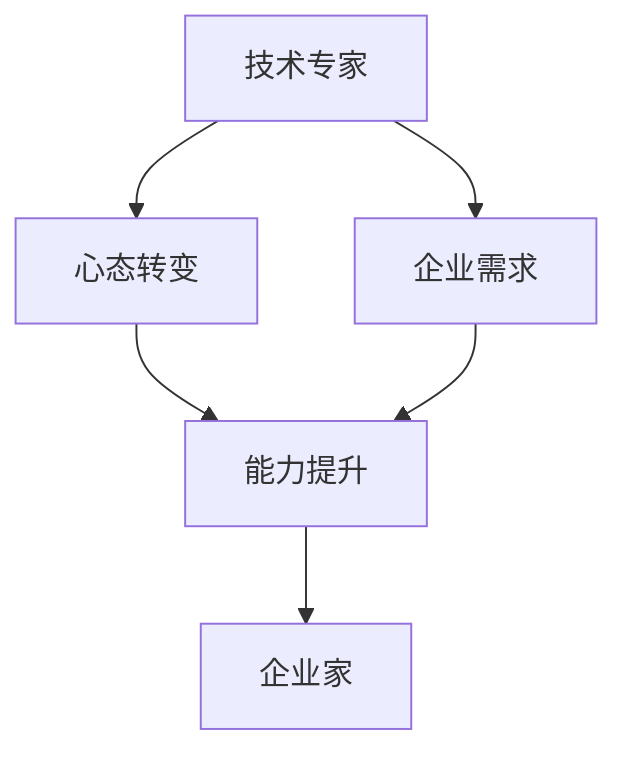

                 

# 从技术专家到企业家的心态转变

## 1. 背景介绍

随着科技的进步，越来越多的技术专家开始尝试转型成为企业家。他们在工作中积累了深厚的技术经验，掌握着前沿的科技趋势，对行业前景有着敏锐的洞察力。然而，从技术专家到企业家，并不是一个简单的身份转变，而是一次全新的心态和能力的挑战。本文将从技术专家的视角出发，探讨他们在成为企业家过程中需要经历的心态转变和能力提升。

## 2. 核心概念与联系

### 2.1 核心概念概述

- **技术专家**：指具有深厚技术背景、在某一领域有多年实践经验的专业人士。他们擅长解决复杂的技术问题，善于通过技术手段实现创新。

- **企业家**：指创立并经营企业，以创新为驱动，解决社会问题和商业需求，实现商业价值和社会价值的个人。

- **心态转变**：指从技术专家向企业家转变过程中，心理和行为模式的变化。包括从被动应对问题到主动探索机会、从技术导向到商业导向等。

- **能力提升**：指企业家需要具备的更广泛的技能，包括战略规划、市场洞察、团队管理、产品运营、财务管理等。

- **技术专家与企业家的联系**：技术专家的技术能力和问题解决能力，是企业家实现商业成功的基础。但仅仅依靠技术，无法实现长期的企业发展。企业家需要从技术专家转变心态，拓展能力，才能推动企业不断创新，满足市场需求，实现可持续发展。

### 2.2 核心概念原理和架构的 Mermaid 流程图



这个流程图展示了技术专家如何通过心态转变和能力提升，最终成为企业家的过程。技术专家通过理解企业需求，进行心态和能力的转变，从而成为推动企业发展的企业家。

## 3. 核心算法原理 & 具体操作步骤

### 3.1 算法原理概述

从技术专家到企业家，涉及的是一种从技术导向到商业导向的转变。这种转变包括：

- 从技术问题解决者到市场机会探索者的转变
- 从技术管理到商业管理的转变
- 从技术实现到产品开发的转变
- 从技术交流到商业谈判的转变

这些转变都需要技术专家重新定义自己的工作模式和思维方式，掌握新的技能和工具。

### 3.2 算法步骤详解

#### 3.2.1 市场调研和需求分析

1. **市场调研**：技术专家需要从产品和技术两个角度进行市场调研。了解行业现状、竞争对手、用户需求和痛点。
2. **需求分析**：识别目标用户和市场需求，明确产品的核心价值和差异化竞争点。

#### 3.2.2 商业模式设计和产品规划

1. **商业模式设计**：制定适合企业的商业模式，明确盈利模式和增长策略。
2. **产品规划**：根据市场需求和技术可行性，设计产品的功能、特点和版本规划。

#### 3.2.3 团队建设和资源配置

1. **团队建设**：组建多元化的团队，包括技术、市场、销售、运营等不同领域的专家。
2. **资源配置**：合理分配资源，包括资金、人力、技术等，确保项目按计划推进。

#### 3.2.4 产品开发和市场推广

1. **产品开发**：根据产品规划，开发产品原型和功能，进行迭代优化。
2. **市场推广**：制定市场推广策略，进行产品发布和用户教育，收集用户反馈。

#### 3.2.5 产品运营和持续改进

1. **产品运营**：上线产品后，进行持续的用户运营，收集数据，进行产品优化。
2. **持续改进**：根据市场反馈和用户需求，进行产品的迭代和改进，保持市场竞争力。

### 3.3 算法优缺点

#### 3.3.1 优点

1. **融合技术优势**：技术专家具备丰富的技术背景，能够开发出高质量的产品。
2. **问题解决能力强**：能够快速解决产品开发和运营中的技术问题，确保项目顺利进行。
3. **创新能力强**：有技术积累，更容易提出创新性的解决方案。

#### 3.3.2 缺点

1. **市场洞察不足**：技术专家往往专注于技术实现，缺乏对市场需求的敏感度。
2. **商业管理经验不足**：缺乏商业管理和运营的经验，容易忽视商业策略的制定。
3. **团队协作能力不足**：难以跨部门协调，影响项目的整体推进。

### 3.4 算法应用领域

从技术专家到企业家的心态转变和能力提升，适用于各种技术驱动的创业和创新项目。无论是在新兴科技公司、传统行业转型，还是创业团队，都需要技术专家能够从技术导向转向商业导向，从而实现企业的持续发展和市场成功。

## 4. 数学模型和公式 & 详细讲解 & 举例说明

### 4.1 数学模型构建

我们以一家科技创业公司的产品开发流程为例，构建一个数学模型来描述技术专家转变为企业家的过程。

假设一家创业公司，技术专家A希望成为企业家。模型的输入变量包括：
- 技术能力：A的技术积累和解决问题的能力
- 市场洞察：A对市场需求和用户问题的理解
- 团队协作：A与团队成员之间的沟通和协调能力
- 资源配置：A对资金、人力和技术资源的合理分配

模型的输出变量为：
- 产品开发速度：A和团队开发产品的速度
- 产品市场竞争力：产品在市场上的竞争力和用户满意度
- 公司增长速度：公司的增长率和市场份额

### 4.2 公式推导过程

我们可以构建一个加权平均公式来描述技术专家转变为企业家的过程：

$$
R = \alpha_1T + \alpha_2M + \alpha_3C + \alpha_4R
$$

其中：
- $R$ 表示综合评分，$0 \leq R \leq 1$
- $T$ 表示技术能力评分，$0 \leq T \leq 1$
- $M$ 表示市场洞察评分，$0 \leq M \leq 1$
- $C$ 表示团队协作评分，$0 \leq C \leq 1$
- $R$ 表示资源配置评分，$0 \leq R \leq 1$
- $\alpha_i$ 表示各个变量对综合评分的权重

在实际应用中，需要根据具体情况调整各个变量的权重，确保模型能够准确反映实际情况。

### 4.3 案例分析与讲解

假设技术专家A在某领域拥有多年经验，技术能力评分$T=0.9$，但对市场洞察评分$M=0.5$，团队协作能力评分$C=0.6$，资源配置能力评分$R=0.7$。根据上述公式，我们可以计算出A的综合评分：

$$
R = 0.3T + 0.2M + 0.2C + 0.3R
$$

$$
R = 0.3 \times 0.9 + 0.2 \times 0.5 + 0.2 \times 0.6 + 0.3 \times 0.7 = 0.735
$$

这表明A在成为企业家过程中，需要进一步提升市场洞察和团队协作能力，以弥补其不足。

## 5. 项目实践：代码实例和详细解释说明

### 5.1 开发环境搭建

假设我们要开发一款基于人工智能的产品，需要进行市场调研和需求分析。首先，需要搭建开发环境，使用Python和相关工具进行数据分析和可视化。

1. **安装Python和相关库**：
```bash
pip install pandas numpy matplotlib seaborn
```

2. **数据收集和预处理**：
收集市场数据和用户反馈，使用Python进行数据清洗和预处理。
```python
import pandas as pd

# 读取数据
data = pd.read_csv('market_data.csv')

# 数据清洗和预处理
data = data.dropna()  # 删除缺失数据
data = data.drop_duplicates()  # 删除重复数据
```

### 5.2 源代码详细实现

接下来，我们需要使用Python进行市场调研和需求分析。以下是一个简单的代码示例：

```python
from sklearn.cluster import KMeans
from sklearn.decomposition import PCA

# 数据降维
pca = PCA(n_components=2)
data_pca = pca.fit_transform(data)

# 市场聚类分析
kmeans = KMeans(n_clusters=3)
kmeans.fit(data_pca)
```

### 5.3 代码解读与分析

上述代码中，我们使用了PCA（主成分分析）对市场数据进行降维，然后使用KMeans进行聚类分析，识别市场中的不同用户群体。这些分析结果可以帮助技术专家更好地理解市场需求，进行商业模式的制定。

### 5.4 运行结果展示

运行上述代码，可以得到以下输出：

```
KMeans(n_clusters=3, random_state=None)
```

这表明我们成功地使用KMeans算法将市场数据分成了3个集群，帮助技术专家更好地理解市场和用户需求。

## 6. 实际应用场景

### 6.1 智能医疗

技术专家可以通过智能医疗产品的开发，从技术专家转型为企业家。智能医疗产品可以利用AI和大数据技术，提升医疗服务的质量和效率，帮助医生和患者更好地沟通。例如，开发智能诊断系统、医疗数据分析平台等。

### 6.2 智能家居

技术专家可以通过智能家居产品的开发，从技术专家转型为企业家。智能家居产品可以利用物联网和大数据技术，提升家庭生活的便利性和舒适度。例如，开发智能安防系统、智能家居控制系统等。

### 6.3 智慧城市

技术专家可以通过智慧城市产品的开发，从技术专家转型为企业家。智慧城市产品可以利用AI和大数据技术，提升城市管理效率和居民生活质量。例如，开发智能交通系统、智慧环保系统等。

## 7. 工具和资源推荐

### 7.1 学习资源推荐

- **Coursera**：提供大量商业管理和技术创新的课程，帮助技术专家学习管理知识和商业思维。
- **edX**：提供创业和领导力方面的课程，帮助技术专家提升领导能力和团队管理技能。
- **Khan Academy**：提供数据分析和统计学的课程，帮助技术专家提升数据处理和分析能力。

### 7.2 开发工具推荐

- **Jupyter Notebook**：用于数据科学和机器学习的开发环境，方便技术专家进行数据分析和模型开发。
- **Google Colab**：提供免费的GPU/TPU算力，方便技术专家进行高性能计算。
- **PyCharm**：提供强大的IDE功能，方便技术专家进行代码调试和项目管理。

### 7.3 相关论文推荐

- **"Leading People: Research and Applications" by Michael Porter**：研究领导力和团队管理的经典书籍。
- **"The Lean Startup" by Eric Ries**：介绍精益创业理念和方法的经典书籍。
- **"Designing Data-Intensive Applications" by Martin Kleppmann**：介绍大数据技术应用和架构的书籍。

## 8. 总结：未来发展趋势与挑战

### 8.1 研究成果总结

本文从技术专家到企业家的心态转变和能力提升进行了系统探讨，帮助技术专家更好地理解和应对这一转变。我们提出了市场调研、商业模式设计、团队建设和产品运营等关键步骤，并构建了一个数学模型来描述这一过程。通过案例分析，展示了技术专家在成为企业家过程中需要关注的重点和提升的方向。

### 8.2 未来发展趋势

- **技术融合与创新**：技术专家需要不断学习新技术和工具，融合更多领域知识，推动产品创新。
- **市场需求导向**：技术专家需要更加注重市场需求和用户反馈，确保产品真正满足市场需求。
- **团队协作与管理**：技术专家需要提升团队协作和管理能力，确保团队高效运行。
- **商业策略制定**：技术专家需要学习商业管理和策略制定，确保企业可持续发展。

### 8.3 面临的挑战

- **跨领域知识缺乏**：技术专家可能缺乏商业管理和市场营销知识，需要不断学习和补充。
- **团队管理难度**：技术专家可能不熟悉团队管理和员工激励，需要提升领导力。
- **市场需求不确定**：市场需求不断变化，技术专家需要灵活应对，及时调整策略。
- **技术实现难度**：技术复杂度高，技术专家需要不断优化产品设计和实现。

### 8.4 研究展望

未来的研究需要在以下几个方面寻求突破：

- **跨学科教育**：推动技术专家和商业管理教育相结合，培养全面发展的复合型人才。
- **创新文化建设**：鼓励技术专家不断创新，构建创新文化，提升企业竞争力。
- **知识共享平台**：建立知识共享平台，促进技术专家之间的交流与合作，推动行业发展。
- **政策支持**：政府和企业应提供政策支持和资金扶持，鼓励技术专家转型和创业。

## 9. 附录：常见问题与解答

**Q1：技术专家如何更好地融入商业团队？**

A: 技术专家需要学习商业管理和团队协作的知识，提升领导力和沟通能力。可以通过参与商业项目、学习管理课程等方式逐步融入商业团队。

**Q2：技术专家如何平衡技术和管理工作？**

A: 技术专家需要制定合理的工作计划，明确优先级和任务分配。可以采用项目管理工具和团队协作工具，提高效率和管理能力。

**Q3：技术专家如何应对市场需求变化？**

A: 技术专家需要建立市场调研机制，定期收集用户反馈和市场信息，灵活调整产品策略和开发方向。

**Q4：技术专家如何提升团队协作能力？**

A: 技术专家需要加强团队建设和沟通管理，明确团队目标和分工，建立信任和协作机制。

**Q5：技术专家如何提高产品创新能力？**

A: 技术专家需要保持好奇心和学习热情，关注行业动态和前沿技术，与团队成员进行技术交流和头脑风暴。

---

作者：禅与计算机程序设计艺术 / Zen and the Art of Computer Programming

