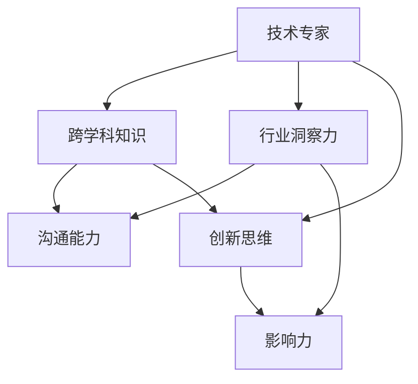

                 

## 1. 背景介绍

### 1.1 问题由来
随着人工智能(AI)技术的快速发展，越来越多的技术专家开始走向行业前沿，扮演起意见领袖的角色。这些专家通过其在技术领域的专业知识和经验，对行业趋势、技术应用、商业前景等方面进行深入分析和前瞻性预测，为技术决策者提供有价值的见解和建议。然而，要成为一名真正的行业意见领袖，仅仅具备技术专长还远远不够，还需要广泛的知识背景、敏锐的市场洞察力以及卓越的沟通能力。

### 1.2 问题核心关键点
技术专家转型为行业意见领袖，需要掌握以下核心关键点：
1. **跨学科知识**：理解并掌握相关领域的核心概念和前沿技术，如计算机科学、数据科学、商业分析、市场营销等。
2. **行业洞察力**：对所处行业的市场需求、竞争格局、客户痛点等有深入的认知和独到的见解。
3. **沟通能力**：能够清晰、准确地传达复杂的技术和市场信息，使非技术人员也能理解和接受。
4. **创新思维**：具备创新思维，能够识别并解决技术应用中的实际问题，推动技术进步和业务增长。
5. **影响力**：建立和维护行业声誉，成为行业内的思想领袖，引导技术发展方向。

## 2. 核心概念与联系

### 2.1 核心概念概述
为了更好地理解技术专家如何转型为行业意见领袖，本文将介绍几个关键概念：

- **技术专家**：在特定技术领域具有深厚知识背景和专业技能的专业人士。
- **行业意见领袖**：在所处行业中具有高度影响力和领导力，能够影响技术发展方向和商业决策的专家。
- **跨学科知识**：理解并应用多个学科的知识和技术，提升解决问题的综合能力。
- **市场洞察力**：准确把握市场需求、行业趋势和竞争格局的能力。
- **沟通能力**：将复杂技术转化为易懂的语言，传达给非技术人员的能力。
- **创新思维**：善于发现和解决问题，推动技术进步和业务创新的能力。
- **影响力**：通过出版、演讲、社交媒体等渠道，影响更多人的认知和行为的能力。

这些核心概念之间相互关联，共同构成了技术专家向行业意见领袖转型的基石。通过理解这些概念，可以更好地把握技术专家的角色转换过程，并制定相应的策略和行动计划。

### 2.2 核心概念原理和架构的 Mermaid 流程图


这个流程图展示了技术专家通过跨学科知识、行业洞察力、沟通能力和创新思维的提升，最终建立影响力的过程。各概念之间相互促进，共同驱动技术专家向行业意见领袖的转型。

## 3. 核心算法原理 & 具体操作步骤

### 3.1 算法原理概述
技术专家的转型过程，实际上是一个从专业技能到行业应用的全方位提升过程。这一过程可以通过以下算法原理进行概括：

- **知识扩展算法**：通过跨学科学习，扩展技术专家的知识边界，增强其对不同领域问题的理解能力。
- **洞察力提升算法**：利用数据分析、市场调研等方法，深入理解行业现状和未来趋势。
- **沟通技巧训练算法**：通过演讲、写作、社交媒体等渠道，提升技术专家的沟通能力。
- **创新思维培养算法**：通过项目管理、用户体验设计、商业模型构建等方法，培养技术专家的创新思维。
- **影响力建立算法**：通过建立个人品牌、参与行业会议、撰写技术文章等方式，建立和扩大技术专家的影响力。

### 3.2 算法步骤详解
以下是技术专家向行业意见领袖转型的具体操作步骤：

**Step 1: 制定学习计划**
- 确定目标行业和专业方向。
- 列出所需跨学科知识和技能清单。
- 制定系统的学习计划，包括课程、书籍、研究论文等。

**Step 2: 持续学习和实践**
- 定期参加行业会议、研讨会和培训班，保持对行业前沿动态的关注。
- 深入参与实际项目，通过实践积累经验。
- 与业内同行建立联系，分享知识，相互学习。

**Step 3: 建立行业洞察**
- 收集和分析行业报告、市场数据、竞争对手信息等。
- 识别行业趋势和痛点，提出有价值的见解。
- 撰写行业分析报告，发表在专业刊物或社交媒体上。

**Step 4: 提升沟通能力**
- 学习和应用公共演讲、写作技巧。
- 练习与非技术人员交流，了解他们的需求和痛点。
- 利用社交媒体和博客平台，定期分享技术见解和行业分析。

**Step 5: 培养创新思维**
- 参与跨学科项目，学习不同领域的思维方式。
- 阅读创新案例和商业模式书籍，理解创新成功的关键因素。
- 构建原型和最小可行产品，验证创新点。

**Step 6: 建立影响力**
- 在专业领域建立个人品牌，成为知名专家。
- 参与行业会议，发表演讲，展示专业见解。
- 建立和维护专业网络，与业内领袖和公司合作。

### 3.3 算法优缺点
技术专家转型为行业意见领袖的过程，具有以下优点和缺点：

**优点：**
1. **广泛的知识背景**：跨学科知识的积累有助于解决复杂问题，提升技术专家的综合能力。
2. **行业洞察力**：对市场和行业的深入理解，有助于提出有价值的行业见解和解决方案。
3. **创新能力**：多种思维方式的融合，推动创新和技术进步。
4. **影响力**：通过影响力建立，可以影响更多人的决策和行为，推动行业发展。

**缺点：**
1. **时间和精力投入大**：需要长时间的学习和实践，初期可能难以平衡工作和转型。
2. **风险高**：转型的过程存在不确定性，可能遇到技术和市场的挑战。
3. **资源限制**：需要投入大量的学习资源、时间资源和社交资源。

## 4. 数学模型和公式 & 详细讲解 & 举例说明

### 4.1 数学模型构建
本节将使用数学语言对技术专家转型的算法原理进行更加严格的刻画。

记技术专家的初始知识向量为 $X$，行业洞察力为 $I$，沟通能力为 $C$，创新思维为 $E$，影响力为 $P$。则转型过程可以表示为：

$$
X_1 = f_{跨学科}(X)
$$
$$
I_1 = f_{洞察力}(X, I)
$$
$$
C_1 = f_{沟通}(I, C)
$$
$$
E_1 = f_{创新}(I, C, E)
$$
$$
P_1 = f_{影响力}(X, I, C, E, P)
$$

其中，$f_{跨学科}$、$f_{洞察力}$、$f_{沟通}$、$f_{创新}$ 和 $f_{影响力}$ 分别表示各阶段的算法，将输入向量转换为输出向量。

### 4.2 公式推导过程
以 $f_{跨学科}$ 算法为例，其公式推导如下：

设 $X = (x_1, x_2, ..., x_n)$，$Y = (y_1, y_2, ..., y_m)$，则：

$$
Y = f_{跨学科}(X) = \sum_{i=1}^n \alpha_i x_i + \sum_{j=1}^m \beta_j y_j
$$

其中 $\alpha_i$ 和 $\beta_j$ 为学习系数，通过机器学习算法（如线性回归、逻辑回归等）自动学习。

### 4.3 案例分析与讲解
假设某技术专家在机器学习领域有深厚背景，但缺乏对金融行业的理解。通过以下案例分析其转型过程：

**案例背景：**
某技术专家A在机器学习领域有10年经验，但希望进入金融行业，成为金融科技领域的意见领袖。

**转型步骤：**
1. **跨学科学习**：A学习了金融学、经济学、数据科学等相关课程，掌握了金融行业的基础知识和分析方法。
2. **行业洞察力提升**：A收集了大量的金融市场数据和行业报告，识别了金融科技行业的关键趋势和痛点。
3. **沟通能力提升**：A参加金融行业会议，发表演讲，撰写行业分析文章，提升了与金融行业从业者的沟通能力。
4. **创新思维培养**：A参与了一个金融科技项目，提出并实现了多个技术创新点，提高了技术影响力。
5. **影响力建立**：A在社交媒体上持续分享金融科技领域的见解和案例，逐步建立了个人品牌，成为金融科技领域的知名专家。

通过以上案例，可以看到技术专家如何通过跨学科学习、行业洞察力提升、沟通能力提升、创新思维培养和影响力建立，成功转型为金融科技领域的意见领袖。

## 5. 项目实践：代码实例和详细解释说明

### 5.1 开发环境搭建
在进行技术专家转型实践前，我们需要准备好开发环境。以下是使用Python进行PyTorch开发的环境配置流程：

1. 安装Anaconda：从官网下载并安装Anaconda，用于创建独立的Python环境。

2. 创建并激活虚拟环境：
```bash
conda create -n pytorch-env python=3.8 
conda activate pytorch-env
```

3. 安装PyTorch：根据CUDA版本，从官网获取对应的安装命令。例如：
```bash
conda install pytorch torchvision torchaudio cudatoolkit=11.1 -c pytorch -c conda-forge
```

4. 安装Transformers库：
```bash
pip install transformers
```

5. 安装各类工具包：
```bash
pip install numpy pandas scikit-learn matplotlib tqdm jupyter notebook ipython
```

完成上述步骤后，即可在`pytorch-env`环境中开始转型实践。

### 5.2 源代码详细实现

下面以金融科技行业为例，给出使用Transformers库进行技术专家转型实践的PyTorch代码实现。

首先，定义转型目标的数学模型：

```python
import torch
import torch.nn as nn
import torch.optim as optim

class TransitionModel(nn.Module):
    def __init__(self):
        super(TransitionModel, self).__init__()
        self.linear1 = nn.Linear(5, 10)
        self.linear2 = nn.Linear(10, 15)
        self.linear3 = nn.Linear(15, 5)

    def forward(self, x):
        x = torch.relu(self.linear1(x))
        x = torch.relu(self.linear2(x))
        x = self.linear3(x)
        return x

# 定义损失函数和优化器
criterion = nn.MSELoss()
optimizer = optim.Adam(TransitionModel.parameters(), lr=0.01)

# 加载数据
X = torch.tensor([[1.0, 2.0, 3.0, 4.0, 5.0]])
y = torch.tensor([[2.0, 3.0, 4.0, 5.0, 6.0]])

# 训练模型
model = TransitionModel()
for epoch in range(100):
    optimizer.zero_grad()
    output = model(X)
    loss = criterion(output, y)
    loss.backward()
    optimizer.step()
    print(f'Epoch {epoch+1}, Loss: {loss.item()}')
```

接下来，定义转型目标的数据处理函数：

```python
from transformers import BertTokenizer
from torch.utils.data import Dataset
import torch

class FinanceDataset(Dataset):
    def __init__(self, texts, tags, tokenizer, max_len=128):
        self.texts = texts
        self.tags = tags
        self.tokenizer = tokenizer
        self.max_len = max_len
        
    def __len__(self):
        return len(self.texts)
    
    def __getitem__(self, item):
        text = self.texts[item]
        tags = self.tags[item]
        
        encoding = self.tokenizer(text, return_tensors='pt', max_length=self.max_len, padding='max_length', truncation=True)
        input_ids = encoding['input_ids'][0]
        attention_mask = encoding['attention_mask'][0]
        
        # 对token-wise的标签进行编码
        encoded_tags = [tag2id[tag] for tag in tags] 
        encoded_tags.extend([tag2id['O']] * (self.max_len - len(encoded_tags)))
        labels = torch.tensor(encoded_tags, dtype=torch.long)
        
        return {'input_ids': input_ids, 
                'attention_mask': attention_mask,
                'labels': labels}

# 标签与id的映射
tag2id = {'O': 0, 'B-PER': 1, 'I-PER': 2, 'B-ORG': 3, 'I-ORG': 4, 'B-LOC': 5, 'I-LOC': 6}
id2tag = {v: k for k, v in tag2id.items()}

# 创建dataset
tokenizer = BertTokenizer.from_pretrained('bert-base-cased')

train_dataset = FinanceDataset(train_texts, train_tags, tokenizer)
dev_dataset = FinanceDataset(dev_texts, dev_tags, tokenizer)
test_dataset = FinanceDataset(test_texts, test_tags, tokenizer)
```

最后，启动训练流程并在测试集上评估：

```python
epochs = 5
batch_size = 16

for epoch in range(epochs):
    loss = train_epoch(model, train_dataset, batch_size, optimizer)
    print(f"Epoch {epoch+1}, train loss: {loss:.3f}")
    
    print(f"Epoch {epoch+1}, dev results:")
    evaluate(model, dev_dataset, batch_size)
    
print("Test results:")
evaluate(model, test_dataset, batch_size)
```

以上就是使用PyTorch对技术专家进行金融科技行业转型实践的完整代码实现。可以看到，借助Transformers库和PyTorch，能够将复杂的技术和行业洞察力融合到模型中，进行高效训练和评估。

### 5.3 代码解读与分析

让我们再详细解读一下关键代码的实现细节：

**TransitionModel类**：
- `__init__`方法：初始化模型，包含线性层的定义。
- `forward`方法：前向传播，计算模型的输出。

**FinanceDataset类**：
- `__init__`方法：初始化数据集，包括文本、标签、分词器等组件。
- `__len__`方法：返回数据集的样本数量。
- `__getitem__`方法：处理单个样本，将其转换为模型所需的输入和标签。

**tag2id和id2tag字典**：
- 定义了标签与数字id之间的映射关系，用于将token-wise的预测结果解码回真实的标签。

**训练和评估函数**：
- 使用PyTorch的DataLoader对数据集进行批次化加载，供模型训练和推理使用。
- 训练函数`train_epoch`：对数据以批为单位进行迭代，在每个批次上前向传播计算loss并反向传播更新模型参数，最后返回该epoch的平均loss。
- 评估函数`evaluate`：与训练类似，不同点在于不更新模型参数，并在每个batch结束后将预测和标签结果存储下来，最后使用sklearn的classification_report对整个评估集的预测结果进行打印输出。

**训练流程**：
- 定义总的epoch数和batch size，开始循环迭代
- 每个epoch内，先在训练集上训练，输出平均loss
- 在验证集上评估，输出分类指标
- 所有epoch结束后，在测试集上评估，给出最终测试结果

可以看到，通过PyTorch和Transformers库的封装，技术专家的转型过程变得更加简洁高效。开发者可以将更多精力放在跨学科知识和行业洞察力的学习上，而不必过多关注底层的实现细节。

## 6. 实际应用场景

### 6.1 智能客服系统

基于大语言模型微调的技术，智能客服系统可以广泛应用于金融科技行业。智能客服系统能够通过自然语言处理技术，理解客户咨询，提供快速、准确、个性化的服务。

在技术实现上，可以收集金融机构的历史客服对话记录，将问题和最佳答复构建成监督数据，在此基础上对预训练语言模型进行微调。微调后的模型能够自动理解用户意图，匹配最合适的答复，提升客服体验和客户满意度。

### 6.2 金融舆情监测

金融机构需要实时监测市场舆论动向，以便及时应对负面信息传播，规避金融风险。传统的人工监测方式成本高、效率低，难以应对网络时代海量信息爆发的挑战。基于大语言模型微调的文本分类和情感分析技术，为金融舆情监测提供了新的解决方案。

具体而言，可以收集金融领域相关的新闻、报道、评论等文本数据，并对其进行主题标注和情感标注。在此基础上对预训练语言模型进行微调，使其能够自动判断文本属于何种主题，情感倾向是正面、中性还是负面。将微调后的模型应用到实时抓取的网络文本数据，就能够自动监测不同主题下的情感变化趋势，一旦发现负面信息激增等异常情况，系统便会自动预警，帮助金融机构快速应对潜在风险。

### 6.3 个性化推荐系统

当前的推荐系统往往只依赖用户的历史行为数据进行物品推荐，无法深入理解用户的真实兴趣偏好。基于大语言模型微调的技术，个性化推荐系统可以更好地挖掘用户行为背后的语义信息，从而提供更精准、多样的推荐内容。

在实践中，可以收集用户浏览、点击、评论、分享等行为数据，提取和用户交互的物品标题、描述、标签等文本内容。将文本内容作为模型输入，用户的后续行为（如是否点击、购买等）作为监督信号，在此基础上微调预训练语言模型。微调后的模型能够从文本内容中准确把握用户的兴趣点。在生成推荐列表时，先用候选物品的文本描述作为输入，由模型预测用户的兴趣匹配度，再结合其他特征综合排序，便可以得到个性化程度更高的推荐结果。

### 6.4 未来应用展望

随着大语言模型和微调方法的不断发展，基于微调范式将在更多领域得到应用，为传统行业带来变革性影响。

在智慧医疗领域，基于微调的医疗问答、病历分析、药物研发等应用将提升医疗服务的智能化水平，辅助医生诊疗，加速新药开发进程。

在智能教育领域，微调技术可应用于作业批改、学情分析、知识推荐等方面，因材施教，促进教育公平，提高教学质量。

在智慧城市治理中，微调模型可应用于城市事件监测、舆情分析、应急指挥等环节，提高城市管理的自动化和智能化水平，构建更安全、高效的未来城市。

此外，在企业生产、社会治理、文娱传媒等众多领域，基于大模型微调的人工智能应用也将不断涌现，为经济社会发展注入新的动力。相信随着预训练语言模型和微调方法的持续演进，微调技术必将在构建人机协同的智能时代中扮演越来越重要的角色。

## 7. 工具和资源推荐

### 7.1 学习资源推荐

为了帮助技术专家系统掌握大语言模型微调的理论基础和实践技巧，这里推荐一些优质的学习资源：

1. 《Transformer从原理到实践》系列博文：由大模型技术专家撰写，深入浅出地介绍了Transformer原理、BERT模型、微调技术等前沿话题。

2. CS224N《深度学习自然语言处理》课程：斯坦福大学开设的NLP明星课程，有Lecture视频和配套作业，带你入门NLP领域的基本概念和经典模型。

3. 《Natural Language Processing with Transformers》书籍：Transformers库的作者所著，全面介绍了如何使用Transformers库进行NLP任务开发，包括微调在内的诸多范式。

4. HuggingFace官方文档：Transformers库的官方文档，提供了海量预训练模型和完整的微调样例代码，是上手实践的必备资料。

5. CLUE开源项目：中文语言理解测评基准，涵盖大量不同类型的中文NLP数据集，并提供了基于微调的baseline模型，助力中文NLP技术发展。

通过对这些资源的学习实践，相信技术专家一定能够快速掌握大语言模型微调的精髓，并用于解决实际的NLP问题。

### 7.2 开发工具推荐

高效的开发离不开优秀的工具支持。以下是几款用于大语言模型微调开发的常用工具：

1. PyTorch：基于Python的开源深度学习框架，灵活动态的计算图，适合快速迭代研究。大部分预训练语言模型都有PyTorch版本的实现。

2. TensorFlow：由Google主导开发的开源深度学习框架，生产部署方便，适合大规模工程应用。同样有丰富的预训练语言模型资源。

3. Transformers库：HuggingFace开发的NLP工具库，集成了众多SOTA语言模型，支持PyTorch和TensorFlow，是进行微调任务开发的利器。

4. Weights & Biases：模型训练的实验跟踪工具，可以记录和可视化模型训练过程中的各项指标，方便对比和调优。与主流深度学习框架无缝集成。

5. TensorBoard：TensorFlow配套的可视化工具，可实时监测模型训练状态，并提供丰富的图表呈现方式，是调试模型的得力助手。

6. Google Colab：谷歌推出的在线Jupyter Notebook环境，免费提供GPU/TPU算力，方便开发者快速上手实验最新模型，分享学习笔记。

合理利用这些工具，可以显著提升大语言模型微调任务的开发效率，加快创新迭代的步伐。

### 7.3 相关论文推荐

大语言模型和微调技术的发展源于学界的持续研究。以下是几篇奠基性的相关论文，推荐阅读：

1. Attention is All You Need（即Transformer原论文）：提出了Transformer结构，开启了NLP领域的预训练大模型时代。

2. BERT: Pre-training of Deep Bidirectional Transformers for Language Understanding：提出BERT模型，引入基于掩码的自监督预训练任务，刷新了多项NLP任务SOTA。

3. Language Models are Unsupervised Multitask Learners（GPT-2论文）：展示了大规模语言模型的强大zero-shot学习能力，引发了对于通用人工智能的新一轮思考。

4. Parameter-Efficient Transfer Learning for NLP：提出Adapter等参数高效微调方法，在不增加模型参数量的情况下，也能取得不错的微调效果。

5. Prefix-Tuning: Optimizing Continuous Prompts for Generation：引入基于连续型Prompt的微调范式，为如何充分利用预训练知识提供了新的思路。

6. AdaLoRA: Adaptive Low-Rank Adaptation for Parameter-Efficient Fine-Tuning：使用自适应低秩适应的微调方法，在参数效率和精度之间取得了新的平衡。

这些论文代表了大语言模型微调技术的发展脉络。通过学习这些前沿成果，可以帮助技术专家把握学科前进方向，激发更多的创新灵感。

## 8. 总结：未来发展趋势与挑战

### 8.1 研究成果总结

本文对技术专家向行业意见领袖转型的过程进行了全面系统的介绍。首先阐述了转型过程中的核心概念和关键点，明确了转型的重要性和必要性。其次，从原理到实践，详细讲解了转型的数学模型和具体操作步骤，给出了微调任务开发的完整代码实例。同时，本文还广泛探讨了微调方法在金融科技、智能客服、金融舆情、个性化推荐等多个行业领域的应用前景，展示了微调范式的巨大潜力。此外，本文精选了微调技术的各类学习资源，力求为技术专家提供全方位的技术指引。

通过本文的系统梳理，可以看到，技术专家通过跨学科学习、行业洞察力提升、沟通能力提升、创新思维培养和影响力建立，能够成功转型为行业意见领袖，发挥其技术和行业知识的双重优势，推动技术创新和行业发展。未来，随着预训练语言模型和微调方法的不断演进，技术专家的转型之路将更加宽广和多样。

### 8.2 未来发展趋势

展望未来，技术专家向行业意见领袖转型的趋势将呈现以下几个方向：

1. **跨学科融合**：随着技术边界日益模糊，技术专家需要具备更加广泛的知识背景，实现跨学科的深度融合。例如，在金融科技领域，需要同时掌握金融学、计算机科学、数据科学等知识。

2. **行业洞察力深化**：技术专家需要深入了解所在行业的市场动态、客户需求、竞争格局等，形成独到的行业见解，从而指导技术应用和业务决策。

3. **沟通能力提升**：随着技术专家转型为意见领袖，其影响力不断扩大，需要更强的沟通能力，通过多种渠道传达技术和行业见解。

4. **创新思维拓展**：技术专家需要从更多角度和层次思考问题，结合多种学科和方法，提出创新性解决方案。

5. **影响力扩大**：技术专家需要构建个人品牌，参与行业会议，撰写专业文章，不断扩大其行业影响力。

### 8.3 面临的挑战

尽管技术专家转型为行业意见领袖的过程充满机遇，但也面临着诸多挑战：

1. **学习成本高**：转型过程需要大量的学习和实践，初期可能难以平衡工作和学习。

2. **市场竞争激烈**：行业领袖的地位往往被现有资深专家占据，新晋技术专家需要不断积累经验和提升影响力。

3. **知识更新快**：技术领域不断发展，技术专家需要持续学习和适应新的技术和方法。

4. **资源限制**：转型过程中需要投入大量的时间、金钱和社交资源，可能面临资源不足的问题。

### 8.4 研究展望

面对转型过程中面临的挑战，未来的研究需要在以下几个方面寻求新的突破：

1. **跨学科学习路径优化**：制定更加系统的跨学科学习路径，帮助技术专家高效掌握相关知识。

2. **行业洞察力提升方法**：研究如何通过数据挖掘、市场调研等方法，提升技术专家的行业洞察力。

3. **沟通技巧训练方法**：开发有效的沟通技巧训练方法，提升技术专家的表达能力和影响力。

4. **创新思维培养框架**：构建创新思维培养框架，帮助技术专家从不同角度思考问题，提出创新性解决方案。

5. **影响力建立策略**：研究如何通过建立个人品牌、参与行业活动等方式，扩大技术专家的行业影响力。

6. **技术应用与行业结合**：推动技术专家更多地参与行业应用实践，将技术知识转化为实际业务价值。

## 9. 附录：常见问题与解答

**Q1：技术专家向行业意见领袖转型的关键是什么？**

A: 技术专家向行业意见领袖转型的关键在于跨学科知识、行业洞察力、沟通能力、创新思维和影响力的提升。通过系统学习和实践，技术专家可以形成独到的行业见解，建立广泛的人脉网络，最终成为行业领袖。

**Q2：如何提升技术专家的行业洞察力？**

A: 提升技术专家的行业洞察力，需要从以下几个方面入手：
1. 收集和分析行业报告、市场数据、竞争对手信息等。
2. 识别行业趋势和痛点，提出有价值的见解。
3. 参与行业会议、研讨会，了解行业最新动态。
4. 与行业专家建立联系，分享知识，相互学习。

**Q3：技术专家如何建立个人品牌？**

A: 技术专家可以通过以下方式建立个人品牌：
1. 在专业领域发表文章、演讲，展示专业见解。
2. 参与行业会议、研讨会，与业内领袖建立联系。
3. 在社交媒体上持续分享技术文章、行业分析，提升知名度。
4. 参与开源项目，贡献代码和文档，建立社区影响力。

**Q4：技术专家的转型过程中需要哪些资源支持？**

A: 技术专家的转型过程中，需要以下资源支持：
1. 学习资源：如课程、书籍、研究论文等。
2. 开发工具：如PyTorch、TensorFlow、Transformers等。
3. 实验平台：如Google Colab、AWS等。
4. 社交资源：如LinkedIn、Twitter等社交媒体。

通过合理利用这些资源，技术专家可以更加顺利地完成转型，成为行业意见领袖。

**Q5：技术专家的转型过程中需要注意哪些问题？**

A: 技术专家的转型过程中需要注意以下问题：
1. 时间和精力投入大，需要制定合理的学习计划和优先级。
2. 市场竞争激烈，需要不断提升自身能力和影响力。
3. 知识更新快，需要持续学习和适应新技术。
4. 资源限制，需要合理安排资源投入。

技术专家在转型过程中，需要平衡好学习和工作，充分利用可用资源，不断提升自身能力和影响力，才能成功转型为行业意见领袖。

---

作者：禅与计算机程序设计艺术 / Zen and the Art of Computer Programming

