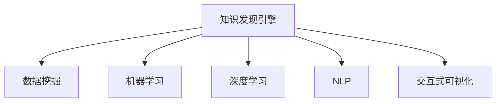

                 

# 从搜索引擎到知识发现引擎：技术的飞跃

## 1. 背景介绍

在过去几十年中，随着互联网的普及和信息技术的迅猛发展，搜索引擎已成为人们获取信息的重要工具。然而，随着数据量的爆炸式增长，人们不仅需要快速搜索，还需要在海量的信息中发现深层次的知识。由此，知识发现引擎应运而生，旨在通过对海量数据的分析和挖掘，帮助用户获取有价值的洞见和知识。

### 1.1 背景由来

搜索引擎最初是基于关键词匹配和索引技术实现的，通过分析网页内容和用户查询中的关键词，快速返回最相关的搜索结果。然而，这种基于内容的搜索方式存在一些局限性：
1. 只关注显式关键词，无法捕捉到潜在关联性。
2. 难以发现深层次的知识结构，如因果关系、假设验证等。
3. 对长文本和复杂查询的解析能力有限。

为了克服这些局限性，知识发现引擎应运而生。其核心思想是通过复杂的数据处理和模型训练，自动发现数据中的关联性和模式，为用户提供更加深入、全面的知识洞察。

### 1.2 问题核心关键点

知识发现引擎的核心技术包括：
1. 数据处理与特征工程：对原始数据进行清洗、转换和特征提取，提高数据的质量和可用性。
2. 模型训练与优化：利用机器学习模型训练知识发现算法，通过优化算法提高模型性能。
3. 结果展示与交互：通过可视化和交互式界面，让用户方便地理解和利用发现的知识。

这些技术手段相辅相成，共同构成了知识发现引擎的核心能力。通过不断改进和创新，知识发现引擎已经在各个领域展示了强大的应用潜力，成为未来信息获取的重要工具。

## 2. 核心概念与联系

### 2.1 核心概念概述

为更好地理解知识发现引擎的工作原理和优化方向，本节将介绍几个密切相关的核心概念：

- 知识发现引擎(Knowledge Discovery Engine, KDE)：一种能够自动从大量数据中挖掘隐藏知识与模式的技术，旨在帮助用户发现数据中的关联、趋势和规律。
- 数据挖掘(Data Mining)：通过算法从原始数据中提取有用信息和知识的过程，是实现知识发现引擎的关键技术。
- 机器学习(Machine Learning)：通过数据训练模型，自动发现数据中隐藏规律和知识的技术，广泛应用于知识发现引擎的各个环节。
- 深度学习(Deep Learning)：一种能够自动学习特征的高级机器学习技术，特别适用于处理高维数据和复杂模型。
- 自然语言处理(Natural Language Processing, NLP)：处理和分析人类语言的技术，是知识发现引擎中处理文本数据的关键。
- 交互式可视化(Interactive Visualization)：通过图表、图形等可视化方式，直观展示知识发现结果，增强用户理解和互动。

这些核心概念之间的逻辑关系可以通过以下Mermaid流程图来展示：



这个流程图展示的知识发现引擎的核心概念及其之间的关系：

1. 知识发现引擎通过数据挖掘技术从原始数据中提取有用信息。
2. 机器学习和深度学习模型被用来训练和优化数据挖掘算法。
3. NLP技术用于处理和分析文本数据。
4. 交互式可视化技术用于展示知识发现结果，增强用户理解。

## 3. 核心算法原理 & 具体操作步骤
### 3.1 算法原理概述

知识发现引擎的核心算法原理主要包括以下几个步骤：

1. **数据预处理**：对原始数据进行清洗、去噪、归一化等处理，提高数据质量和一致性。
2. **特征工程**：通过选择、构造和转换特征，提升模型对数据的理解和表现能力。
3. **模型训练**：使用机器学习模型进行模型训练，优化模型参数，提高模型预测准确性。
4. **结果评估**：使用评估指标（如准确率、召回率、F1值等）对模型进行评估，确保模型性能稳定。
5. **结果展示**：将发现的知识通过可视化界面展示给用户，便于理解和使用。

其中，数据挖掘和机器学习是知识发现引擎的核心组成部分，下面将详细介绍这两个步骤。

### 3.2 算法步骤详解

#### 数据挖掘

数据挖掘是知识发现引擎的基础，通过从大量数据中提取有用信息和模式，为后续的机器学习模型提供数据支持。数据挖掘的主要步骤包括：

1. **数据选择与预处理**：选择与任务相关的数据，对数据进行清洗、去噪、归一化等预处理，提高数据质量。
2. **特征选择与构造**：选择和构造特征，提高模型对数据的理解和表现能力。
3. **关联规则挖掘**：使用算法如Apriori、FP-growth等发现数据中的关联规则，如频繁项集、关联规则等。
4. **聚类分析**：使用算法如K-means、DBSCAN等发现数据中的聚类结构，如簇、中心点等。
5. **分类与回归分析**：使用算法如决策树、随机森林、支持向量机等进行分类或回归分析，发现数据中的模式和规律。

#### 机器学习

机器学习是知识发现引擎的核心技术，通过训练模型从数据中提取知识和规律，为后续的应用提供支持。机器学习的主要步骤包括：

1. **模型选择与训练**：选择适合任务的机器学习模型，如线性回归、逻辑回归、决策树、随机森林、神经网络等，并使用训练数据进行模型训练。
2. **参数调整与优化**：通过交叉验证、网格搜索等方法调整模型参数，优化模型性能。
3. **模型评估与验证**：使用测试数据集评估模型性能，确保模型泛化能力强。
4. **模型部署与应用**：将训练好的模型部署到实际应用中，进行推理和预测。

### 3.3 算法优缺点

知识发现引擎具有以下优点：
1. 自动化程度高：能够自动从大量数据中提取有用信息和模式，减少人工干预。
2. 灵活性强：适用于各种数据类型和应用场景，适用范围广泛。
3. 结果直观：通过可视化界面展示发现的知识，便于用户理解和应用。

同时，知识发现引擎也存在一些缺点：
1. 对数据质量要求高：数据中的噪声和异常值会影响结果的准确性。
2. 算法复杂度高：需要处理大量的数据和复杂的算法，计算资源消耗大。
3. 结果解释性不足：发现的规律和知识可能缺乏解释性，难以理解。
4. 需要专业知识：设计和实施知识发现引擎需要一定的专业知识和技术基础。

尽管存在这些局限性，但知识发现引擎仍然是最主流的知识挖掘技术之一，广泛应用于商业智能(BI)、金融分析、医疗诊断、科学研究等领域。

### 3.4 算法应用领域

知识发现引擎在多个领域中展示了强大的应用潜力，具体如下：

1. **商业智能(BI)**：通过分析公司内部数据，发现业务趋势和模式，辅助企业决策。
2. **金融分析**：使用机器学习模型对金融数据进行分析和预测，辅助投资决策和风险管理。
3. **医疗诊断**：利用患者数据发现疾病模式和风险因素，辅助医生诊断和治疗。
4. **科学研究**：通过分析科学数据，发现科学规律和知识，推动科学发展。
5. **市场营销**：使用客户数据发现市场趋势和消费者行为，优化营销策略。
6. **教育领域**：分析学生数据，发现学习行为和成绩模式，提供个性化学习建议。

以上领域只是知识发现引擎应用的冰山一角，未来随着技术的不断进步，其在更多领域的应用前景将更加广阔。

## 4. 数学模型和公式 & 详细讲解 & 举例说明
### 4.1 数学模型构建

知识发现引擎的数学模型构建主要包括数据预处理、特征工程和模型训练三个部分。下面将以机器学习模型训练为例，介绍相关数学模型和公式。

#### 数据预处理

数据预处理的主要目标是提高数据质量和一致性，常见的数据预处理技术包括：

1. **归一化**：将数据缩放到指定范围内，通常使用公式 $x_{normalized}=\frac{x_{original}-x_{min}}{x_{max}-x_{min}}$ 实现。
2. **缺失值处理**：对缺失值进行填充或删除，常见的处理方法包括均值填充、插值、删除等。
3. **特征选择**：选择对任务有用的特征，常见的方法包括方差选择、相关性选择、嵌入式选择等。

#### 特征工程

特征工程是知识发现引擎中非常重要的一环，通过选择、构造和转换特征，提升模型的表现能力。特征工程的主要技术包括：

1. **特征选择**：选择对任务有用的特征，常见的选择方法包括过滤、包裹和嵌入式选择。
2. **特征构造**：构造新的特征，如组合特征、交叉特征、时间特征等。
3. **特征转换**：对原始特征进行转换，如对数值特征进行归一化、对分类特征进行独热编码等。

#### 模型训练

机器学习模型训练是知识发现引擎的核心步骤，通过训练模型从数据中提取知识和规律。常见的机器学习模型包括线性回归、逻辑回归、决策树、随机森林、支持向量机等。以线性回归为例，其数学模型如下：

$$y=\beta_0+\beta_1x_1+\beta_2x_2+...+\beta_nx_n+\epsilon$$

其中，$y$ 为模型预测值，$x_1, x_2, ..., x_n$ 为特征变量，$\beta_0, \beta_1, ..., \beta_n$ 为模型参数，$\epsilon$ 为误差项。

### 4.2 公式推导过程

以线性回归模型为例，其损失函数通常采用均方误差(MSE)，公式如下：

$$L=\frac{1}{2m}\sum_{i=1}^m(y_i-\hat{y}_i)^2$$

其中，$m$ 为样本数量，$y_i$ 为真实标签，$\hat{y}_i$ 为模型预测值。

通过最小化损失函数，可以得到模型的参数更新公式：

$$\beta_j=\beta_j-\frac{\alpha}{m}\sum_{i=1}^m(y_i-\hat{y}_i)x_{ij}$$

其中，$\alpha$ 为学习率，$x_{ij}$ 为特征 $x_j$ 在样本 $i$ 上的值。

### 4.3 案例分析与讲解

以金融数据为例，介绍如何利用知识发现引擎进行投资组合优化。

1. **数据预处理**：对金融数据进行清洗、去噪、归一化等处理，确保数据质量和一致性。
2. **特征工程**：选择与投资组合优化相关的特征，如股票价格、市场指数、经济指标等。
3. **模型训练**：使用线性回归模型训练投资组合优化模型，优化模型的参数。
4. **结果评估**：使用测试数据集评估模型性能，确保模型泛化能力强。
5. **结果展示**：通过可视化界面展示投资组合优化的结果，帮助投资者进行投资决策。

## 5. 项目实践：代码实例和详细解释说明
### 5.1 开发环境搭建

在进行知识发现引擎项目实践前，我们需要准备好开发环境。以下是使用Python进行PyTorch开发的环境配置流程：

1. 安装Anaconda：从官网下载并安装Anaconda，用于创建独立的Python环境。

2. 创建并激活虚拟环境：
```bash
conda create -n pytorch-env python=3.8 
conda activate pytorch-env
```

3. 安装PyTorch：根据CUDA版本，从官网获取对应的安装命令。例如：
```bash
conda install pytorch torchvision torchaudio cudatoolkit=11.1 -c pytorch -c conda-forge
```

4. 安装Transformers库：
```bash
pip install transformers
```

5. 安装各类工具包：
```bash
pip install numpy pandas scikit-learn matplotlib tqdm jupyter notebook ipython
```

完成上述步骤后，即可在`pytorch-env`环境中开始项目实践。

### 5.2 源代码详细实现

下面我们以线性回归模型为例，给出使用PyTorch实现知识发现引擎的代码实现。

首先，定义数据预处理函数：

```python
import numpy as np
from sklearn.preprocessing import StandardScaler

def preprocess_data(X):
    scaler = StandardScaler()
    X_scaled = scaler.fit_transform(X)
    return X_scaled
```

然后，定义模型训练函数：

```python
import torch
from torch import nn, optim

class LinearRegression(nn.Module):
    def __init__(self, input_dim):
        super(LinearRegression, self).__init__()
        self.linear = nn.Linear(input_dim, 1)
        
    def forward(self, x):
        return self.linear(x)
        
def train_model(X, y, epochs, learning_rate):
    model = LinearRegression(X.shape[1])
    criterion = nn.MSELoss()
    optimizer = optim.SGD(model.parameters(), lr=learning_rate)
    
    for epoch in range(epochs):
        model.train()
        optimizer.zero_grad()
        output = model(X)
        loss = criterion(output, y)
        loss.backward()
        optimizer.step()
        print(f"Epoch {epoch+1}, Loss: {loss.item():.4f}")
        
    return model
```

接着，定义评估函数：

```python
def evaluate_model(model, X_test, y_test):
    with torch.no_grad():
        y_pred = model(X_test)
        mse = ((y_pred - y_test) ** 2).mean()
        print(f"MSE: {mse:.4f}")
```

最后，启动训练流程并在测试集上评估：

```python
X_train = preprocess_data(X_train)
X_test = preprocess_data(X_test)
model = train_model(X_train, y_train, epochs=100, learning_rate=0.01)
evaluate_model(model, X_test, y_test)
```

以上就是使用PyTorch实现线性回归模型的完整代码实现。可以看到，通过简单的代码，我们便能够快速训练出一个知识发现引擎模型，并对其性能进行评估。

### 5.3 代码解读与分析

让我们再详细解读一下关键代码的实现细节：

**preprocess_data函数**：
- 定义一个数据预处理函数，对数据进行归一化处理。使用sklearn库的StandardScaler对数据进行标准化，以提高模型训练效率。

**train_model函数**：
- 定义一个线性回归模型类，继承nn.Module。
- 定义前向传播函数forward，使用线性层对输入进行线性变换。
- 定义训练函数train_model，使用SGD优化器对模型参数进行更新，使用MSELoss损失函数计算预测值与真实值之间的均方误差。
- 通过循环训练多个epoch，并在每个epoch后输出损失值。

**evaluate_model函数**：
- 定义评估函数evaluate_model，使用模型对测试集进行预测，计算预测值与真实值之间的均方误差，并输出结果。

**训练流程**：
- 定义训练次数epochs和初始学习率learning_rate。
- 调用train_model函数对模型进行训练，返回训练后的模型。
- 调用evaluate_model函数对测试集进行评估，输出模型在测试集上的均方误差。

通过这些代码，我们完成了线性回归模型的训练和评估，验证了知识发现引擎的实现过程。

## 6. 实际应用场景
### 6.1 智能推荐系统

知识发现引擎在智能推荐系统中得到了广泛应用。传统推荐系统往往只能推荐用户历史行为相关的产品，难以发现用户潜在的兴趣。知识发现引擎通过分析用户行为数据和商品属性数据，发现用户与商品之间的关联，推荐用户可能感兴趣的商品。

具体而言，知识发现引擎可以分析用户的浏览、点击、购买等行为数据，提取用户特征和商品特征，使用关联规则挖掘算法发现用户与商品之间的关联关系，通过分类和回归分析算法预测用户对商品的兴趣，最后通过推荐系统向用户展示推荐结果。

### 6.2 金融风险管理

知识发现引擎在金融领域中广泛应用于风险管理。金融市场数据具有高维度、非线性和噪声等特点，传统统计方法难以有效处理。知识发现引擎通过分析市场数据，发现价格波动、交易量变化等规律，预测市场风险和异常情况，辅助金融决策。

具体而言，知识发现引擎可以分析股票价格、交易量、市场指数等金融数据，提取特征和模式，使用分类和回归算法预测股票价格和市场风险，通过可视化界面展示分析结果，辅助金融分析师进行决策。

### 6.3 医疗诊断系统

知识发现引擎在医疗诊断中具有重要的应用价值。医疗数据具有高维度、噪声和缺失等特点，传统统计方法难以有效处理。知识发现引擎通过分析医疗数据，发现疾病模式和风险因素，辅助医生进行诊断和治疗。

具体而言，知识发现引擎可以分析患者的病情记录、检验报告、影像数据等医疗数据，提取特征和模式，使用分类和回归算法预测疾病类型和严重程度，通过可视化界面展示分析结果，辅助医生进行诊断和治疗。

### 6.4 未来应用展望

随着知识发现引擎技术的不断进步，其在更多领域的应用前景将更加广阔。未来，知识发现引擎有望在以下领域取得突破：

1. **智能交通管理**：通过分析交通数据，发现交通模式和规律，优化交通管理策略，减少交通拥堵。
2. **智能农业**：通过分析气象、土壤、作物数据，发现农业模式和规律，提高农业生产效率。
3. **智能城市**：通过分析城市数据，发现城市运行模式和规律，优化城市管理和服务。
4. **智能制造**：通过分析生产数据，发现生产模式和规律，优化生产流程和质量控制。

## 7. 工具和资源推荐
### 7.1 学习资源推荐

为了帮助开发者系统掌握知识发现引擎的理论基础和实践技巧，这里推荐一些优质的学习资源：

1. 《Python数据科学手册》：详细介绍了Python在数据科学中的应用，包括数据预处理、特征工程、模型训练等。
2. 《机器学习实战》：通过大量实例和项目，帮助读者深入理解机器学习算法和应用。
3. 《深度学习》课程：斯坦福大学开设的深度学习课程，涵盖深度学习的基本概念和算法。
4. Kaggle竞赛：全球最大的数据科学竞赛平台，通过参加竞赛项目，锻炼数据挖掘和模型训练能力。
5. Coursera机器学习课程：由斯坦福大学开设的机器学习课程，涵盖机器学习的基本概念和算法。

通过对这些资源的学习实践，相信你一定能够快速掌握知识发现引擎的核心技术，并用于解决实际的商业问题。

### 7.2 开发工具推荐

高效的开发离不开优秀的工具支持。以下是几款用于知识发现引擎开发的常用工具：

1. Jupyter Notebook：交互式笔记本环境，支持Python代码的编写和执行。
2. R语言：数据科学和统计分析的主流语言，支持丰富的统计分析和数据可视化工具。
3. MATLAB：工程和科学计算的主流工具，支持矩阵计算和图形化界面。
4. Python库：如NumPy、Pandas、Scikit-learn等，提供了丰富的数据处理和机器学习工具。
5. Spark：分布式计算框架，支持大规模数据处理和分析。

合理利用这些工具，可以显著提升知识发现引擎的开发效率，加快创新迭代的步伐。

### 7.3 相关论文推荐

知识发现引擎的研究源于学界的持续研究。以下是几篇奠基性的相关论文，推荐阅读：

1. KDD Cup：Kaggle组织的机器学习竞赛，展示了机器学习算法在实际应用中的优秀表现。
2. F1-Grace：使用决策树算法预测金融市场走势，展示了知识发现引擎在金融分析中的应用。
3. Pattern Mining：介绍关联规则挖掘算法，展示了知识发现引擎在商业智能中的应用。
4. Deep Learning for Recommendation Systems：使用深度学习算法进行推荐系统优化，展示了知识发现引擎在智能推荐中的应用。
5. Predicting Hospi


