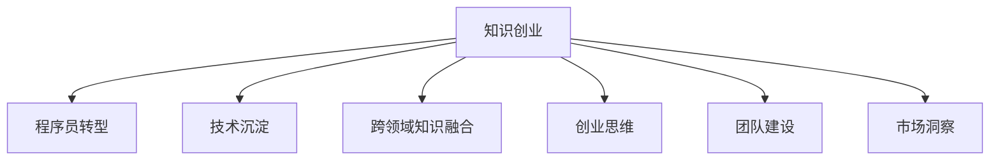

                 

# 从程序员到知识创业者的蜕变之路

> 关键词：知识创业, 程序员转型, 技术创新, 知识管理, 数字经济

## 1. 背景介绍

### 1.1 问题由来

随着信息技术的发展和互联网的普及，数字经济已经成为了全球经济增长的重要引擎。程序员作为数字经济的核心力量，其角色和职责也正在发生深刻变化。从传统的软件开发到如今的数字化转型，程序员的使命变得更加多样化。在这一背景下，许多有志之士开始探索从程序员到知识创业者的转型之路。

### 1.2 问题核心关键点

这一转型过程涉及多个关键点，包括但不限于：

- **技术沉淀与知识积累**：程序员需要不断学习和积累技术知识，提升自身的专业水平。
- **跨领域知识融合**：如何将所学技术知识与其他领域的知识进行有机结合，创造出新的价值。
- **创业思维与团队建设**：如何运用技术思维和创新精神，构建高效的团队，实现从技术到商业的跨越。
- **市场洞察与需求分析**：了解市场趋势和用户需求，找到技术应用的切入点。

### 1.3 问题研究意义

技术创业不仅需要技术实力，更需要全面的知识结构、战略思维和市场敏锐度。这一转型过程不仅是对个人能力的挑战，也是对团队协作、市场洞察和创新能力的一次全面检验。成功的转型将为创业者打开新的职业道路，带来巨大的经济和社会价值。

## 2. 核心概念与联系

### 2.1 核心概念概述

为更好地理解从程序员到知识创业者的蜕变之路，本节将介绍几个密切相关的核心概念：

- **知识创业**：以知识为基础，通过技术创新和商业模式设计，实现市场价值和社会价值创造的创业活动。
- **程序员转型**：程序员从传统的软件开发和系统维护，向创业者和创新者的角色转变。
- **技术沉淀**：程序员在长期的开发实践中积累的技术知识和经验，包括编程语言、架构设计、系统集成等。
- **跨领域知识融合**：将技术知识与其他学科领域的知识（如管理、市场、法律等）进行整合，形成新的应用场景和解决方案。
- **创业思维**：创业者在技术应用和市场推广过程中，所展现出的创新思维、商业模式设计和战略规划能力。
- **团队建设**：创业者在构建和管理团队时，所采用的组织结构、领导风格和人才管理策略。
- **市场洞察**：创业者对市场需求、用户行为、竞争环境等的深入理解和分析能力。

这些核心概念之间的逻辑关系可以通过以下Mermaid流程图来展示：



这个流程图展示了一个从程序员到知识创业者的核心路径和相关概念，帮助理解整个转型过程的关键步骤。

## 3. 核心算法原理 & 具体操作步骤
### 3.1 算法原理概述

从程序员到知识创业者的蜕变过程，涉及多个阶段和环节，需要综合运用技术、管理、市场等多方面的知识和技能。这一过程并非一蹴而就，而是需要通过系统的学习和实践逐步实现。以下将详细阐述这一过程的算法原理和具体操作步骤。

### 3.2 算法步骤详解

#### 3.2.1 技术沉淀与知识积累

- **学习新技术**：通过在线课程、技术社区、专业书籍等途径，不断学习新技术和工具。例如，掌握云计算、大数据、人工智能等领域的最新动态。
- **参与开源项目**：积极参与开源社区，贡献代码、编写文档、进行技术交流，提升技术能力。
- **技术分享与交流**：通过博客、技术论坛、社交媒体等渠道，分享技术经验和见解，建立个人品牌。

#### 3.2.2 跨领域知识融合

- **多元化学习**：除了技术知识，还应涉猎管理、市场、法律、心理学等学科，提升综合素质。
- **案例分析**：研究成功的技术创业案例，分析其成功的关键因素，借鉴成功经验。
- **项目实践**：通过参与或独立开发跨领域项目，将所学知识应用于实际场景，提升解决复杂问题的能力。

#### 3.2.3 创业思维与团队建设

- **商业思维培养**：了解商业模式设计、市场分析、营销策略等，培养创业思维。
- **领导力提升**：学习管理理论，提升沟通、协调、决策等领导能力。
- **团队组建与管理**：招募具有不同背景和技能的团队成员，建立高效的团队结构，制定合理的激励机制。

#### 3.2.4 市场洞察与需求分析

- **市场调研**：通过问卷调查、访谈、数据分析等方式，深入了解市场需求和用户痛点。
- **竞争分析**：分析竞争对手的产品、服务、市场策略，找到差异化竞争点。
- **产品规划**：基于市场调研和竞争分析结果，制定明确的产品规划和市场定位。

### 3.3 算法优缺点

**优点**：
- **广泛应用**：适用于各类技术背景的程序员，能够促进知识积累和技术创新。
- **系统性**：涵盖技术沉淀、知识融合、创业思维、团队建设和市场洞察等多个方面，全面提升创业者能力。
- **实践导向**：通过实际项目和案例分析，帮助创业者从理论到实践的转化。

**缺点**：
- **学习曲线较陡**：涉及多个领域的知识，学习难度较大。
- **资源需求高**：需要大量时间和精力投入，且成本较高。
- **效果难以量化**：创业成功与否受多种因素影响，效果评估较为复杂。

### 3.4 算法应用领域

从程序员到知识创业者的蜕变之路，可以应用于多个领域，包括但不限于：

- **技术咨询与方案设计**：利用技术知识和跨领域思维，为客户提供解决方案和咨询服务。
- **企业数字化转型**：帮助传统企业进行数字化升级，提升其数字化运营能力和竞争力。
- **创新创业**：基于新技术和市场需求，创立新的公司或项目，探索新的商业模式。
- **产品设计与开发**：设计并开发具有创新性的产品，满足市场需求，解决用户痛点。
- **市场开拓与推广**：通过市场调研和营销策略，开拓新市场，推广产品和服务。

## 4. 数学模型和公式 & 详细讲解  
### 4.1 数学模型构建

从程序员到知识创业者的蜕变之路，涉及多个环节和因素，难以通过单一数学模型描述。但为方便理解，本节将以技术沉淀和知识积累这一环节为例，构建一个简化的数学模型。

假设技术积累的进程可以用时间 $t$ 来表示，设技术掌握程度为 $K(t)$，其增长率为 $r$，单位时间的学习量为 $L$，则有：

$$ K(t) = K_0 + r \int_{0}^{t} L(t) dt $$

其中 $K_0$ 为初始技术水平，$r$ 为学习效率，$L(t)$ 为随时间变化的学习强度。

### 4.2 公式推导过程

为简化模型，假设 $L(t)$ 为常数，则有：

$$ K(t) = K_0 + rLt $$

进一步假设 $K_0 = 0$，则有：

$$ K(t) = rLt $$

这意味着技术掌握程度与学习时间和学习强度成正比。

### 4.3 案例分析与讲解

以一名软件开发工程师转型为技术顾问为例：

- 初始技术掌握度 $K_0 = 0$
- 学习强度 $L = 5$，每天学习 3 小时
- 学习效率 $r = 0.1$，每周掌握新知识 2%

假设学习时间为 6 个月（180 天），则：

$$ K(180) = 0.1 \times 5 \times 180 = 90 $$

这意味着在 6 个月内，该工程师技术掌握度达到了 90%，具备了一定的技术沉淀和知识积累。

## 5. 项目实践：代码实例和详细解释说明
### 5.1 开发环境搭建

从程序员到知识创业者的转型过程，涉及多个环节和步骤，需要建立良好的开发环境。以下是一些必要的开发环境搭建步骤：

1. **环境配置**：选择适合的语言和框架，配置好开发工具和依赖库。例如，Python 语言，Django 框架，MySQL 数据库。
2. **版本控制**：使用 Git 进行代码版本管理，确保项目管理和协作的顺畅。
3. **持续集成**：使用 Jenkins 或 Travis CI 等工具，进行持续集成和自动化测试，保证代码质量。
4. **文档管理**：使用 Doxygen 或 Sphinx 等工具，生成高质量的 API 文档和技术手册，便于团队协作和知识共享。

### 5.2 源代码详细实现

以构建一个简单的技术博客平台为例，以下是主要代码实现：

#### 5.2.1 数据库设计

```sql
CREATE TABLE blog_posts (
    id INT PRIMARY KEY,
    title VARCHAR(255),
    content TEXT,
    created_at TIMESTAMP DEFAULT CURRENT_TIMESTAMP
);
```

#### 5.2.2 博客文章管理界面

```python
from django import forms
from .models import BlogPost

class BlogPostForm(forms.ModelForm):
    class Meta:
        model = BlogPost
        fields = ['title', 'content']

class BlogPostView:
    def get(self, request):
        post = BlogPost.objects.first()
        return render(request, 'blog.html', {'post': post})

    def post(self, request):
        form = BlogPostForm(request.POST)
        if form.is_valid():
            post = form.save(commit=False)
            post.save()
            return redirect('/blog/')        
```

#### 5.2.3 博客文章展示界面

```html
<h1>{{ post.title }}</h1>
<p>{{ post.content }}</p>
```

### 5.3 代码解读与分析

上述代码实现了一个基本的博客平台，主要包含博客文章管理界面和展示界面。其中，`BlogPostForm` 用于数据验证和模型保存，`BlogPostView` 处理 GET 和 POST 请求，分别用于展示和保存博客文章。

该示例展示了从设计数据库、编写视图函数到渲染模板的全过程，帮助理解项目的搭建和实现。

### 5.4 运行结果展示

运行上述代码后，可以访问 http://localhost:8000/blog/，看到博客文章的展示页面。用户可以在该页面上阅读和提交博客文章，体验完整的博客功能。

## 6. 实际应用场景
### 6.1 技术咨询与方案设计

技术咨询与方案设计是知识创业者常见的应用场景。以下是具体应用案例：

- **需求分析**：与客户进行需求沟通，明确项目目标和需求。
- **技术方案设计**：基于客户需求，设计解决方案和技术架构。
- **项目实施**：进行需求梳理、需求分析和技术实现，确保项目按时交付。

#### 6.1.1 案例分析

某金融公司需要构建一个实时交易监控系统，提高市场反应速度和交易效率。通过技术咨询，知识创业者可以：

- **需求分析**：与公司高层和相关技术部门进行沟通，了解系统的关键需求。
- **技术方案设计**：设计基于大数据、云计算、人工智能技术的实时监控方案。
- **项目实施**：搭建数据采集、数据分析和决策支持平台，实现交易实时监控和预警。

### 6.2 企业数字化转型

企业数字化转型是当前企业发展的重要趋势。以下是具体应用案例：

- **需求调研**：通过问卷调查和访谈，了解企业数字化转型的需求和现状。
- **解决方案设计**：根据企业需求，设计数字化转型的整体方案，包括技术架构、业务流程等。
- **系统实施**：通过软件开发、数据集成、业务培训等环节，推动数字化转型落地。

#### 6.2.1 案例分析

某传统制造业企业希望通过数字化转型提升生产效率和管理水平。通过数字化咨询，知识创业者可以：

- **需求调研**：通过问卷和访谈，了解企业的痛点和需求。
- **解决方案设计**：设计基于工业互联网、物联网、人工智能技术的数字化生产管理系统。
- **系统实施**：搭建数字化平台，实现生产流程的数字化、智能化，提高生产效率和决策质量。

### 6.3 创新创业

创新创业是知识创业者的重要方向之一。以下是具体应用案例：

- **市场调研**：通过市场调研，发现新的市场需求和商业机会。
- **产品规划**：基于市场需求，设计具有创新性的产品和服务。
- **市场推广**：通过市场营销和品牌建设，推广产品和服务，获取市场份额。

#### 6.3.1 案例分析

某创业者希望开发一款基于 AI 技术的智能健康管理应用。通过创新创业，知识创业者可以：

- **市场调研**：通过问卷调查和用户访谈，了解健康管理的市场需求。
- **产品规划**：设计基于 AI 和物联网技术的健康管理平台，提供个性化的健康建议和监控服务。
- **市场推广**：通过社交媒体、应用市场和线下活动，推广智能健康管理应用，获取用户和市场认可。

## 7. 工具和资源推荐
### 7.1 学习资源推荐

为帮助程序员从技术转型到知识创业，推荐以下学习资源：

1. **在线课程**：Coursera、edX、Udacity 等平台提供的数据科学、人工智能、商业管理等课程，帮助提升跨领域知识。
2. **技术社区**：Github、Stack Overflow、Medium 等社区，提供技术交流和分享的平台。
3. **专业书籍**：《数字转型》、《创业维艰》、《Python 数据分析实战》等书籍，提供系统化的知识积累和学习路径。

### 7.2 开发工具推荐

开发工具的选型对技术创业的成功至关重要。以下是一些推荐的开发工具：

1. **编程语言**：Python、JavaScript、Java 等主流语言，适合各种类型的软件开发和数据分析。
2. **开发框架**：Django、Flask、Spring 等框架，提供高效、可扩展的开发环境。
3. **项目管理**：JIRA、Trello、Asana 等工具，帮助团队进行任务管理和项目进度跟踪。
4. **文档工具**：Doxygen、Sphinx、Jekyll 等工具，帮助生成高质量的 API 文档和技术手册。

### 7.3 相关论文推荐

为深入了解技术创业的原理和实践，推荐以下论文：

1. **《技术创业的关键因素》**：详细分析了技术创业成功的关键因素和策略。
2. **《跨领域知识融合在技术创业中的应用》**：探讨了跨领域知识融合对技术创业的重要性。
3. **《从技术到商业：知识创业的路径》**：介绍了从技术到商业的转型路径和实践案例。

## 8. 总结：未来发展趋势与挑战
### 8.1 研究成果总结

从程序员到知识创业者的转型之路，是一个复杂而系统的过程，涉及技术积累、跨领域知识融合、创业思维等多方面的提升。通过对这一过程的系统研究和实践，可以更好地理解和实现技术创业的目标。

### 8.2 未来发展趋势

随着信息技术的发展和市场需求的演变，从程序员到知识创业者的转型之路也将不断演进，呈现出以下趋势：

1. **技术持续升级**：新兴技术的不断涌现，为技术创业提供了更多可能性。
2. **跨领域融合加速**：跨学科知识融合的趋势将更加显著，技术创业者需要具备更广泛的知识背景。
3. **数据驱动决策**：大数据和人工智能技术的普及，将使得技术创业更具数据驱动性和智能化。
4. **客户需求导向**：技术创业将更加注重用户需求和市场反馈，提升用户体验和产品竞争力。

### 8.3 面临的挑战

尽管技术创业充满机遇，但也面临诸多挑战：

1. **知识储备不足**：技术创业者需要掌握多领域知识，知识储备不足将制约其发展。
2. **市场环境复杂**：市场竞争激烈，技术创业者需要具备敏锐的市场洞察力和竞争策略。
3. **资源配置困难**：技术创业需要大量资金和人力投入，资源配置不当将影响项目进展。
4. **团队协作问题**：技术创业需要多领域人才协同合作，团队协作问题需要重视。
5. **风险控制**：技术创业存在较高的风险，需要具备风险控制和应对能力。

### 8.4 研究展望

未来，从程序员到知识创业者的转型之路将更加多元化和智能化。以下是对未来的展望：

1. **持续学习与创新**：技术创业者需要持续学习新技术和知识，不断进行技术创新。
2. **跨领域合作**：加强与其他领域的专业人士合作，形成跨领域的创新团队。
3. **社会价值导向**：技术创业应注重社会价值和可持续发展，推动社会进步。
4. **伦理与责任**：技术创业者应具备伦理责任意识，确保技术应用符合道德规范。

## 9. 附录：常见问题与解答

**Q1：技术创业者如何平衡技术深度和广度？**

A: 技术创业者需要在技术深度和广度之间找到平衡。技术深度代表在某一领域内精通的程度，而广度代表跨领域知识的涉猎。平衡的方法包括：

1. **选择领域**：选择自己擅长和感兴趣的领域，通过深入学习和实践，达到技术深度的积累。
2. **跨领域学习**：利用在线课程、书籍、论文等资源，广泛涉猎其他领域，形成知识广度。
3. **项目实践**：通过实际项目，将所学知识应用到不同领域，积累跨领域项目经验。

**Q2：如何评估技术创业项目的市场前景？**

A: 评估技术创业项目的市场前景，需要从多个角度进行分析：

1. **市场需求**：通过市场调研，了解目标用户的需求和痛点，判断市场规模和增长潜力。
2. **竞争环境**：分析竞争对手的产品、市场份额、战略布局，判断项目的竞争优势。
3. **技术可行性**：评估项目的技术实现难度、可行性和创新点，判断技术的市场应用前景。
4. **团队能力**：评估团队的专业背景、技术实力和管理能力，判断项目的实施保障。

**Q3：技术创业过程中如何管理团队？**

A: 技术创业过程中，团队管理至关重要。以下是一些管理建议：

1. **明确目标**：制定清晰的团队目标和任务分工，确保团队成员理解并认同项目方向。
2. **激励机制**：建立合理的激励机制，激发团队成员的工作积极性和创新动力。
3. **沟通协作**：建立良好的沟通渠道和协作机制，确保信息透明和任务顺畅。
4. **知识共享**：鼓励团队成员进行知识共享和经验交流，提升团队整体技术水平。
5. **领导力培养**：培养团队领导力，提升管理能力和决策水平。

**Q4：如何评估技术创业项目的风险？**

A: 评估技术创业项目的风险，需要从多个方面进行综合分析：

1. **技术风险**：评估技术实现的难度和可行性，判断技术突破的可能性。
2. **市场风险**：分析市场需求的变化和竞争环境，判断项目的市场适应性和扩展性。
3. **资金风险**：评估项目所需的资金投入和成本控制，判断资金充足性和风险承受能力。
4. **人才风险**：分析团队成员的稳定性和流动性，判断人才流失和团队协作的风险。
5. **法律风险**：评估知识产权、合规性等方面的法律风险，确保项目合法合规。

**Q5：技术创业者如何应对市场变化？**

A: 技术创业者需要具备敏锐的市场洞察力和应变能力，应对市场变化：

1. **市场调研**：持续进行市场调研，了解市场动态和用户需求的变化。
2. **灵活调整**：根据市场变化，及时调整产品策略和技术路线，提升项目的灵活性和适应性。
3. **敏捷开发**：采用敏捷开发方法，快速响应市场变化，缩短产品迭代周期。
4. **用户反馈**：重视用户反馈，及时优化产品功能和用户体验，提升用户满意度。
5. **持续创新**：保持技术创新和产品迭代，持续提升产品的竞争力。

---

作者：禅与计算机程序设计艺术 / Zen and the Art of Computer Programming

