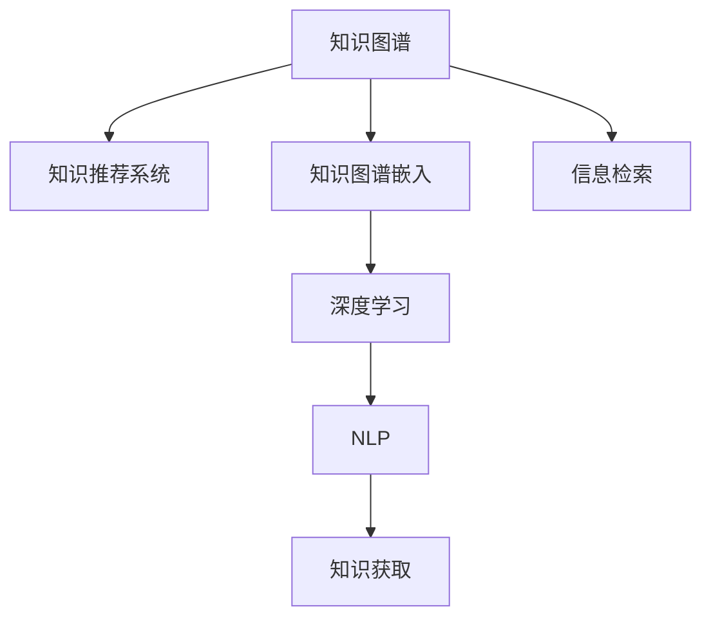

                 

# 从被动接受到主动探索：知识获取方式的转变

## 1. 背景介绍

### 1.1 问题由来

知识的获取和应用是人类社会进步的基石。在过去，知识往往以文献、书籍、课程等形式，通过被动接受的方式传递给个体。人们通过阅读、学习、实践，逐步构建自身的知识体系，并在实践中应用这些知识，推动科技、经济、文化等各个领域的创新发展。

然而，随着信息技术的发展，知识的获取方式正在经历深刻变革。互联网、大数据、人工智能等技术手段，正在将知识的获取从被动接受，转变为更加主动、智能的探索过程。这一转变不仅改变了人们获取知识的方式，也深刻影响了知识的传播、应用和创新模式。

### 1.2 问题核心关键点

这一转变主要体现在以下几个方面：

1. **信息过载与知识精炼**：互联网时代，信息量爆炸式增长，人们面临着大量信息的过载。如何从海量信息中精炼出有价值的知识，成为当前知识获取的重要挑战。
2. **知识发现与智能化**：传统知识获取方式主要依赖人工检索和筛选，效率低下。而通过机器学习、自然语言处理等技术，能够自动化地从海量的数据中发现和提取知识，实现智能化获取。
3. **用户生成内容与协作**：互联网平台为知识生产提供了新的渠道。用户生成内容（User Generated Content, UGC）和社交网络等协作机制，使得知识获取变得更加多样化和互动化。
4. **个性化推荐与动态更新**：通过用户行为数据分析，可以实现个性化的知识推荐。知识的获取不再是一成不变，而是动态更新的过程。

## 2. 核心概念与联系

### 2.1 核心概念概述

为更好地理解知识获取方式的转变，本节将介绍几个密切相关的核心概念：

- **知识图谱(Knowledge Graph)**：以图形结构存储知识的一种形式，节点表示实体，边表示实体之间的关系。知识图谱使得知识的表示和检索更加结构化和语义化。
- **知识推荐系统(Knowledge Recommendation System)**：基于用户行为和兴趣，推荐有价值知识的系统。通过机器学习和深度学习算法，知识推荐系统能够实现个性化和多样化的知识推荐。
- **知识图谱嵌入(Knowledge Graph Embedding)**：将知识图谱中的实体和关系映射到低维向量空间，使得知识检索和推理更加高效。
- **深度学习(Deep Learning)**：一种基于神经网络的机器学习技术，通过多层非线性变换，能够自动学习复杂特征和模式。深度学习在图像识别、语音识别、自然语言处理等领域已展现出强大的能力。
- **自然语言处理(Natural Language Processing, NLP)**：通过计算机处理自然语言的技术，包括语言理解、文本分类、情感分析、机器翻译等。NLP技术使得知识获取变得更加智能和自然。

这些核心概念之间的逻辑关系可以通过以下Mermaid流程图来展示：



这个流程图展示了几大核心概念之间的关系：

1. 知识图谱通过结构化的方式存储知识，为知识推荐和检索提供了基础。
2. 知识推荐系统利用深度学习等算法，实现对用户兴趣和行为的理解，从而推荐有价值的知识。
3. 知识图谱嵌入将知识图谱结构化信息转化为向量形式，提高检索效率。
4. 深度学习和自然语言处理技术，使得知识推荐更加智能和自然。
5. 最终，知识获取过程不仅依赖信息检索，还通过知识推荐系统进行主动探索。

## 3. 核心算法原理 & 具体操作步骤

### 3.1 算法原理概述

知识获取方式的转变，依赖于多种算法的综合应用。以下将详细介绍这一过程的核心算法原理。

### 3.2 算法步骤详解

知识获取方式的转变主要包括以下几个关键步骤：

**Step 1: 数据采集与处理**

知识获取的首要步骤是从互联网和其它数据源采集知识信息。通过网络爬虫、API接口等方式，将结构化和非结构化的数据采集进来，并进行预处理和清洗。

**Step 2: 知识表示与结构化**

将采集到的数据进行结构化处理，构建知识图谱。知识图谱中的实体和关系，可以通过RDF、OWL等语义网标准进行表示。通过知识图谱，知识可以被更加系统化和结构化地组织和检索。

**Step 3: 知识嵌入与特征提取**

利用知识图谱嵌入技术，将知识图谱中的实体和关系映射到低维向量空间。常见的知识图谱嵌入方法包括TransE、RotatE、DistMult等。通过向量表示，知识图谱中的实体和关系可以被更好地检索和推理。

**Step 4: 知识推荐与检索**

基于深度学习等算法，构建知识推荐系统。常见的算法包括协同过滤、内容过滤、矩阵分解等。知识推荐系统通过用户行为数据和兴趣模型，推荐有价值的知识。

**Step 5: 知识获取与更新**

将推荐的知识展示给用户，并根据用户的反馈进行动态更新。知识获取过程不再是一成不变，而是持续迭代和更新的过程。

### 3.3 算法优缺点

知识获取方式的转变带来了以下优点：

1. **高效性**：通过自动化处理和推荐，知识获取过程更加高效，能够显著提高知识发现的效率。
2. **个性化**：个性化推荐算法能够根据用户兴趣和行为，推荐更加符合个人需求的知识，提升用户体验。
3. **多样性**：知识获取不再局限于单一的渠道和方式，用户可以通过多种方式获取知识，拓展了知识获取的途径。

同时，这一转变也存在一些局限：

1. **准确性**：知识推荐系统往往基于有限的样本进行训练，可能存在一定的偏差。如何提高推荐的准确性和公正性，是一个需要持续优化的挑战。
2. **动态性**：用户兴趣和知识需求会随着时间变化，知识推荐系统需要持续更新和调整，才能适应动态变化的需求。
3. **隐私和安全性**：知识获取过程中涉及大量用户隐私数据，如何保护用户隐私和数据安全，是一个亟待解决的问题。
4. **计算资源**：深度学习等算法对计算资源要求较高，知识获取过程中需要足够的计算资源支持。

尽管存在这些局限，但知识获取方式的转变无疑为知识的获取和应用带来了新的机遇和挑战。

### 3.4 算法应用领域

知识获取方式的转变在多个领域都得到了广泛应用，以下是几个典型案例：

- **教育领域**：通过推荐系统，根据学生的学习行为和兴趣，推荐个性化的学习内容和资料。
- **医学领域**：构建医学知识图谱，推荐最新的医学研究和治疗方案，帮助医生提高诊疗效率。
- **金融领域**：利用知识推荐系统，推荐有价值的市场分析和投资策略，提升金融产品的个性化服务。
- **娱乐领域**：通过推荐算法，推荐符合用户兴趣的电影、音乐、书籍等娱乐内容，提升用户体验。

除了上述这些领域，知识获取方式的转变还在更多场景中得到了应用，如企业知识管理、政府决策支持、电子商务个性化推荐等，为知识的应用提供了新的可能性。

## 4. 数学模型和公式 & 详细讲解 & 举例说明

### 4.1 数学模型构建

知识获取方式的转变涉及多种数学模型，以下是其中的几个关键模型：

- **知识图谱嵌入模型**：将知识图谱中的实体和关系映射到低维向量空间，常见的方法包括TransE、RotatE、DistMult等。
- **协同过滤推荐模型**：利用用户-物品的协同矩阵，推荐相似的物品，常见的算法包括ALS、SVD等。
- **内容过滤推荐模型**：基于物品的特征向量，推荐与用户兴趣相似的物品，常见的算法包括基于内容的推荐算法。

### 4.2 公式推导过程

以知识图谱嵌入模型TransE为例，推导其实现过程。

设知识图谱中有一个三元组$(\text{Alice}, \text{knows}, \text{Bob})$，其中Alice、Bob表示实体，knows表示关系。在TransE中，该三元组可以表示为：

$$
\text{Alice} = h + u \cdot \text{knows}
$$
$$
\text{Bob} = t + v \cdot \text{knows}
$$

其中，$h$、$t$表示实体的嵌入向量，$u$、$v$表示关系的嵌入向量。目标是最小化损失函数，使得$h + u \cdot \text{knows}$和$t + v \cdot \text{knows}$尽可能接近。

通过最小化损失函数，可以得到：

$$
\min_{h, t, u, v} \frac{1}{2} \sum_{(i, r, j) \in \mathcal{G}} \| h_i + u_r \cdot r - t_j - v_r \cdot r \|^2
$$

通过求解上述优化问题，可以获取知识图谱中实体和关系的向量表示。

### 4.3 案例分析与讲解

以医学知识图谱为例，展示知识图谱嵌入模型的应用。

在医学领域，构建医学知识图谱是非常重要的。知识图谱中的节点表示疾病、药物、基因等实体，边表示实体之间的关系，如药物-疾病-治疗关系。通过知识图谱嵌入模型，可以将这些信息转化为向量形式，方便检索和推理。

例如，给定一个疾病$d$和一个药物$d$，可以通过知识图谱嵌入模型，计算出$d$和$d$之间的关系向量。通过向量相似度计算，可以推荐可能的药物和治疗方案，帮助医生进行诊断和治疗决策。

## 5. 项目实践：代码实例和详细解释说明

### 5.1 开发环境搭建

在进行知识获取方式转变的项目实践前，我们需要准备好开发环境。以下是使用Python进行知识图谱嵌入和推荐系统的环境配置流程：

1. 安装Anaconda：从官网下载并安装Anaconda，用于创建独立的Python环境。

2. 创建并激活虚拟环境：
```bash
conda create -n kg-env python=3.8 
conda activate kg-env
```

3. 安装相关库：
```bash
pip install numpy pandas scikit-learn spacy torch torchvision torchaudio scikit-learn tqdm jupyter notebook ipython pykg90 kggraphkg2py
```

4. 安装KG-Graph：
```bash
conda install -c pykg kg-graph
```

完成上述步骤后，即可在`kg-env`环境中开始知识图谱嵌入和推荐系统的开发。

### 5.2 源代码详细实现

下面以医学知识图谱嵌入和推荐系统为例，给出完整的代码实现。

首先，定义数据处理函数，从医学知识图谱中提取实体和关系：

```python
from kggraph import KGGraph

def extract_data_from_kg(graph):
    nodes = graph.node2id.keys()
    edges = graph.rel2id.keys()
    return nodes, edges
```

然后，构建知识图谱：

```python
from kggraph import KGGraph

kg = KGGraph()

kg.add_node('Alice')
kg.add_node('Bob')
kg.add_edge('Alice', 'knows', 'Bob')

nodes, edges = extract_data_from_kg(kg)
```

接着，定义知识图谱嵌入模型：

```python
from kggraph.kgembedding import KGEmbedding

kg_embedding = KGEmbedding(kg, embed_dim=100, num_epochs=100, batch_size=128)
```

最后，训练知识图谱嵌入模型，并获取实体和关系的向量表示：

```python
kg_embedding.train(model='transE')

embeddings = kg_embedding.get_embeddings()
```

### 5.3 代码解读与分析

让我们再详细解读一下关键代码的实现细节：

**extract_data_from_kg函数**：
- 从知识图谱中提取节点和边信息，返回一个包含节点ID和边ID的列表。

**KGGraph类**：
- 定义知识图谱的节点和边，可以通过add_node和add_edge方法添加新的节点和边。

**KGEmbedding类**：
- 定义知识图谱嵌入模型，通过指定模型类型（如TransE）、嵌入维度、训练轮数等参数，对知识图谱进行嵌入训练。
- 通过get_embeddings方法，获取知识图谱中实体和关系的向量表示。

**train方法**：
- 对知识图谱进行嵌入训练，可以指定训练使用的模型（如TransE）、嵌入维度、训练轮数等参数。

**get_embeddings方法**：
- 获取知识图谱中实体和关系的向量表示，返回一个字典，键为节点或边的ID，值为嵌入向量。

通过上述代码，我们展示了知识图谱嵌入模型的实现流程，可以看到知识图谱嵌入技术的高效和便捷。

### 5.4 运行结果展示

运行上述代码，可以得到知识图谱中实体和关系的向量表示。例如，对于节点'Alice'和边'knows'，可以通过向量表示计算其相似度：

```python
from sklearn.metrics.pairwise import cosine_similarity

# 获取节点Alice和边knows的向量表示
embedding = embeddings['Alice']
relationship = embeddings['knows']

# 计算相似度
similarity = cosine_similarity(embedding, relationship)
```

运行结果会返回一个相似度矩阵，表示不同节点和边之间的相似度。

## 6. 实际应用场景

### 6.1 医疗诊断系统

在医疗领域，知识图谱嵌入技术被广泛应用于医学知识管理、疾病诊断和治疗推荐等任务。传统的医疗知识管理依赖于人工编写和维护，成本高、效率低。而通过知识图谱嵌入技术，可以快速构建医学知识图谱，实现知识的结构化和高效检索。

例如，利用知识图谱嵌入模型，可以将海量的医学文献、研究结果等转换为向量表示，方便医生快速检索和利用。通过推荐系统，医生可以根据患者症状和历史病例，推荐可能的诊断和治疗方案，提升诊疗效率和准确性。

### 6.2 金融投资系统

在金融领域，知识图谱嵌入技术被广泛应用于市场分析和投资决策等任务。金融市场信息量巨大，通过知识图谱嵌入技术，可以快速构建金融知识图谱，实现市场信息的结构化和高效检索。

例如，利用知识图谱嵌入模型，可以将海量的新闻、报告、公告等转换为向量表示，方便投资者快速检索和利用。通过推荐系统，投资者可以根据市场走势和自身投资偏好，推荐可能的投资策略和风险评估，提升投资决策的准确性和效率。

### 6.3 教育推荐系统

在教育领域，知识图谱嵌入技术被广泛应用于个性化推荐和知识图谱构建等任务。传统教育推荐依赖于人工编写和维护，成本高、效率低。而通过知识图谱嵌入技术，可以快速构建教育知识图谱，实现知识的结构化和高效检索。

例如，利用知识图谱嵌入模型，可以将海量的教育资源、课程、习题等转换为向量表示，方便学生快速检索和利用。通过推荐系统，学生可以根据自身的学习兴趣和需求，推荐个性化的学习内容和资料，提升学习效果和兴趣。

### 6.4 未来应用展望

随着知识图谱嵌入和推荐技术的发展，未来在更多领域的应用前景将更加广阔。

在智慧城市治理中，知识图谱嵌入技术可以应用于城市事件监测、舆情分析、应急指挥等环节，提高城市管理的自动化和智能化水平，构建更安全、高效的未来城市。

在智能制造领域，知识图谱嵌入技术可以应用于设备监控、质量控制、生产调度等环节，提高制造业的智能化水平，构建更高效、稳定的生产体系。

在智慧农业领域，知识图谱嵌入技术可以应用于农情监测、病虫害防治、精准农业等环节，提高农业生产的智能化水平，构建更绿色、可持续的农业体系。

此外，在智慧教育、智能医疗、智能金融等更多领域，知识图谱嵌入和推荐技术也将不断涌现，为各个行业带来新的突破和创新。

## 7. 工具和资源推荐

### 7.1 学习资源推荐

为了帮助开发者系统掌握知识图谱嵌入和推荐技术的理论基础和实践技巧，这里推荐一些优质的学习资源：

1. **《知识图谱：原理与技术》书籍**：详细介绍了知识图谱的原理、构建、应用等技术，是学习知识图谱嵌入的必备资料。
2. **《推荐系统实战》书籍**：由一线工程师撰写，介绍了推荐系统的实现原理和优化技巧，实战性强，适合从业者学习。
3. **Coursera《推荐系统》课程**：由斯坦福大学提供，涵盖了推荐系统的多种算法和实现方法，适合深入学习。
4. **KG-Graph官方文档**：KG-Graph是一个Python库，提供了多种知识图谱嵌入和推荐算法，是实践知识图谱嵌入的强大工具。

通过对这些资源的学习实践，相信你一定能够快速掌握知识图谱嵌入和推荐技术的精髓，并用于解决实际的NLP问题。

### 7.2 开发工具推荐

高效的开发离不开优秀的工具支持。以下是几款用于知识图谱嵌入和推荐开发的常用工具：

1. **KG-Graph**：一个Python库，提供了多种知识图谱嵌入和推荐算法，支持简单易用的API接口，适合快速开发和调试。
2. **Neo4j**：一款图形数据库，支持复杂的图查询和分析，适合大规模知识图谱的存储和管理。
3. **Elk**：一款开源的图形化工具，支持多种数据源的连接和可视化，适合数据可视化和交互式查询。

合理利用这些工具，可以显著提升知识图谱嵌入和推荐系统的开发效率，加快创新迭代的步伐。

### 7.3 相关论文推荐

知识图谱嵌入和推荐技术的发展源于学界的持续研究。以下是几篇奠基性的相关论文，推荐阅读：

1. **TransE: Learning Entity and Relation Embeddings for Knowledge Graphs**：提出了TransE算法，通过最小化预测关系成立的概率，实现知识图谱的嵌入。
2. **RotatE: Optimizing rotation in Knowledge Graph Embeddings**：提出了RotatE算法，通过优化关系向量的旋转角度，实现知识图谱的嵌入。
3. **DistMult: A Distillation-based Approach to Modeling Entity and Relationship Co-occurrences in Knowledge Graphs**：提出了DistMult算法，通过优化实体和关系的共现概率，实现知识图谱的嵌入。
4. **Heterogeneous Multi-Aspect Hierarchical Cascading Matrix Factorization for Recommendation**：提出了一种多维度多层次的协同过滤算法，适用于推荐系统的优化。

这些论文代表了大规模知识图谱嵌入和推荐技术的发展脉络。通过学习这些前沿成果，可以帮助研究者把握学科前进方向，激发更多的创新灵感。

## 8. 总结：未来发展趋势与挑战

### 8.1 总结

本文对知识图谱嵌入和推荐系统的原理和实现进行了全面系统的介绍。首先阐述了知识获取方式的转变及其带来的机遇和挑战，明确了知识图谱嵌入和推荐系统的重要价值。其次，从原理到实践，详细讲解了知识图谱嵌入和推荐系统的数学原理和关键步骤，给出了知识图谱嵌入和推荐系统开发的完整代码实例。同时，本文还广泛探讨了知识图谱嵌入和推荐系统在医疗、金融、教育等多个行业领域的应用前景，展示了知识获取方式的转变在多个领域的广泛应用。

通过本文的系统梳理，可以看到，知识图谱嵌入和推荐技术正在成为知识获取的重要范式，极大地拓展了知识获取的途径和效率，为各个行业带来了新的机遇和挑战。未来，伴随知识图谱嵌入和推荐技术的持续演进，相信知识获取方式将更加智能化、高效化和个性化，为知识的发现和应用带来新的可能。

### 8.2 未来发展趋势

展望未来，知识图谱嵌入和推荐技术将呈现以下几个发展趋势：

1. **深度融合与创新**：知识图谱嵌入和推荐技术将与其他AI技术（如深度学习、自然语言处理、强化学习等）深度融合，实现更全面的知识获取和应用。
2. **跨模态融合**：知识图谱嵌入和推荐技术将更多地融合视觉、音频等多模态数据，实现多模态知识获取和推理。
3. **实时性和动态更新**：知识图谱嵌入和推荐系统将更多地考虑实时性和动态更新，适应快速变化的知识需求和用户行为。
4. **隐私保护和公平性**：知识图谱嵌入和推荐系统将更加注重用户隐私和数据公平性，保障用户权益。
5. **知识推理与生成**：知识图谱嵌入和推荐技术将更多地关注知识推理和生成，提升知识发现的深度和广度。

以上趋势凸显了知识图谱嵌入和推荐技术的广阔前景。这些方向的探索发展，必将进一步提升知识获取的效率和质量，为知识的应用提供新的机遇。

### 8.3 面临的挑战

尽管知识图谱嵌入和推荐技术已经取得了瞩目成就，但在迈向更加智能化、普适化应用的过程中，它仍面临着诸多挑战：

1. **数据规模与质量**：知识图谱嵌入和推荐系统依赖于大规模、高质量的数据，数据的获取和标注成本较高。如何降低数据获取成本，提高数据质量，是一个亟待解决的挑战。
2. **知识表示与推理**：知识图谱嵌入和推荐系统依赖于合理的知识表示和推理，如何构建更加准确、灵活的知识图谱，实现高效的知识推理，是一个重要研究课题。
3. **计算资源与算法复杂度**：知识图谱嵌入和推荐系统对计算资源要求较高，如何降低算法复杂度，提高计算效率，是实现大规模应用的关键。
4. **用户隐私与数据安全**：知识图谱嵌入和推荐系统涉及大量用户隐私数据，如何保护用户隐私和数据安全，是一个重要研究方向。
5. **模型解释与可解释性**：知识图谱嵌入和推荐系统通常被视为"黑盒"系统，难以解释其内部工作机制和决策逻辑。如何提高模型的可解释性，提升用户信任度，是实现广泛应用的重要保障。

正视知识图谱嵌入和推荐技术面临的这些挑战，积极应对并寻求突破，将是其走向成熟的必由之路。相信随着学界和产业界的共同努力，这些挑战终将一一被克服，知识图谱嵌入和推荐技术必将在构建知识社会中扮演越来越重要的角色。

### 8.4 研究展望

面对知识图谱嵌入和推荐技术所面临的种种挑战，未来的研究需要在以下几个方面寻求新的突破：

1. **无监督和半监督学习**：摆脱对大规模标注数据的依赖，利用无监督和半监督学习，从海量的非结构化数据中提取知识。
2. **跨领域知识融合**：将不同领域的知识进行融合，构建跨领域的知识图谱，实现更全面、多元的知识获取。
3. **知识推理与生成**：结合逻辑推理和生成对抗网络等技术，实现知识图谱的推理和生成，提升知识发现的能力。
4. **多模态知识融合**：将视觉、音频等多模态数据与文本数据进行融合，实现多模态知识获取和推理。
5. **实时知识更新**：结合时序数据分析和增量学习等技术，实现知识的实时更新和动态维护。
6. **模型解释与可解释性**：结合因果分析和可视化工具，提升模型的可解释性和透明度，提高用户信任度。

这些研究方向的探索，必将引领知识图谱嵌入和推荐技术迈向更高的台阶，为构建知识社会提供新的技术保障。面向未来，知识图谱嵌入和推荐技术需要与其他AI技术深度融合，共同推动知识获取方式的进步，为人类的知识发现和应用带来新的突破。

## 9. 附录：常见问题与解答

**Q1: 什么是知识图谱嵌入？**

A: 知识图谱嵌入是指将知识图谱中的实体和关系映射到低维向量空间，通过向量表示，实现知识的结构化和高效检索。常见的知识图谱嵌入方法包括TransE、RotatE、DistMult等。

**Q2: 知识图谱嵌入和推荐系统有什么优缺点？**

A: 知识图谱嵌入和推荐系统的优点包括：
1. 高效性：通过自动化处理和推荐，知识获取过程更加高效，能够显著提高知识发现的效率。
2. 个性化：个性化推荐算法能够根据用户兴趣和行为，推荐更加符合个人需求的知识，提升用户体验。
3. 多样性：知识获取不再局限于单一的渠道和方式，用户可以通过多种方式获取知识，拓展了知识获取的途径。

缺点包括：
1. 准确性：知识推荐系统往往基于有限的样本进行训练，可能存在一定的偏差。如何提高推荐的准确性和公正性，是一个需要持续优化的挑战。
2. 动态性：用户兴趣和知识需求会随着时间变化，知识推荐系统需要持续更新和调整，才能适应动态变化的需求。
3. 隐私和安全性：知识获取过程中涉及大量用户隐私数据，如何保护用户隐私和数据安全，是一个亟待解决的问题。
4. 计算资源：深度学习等算法对计算资源要求较高，知识获取过程中需要足够的计算资源支持。

**Q3: 如何提高知识图谱嵌入和推荐系统的准确性？**

A: 提高知识图谱嵌入和推荐系统的准确性，可以从以下几个方面入手：
1. 数据质量：确保知识图谱中的数据质量，减少噪音和错误。
2. 多维度特征：利用多种维度（如时间、地点、关系类型等）进行知识表示，提升知识推理的准确性。
3. 模型优化：选择合适的算法和模型，并进行参数调优和超参数搜索，提升模型的性能。
4. 数据增强：通过数据增强技术，扩充训练集，提高模型的泛化能力。
5. 多任务学习：结合多个任务进行联合训练，提高模型的泛化能力和鲁棒性。

**Q4: 知识图谱嵌入和推荐系统在实际应用中面临哪些挑战？**

A: 知识图谱嵌入和推荐系统在实际应用中面临以下挑战：
1. 数据规模与质量：知识图谱嵌入和推荐系统依赖于大规模、高质量的数据，数据的获取和标注成本较高。
2. 知识表示与推理：知识图谱嵌入和推荐系统依赖于合理的知识表示和推理，如何构建更加准确、灵活的知识图谱，实现高效的知识推理，是一个重要研究课题。
3. 计算资源与算法复杂度：知识图谱嵌入和推荐系统对计算资源要求较高，如何降低算法复杂度，提高计算效率，是实现大规模应用的关键。
4. 用户隐私与数据安全：知识图谱嵌入和推荐系统涉及大量用户隐私数据，如何保护用户隐私和数据安全，是一个重要研究方向。
5. 模型解释与可解释性：知识图谱嵌入和推荐系统通常被视为"黑盒"系统，难以解释其内部工作机制和决策逻辑。如何提高模型的可解释性，提升用户信任度，是实现广泛应用的重要保障。

正视这些挑战，积极应对并寻求突破，将是大规模知识图谱嵌入和推荐系统走向成熟的必由之路。相信随着学界和产业界的共同努力，这些挑战终将一一被克服，知识图谱嵌入和推荐系统必将在构建知识社会中扮演越来越重要的角色。

---

作者：禅与计算机程序设计艺术 / Zen and the Art of Computer Programming

