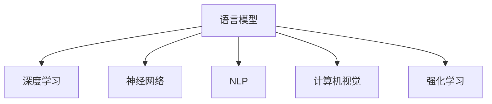
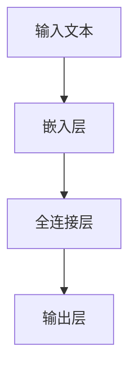

                 

# 从零开始的AI旅程：构建你的第一个语言模型

> 关键词：语言模型,深度学习,神经网络,自然语言处理,计算机视觉,强化学习

## 1. 背景介绍

### 1.1 问题由来

随着人工智能技术的发展，自然语言处理(NLP)逐渐成为研究热点。语言模型作为NLP中最重要的基础组件，用于预测文本序列中下一个单词或字符的概率，是构建文本生成、机器翻译、文本分类等任务的基础。深度学习技术的兴起，尤其是神经网络的发展，为构建高性能语言模型提供了可能。本文将介绍如何从零开始构建并训练一个语言模型，帮助你迈出AI技术的第一步。

### 1.2 问题核心关键点

构建语言模型的关键在于选择合适的模型架构，设计合适的损失函数，以及利用数据进行训练。本文将系统地介绍深度学习中构建语言模型的基本方法，包括模型架构、损失函数、优化算法等核心概念，并通过具体案例展示语言模型的构建和训练过程。

## 2. 核心概念与联系

### 2.1 核心概念概述

为更好地理解语言模型的构建，本节将介绍几个关键概念：

- 语言模型(Language Model)：用于预测文本序列中下一个单词或字符的概率模型。语言模型的任务是学习文本序列的统计规律，从而能够基于前文预测出下一个单词或字符。

- 深度学习(Deep Learning)：一种机器学习技术，通过构建多层神经网络，自动从数据中学习复杂模式，实现对数据的深度表示和理解。

- 神经网络(Neural Network)：由多个神经元(节点)和连接它们的边组成的网络结构。神经网络是深度学习中常用的模型架构。

- 自然语言处理(Natural Language Processing, NLP)：涉及自然语言和计算机的交互，包括语言理解、生成、翻译、情感分析等任务。

- 计算机视觉(Computer Vision, CV)：涉及图像识别、目标检测、图像生成等任务，与语言模型相似，都是深度学习中的重要领域。

- 强化学习(Reinforcement Learning, RL)：一种通过与环境交互，使智能体学习最优策略的机器学习方法。强化学习在自动驾驶、游戏AI等领域有广泛应用。

这些概念之间的逻辑关系可以通过以下Mermaid流程图来展示：



这个流程图展示了大语言模型与其他人工智能技术之间的联系。通过理解这些核心概念，我们可以更好地把握深度学习在各个领域的应用。

## 3. 核心算法原理 & 具体操作步骤
### 3.1 算法原理概述

构建语言模型的基本思想是，通过神经网络对文本序列进行建模，学习文本序列中单词或字符之间的概率关系。假设文本序列为 $x_1, x_2, ..., x_n$，语言模型为 $p(x_1, x_2, ..., x_n)$，其概率分布为 $p(x_i|x_{i-1}, ..., x_1)$，表示在给定前文 $x_{i-1}, ..., x_1$ 的情况下，下一个单词或字符 $x_i$ 的概率。

常用的语言模型有n-gram模型和神经网络语言模型。n-gram模型通过统计文本序列中相邻单词或字符的共现关系，建模文本序列的分布；神经网络语言模型则通过多层神经网络，自动学习文本序列的复杂分布。

### 3.2 算法步骤详解

构建语言模型的步骤如下：

**Step 1: 设计模型架构**

- 选择合适的神经网络架构。常用的模型有RNN、LSTM、GRU、Transformer等。
- 确定模型的输入和输出。输入为文本序列的嵌入表示，输出为目标单词或字符的预测概率。

**Step 2: 定义损失函数**

- 选择合适的损失函数。常用的损失函数包括交叉熵损失、均方误差损失等。
- 计算损失函数。将预测概率与真实标签的交叉熵作为损失值，反向传播计算梯度。

**Step 3: 选择优化算法**

- 选择合适的优化算法及其参数。常用的优化算法包括SGD、Adam等。
- 设置学习率、批大小等超参数。

**Step 4: 训练模型**

- 将训练集数据分批次输入模型，前向传播计算损失函数。
- 反向传播计算参数梯度，根据设定的优化算法和学习率更新模型参数。
- 周期性在验证集上评估模型性能，根据性能指标决定是否触发Early Stopping。
- 重复上述步骤直至满足预设的迭代轮数或Early Stopping条件。

**Step 5: 测试和部署**

- 在测试集上评估模型性能，对比训练前后的精度提升。
- 使用模型对新样本进行推理预测，集成到实际的应用系统中。

以上是构建语言模型的基本流程。在实际应用中，还需要针对具体任务的特点，对模型架构、损失函数、超参数等进行优化设计，以进一步提升模型性能。

### 3.3 算法优缺点

语言模型的优点包括：

- 简单高效。模型结构和训练过程相对简单，适合初学者快速上手。
- 应用广泛。语言模型在文本生成、机器翻译、情感分析等多个领域有广泛应用。
- 可解释性强。神经网络语言模型的内部工作机制较为透明，可解释性强。

缺点包括：

- 数据需求高。构建高性能语言模型需要大量标注数据，数据获取成本较高。
- 模型复杂度高。深度神经网络模型参数较多，训练和推理计算量大。
- 泛化能力有限。对于特定领域的数据，语言模型的性能可能受限。

尽管存在这些局限性，但语言模型仍然是构建NLP任务的基础工具，广泛应用于各种实际应用中。

### 3.4 算法应用领域

语言模型在NLP领域有着广泛的应用，例如：

- 文本生成：如自动摘要、文本创作、对话系统等。通过生成模型，可以自动产生高质量的文本内容。
- 机器翻译：将源语言文本翻译成目标语言。通过语言模型，可以学习语言之间的转换关系。
- 文本分类：如情感分析、主题分类等。通过分类模型，可以将文本自动分类到不同类别中。
- 信息检索：如搜索引擎中的关键词匹配。通过语言模型，可以计算文本之间的相似度。

此外，语言模型还被用于计算机视觉中的图像描述生成、强化学习中的智能体行为预测等多个领域。

## 4. 数学模型和公式 & 详细讲解  
### 4.1 数学模型构建

语言模型的数学模型通常采用概率模型表示，假设给定前文 $x_{i-1}, ..., x_1$，下一个单词或字符 $x_i$ 的条件概率为 $p(x_i|x_{i-1}, ..., x_1)$。

设 $x_i$ 为文本序列中的单词或字符，$y_i$ 为标签，则交叉熵损失函数为：

$$
\ell(M_{\theta}(x_i),y_i) = -y_i\log M_{\theta}(x_i) - (1-y_i)\log(1-M_{\theta}(x_i))
$$

其中 $M_{\theta}(x_i)$ 为模型在输入 $x_i$ 下的预测概率。

### 4.2 公式推导过程

以简单的二分类任务为例，假设模型在输入 $x$ 上的输出为 $\hat{y}=M_{\theta}(x) \in [0,1]$，表示样本属于正类的概率。真实标签 $y \in \{0,1\}$。则二分类交叉熵损失函数定义为：

$$
\ell(M_{\theta}(x),y) = -[y\log \hat{y} + (1-y)\log (1-\hat{y})]
$$

将其代入损失函数，得：

$$
\mathcal{L}(\theta) = -\frac{1}{N}\sum_{i=1}^N [y_i\log M_{\theta}(x_i)+(1-y_i)\log(1-M_{\theta}(x_i))]
$$

其中 $N$ 为样本数，$y_i$ 为标签，$M_{\theta}(x_i)$ 为模型在输入 $x_i$ 下的预测概率。

### 4.3 案例分析与讲解

以下以简单的二分类任务为例，展示如何构建和训练语言模型。

假设我们有训练集 $D=\{(x_i,y_i)\}_{i=1}^N$，其中 $x_i$ 为文本，$y_i$ 为标签。模型的输入为文本 $x_i$，输出为预测标签 $\hat{y}_i$。我们使用交叉熵损失函数对模型进行训练。

模型的架构可以采用简单的单层神经网络，输入为文本 $x_i$ 的嵌入表示 $v_i$，输出为预测标签 $\hat{y}_i$。模型结构如图1所示：



模型的训练过程如下：

1. 将训练集数据 $D$ 分批次输入模型，计算预测标签 $\hat{y}_i$。
2. 计算损失函数 $\ell(\hat{y}_i,y_i)$。
3. 反向传播计算梯度，更新模型参数 $\theta$。
4. 重复上述步骤直至满足预设的迭代轮数或停止条件。

在实际应用中，我们还需要对模型进行评估和优化。通常使用验证集对模型进行评估，选取性能最优的模型。

## 5. 项目实践：代码实例和详细解释说明
### 5.1 开发环境搭建

在进行语言模型构建和训练前，我们需要准备好开发环境。以下是使用Python进行PyTorch开发的环境配置流程：

1. 安装Anaconda：从官网下载并安装Anaconda，用于创建独立的Python环境。

2. 创建并激活虚拟环境：
```bash
conda create -n pytorch-env python=3.8 
conda activate pytorch-env
```

3. 安装PyTorch：根据CUDA版本，从官网获取对应的安装命令。例如：
```bash
conda install pytorch torchvision torchaudio cudatoolkit=11.1 -c pytorch -c conda-forge
```

4. 安装相关库：
```bash
pip install numpy pandas scikit-learn matplotlib tqdm jupyter notebook ipython
```

完成上述步骤后，即可在`pytorch-env`环境中开始语言模型的构建和训练。

### 5.2 源代码详细实现

下面是使用PyTorch构建和训练简单的二分类模型的代码实现：

```python
import torch
import torch.nn as nn
import torch.optim as optim

class SimpleNet(nn.Module):
    def __init__(self, input_size, hidden_size, output_size):
        super(SimpleNet, self).__init__()
        self.fc1 = nn.Linear(input_size, hidden_size)
        self.fc2 = nn.Linear(hidden_size, output_size)
        
    def forward(self, x):
        x = torch.relu(self.fc1(x))
        x = self.fc2(x)
        return x
    
# 设置超参数
input_size = 100
hidden_size = 128
output_size = 1
learning_rate = 0.001
batch_size = 32
num_epochs = 10

# 加载数据集
train_dataset = ...
test_dataset = ...

# 定义模型
model = SimpleNet(input_size, hidden_size, output_size)

# 定义损失函数和优化器
criterion = nn.BCEWithLogitsLoss()
optimizer = optim.Adam(model.parameters(), lr=learning_rate)

# 训练模型
for epoch in range(num_epochs):
    for batch_idx, (inputs, targets) in enumerate(train_loader):
        inputs, targets = inputs.to(device), targets.to(device)
        optimizer.zero_grad()
        outputs = model(inputs)
        loss = criterion(outputs, targets)
        loss.backward()
        optimizer.step()
        
        if (batch_idx+1) % 100 == 0:
            print('Train Epoch: {} [{}/{} ({:.0f}%)]\tLoss: {:.6f}'.format(
                epoch, batch_idx * len(inputs), len(train_loader.dataset),
                100. * batch_idx / len(train_loader), loss.item()))

# 测试模型
with torch.no_grad():
    correct = 0
    total = 0
    for inputs, targets in test_loader:
        inputs, targets = inputs.to(device), targets.to(device)
        outputs = model(inputs)
        _, predicted = torch.max(outputs.data, 1)
        total += targets.size(0)
        correct += (predicted == targets).sum().item()

    print('Accuracy of the network on the 10000 test images: {} %'.format(100 * correct / total))
```

### 5.3 代码解读与分析

让我们再详细解读一下关键代码的实现细节：

**SimpleNet类**：
- `__init__`方法：定义模型各层的神经元数量和激活函数。
- `forward`方法：前向传播计算模型的输出。

**超参数**：
- `input_size`：输入数据的维度。
- `hidden_size`：隐藏层的神经元数量。
- `output_size`：输出数据的维度。
- `learning_rate`：学习率。
- `batch_size`：批次大小。
- `num_epochs`：迭代轮数。

**数据加载**：
- `train_dataset` 和 `test_dataset` 为数据集对象，需要定义数据加载器 `train_loader` 和 `test_loader`。

**模型定义**：
- `model` 为实例化的 `SimpleNet` 模型。

**损失函数和优化器**：
- `criterion` 为二分类交叉熵损失函数。
- `optimizer` 为Adam优化器，更新模型的参数。

**训练过程**：
- 在每个epoch内，遍历数据集，前向传播计算损失函数，反向传播更新模型参数。

**测试过程**：
- 在测试集上评估模型的性能，输出模型的准确率。

可以看到，PyTorch的API设计非常简洁，通过继承 `nn.Module` 类，我们可以定义自定义的神经网络模型。通过 `nn` 模块提供的各种函数，我们可以轻松地构建和训练神经网络模型。

## 6. 实际应用场景

### 6.1 文本生成

基于语言模型的文本生成技术可以应用于自动摘要、文本创作、对话系统等多个领域。例如，使用语言模型生成的新闻摘要、小说段落、对话回复等，已经广泛应用于自动化写作、智能客服等场景中。

以对话系统为例，我们可以收集大量的对话数据，对预训练的语言模型进行微调，使其能够自动理解用户的意图，并生成合理的回复。这将极大地提升用户体验，减少客服压力。

### 6.2 机器翻译

机器翻译是将源语言文本翻译成目标语言的任务。基于语言模型的机器翻译系统通过学习源语言和目标语言之间的映射关系，实现自动翻译。

在实践中，我们可以收集大量的双语对照文本，对预训练的语言模型进行微调，使其能够自动将源语言文本翻译成目标语言。微调后的模型在实际翻译任务上往往能够取得较好的效果。

### 6.3 文本分类

文本分类是将文本自动分类到不同类别中的任务。基于语言模型的文本分类系统通过学习文本的语义特征，实现自动分类。

在实践中，我们可以收集大量的标注数据，对预训练的语言模型进行微调，使其能够自动将文本分类到不同的主题、情感等类别中。微调后的模型在实际分类任务上往往能够取得较好的效果。

### 6.4 信息检索

信息检索是将用户查询与文本数据库匹配，返回相关文本的任务。基于语言模型的信息检索系统通过学习查询与文本的相似度，实现自动匹配。

在实践中，我们可以收集大量的查询与文本对，对预训练的语言模型进行微调，使其能够自动匹配查询与文本的相似度。微调后的模型在实际信息检索任务上往往能够取得较好的效果。

## 7. 工具和资源推荐
### 7.1 学习资源推荐

为了帮助开发者系统掌握语言模型的理论基础和实践技巧，这里推荐一些优质的学习资源：

1. 《深度学习》书籍：Ian Goodfellow等著，系统介绍了深度学习的原理、模型和应用。

2. 《TensorFlow深度学习实战》书籍：D Sequential等著，介绍了TensorFlow的使用方法，适合动手实践。

3. 《自然语言处理综述》课程：斯坦福大学开设的NLP课程，讲解了NLP的基础知识，适合入门学习。

4. Coursera《深度学习与神经网络》课程：Andrew Ng等讲授，介绍了深度学习的理论基础和应用实践。

5. Kaggle竞赛：参加Kaggle竞赛，通过实际问题解决训练深度学习模型，积累实战经验。

通过对这些资源的学习实践，相信你一定能够快速掌握语言模型的精髓，并用于解决实际的NLP问题。

### 7.2 开发工具推荐

高效的开发离不开优秀的工具支持。以下是几款用于语言模型构建和训练的常用工具：

1. PyTorch：基于Python的开源深度学习框架，灵活动态的计算图，适合快速迭代研究。

2. TensorFlow：由Google主导开发的开源深度学习框架，生产部署方便，适合大规模工程应用。

3. Keras：高层次的深度学习API，适合快速搭建模型和训练。

4. Jupyter Notebook：交互式的Jupyter Notebook环境，方便代码调试和文档编写。

5. Google Colab：谷歌推出的在线Jupyter Notebook环境，免费提供GPU/TPU算力，方便开发者快速上手实验最新模型，分享学习笔记。

合理利用这些工具，可以显著提升语言模型构建和训练的开发效率，加快创新迭代的步伐。

### 7.3 相关论文推荐

语言模型和深度学习的发展源于学界的持续研究。以下是几篇奠基性的相关论文，推荐阅读：

1. Alex Graves的《A Neural Probabilistic Language Model》：提出基于循环神经网络的神经语言模型，为语言模型的研究奠定了基础。

2. Ian Goodfellow的《Generative Adversarial Networks》：提出生成对抗网络，推动了生成模型的发展。

3. Yoshua Bengio的《A Tutorial on Machine Learning for Speech and Language Processing》：全面介绍了深度学习在语音和语言处理中的应用。

4. Geoffrey Hinton的《A Simple Neural Network for Handwritten Digit Recognition》：提出基于反向传播算法的神经网络模型，推动了深度学习的普及。

5. Christopher Olah的《The Building Blocks of Interpretability》：探讨了深度学习的可解释性问题，推动了模型解释方法的发展。

这些论文代表了大语言模型和深度学习的发展脉络。通过学习这些前沿成果，可以帮助研究者把握学科前进方向，激发更多的创新灵感。

## 8. 总结：未来发展趋势与挑战

### 8.1 总结

本文对构建和训练语言模型的基本方法进行了系统介绍。从原理到实践，详细讲解了深度学习中构建语言模型的基本步骤，包括模型架构、损失函数、优化算法等核心概念。同时，通过具体案例展示语言模型的构建和训练过程，帮助读者快速上手。

通过本文的系统梳理，可以看到，深度学习中构建语言模型需要选择合适的模型架构、定义合适的损失函数、选择合适的优化算法等步骤。只有在数据、模型、训练、推理等各环节进行全面优化，才能得到高性能的语言模型。

### 8.2 未来发展趋势

展望未来，语言模型将呈现以下几个发展趋势：

1. 模型规模持续增大。随着算力成本的下降和数据规模的扩张，预训练语言模型的参数量还将持续增长。超大规模语言模型蕴含的丰富语言知识，有望支撑更加复杂多变的语言应用。

2. 模型通用性增强。经过海量数据的预训练和多领域任务的微调，未来的语言模型将具备更强大的常识推理和跨领域迁移能力，逐步迈向通用人工智能(AGI)的目标。

3. 模型可解释性增强。随着模型复杂度的提升，可解释性成为关键问题。未来，语言模型将通过引入符号化的先验知识，实现更加全面、准确的信息整合能力，并具备更强的可解释性。

4. 跨模态融合。未来的语言模型将融合视觉、语音等多模态数据，实现跨模态信息的整合和协同建模。

5. 实时性提升。大规模语言模型的推理速度和内存占用仍然较大，未来将通过优化模型结构、优化计算图等手段，提升模型的实时性和部署效率。

以上趋势凸显了语言模型在深度学习中的重要地位和广阔前景。这些方向的探索发展，必将进一步提升语言模型的性能和应用范围，为自然语言理解和智能交互系统的进步带来新的突破。

### 8.3 面临的挑战

尽管语言模型已经取得了瞩目成就，但在迈向更加智能化、普适化应用的过程中，它仍面临着诸多挑战：

1. 数据需求高。构建高性能语言模型需要大量标注数据，数据获取成本较高。

2. 模型复杂度高。深度神经网络模型参数较多，训练和推理计算量大。

3. 泛化能力有限。对于特定领域的数据，语言模型的性能可能受限。

4. 模型可解释性不足。神经网络语言模型的内部工作机制较为复杂，难以解释其内部工作机制和决策逻辑。

5. 对抗攻击风险。预训练语言模型在对抗攻击下可能出现漏洞，导致安全风险。

6. 模型鲁棒性不足。语言模型面对小样本、少数据、噪声数据等挑战时，泛化性能可能下降。

7. 数据偏见问题。预训练语言模型可能会学习到数据中的人为偏见，导致模型输出存在歧视性。

这些挑战需要我们在理论和实践中不断探索和突破，才能真正实现语言模型的广泛应用。

### 8.4 研究展望

面对语言模型所面临的挑战，未来的研究需要在以下几个方面寻求新的突破：

1. 探索无监督和半监督学习范式。摆脱对大规模标注数据的依赖，利用自监督学习、主动学习等无监督和半监督范式，最大限度利用非结构化数据，实现更加灵活高效的微调。

2. 研究参数高效和计算高效的微调范式。开发更加参数高效的微调方法，在固定大部分预训练参数的同时，只更新极少量的任务相关参数。同时优化微调模型的计算图，减少前向传播和反向传播的资源消耗，实现更加轻量级、实时性的部署。

3. 融合因果推断和博弈论工具。通过引入因果推断和博弈论思想，增强语言模型建立稳定因果关系的能力，学习更加普适、鲁棒的语言表征。

4. 引入更多先验知识。将符号化的先验知识，如知识图谱、逻辑规则等，与神经网络模型进行巧妙融合，引导微调过程学习更准确、合理的语言模型。

5. 结合因果分析和博弈论工具。将因果分析方法引入语言模型，识别出模型决策的关键特征，增强输出解释的因果性和逻辑性。借助博弈论工具刻画人机交互过程，主动探索并规避模型的脆弱点，提高系统稳定性。

6. 纳入伦理道德约束。在模型训练目标中引入伦理导向的评估指标，过滤和惩罚有偏见、有害的输出倾向。同时加强人工干预和审核，建立模型行为的监管机制，确保输出符合人类价值观和伦理道德。

这些研究方向的探索，必将引领语言模型技术迈向更高的台阶，为构建安全、可靠、可解释、可控的智能系统铺平道路。面向未来，语言模型需要与其他人工智能技术进行更深入的融合，如知识表示、因果推理、强化学习等，多路径协同发力，共同推动自然语言理解和智能交互系统的进步。只有勇于创新、敢于突破，才能不断拓展语言模型的边界，让智能技术更好地造福人类社会。

## 9. 附录：常见问题与解答

**Q1：如何选择合适的模型架构？**

A: 选择合适的模型架构需要考虑任务特点、数据规模、计算资源等因素。常用的模型包括RNN、LSTM、GRU、Transformer等。一般而言，Transformer模型在处理大规模数据时效果较好。

**Q2：如何处理缺失的数据？**

A: 处理缺失数据的方法包括插值、补全等。插值方法通过线性或非线性插值，填补缺失的数据。补全方法通过已有数据进行推断，填补缺失的数据。

**Q3：如何避免过拟合？**

A: 避免过拟合的方法包括正则化、Dropout、早停等。正则化通过L2正则、L1正则等方法，约束模型参数的大小。Dropout通过随机丢弃部分神经元，减少模型的复杂度。早停通过监控验证集上的性能，及时停止训练。

**Q4：如何提高模型的实时性？**

A: 提高模型的实时性可以通过模型压缩、模型剪枝、计算图优化等方法。模型压缩通过减少模型参数数量，减小模型的计算量。模型剪枝通过删除冗余连接，优化模型结构。计算图优化通过优化计算图，提高模型的推理速度。

**Q5：如何提高模型的泛化能力？**

A: 提高模型的泛化能力可以通过数据增强、迁移学习、多任务学习等方法。数据增强通过增加数据样本的多样性，提高模型的泛化能力。迁移学习通过利用已有模型的知识，加速模型的训练。多任务学习通过同时学习多个任务，提高模型的泛化能力。

以上是构建和训练语言模型中常见的疑问及其解答，希望对你有所帮助。

---

作者：禅与计算机程序设计艺术 / Zen and the Art of Computer Programming

