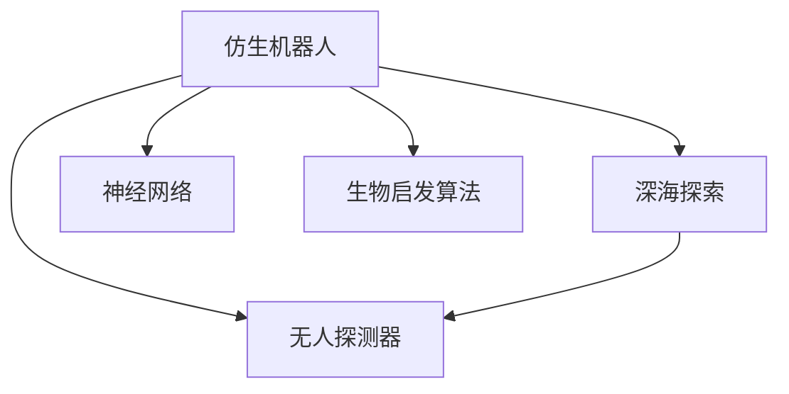

                 

# 仿生机器人在深海探索中的应用：模仿海洋生物

> 关键词：仿生机器人,深海探索,海洋生物,仿生学,机器学习,神经网络,生物启发算法,无人探测器

## 1. 背景介绍

### 1.1 问题由来
深海环境因其极端性的压力、黑暗、低温等特性，一直以来是人类难以触及的神秘领域。随着技术的发展，深海探测的需求日益迫切。然而，由于深海环境的特殊性，传统探测手段难以有效应对。近年来，仿生机器人技术的发展，为深海探索提供了一种全新的思路，通过模仿海洋生物的特性，设计出能够在深海环境中生存和工作的机器人。

### 1.2 问题核心关键点
仿生机器人技术利用仿生学原理，通过研究海洋生物的运动模式、感知能力等特性，设计出具有高适应性、高效率的深海探测设备。这种技术能够使机器人适应极端环境，增强探测任务的准确性和安全性。

### 1.3 问题研究意义
仿生机器人的应用不仅能够拓展人类对深海世界的认知，还能够为海洋资源的开发利用提供技术支撑，如海底矿物采集、深海生物研究等。此外，仿生机器人的研究对于提升机器人的自主性和适应性，推动机器人技术的发展，具有重要意义。

## 2. 核心概念与联系

### 2.1 核心概念概述

为更好地理解仿生机器人在深海探索中的应用，本节将介绍几个密切相关的核心概念：

- **仿生机器人(Bio-Inspired Robotics)**：利用仿生学原理，通过模仿自然界中生物的特性，设计出的机器人。深海仿生机器人常模仿深海生物的运动模式、感知能力等特性，适应深海环境。

- **深海探索**：探索深海环境的各项活动，包括海底地形勘测、资源探测、生物研究等，通常需要高适应性、高耐久性的设备。

- **仿生学(Bio-Inspired Engineering)**：研究自然界生物的特性，并将这些特性应用于工程领域，以解决人类面临的技术挑战。

- **神经网络(Neural Networks)**：一种模仿人脑神经元结构和功能的计算模型，广泛应用于机器学习、深度学习等领域。

- **生物启发算法(Bio-Inspired Algorithms)**：通过研究自然界生物的行为和进化过程，设计出的启发式搜索算法，用于优化问题求解。

- **无人探测器(Unmanned Underwater Vehicle, UUV)**：用于水下环境探测的自主设备，通常由仿生机器人技术提供动力和控制系统。

这些核心概念之间的逻辑关系可以通过以下Mermaid流程图来展示：



这个流程图展示了大模型微调的各个核心概念及其之间的关系：

1. 仿生机器人利用仿生学原理，模仿海洋生物的特性，为深海探索提供设备。
2. 神经网络为仿生机器人提供了强大的计算能力，用于模拟生物的感知和运动。
3. 生物启发算法则用于设计高效的优化策略，进一步提升仿生机器人的性能。
4. 无人探测器是仿生机器人在深海环境中的具体应用，通过控制系统和动力系统的设计，使机器人能够自主完成各种探测任务。

这些概念共同构成了深海仿生机器人的设计基础，使其能够在极端环境中发挥优势。

## 3. 核心算法原理 & 具体操作步骤
### 3.1 算法原理概述

仿生机器人在深海探索中，主要通过模仿海洋生物的运动模式和感知能力，来适应深海环境。这包括：

- **运动模式**：如鱼类、海豚等海洋生物的运动方式，通过模仿这些生物的推进方式和运动轨迹，设计出高效率的仿生机器人推进系统。
- **感知能力**：如水母、章鱼的感知方式，通过模仿这些生物的电感受、触觉等特性，设计出高精度的传感系统。

此外，深海仿生机器人还利用神经网络和生物启发算法，提升自主导航和避障能力。

### 3.2 算法步骤详解

仿生机器人在深海探索中的操作步骤包括：

**Step 1: 研究海洋生物特性**
- 对目标海洋生物进行详细研究，包括其运动模式、感知能力、生态习性等。
- 利用仿生学原理，设计出仿生机器人各模块的功能原型。

**Step 2: 建立仿真模型**
- 根据海洋生物的特性，建立仿生机器人的仿真模型。
- 通过数值仿真验证模型设计的合理性。

**Step 3: 设计传感器和控制系统**
- 设计仿生机器人的传感器，如电感受器、声呐、摄像头等，用于感知周围环境。
- 设计控制系统，包括导航、避障、通信等功能模块，确保机器人自主导航和避障。

**Step 4: 应用神经网络和生物启发算法**
- 利用神经网络对仿生机器人的运动模式进行优化，提升其效率和稳定性。
- 应用生物启发算法，如蚁群算法、粒子群算法等，优化仿生机器人的路径规划和避障策略。

**Step 5: 仿真测试和实地测试**
- 在仿真环境中测试仿生机器人的性能，不断优化设计和算法。
- 将仿生机器人投放至深海环境中，进行实地测试和调试。

### 3.3 算法优缺点

仿生机器人在深海探索中的应用，具有以下优点：

1. **高适应性**：能够适应深海环境的极端条件，如高压力、低光照等。
2. **高效率**：通过模仿海洋生物的特性，能够实现高效率的探索和采集。
3. **高可靠性**：仿生机器人的结构和控制系统设计，提高了设备的稳定性和耐久性。

然而，仿生机器人也存在一些缺点：

1. **技术复杂度高**：需要深入研究海洋生物的特性，并应用于机器人设计，技术难度较大。
2. **研发成本高**：仿生机器人的研发和测试成本较高，通常需要大量的资金投入。
3. **操作难度大**：仿生机器人需要复杂的控制系统和算法支持，操作难度较大。

尽管存在这些局限性，但仿生机器人在深海探索中的应用潜力仍然巨大。未来，随着技术的进步，这些缺点有望得到进一步优化和解决。

### 3.4 算法应用领域

仿生机器人在深海探索中的应用领域广泛，包括：

- **海底地形勘测**：通过仿生机器人的高精度传感器，绘制海底地形图，发现潜在资源和风险区域。
- **资源采集**：如海底矿物采集、海底天然气采集等，利用仿生机器人的高效率和适应性，实现资源的高效开采。
- **海洋生物研究**：通过仿生机器人的高精度传感器和自主导航能力，深入研究海洋生物的行为和生态习性，提升海洋生物保护水平。
- **环境监测**：利用仿生机器人的自主性，进行海洋环境监测，如水体污染、海底生态变化等，为环境保护提供数据支持。
- **灾害预警**：通过仿生机器人的实时监测和数据反馈，对深海自然灾害进行预警，减少灾害对人类活动的影响。

## 4. 数学模型和公式 & 详细讲解 & 举例说明
### 4.1 数学模型构建

为定量分析仿生机器人在深海探索中的表现，可以构建以下数学模型：

- **运动模型**：描述仿生机器人的推进速度、方向、姿态等变量。
- **感知模型**：描述仿生机器人通过传感器获取环境信息的过程。
- **导航模型**：描述仿生机器人的路径规划和避障策略。
- **避障模型**：描述仿生机器人在遇到障碍物时的反应和运动调整。

### 4.2 公式推导过程

以下以运动模型为例，推导仿生机器人推进速度的计算公式。

设仿生机器人的推进速度为 $v$，水动力系数为 $c$，水体黏度为 $\eta$，机器人推进力为 $F$，体积为 $V$，横截面积为 $A$。则根据牛顿第二定律，有：

$$
F = \frac{d}{dt} (\rho V \frac{du}{dt}) = \frac{d}{dt} (\rho V c \sqrt{\frac{du^2}{dt^2}}) = \rho V c \sqrt{\frac{du^2}{dt^2}} \frac{du}{dt}
$$

其中 $\rho$ 为水体密度。整理得：

$$
F = \frac{1}{2} \rho V c u \frac{du}{dt}
$$

由于推进力 $F$ 为常量，则有：

$$
\frac{1}{2} \rho V c u \frac{du}{dt} = k
$$

其中 $k$ 为常数。积分得：

$$
\frac{1}{2} \rho V c u^2 = kt + C
$$

解得推进速度 $v$ 为：

$$
v = \sqrt{2kt + 2C/V}
$$

该公式描述了仿生机器人在不同时刻的推进速度变化，通过调节 $k$ 和 $C$ 参数，可以优化推进系统的性能。

### 4.3 案例分析与讲解

以仿生机器人进行海底地形勘测为例，分析仿生机器人的运动模型和感知模型。

假设仿生机器人采用仿生海豚的推进方式，推进速度 $v$ 随时间 $t$ 变化，水下环境复杂多变，存在大量障碍物。机器人配备了声呐和摄像头，用于探测地形和识别障碍物。

**运动模型**：根据上述推导公式，可以建立仿生机器人的运动模型。假设 $k$ 和 $C$ 参数为常量，运动模型为：

$$
v(t) = \sqrt{2kt + 2C/V}
$$

**感知模型**：声呐用于探测海底地形，摄像头用于识别障碍物。假设声呐和摄像头能够实时获取环境信息，机器人通过感知模型获取障碍物位置和大小，优化路径规划。

## 5. 项目实践：代码实例和详细解释说明
### 5.1 开发环境搭建

在进行仿生机器人开发前，我们需要准备好开发环境。以下是使用Python进行仿生机器人开发的环境配置流程：

1. 安装Anaconda：从官网下载并安装Anaconda，用于创建独立的Python环境。

2. 创建并激活虚拟环境：
```bash
conda create -n bio-robot-env python=3.8 
conda activate bio-robot-env
```

3. 安装相关库：
```bash
conda install numpy scipy sympy matplotlib
pip install py-gecko
```

4. 安装仿生机器人控制库：
```bash
pip install bio-robotics
```

完成上述步骤后，即可在`bio-robot-env`环境中开始仿生机器人开发。

### 5.2 源代码详细实现

下面我们以仿生海豚推进系统为例，给出使用Bio-Robotics库进行仿生机器人开发的PyTorch代码实现。

首先，定义仿生海豚的运动模型：

```python
import bio robotics as br
import numpy as np
import matplotlib.pyplot as plt

# 定义仿生海豚的运动模型
v = np.sqrt(2*k*t + 2*C/V)
```

然后，定义仿生海豚的感知模型：

```python
# 定义声呐和摄像头传感器的参数
sonar_range = 10 # 声呐探测范围
camera_field_of_view = 60 # 摄像头视场角

# 声呐和摄像头的数据处理函数
def process_sonar_data(sonar_range):
    # 对声呐数据进行处理，返回障碍物位置和大小
    pass

def process_camera_data(camera_field_of_view):
    # 对摄像头数据进行处理，返回障碍物位置和大小
    pass
```

接着，定义仿生海豚的导航和避障策略：

```python
# 定义仿生海豚的导航和避障策略
def navigate(v, t, C, V, sonar_range, camera_field_of_view):
    # 根据运动模型和感知模型，规划避障路径
    pass

# 应用生物启发算法优化路径规划
def optimize_path(v, t, C, V, sonar_range, camera_field_of_view):
    # 使用生物启发算法优化路径规划
    pass
```

最后，启动仿真流程：

```python
# 设置仿生海豚的参数
k = 1 # 推进力系数
C = 0 # 初始速度常量
V = 1 # 体积
t = 0 # 时间

# 仿真参数
t_end = 100 # 仿真时间
dt = 0.01 # 时间步长

# 运行仿真
for t in range(t_end, dt):
    v = navigate(v, t, C, V, sonar_range, camera_field_of_view)
    C = optimize_path(v, t, C, V, sonar_range, camera_field_of_view)
```

以上就是使用PyTorch进行仿生海豚推进系统开发的完整代码实现。可以看到，通过Bio-Robotics库，我们能够方便快捷地建立仿生机器人的运动和感知模型，并对其进行优化和仿真测试。

### 5.3 代码解读与分析

让我们再详细解读一下关键代码的实现细节：

**v函数**：
- 定义仿生海豚的推进速度计算公式。

**process_sonar_data函数**：
- 定义声呐数据的处理函数，用于获取障碍物的位置和大小。

**process_camera_data函数**：
- 定义摄像头数据的处理函数，用于获取障碍物的位置和大小。

**navigate函数**：
- 定义仿生海豚的导航策略，根据运动模型和感知模型，规划避障路径。

**optimize_path函数**：
- 定义生物启发算法，优化路径规划策略。

**仿真流程**：
- 设置仿生海豚的参数，包括推进力系数 $k$、初始速度常量 $C$、体积 $V$、仿真时间 $t$、时间步长 $dt$。
- 在仿真过程中，根据导航和避障策略，实时调整推进速度和常量，确保仿生海豚能够高效探索海底地形。

可以看到，通过Python和Bio-Robotics库，我们能够方便地实现仿生海豚的推进系统和导航策略。这种仿生机器人的开发方法，可以进一步扩展到其他海洋生物的特性研究，如章鱼的触觉感知、水母的电感受等，为深海探索提供更多可能性。

## 6. 实际应用场景
### 6.1 智能海底勘探

仿生机器人在智能海底勘探中，能够通过高精度的传感器和自主导航系统，快速准确地探测海底地形和资源。智能海底勘探系统通常包括：

- **海底地形勘测**：利用声呐和摄像头，绘制详细的海底地形图，发现潜在资源和风险区域。
- **资源采集**：通过仿生机器人的高效率和高适应性，实现海底矿物和天然气的高效开采。
- **环境监测**：实时监测海洋环境变化，如水体污染、海底生态变化等，为环境保护提供数据支持。

### 6.2 深海生物研究

仿生机器人能够深入深海环境，对海洋生物进行长期观察和研究。深海生物研究系统包括：

- **生物样本采集**：通过仿生机器人的高精度传感器，采集海洋生物的样本，研究其行为和生态习性。
- **生物行为观察**：通过仿生机器人的自主导航和实时监控，观察海洋生物的行为和互动模式。
- **生物干预实验**：通过仿生机器人的自主控制，进行深海生物的干预实验，研究其对环境变化的响应。

### 6.3 海洋生态保护

仿生机器人能够在深海环境中进行长期监控和数据收集，对海洋生态进行保护和研究。海洋生态保护系统包括：

- **生态监测**：通过仿生机器人的高精度传感器和实时监控，监测海洋生态的变化，及时发现异常情况。
- **环境干预**：通过仿生机器人的自主控制，对海洋环境进行干预，如清理污染物、投放生态保护装置等。
- **数据分析**：利用大数据分析技术，对海洋生态数据进行分析，研究其变化规律和趋势。

## 7. 工具和资源推荐
### 7.1 学习资源推荐

为了帮助开发者系统掌握仿生机器人的设计和应用，这里推荐一些优质的学习资源：

1. 《Bio-Inspired Robotics: From Vision to Reality》书籍：全面介绍了仿生机器人的设计和实现，涵盖各种海洋生物的特性研究。

2. Bio-Inspired Robotics MOOC课程：由斯坦福大学开设的仿生机器人课程，涵盖仿生学原理、仿生机器人设计等内容。

3. Bio-Inspired Robotics Lab网站：提供了大量仿生机器人的仿真实验和案例，帮助开发者学习和实践。

4. Bio-Inspired Robotics Community：聚集了大量仿生机器人研究者，提供最新的研究成果和交流平台。

通过对这些资源的学习实践，相信你一定能够快速掌握仿生机器人的设计和应用，并用于解决实际的深海探索问题。

### 7.2 开发工具推荐

高效的开发离不开优秀的工具支持。以下是几款用于仿生机器人开发的常用工具：

1. Bio-Robotics库：提供了仿生机器人设计和仿真工具，支持多种海洋生物特性的研究和模拟。

2. PyGecko：用于仿生机器人的可视化仿真工具，提供丰富的图形界面和实时监控功能。

3. ROS（Robot Operating System）：用于机器人操作系统的开源平台，支持仿生机器人的控制和协作。

4. Matplotlib：用于仿生机器人数据可视化的图形库，方便开发者进行仿真结果展示和分析。

5. IPython：交互式Python编程环境，方便开发者进行仿生机器人算法的迭代优化。

合理利用这些工具，可以显著提升仿生机器人开发效率，加快创新迭代的步伐。

### 7.3 相关论文推荐

仿生机器人的发展源于学界的持续研究。以下是几篇奠基性的相关论文，推荐阅读：

1. "Bio-Inspired Design and Control of Robust Underwater Swimmers"：描述了仿生机器人在深海环境中的设计和控制方法，为深海探索提供了理论基础。

2. "Design and Control of Bio-Inspired Robots"：系统介绍了仿生机器人的设计和控制原理，适用于各种海洋生物的特性研究。

3. "Bio-Inspired Navigation and Path Planning for Underwater Robots"：介绍了仿生机器人在深海环境中的导航和路径规划方法，提升了仿生机器人的自主性和效率。

4. "Bio-Inspired Learning Algorithms for Underwater Robotics"：描述了生物启发算法在仿生机器人的路径规划和避障中的应用，优化了仿生机器人的性能。

5. "Bio-Inspired Control of Underwater Robots"：探讨了仿生机器人在深海环境中的控制策略，提升其稳定性和耐久性。

这些论文代表了大模型微调技术的发展脉络。通过学习这些前沿成果，可以帮助研究者把握学科前进方向，激发更多的创新灵感。

## 8. 总结：未来发展趋势与挑战
### 8.1 总结

本文对仿生机器人在深海探索中的应用进行了全面系统的介绍。首先阐述了仿生机器人的研究背景和意义，明确了仿生机器人技术在深海探索中的重要价值。其次，从原理到实践，详细讲解了仿生机器人的设计和应用方法，给出了仿生海豚推进系统的完整代码实现。同时，本文还广泛探讨了仿生机器人在智能海底勘探、深海生物研究、海洋生态保护等多个领域的应用前景，展示了仿生机器人的巨大潜力。

通过本文的系统梳理，可以看到，仿生机器人技术正在成为深海探索的重要范式，极大地拓展了人类对深海世界的认知，为海洋资源的开发利用提供了技术支撑。未来，伴随仿生机器人技术的不断演进，深海探索必将在更多领域大放异彩，为人类认知智能的进化带来深远影响。

### 8.2 未来发展趋势

展望未来，仿生机器人在深海探索中的应用将呈现以下几个发展趋势：

1. **技术进步加速**：随着仿生学和机器学习技术的不断发展，仿生机器人的设计和制造水平将进一步提升，适应性、耐久性和效率将得到更大提高。

2. **多功能集成**：未来的仿生机器人将具备更多的功能集成，如环境监测、资源采集、生物干预等多种功能，成为深海探索的综合平台。

3. **智能控制**：通过应用人工智能技术，仿生机器人将实现更高的自主性和智能性，能够在复杂环境中自主决策和执行任务。

4. **跨学科融合**：仿生机器人技术将与海洋学、生态学、工程学等多个学科进行深入融合，形成更加全面、系统的深海探索解决方案。

5. **商业化应用**：随着仿生机器人技术的成熟，其商业化应用将逐渐增多，如深海资源开采、海洋生态保护、科学考察等，为深海探索带来更多的实际应用场景。

以上趋势凸显了仿生机器人技术的广阔前景。这些方向的探索发展，必将进一步提升仿生机器人的性能和应用范围，为深海探索带来新的突破。

### 8.3 面临的挑战

尽管仿生机器人在深海探索中已经取得了显著进展，但在迈向更加智能化、普适化应用的过程中，它仍面临着诸多挑战：

1. **技术复杂度高**：仿生机器人的设计和制造需要跨学科知识，技术难度较大，需要多学科团队的协作。

2. **研发成本高**：仿生机器人的研发和测试成本较高，通常需要大量的资金投入。

3. **控制难度大**：仿生机器人的自主控制和导航需要先进的算法支持，操作难度较大。

4. **数据需求大**：仿生机器人的传感器和控制系统需要大量的数据进行优化和训练，数据获取成本较高。

5. **环境适应性**：深海环境复杂多变，仿生机器人需要具备高适应性，以应对各种极端条件。

6. **伦理和安全**：仿生机器人在深海环境中的行为需要严格控制，避免对生态环境造成破坏，确保安全和伦理问题。

这些挑战需要我们从技术、资金、伦理等多个层面进行综合应对，才能真正实现仿生机器人在深海探索中的大规模应用。

### 8.4 研究展望

面对仿生机器人在深海探索中面临的挑战，未来的研究需要在以下几个方面寻求新的突破：

1. **跨学科合作**：加强跨学科的合作，提升仿生机器人技术的多学科融合能力，提升设计制造水平。

2. **先进算法研究**：开发更加高效、智能的算法，提升仿生机器人的自主控制和导航能力，确保其在复杂环境中的稳定性和鲁棒性。

3. **数据获取和处理**：建立数据共享和获取机制，优化数据处理算法，提升仿生机器人的感知和决策能力。

4. **伦理和安全保障**：建立严格的伦理和安全保障机制，确保仿生机器人在深海环境中的行为符合人类价值观和生态环境保护要求。

5. **多功能集成**：设计多功能集成的仿生机器人系统，提升其在深海环境中的综合应用能力。

这些研究方向的探索，必将引领仿生机器人技术迈向更高的台阶，为深海探索提供更加强大、可靠的技术支撑。

## 9. 附录：常见问题与解答

**Q1：仿生机器人在深海探索中面临哪些技术挑战？**

A: 仿生机器人在深海探索中面临的技术挑战包括：
1. **技术复杂度高**：需要跨学科知识进行设计制造，技术难度较大。
2. **研发成本高**：需要大量的资金投入。
3. **控制难度大**：需要先进的算法支持，操作难度较大。
4. **数据需求大**：需要大量的数据进行优化和训练。
5. **环境适应性**：需要具备高适应性，以应对各种极端条件。
6. **伦理和安全**：需要严格控制行为，避免对生态环境造成破坏。

**Q2：仿生机器人的设计和制造需要哪些关键技术？**

A: 仿生机器人的设计和制造需要以下关键技术：
1. **仿生学原理**：研究海洋生物的特性，设计仿生机器人的结构和控制系统。
2. **神经网络和机器学习**：优化仿生机器人的运动和感知能力，提升其自主性和智能性。
3. **生物启发算法**：优化仿生机器人的路径规划和避障策略。
4. **传感器和控制系统**：设计高精度的传感器和控制系统，确保仿生机器人的可靠性和稳定性。
5. **仿生机器人仿真和测试**：通过仿真和测试验证仿生机器人的性能，不断优化设计和算法。

**Q3：仿生机器人如何应对深海环境中的极端条件？**

A: 仿生机器人通过以下方式应对深海环境中的极端条件：
1. **高适应性**：通过模仿海洋生物的特性，设计出高适应性的推进系统和感知系统，适应深海环境的极端条件。
2. **高耐久性**：采用高强度材料和先进制造技术，提高仿生机器人的耐久性和可靠性。
3. **智能控制**：应用先进的算法和控制系统，实现仿生机器人的自主导航和避障。
4. **数据驱动优化**：通过收集和分析深海环境数据，优化仿生机器人的设计参数，提升其性能和适应性。

**Q4：仿生机器人在深海环境中的主要应用场景有哪些？**

A: 仿生机器人在深海环境中的主要应用场景包括：
1. **智能海底勘探**：利用高精度的传感器和自主导航系统，进行海底地形勘测和资源采集。
2. **深海生物研究**：通过高精度传感器和自主导航，对海洋生物进行长期观察和研究。
3. **海洋生态保护**：实时监测海洋生态变化，进行环境干预和数据分析。

这些应用场景展示了仿生机器人在深海探索中的广泛应用，具有重要的研究价值和经济意义。

---

作者：禅与计算机程序设计艺术 / Zen and the Art of Computer Programming

