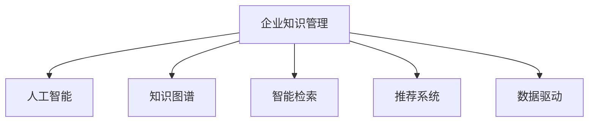

                 

# 企业知识管理的AI化转型策略

> 关键词：企业知识管理,人工智能,知识图谱,智能检索,推荐系统,数据驱动,战略转型

## 1. 背景介绍

### 1.1 问题由来

在当今信息爆炸的时代，企业面临着前所未有的知识管理挑战。传统的文件管理系统和文档存储方式，难以应对海量数据和不断更新的信息需求，缺乏系统化、智能化的知识检索和应用能力。这对企业的决策效率、创新能力和市场竞争力带来了直接冲击。

与此同时，人工智能技术的快速发展，为解决知识管理难题提供了新的路径。AI技术能够帮助企业从海量数据中提取有价值的信息，构建知识图谱，实现智能检索、智能推荐等功能，极大地提升了知识管理的效率和质量。

### 1.2 问题核心关键点

企业知识管理AI化的核心在于：
- 实现知识的高效获取和智能应用。通过AI技术，提升信息检索和知识推荐的效果，帮助员工快速找到所需信息。
- 构建系统化的知识图谱。利用AI技术对企业知识进行结构化存储和分析，构建企业知识网络，为决策提供有力支持。
- 实现数据驱动的战略决策。通过分析企业知识库中的数据，洞察业务趋势和市场需求，指导企业战略规划和业务优化。
- 提升知识共享和协同效率。通过AI技术促进知识的自动推送和共享，提高团队协作和知识复用的效率。
- 保护数据安全与隐私。在知识管理过程中，需兼顾数据安全和隐私保护，避免信息泄露和滥用。

这些核心关键点共同构成了企业知识管理AI化的核心目标和价值。

## 2. 核心概念与联系

### 2.1 核心概念概述

为更好地理解企业知识管理的AI化策略，本节将介绍几个密切相关的核心概念：

- **企业知识管理(Enterprise Knowledge Management, EKM)**：指通过组织结构和信息技术手段，规划、设计、实施、评估、维护知识管理策略和活动的过程。

- **人工智能(Artificial Intelligence, AI)**：指利用计算机技术模拟人类智能过程，实现自主决策、智能推理、自然语言理解等功能。

- **知识图谱(Knowledge Graph, KG)**：指通过图形结构化的知识表示方式，构建企业内部和外部的知识网络，便于知识检索和应用。

- **智能检索(Intelligent Retrieval)**：指通过自然语言处理和机器学习技术，实现基于查询内容的智能信息检索。

- **推荐系统(Recommender System)**：指通过算法模型，对用户行为和偏好进行分析和预测，推荐相关内容或资源。

- **数据驱动(Data-Driven)**：指以数据为决策依据，通过数据挖掘、统计分析等技术，辅助决策制定。

这些核心概念之间的逻辑关系可以通过以下Mermaid流程图来展示：



这个流程图展示了一系列核心概念及其之间的关系：

1. 企业知识管理是整个知识管理系统的基础，利用AI技术进行智能化的信息处理和应用。
2. 知识图谱是知识管理系统的核心组件，通过图形化的方式存储和关联知识。
3. 智能检索是知识管理的工具，帮助员工快速找到所需信息。
4. 推荐系统是知识管理的辅助手段，通过个性化推荐提高知识共享和应用的效率。
5. 数据驱动是知识管理的原则，确保决策的科学性和合理性。

这些概念共同构成了企业知识管理AI化的基本框架，为企业实现知识管理的智能化转型提供了有力支撑。

## 3. 核心算法原理 & 具体操作步骤
### 3.1 算法原理概述

企业知识管理的AI化，本质上是将AI技术融入企业知识管理流程，实现知识获取、存储、检索、应用的全生命周期智能化。其核心在于：

- **数据预处理**：对企业内部和外部的数据进行清洗、标注、分类等预处理，构建高质量的数据集。
- **知识图谱构建**：利用AI技术对数据集进行实体抽取、关系识别和知识融合，构建结构化的知识图谱。
- **智能检索技术**：通过自然语言处理和机器学习技术，提升信息检索的准确性和效率。
- **推荐系统设计**：基于用户行为和兴趣，构建推荐模型，实现个性化推荐。
- **数据驱动决策**：通过分析知识图谱中的数据，洞察业务趋势和市场需求，辅助决策制定。

这些步骤通过协同作用，共同推动企业知识管理的AI化转型。

### 3.2 算法步骤详解

企业知识管理的AI化转型主要包括以下几个关键步骤：

**Step 1: 数据收集与预处理**
- 收集企业内部文档、会议记录、电子邮件、社交媒体等各类信息源的数据。
- 对数据进行清洗、去重、分类、标注等预处理，构建高质量的数据集。

**Step 2: 知识图谱构建**
- 利用实体抽取、关系识别等自然语言处理技术，识别数据中的实体和关系。
- 通过知识融合算法，将识别出的实体和关系关联起来，构建知识图谱。
- 利用图神经网络等模型，对知识图谱进行嵌入表示，提高知识检索和推理效果。

**Step 3: 智能检索技术实现**
- 构建基于深度学习的检索模型，如BERT、T5等。
- 将用户查询与知识图谱中的实体和关系进行匹配，实现智能检索。
- 引入相似度计算和排名算法，提升检索结果的相关性和准确性。

**Step 4: 推荐系统设计**
- 构建基于协同过滤、内容推荐等算法的推荐系统。
- 利用用户行为数据和知识图谱中的关系，实现个性化推荐。
- 引入增量学习技术，持续更新推荐模型，提高推荐效果。

**Step 5: 数据驱动决策支持**
- 分析知识图谱中的数据，使用统计分析、机器学习等技术，洞察业务趋势和市场需求。
- 将分析结果可视化，辅助企业决策制定。
- 结合业务经验和专家知识，综合决策，避免过度依赖AI。

以上步骤构成了企业知识管理AI化的完整流程，通过技术手段实现知识的高效获取、存储、检索和应用。

### 3.3 算法优缺点

企业知识管理的AI化转型，具有以下优点：
- 提升信息检索的准确性和效率，帮助员工快速找到所需信息。
- 构建知识图谱，形成结构化的知识网络，便于知识检索和应用。
- 通过推荐系统，实现个性化知识推荐，提高知识共享和应用效率。
- 利用数据驱动的决策支持，辅助企业战略规划和业务优化。

同时，该方法也存在一定的局限性：
- 数据预处理复杂。需要大量标注和清洗工作，数据质量直接影响AI系统的效果。
- 模型复杂度较高。知识图谱构建、智能检索和推荐系统设计等环节，涉及复杂的算法和模型。
- 对技术和资源要求高。企业需要具备强大的数据处理能力和AI技术基础。
- 过度依赖AI。过度依赖AI可能导致算法偏见、数据泄露等问题，需兼顾人工干预和审查。

尽管存在这些局限性，但就目前而言，AI技术在企业知识管理中的应用，已经显现出巨大的潜力和价值。未来相关研究的重点在于如何进一步降低AI技术的应用门槛，提高系统的灵活性和可扩展性，同时兼顾数据安全和隐私保护等因素。

### 3.4 算法应用领域

企业知识管理的AI化转型，已经在多个领域得到了广泛的应用，例如：

- **制造业**：利用AI技术实现智能检索和推荐，提升生产计划和质量控制。
- **金融业**：通过分析知识图谱和推荐系统，辅助风险评估和投资决策。
- **医疗业**：构建医疗知识图谱，实现疾病诊断和治疗方案推荐。
- **零售业**：通过智能检索和推荐系统，提高商品推荐和客户服务效率。
- **教育业**：利用AI技术进行教学资源推荐和知识共享，提升教学质量和学生体验。

除了上述这些经典领域外，企业知识管理的AI化转型还在更多场景中得到应用，如市场分析、供应链管理、人力资源管理等，为企业的智能化转型提供了新的动力。

## 4. 数学模型和公式 & 详细讲解 & 举例说明

### 4.1 数学模型构建

本节将使用数学语言对企业知识管理的AI化转型过程进行更加严格的刻画。

设企业知识管理的数据集为 $D=\{x_i\}_{i=1}^N$，其中 $x_i$ 为文本、图像、视频等数据样本。设知识图谱为 $G=(V,E)$，其中 $V$ 为节点集合，$E$ 为边集合，表示实体和关系。

定义知识图谱的嵌入表示为 $h: V \rightarrow \mathbb{R}^d$，则知识图谱的表示模型为：

$$
h: G \rightarrow \mathbb{R}^{N \times d}
$$

定义智能检索模型为 $f: \mathcal{Q} \times \mathcal{D} \rightarrow \mathcal{R}$，其中 $\mathcal{Q}$ 为查询集合，$\mathcal{D}$ 为文档集合，$\mathcal{R}$ 为相关性评分集合。

定义推荐系统模型为 $r: \mathcal{U} \times \mathcal{D} \rightarrow \mathcal{R}$，其中 $\mathcal{U}$ 为用户集合，$\mathcal{D}$ 为文档集合，$\mathcal{R}$ 为推荐结果集合。

定义数据驱动决策模型为 $d: \mathcal{K} \rightarrow \mathcal{Y}$，其中 $\mathcal{K}$ 为知识图谱中的实体和关系集合，$\mathcal{Y}$ 为决策结果集合。

### 4.2 公式推导过程

以下我们以智能检索为例，推导其基本计算过程。

假设查询为 $q$，文档为 $d$，则智能检索模型的输入为 $(q, d)$。智能检索模型的输出为 $f(q, d)$，表示查询 $q$ 与文档 $d$ 的相关性评分。

假设查询 $q$ 和文档 $d$ 的词嵌入分别为 $\vec{q}$ 和 $\vec{d}$，则相关性评分 $f(q, d)$ 可以表示为：

$$
f(q, d) = \frac{\vec{q} \cdot \vec{d}}{\|\vec{q}\| \|\vec{d}\|}
$$

其中 $\cdot$ 表示向量点乘，$\|\cdot\|$ 表示向量范数。

在实际应用中，通常使用基于深度学习的检索模型，如BERT、T5等，来计算 $f(q, d)$。具体流程如下：

1. 将查询 $q$ 和文档 $d$ 分别输入模型，得到各自的词嵌入向量。
2. 计算两向量之间的余弦相似度，即 $f(q, d)$。
3. 根据余弦相似度对文档进行排序，返回相关性评分最高的文档列表。

### 4.3 案例分析与讲解

以电商平台智能推荐系统为例，讲解企业知识管理AI化的具体应用。

假设电商平台的商品数据集为 $D=\{(d_i, t_i)\}_{i=1}^M$，其中 $d_i$ 为商品描述，$t_i$ 为商品类别。电商平台的知识图谱为 $G=(V,E)$，其中 $V$ 为商品、品牌、用户等实体节点，$E$ 为实体之间的关系。

利用智能检索模型，可以根据用户的查询 $q$，检索出与查询相关的商品列表。例如，用户查询 "苹果电脑"，系统将检索出所有与苹果相关的商品信息，如iPhone、iPad等。

利用推荐系统模型，可以基于用户历史行为和商品属性，生成个性化的推荐列表。例如，某用户浏览过iPhone 13，系统会推荐iPhone 13的配件、相关配件等商品。

通过数据驱动决策模型，可以分析商品销售数据和用户行为数据，洞察市场需求和市场趋势。例如，分析某款商品的销售数据，预测其未来销量趋势，辅助企业制定营销策略。

通过这些技术的综合应用，电商平台实现了从智能检索到个性化推荐的闭环，大大提升了用户体验和交易效率。

## 5. 项目实践：代码实例和详细解释说明

### 5.1 开发环境搭建

在进行企业知识管理AI化转型实践前，我们需要准备好开发环境。以下是使用Python进行PyTorch开发的环境配置流程：

1. 安装Anaconda：从官网下载并安装Anaconda，用于创建独立的Python环境。

2. 创建并激活虚拟环境：
```bash
conda create -n pytorch-env python=3.8 
conda activate pytorch-env
```

3. 安装PyTorch：根据CUDA版本，从官网获取对应的安装命令。例如：
```bash
conda install pytorch torchvision torchaudio cudatoolkit=11.1 -c pytorch -c conda-forge
```

4. 安装TensorFlow：
```bash
conda install tensorflow
```

5. 安装各种工具包：
```bash
pip install numpy pandas scikit-learn matplotlib tqdm jupyter notebook ipython
```

完成上述步骤后，即可在`pytorch-env`环境中开始实践。

### 5.2 源代码详细实现

下面我们以知识图谱构建为例，给出使用PyTorch构建知识图谱的PyTorch代码实现。

首先，定义实体和关系的类别：

```python
from torch.utils.data import Dataset
import torch

class EntityRelationDataset(Dataset):
    def __init__(self, entities, relations):
        self.entities = entities
        self.relations = relations
        
    def __len__(self):
        return len(self.entities)
    
    def __getitem__(self, item):
        entity_id = self.entities[item]
        relation_id = self.relations[item]
        return {'entity_id': entity_id, 'relation_id': relation_id}

# 定义实体类别和关系类别
entity_class = ['商品', '品牌', '用户']
relation_class = ['销售', '评价', '关联']
```

然后，定义数据加载器：

```python
from transformers import BertTokenizer
from torch.utils.data import DataLoader

tokenizer = BertTokenizer.from_pretrained('bert-base-cased')

def load_data(entities, relations):
    dataset = EntityRelationDataset(entities, relations)
    dataloader = DataLoader(dataset, batch_size=16)
    return dataloader

# 加载数据
dataloader = load_data(entities, relations)
```

接着，定义知识图谱的嵌入表示：

```python
from transformers import BertModel

model = BertModel.from_pretrained('bert-base-cased')
```

最后，定义知识图谱的构建过程：

```python
import torch.nn as nn
import torch.optim as optim

def build_knowledge_graph(dataloader, entity_class, relation_class):
    model.train()
    for entity_id, relation_id in dataloader:
        entity_index = torch.tensor([entity_class.index(str(entity_id))])
        relation_index = torch.tensor([relation_class.index(str(relation_id))])
        entity_embeddings = model(entity_index)
        relation_embeddings = model(relation_index)
        # 将实体和关系嵌入拼接，作为知识图谱的节点表示
        node_embeddings = torch.cat([entity_embeddings, relation_embeddings], dim=1)
        # 将节点嵌入进行L2正则化
        node_embeddings = nn.functional.normalize(node_embeddings)
        return node_embeddings

# 构建知识图谱
node_embeddings = build_knowledge_graph(dataloader, entity_class, relation_class)
```

以上就是使用PyTorch构建知识图谱的完整代码实现。可以看到，得益于Transformer库的强大封装，我们可以用相对简洁的代码完成知识图谱的构建。

### 5.3 代码解读与分析

让我们再详细解读一下关键代码的实现细节：

**EntityRelationDataset类**：
- `__init__`方法：初始化实体和关系数据。
- `__len__`方法：返回数据集的样本数量。
- `__getitem__`方法：对单个样本进行处理，提取实体和关系的ID。

**load_data函数**：
- 利用DataLoader对数据集进行批处理，供模型训练和推理使用。

**BertTokenizer类**：
- 使用BertTokenizer对实体和关系的类别进行编码，生成输入序列。

**知识图谱的嵌入表示**：
- 使用BertModel加载预训练模型，将实体和关系的类别转换为模型输入，得到对应的嵌入表示。
- 将实体和关系嵌入拼接，作为知识图谱的节点表示，并进行L2正则化处理。

通过这些步骤，我们完成了知识图谱的构建。可以看到，知识图谱的构建过程，需要根据具体应用场景选择合适的实体和关系类别，并对数据进行适当的预处理。

## 6. 实际应用场景
### 6.1 智能客服系统

企业知识管理的AI化转型，可以在智能客服系统中得到广泛应用。智能客服系统通过构建知识图谱和智能检索技术，可以提升客户服务的效率和质量。

在智能客服系统中，知识图谱用于存储企业内部和外部的业务知识，如产品信息、服务流程、FAQ等。智能检索技术用于快速检索出与客户问题相关的知识，提供给客服人员，辅助其进行准确回复。同时，推荐系统可以根据客服人员的处理记录，推荐类似问题或解决方案，提高问题解决效率。

### 6.2 金融舆情监测

金融机构需要实时监测市场舆论动向，以便及时应对负面信息传播，规避金融风险。通过构建金融知识图谱和智能检索技术，可以提升金融舆情监测的效率和准确性。

在金融舆情监测系统中，知识图谱用于存储金融市场、公司财务、宏观经济等相关信息。智能检索技术用于快速检索出与舆情事件相关的信息，供分析师进行深入分析。同时，推荐系统可以根据舆情趋势，推荐相关事件或新闻，辅助分析师进行决策。

### 6.3 个性化推荐系统

当前推荐系统往往只依赖用户的历史行为数据进行物品推荐，无法深入理解用户的真实兴趣偏好。通过构建知识图谱和推荐系统，可以更好地挖掘用户的兴趣点，实现个性化的推荐。

在个性化推荐系统中，知识图谱用于存储商品、用户、评论等相关信息。智能检索技术用于检索出与用户兴趣相关的商品或内容。推荐系统可以根据用户行为和知识图谱中的关系，生成个性化的推荐列表，提高用户满意度。

### 6.4 未来应用展望

随着企业知识管理AI化转型的深入，未来将在更多领域得到应用，为企业的智能化转型提供新的动力。

在智慧医疗领域，基于知识图谱和智能检索技术的医疗问答系统，可以为医生和患者提供准确的医疗信息。在智能制造领域，基于知识图谱和智能检索技术的生产计划管理系统，可以优化生产流程和提高生产效率。在智能交通领域，基于知识图谱和智能检索技术的交通导航系统，可以提升出行效率和安全性。

此外，在企业人力资源管理、市场营销、客户服务等领域，基于企业知识管理AI化转型的应用也将不断涌现，为企业的智能化转型带来新的机遇。

## 7. 工具和资源推荐
### 7.1 学习资源推荐

为了帮助开发者系统掌握企业知识管理AI化转型的理论基础和实践技巧，这里推荐一些优质的学习资源：

1. 《企业知识管理与人工智能》系列博文：由大模型技术专家撰写，深入浅出地介绍了企业知识管理与AI的结合方式，包括知识图谱构建、智能检索、推荐系统等。

2. Coursera《人工智能与机器学习》课程：斯坦福大学开设的AI课程，涵盖人工智能的基础知识和最新进展，适合初学者和进阶者。

3. 《企业知识管理与人工智能》书籍：详细介绍企业知识管理与AI的结合方式，涵盖知识图谱构建、智能检索、推荐系统等前沿技术。

4. HuggingFace官方文档：Transformers库的官方文档，提供了海量预训练模型和完整的微调样例代码，是学习AI技术的重要资料。

5. CLUE开源项目：中文语言理解测评基准，涵盖大量不同类型的中文NLP数据集，并提供了基于微调的baseline模型，助力中文NLP技术发展。

通过对这些资源的学习实践，相信你一定能够快速掌握企业知识管理AI化的精髓，并用于解决实际的NLP问题。

### 7.2 开发工具推荐

高效的开发离不开优秀的工具支持。以下是几款用于企业知识管理AI化转型开发的常用工具：

1. PyTorch：基于Python的开源深度学习框架，灵活动态的计算图，适合快速迭代研究。大部分预训练语言模型都有PyTorch版本的实现。

2. TensorFlow：由Google主导开发的开源深度学习框架，生产部署方便，适合大规模工程应用。同样有丰富的预训练语言模型资源。

3. Transformers库：HuggingFace开发的NLP工具库，集成了众多SOTA语言模型，支持PyTorch和TensorFlow，是进行企业知识管理AI化转型的利器。

4. Weights & Biases：模型训练的实验跟踪工具，可以记录和可视化模型训练过程中的各项指标，方便对比和调优。与主流深度学习框架无缝集成。

5. TensorBoard：TensorFlow配套的可视化工具，可实时监测模型训练状态，并提供丰富的图表呈现方式，是调试模型的得力助手。

6. Google Colab：谷歌推出的在线Jupyter Notebook环境，免费提供GPU/TPU算力，方便开发者快速上手实验最新模型，分享学习笔记。

合理利用这些工具，可以显著提升企业知识管理AI化转型的开发效率，加快创新迭代的步伐。

### 7.3 相关论文推荐

企业知识管理AI化转型的发展源于学界的持续研究。以下是几篇奠基性的相关论文，推荐阅读：

1. Knowledge-Graph-Based Recommender Systems: A Survey and Open Problems: 对知识图谱推荐系统进行了全面的综述，讨论了知识图谱在推荐系统中的应用。

2. Deep Learning for Personalized Recommendation: A Survey and Outlook: 对深度学习在个性化推荐系统中的应用进行了综述，讨论了深度学习在推荐系统中的最新进展。

3. Knowledge Graph Embedding: A Survey and Meta-Analysis: 对知识图谱嵌入表示进行了综述，讨论了知识图谱嵌入表示在知识图谱构建中的应用。

4. Attention Is All You Need: 提出了Transformer结构，开启了NLP领域的预训练大模型时代。

5. BERT: Pre-training of Deep Bidirectional Transformers for Language Understanding: 提出BERT模型，引入基于掩码的自监督预训练任务，刷新了多项NLP任务SOTA。

这些论文代表了大模型知识管理AI化转型的发展脉络。通过学习这些前沿成果，可以帮助研究者把握学科前进方向，激发更多的创新灵感。

## 8. 总结：未来发展趋势与挑战

### 8.1 总结

本文对企业知识管理的AI化转型策略进行了全面系统的介绍。首先阐述了企业知识管理AI化的核心目标和价值，明确了AI技术在企业知识管理中的重要作用。其次，从原理到实践，详细讲解了AI技术在知识图谱构建、智能检索、推荐系统、数据驱动决策等方面的应用。最后，结合实际应用场景，展示了AI技术在企业知识管理中的应用前景。

通过本文的系统梳理，可以看到，企业知识管理的AI化转型已经逐步成为企业的智能化发展战略之一，极大地提升了企业的信息获取和应用能力，推动了企业智能化转型的进程。未来，伴随AI技术的不断演进和应用深化，企业知识管理的AI化转型将为企业带来更加广阔的想象空间和更高的竞争力。

### 8.2 未来发展趋势

展望未来，企业知识管理的AI化转型将呈现以下几个发展趋势：

1. 知识图谱的自动构建：利用AI技术自动构建知识图谱，无需人工干预，提高构建效率和准确性。

2. 智能检索技术的持续优化：基于深度学习、自然语言处理等技术，提升智能检索的效果和效率。

3. 推荐系统的个性化提升：结合用户行为数据和知识图谱中的关系，实现更个性化的推荐。

4. 数据驱动决策的智能化：通过分析知识图谱中的数据，结合机器学习、深度学习等技术，提升决策的智能化水平。

5. 多模态知识的融合：将图像、视频、语音等多模态信息与文本信息结合，提升知识管理的全面性和深度。

6. 知识图谱的实时更新：利用AI技术实时更新知识图谱，保持其时效性和动态性。

这些趋势凸显了AI技术在企业知识管理中的应用前景，将推动企业知识管理向更加智能化、系统化、实时化的方向发展。

### 8.3 面临的挑战

尽管企业知识管理的AI化转型已经取得了初步进展，但在实际应用过程中，仍面临诸多挑战：

1. 数据质量与数据量：企业数据质量参差不齐，数据量不足，可能影响AI系统的性能。

2. 技术复杂度：知识图谱构建、智能检索、推荐系统等技术，涉及复杂的算法和模型，开发难度大。

3. 算力成本：大规模AI模型的训练和推理需要高算力支持，可能带来高昂的算力成本。

4. 知识共享与协作：知识图谱的构建和使用需要跨部门协作，可能存在知识孤岛和协作难题。

5. 隐私与安全：企业知识管理涉及大量敏感信息，如何保障数据隐私和安全，是一个重要挑战。

6. 技术更新迭代：AI技术快速演进，如何保持系统更新，避免技术落后，是一个长期挑战。

尽管存在这些挑战，但通过不断积累经验和技术迭代，相信企业知识管理的AI化转型将逐步克服这些难题，实现更高的智能化水平。

### 8.4 研究展望

面对企业知识管理AI化转型所面临的种种挑战，未来的研究需要在以下几个方面寻求新的突破：

1. 数据预处理自动化：探索自动化数据标注和清洗技术，提升数据质量，减少人工干预。

2. 知识图谱自动化构建：研究自动构建知识图谱的方法，如知识抽取、关系推理等，提高构建效率。

3. 智能检索技术创新：探索新的智能检索方法，如基于记忆增强的检索、基于图神经网络的检索等，提升检索效果。

4. 推荐系统鲁棒性提升：研究推荐系统的鲁棒性和泛化能力，避免推荐偏差，提升推荐质量。

5. 数据驱动决策优化：研究数据驱动决策的优化方法，如强化学习、因果推理等，提升决策的科学性和准确性。

6. 多模态知识融合：探索多模态知识融合方法，提升知识管理的全面性和深度。

7. 隐私保护与安全：研究隐私保护与安全技术，如差分隐私、联邦学习等，保障企业知识管理的隐私与安全。

这些研究方向将推动企业知识管理的AI化转型向更高的层次发展，为企业的智能化转型提供新的动力。面向未来，企业知识管理的AI化转型还需要与其他人工智能技术进行更深入的融合，如知识表示、因果推理、强化学习等，多路径协同发力，共同推动企业知识管理向更加智能化、系统化、实时化的方向发展。只有勇于创新、敢于突破，才能不断拓展知识管理的边界，让智能技术更好地造福企业。

## 9. 附录：常见问题与解答

**Q1：企业知识管理AI化转型的核心是什么？**

A: 企业知识管理AI化转型的核心在于将AI技术融入企业知识管理的各个环节，实现知识的高效获取、存储、检索和应用。具体而言，包括：

1. 构建企业知识图谱：利用AI技术自动抽取和构建企业知识图谱，形成知识网络。

2. 实现智能检索：利用AI技术提升信息检索的效率和准确性，帮助员工快速找到所需信息。

3. 构建推荐系统：利用AI技术实现个性化推荐，提高知识共享和应用效率。

4. 实现数据驱动决策：利用AI技术分析企业知识库中的数据，洞察业务趋势和市场需求，辅助决策制定。

**Q2：企业知识管理AI化转型需要哪些技术支持？**

A: 企业知识管理AI化转型需要以下技术支持：

1. 自然语言处理(NLP)：用于文本数据的处理、实体抽取、关系识别等。

2. 知识图谱构建技术：用于构建企业知识图谱，形成知识网络。

3. 智能检索技术：用于提升信息检索的效率和准确性。

4. 推荐系统技术：用于实现个性化推荐，提高知识共享和应用效率。

5. 数据驱动决策技术：用于分析企业知识库中的数据，洞察业务趋势和市场需求，辅助决策制定。

6. 大数据技术：用于大规模数据的存储、处理和分析。

7. 云计算和分布式计算技术：用于支持大规模AI模型的训练和推理。

8. 安全与隐私保护技术：用于保障企业知识管理的数据安全和隐私保护。

**Q3：企业知识管理AI化转型的效果如何评估？**

A: 企业知识管理AI化转型的效果评估可以从以下几个方面进行：

1. 信息检索准确性：通过比较智能检索系统检索结果的相关性评分和人工检索结果，评估信息检索的准确性。

2. 推荐系统效果：通过比较推荐系统生成的推荐列表与人工推荐列表的推荐效果，评估推荐系统的质量。

3. 数据驱动决策支持：通过比较数据驱动决策结果与实际业务结果，评估决策支持的效果。

4. 用户体验提升：通过调查问卷和用户反馈，评估知识管理系统的易用性和用户体验提升情况。

5. 业务指标提升：通过比较企业知识管理AI化转型前后的业务指标（如销售额、客户满意度、运营效率等），评估转型效果。

**Q4：企业知识管理AI化转型过程中需要注意哪些问题？**

A: 企业知识管理AI化转型过程中，需要注意以下问题：

1. 数据质量：确保数据的质量和完整性，避免因数据问题影响AI系统效果。

2. 技术复杂度：选择合适的技术和算法，降低技术难度，避免过度复杂。

3. 算力成本：评估算力成本，避免因高算力成本导致的企业负担。

4. 知识共享与协作：促进跨部门协作，避免知识孤岛和协作难题。

5. 隐私与安全：保障企业知识管理的隐私与安全，避免数据泄露和滥用。

6. 技术更新迭代：保持技术更新，避免技术落后。

**Q5：企业知识管理AI化转型有哪些应用场景？**

A: 企业知识管理AI化转型可以在多个领域得到应用，例如：

1. 智能客服系统：通过构建知识图谱和智能检索技术，提升客户服务的效率和质量。

2. 金融舆情监测：通过构建金融知识图谱和智能检索技术，提升金融舆情监测的效率和准确性。

3. 个性化推荐系统：通过构建知识图谱和推荐系统，实现个性化推荐。

4. 生产计划管理系统：通过构建知识图谱和智能检索技术，优化生产计划和生产流程。

5. 智慧医疗系统：通过构建医疗知识图谱和智能检索技术，为医生和患者提供准确的医疗信息。

6. 智能交通系统：通过构建交通知识图谱和智能检索技术，提升出行效率和安全性。

这些应用场景展示了AI技术在企业知识管理中的广泛应用，为企业智能化转型提供了新的机遇。

---

作者：禅与计算机程序设计艺术 / Zen and the Art of Computer Programming

