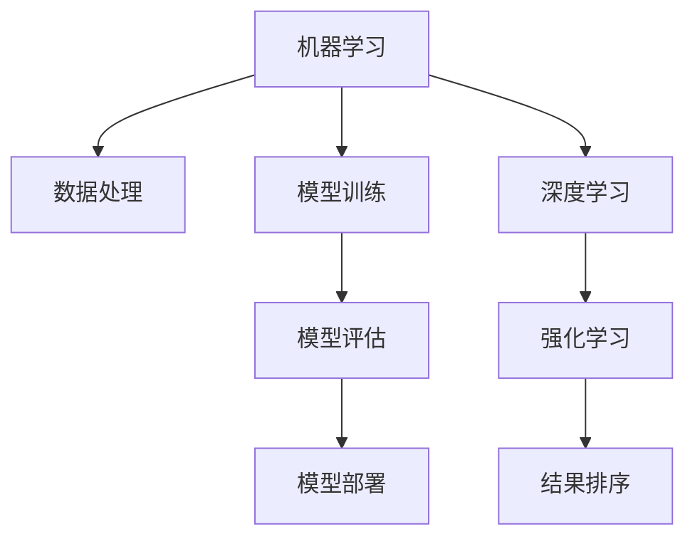

                 

# 优化结果排序：AI的智能算法

> 关键词：优化算法,结果排序,智能系统,机器学习,深度学习

## 1. 背景介绍

### 1.1 问题由来

在当今数据驱动的世界中，数据的规模和多样性不断增长，如何有效利用这些数据，成为众多领域的核心挑战。无论是在搜索引擎、推荐系统、广告投放还是金融分析中，优化结果排序都是至关重要的。在搜索引擎中，排序算法需要确保搜索结果的相关性和用户体验；在推荐系统中，算法需根据用户偏好推荐个性化产品；在广告投放中，算法需要最大化广告投放的效果；在金融分析中，算法需高效地对数据进行分类和排序。

然而，随着数据量的爆炸式增长，传统的排序算法难以应对复杂的任务需求。基于机器学习、深度学习等人工智能技术，特别是近年来发展迅速的强化学习，使得结果排序算法逐渐从简单的规则匹配演变为智能决策，从而更高效、更灵活地处理大规模数据。

### 1.2 问题核心关键点

结果排序的智能算法旨在通过机器学习、深度学习等技术，使得算法能够自动学习数据特征，并从中提取有用信息，优化结果排序。这种算法通常包括以下几个关键点：

1. 数据处理：包括数据预处理、特征工程等，将原始数据转换为模型能够处理的形式。
2. 模型训练：使用监督、半监督或无监督学习方法，训练模型从数据中学习规律和特征。
3. 模型评估：通过交叉验证、A/B测试等方法，评估模型性能，选择最优模型。
4. 模型部署：将训练好的模型部署到实际应用中，进行实时排序和优化。

## 2. 核心概念与联系

### 2.1 核心概念概述

为更好地理解结果排序的智能算法，本节将介绍几个密切相关的核心概念：

1. 机器学习(Machine Learning)：一种让计算机通过学习数据特征，自动改进性能的技术。其核心思想是利用算法从数据中学习规律，并应用到新数据上。

2. 深度学习(Deep Learning)：机器学习的一种高级形式，使用多层神经网络模型进行特征提取和决策。深度学习擅长处理复杂的高维数据。

3. 强化学习(Reinforcement Learning)：一种通过试错学习来优化决策的技术。强化学习通过与环境的交互，不断调整策略以获得最大奖励。

4. 结果排序(Result Ranking)：将数据或物品按某种度量标准进行排序的过程。在搜索、推荐、广告等领域中，排序算法需考虑用户需求、内容相关性、广告效果等多个因素。

5. 模型评估(Model Evaluation)：评估模型的预测结果，通常是使用准确率、召回率、F1分数等指标。

这些核心概念之间的逻辑关系可以通过以下Mermaid流程图来展示：



这个流程图展示了一系列核心概念及其之间的联系：

1. 数据处理：对原始数据进行清洗、特征提取，为模型训练做准备。
2. 模型训练：使用监督、半监督或无监督方法训练模型，学习数据规律。
3. 模型评估：通过各种评估指标，测试模型性能。
4. 模型部署：将训练好的模型应用到实际业务中，进行结果排序。
5. 深度学习和强化学习：分别用于提取高层次和复杂特征，优化决策过程。
6. 结果排序：将模型应用于实际业务中，按用户需求或其他标准进行排序。

这些概念共同构成了结果排序的智能算法框架，使其能够高效、灵活地处理大规模数据。

## 3. 核心算法原理 & 具体操作步骤
### 3.1 算法原理概述

结果排序的智能算法通常使用机器学习、深度学习或强化学习方法，通过数据驱动的方式，自动学习数据特征和规律，优化结果排序。

以基于机器学习的排序算法为例，其核心原理是利用已标注的数据，通过监督学习或半监督学习训练模型。模型通过学习数据的特征和规律，自动优化结果排序。常见的方法包括逻辑回归、支持向量机、随机森林等。

### 3.2 算法步骤详解

基于机器学习的排序算法通常包括以下关键步骤：

1. **数据预处理**：对原始数据进行清洗、特征提取、归一化等预处理步骤，为模型训练做准备。

2. **模型训练**：选择适当的机器学习模型，使用已标注的数据训练模型。常见的模型包括逻辑回归、支持向量机、随机森林等。

3. **模型评估**：使用交叉验证、A/B测试等方法评估模型的性能。通常使用准确率、召回率、F1分数等指标。

4. **模型调优**：根据评估结果调整模型参数，提高模型性能。

5. **模型部署**：将训练好的模型部署到实际业务中，进行结果排序。

以基于深度学习的排序算法为例，其核心原理是利用神经网络模型进行特征提取和决策。常见的方法包括卷积神经网络(CNN)、循环神经网络(RNN)、Transformer等。

1. **数据预处理**：对原始数据进行清洗、特征提取、归一化等预处理步骤。

2. **模型训练**：选择适当的深度学习模型，使用已标注的数据训练模型。常见的模型包括CNN、RNN、Transformer等。

3. **模型评估**：使用交叉验证、A/B测试等方法评估模型的性能。通常使用准确率、召回率、F1分数等指标。

4. **模型调优**：根据评估结果调整模型参数，提高模型性能。

5. **模型部署**：将训练好的模型部署到实际业务中，进行结果排序。

### 3.3 算法优缺点

结果排序的智能算法具有以下优点：

1. **高效性**：能够自动学习数据特征，快速进行排序和优化。
2. **灵活性**：适应性强，能够处理复杂的数据结构和任务需求。
3. **准确性**：通过学习数据规律，提高排序的准确性。

同时，这种算法也存在一些局限性：

1. **数据依赖性强**：需要大量标注数据进行训练，数据获取成本较高。
2. **模型复杂度**：深度学习模型通常需要较长的训练时间和较大的计算资源。
3. **可解释性差**：深度学习模型往往难以解释其内部决策过程。
4. **泛化能力有限**：对于新数据和新任务，模型性能可能较差。

尽管存在这些局限性，但基于深度学习的结果排序算法在许多实际应用中已经取得了很好的效果，成为数据驱动排序的核心技术之一。

### 3.4 算法应用领域

结果排序的智能算法广泛应用于以下领域：

1. **搜索引擎**：通过学习用户搜索行为，优化搜索结果的相关性和用户体验。

2. **推荐系统**：根据用户偏好和历史行为，推荐个性化产品或内容。

3. **广告投放**：通过学习用户点击行为，优化广告投放策略，提高广告效果。

4. **金融分析**：对大量金融数据进行分类和排序，辅助金融决策。

5. **医疗诊断**：利用医疗数据进行分类和排序，辅助医生诊断和治疗。

6. **自然语言处理(NLP)**：对文本数据进行分类和排序，如文本情感分析、摘要生成等。

7. **图像识别**：对图像数据进行分类和排序，如图像分类、目标检测等。

## 4. 数学模型和公式 & 详细讲解 & 举例说明
### 4.1 数学模型构建

本节将使用数学语言对结果排序的智能算法进行更加严格的刻画。

假设有一组数据 $D = \{(x_1, y_1), (x_2, y_2), \ldots, (x_n, y_n)\}$，其中 $x$ 表示输入特征，$y$ 表示目标标签。

结果排序的智能算法旨在学习一个映射函数 $f(x)$，将输入特征 $x$ 映射到目标标签 $y$。其核心数学模型为：

$$
f(x) = \text{argmax} \left\{ f(x; \theta) \right\}
$$

其中 $\theta$ 为模型参数，$f(x; \theta)$ 为模型对输入特征 $x$ 的预测。

### 4.2 公式推导过程

以基于逻辑回归的结果排序算法为例，推导其数学模型和优化公式。

假设模型 $f(x; \theta) = \sigma(\theta^T x)$，其中 $\sigma$ 为sigmoid函数，$\theta$ 为模型参数。

其优化目标为最大化对数似然函数：

$$
\mathcal{L}(\theta) = \frac{1}{N} \sum_{i=1}^N \log f(x_i; \theta) y_i
$$

根据梯度下降优化算法，更新模型参数的公式为：

$$
\theta \leftarrow \theta - \eta \nabla_{\theta} \mathcal{L}(\theta)
$$

其中 $\eta$ 为学习率，$\nabla_{\theta} \mathcal{L}(\theta)$ 为损失函数对模型参数的梯度。

### 4.3 案例分析与讲解

以基于深度学习的排序算法为例，使用卷积神经网络(CNN)对图像分类问题进行训练和预测。

假设有一组图像数据 $D = \{(x_1, y_1), (x_2, y_2), \ldots, (x_n, y_n)\}$，其中 $x$ 表示图像特征，$y$ 表示图像标签。

1. **数据预处理**：对原始图像数据进行预处理，包括归一化、标准化等。

2. **模型训练**：使用卷积神经网络模型对图像数据进行训练。常见的网络结构包括卷积层、池化层、全连接层等。

3. **模型评估**：使用交叉验证等方法评估模型的性能，常用的指标包括准确率、召回率、F1分数等。

4. **模型调优**：根据评估结果调整模型参数，提高模型性能。

5. **模型部署**：将训练好的模型部署到实际应用中，进行图像分类。

## 5. 项目实践：代码实例和详细解释说明
### 5.1 开发环境搭建

在进行结果排序的智能算法开发前，我们需要准备好开发环境。以下是使用Python进行TensorFlow开发的环境配置流程：

1. 安装Anaconda：从官网下载并安装Anaconda，用于创建独立的Python环境。

2. 创建并激活虚拟环境：
```bash
conda create -n tensorflow-env python=3.8 
conda activate tensorflow-env
```

3. 安装TensorFlow：根据CUDA版本，从官网获取对应的安装命令。例如：
```bash
conda install tensorflow tensorflow-gpu -c conda-forge
```

4. 安装各类工具包：
```bash
pip install numpy pandas scikit-learn matplotlib tqdm jupyter notebook ipython
```

完成上述步骤后，即可在`tensorflow-env`环境中开始开发实践。

### 5.2 源代码详细实现

下面我们以图像分类任务为例，给出使用TensorFlow进行CNN模型训练的Python代码实现。

首先，定义CNN模型：

```python
import tensorflow as tf
from tensorflow.keras import layers

model = tf.keras.Sequential([
    layers.Conv2D(32, (3, 3), activation='relu', input_shape=(28, 28, 1)),
    layers.MaxPooling2D((2, 2)),
    layers.Flatten(),
    layers.Dense(10, activation='softmax')
])
```

接着，定义数据处理函数：

```python
def load_data():
    mnist = tf.keras.datasets.mnist
    (x_train, y_train), (x_test, y_test) = mnist.load_data()
    x_train, x_test = x_train / 255.0, x_test / 255.0
    x_train = x_train.reshape(-1, 28, 28, 1)
    x_test = x_test.reshape(-1, 28, 28, 1)
    return (x_train, y_train), (x_test, y_test)
```

然后，定义训练函数：

```python
def train_model(model, data):
    (x_train, y_train), (x_test, y_test) = data
    model.compile(optimizer=tf.keras.optimizers.Adam(0.001), loss='sparse_categorical_crossentropy', metrics=['accuracy'])
    model.fit(x_train, y_train, epochs=5, validation_data=(x_test, y_test))
    model.evaluate(x_test, y_test)
```

最后，启动训练流程并在测试集上评估：

```python
(x_train, y_train), (x_test, y_test) = load_data()
train_model(model, (x_train, y_train))
```

以上就是使用TensorFlow对CNN进行图像分类任务训练的完整代码实现。可以看到，TensorFlow的高级API使得模型定义和训练过程变得非常简单。

### 5.3 代码解读与分析

让我们再详细解读一下关键代码的实现细节：

**Sequential模型**：
- 定义了一个顺序的神经网络模型，其中包含卷积层、池化层、全连接层等。

**Conv2D层**：
- 定义了一个二维卷积层，包含32个大小为3x3的卷积核，激活函数为ReLU。

**MaxPooling2D层**：
- 定义了一个最大池化层，用于降低特征图的空间大小。

**Flatten层**：
- 将卷积层输出的特征图展开为一维向量。

**Dense层**：
- 定义了一个全连接层，输出10个节点的softmax激活函数，用于分类。

**load_data函数**：
- 加载MNIST数据集，进行数据预处理，包括归一化、展平等。

**train_model函数**：
- 编译模型，定义优化器和损失函数。
- 使用训练数据训练模型，进行5个epoch的训练。
- 在验证集上评估模型性能，并在测试集上输出最终评估结果。

**训练流程**：
- 调用load_data函数加载数据集。
- 调用train_model函数进行模型训练和评估。

可以看到，TensorFlow的高级API使得模型定义和训练过程变得非常简单，开发者可以更加专注于模型的设计和调优。

当然，工业级的系统实现还需考虑更多因素，如模型的保存和部署、超参数的自动搜索、更灵活的任务适配层等。但核心的算法流程基本与此类似。

## 6. 实际应用场景
### 6.1 搜索引擎

在搜索引擎中，基于智能算法的排序算法能够根据用户输入的关键词，自动匹配最相关的搜索结果。传统的规则匹配算法已经难以满足用户的多样化需求，而智能算法通过学习用户行为数据和网页特征，可以更准确地预测用户兴趣，提升搜索体验。

以Google的PageRank算法为例，通过计算网页间的链接关系，学习网页的重要性，自动排序搜索结果，使得搜索结果更加相关。

### 6.2 推荐系统

在推荐系统中，基于智能算法的排序算法能够根据用户的历史行为数据，推荐个性化的商品或内容。传统的协同过滤算法已经无法满足用户对多样化和个性化的需求，而智能算法通过学习用户行为和商品特征，可以更准确地预测用户兴趣，提升推荐效果。

以亚马逊的推荐系统为例，通过学习用户浏览、购买行为，自动排序商品推荐列表，使得推荐内容更加符合用户需求。

### 6.3 广告投放

在广告投放中，基于智能算法的排序算法能够根据用户的点击行为，自动优化广告投放策略。传统的固定投放策略已经无法满足用户对广告的个性化需求，而智能算法通过学习用户点击行为和广告特征，可以更准确地预测用户兴趣，提升广告效果。

以谷歌的AdWords算法为例，通过学习用户点击行为，自动排序广告投放策略，使得广告投放更加精准，提升广告效果。

### 6.4 金融分析

在金融分析中，基于智能算法的排序算法能够对大量金融数据进行分类和排序，辅助金融决策。传统的统计分析方法已经无法满足复杂和动态的金融市场需求，而智能算法通过学习金融数据，可以更准确地预测市场趋势，辅助金融决策。

以高盛的金融分析算法为例，通过学习历史金融数据，自动排序市场预测，使得金融决策更加准确，提升投资收益。

## 7. 工具和资源推荐
### 7.1 学习资源推荐

为了帮助开发者系统掌握结果排序的智能算法的理论基础和实践技巧，这里推荐一些优质的学习资源：

1. 《深度学习入门》系列书籍：由深度学习领域专家撰写，深入浅出地介绍了深度学习的基本原理和应用实例。

2. 《机器学习实战》系列书籍：由机器学习领域专家撰写，详细介绍了机器学习算法的基本原理和实现方法。

3. 《Python深度学习》课程：由DeepLearning.AI开设的深度学习入门课程，涵盖深度学习的基本概念和实际应用。

4. TensorFlow官方文档：TensorFlow的官方文档，提供了丰富的API文档和样例代码，是快速上手的必备资料。

5. PyTorch官方文档：PyTorch的官方文档，提供了丰富的API文档和样例代码，是深度学习领域的流行框架。

通过对这些资源的学习实践，相信你一定能够快速掌握结果排序的智能算法的精髓，并用于解决实际的业务问题。

### 7.2 开发工具推荐

高效的开发离不开优秀的工具支持。以下是几款用于结果排序智能算法开发的常用工具：

1. TensorFlow：由Google主导开发的开源深度学习框架，生产部署方便，适合大规模工程应用。

2. PyTorch：基于Python的开源深度学习框架，灵活动态的计算图，适合快速迭代研究。

3. Keras：一个高级神经网络API，可以在TensorFlow、Theano等后端上运行，适合快速原型开发。

4. Scikit-Learn：一个Python机器学习库，提供了多种机器学习算法和工具，适合数据预处理和模型评估。

5. Weights & Biases：模型训练的实验跟踪工具，可以记录和可视化模型训练过程中的各项指标，方便对比和调优。

6. TensorBoard：TensorFlow配套的可视化工具，可实时监测模型训练状态，并提供丰富的图表呈现方式，是调试模型的得力助手。

合理利用这些工具，可以显著提升结果排序智能算法的开发效率，加快创新迭代的步伐。

### 7.3 相关论文推荐

结果排序的智能算法的发展源于学界的持续研究。以下是几篇奠基性的相关论文，推荐阅读：

1. "Adaptive Boosting"：提出了AdaBoost算法，通过逐步增强弱分类器的权重，提升分类性能。

2. "Support Vector Machines"：提出支持向量机算法，通过最大化分类边界，实现高精度分类。

3. "Deep Neural Networks for Text Recognition"：提出卷积神经网络(CNN)用于图像识别任务。

4. "Adversarial Examples for Attacks, Defense, and Countermeasures on Neural Networks"：提出对抗生成网络(GAN)，用于生成对抗样本，提升模型鲁棒性。

5. "Fine-Grained Image Classification with Multiscale Ensembles and Convolutional Neural Networks"：提出多尺度卷积神经网络，用于细粒度图像分类任务。

这些论文代表了大语言模型微调技术的发展脉络。通过学习这些前沿成果，可以帮助研究者把握学科前进方向，激发更多的创新灵感。

## 8. 总结：未来发展趋势与挑战

### 8.1 总结

本文对基于机器学习、深度学习等技术的结果排序智能算法进行了全面系统的介绍。首先阐述了结果排序算法的研究背景和意义，明确了智能算法在搜索引擎、推荐系统、广告投放等领域的重要价值。其次，从原理到实践，详细讲解了结果排序智能算法的数学模型和关键步骤，给出了训练和评估的完整代码实例。同时，本文还广泛探讨了智能算法在多个行业领域的应用前景，展示了智能算法的巨大潜力。此外，本文精选了智能算法相关的学习资源，力求为读者提供全方位的技术指引。

通过本文的系统梳理，可以看到，基于机器学习和深度学习的结果排序算法已经逐渐成为行业应用的核心技术，极大地提升了搜索引擎、推荐系统、广告投放等领域的性能和用户体验。未来，伴随算法的不断演进和优化，结果排序算法将进一步提升人工智能系统的智能水平，为各行各业带来更高效、更灵活、更个性化的智能解决方案。

### 8.2 未来发展趋势

展望未来，结果排序的智能算法将呈现以下几个发展趋势：

1. **模型规模持续增大**：随着算力成本的下降和数据规模的扩张，模型的参数量和计算能力将持续提升，能够处理更加复杂和多样的数据。

2. **算法多样性增强**：新的机器学习算法和深度学习模型将不断涌现，适用于更加广泛的场景和任务。

3. **实时性要求提高**：随着应用的实时性需求增加，结果排序算法需要更快的响应时间和更低的计算资源消耗。

4. **跨领域应用拓展**：结果排序算法将逐步拓展到更多领域，如医疗、金融、自然语言处理等，为各行各业提供智能化解决方案。

5. **数据隐私保护**：随着数据隐私和安全的重视程度提升，结果排序算法将更加注重数据隐私保护，采用差分隐私、联邦学习等技术。

6. **多模态数据融合**：结果排序算法将更加注重跨模态数据的融合，结合文本、图像、语音等多种数据，提升智能系统的全面性和准确性。

以上趋势凸显了结果排序的智能算法的广阔前景。这些方向的探索发展，必将进一步提升人工智能系统的性能和应用范围，为各行各业带来更高效、更灵活、更个性化的智能解决方案。

### 8.3 面临的挑战

尽管结果排序的智能算法已经取得了瞩目成就，但在迈向更加智能化、普适化应用的过程中，它仍面临着诸多挑战：

1. **数据获取成本高**：标注数据获取成本较高，特别是在长尾应用场景中，难以获得充足的高质量标注数据。

2. **算法复杂度高**：深度学习模型通常需要较长的训练时间和较大的计算资源，难以快速迭代和优化。

3. **模型泛化能力差**：对于新数据和新任务，模型性能可能较差，难以处理复杂的非结构化数据。

4. **可解释性差**：深度学习模型往往难以解释其内部决策过程，难以满足高风险应用对可解释性的需求。

5. **数据隐私问题**：在处理敏感数据时，数据隐私和安全问题较为突出，需要采取差分隐私、联邦学习等技术。

6. **计算资源消耗大**：在处理大规模数据时，计算资源消耗较大，需要高效的计算资源和存储方案。

正视这些挑战，积极应对并寻求突破，将使结果排序的智能算法进一步提升其性能和应用范围，为各行各业带来更高效、更灵活、更个性化的智能解决方案。

### 8.4 研究展望

面对结果排序的智能算法所面临的种种挑战，未来的研究需要在以下几个方面寻求新的突破：

1. **高效数据获取**：探索无监督和半监督学习算法，减少对标注数据的依赖，降低数据获取成本。

2. **轻量级模型设计**：开发更加轻量级、高效的模型结构，提升模型的实时性和泛化能力。

3. **多模态数据融合**：结合文本、图像、语音等多种数据，提升智能系统的全面性和准确性。

4. **数据隐私保护**：采用差分隐私、联邦学习等技术，保护数据隐私和安全。

5. **算法可解释性**：引入因果分析和博弈论工具，提高算法的可解释性和可审计性。

6. **多领域应用拓展**：将结果排序算法应用于更多领域，如医疗、金融、自然语言处理等，为各行各业提供智能化解决方案。

这些研究方向的探索，必将引领结果排序的智能算法迈向更高的台阶，为构建安全、可靠、可解释、可控的智能系统铺平道路。面向未来，结果排序的智能算法还需要与其他人工智能技术进行更深入的融合，如知识表示、因果推理、强化学习等，多路径协同发力，共同推动人工智能技术的发展。只有勇于创新、敢于突破，才能不断拓展结果排序算法的边界，让智能技术更好地造福人类社会。

## 9. 附录：常见问题与解答

**Q1：什么是结果排序？**

A: 结果排序是指将数据或物品按某种度量标准进行排序的过程。在搜索引擎、推荐系统、广告投放等领域中，排序算法需考虑用户需求、内容相关性、广告效果等多个因素，从而提供最相关、最优质的搜索结果、推荐内容和广告。

**Q2：什么是机器学习、深度学习和强化学习？**

A: 机器学习是指让计算机通过学习数据特征，自动改进性能的技术。深度学习是机器学习的一种高级形式，使用多层神经网络模型进行特征提取和决策。强化学习是一种通过试错学习来优化决策的技术，通过与环境的交互，不断调整策略以获得最大奖励。

**Q3：如何提高结果排序算法的性能？**

A: 提高结果排序算法性能的方法包括：
1. 数据预处理：对原始数据进行清洗、特征提取、归一化等预处理步骤，为模型训练做准备。
2. 模型选择：选择合适的机器学习模型，如逻辑回归、支持向量机、随机森林等。
3. 模型训练：使用已标注的数据训练模型，调整模型参数，提高模型性能。
4. 模型评估：使用交叉验证、A/B测试等方法评估模型的性能，选择最优模型。
5. 模型调优：根据评估结果调整模型参数，提高模型性能。
6. 模型部署：将训练好的模型部署到实际应用中，进行结果排序。

**Q4：深度学习和机器学习的主要区别是什么？**

A: 深度学习是机器学习的一种高级形式，使用多层神经网络模型进行特征提取和决策。深度学习能够处理更加复杂和多样的数据，但需要更多的计算资源和时间。机器学习则包括监督学习、半监督学习和无监督学习等多种方法，适用于更广泛的应用场景。

**Q5：结果排序算法在实际应用中面临哪些挑战？**

A: 结果排序算法在实际应用中面临以下挑战：
1. 数据获取成本高：标注数据获取成本较高，特别是在长尾应用场景中，难以获得充足的高质量标注数据。
2. 算法复杂度高：深度学习模型通常需要较长的训练时间和较大的计算资源，难以快速迭代和优化。
3. 模型泛化能力差：对于新数据和新任务，模型性能可能较差，难以处理复杂的非结构化数据。
4. 可解释性差：深度学习模型往往难以解释其内部决策过程，难以满足高风险应用对可解释性的需求。
5. 数据隐私问题：在处理敏感数据时，数据隐私和安全问题较为突出，需要采取差分隐私、联邦学习等技术。
6. 计算资源消耗大：在处理大规模数据时，计算资源消耗较大，需要高效的计算资源和存储方案。

正视这些挑战，积极应对并寻求突破，将使结果排序算法进一步提升其性能和应用范围，为各行各业带来更高效、更灵活、更个性化的智能解决方案。

---

作者：禅与计算机程序设计艺术 / Zen and the Art of Computer Programming

