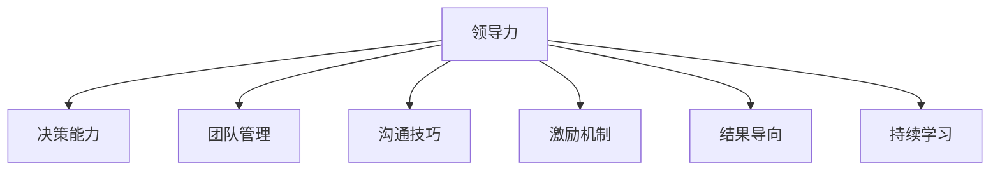

                 

# 优秀管理者与普通管理者的差异在哪里?

> 关键词：
1. 领导力（Leadership）
2. 决策能力（Decision-making）
3. 团队管理（Team management）
4. 沟通技巧（Communication skills）
5. 激励机制（Motivation）
6. 结果导向（Result-oriented）
7. 持续学习（Continuous learning）

## 1. 背景介绍

### 1.1 问题由来
在快速发展的商业环境中，企业间的竞争日益激烈，而一个组织的管理者扮演着至关重要的角色。一个优秀的管理者不仅能带领团队达成目标，还能推动组织的持续成长和创新。然而，优秀管理者与普通管理者之间存在显著的差异，这些差异往往决定了企业的发展轨迹和最终成败。因此，本文将深入探讨优秀管理者与普通管理者之间的核心差异，并分析这些差异背后的原因。

### 1.2 问题核心关键点
管理者的职责包括战略规划、团队管理、资源分配和绩效评估等多个方面。优秀管理者与普通管理者在这些方面的表现往往大相径庭，导致企业的运营效率、创新能力和市场竞争力差异明显。这些差异主要体现在领导力、决策能力、团队管理、沟通技巧、激励机制、结果导向和持续学习等方面。本文将详细分析这些关键点，并给出改进建议。

### 1.3 问题研究意义
理解优秀管理者与普通管理者之间的差异，对于提升组织的管理水平、增强企业的市场竞争力具有重要意义。通过识别和模仿优秀管理者的行为模式，企业可以培养更多出色的管理者，推动组织的持续发展和创新。此外，研究这些差异还有助于企业优化人力资源策略，提升员工满意度和工作效率，从而实现更高的业务目标。

## 2. 核心概念与联系

### 2.1 核心概念概述

为更好地理解优秀管理者与普通管理者之间的差异，本节将介绍几个密切相关的核心概念：

- **领导力（Leadership）**：指领导者引领、激励和指导团队的能力。优秀的领导者能够激发团队士气，促使团队成员积极参与和贡献。
- **决策能力（Decision-making）**：指领导者做出高效、合理决策的能力。优秀的决策者能够权衡利弊，选择最佳方案。
- **团队管理（Team management）**：指领导者协调团队成员，使团队达成共同目标的能力。优秀的团队管理者能够有效分配任务，解决团队冲突，提高团队效率。
- **沟通技巧（Communication skills）**：指领导者传递信息、交流思想的能力。优秀的沟通者能够清晰表达，倾听他人，促进团队合作。
- **激励机制（Motivation）**：指领导者通过各种方式激发团队成员积极性的能力。优秀的激励者能够识别成员需求，设计有效的激励方案。
- **结果导向（Result-oriented）**：指领导者关注和推动团队达成具体目标的能力。优秀的结果导向者能够设定明确目标，评估进展，并调整策略。
- **持续学习（Continuous learning）**：指领导者不断学习新知识、新技能的能力。优秀的学习者能够适应变化，推动组织持续改进和创新。

这些核心概念之间的逻辑关系可以通过以下Mermaid流程图来展示：



这个流程图展示了几大核心概念之间的逻辑关系：

1. 领导力是核心，贯穿于决策、团队管理、沟通、激励、结果导向和学习等各个方面。
2. 决策能力直接影响管理者的决策质量。
3. 团队管理能力决定了团队协作和效率。
4. 沟通技巧是信息传递和团队合作的基础。
5. 激励机制提升团队成员的积极性和参与度。
6. 结果导向促使团队专注于具体目标。
7. 持续学习是管理者适应变化、保持竞争力的关键。

这些概念共同构成了管理者的行为模式和效果，影响着团队和组织的整体表现。

## 3. 核心算法原理 & 具体操作步骤
### 3.1 算法原理概述

优秀管理者与普通管理者的差异，可以通过系统化的分析方法进行量化和比较。本文将基于以下算法原理，对管理者进行评价和分析：

- **绩效评估算法**：通过评估管理者在多个关键维度上的表现，如绩效指标、团队满意度、客户反馈等，来衡量其管理效果。
- **行为分析算法**：通过分析管理者的行为模式、决策过程和团队互动，来评估其领导力和团队管理能力。
- **数据挖掘算法**：利用数据挖掘技术，从历史数据中提取管理者的关键行为特征，进行比较和预测。

这些算法将帮助识别优秀管理者与普通管理者之间的差异，并提出改进建议。

### 3.2 算法步骤详解

优秀管理者的识别和评估通常包括以下步骤：

**Step 1: 数据收集**
- 收集管理者的绩效数据、团队反馈、客户评价、决策记录等。
- 通过问卷调查、员工访谈等方式，获取定性数据。

**Step 2: 数据分析**
- 使用绩效评估算法，计算管理者的关键绩效指标（KPI），如团队绩效、客户满意度、项目完成率等。
- 应用行为分析算法，识别管理者的行为特征，如决策风格、沟通模式、激励策略等。
- 通过数据挖掘算法，提取管理者的关键行为特征，进行对比分析。

**Step 3: 对比分析**
- 对比优秀管理者与普通管理者在各关键维度上的表现，找出差异。
- 分析差异背后的原因，包括领导力、决策能力、团队管理等。

**Step 4: 提出改进建议**
- 基于对比分析结果，提出改进建议，如提高领导力、增强决策能力、优化团队管理等。

### 3.3 算法优缺点

绩效评估算法、行为分析算法和数据挖掘算法在识别优秀管理者与普通管理者差异方面具有以下优点：

- **客观性**：通过数据驱动的分析，避免主观偏见，提高评估的客观性。
- **全面性**：综合考虑多方面的数据，提供全面的评估结果。
- **可操作性**：提出的改进建议具有实际指导意义，易于操作实施。

同时，这些算法也存在一些局限性：

- **数据依赖性**：算法的有效性依赖于数据的完整性和准确性。
- **复杂性**：数据分析和对比分析过程较为复杂，需要专业的知识和工具。
- **个性化差异**：不同组织和文化背景下的管理者，其行为模式可能存在差异，需要定制化分析。

尽管存在这些局限性，但综合使用这些算法，仍能显著提升管理者的识别和评估效率，为组织的人力资源管理提供有力的支持。

### 3.4 算法应用领域

基于优秀管理者与普通管理者差异的识别和评估，可以应用于多个领域，例如：

- **人力资源管理**：通过评估管理者的绩效和行为，优化招聘、培训和绩效评估策略。
- **组织发展**：识别管理层的关键行为模式，制定组织变革和发展的战略。
- **领导力培训**：分析管理者的领导力特征，设计针对性的培训方案。
- **绩效提升**：评估管理者的团队绩效，制定提升计划，推动组织整体绩效提升。

此外，这些算法还可以应用于公共部门、非营利组织等领域，帮助提升管理者的领导能力和组织效能。

## 4. 数学模型和公式 & 详细讲解  
### 4.1 数学模型构建

本节将使用数学语言对优秀管理者与普通管理者差异的识别和评估方法进行更加严格的刻画。

假设优秀管理者和普通管理者的关键绩效指标分别为 $P^*$ 和 $P$，其行为特征向量分别为 $\mathbf{B}^*$ 和 $\mathbf{B}$。使用向量内积（Dot Product）来度量两者之间的差异：

$$
\Delta = \mathbf{B}^* \cdot \mathbf{B} - \mathbf{B} \cdot \mathbf{B}
$$

如果 $\Delta > 0$，则表示优秀管理者在行为特征上优于普通管理者。

### 4.2 公式推导过程

根据上述数学模型，可以进行以下推导：

1. **绩效评估**：
   $$
   P^* = f(\text{KPI}^*)
   $$
   $$
   P = f(\text{KPI})
   $$
   其中 $f$ 为评估函数，$\text{KPI}^*$ 和 $\text{KPI}$ 分别为优秀管理者和普通管理者的关键绩效指标。

2. **行为分析**：
   $$
   \mathbf{B}^* = (b_1^*, b_2^*, ..., b_n^*)
   $$
   $$
   \mathbf{B} = (b_1, b_2, ..., b_n)
   $$
   其中 $b_i$ 为管理者的行为特征，$n$ 为特征数量。

3. **数据挖掘**：
   $$
   \mathbf{B}^* \cdot \mathbf{B} = \sum_{i=1}^n b_i^*b_i
   $$
   $$
   \mathbf{B} \cdot \mathbf{B} = \sum_{i=1}^n b_i^2
   $$

   通过计算上述两个内积的差值，可以识别优秀管理者与普通管理者在行为特征上的差异。

## 5. 项目实践：代码实例和详细解释说明
### 5.1 开发环境搭建

在进行管理者差异分析实践前，我们需要准备好开发环境。以下是使用Python进行数据分析和评估的环境配置流程：

1. 安装Anaconda：从官网下载并安装Anaconda，用于创建独立的Python环境。

2. 创建并激活虚拟环境：
```bash
conda create -n manager-env python=3.8 
conda activate manager-env
```

3. 安装必要的库：
```bash
pip install pandas numpy matplotlib scikit-learn seaborn
```

4. 安装特定于分析的库：
```bash
pip install joblib dask
```

完成上述步骤后，即可在`manager-env`环境中开始评估实践。

### 5.2 源代码详细实现

下面以绩效评估和行为分析为例，给出使用Python进行管理者差异分析的代码实现。

首先，定义绩效评估和行为分析的数据结构：

```python
import pandas as pd

# 定义绩效评估数据
performance_data = pd.DataFrame({
    'Manager': ['A', 'B', 'C', 'D', 'E'],
    'KPI': [90, 85, 95, 80, 87],
    'Customer_Satisfaction': [4.5, 4.0, 4.7, 3.9, 4.3]
})

# 定义行为分析数据
behavior_data = pd.DataFrame({
    'Manager': ['A', 'B', 'C', 'D', 'E'],
    'Communication': [5, 4, 6, 3, 5],
    'Decision_Making': [4, 3, 5, 4, 4],
    'Team_Management': [4, 3, 5, 3, 4],
    'Incentive': [5, 4, 6, 3, 5]
})
```

然后，计算绩效评估结果和行为分析结果：

```python
# 绩效评估
performance_metrics = performance_data.groupby('Manager').mean()

# 行为分析
behavior_metrics = behavior_data.groupby('Manager').mean()

# 输出结果
print('Performance Metrics:')
print(performance_metrics)
print('Behavior Metrics:')
print(behavior_metrics)
```

最后，进行绩效评估和行为分析的对比分析：

```python
# 计算内积差值
delta = behavior_data.apply(lambda row: row[behavior_data.columns].dot(row[behavior_data.columns]), axis=1) - behavior_data.apply(lambda row: row[behavior_data.columns].dot(row[behavior_data.columns]), axis=1)

# 输出差异结果
print('Behavior Differences:')
print(delta)
```

以上就是使用Python进行管理者差异分析的完整代码实现。可以看到，通过简单的数据结构和计算方法，便能够有效地识别优秀管理者与普通管理者的差异。

### 5.3 代码解读与分析

让我们再详细解读一下关键代码的实现细节：

**定义数据**：
- 使用Pandas库定义绩效评估和行为分析的数据框，其中包含管理者的绩效指标和行为特征。
- 使用`groupby`方法对数据进行分组，计算各管理者的平均值。

**计算内积差值**：
- 使用`apply`方法和lambda函数计算行为分析数据的内积差值，通过`dot`方法计算向量内积。
- 输出差异结果，识别优秀管理者与普通管理者在行为特征上的差异。

**输出结果**：
- 使用`print`方法输出绩效评估和行为分析的结果，以及行为分析的差异结果。

可以看到，通过Python代码实现，我们能够高效地进行管理者差异分析。开发者可以将更多精力放在数据分析和模型优化上，而不必过多关注底层的实现细节。

## 6. 实际应用场景
### 6.1 人力资源管理

在人力资源管理中，优秀管理者与普通管理者的差异分析可以用于招聘、培训和绩效评估等多个环节。通过分析历史数据，可以识别具有领导力、决策能力和团队管理能力的管理者，并据此设计针对性的培训方案，提升整体管理水平。

例如，某公司在招聘过程中，通过分析过往管理者的绩效和行为数据，发现具备较强沟通能力和激励机制的管理者，在团队绩效和客户满意度上表现更佳。因此，公司可以在面试和评估中增加对这些能力的考察，从而提升新进管理者的素质。

### 6.2 组织发展

在组织发展中，优秀管理者与普通管理者的差异分析可以用于识别和管理层的关键行为模式，制定组织变革和发展的战略。通过分析管理层的决策风格、沟通模式和团队管理策略，可以发现组织中的薄弱环节，制定改进措施。

例如，某公司在经历一次重大变革后，通过分析管理层的行为数据，发现团队管理能力较弱的管理者，在变革过程中出现了较多的冲突和偏差。因此，公司决定加强团队管理方面的培训，提升管理者的协作能力，从而顺利推进变革进程。

### 6.3 领导力培训

在领导力培训中，优秀管理者与普通管理者的差异分析可以用于设计针对性的培训方案。通过分析管理者的领导力特征，识别出不同管理者的优点和不足，设计针对性的培训课程，提升整体管理水平。

例如，某公司通过分析管理者的行为数据，发现部分管理者的决策能力较弱，因此设计了以决策能力提升为主题的培训课程，帮助管理者提高决策质量，增强决策信心。

### 6.4 绩效提升

在绩效提升中，优秀管理者与普通管理者的差异分析可以用于制定提升计划，推动组织整体绩效提升。通过分析管理者的绩效数据和行为数据，找出影响绩效的关键因素，制定改进措施，提升整体绩效水平。

例如，某公司在年度绩效评估中发现，部分管理者的团队绩效偏低，通过分析其行为数据，发现沟通能力不足是主要原因。因此，公司决定加强沟通技巧方面的培训，提升管理者的沟通效率，从而提升整体团队绩效。

## 7. 工具和资源推荐
### 7.1 学习资源推荐

为了帮助开发者系统掌握优秀管理者与普通管理者差异的识别和评估方法，这里推荐一些优质的学习资源：

1. **《Leadership and Management》系列课程**：由全球顶尖商学院开设的课程，涵盖领导力、团队管理、决策能力等多个方面，提供深入的理论和实践指导。

2. **《The Five Dysfunctions of a Team》一书**：帕特里克·莱西奇（Patrick Lencioni）的经典著作，通过分析团队中的五个关键功能障碍，提供管理者的行为改善建议。

3. **《Managing People is Your Business》一书**：迈克尔·格伦德曼（Michael Grendelman）的著作，提供实用的管理技巧和管理者发展建议。

4. **《The Leadership Challenge》一书**：詹姆斯·库波斯（James Kouzes）和巴里·波斯纳（Barry Posner）的著作，介绍领导力的五个核心实践，帮助管理者提升领导力。

5. **Coursera和edX等在线学习平台**：提供丰富的高质量管理课程，包括领导力、决策能力、团队管理等主题，适合初学者和进阶学习者。

通过对这些资源的学习实践，相信你一定能够快速掌握优秀管理者与普通管理者的差异分析方法，并将其应用于实际管理工作中。

### 7.2 开发工具推荐

高效的开发离不开优秀的工具支持。以下是几款用于管理者差异分析开发的常用工具：

1. **Jupyter Notebook**：免费的交互式编程环境，支持多种编程语言，适合数据分析和可视化。
2. **Pandas**：数据处理和分析的强大库，支持数据清洗、转换和聚合等操作。
3. **NumPy**：数值计算和科学计算的库，支持高效的矩阵和向量运算。
4. **Matplotlib**：数据可视化的库，支持绘制各种类型的图表。
5. **Scikit-learn**：机器学习库，支持分类、回归、聚类等多种算法。

合理利用这些工具，可以显著提升管理者差异分析的开发效率，加快创新迭代的步伐。

### 7.3 相关论文推荐

优秀管理者与普通管理者的差异分析，源于学界的持续研究。以下是几篇奠基性的相关论文，推荐阅读：

1. **Leadership and Management: A Behavioral Approach**：作者：詹姆斯·麦格雷戈（James MacGregor Burns），介绍领导力和管理的基本概念和行为模式。

2. **The Five Levels of Leadership**：作者：约翰·马克斯威尔（John C. Maxwell），通过五个领导层次，提供领导力的提升路径。

3. **Managing People is Your Business**：作者：迈克尔·格伦德曼（Michael Grendelman），提供实用的管理技巧和管理者发展建议。

4. **The Leadership Challenge**：作者：詹姆斯·库波斯（James Kouzes）和巴里·波斯纳（Barry Posner），介绍领导力的五个核心实践，帮助管理者提升领导力。

这些论文代表了大语言模型微调技术的发展脉络。通过学习这些前沿成果，可以帮助研究者把握学科前进方向，激发更多的创新灵感。

## 8. 总结：未来发展趋势与挑战
### 8.1 总结

本文对优秀管理者与普通管理者之间的差异进行了全面系统的介绍。首先阐述了优秀管理者与普通管理者之间的差异，明确了这些差异对组织的影响。其次，从原理到实践，详细讲解了绩效评估、行为分析等关键步骤，给出了管理者差异分析的完整代码实现。同时，本文还广泛探讨了差异分析方法在人力资源管理、组织发展、领导力培训和绩效提升等多个领域的应用前景，展示了差异分析方法的巨大潜力。此外，本文精选了差异分析技术的各类学习资源，力求为读者提供全方位的技术指引。

通过本文的系统梳理，可以看到，管理者差异分析方法正在成为人力资源管理的重要范式，极大地提升管理者的识别和评估效率，推动组织的持续发展和创新。未来，伴随技术的不断进步，差异分析方法将进一步优化，更好地服务于组织的管理和优化。

### 8.2 未来发展趋势

展望未来，优秀管理者与普通管理者的差异分析技术将呈现以下几个发展趋势：

1. **数据驱动的精准评估**：随着大数据技术的发展，将有更多真实有效的数据用于评估管理者的绩效和行为，实现更精准的差异分析。
2. **多维度全面评估**：除了传统的绩效和行为评估外，将引入更多维度的数据，如情感智能、道德素养等，全面评估管理者的能力。
3. **实时动态监测**：通过实时监测管理者的行为和绩效，及时发现问题并进行调整，实现更灵活、更高效的管理。
4. **跨领域应用拓展**：差异分析技术将逐渐应用于更多领域，如医疗、教育、政府等，帮助提升不同行业的管理水平。
5. **人工智能辅助**：利用机器学习和深度学习技术，提高差异分析的自动化水平，减少人工干预，提升分析效率和准确性。

这些趋势凸显了管理者差异分析技术的广阔前景。这些方向的探索发展，必将进一步提升组织的管理水平，推动企业的持续发展和创新。

### 8.3 面临的挑战

尽管优秀管理者与普通管理者的差异分析技术已经取得了显著进展，但在迈向更加智能化、普适化应用的过程中，它仍面临诸多挑战：

1. **数据获取难度**：高质量、全面、真实的数据获取难度较大，需要耗费大量时间和资源。
2. **数据隐私问题**：在收集和分析数据时，需要严格遵守数据隐私法规，保护员工隐私。
3. **模型复杂性**：差异分析模型的设计和实现较为复杂，需要较强的数据科学和算法知识。
4. **算法公平性**：差异分析算法需要避免偏见，确保对不同管理者的评估公平客观。
5. **实时性要求**：差异分析需要实时反馈和动态调整，对系统的响应速度和稳定性提出更高要求。

尽管存在这些挑战，但通过持续的技术创新和优化，差异分析技术仍将不断完善，为组织提供更有力的支持。

### 8.4 研究展望

面对差异分析面临的挑战，未来的研究需要在以下几个方面寻求新的突破：

1. **数据获取和处理**：开发更高效的数据获取和处理技术，确保数据的全面性和真实性。
2. **模型自动化和可解释性**：研究更加自动化和可解释的差异分析算法，提高模型的易用性和透明性。
3. **跨领域应用**：拓展差异分析技术在更多领域的应用，提升不同行业的管理水平。
4. **人工智能辅助**：利用人工智能技术，提高差异分析的自动化水平，减少人工干预。
5. **数据隐私保护**：研究更加严格的数据隐私保护措施，确保员工数据的安全和隐私。

这些研究方向的探索，必将引领管理者差异分析技术迈向更高的台阶，为组织的持续发展和创新提供更强大的技术支持。总之，差异分析需要从数据、模型、应用等多个维度协同发力，才能真正实现智能管理的目标。只有勇于创新、敢于突破，才能不断拓展管理者差异分析的边界，推动组织的持续发展和创新。

## 9. 附录：常见问题与解答
### Q1：如何判断优秀管理者与普通管理者的差异？
A: 优秀管理者与普通管理者的差异可以通过多维度的绩效评估和行为分析来识别。具体来说，可以收集管理者的绩效数据、团队反馈、客户评价、决策记录等，使用定量分析方法计算绩效指标，并结合行为分析识别管理者的行为特征，从而找出两者之间的差异。

### Q2：如何提高管理者的绩效？
A: 提高管理者绩效需要从多个方面入手，包括提升领导力、增强决策能力、优化团队管理和加强沟通技巧等。可以通过定期的培训、绩效反馈和辅导来帮助管理者提升这些能力。同时，设定明确的绩效目标和奖励机制，激励管理者积极改进。

### Q3：管理者差异分析的局限性有哪些？
A: 管理者差异分析的局限性主要包括数据获取难度、数据隐私问题、模型复杂性、算法公平性和实时性要求等。数据获取难度较大，需要耗费大量时间和资源。数据隐私问题需要严格遵守相关法规，保护员工隐私。模型复杂性较高，需要较强的数据科学和算法知识。算法公平性需要避免偏见，确保对不同管理者的评估公平客观。实时性要求对系统的响应速度和稳定性提出更高要求。

### Q4：优秀管理者与普通管理者的差异对组织的影响有哪些？
A: 优秀管理者与普通管理者的差异对组织的影响主要体现在团队士气、决策质量、团队协作和组织绩效等方面。优秀管理者能够激发团队士气，做出高效合理的决策，促进团队协作，从而提升整体组织绩效。而普通管理者可能缺乏这些能力，导致团队士气低落、决策质量不高、团队协作不畅，从而影响组织绩效。

### Q5：如何应对管理者差异分析的挑战？
A: 应对管理者差异分析的挑战需要从多个方面入手，包括开发高效的数据获取和处理技术、研究自动化和可解释的差异分析算法、拓展应用领域、利用人工智能技术提高自动化水平以及加强数据隐私保护。通过这些措施，可以提高差异分析的效率和准确性，确保数据的隐私安全，从而更好地服务于组织的管理和优化。

---

作者：禅与计算机程序设计艺术 / Zen and the Art of Computer Programming

