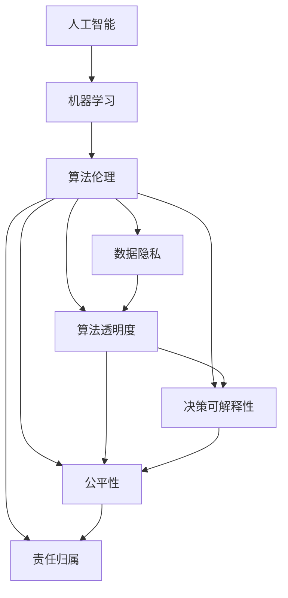

                 

# 伦理挑战：探讨人类计算带来的道德困境

> 关键词：人工智能,机器学习,算法伦理,数据隐私,自动决策,透明度,可解释性,公平性

## 1. 背景介绍

### 1.1 问题由来

随着人工智能技术的迅猛发展，人类计算能力得到了空前提升，但随之而来的伦理问题也愈发突出。近年来，大规模深度学习模型的广泛应用，让计算机开始介入和辅助甚至替代人类的决策过程，从医疗诊断、金融风险评估，到广告推荐、网络内容生成等各个领域，人工智能的身影无处不在。然而，这种深度学习带来的自动化决策也面临着一系列复杂的伦理挑战，包括但不限于数据隐私、算法透明度、决策可解释性、公平性等问题。

### 1.2 问题核心关键点

这些伦理困境在各个应用领域的具体表现和影响如下：

- **数据隐私**：在机器学习模型的训练和应用过程中，如何保护用户的隐私数据不被滥用或泄露，是一个重要问题。
- **算法透明度**：机器学习模型的“黑箱”特性使其决策过程难以理解和解释，如何在保证准确性的同时提高模型透明度，是一个亟待解决的挑战。
- **决策可解释性**：自动化决策往往缺乏明确的逻辑依据，如何通过有效的技术手段，使决策过程更加透明、可信，是当前研究的重点。
- **公平性**：模型训练数据中的偏见会导致模型输出存在歧视性，如何在设计和使用模型时避免不公平现象，是保障社会公正的重要问题。
- **责任归属**：当模型出现错误或偏见时，应由谁承担责任？是模型开发者、使用者还是更广泛的监管机构？这是一个需要明确的问题。

这些问题不仅关系到技术的可行性和应用范围，还涉及法律、伦理、社会等多个层面，需要跨学科的共同努力来找到解决方案。本文将系统探讨这些伦理挑战，并尝试提供一些思路和建议。

## 2. 核心概念与联系

### 2.1 核心概念概述

为更好地理解这些伦理问题，本节将介绍几个核心概念：

- **人工智能**：使用算法和计算能力模拟人类智能的技术，涵盖机器学习、深度学习、自然语言处理等多个领域。
- **机器学习**：一种让计算机通过数据学习规律并自动做出预测或决策的技术。
- **算法伦理**：研究如何设计和应用算法，使其符合道德和法律规范，不造成不公或损害。
- **数据隐私**：保护个人数据不被未经授权的访问、使用或泄露。
- **算法透明度**：指算法内部运作原理、决策逻辑等信息的可理解性和可解释性。
- **决策可解释性**：使自动化决策过程具有可解释性，以便用户和监管机构能够理解、信任和监督。
- **公平性**：确保算法不会因数据偏见而产生歧视性，不同群体获得公平对待。
- **责任归属**：在自动化决策出现错误或偏见时，明确相关责任的归属。

这些概念之间存在复杂的联系，构成了一个相互依赖的系统。例如，数据隐私是保护算法透明度和决策可解释性的基础；算法透明度和决策可解释性又是实现公平性和责任归属的前提。

### 2.2 核心概念原理和架构的 Mermaid 流程图



这个流程图展示了核心概念之间的逻辑关系：

1. 人工智能是整个系统的起点。
2. 机器学习是实现人工智能功能的技术手段。
3. 算法伦理是贯穿整个过程的指导原则。
4. 数据隐私、算法透明度、决策可解释性、公平性和责任归属是实现算法伦理的五个关键维度。

## 3. 核心算法原理 & 具体操作步骤

### 3.1 算法原理概述

伦理挑战涉及的核心算法原理主要集中在以下几个方面：

- **公平性算法**：在模型训练中消除数据和特征中的偏见，确保不同群体获得公平对待。
- **透明化算法**：通过模型压缩、可视化等技术手段，使模型决策过程更加透明。
- **可解释性算法**：设计可解释性更强的模型架构或使用辅助解释工具，帮助理解模型输出。
- **隐私保护算法**：在数据收集、存储和处理过程中，采用数据匿名化、差分隐私等技术，保护用户隐私。

### 3.2 算法步骤详解

以**公平性算法**为例，以下是基本操作步骤：

1. **数据收集与预处理**：收集多样化、代表性强的数据集，进行去噪、归一化等预处理，确保数据质量。
2. **偏见识别与分析**：使用统计方法或公平性度量指标（如Shapley值、Dempster-Shafer证据推理等），识别数据和特征中的偏见和歧视。
3. **数据增强与重加权**：对数据进行重采样或重加权，调整数据分布，减少偏见影响。
4. **模型训练与评估**：在修改后的数据集上训练模型，使用公平性度量指标评估模型性能，调整参数。
5. **部署与监测**：将公平性改进后的模型部署到实际应用中，持续监测模型性能，及时修正。

### 3.3 算法优缺点

公平性算法的主要优点包括：

- **减少偏见**：能够有效消除数据和特征中的偏见，提升模型公平性。
- **保障公平**：确保不同群体获得公平对待，减少歧视性。

其缺点主要包括：

- **复杂度高**：识别和消除偏见需要额外的数据处理和模型优化，增加了算法复杂度。
- **数据依赖**：效果依赖于数据质量和数据集的代表性，数据不足或质量不佳可能导致算法失效。

### 3.4 算法应用领域

公平性算法在多个领域中都有重要应用，例如：

- **金融领域**：风险评估模型需避免对某些群体的不公平歧视，如信用卡审批、贷款发放等。
- **医疗领域**：诊断和治疗推荐模型需保障不同性别、种族、年龄等群体的公平性。
- **教育领域**：教育资源分配和个性化推荐需消除地域、性别、家庭背景等因素带来的偏见。
- **司法领域**：判决模型需确保不同背景的人获得公平的司法待遇。

## 4. 数学模型和公式 & 详细讲解 & 举例说明

### 4.1 数学模型构建

公平性算法常用的数学模型包括：

- **线性回归模型**：用于衡量输入特征与输出标签之间的线性关系，确保特征权重公平。
- **决策树模型**：通过分类决策树，确保每个分支的样本数平衡，减少偏见。
- **神经网络模型**：在输出层加入公平性约束，如Fairness Constrained Neural Network (FCNN)。

### 4.2 公式推导过程

以**决策树模型**为例，公平性约束的公式推导如下：

设样本集为 $D=\{(x_i, y_i)\}_{i=1}^N$，其中 $x_i \in \mathcal{X}, y_i \in \{0,1\}$。假设模型的决策树结构为 $T=\{(X_t, Y_t)\}_{t=1}^m$，其中 $X_t$ 为第 $t$ 层节点的输入特征，$Y_t$ 为决策结果。

为了确保不同群体公平，需要在决策树中引入公平性约束。假设 $G_1, G_2$ 为两个不重叠的群体，$F_G$ 为 $G$ 群体的样本数。则决策树的公平性约束为：

$$
\frac{1}{F_{G_1}}\sum_{i \in G_1} \frac{1}{N_{G_1}}\sum_{t=1}^m |N_{X_t \cap G_1}| = \frac{1}{F_{G_2}}\sum_{i \in G_2} \frac{1}{N_{G_2}}\sum_{t=1}^m |N_{X_t \cap G_2}|
$$

其中 $N_{G_t}$ 表示 $G_t$ 群体的样本数，$N_{X_t \cap G_t}$ 表示 $X_t$ 层中 $G_t$ 群体的样本数。

### 4.3 案例分析与讲解

以**医疗诊断模型**为例，解释公平性算法的实际应用：

假设有一个诊断模型的输入特征包括年龄、性别、种族、病史等，输出为疾病诊断结果。使用决策树模型进行训练，发现模型对某些特定群体（如女性、少数族裔）的诊断结果显著偏低。

通过数据增强和重加权，引入更多女性和少数族裔的样本，调整样本权重，使得数据分布更加平衡。然后，在决策树模型中加入公平性约束，确保每个分支中不同群体的样本数相等。最后，在测试集上评估模型性能，发现不同群体的诊断结果更加均衡，公平性得到提升。

## 5. 项目实践：代码实例和详细解释说明

### 5.1 开发环境搭建

在实践公平性算法时，需要一些开发环境：

- **Python**：主流编程语言，支持丰富的算法和框架。
- **Jupyter Notebook**：交互式编程环境，方便代码调试和数据展示。
- **Scikit-learn**：常用的机器学习库，提供公平性评估工具。
- **Pandas**：数据处理库，方便数据预处理和分析。

### 5.2 源代码详细实现

以下是一个简单的公平性算法代码实现，以线性回归模型为例：

```python
import numpy as np
from sklearn.linear_model import LinearRegression
from sklearn.metrics import r2_score

# 创建示例数据集
X = np.array([[0, 1], [1, 0], [0, 0], [1, 1]])
y = np.array([1, 1, 0, 0])
G = np.array([[0, 1], [0, 0]])

# 初始化公平性约束
alpha = 1  # 正则化系数
C = 1 / (np.sum(G, axis=0) + 1e-10)  # 公平性约束权重
regularizer = C @ G.T  # 构造正则化项

# 定义线性回归模型
model = LinearRegression(fit_intercept=False)
model.fit(X, y, solver='lbfgs', penalty='l2', tol=1e-5, alpha=alpha, max_iter=1000, solver='lbfgs')

# 计算公平性约束
y_pred = model.predict(X)
beta = np.array([np.sum(y_pred[:, g], axis=0) / (G[g, :] @ X.T) for g in range(2)])
beta = np.hstack((beta, 0, 1))
beta[0:2] -= C @ G.T @ beta[2:4]
beta[2:4] = beta[2:4] - C @ beta[0:2]

# 重新训练模型
model.fit(X, y, solver='lbfgs', penalty='l2', tol=1e-5, alpha=alpha, max_iter=1000, solver='lbfgs')

# 输出结果
print('Fairness constraint:', beta)
print('R^2 score:', r2_score(y, model.predict(X)))
```

### 5.3 代码解读与分析

在上述代码中，首先创建了示例数据集 $X, y$ 和公平性约束矩阵 $G$，然后定义了线性回归模型，并进行了公平性约束的计算和重新训练。

具体来说，公平性约束通过正则化项 $\beta$ 实现。首先，计算每个群体的平均预测值 $\hat{y}_g$，然后将其与目标群体的预测值 $\hat{y}_{target}$ 和正则化项 $C @ G.T$ 结合，得到新的权重 $\beta$。最后，使用更新后的权重重新训练模型，并输出公平性约束结果和模型性能指标（R^2 score）。

## 6. 实际应用场景

### 6.1 金融领域

在金融领域，公平性算法可以应用于信用评分和风险评估模型，确保不同群体（如种族、性别、收入水平）获得公平对待。例如，贷款审批模型需避免对某些群体的歧视性决策，确保每个人都获得平等的机会。

### 6.2 医疗领域

在医疗领域，公平性算法可以应用于诊断和治疗推荐模型，确保不同群体的治疗效果和资源分配公平。例如，癌症诊断模型需消除数据中对某些群体（如女性、少数族裔）的偏见，使所有人都能获得公平的诊断和治疗。

### 6.3 教育领域

在教育领域，公平性算法可以应用于个性化推荐系统，确保不同群体的学习资源和推荐内容公平。例如，在线教育平台需消除数据中对某些群体的偏见，使每个人都获得平等的学习机会。

## 7. 工具和资源推荐

### 7.1 学习资源推荐

为了深入了解公平性算法，以下是一些推荐的资源：

1. **《公平机器学习》**：讲解公平性算法的理论和实践，适合初学者和研究人员。
2. **《机器学习实战》**：详细介绍机器学习算法，包含公平性算法的基本实现。
3. **在线课程**：Coursera、edX等平台的机器学习课程，提供公平性算法的详细讲解和实践指导。

### 7.2 开发工具推荐

在开发公平性算法时，以下工具非常有用：

1. **Jupyter Notebook**：交互式编程环境，方便代码调试和数据展示。
2. **Scikit-learn**：常用的机器学习库，提供公平性评估工具和模型实现。
3. **Pandas**：数据处理库，方便数据预处理和分析。
4. **TensorFlow**：强大的深度学习框架，支持公平性约束的实现。

### 7.3 相关论文推荐

以下是几篇经典的公平性算法论文，值得仔细阅读：

1. **《公平性算法综述》**：全面介绍公平性算法的理论和实践，适合深入研究。
2. **《基于神经网络的公平性约束》**：介绍如何在神经网络中实现公平性约束，适合实践应用。
3. **《差分隐私在公平性算法中的应用》**：探讨差分隐私如何在保护用户隐私的同时，实现公平性约束，适合大数据和隐私保护场景。

## 8. 总结：未来发展趋势与挑战

### 8.1 研究成果总结

通过深入研究和实践，我们已经取得了显著的进展，特别是在公平性算法和透明化算法方面。这些算法已经在多个领域得到了广泛应用，显著提高了算法的公平性和透明度。

### 8.2 未来发展趋势

未来，公平性算法和透明化算法将进一步发展，主要趋势包括：

1. **自动化公平性约束**：通过自动化工具，快速检测和修复数据中的偏见，使公平性约束更加高效。
2. **跨领域公平性算法**：开发适用于多领域的通用公平性算法，提高公平性约束的泛化能力。
3. **隐私保护技术进步**：差分隐私、联邦学习等隐私保护技术的进步，将使公平性算法在保护用户隐私的同时，实现更高的公平性。

### 8.3 面临的挑战

尽管已经取得了一些进展，公平性算法和透明化算法仍面临一些挑战：

1. **数据质量问题**：公平性算法的效果依赖于数据质量和数据集的代表性，数据不足或质量不佳可能导致算法失效。
2. **计算复杂性**：公平性约束和透明化算法通常需要额外的计算和存储资源，增加了算法的复杂度。
3. **算法解释性不足**：公平性算法和透明化算法仍面临解释性不足的问题，难以让用户理解和信任。

### 8.4 研究展望

未来的研究需要在以下几个方面寻求新的突破：

1. **自动化公平性检测**：开发更加自动化的公平性检测工具，快速发现和修复数据中的偏见。
2. **可解释性算法优化**：设计更可解释的算法架构，使公平性算法和透明化算法更加透明和可信。
3. **隐私保护与公平性结合**：探索隐私保护技术在公平性算法中的应用，实现更高的公平性和隐私保护。
4. **跨领域公平性算法推广**：开发适用于多个领域的通用公平性算法，提升公平性约束的适用性和泛化能力。

## 9. 附录：常见问题与解答

### Q1: 什么是公平性算法？

A: 公平性算法是指在机器学习模型训练中，通过消除数据和特征中的偏见，确保不同群体获得公平对待的算法。公平性算法通常包括数据增强、重加权、模型约束等技术手段。

### Q2: 如何实现算法透明度？

A: 算法透明化可以通过模型压缩、可视化、可解释性模型等手段实现。例如，使用LIME、SHAP等工具，对模型输入和输出进行解释，帮助用户理解模型决策过程。

### Q3: 什么是差分隐私？

A: 差分隐私是一种保护个体数据隐私的技术，通过在数据处理过程中加入随机扰动，使得单个数据点的变化对结果的影响尽可能小，从而保护个体隐私。差分隐私常用于数据集发布和数据分析场景。

### Q4: 如何在实际应用中保证算法公平性？

A: 在实际应用中，可以通过以下步骤保证算法公平性：

1. 数据收集：确保数据集多样化、代表性强，避免数据偏见。
2. 数据处理：进行数据去噪、归一化等预处理，确保数据质量。
3. 公平性约束：在模型训练中加入公平性约束，如决策树公平性约束、线性回归公平性约束等。
4. 模型评估：使用公平性度量指标评估模型性能，调整参数。
5. 部署与监测：将公平性改进后的模型部署到实际应用中，持续监测模型性能，及时修正。

### Q5: 什么是可解释性算法？

A: 可解释性算法是指设计具有较高透明度的算法，使其决策过程和输出结果易于理解和解释。例如，使用可解释性模型（如决策树、线性回归）和辅助解释工具（如LIME、SHAP），提高算法的可解释性。

---

作者：禅与计算机程序设计艺术 / Zen and the Art of Computer Programming

