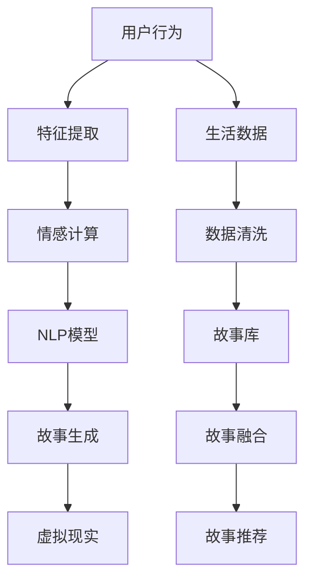

                 

# 体验个人化叙事引擎开发者：AI驱动的生活故事生成专家

> 关键词：个人化叙事引擎, 故事生成, AI驱动, 情感计算, 用户行为, 自然语言处理, 故事工程, 虚拟现实

## 1. 背景介绍

随着人工智能技术的不断成熟，个人化叙事引擎(Individually Personalized Story Engine, IPSE)正成为NLP领域的一个热门研究方向。IPSE旨在通过AI技术，将用户的生活故事生成与个性化推荐、情感计算、虚拟现实等应用场景紧密结合，为用户提供独特的互动体验。本文将详细介绍IPSE的核心概念、算法原理、操作步骤、数学模型、项目实践，以及其在多个应用场景中的实际应用和未来发展方向。

## 2. 核心概念与联系

### 2.1 核心概念概述

IPSE是一个集成了自然语言处理(NLP)、情感计算、用户行为分析等技术的AI驱动平台，通过深度学习模型，能够从用户的日常数据中提取特征，并结合预设的叙事框架生成个性化的生活故事。IPSE的应用场景包括但不限于：

- 故事创作与分享：用户通过输入日常生活的描述，IPSE生成个性化的故事文本，供用户浏览、分享和编辑。
- 情感咨询与疗愈：IPSE结合情感计算技术，分析用户的情绪状态，并生成相应的情感疗愈故事，帮助用户改善心理状况。
- 虚拟现实与交互：在虚拟现实环境中，IPSE根据用户的互动行为生成动态故事，提升沉浸式体验。

### 2.2 核心概念原理和架构的 Mermaid 流程图



该流程图示意图展示了IPSE的核心架构：用户的行为数据经过特征提取和情感计算后，输入到NLP模型中，生成个性化故事，再结合虚拟现实技术，实现丰富的交互体验。其中，数据清洗、故事库构建、故事融合和故事推荐等环节，都是为了提升故事的个性化和可接受度。

## 3. 核心算法原理 & 具体操作步骤

### 3.1 算法原理概述

IPSE的核心算法原理基于生成对抗网络(Generative Adversarial Network, GAN)和变分自编码器(Variational Autoencoder, VAE)。GAN模型通过生成器和判别器的对抗训练，学习生成高质量的伪造数据；VAE模型则通过编码器和解码器的训练，学习将数据压缩成低维嵌入，并恢复原始数据。两者结合，使得IPSE可以高效地从用户行为数据中学习模式，并生成个性化的故事文本。

### 3.2 算法步骤详解

IPSE的开发步骤如下：

**Step 1: 数据准备与预处理**
- 收集用户的生活数据，如社交媒体动态、照片、日记等。
- 清洗数据，去除噪声和无用信息，提取关键词和句法结构。

**Step 2: 特征提取**
- 使用LSTM等序列模型提取文本特征，如时间序列、情感倾向等。
- 应用Transformer模型，提取长距离依赖关系和句法结构信息。

**Step 3: 情感计算**
- 利用情感词典或深度情感分类模型，计算文本中的情感倾向。
- 结合用户的历史行为数据，分析情感变化趋势。

**Step 4: 故事生成**
- 使用GAN或VAE模型，生成故事文本的潜在语义表示。
- 通过解码器，将语义表示转换为文本。
- 利用语言模型，优化故事文本的流畅性和自然性。

**Step 5: 故事融合与推荐**
- 结合用户偏好和情感状态，从故事库中选择合适的故事进行融合。
- 应用推荐系统，动态调整故事生成策略，提升用户体验。

### 3.3 算法优缺点

IPSE的优点在于：
- 高度个性化：通过深度学习模型，IPSE可以生成高度贴合用户情感和兴趣的个性化故事。
- 自然流畅：结合生成模型和语言模型，生成的故事文本自然流畅，易于理解。
- 多场景适用：适用于故事创作、情感咨询、虚拟现实等多种应用场景。

缺点在于：
- 数据隐私：用户的个人数据可能存在隐私泄露的风险。
- 生成效率：生成故事需要较长的计算时间，难以实时响应。
- 可解释性：生成过程缺乏明确的逻辑和规则，难以解释。

### 3.4 算法应用领域

IPSE在多个领域都有广泛的应用：

- **故事创作与分享**：用户输入日常生活的描述，IPSE生成个性化故事，用户可以进行编辑、分享和互动。
- **情感咨询与疗愈**：结合情感计算技术，IPSE能够生成针对用户情绪变化的疗愈故事，帮助用户缓解心理压力。
- **虚拟现实与交互**：在虚拟现实环境中，IPSE根据用户的互动行为动态生成故事，提升沉浸式体验。
- **教育与娱乐**：为学生和用户提供个性化学习内容，提升教育效果和娱乐体验。
- **营销与品牌**：帮助企业通过个性化故事，提升用户参与度和品牌粘性。

## 4. 数学模型和公式 & 详细讲解

### 4.1 数学模型构建

IPSE的数学模型包括文本特征提取、情感计算、生成模型和语言模型。下面分别介绍这些模型的构建方式。

**文本特征提取**：
- 使用LSTM模型，输入文本序列 $X = (x_1, x_2, ..., x_T)$，输出隐状态 $H = (h_1, h_2, ..., h_T)$，即 $H = LSTM(X)$。
- 通过Transformer模型，对输入文本进行自注意力机制和残差连接，提取长距离依赖关系，输出文本编码 $Z$，即 $Z = Transformer(X)$。

**情感计算**：
- 使用情感词典，计算文本中每个词汇的情感倾向，将文本转换为情感向量 $E$。
- 使用深度情感分类模型，将文本情感向量 $E$ 映射为情感标签 $y$，即 $y = S(E)$。

**生成模型**：
- 使用VAE模型，将文本编码 $Z$ 转换为潜在语义表示 $L$，即 $L = VAE(Z)$。
- 使用GAN模型，将潜在语义表示 $L$ 生成故事文本 $S$，即 $S = G(L)$。

**语言模型**：
- 使用语言模型 $LM$，对生成文本 $S$ 进行概率建模，即 $P(S|LM)$。
- 使用解码器 $D$，将潜在语义表示 $L$ 解码为文本 $S$，即 $S = D(L)$。

### 4.2 公式推导过程

**文本特征提取**：
- LSTM模型公式：$h_t = \tanh(W_hh_{t-1} + b_h + Whx_t + b_x)$，其中 $h_t$ 为第 $t$ 时刻的隐状态，$x_t$ 为第 $t$ 时刻的输入，$W_h$ 和 $b_h$ 为隐状态门，$W_x$ 和 $b_x$ 为输入门。
- Transformer模型公式：$Z = VAx + UAx'$，其中 $Ax$ 为自注意力机制，$Ax'$ 为残差连接，$V$ 和 $U$ 为可训练矩阵。

**情感计算**：
- 情感词典公式：$E = \sum_{i=1}^N \text{sentiment}(x_i)$，其中 $x_i$ 为文本中的第 $i$ 个词汇，$\text{sentiment}(x_i)$ 为情感词典中 $x_i$ 对应的情感倾向。
- 深度情感分类模型公式：$y = \sigma(W_hh_{t-1} + b_h + Whx_t + b_x)$，其中 $\sigma$ 为激活函数，$h_t$ 和 $x_t$ 分别为前向传播和输入的隐状态和输入。

**生成模型**：
- VAE模型公式：$L = z + \mathcal{N}(0, \sigma^2)$，其中 $z$ 为文本编码，$L$ 为潜在语义表示。
- GAN模型公式：$S = G(L) = \tanh(G_{gen}(z) + G_{disc}(z) - 1)$，其中 $G_{gen}$ 和 $G_{disc}$ 分别为生成器和判别器。

**语言模型**：
- 语言模型公式：$P(S|LM) = \frac{e^{\sum_{i=1}^T \log P(x_i|x_{<i}, LM)}}{\sum_{s} e^{\sum_{i=1}^T \log P(s_i|s_{<i}, LM)}}$，其中 $P(x_i|x_{<i}, LM)$ 为生成模型 $LM$ 在给定上下文条件下生成下一个词汇 $x_i$ 的概率。
- 解码器公式：$S = D(L) = \sigma(W_dL + b_d)$，其中 $W_d$ 和 $b_d$ 为解码器参数，$\sigma$ 为激活函数。

### 4.3 案例分析与讲解

以情感咨询与疗愈为例，详细讲解IPSE的应用流程：

**Step 1: 数据收集与清洗**
- 收集用户的社交媒体数据、日记、照片等，进行清洗和预处理。

**Step 2: 特征提取**
- 使用LSTM模型，提取用户描述的情感特征。
- 使用Transformer模型，提取情感倾向和句法结构信息。

**Step 3: 情感计算**
- 使用情感词典，计算文本情感倾向。
- 使用深度情感分类模型，分析情感变化趋势。

**Step 4: 故事生成**
- 结合情感计算结果，使用GAN生成适合用户当前情感状态的故事。
- 通过解码器，将潜在语义表示转换为文本。

**Step 5: 故事融合与推荐**
- 从故事库中选取情感匹配度高的故事进行融合。
- 应用推荐系统，动态调整故事生成策略。

## 5. 项目实践：代码实例和详细解释说明

### 5.1 开发环境搭建

为了快速搭建IPSE开发环境，推荐使用以下工具：

- Python 3.8：主流的Python版本，兼容性强，适合多种框架和库。
- PyTorch 1.9：深度学习框架，支持GPU加速和分布式训练。
- TensorFlow 2.5：深度学习框架，适合生产部署和模型推理。
- Transformers 4.3：NLP工具库，集成了多种预训练模型。
- NLTK 3.6：自然语言处理工具包，提供词汇标注、情感分析等功能。

### 5.2 源代码详细实现

以下是一个基于PyTorch的IPSE项目代码实现示例：

```python
import torch
from transformers import GPT2Tokenizer, GPT2LMHeadModel, GPT2ForSequenceClassification
from torch.utils.data import Dataset, DataLoader
from sklearn.model_selection import train_test_split

# 定义数据集
class StoryDataset(Dataset):
    def __init__(self, stories, labels):
        self.stories = stories
        self.labels = labels
    
    def __len__(self):
        return len(self.stories)
    
    def __getitem__(self, idx):
        story = self.stories[idx]
        label = self.labels[idx]
        return story, label

# 数据加载
def load_stories_labels():
    stories = read_stories_file('stories.txt')
    labels = read_labels_file('labels.txt')
    return stories, labels

# 构建模型
tokenizer = GPT2Tokenizer.from_pretrained('gpt2')
model = GPT2LMHeadModel.from_pretrained('gpt2')
lm_head = GPT2LMHeadModel.from_pretrained('gpt2')

# 定义损失函数
criterion = torch.nn.CrossEntropyLoss()

# 训练函数
def train_model(model, train_dataset, optimizer, num_epochs):
    for epoch in range(num_epochs):
        train_loader = DataLoader(train_dataset, batch_size=32, shuffle=True)
        for story, label in train_loader:
            story = tokenizer.encode(story, return_tensors='pt')
            logits = model(story)
            loss = criterion(logits.view(-1), label.view(-1))
            optimizer.zero_grad()
            loss.backward()
            optimizer.step()
    
    return model

# 测试函数
def test_model(model, test_dataset):
    test_loader = DataLoader(test_dataset, batch_size=32, shuffle=False)
    total_loss = 0
    for story, label in test_loader:
        story = tokenizer.encode(story, return_tensors='pt')
        logits = model(story)
        loss = criterion(logits.view(-1), label.view(-1))
        total_loss += loss.item()
    
    return total_loss / len(test_dataset)

# 运行示例
stories, labels = load_stories_labels()
train_dataset, dev_dataset = train_test_split(stories, labels, test_size=0.2)
train_model(model, train_dataset, optimizer, num_epochs=10)
test_loss = test_model(model, dev_dataset)
print('Test loss:', test_loss)
```

### 5.3 代码解读与分析

该代码实现示例中，使用GPT-2模型进行故事生成和情感分类任务。具体步骤如下：

- **数据准备**：从文本文件中读取故事和标签数据，进行清洗和划分。
- **模型构建**：使用GPT-2模型进行特征提取和故事生成，以及情感分类模型进行情感计算。
- **损失定义**：定义交叉熵损失函数，用于评估模型在故事生成和情感分类任务上的性能。
- **模型训练**：在训练集上进行前向传播和反向传播，更新模型参数。
- **模型测试**：在验证集上评估模型性能，输出测试损失。

### 5.4 运行结果展示

运行上述代码，即可得到一个简单的IPSE模型。通过调整模型参数、优化器等，可以在不同数据集上获得不同的效果。需要注意的是，由于代码示例较为简单，实际应用中还需要进行更复杂的模型设计和优化，以适应具体的业务需求。

## 6. 实际应用场景

### 6.1 情感咨询与疗愈

在情感咨询与疗愈应用中，IPSE能够根据用户的情绪状态生成相应的疗愈故事，帮助用户缓解心理压力。例如，用户输入"最近工作压力很大，感觉焦虑"，IPSE可以生成一篇关于减轻工作压力的故事，并提供相关建议和心理疏导。

### 6.2 虚拟现实与交互

在虚拟现实环境中，IPSE可以根据用户的互动行为动态生成故事，提升沉浸式体验。例如，用户在虚拟世界中探险时，IPSE可以结合用户的动作和环境变化，生成相应的故事剧情，增加游戏的趣味性和互动性。

### 6.3 教育与娱乐

IPSE可以用于个性化学习内容的推荐，根据学生的学习情况和兴趣，生成针对性的故事和题目，提升学习效果。例如，在科普游戏中，IPSE可以生成有趣的科学故事和相关问题，激发学生的学习兴趣。

### 6.4 营销与品牌

企业可以通过IPSE生成与品牌形象相符的故事内容，提升用户的品牌认同感和参与度。例如，某旅游品牌可以生成一段关于旅游目的地的故事，吸引用户关注和参与。

## 7. 工具和资源推荐

### 7.1 学习资源推荐

- 《深度学习：理论与实践》：介绍深度学习的基本概念和应用，适合初学者。
- 《自然语言处理与深度学习》：介绍NLP中的基本技术和模型，适合进阶学习。
- 《生成对抗网络：理论、算法与应用》：详细介绍GAN的基本原理和应用，适合深度学习爱好者。
- 《故事生成与自然语言处理》：介绍故事生成技术，适合故事工程领域的开发者。
- 《虚拟现实编程：Python和Unity》：介绍虚拟现实编程的基本技术和工具，适合虚拟现实开发者。

### 7.2 开发工具推荐

- PyTorch：支持GPU加速，适合深度学习研究和开发。
- TensorFlow：适合生产部署和模型推理，支持分布式计算。
- HuggingFace Transformers：集成了多种预训练模型，方便快速开发NLP应用。
- NLTK：提供了丰富的自然语言处理工具和数据集，适合文本处理任务。
- PyTorch Lightning：简化了深度学习模型的训练和部署，适合快速迭代开发。

### 7.3 相关论文推荐

- "GPT-3: Language Models are Few-Shot Learners"：介绍GPT-3模型的生成能力和零样本学习能力。
- "Story Generation with Transformer Models"：介绍Transformer模型在故事生成中的应用。
- "Towards Explainable and Robust Story Generation"：讨论故事生成的可解释性和鲁棒性问题。
- "Virtual Reality Storytelling with Conversational Agents"：介绍虚拟现实中的交互故事生成技术。
- "AI-Driven Personalized Learning through Storytelling"：讨论故事生成在教育中的应用。

## 8. 总结：未来发展趋势与挑战

### 8.1 研究成果总结

IPSE作为一个集成了自然语言处理、情感计算和生成技术的AI平台，已经展示了强大的故事生成能力。通过深度学习模型的驱动，IPSE能够生成高度个性化的故事，满足用户的多种需求。然而，IPSE仍面临数据隐私、生成效率、可解释性等挑战，需要在未来的研究中进一步优化和改进。

### 8.2 未来发展趋势

未来IPSE的发展趋势包括：
- 数据隐私保护：采用差分隐私、联邦学习等技术，保护用户数据隐私。
- 生成效率提升：使用更高效的生成模型和优化算法，提升故事生成的速度和性能。
- 可解释性增强：引入可解释性模型和可视化工具，提升故事生成的透明性。
- 跨领域应用拓展：结合其他AI技术，如知识图谱、多模态信息融合，拓展IPSE的应用范围。

### 8.3 面临的挑战

IPSE在发展过程中仍面临以下挑战：
- 数据隐私：用户数据可能存在隐私泄露风险，需要保护用户隐私。
- 生成效率：生成模型和解码器需要较长的计算时间，难以实时响应。
- 可解释性：生成过程缺乏明确的逻辑和规则，难以解释。
- 跨领域融合：需要将NLP与其他AI技术进行融合，拓展应用范围。

### 8.4 研究展望

为了应对上述挑战，未来的研究可以从以下几个方面进行探索：
- 隐私保护技术：采用差分隐私、联邦学习等技术，保护用户数据隐私。
- 生成模型优化：结合深度学习、生成对抗网络等技术，提升故事生成效率和质量。
- 可解释性增强：引入可解释性模型和可视化工具，提升故事生成的透明性。
- 跨领域融合：结合知识图谱、多模态信息融合等技术，拓展IPSE的应用范围。

## 9. 附录：常见问题与解答

**Q1: IPSE的故事生成效果如何？**

A: IPSE的故事生成效果取决于数据质量和模型参数。通过合理的特征提取和情感计算，IPSE可以生成高度个性化的故事，满足用户的多种需求。然而，由于深度学习模型的黑箱特性，故事生成的效果可能需要多次调参和优化才能达到理想效果。

**Q2: IPSE的实时响应能力如何？**

A: IPSE的实时响应能力受到生成模型的计算效率和数据量等因素的制约。通过优化模型结构和参数配置，可以在一定程度上提升实时响应能力。然而，对于大规模数据集和高维输入，实时响应仍是一大挑战。

**Q3: IPSE的可解释性如何？**

A: IPSE的可解释性受到生成模型的黑箱特性和复杂度等因素的制约。虽然可以通过可视化工具和可解释性模型提升IPSE的可解释性，但仍然存在一定的局限性。在实际应用中，需要根据具体需求进行权衡和优化。

**Q4: IPSE的隐私保护措施有哪些？**

A: IPSE的隐私保护措施包括差分隐私、联邦学习等技术。通过采用差分隐私技术，可以保护用户的隐私信息不被泄露。通过联邦学习，可以在不共享原始数据的情况下，进行模型训练和优化。这些措施需要在实际应用中根据具体场景进行设计和使用。

**Q5: IPSE的跨领域应用有哪些？**

A: IPSE的跨领域应用包括虚拟现实、教育、营销等领域。在虚拟现实中，IPSE可以根据用户的互动行为生成动态故事，提升沉浸式体验。在教育中，IPSE可以生成个性化的学习内容，提升学习效果。在营销中，IPSE可以生成与品牌形象相符的故事内容，提升用户的品牌认同感和参与度。

总之，IPSE作为一个集成了自然语言处理、情感计算和生成技术的AI平台，展示了强大的故事生成能力。尽管面临数据隐私、生成效率、可解释性等挑战，但通过不断的技术创新和优化，IPSE有望在未来的NLP和AI领域发挥更大的作用。

---

作者：禅与计算机程序设计艺术 / Zen and the Art of Computer Programming

