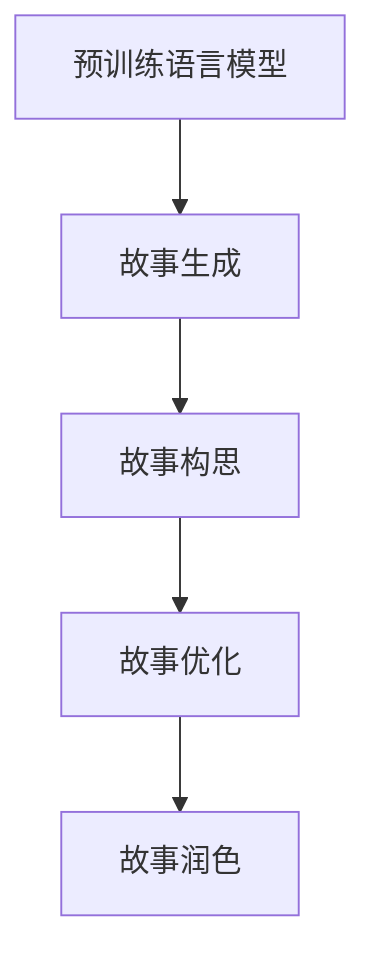

                 

## 1. 背景介绍

### 1.1 问题由来

故事创作一直是一个古老而复杂的问题，涉及文学、心理学、认知科学等多个领域。传统的故事创作过程依赖于作者的灵感、经验和积累，存在较高的入门门槛和创作难度。然而，随着人工智能技术的进步，特别是自然语言处理(NLP)和生成对抗网络(GAN)等技术的成熟，AI驱动的故事创作成为了可能。

近年来，深度学习和大规模语言模型在大规模文本生成、对话生成等领域取得了令人瞩目的成就。例如，GPT-3模型在各种文本生成任务上表现出色，甚至能够生成几乎与人类难辨真伪的原创文本。这为AI驱动的故事创作提供了新的可能性。

### 1.2 问题核心关键点

AI驱动的故事创作过程，可以大致分为三个关键步骤：

1. **预训练模型选择**：选择合适的预训练语言模型，作为故事创作的起点。
2. **故事构思**：通过提示词、任务设计等方式，引导模型生成故事情节和角色。
3. **故事优化**：利用AI技术对生成的故事进行优化和润色，提升故事的质量和创意性。

本文将详细探讨基于AI驱动的故事创作坊的原理、操作步骤、应用场景及面临的挑战。希望通过深入解析，读者能够理解并掌握这一新兴技术，以AI驱动的方式进行故事创作。

## 2. 核心概念与联系

### 2.1 核心概念概述

在AI驱动的故事创作坊中，涉及到以下几个核心概念：

- **预训练语言模型(Pre-trained Language Models)**：如GPT-3、BERT等，通过在大规模无标签文本上预训练，学习到语言的通用表示。
- **故事生成**：通过模型在特定任务上的微调或定制，生成具有特定风格和创意的文本。
- **提示词(Prompt)**：引导模型进行特定类型文本生成的文本输入。
- **故事构思**：通过设计合理的提示词，引导模型生成故事情节、角色等，并进行优化。
- **故事优化**：利用AI技术对生成的故事进行优化和润色，提升故事质量。

这些概念之间的逻辑关系可以通过以下Mermaid流程图来展示：



这个流程图展示了从预训练模型到故事生成的全过程，以及各个步骤之间的关系。

## 3. 核心算法原理 & 具体操作步骤

### 3.1 算法原理概述

AI驱动的故事创作坊基于以下两个核心算法原理：

1. **预训练模型微调**：选择合适的预训练语言模型，通过微调使其具备特定的故事生成能力。微调过程可以通过特定任务的提示词和损失函数进行优化。

2. **故事生成与优化**：通过设计合理的提示词，引导模型生成故事情节和角色。利用AI技术对生成的故事进行优化和润色，提升故事的质量和创意性。

### 3.2 算法步骤详解

基于上述原理，AI驱动的故事创作坊一般包括以下几个关键步骤：

**Step 1: 预训练模型选择**
- 选择合适的预训练语言模型，如GPT-3、BERT等，作为故事创作的起点。
- 根据任务类型和风格需求，选择不同的预训练模型。

**Step 2: 故事构思**
- 设计合理的提示词，引导模型生成故事情节和角色。提示词应包含故事的类型、风格、情节等信息。
- 利用提示词，通过微调模型生成初步的故事草稿。

**Step 3: 故事优化**
- 对初步生成的故事草稿进行优化，提升故事的情节连贯性、逻辑性、角色刻画等方面。
- 利用AI技术，如自然语言处理、语义分析等，对故事进行润色和修正。

**Step 4: 故事润色**
- 对优化后的故事进行最后的润色，提升故事的文学性和感染力。
- 结合多种AI技术，如风格迁移、文本修正等，使故事更加符合目标风格。

### 3.3 算法优缺点

AI驱动的故事创作坊具有以下优点：

1. **效率高**：利用预训练模型和微调技术，可以显著提升故事创作的效率，特别是在创意和情节设计方面。
2. **创意丰富**：通过设计合理的提示词，可以生成多种创意和风格的故事，满足不同读者的需求。
3. **技术门槛低**：不需要专业的写作技能，只要熟悉AI技术的基本操作，即可进行故事创作。
4. **个性化**：根据用户偏好和需求，设计个性化的故事创作流程，提升用户体验。

同时，该方法也存在一定的局限性：

1. **质量不稳定**：生成的故事质量可能受提示词和微调模型的影响，存在质量不稳定的问题。
2. **缺乏情感**：模型生成的故事可能缺乏真实情感和深度，难以产生共鸣。
3. **伦理问题**：生成的故事可能涉及敏感内容或偏见，需要注意伦理和道德问题。
4. **可解释性不足**：AI驱动的故事创作过程较难解释，难以追溯创作过程中的决策逻辑。

尽管存在这些局限性，但AI驱动的故事创作坊为故事创作提供了新的思路和方法，值得进一步探索和应用。

### 3.4 算法应用领域

AI驱动的故事创作坊可以应用于多个领域，例如：

- **文学创作**：生成小说、诗歌、散文等不同类型的文学作品。
- **游戏开发**：设计游戏剧情、角色对话等。
- **教育培训**：为学生提供创意写作的灵感和素材。
- **广告营销**：生成吸引人的广告文案和宣传语。
- **影视制作**：提供编剧脚本和角色对话。

## 4. 数学模型和公式 & 详细讲解 & 举例说明

### 4.1 数学模型构建

在AI驱动的故事创作坊中，通常使用预训练语言模型进行故事生成和优化。这里以GPT-3为例，构建其故事生成和优化的数学模型。

### 4.2 公式推导过程

假设预训练模型为 $M_{\theta}$，输入为 $x$，输出为 $y$，则其概率分布为：

$$
P(y|x) = \frac{\exp(M_{\theta}(x))}{\sum_{y'} \exp(M_{\theta}(x'))}
$$

其中 $M_{\theta}(x)$ 表示模型在输入 $x$ 上的输出，通常是一个向量，表示每个词汇的概率分布。

在故事生成过程中，我们希望模型生成的输出 $y$ 尽可能接近我们期望的文本 $t$，因此可以通过交叉熵损失函数进行优化：

$$
L = -\frac{1}{N} \sum_{i=1}^N \log P(t_i|x_i)
$$

其中 $t_i$ 表示第 $i$ 个输出文本，$x_i$ 表示相应的输入提示词。

### 4.3 案例分析与讲解

以下是一个简单的案例分析，展示如何使用GPT-3进行故事生成和优化。

**案例：** 生成一个关于未来世界的科幻故事。

**步骤：**
1. **预训练模型选择**：选择GPT-3模型。
2. **故事构思**：设计提示词，如“未来世界，科技发达，人类面临新的挑战”。
3. **故事生成**：利用提示词，通过微调模型生成初步的故事草稿。
4. **故事优化**：利用自然语言处理技术，如情感分析、语义分析等，对故事进行优化。
5. **故事润色**：结合多种AI技术，如风格迁移、文本修正等，使故事更加符合目标风格。

最终生成的故事可能包含丰富的情节和创意，但由于模型的不确定性，仍需人工进行最后的润色和修正。

## 5. 项目实践：代码实例和详细解释说明

### 5.1 开发环境搭建

在进行AI驱动的故事创作坊实践前，我们需要准备好开发环境。以下是使用Python进行OpenAI API开发的环境配置流程：

1. 安装OpenAI Python SDK：从OpenAI官网获取OpenAI Python SDK，并按照说明进行安装。
2. 申请API密钥：在OpenAI官网申请API密钥，将其存储在配置文件中。
3. 创建虚拟环境：使用Python的虚拟环境管理工具，创建独立的开发环境，以避免与其他项目的依赖冲突。

### 5.2 源代码详细实现

这里我们以GPT-3模型为例，展示如何使用OpenAI API进行故事生成和优化。

```python
from openai import OpenAI, Model, APIError

# 设置OpenAI API密钥
openai.api_key = 'your_api_key'

# 创建OpenAI模型实例
model = Model('text-generation')

# 定义提示词
prompt = "未来世界，科技发达，人类面临新的挑战"

# 设置微调参数
temperature = 0.5  # 生成多样性
max_tokens = 100  # 生成的文本长度
top_p = 1.0  # 生成多样性

# 生成故事草稿
response = openai.Completion.create(
    engine='davinci-codex',  # 选择GPT-3模型
    prompt=prompt,
    max_tokens=max_tokens,
    temperature=temperature,
    top_p=top_p
)

# 输出生成的故事
print(response.choices[0].text.strip())
```

### 5.3 代码解读与分析

让我们再详细解读一下关键代码的实现细节：

**OpenAI API使用**：
- `openai.api_key = 'your_api_key'`：设置OpenAI API密钥。
- `model = Model('text-generation')`：创建OpenAI模型实例，选择GPT-3模型进行文本生成。
- `response = openai.Completion.create(...)`：使用OpenAI API进行文本生成，设置提示词、生成的文本长度、多样性等参数。

**提示词设计**：
- 提示词应包含故事的类型、风格、情节等信息，如“未来世界，科技发达，人类面临新的挑战”。

**故事生成**：
- 利用OpenAI API进行文本生成，设置多样性、生成的文本长度等参数，生成初步的故事草稿。

**故事优化**：
- 对初步生成的故事草稿进行优化，提升故事的情节连贯性、逻辑性、角色刻画等方面。
- 利用自然语言处理技术，如情感分析、语义分析等，对故事进行润色和修正。

### 5.4 运行结果展示

运行上述代码，可以得到一个初步生成的故事草稿。通过人工修改和优化，可以进一步提升故事的质量和创意性。

## 6. 实际应用场景

### 6.1 文学创作

AI驱动的故事创作坊可以应用于文学创作，生成小说、诗歌、散文等不同类型的文学作品。例如，利用GPT-3生成科幻小说，可以提供创意灵感和素材，缩短创作时间，提升创作质量。

### 6.2 游戏开发

在游戏开发中，AI驱动的故事创作坊可以设计游戏剧情、角色对话等。例如，利用GPT-3生成游戏剧本和角色对话，可以提升游戏的可玩性和故事深度。

### 6.3 教育培训

在教育培训中，AI驱动的故事创作坊可以为学生提供创意写作的灵感和素材。例如，利用GPT-3生成创意写作题目和故事，激发学生的写作兴趣和创造力。

### 6.4 广告营销

在广告营销中，AI驱动的故事创作坊可以生成吸引人的广告文案和宣传语。例如，利用GPT-3生成创意广告文案，提升广告的吸引力和转化率。

### 6.5 影视制作

在影视制作中，AI驱动的故事创作坊可以提供编剧脚本和角色对话。例如，利用GPT-3生成电影剧本和角色对话，提升影视作品的质量和吸引力。

## 7. 工具和资源推荐

### 7.1 学习资源推荐

为了帮助开发者系统掌握AI驱动的故事创作坊的技术基础和实践技巧，这里推荐一些优质的学习资源：

1. **OpenAI官网**：提供完整的API文档和开发指南，是学习OpenAI API的重要资源。
2. **自然语言处理入门教程**：学习自然语言处理的基本概念和常用技术，为故事生成和优化奠定基础。
3. **Python深度学习框架**：学习深度学习的基本概念和常用技术，了解预训练模型和微调的基本原理。
4. **OpenAI GitHub仓库**：访问OpenAI的GitHub仓库，学习最新的故事生成和优化方法。

### 7.2 开发工具推荐

高效的开发离不开优秀的工具支持。以下是几款用于AI驱动的故事创作坊开发的常用工具：

1. **Jupyter Notebook**：Jupyter Notebook是一个交互式的开发环境，适合进行数据处理和模型测试。
2. **PyCharm**：PyCharm是一个强大的Python IDE，提供代码编辑、调试、测试等功能。
3. **Google Colab**：Google Colab是一个在线Jupyter Notebook环境，免费提供GPU/TPU算力，方便开发者快速上手实验最新模型。
4. **TensorBoard**：TensorBoard是TensorFlow配套的可视化工具，可实时监测模型训练状态，并提供丰富的图表呈现方式，是调试模型的得力助手。

### 7.3 相关论文推荐

AI驱动的故事创作坊的研究源于学界的持续研究。以下是几篇奠基性的相关论文，推荐阅读：

1. **Attention is All You Need**：提出了Transformer结构，开启了NLP领域的预训练大模型时代。
2. **Neural Story Generation with Retrieval-Augmented Pre-training**：提出了一种基于检索增强的预训练方法，提升了故事生成模型的质量。
3. **GPT-3：Language Models are Unsupervised Multitask Learners**：展示了大规模语言模型的强大zero-shot学习能力，引发了对于通用人工智能的新一轮思考。
4. **Story-Driven Pre-training for Text Generation**：提出了一种基于故事驱动的预训练方法，提高了故事生成模型的鲁棒性和多样性。
5. **Neural Story Generation with Attentive Reader**：提出了一种基于注意力机制的故事生成方法，提升了故事的连贯性和逻辑性。

这些论文代表了大语言模型在故事生成和优化领域的研究进展。通过学习这些前沿成果，可以帮助研究者把握学科前进方向，激发更多的创新灵感。

## 8. 总结：未来发展趋势与挑战

### 8.1 总结

本文对AI驱动的故事创作坊进行了全面系统的介绍。首先阐述了AI驱动的故事创作坊的研究背景和意义，明确了其在文学创作、游戏开发、教育培训等多个领域的应用价值。其次，从原理到实践，详细讲解了故事生成的数学模型和操作步骤，给出了故事生成的完整代码实例。同时，本文还广泛探讨了故事生成方法在实际应用场景中的应用前景，展示了AI驱动的故事创作坊的广泛应用潜力。最后，本文精选了故事生成技术的各类学习资源，力求为读者提供全方位的技术指引。

通过本文的系统梳理，可以看到，AI驱动的故事创作坊正在成为NLP领域的重要应用范式，极大地拓展了预训练语言模型的应用边界，为创意写作和故事创作提供了新的工具和方法。未来，伴随预训练语言模型和微调方法的持续演进，相信AI驱动的故事创作坊将为文学创作、游戏开发、教育培训等多个领域带来新的突破，推动NLP技术的产业化进程。

### 8.2 未来发展趋势

展望未来，AI驱动的故事创作坊将呈现以下几个发展趋势：

1. **技术融合**：未来AI驱动的故事创作坊将与其他AI技术进行更深入的融合，如知识表示、因果推理、强化学习等，提升故事生成的质量和多样性。
2. **智能生成**：利用AI技术，如情感分析、语义分析等，进一步提升故事生成的智能水平，使其更加符合人类情感和逻辑。
3. **个性化创作**：根据用户的偏好和需求，生成个性化的故事，提升用户体验。
4. **多模态生成**：结合视觉、听觉等多种模态，提升故事生成的视觉和听觉效果。
5. **伦理与安全性**：在故事生成过程中，引入伦理和安全性约束，确保生成的故事符合道德和法律标准。

以上趋势凸显了AI驱动的故事创作坊的广阔前景。这些方向的探索发展，必将进一步提升故事生成的智能性和多样性，为文学创作、游戏开发、教育培训等多个领域带来新的突破。

### 8.3 面临的挑战

尽管AI驱动的故事创作坊已经取得了显著进展，但在迈向更加智能化、普适化应用的过程中，它仍面临着诸多挑战：

1. **质量不稳定**：生成的故事质量可能受提示词和微调模型的影响，存在质量不稳定的问题。
2. **缺乏情感**：模型生成的故事可能缺乏真实情感和深度，难以产生共鸣。
3. **伦理问题**：生成的故事可能涉及敏感内容或偏见，需要注意伦理和道德问题。
4. **可解释性不足**：AI驱动的故事创作过程较难解释，难以追溯创作过程中的决策逻辑。
5. **资源消耗**：模型生成和优化过程可能消耗大量计算资源，需要优化算法和硬件配置。

尽管存在这些挑战，但通过学界和产业界的共同努力，相信AI驱动的故事创作坊能够逐步克服这些难题，为文学创作、游戏开发、教育培训等多个领域带来新的突破。

### 8.4 研究展望

面对AI驱动的故事创作坊所面临的挑战，未来的研究需要在以下几个方面寻求新的突破：

1. **质量提升**：进一步提升故事生成的质量，使其更加符合人类情感和逻辑。
2. **情感注入**：结合情感分析技术，提升故事生成的情感深度和共鸣感。
3. **伦理约束**：在故事生成过程中，引入伦理和安全性约束，确保生成的故事符合道德和法律标准。
4. **可解释性增强**：增强故事生成过程的可解释性，提高用户对生成结果的信任度。
5. **资源优化**：优化算法和硬件配置，提高故事生成的效率和质量。

这些研究方向的探索，必将引领AI驱动的故事创作坊技术迈向更高的台阶，为文学创作、游戏开发、教育培训等多个领域带来新的突破。只有勇于创新、敢于突破，才能不断拓展故事生成的边界，让智能技术更好地服务于人类社会。

## 9. 附录：常见问题与解答

**Q1：AI驱动的故事创作坊是否适用于所有类型的创作？**

A: AI驱动的故事创作坊适用于文学创作、游戏开发、教育培训等多个领域，但不同的创作类型可能需要不同的提示词和优化策略。例如，科幻小说和诗歌在提示词的设计上可能存在差异。

**Q2：生成故事的过程是否需要人工干预？**

A: 生成故事的过程可以完全自动进行，但为了提升故事的质量和创意性，人工干预仍然是必要的。人工修改和优化生成结果，可以确保故事符合用户的期望和需求。

**Q3：如何避免故事中的偏见和敏感内容？**

A: 在提示词设计和模型训练过程中，应避免引入偏见和敏感内容。同时，利用AI技术进行情感分析、语义分析等，识别和过滤敏感内容，确保故事生成的安全和合规。

**Q4：故事生成的多样性如何控制？**

A: 故事生成的多样性可以通过调整生成模型的多样性参数进行控制。通常，较高的温度参数（temperature）会生成更多样化的故事，而较低的温度参数则会生成更加一致和连贯的故事。

**Q5：故事生成的质量如何评价？**

A: 故事生成的质量可以通过多种指标进行评价，如情节连贯性、角色刻画、语言风格等。可以利用自然语言处理技术，如情感分析、语义分析等，进行自动评价和优化。

总之，AI驱动的故事创作坊为故事创作提供了新的思路和方法，值得进一步探索和应用。通过不断地优化和改进，相信AI驱动的故事创作坊能够更好地服务于文学创作、游戏开发、教育培训等多个领域，推动NLP技术的产业化进程。

---

作者：禅与计算机程序设计艺术 / Zen and the Art of Computer Programming

