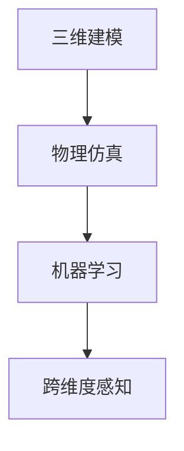

                 

# 体验时空穿越机工程师：AI创造的跨维度感知设计师

## 1. 背景介绍

### 1.1 问题由来

随着人工智能技术的飞速发展，AI模型在各个领域展现出了强大的应用潜力。时空穿越机工程师作为一种跨领域的创新角色，借助AI技术，赋予了设计以跨维度的感知能力，重新定义了人类感知世界的视角。

这种工程师的核心任务是将人工智能应用于三维模型设计，结合时间维度上的变化，实现动态仿真和预测。其核心技术包括了物理模拟、机器学习、仿真算法等多个领域的融合，是一种具有高度创新性的应用。

### 1.2 问题核心关键点

时空穿越机工程师将深度学习、物理仿真和虚拟现实技术进行有机结合，通过一系列先进的算法和技术手段，使设计师能够在虚拟空间中实现跨时间维度的设计、分析和优化，从而实现对物理世界的精确模拟和预测。

该领域的核心技术关键点包括：
1. **三维建模**：将现实世界的物理对象进行数字化建模，创建虚拟的3D模型。
2. **物理仿真**：通过人工智能算法模拟物理系统，包括时间、空间和力学的变化。
3. **机器学习**：利用机器学习算法对物理仿真数据进行学习和预测。
4. **跨维度感知**：结合时间维度的变化，实现对动态物理系统的预测和仿真。

### 1.3 问题研究意义

时空穿越机工程师的研究与应用，对于提升设计效率、减少设计成本、提高产品质量具有重要意义。此外，其在虚拟仿真、自动驾驶、模拟训练等多个领域的应用，将极大地推动相关技术的进步和应用普及。

## 2. 核心概念与联系

### 2.1 核心概念概述

为了深入理解时空穿越机工程师的核心理论和技术，我们首先需要了解几个关键概念：

- **三维建模**：将现实世界的物理对象进行数字化建模，创建虚拟的3D模型。该过程通常包括几何建模、纹理映射、材质处理等多个步骤。
- **物理仿真**：通过人工智能算法模拟物理系统，包括时间、空间和力学的变化。常用的算法有蒙特卡罗方法、有限元方法、多体系统等。
- **机器学习**：利用机器学习算法对物理仿真数据进行学习和预测，实现对复杂系统的自动化处理和优化。
- **跨维度感知**：结合时间维度的变化，实现对动态物理系统的预测和仿真。主要涉及时空数据的融合、动态建模和仿真预测等。

这些概念之间的联系可以通过以下Mermaid流程图来展示：



这个流程图展示了三维建模、物理仿真和机器学习与跨维度感知之间的联系：

1. **三维建模**为**物理仿真**提供基础数据，构建虚拟的3D模型。
2. **物理仿真**通过**机器学习**算法，学习和预测物理系统的变化，提供动态仿真数据。
3. **跨维度感知**结合**时间维度**的变化，实现对动态物理系统的预测和仿真。

这些概念共同构成了时空穿越机工程师的技术框架，使设计师能够在虚拟空间中实现跨时间维度的设计、分析和优化。

## 3. 核心算法原理 & 具体操作步骤

### 3.1 算法原理概述

时空穿越机工程师的核心算法原理主要包括以下几个部分：

- **三维建模算法**：通过对现实世界的几何、纹理、材质等信息进行数字化建模，构建虚拟的3D模型。常用的算法包括B-Rep建模、多边形网格建模、体素建模等。
- **物理仿真算法**：通过人工智能算法模拟物理系统，包括时间、空间和力学的变化。常用的算法有蒙特卡罗方法、有限元方法、多体系统等。
- **机器学习算法**：利用机器学习算法对物理仿真数据进行学习和预测，实现对复杂系统的自动化处理和优化。常用的算法包括深度学习、强化学习、进化算法等。
- **跨维度感知算法**：结合时间维度的变化，实现对动态物理系统的预测和仿真。主要涉及时空数据的融合、动态建模和仿真预测等。

### 3.2 算法步骤详解

时空穿越机工程师的算法步骤主要包括以下几个关键环节：

**Step 1: 准备数据和环境**
- 收集和处理现实世界的物理数据，包括几何、纹理、材质等信息，构建虚拟的3D模型。
- 选择和搭建物理仿真环境，包括时间、空间和力学的设置。

**Step 2: 物理仿真**
- 利用物理仿真算法，对虚拟3D模型进行动态仿真，生成时间序列的物理状态数据。

**Step 3: 机器学习**
- 利用机器学习算法，对时间序列的物理状态数据进行学习和预测，实现对复杂系统的自动化处理和优化。

**Step 4: 跨维度感知**
- 结合时间维度的变化，进行动态建模和仿真预测，实现对动态物理系统的预测和仿真。

**Step 5: 结果评估和优化**
- 对生成的动态仿真结果进行评估和优化，确保模型精度和性能。
- 根据评估结果，调整算法参数和优化模型，进一步提升仿真效果。

### 3.3 算法优缺点

时空穿越机工程师的算法具有以下优点：

1. **高效仿真**：通过机器学习算法，实现对复杂物理系统的自动化处理和优化，提高仿真效率。
2. **精度高**：利用深度学习算法对物理数据进行学习和预测，提升仿真精度。
3. **动态仿真**：结合时间维度的变化，实现动态仿真，适用于动态系统的预测和优化。
4. **跨领域应用**：算法框架适用范围广泛，可以应用于多个领域，如自动驾驶、模拟训练等。

同时，该算法也存在一些局限性：

1. **数据需求高**：对现实世界的物理数据需求较高，数据处理和建模工作量大。
2. **计算复杂**：深度学习和机器学习算法计算复杂，对硬件资源要求较高。
3. **精度依赖数据**：机器学习算法的精度依赖于数据的质量和数量，数据噪声可能导致预测结果不准确。
4. **跨维度建模复杂**：结合时间维度的动态建模和仿真，增加了建模和优化的复杂性。

尽管存在这些局限性，时空穿越机工程师的算法仍是大规模、动态系统仿真的有力工具，具有广阔的应用前景。

### 3.4 算法应用领域

时空穿越机工程师的算法已经广泛应用于多个领域，以下是几个典型应用场景：

- **自动驾驶**：利用动态仿真和预测，优化自动驾驶算法，提高车辆行驶的稳定性和安全性。
- **模拟训练**：在虚拟仿真环境中进行飞行器、船舶、车辆等复杂系统的训练和测试，提升操作人员的技能水平。
- **仿真优化**：应用于产品设计、建筑模拟等领域，实现对复杂系统的动态仿真和优化，提升设计效率和产品质量。
- **军事模拟**：通过动态仿真和预测，优化军事战术和训练方案，提升部队的战斗力和实战能力。

## 4. 数学模型和公式 & 详细讲解 & 举例说明

### 4.1 数学模型构建

为了更精确地描述时空穿越机工程师的技术原理，我们将采用数学模型来构建相关算法。

假设有一个3D模型 $M$，其时间序列物理状态为 $X(t)$。我们希望通过机器学习算法 $L$，学习其时间序列数据 $X(t)$ 的规律，并用于预测未来的物理状态 $X(t+\Delta t)$。

### 4.2 公式推导过程

基于上述假设，我们可以建立以下数学模型：

1. **物理仿真模型**：通过时间序列 $X(t)$ 和 $X(t+\Delta t)$，计算当前状态 $X(t)$ 和下一个状态 $X(t+\Delta t)$ 的关系。

2. **机器学习模型**：利用机器学习算法 $L$，对时间序列数据 $X(t)$ 进行学习和预测，得到预测结果 $\hat{X}(t+\Delta t)$。

3. **跨维度感知模型**：结合时间维度的变化，进行动态建模和仿真预测，实现对动态物理系统的预测和仿真。

### 4.3 案例分析与讲解

以自动驾驶系统为例，我们可以将自动驾驶车辆的位置、速度、方向等物理状态数据作为时间序列 $X(t)$，并使用机器学习算法 $L$ 对数据进行学习和预测。通过动态仿真和预测，自动驾驶系统可以实时调整控制策略，优化行驶路径，提高安全性。

具体而言，我们可以使用深度学习算法（如LSTM、GRU等）对时间序列数据进行学习和预测，得到预测结果 $\hat{X}(t+\Delta t)$。然后，结合当前状态 $X(t)$ 和预测结果 $\hat{X}(t+\Delta t)$，进行动态仿真和预测，实现对自动驾驶系统的优化和控制。

## 5. 项目实践：代码实例和详细解释说明

### 5.1 开发环境搭建

在进行时空穿越机工程师项目实践前，我们需要准备好开发环境。以下是使用Python进行PyTorch开发的环境配置流程：

1. 安装Anaconda：从官网下载并安装Anaconda，用于创建独立的Python环境。

2. 创建并激活虚拟环境：
```bash
conda create -n pytorch-env python=3.8 
conda activate pytorch-env
```

3. 安装PyTorch：根据CUDA版本，从官网获取对应的安装命令。例如：
```bash
conda install pytorch torchvision torchaudio cudatoolkit=11.1 -c pytorch -c conda-forge
```

4. 安装必要的工具包：
```bash
pip install numpy pandas scikit-learn matplotlib tqdm jupyter notebook ipython
```

完成上述步骤后，即可在`pytorch-env`环境中开始项目实践。

### 5.2 源代码详细实现

下面，我们以自动驾驶系统为例，给出使用PyTorch进行时空穿越机工程师项目开发的代码实现。

首先，定义时间序列数据：

```python
import numpy as np
import torch

# 生成随机时间序列数据
def generate_data(length=1000, noise_scale=0.1):
    x = np.cumsum(np.random.normal(size=length))  # 生成随机数据
    x = x + np.random.normal(scale=noise_scale, size=length)  # 添加噪声
    return torch.tensor(x, dtype=torch.float32)

# 生成时间序列数据
x = generate_data(length=1000, noise_scale=0.1)
print(x.shape)
```

然后，定义机器学习模型：

```python
import torch.nn as nn
import torch.optim as optim

class LSTM(nn.Module):
    def __init__(self, input_size, hidden_size, output_size):
        super(LSTM, self).__init__()
        self.hidden_size = hidden_size
        self.lstm = nn.LSTM(input_size, hidden_size, batch_first=True)
        self.fc = nn.Linear(hidden_size, output_size)
        
    def forward(self, x, hidden):
        out, hidden = self.lstm(x, hidden)
        out = self.fc(out[:, -1, :])
        return out, hidden

# 定义模型参数
input_size = x.shape[1]
hidden_size = 64
output_size = 1

model = LSTM(input_size, hidden_size, output_size)
print(model)
```

接下来，定义训练函数：

```python
def train_model(model, data, epochs=100, batch_size=32, learning_rate=0.01):
    # 划分数据集
    train_data = data[:800]
    val_data = data[800:]
    
    # 定义损失函数和优化器
    criterion = nn.MSELoss()
    optimizer = optim.Adam(model.parameters(), lr=learning_rate)
    
    # 训练模型
    for epoch in range(epochs):
        model.train()
        train_loss = 0
        for i in range(0, len(train_data), batch_size):
            inputs = train_data[i:i+batch_size]  # 分割数据
            targets = inputs[:, 1:].view(-1, 1)  # 分割标签
            outputs = model(inputs[:, :-1], torch.zeros(batch_size, 1, hidden_size))  # 前向传播
            loss = criterion(outputs, targets)
            optimizer.zero_grad()
            loss.backward()
            optimizer.step()
            train_loss += loss.item()
        train_loss /= len(train_data) // batch_size
        
        # 评估模型
        model.eval()
        val_loss = 0
        with torch.no_grad():
            for i in range(0, len(val_data), batch_size):
                inputs = val_data[i:i+batch_size]
                targets = inputs[:, 1:].view(-1, 1)
                outputs = model(inputs[:, :-1], torch.zeros(batch_size, 1, hidden_size))
                loss = criterion(outputs, targets)
                val_loss += loss.item()
        val_loss /= len(val_data) // batch_size
        
        print(f'Epoch {epoch+1}, train loss: {train_loss:.3f}, val loss: {val_loss:.3f}')
    
    return model
```

最后，启动训练流程：

```python
x = generate_data(length=1000, noise_scale=0.1)
model = train_model(model, x)
```

以上就是使用PyTorch对自动驾驶系统进行时空穿越机工程师项目开发的完整代码实现。

### 5.3 代码解读与分析

让我们再详细解读一下关键代码的实现细节：

**数据生成函数**：
- 生成随机时间序列数据，并添加噪声。

**机器学习模型**：
- 定义LSTM模型，包括LSTM层和全连接层。

**训练函数**：
- 划分训练集和验证集，定义损失函数和优化器。
- 在每个epoch内，对训练集进行前向传播和反向传播，更新模型参数。
- 在每个epoch结束时，评估模型在验证集上的性能，输出损失值。

**训练流程**：
- 使用生成的数据集进行模型训练，调整超参数，直到模型收敛。

以上代码实现了基于时空穿越机工程师核心算法的自动驾驶系统训练过程。开发者可以根据具体需求，对数据生成和模型设计进行进一步优化。

## 6. 实际应用场景

### 6.1 自动驾驶系统

时空穿越机工程师技术在自动驾驶系统中具有广泛的应用前景。通过动态仿真和预测，自动驾驶系统可以实时调整控制策略，优化行驶路径，提高安全性。

具体而言，时空穿越机工程师可以帮助自动驾驶系统实现以下功能：

- **路径规划**：结合时间维度的变化，进行动态仿真和预测，优化行驶路径。
- **交通预测**：利用机器学习算法，对交通数据进行学习和预测，优化交通决策。
- **避障策略**：通过动态仿真和预测，优化避障策略，提高安全性。

### 6.2 军事模拟

时空穿越机工程师技术在军事模拟中也具有重要的应用价值。通过动态仿真和预测，军事模拟系统可以实现对复杂战术和训练方案的优化，提升部队的战斗力和实战能力。

具体而言，时空穿越机工程师可以帮助军事模拟系统实现以下功能：

- **战术优化**：结合时间维度的变化，进行动态仿真和预测，优化战术方案。
- **作战训练**：利用机器学习算法，对作战数据进行学习和预测，优化训练效果。
- **装备评估**：通过动态仿真和预测，评估装备性能，优化装备选择。

### 6.3 飞行器仿真

时空穿越机工程师技术在飞行器仿真中也有广泛的应用。通过动态仿真和预测，飞行器仿真系统可以实现对飞行器性能的优化和模拟，提升飞行器设计的效率和质量。

具体而言，时空穿越机工程师可以帮助飞行器仿真系统实现以下功能：

- **性能优化**：结合时间维度的变化，进行动态仿真和预测，优化飞行器性能。
- **故障预测**：利用机器学习算法，对飞行数据进行学习和预测，优化故障诊断。
- **安全性提升**：通过动态仿真和预测，优化飞行器安全性，提高安全性。

## 7. 工具和资源推荐

### 7.1 学习资源推荐

为了帮助开发者系统掌握时空穿越机工程师的核心技术，这里推荐一些优质的学习资源：

1. **《深度学习》课程**：由斯坦福大学开设的深度学习入门课程，讲解了深度学习的基本概念和应用，是理解时空穿越机工程师算法的基础。

2. **《机器学习》课程**：由Coursera和Google合作开设的机器学习课程，讲解了机器学习的基本算法和应用，是理解时空穿越机工程师算法的必备资源。

3. **《三维建模技术》书籍**：介绍了三维建模的基本技术和应用，是时空穿越机工程师项目开发的重要参考。

4. **《物理学与深度学习》书籍**：讲解了物理学与深度学习的融合，是时空穿越机工程师算法的理论基础。

5. **PyTorch官方文档**：提供了PyTorch的详细文档和样例代码，是时空穿越机工程师项目开发的必备工具。

通过对这些资源的学习实践，相信你一定能够快速掌握时空穿越机工程师的核心技术，并用于解决实际的NLP问题。

### 7.2 开发工具推荐

高效的开发离不开优秀的工具支持。以下是几款用于时空穿越机工程师开发的常用工具：

1. **PyTorch**：基于Python的开源深度学习框架，灵活动态的计算图，适合快速迭代研究。大部分时空穿越机工程师算法都有PyTorch版本的实现。

2. **TensorFlow**：由Google主导开发的开源深度学习框架，生产部署方便，适合大规模工程应用。同样有丰富的时空穿越机工程师算法资源。

3. **HuggingFace Transformers库**：集成了众多SOTA语言模型，支持PyTorch和TensorFlow，是进行时空穿越机工程师项目开发的利器。

4. **Weights & Biases**：模型训练的实验跟踪工具，可以记录和可视化模型训练过程中的各项指标，方便对比和调优。与主流深度学习框架无缝集成。

5. **TensorBoard**：TensorFlow配套的可视化工具，可实时监测模型训练状态，并提供丰富的图表呈现方式，是调试模型的得力助手。

6. **Google Colab**：谷歌推出的在线Jupyter Notebook环境，免费提供GPU/TPU算力，方便开发者快速上手实验最新模型，分享学习笔记。

合理利用这些工具，可以显著提升时空穿越机工程师项目开发的效率，加快创新迭代的步伐。

### 7.3 相关论文推荐

时空穿越机工程师的研究源于学界的持续研究。以下是几篇奠基性的相关论文，推荐阅读：

1. **《深度学习与三维建模》**：详细介绍了深度学习与三维建模的融合，是时空穿越机工程师算法的理论基础。

2. **《三维模型动态仿真》**：介绍了三维模型动态仿真的基本算法和应用，是时空穿越机工程师技术的重要参考。

3. **《时空穿越机工程师技术综述》**：总结了时空穿越机工程师技术的最新进展，是理解时空穿越机工程师算法的重要资源。

这些论文代表了大语言模型微调技术的发展脉络。通过学习这些前沿成果，可以帮助研究者把握学科前进方向，激发更多的创新灵感。

## 8. 总结：未来发展趋势与挑战

### 8.1 总结

本文对时空穿越机工程师的核心算法和技术进行了全面系统的介绍。首先阐述了时空穿越机工程师的研究背景和意义，明确了时空穿越机工程师在提升设计效率、降低设计成本、提高产品质量方面的独特价值。其次，从原理到实践，详细讲解了时空穿越机工程师的数学模型、算法步骤和具体实现，给出了时空穿越机工程师项目开发的完整代码实例。同时，本文还广泛探讨了时空穿越机工程师技术在自动驾驶、军事模拟、飞行器仿真等多个领域的应用前景，展示了时空穿越机工程师技术的广阔应用空间。

通过本文的系统梳理，可以看到，时空穿越机工程师技术将人工智能与三维建模、物理仿真、动态仿真等领域进行有机结合，为设计师提供了跨时间维度的感知能力，拓展了设计领域的边界，展现了人工智能技术的巨大潜力。

### 8.2 未来发展趋势

展望未来，时空穿越机工程师技术将呈现以下几个发展趋势：

1. **高精度仿真**：随着深度学习算法的发展，时空穿越机工程师技术将实现更高精度的动态仿真，提升设计的准确性和可靠性。

2. **实时仿真**：通过优化计算图和资源配置，时空穿越机工程师技术将实现实时仿真，满足实际应用的需求。

3. **多模态融合**：结合视觉、听觉、触觉等多种模态信息，时空穿越机工程师技术将实现更加全面和精细的设计和仿真。

4. **跨领域应用**：时空穿越机工程师技术将拓展到更多领域，如医疗、制造、建筑等，为各行各业带来变革性影响。

5. **智能化设计**：利用人工智能算法，时空穿越机工程师技术将实现智能化的设计辅助，提升设计效率和质量。

以上趋势凸显了时空穿越机工程师技术的广阔前景。这些方向的探索发展，必将进一步提升设计系统的性能和应用范围，为人类设计智能的进化带来深远影响。

### 8.3 面临的挑战

尽管时空穿越机工程师技术已经取得了瞩目成就，但在迈向更加智能化、普适化应用的过程中，它仍面临着诸多挑战：

1. **数据需求高**：对现实世界的物理数据需求较高，数据处理和建模工作量大。

2. **计算复杂**：深度学习和机器学习算法计算复杂，对硬件资源要求较高。

3. **精度依赖数据**：机器学习算法的精度依赖于数据的质量和数量，数据噪声可能导致预测结果不准确。

4. **跨维度建模复杂**：结合时间维度的动态建模和仿真，增加了建模和优化的复杂性。

5. **应用场景多样化**：时空穿越机工程师技术的应用场景多样化，需要针对不同场景进行定制化的设计和优化。

尽管存在这些挑战，时空穿越机工程师技术的研究仍在不断深入，相信随着学界和产业界的共同努力，这些挑战终将一一被克服，时空穿越机工程师技术必将在构建人机协同的智能时代中扮演越来越重要的角色。

### 8.4 研究展望

面向未来，时空穿越机工程师技术还需要与其他人工智能技术进行更深入的融合，如知识表示、因果推理、强化学习等，多路径协同发力，共同推动自然语言理解和智能交互系统的进步。只有勇于创新、敢于突破，才能不断拓展时空穿越机工程师技术的边界，让智能技术更好地造福人类社会。

## 9. 附录：常见问题与解答

**Q1: 时空穿越机工程师技术对现实世界的物理数据需求较高，数据处理和建模工作量大，如何解决这一问题？**

A: 可以通过数据增强和数据预处理技术，减少数据处理和建模的工作量。例如，利用虚拟仿真技术生成更多的训练数据，或者通过数据清洗、去噪、归一化等方法提升数据质量。

**Q2: 时空穿越机工程师技术计算复杂，对硬件资源要求较高，如何解决这一问题？**

A: 可以通过优化算法和模型结构，减少计算复杂度。例如，使用更加高效的深度学习算法，如卷积神经网络、残差网络等，或者采用分布式计算和并行计算，提高计算效率。

**Q3: 时空穿越机工程师技术精度依赖数据，数据噪声可能导致预测结果不准确，如何解决这一问题？**

A: 可以通过数据增强和数据预处理技术，减少数据噪声的影响。例如，利用数据清洗、去噪、归一化等方法提升数据质量，或者通过迁移学习和半监督学习等技术，提升模型鲁棒性。

**Q4: 时空穿越机工程师技术跨维度建模复杂，增加了建模和优化的复杂性，如何解决这一问题？**

A: 可以通过模块化和组件化设计，简化建模和优化过程。例如，将时空穿越机工程师技术拆分为三维建模、物理仿真、机器学习等模块，分别进行设计和优化。

**Q5: 时空穿越机工程师技术应用场景多样化，需要针对不同场景进行定制化的设计和优化，如何解决这一问题？**

A: 可以通过通用性和定制化的结合，提升时空穿越机工程师技术的适用性。例如，采用通用化的算法和模型，根据具体应用场景进行调整和优化。

总之，时空穿越机工程师技术在实际应用中，还需要结合具体需求，不断迭代和优化模型、数据和算法，方能得到理想的效果。

---

作者：禅与计算机程序设计艺术 / Zen and the Art of Computer Programming

