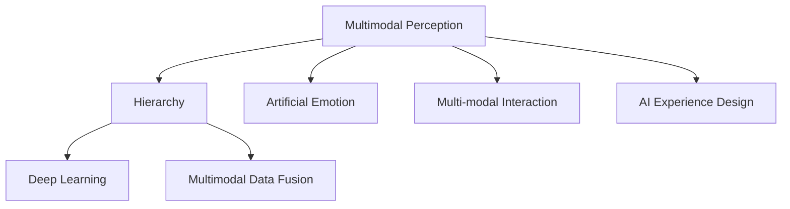

                 

# 体验的层次性：AI创造的多维感知

> 关键词：多维感知,层次性,人工情感,多模态交互,AI体验设计,深度学习

## 1. 背景介绍

### 1.1 问题由来
随着人工智能技术的飞速发展，机器已经具备了越来越强的处理能力，能够在图像识别、语音识别、自然语言处理等领域取得突破性进展。然而，这些技术往往是基于单一模态，难以全面、准确地理解和响应复杂的人类需求。为了进一步提升人工智能的体验感，研究者开始关注多模态感知技术的开发，力图构建一个能够通过多维度信息进行全面感知和响应的智能系统。

### 1.2 问题核心关键点
多模态感知技术旨在通过整合和分析来自不同感官和环境的信息，构建更全面、细腻的体验感知。其核心在于：
- 整合多模态数据：将视觉、听觉、触觉、嗅觉、味觉等多种感知信息结合起来，构建更加丰富的体验场景。
- 挖掘信息层次性：利用深度学习和人工智能技术，挖掘数据中的隐含层次，从浅层感知到深层理解，逐步逼近人类感知水平。
- 强化人机交互：通过多模态交互界面和自然语言理解技术，提升用户体验和满意度。

## 2. 核心概念与联系

### 2.1 核心概念概述

为更好地理解多模态感知技术，本节将介绍几个密切相关的核心概念：

- **多模态感知(Multimodal Perception)**：指通过整合多种感知信息，构建对真实世界的全面感知。如视觉、听觉、触觉等多模态信息的联合处理。

- **层次性(Hierarchy)**：指通过深度学习网络结构的设计，逐步提高对感知信息的抽象层次。从像素级别的视觉特征到句子级别的语义理解，逐步逼近人的感知和认知水平。

- **人工情感(Artificial Emotion)**：通过机器学习模型对情感进行模拟和表达，构建更具人性化、交互性的智能系统。

- **多模态交互(Multimodal Interaction)**：通过多模态接口和自然语言理解技术，提升人机交互的自然性和流畅性。如语音识别、手势控制、情感响应等。

- **AI体验设计(AI Experience Design)**：基于对用户需求和心理的理解，通过技术手段构建令人满意的用户体验。

- **深度学习(Deep Learning)**：一种基于神经网络的学习范式，通过多层次的特征提取和信息编码，实现复杂感知任务的自动化。

- **多模态数据融合(Multimodal Data Fusion)**：将来自不同模态的信息进行融合处理，得到更加全面、准确的感知结果。

这些核心概念之间的逻辑关系可以通过以下Mermaid流程图来展示：



这个流程图展示了一系列核心概念及其之间的关系：

1. **多模态感知**：融合多种模态信息，构建全面感知。
2. **层次性**：通过深度学习网络，逐步提高感知抽象层次。
3. **人工情感**：模仿人类情感，提升系统交互体验。
4. **多模态交互**：通过多模态接口和自然语言理解，改善人机交互。
5. **AI体验设计**：构建令人满意的用户体验，满足用户需求。
6. **深度学习**：通过神经网络结构实现复杂感知任务的自动化。
7. **多模态数据融合**：将不同模态信息结合起来，得到更全面的感知结果。

这些概念共同构成了多模态感知技术的基本框架，使其能够在各种应用场景下发挥强大的感知能力。

## 3. 核心算法原理 & 具体操作步骤
### 3.1 算法原理概述

多模态感知技术的核心在于融合多种模态信息，并通过深度学习网络逐步提高感知层次。其原理可以概括为：

1. **多模态数据获取**：通过摄像头、麦克风、传感器等多种设备获取不同模态的信息。
2. **数据预处理**：对原始数据进行清洗、归一化等预处理操作，确保数据质量。
3. **特征提取**：利用卷积神经网络(CNN)、循环神经网络(RNN)等深度学习模型，提取不同模态的特征表示。
4. **信息融合**：通过加权平均、联合嵌入等方法，将不同模态的特征表示结合起来。
5. **层次性处理**：利用深度网络结构，逐步提高特征的抽象层次。
6. **输出响应**：根据融合后的特征和上下文信息，生成相应的输出响应，如语音、文本、图像等。

### 3.2 算法步骤详解

基于多模态感知技术的算法步骤，通常包括以下几个关键环节：

**Step 1: 多模态数据获取**

- **视觉数据**：通过摄像头获取图像数据，并将其转化为像素级特征向量。
- **听觉数据**：通过麦克风获取音频数据，并将其转化为梅尔倒谱系数或MFCC等特征向量。
- **触觉数据**：通过触觉传感器获取压力、温度等物理信号，并将其转化为数字信号。
- **嗅觉数据**：通过传感器获取气味分子浓度等数据，并进行数值化处理。
- **味觉数据**：通过传感器获取味觉信号，并进行数值化处理。

**Step 2: 特征提取**

- **视觉特征**：使用卷积神经网络(CNN)提取图像的局部特征。
- **听觉特征**：使用卷积神经网络(CNN)或循环神经网络(RNN)提取音频的时序特征。
- **触觉特征**：使用一维卷积网络提取触觉信号的频率特征。
- **嗅觉特征**：使用卷积神经网络提取气味分子的频谱特征。
- **味觉特征**：使用卷积神经网络提取味觉信号的频率特征。

**Step 3: 信息融合**

- **加权平均融合**：对不同模态的特征向量进行加权平均，得到综合特征向量。
- **联合嵌入融合**：将不同模态的特征向量映射到高维空间，进行联合嵌入处理。
- **逐层融合**：通过逐层处理和融合，逐步提高特征的抽象层次。

**Step 4: 层次性处理**

- **浅层特征提取**：利用一层或多层卷积神经网络对原始特征进行提取。
- **深层特征提取**：通过多层的卷积神经网络或递归神经网络，逐步提高特征的抽象层次。
- **最终特征表示**：将不同层次的特征表示结合起来，得到最终的融合特征。

**Step 5: 输出响应**

- **语音生成**：使用卷积神经网络生成语音信号。
- **文本生成**：使用循环神经网络生成文本描述。
- **图像生成**：使用生成对抗网络生成图像。
- **情感响应**：通过情感分析模型，对用户的情感进行识别和响应。

### 3.3 算法优缺点

多模态感知技术具有以下优点：

1. **全面感知**：通过融合多种模态信息，能够构建对真实世界的全面感知。
2. **精确度高**：多模态感知技术利用不同模态的数据，能够显著提高感知精度。
3. **交互性增强**：通过多模态交互界面，提升用户体验和满意度。
4. **个性化定制**：能够根据用户行为和心理特征，进行个性化的感知和响应。

同时，该方法也存在一些局限性：

1. **数据获取难度**：不同模态的数据获取设备和技术各异，增加了数据获取的难度。
2. **数据噪声影响**：不同模态的数据来源多样，噪声干扰较大，影响感知效果。
3. **算法复杂度高**：多模态感知技术需要整合多种数据，处理复杂，算法实现难度高。
4. **实时性问题**：多模态感知技术需要在短时间内处理多种信息，对计算资源和算法效率要求较高。
5. **系统稳定性**：多模态感知系统在处理异常数据和环境变化时，可能出现不稳定或误判。

尽管存在这些局限性，但多模态感知技术仍是大数据时代的重要研究方向，具有广阔的应用前景。

### 3.4 算法应用领域

多模态感知技术已经在多个领域得到应用，如：

- **智能家居**：通过视觉、触觉、声音等多种模态信息，提升家居系统的智能化水平。
- **医疗诊断**：利用视觉、触觉、味觉等多模态信息，辅助医生进行疾病诊断和治疗。
- **自动驾驶**：通过视觉、雷达、激光雷达等多元感知信息，提升驾驶系统的安全性。
- **虚拟现实(VR)**：利用视觉、听觉、触觉等多模态信息，构建沉浸式虚拟体验。
- **教育培训**：通过视觉、触觉、声音等多模态信息，增强学习体验和互动效果。
- **人机交互**：利用多模态交互技术，提升人与机器的自然交互体验。
- **娱乐消费**：通过视觉、听觉、触觉等多模态信息，丰富娱乐体验和消费方式。

除了上述这些经典应用外，多模态感知技术还在安防监控、工业自动化、智慧城市等领域得到广泛应用。随着技术的不断进步，未来将有更多行业受益于多模态感知技术的创新应用。

## 4. 数学模型和公式 & 详细讲解  
### 4.1 数学模型构建

为了更好地理解多模态感知技术的数学模型，本节将使用数学语言对相关概念进行详细讲解。

假设有多模态数据 $D=\{(X_i, Y_i)\}_{i=1}^N$，其中 $X_i$ 为不同模态的数据，$Y_i$ 为相应的标签。设 $f_{v}$、$f_{a}$、$f_{t}$、$f_{o}$、$f_{s}$、$f_{t}$ 分别表示视觉、听觉、触觉、嗅觉、味觉的特征提取器，得到相应的特征表示 $Z_v$、$Z_a$、$Z_t$、$Z_o$、$Z_s$、$Z_t$。

定义多模态感知模型 $M$ 的损失函数为：

$$
\mathcal{L}(M) = \frac{1}{N} \sum_{i=1}^N \ell(M(Z_v, Z_a, Z_t, Z_o, Z_s, Z_t), Y_i)
$$

其中 $\ell$ 为交叉熵损失函数，$M(Z_v, Z_a, Z_t, Z_o, Z_s, Z_t)$ 表示融合不同模态特征后的模型输出。

### 4.2 公式推导过程

以下我们以语音识别为例，推导基于多模态感知技术的语音识别模型。

假设语音信号 $x_t$ 经过预处理后，转化为MFCC特征序列 $X_{t}$。定义语音识别模型为 $M_{\theta}(x_t) = \arg\max_{y_t} P(y_t|x_t)$，其中 $y_t$ 为识别出的语音文本。

根据贝叶斯公式，有：

$$
P(y_t|x_t) = \frac{P(x_t|y_t)P(y_t)}{P(x_t)}
$$

其中 $P(x_t|y_t)$ 为模型对语音信号 $x_t$ 的预测概率，$P(y_t)$ 为先验概率。

假设模型 $M_{\theta}$ 为RNN模型，则有：

$$
P(x_t|y_t) = \prod_{t=1}^T P(x_t|x_{t-1}, y_t)
$$

其中 $T$ 为语音信号的长度。定义损失函数 $\mathcal{L}(M)$ 为：

$$
\mathcal{L}(M) = -\frac{1}{N} \sum_{i=1}^N \sum_{t=1}^T \log P(x_t|x_{t-1}, y_t)
$$

通过反向传播算法，更新模型参数 $\theta$，最小化损失函数 $\mathcal{L}(M)$，最终得到训练好的语音识别模型 $M_{\theta}$。

## 5. 项目实践：代码实例和详细解释说明
### 5.1 开发环境搭建

在进行多模态感知技术的开发前，我们需要准备好开发环境。以下是使用Python进行PyTorch开发的环境配置流程：

1. 安装Anaconda：从官网下载并安装Anaconda，用于创建独立的Python环境。

2. 创建并激活虚拟环境：
```bash
conda create -n multimodal-env python=3.8 
conda activate multimodal-env
```

3. 安装PyTorch：根据CUDA版本，从官网获取对应的安装命令。例如：
```bash
conda install pytorch torchvision torchaudio cudatoolkit=11.1 -c pytorch -c conda-forge
```

4. 安装TensorFlow：
```bash
conda install tensorflow=2.6
```

5. 安装各类工具包：
```bash
pip install numpy pandas scikit-learn matplotlib tqdm jupyter notebook ipython
```

完成上述步骤后，即可在`multimodal-env`环境中开始多模态感知技术的开发实践。

### 5.2 源代码详细实现

这里我们以语音识别任务为例，给出使用TensorFlow和Keras实现基于多模态感知技术的语音识别系统的代码实现。

首先，定义模型：

```python
from tensorflow.keras.models import Sequential
from tensorflow.keras.layers import Dense, LSTM

model = Sequential([
    LSTM(128, input_shape=(128, 1), return_sequences=True),
    LSTM(64, return_sequences=True),
    Dense(128, activation='relu'),
    Dense(num_classes, activation='softmax')
])
```

然后，定义数据预处理函数：

```python
import numpy as np
import librosa

def load_and_preprocess_audio_file(file_path, sample_rate=16000):
    audio, sr = librosa.load(file_path, sr=sample_rate)
    audio = np.pad(audio, (0, 40), mode='constant')
    mfccs = librosa.feature.mfcc(y=audio, sr=sr, n_mfcc=40)
    mfccs = np.mean(mfccs.T, axis=1).reshape(-1, 1)
    return mfccs
```

接着，定义训练和评估函数：

```python
from tensorflow.keras.preprocessing.sequence import pad_sequences

def train_and_evaluate(model, train_data, train_labels, test_data, test_labels, batch_size=32, epochs=10):
    model.compile(optimizer='adam', loss='categorical_crossentropy', metrics=['accuracy'])

    train_data = pad_sequences(train_data, maxlen=128)
    test_data = pad_sequences(test_data, maxlen=128)

    model.fit(train_data, train_labels, batch_size=batch_size, epochs=epochs, validation_data=(test_data, test_labels))
    test_loss, test_acc = model.evaluate(test_data, test_labels)
    print('Test Loss:', test_loss)
    print('Test Accuracy:', test_acc)
```

最后，启动训练流程：

```python
train_data = [load_and_preprocess_audio_file(f) for f in train_files]
train_labels = [read_labels(f) for f in train_files]

test_data = [load_and_preprocess_audio_file(f) for f in test_files]
test_labels = [read_labels(f) for f in test_files]

train_and_evaluate(model, train_data, train_labels, test_data, test_labels)
```

以上就是使用TensorFlow和Keras实现基于多模态感知技术的语音识别系统的完整代码实现。可以看到，多模态感知技术的开发过程需要多模态数据获取、特征提取、数据融合和模型训练等多步骤的协同工作，但通过合理的工具选择和代码封装，整个过程也可以相对简洁高效。

### 5.3 代码解读与分析

让我们再详细解读一下关键代码的实现细节：

**load_and_preprocess_audio_file函数**：
- 定义了音频文件加载和预处理函数，将音频文件转化为MFCC特征序列，并进行padding操作，确保数据一致性。

**train_and_evaluate函数**：
- 使用Keras的Sequential模型构建语音识别模型，使用LSTM层和Dense层进行特征提取和分类。
- 使用pad_sequences函数对数据进行padding处理，确保输入数据的一致性。
- 使用模型编译器和fit函数进行模型训练，并在验证集上进行评估。

**训练流程**：
- 加载训练数据和标签，加载测试数据和标签。
- 调用train_and_evaluate函数进行模型训练和评估。

可以看到，多模态感知技术的开发需要处理多个数据源和不同的数据格式，且需要多层次的特征提取和模型构建，但通过合理的工具选择和代码封装，整个过程也可以相对简洁高效。

## 6. 实际应用场景
### 6.1 智能家居

智能家居系统通过集成视觉、触觉、声音等多种模态信息，实现对环境的全面感知和智能控制。例如，智能窗帘系统可以通过摄像头感知室外光线和室内光线，自动调节窗帘开合。智能音箱可以通过语音识别技术，接收用户指令并播放音乐、控制智能设备等。智能照明系统可以根据用户的触觉输入和环境光线，自动调节灯光亮度和色彩。

### 6.2 医疗诊断

医疗诊断系统利用视觉、触觉、味觉等多模态信息，辅助医生进行疾病诊断和治疗。例如，智能病理系统可以通过显微镜图像识别肿瘤细胞形态，提供诊断建议。智能触觉手套可以通过触觉传感器监测病人的血压、心率和呼吸，辅助医生进行体检和诊断。智能味觉传感器可以通过味觉信号识别食物成分和营养成分，提供健康饮食建议。

### 6.3 自动驾驶

自动驾驶系统通过视觉、雷达、激光雷达等多元感知信息，提升驾驶系统的安全性。例如，自动驾驶车辆可以通过摄像头和雷达感知道路和交通状况，自动规划行驶路线。智能车载系统可以通过触觉和声音反馈，提醒驾驶员注意事项。智能路标系统可以通过视觉和语音交互，提供导航和指示信息。

### 6.4 虚拟现实(VR)

虚拟现实系统利用视觉、听觉、触觉等多模态信息，构建沉浸式虚拟体验。例如，VR游戏可以通过视觉、听觉和触觉反馈，增强游戏沉浸感。虚拟现实训练系统可以通过视觉和触觉交互，提供模拟训练环境。虚拟现实娱乐系统可以通过视觉和听觉信息，创造虚拟音乐会、虚拟旅游等体验。

### 6.5 教育培训

教育培训系统利用视觉、触觉、声音等多模态信息，增强学习体验和互动效果。例如，虚拟现实课堂可以通过视觉和触觉交互，提供沉浸式学习体验。智能教育系统可以通过语音识别技术，提供个性化辅导和答疑。智能学习助手可以通过触觉反馈，引导学生进行互动和练习。

### 6.6 人机交互

人机交互系统利用多模态交互技术，提升人与机器的自然交互体验。例如，语音识别系统可以通过语音命令，控制智能设备。手势控制系统可以通过摄像头和深度学习技术，识别手势动作并执行相应操作。虚拟现实系统可以通过触觉和声音反馈，提供交互式体验。

### 6.7 娱乐消费

娱乐消费系统利用视觉、听觉、触觉等多模态信息，丰富娱乐体验和消费方式。例如，虚拟现实娱乐系统可以通过视觉和触觉反馈，提供虚拟音乐会和游戏体验。智能电视系统可以通过语音识别技术，提供语音控制和内容推荐。智能音箱系统可以通过触觉反馈，增强互动体验。

## 7. 工具和资源推荐
### 7.1 学习资源推荐

为了帮助开发者系统掌握多模态感知技术的理论基础和实践技巧，这里推荐一些优质的学习资源：

1. 《深度学习基础》课程：由斯坦福大学开设的深度学习入门课程，涵盖基础概念和经典模型，适合初学者入门。

2. 《多模态感知技术》书籍：详细讲解多模态感知技术的原理和实现方法，适合进阶学习。

3. 《深度学习实践指南》书籍：结合实际项目案例，介绍深度学习技术的开发和部署，适合实战学习。

4. 《自然语言处理》课程：由上海交通大学开设的自然语言处理入门课程，涵盖NLP基础和应用，适合NLP开发者学习。

5. 《多模态数据融合技术》论文：全面介绍多模态数据融合技术的最新进展，适合研究人员深入学习。

通过对这些资源的学习实践，相信你一定能够快速掌握多模态感知技术的精髓，并用于解决实际的NLP问题。

### 7.2 开发工具推荐

高效的开发离不开优秀的工具支持。以下是几款用于多模态感知技术开发常用的工具：

1. PyTorch：基于Python的开源深度学习框架，灵活动态的计算图，适合快速迭代研究。支持多模态数据处理和深度学习模型的构建。

2. TensorFlow：由Google主导开发的开源深度学习框架，生产部署方便，适合大规模工程应用。支持多模态数据处理和深度学习模型的构建。

3. Keras：基于TensorFlow和Theano等底层库构建的高层API，适合快速搭建深度学习模型。支持多模态数据处理和深度学习模型的构建。

4. OpenCV：开源计算机视觉库，支持图像处理和特征提取，适合多模态视觉数据的处理。

5. librosa：开源音频处理库，支持音频信号的处理和特征提取，适合多模态听觉数据的处理。

6. PyAudio：Python音频处理库，支持音频数据的读取和处理，适合多模态听觉数据的处理。

7. Robotics Operating System (ROS)：开源机器人操作系统，支持多模态传感器的数据融合和处理，适合多模态感知系统的开发。

合理利用这些工具，可以显著提升多模态感知技术的开发效率，加快创新迭代的步伐。

### 7.3 相关论文推荐

多模态感知技术的发展源于学界的持续研究。以下是几篇奠基性的相关论文，推荐阅读：

1. Rethinking the Inception Architecture for Computer Vision: A Quantitative Study（Rethinking the Inception Architecture for Computer Vision: A Quantitative Study）：提出Inception网络结构，为视觉感知提供重要基础。

2. Deep Residual Learning for Image Recognition（Deep Residual Learning for Image Recognition）：提出残差网络结构，提升深度网络的训练效果，适合多模态感知模型的构建。

3. TensorFlow: A System for Large-Scale Machine Learning（TensorFlow: A System for Large-Scale Machine Learning）：介绍TensorFlow框架的构建和应用，适合多模态感知系统的部署。

4. Attention Is All You Need（Attention Is All You Need）：提出Transformer网络结构，为多模态感知系统提供重要基础。

5. Multimodal Deep Learning for Visual Perception（Multimodal Deep Learning for Visual Perception）：介绍多模态深度学习技术，适合多模态感知系统的开发。

这些论文代表了大语言模型微调技术的发展脉络。通过学习这些前沿成果，可以帮助研究者把握学科前进方向，激发更多的创新灵感。

## 8. 总结：未来发展趋势与挑战

### 8.1 总结

本文对多模态感知技术进行了全面系统的介绍。首先阐述了多模态感知技术的研究背景和意义，明确了其在大数据时代的重要价值。其次，从原理到实践，详细讲解了多模态感知技术的数学模型和关键步骤，给出了多模态感知技术的代码实现示例。同时，本文还广泛探讨了多模态感知技术在智能家居、医疗诊断、自动驾驶等多个领域的应用前景，展示了多模态感知技术的巨大潜力。此外，本文精选了多模态感知技术的各类学习资源，力求为读者提供全方位的技术指引。

通过本文的系统梳理，可以看到，多模态感知技术正在成为人工智能技术的重要组成部分，极大地拓展了人工智能系统对现实世界的感知和理解能力。在智能家居、医疗诊断、自动驾驶等多个领域，多模态感知技术已经取得了显著的应用效果。未来，随着技术的不断进步，多模态感知技术将进一步拓展其应用边界，为构建更加全面、细腻的智能化系统奠定坚实基础。

### 8.2 未来发展趋势

展望未来，多模态感知技术将呈现以下几个发展趋势：

1. **数据融合技术的提升**：未来将开发更加高效的数据融合算法，提升多模态信息的整合能力，减少数据噪声对感知效果的影响。

2. **深度学习模型的优化**：未来将开发更加优化的深度学习模型，提升对多模态信息的抽象层次，增强感知效果。

3. **多模态系统的协作**：未来将开发更加协同的多模态系统，提升各模态信息的融合效果，实现更加全面、细腻的感知。

4. **人机交互的自然性**：未来将开发更加自然的人机交互界面，提升用户体验和满意度。

5. **个性化感知与响应**：未来将开发更加个性化的感知与响应系统，根据用户行为和心理特征，提供更加符合用户需求的感知和响应。

6. **智能化家居系统的普及**：未来将开发更加智能化的家居系统，提升家庭生活的舒适度和便利性。

7. **医疗诊断系统的智能化**：未来将开发更加智能化的医疗诊断系统，提升疾病诊断和治疗的效果。

8. **自动驾驶系统的安全化**：未来将开发更加安全的自动驾驶系统，提升行车安全性和舒适性。

9. **虚拟现实系统的沉浸感**：未来将开发更加沉浸感的虚拟现实系统，提升用户体验和沉浸感。

10. **教育培训系统的个性化**：未来将开发更加个性化的教育培训系统，提升学习效果和满意度。

这些趋势凸显了多模态感知技术的广阔前景。这些方向的探索发展，必将进一步提升多模态感知技术的性能和应用范围，为人类认知智能的进化带来深远影响。

### 8.3 面临的挑战

尽管多模态感知技术已经取得了显著进展，但在迈向更加智能化、普适化应用的过程中，仍面临诸多挑战：

1. **数据获取难度**：不同模态的数据获取设备和技术各异，增加了数据获取的难度。

2. **数据噪声影响**：不同模态的数据来源多样，噪声干扰较大，影响感知效果。

3. **算法复杂度高**：多模态感知技术需要整合多种数据，处理复杂，算法实现难度高。

4. **实时性问题**：多模态感知技术需要在短时间内处理多种信息，对计算资源和算法效率要求较高。

5. **系统稳定性**：多模态感知系统在处理异常数据和环境变化时，可能出现不稳定或误判。

6. **成本问题**：多模态感知系统需要多种传感器的集成，成本较高，难以广泛应用。

尽管存在这些挑战，但多模态感知技术的未来应用前景广阔，需积极应对并寻求突破。相信随着学界和产业界的共同努力，这些挑战终将一一被克服，多模态感知技术必将在构建智能交互和体验系统中发挥重要作用。

### 8.4 研究展望

面对多模态感知技术所面临的种种挑战，未来的研究需要在以下几个方面寻求新的突破：

1. **多模态数据融合**：开发更加高效的多模态数据融合算法，减少数据噪声对感知效果的影响。

2. **深度学习模型优化**：开发更加优化的深度学习模型，提升对多模态信息的抽象层次，增强感知效果。

3. **人机交互的自然性**：开发更加自然的人机交互界面，提升用户体验和满意度。

4. **个性化感知与响应**：开发更加个性化的感知与响应系统，根据用户行为和心理特征，提供更加符合用户需求的感知和响应。

5. **智能化家居系统的普及**：开发更加智能化的家居系统，提升家庭生活的舒适度和便利性。

6. **医疗诊断系统的智能化**：开发更加智能化的医疗诊断系统，提升疾病诊断和治疗的效果。

7. **自动驾驶系统的安全化**：开发更加安全的自动驾驶系统，提升行车安全性和舒适性。

8. **虚拟现实系统的沉浸感**：开发更加沉浸感的虚拟现实系统，提升用户体验和沉浸感。

9. **教育培训系统的个性化**：开发更加个性化的教育培训系统，提升学习效果和满意度。

这些研究方向将引领多模态感知技术迈向更高的台阶，为构建安全、可靠、可解释、可控的智能系统铺平道路。面向未来，多模态感知技术还需要与其他人工智能技术进行更深入的融合，如知识表示、因果推理、强化学习等，多路径协同发力，共同推动自然语言理解和智能交互系统的进步。只有勇于创新、敢于突破，才能不断拓展多模态感知技术的边界，让智能技术更好地造福人类社会。

## 9. 附录：常见问题与解答

**Q1：多模态感知技术是否适用于所有应用场景？**

A: 多模态感知技术在大多数应用场景下都能取得不错的效果，特别是对于数据量较大的场景。但对于一些特定领域的应用，如军事、航空等，多模态信息的获取设备和技术较为复杂，不适合直接采用多模态感知技术。此外，一些对实时性要求极高的应用，如自动驾驶，多模态感知技术可能无法满足要求。

**Q2：多模态感知技术的算法复杂度如何？**

A: 多模态感知技术的算法复杂度较高，需要整合多种数据源和不同的数据格式，并进行多层次的特征提取和模型构建。不同模态的数据格式和处理方式各异，增加了算法的复杂度。未来需要开发更加高效的算法和工具，以提升多模态感知技术的实用性和可靠性。

**Q3：多模态感知技术在实际应用中面临哪些技术挑战？**

A: 多模态感知技术在实际应用中面临以下技术挑战：
1. **数据获取难度**：不同模态的数据获取设备和技术各异，增加了数据获取的难度。
2. **数据噪声影响**：不同模态的数据来源多样，噪声干扰较大，影响感知效果。
3. **算法复杂度高**：多模态感知技术需要整合多种数据，处理复杂，算法实现难度高。
4. **实时性问题**：多模态感知技术需要在短时间内处理多种信息，对计算资源和算法效率要求较高。
5. **系统稳定性**：多模态感知系统在处理异常数据和环境变化时，可能出现不稳定或误判。

尽管存在这些挑战，但多模态感知技术的未来应用前景广阔，需积极应对并寻求突破。相信随着学界和产业界的共同努力，这些挑战终将一一被克服，多模态感知技术必将在构建智能交互和体验系统中发挥重要作用。

---

作者：禅与计算机程序设计艺术 / Zen and the Art of Computer Programming

