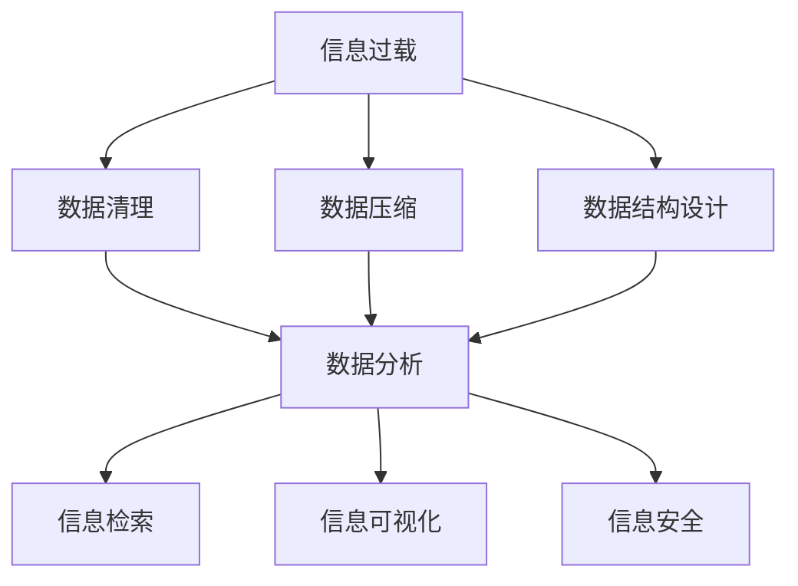

                 

# 信息时代的信息管理策略与实践：管理信息过载和复杂性

> 关键词：信息过载, 信息管理, 数据压缩, 数据清理, 数据结构, 数据分析, 信息检索, 信息可视化, 信息安全

## 1. 背景介绍

### 1.1 问题由来

随着信息技术的发展，数据正在以指数级的速度增长。从物联网(IoT)到人工智能(AI)，从社交媒体到电子商务，数据无处不在，无时不有。数据量的大幅增长带来的不仅是机遇，更有挑战。尤其是在信息时代，如何管理、处理、利用这些庞大的数据，成为了一个重要的课题。信息过载和复杂性是数据管理过程中不可忽视的问题，其不仅影响了数据的有效利用，还对组织决策、企业竞争力、用户体验等产生了深远的影响。

### 1.2 问题核心关键点

数据管理的目标在于有效收集、存储、处理和利用数据，以支持组织和个人的决策。然而，在数据管理过程中，以下问题成为核心关键点：

1. **信息过载**：大量的数据来源和格式导致了信息的爆炸式增长，超出了个人和组织的处理能力，影响了信息的获取和利用。
2. **数据质量**：数据中的噪声、错误和不完整性会影响分析结果的准确性。
3. **数据安全性**：隐私和安全性问题日益凸显，对个人和组织构成了威胁。
4. **数据集成**：不同数据源的数据格式和结构差异大，数据集成困难。
5. **数据存储成本**：大规模数据存储需要巨大的硬件和软件投入。

### 1.3 问题研究意义

研究信息过载和复杂性的管理策略，对于提升数据管理效率、保障数据安全、优化决策支持系统具有重要意义：

1. **提升数据管理效率**：通过有效的数据管理策略，可以大幅降低数据管理成本，提高数据处理速度。
2. **保障数据安全**：制定合理的安全管理策略，可以保护组织和个人的隐私，防止数据泄露。
3. **优化决策支持**：确保数据准确性和一致性，为决策提供坚实的基础。
4. **提升用户体验**：减少信息过载，提供简洁明了的用户界面，改善用户体验。
5. **驱动企业竞争力**：数据是现代企业的核心资产，有效管理数据可以带来显著的商业价值。

## 2. 核心概念与联系

### 2.1 核心概念概述

为更好地理解信息过载和复杂性的管理策略，本节将介绍几个密切相关的核心概念：

- **信息过载**：信息过多，超出了接收、处理和理解的能力范围，导致认知负荷增加。
- **数据清理**：去除数据中的噪声、错误和不完整信息，提高数据质量。
- **数据压缩**：通过算法减少数据的存储空间和传输带宽，提高数据效率。
- **数据结构设计**：设计合理的数据结构，以便高效地存储、检索和处理数据。
- **数据分析**：通过对数据进行统计、计算和建模，发现数据背后的规律和趋势。
- **信息检索**：通过算法和系统，高效地从大量数据中查找相关信息。
- **信息可视化**：通过图形化展示数据，帮助理解和分析复杂信息。
- **信息安全**：保护数据免受未经授权的访问、使用和泄露。

这些核心概念之间的逻辑关系可以通过以下Mermaid流程图来展示：



这个流程图展示了几大数据管理活动及其之间的关系：

1. 信息过载需要通过数据清理、数据压缩和设计数据结构来优化。
2. 清理和压缩后的数据可通过数据分析、信息检索和信息可视化进行处理和展示。
3. 数据管理过程中，信息安全是重要的保障措施。

## 3. 核心算法原理 & 具体操作步骤

### 3.1 算法原理概述

信息过载和复杂性的管理策略主要基于以下几个核心算法：

- **数据清理算法**：用于去除数据中的噪声、错误和不完整信息，提高数据质量。
- **数据压缩算法**：通过算法减少数据的存储空间和传输带宽，提高数据效率。
- **数据结构设计算法**：合理设计数据结构，以便高效地存储、检索和处理数据。
- **数据分析算法**：通过对数据进行统计、计算和建模，发现数据背后的规律和趋势。
- **信息检索算法**：通过算法和系统，高效地从大量数据中查找相关信息。
- **信息可视化算法**：通过图形化展示数据，帮助理解和分析复杂信息。
- **信息安全算法**：保护数据免受未经授权的访问、使用和泄露。

这些算法共同构成了信息管理的核心逻辑，使得组织和个人能够有效应对信息过载和复杂性的挑战。

### 3.2 算法步骤详解

#### 3.2.1 数据清理算法

**步骤1**：数据预处理  
对原始数据进行初步的预处理，包括缺失值填补、异常值检测和数据格式转换。

**步骤2**：数据噪声去除  
利用统计方法（如均值、中位数）和算法（如孤立森林）检测和移除噪声。

**步骤3**：数据去重  
通过哈希表、散列函数等方法，去重重复数据。

**步骤4**：数据标准化  
对数据进行归一化、标准化等处理，使其在相同的尺度下比较。

**步骤5**：数据抽样  
在数据量过大时，选择代表性样本进行分析。

**步骤6**：数据验证  
对清理后的数据进行验证，确保数据准确性和完整性。

#### 3.2.2 数据压缩算法

**步骤1**：选择压缩算法  
根据数据类型和特性，选择合适的压缩算法（如Huffman编码、LZ77等）。

**步骤2**：数据预处理  
对数据进行预处理，如分词、分句等。

**步骤3**：压缩执行  
使用选定的算法对数据进行压缩。

**步骤4**：压缩效果评估  
评估压缩后的数据效果，包括压缩率和解压效果。

#### 3.2.3 数据结构设计算法

**步骤1**：需求分析  
分析数据管理的需求，确定数据结构设计的目标。

**步骤2**：选择合适的数据结构  
根据数据特性和需求，选择合适的数据结构（如数组、链表、哈希表等）。

**步骤3**：数据结构实现  
实现选定的数据结构，并进行优化。

**步骤4**：数据结构验证  
对设计好的数据结构进行验证，确保其能够高效地存储、检索和处理数据。

#### 3.2.4 数据分析算法

**步骤1**：数据探索  
对数据进行初步探索，了解数据特性和分布。

**步骤2**：数据建模  
选择适当的统计模型和机器学习模型，进行数据建模。

**步骤3**：模型评估  
对模型进行评估，选择最优模型。

**步骤4**：模型应用  
将模型应用于实际数据，进行数据分析。

**步骤5**：结果验证  
对分析结果进行验证，确保结果的准确性和可靠性。

#### 3.2.5 信息检索算法

**步骤1**：索引构建  
对数据进行索引构建，以便快速检索。

**步骤2**：检索执行  
根据检索请求，执行数据检索。

**步骤3**：检索结果展示  
对检索结果进行展示，并提供排序和筛选功能。

#### 3.2.6 信息可视化算法

**步骤1**：数据选择  
选择需要可视化的数据。

**步骤2**：数据处理  
对数据进行处理，如数据转换、归一化等。

**步骤3**：可视化设计  
设计合适的可视化图表，如散点图、柱状图、折线图等。

**步骤4**：可视化实现  
使用可视化工具（如Tableau、Power BI等）实现可视化。

**步骤5**：结果展示  
展示可视化结果，并提供交互功能。

#### 3.2.7 信息安全算法

**步骤1**：风险评估  
对数据进行风险评估，确定安全需求。

**步骤2**：安全措施设计  
设计合适的安全措施，如加密、访问控制等。

**步骤3**：安全实现  
实现选定的安全措施，并进行优化。

**步骤4**：安全验证  
对安全措施进行验证，确保其有效性。

**步骤5**：安全监控  
对数据进行安全监控，及时发现和处理安全问题。

### 3.3 算法优缺点

#### 数据清理算法

**优点**：

- 提高数据质量，确保分析结果的准确性。
- 减少数据存储空间和传输带宽，提高数据效率。

**缺点**：

- 数据清理过程中可能会丢失一些有价值的信息。
- 复杂的数据清理算法可能会增加处理时间。

#### 数据压缩算法

**优点**：

- 减少数据的存储空间和传输带宽，提高数据效率。
- 保护数据隐私，防止数据泄露。

**缺点**：

- 压缩算法可能会引入数据失真，影响分析结果。
- 复杂的数据压缩算法可能会增加计算复杂度。

#### 数据结构设计算法

**优点**：

- 提高数据存储、检索和处理的效率。
- 为数据分析和信息检索提供坚实的基础。

**缺点**：

- 设计复杂的数据结构可能会增加开发成本。
- 不合适的数据结构可能导致数据处理效率低下。

#### 数据分析算法

**优点**：

- 发现数据背后的规律和趋势，提供决策支持。
- 通过建模，提高数据分析的准确性。

**缺点**：

- 数据分析算法可能会引入过拟合，影响模型的泛化能力。
- 复杂的数据分析算法可能会增加计算复杂度。

#### 信息检索算法

**优点**：

- 提高信息检索的效率和准确性。
- 提供简洁明了的用户界面，改善用户体验。

**缺点**：

- 复杂的信息检索算法可能会增加系统复杂度。
- 不合适的信息检索算法可能导致检索结果不准确。

#### 信息可视化算法

**优点**：

- 帮助理解和分析复杂信息，提供直观的视觉展示。
- 支持用户交互，提高用户体验。

**缺点**：

- 复杂的信息可视化算法可能会增加计算复杂度。
- 不合适的可视化图表可能导致信息展示不准确。

#### 信息安全算法

**优点**：

- 保护数据免受未经授权的访问、使用和泄露，保障数据安全。
- 提高组织的信任度和竞争力。

**缺点**：

- 复杂的信息安全算法可能会增加系统复杂度。
- 不合适的安全措施可能导致数据泄露。

### 3.4 算法应用领域

#### 3.4.1 商业智能（BI）

商业智能是利用数据管理技术，支持企业决策的过程。信息过载和复杂性的管理策略在商业智能中具有重要应用，可以提高数据分析的效率和准确性，支持企业决策。

#### 3.4.2 数据分析

数据分析是利用数据管理技术，发现数据背后的规律和趋势，支持业务决策的过程。信息过载和复杂性的管理策略在数据分析中具有重要应用，可以提高数据分析的效率和准确性，发现数据背后的规律和趋势。

#### 3.4.3 搜索引擎

搜索引擎是利用信息检索技术，高效地从大量数据中查找相关信息的过程。信息过载和复杂性的管理策略在搜索引擎中具有重要应用，可以提高信息检索的效率和准确性，提供简洁明了的搜索结果。

#### 3.4.4 医疗保健

医疗保健是利用数据管理技术，支持医疗决策和优化医疗过程的过程。信息过载和复杂性的管理策略在医疗保健中具有重要应用，可以提高数据分析的效率和准确性，支持医疗决策和优化医疗过程。

#### 3.4.5 金融行业

金融行业是利用数据管理技术，支持金融决策和优化金融过程的过程。信息过载和复杂性的管理策略在金融行业具有重要应用，可以提高数据分析的效率和准确性，支持金融决策和优化金融过程。

## 4. 数学模型和公式 & 详细讲解 & 举例说明

### 4.1 数学模型构建

#### 4.1.1 数据清理数学模型

**数学模型**：

\[ \text{CleanData} = \text{PreProcess}(\text{RawData}) \]

其中，`RawData`为原始数据，`CleanData`为清理后的数据，`PreProcess`为数据预处理函数。

#### 4.1.2 数据压缩数学模型

**数学模型**：

\[ \text{CompressedData} = \text{Compress}(\text{RawData}) \]

其中，`RawData`为原始数据，`CompressedData`为压缩后的数据，`Compress`为数据压缩函数。

#### 4.1.3 数据结构设计数学模型

**数学模型**：

\[ \text{DataStructure} = \text{DesignStructure}(\text{CleanData}) \]

其中，`CleanData`为清理后的数据，`DataStructure`为设计好的数据结构，`DesignStructure`为数据结构设计函数。

#### 4.1.4 数据分析数学模型

**数学模型**：

\[ \text{AnalysisResult} = \text{Model}(\text{DataStructure}) \]

其中，`DataStructure`为设计好的数据结构，`AnalysisResult`为分析结果，`Model`为数据分析模型。

#### 4.1.5 信息检索数学模型

**数学模型**：

\[ \text{SearchResult} = \text{Search}(\text{Query}, \text{DataStructure}) \]

其中，`Query`为检索请求，`DataStructure`为设计好的数据结构，`SearchResult`为检索结果。

#### 4.1.6 信息可视化数学模型

**数学模型**：

\[ \text{VisualizationResult} = \text{Visualize}(\text{AnalysisResult}) \]

其中，`AnalysisResult`为分析结果，`VisualizationResult`为可视化结果，`Visualize`为信息可视化函数。

#### 4.1.7 信息安全数学模型

**数学模型**：

\[ \text{SecureData} = \text{Protect}(\text{DataStructure}) \]

其中，`DataStructure`为设计好的数据结构，`SecureData`为保护后的数据，`Protect`为信息安全保护函数。

### 4.2 公式推导过程

#### 4.2.1 数据清理公式推导

假设原始数据为`RawData`，清理后的数据为`CleanData`，则清理过程可以通过以下公式表示：

\[ \text{CleanData} = \text{PreProcess}(\text{RawData}) \]

其中，`PreProcess`为数据预处理函数，包括缺失值填补、异常值检测和数据格式转换等步骤。

#### 4.2.2 数据压缩公式推导

假设原始数据为`RawData`，压缩后的数据为`CompressedData`，则压缩过程可以通过以下公式表示：

\[ \text{CompressedData} = \text{Compress}(\text{RawData}) \]

其中，`Compress`为数据压缩函数，包括选择合适的压缩算法和执行压缩步骤。

#### 4.2.3 数据结构设计公式推导

假设清理后的数据为`CleanData`，设计好的数据结构为`DataStructure`，则数据结构设计过程可以通过以下公式表示：

\[ \text{DataStructure} = \text{DesignStructure}(\text{CleanData}) \]

其中，`DesignStructure`为数据结构设计函数，包括选择合适的数据结构和实现设计步骤。

#### 4.2.4 数据分析公式推导

假设设计好的数据结构为`DataStructure`，分析结果为`AnalysisResult`，则数据分析过程可以通过以下公式表示：

\[ \text{AnalysisResult} = \text{Model}(\text{DataStructure}) \]

其中，`Model`为数据分析模型，包括选择合适的统计模型和机器学习模型，进行数据分析步骤。

#### 4.2.5 信息检索公式推导

假设检索请求为`Query`，设计好的数据结构为`DataStructure`，检索结果为`SearchResult`，则信息检索过程可以通过以下公式表示：

\[ \text{SearchResult} = \text{Search}(\text{Query}, \text{DataStructure}) \]

其中，`Search`为信息检索函数，包括构建索引和执行检索步骤。

#### 4.2.6 信息可视化公式推导

假设分析结果为`AnalysisResult`，可视化结果为`VisualizationResult`，则信息可视化过程可以通过以下公式表示：

\[ \text{VisualizationResult} = \text{Visualize}(\text{AnalysisResult}) \]

其中，`Visualize`为信息可视化函数，包括选择合适的可视化图表和展示步骤。

#### 4.2.7 信息安全公式推导

假设设计好的数据结构为`DataStructure`，保护后的数据为`SecureData`，则信息安全保护过程可以通过以下公式表示：

\[ \text{SecureData} = \text{Protect}(\text{DataStructure}) \]

其中，`Protect`为信息安全保护函数，包括选择合适的安全措施和执行保护步骤。

### 4.3 案例分析与讲解

#### 4.3.1 数据清理案例

假设某电商公司收集了大量用户购物数据，但数据中存在缺失值、异常值和格式不一致等问题。公司决定使用数据清理算法，提高数据质量。

**数据清理过程**：

1. **缺失值填补**：使用均值填补缺失值。

2. **异常值检测**：使用孤立森林检测异常值，将其替换为合理值。

3. **数据格式转换**：将不同格式的数据转换为统一格式。

4. **数据去重**：使用哈希表去重重复数据。

5. **数据标准化**：对数据进行归一化处理。

6. **数据抽样**：选择代表性样本进行分析。

7. **数据验证**：对清理后的数据进行验证，确保数据准确性和完整性。

**结果分析**：

清理后的数据质量显著提高，数据分析结果更加准确和可靠。

#### 4.3.2 数据压缩案例

假设某公司的服务器上存储了大量图片数据，但存储空间不足，决定使用数据压缩算法，减少存储空间。

**数据压缩过程**：

1. **选择压缩算法**：选择LZ77压缩算法。

2. **数据预处理**：对图片数据进行预处理，如缩放、旋转等。

3. **压缩执行**：使用LZ77算法对图片数据进行压缩。

4. **压缩效果评估**：评估压缩后的数据效果，包括压缩率和解压效果。

**结果分析**：

压缩后的数据存储空间显著减少，解压后的图片质量未受影响，服务器存储空间问题得以解决。

#### 4.3.3 数据结构设计案例

假设某公司收集了大量用户行为数据，但数据结构复杂，难以高效处理。公司决定使用数据结构设计算法，提高数据处理效率。

**数据结构设计过程**：

1. **需求分析**：分析数据管理需求，确定数据结构设计目标。

2. **选择合适的数据结构**：选择哈希表作为数据结构。

3. **数据结构实现**：实现选定的数据结构，并进行优化。

4. **数据结构验证**：对设计好的数据结构进行验证，确保其高效地存储、检索和处理数据。

**结果分析**：

设计好的哈希表数据结构，使数据处理效率显著提高，系统响应时间缩短。

#### 4.3.4 数据分析案例

假设某公司收集了大量市场销售数据，但数据质量不高，难以分析市场趋势。公司决定使用数据分析算法，提高数据分析效率。

**数据分析过程**：

1. **数据探索**：对数据进行初步探索，了解数据特性和分布。

2. **数据建模**：选择适当的统计模型，进行数据建模。

3. **模型评估**：对模型进行评估，选择最优模型。

4. **模型应用**：将模型应用于实际数据，进行数据分析。

5. **结果验证**：对分析结果进行验证，确保结果的准确性和可靠性。

**结果分析**：

数据分析结果显示市场销售趋势，公司据此调整营销策略，取得显著效果。

#### 4.3.5 信息检索案例

假设某公司需要从大量文档数据中查找相关信息，但传统检索方式效率低下。公司决定使用信息检索算法，提高信息检索效率。

**信息检索过程**：

1. **索引构建**：对文档数据进行索引构建。

2. **检索执行**：根据检索请求，执行文档检索。

3. **检索结果展示**：对检索结果进行展示，并提供排序和筛选功能。

**结果分析**：

信息检索效率显著提高，用户能够快速找到所需信息，系统响应时间缩短。

#### 4.3.6 信息可视化案例

假设某公司需要展示大量数据分析结果，但传统方式难以直观展示。公司决定使用信息可视化算法，提高信息展示效果。

**信息可视化过程**：

1. **数据选择**：选择需要可视化的数据分析结果。

2. **数据处理**：对数据分析结果进行处理，如数据转换、归一化等。

3. **可视化设计**：设计合适的可视化图表，如散点图、柱状图、折线图等。

4. **可视化实现**：使用可视化工具（如Tableau、Power BI等）实现可视化。

5. **结果展示**：展示可视化结果，并提供交互功能。

**结果分析**：

信息可视化效果显著提高，用户能够直观地理解数据分析结果，系统交互性增强。

#### 4.3.7 信息安全案例

假设某公司存储了大量敏感数据，但数据安全问题突出。公司决定使用信息安全算法，保障数据安全。

**信息安全过程**：

1. **风险评估**：对数据进行风险评估，确定安全需求。

2. **安全措施设计**：设计合适的安全措施，如加密、访问控制等。

3. **安全实现**：实现选定的安全措施，并进行优化。

4. **安全验证**：对安全措施进行验证，确保其有效性。

5. **安全监控**：对数据进行安全监控，及时发现和处理安全问题。

**结果分析**：

数据安全问题得以解决，保障了数据隐私和安全性。

## 5. 项目实践：代码实例和详细解释说明

### 5.1 开发环境搭建

在进行数据管理策略的实践前，我们需要准备好开发环境。以下是使用Python进行Pandas、NumPy等数据处理库的环境配置流程：

1. 安装Anaconda：从官网下载并安装Anaconda，用于创建独立的Python环境。

2. 创建并激活虚拟环境：
```bash
conda create -n data-management python=3.8 
conda activate data-management
```

3. 安装Pandas、NumPy等数据处理库：
```bash
pip install pandas numpy scikit-learn matplotlib tqdm jupyter notebook ipython
```

完成上述步骤后，即可在`data-management`环境中开始数据管理实践。

### 5.2 源代码详细实现

下面我们以商业智能(BI)系统为例，给出使用Pandas进行数据清理和分析的Python代码实现。

首先，定义数据清理函数：

```python
import pandas as pd
import numpy as np

def clean_data(data):
    # 缺失值填补
    data = data.fillna(data.mean())

    # 异常值检测
    data = data[~(data > data.quantile(0.99)).any().any()]

    # 数据格式转换
    data = data.apply(lambda x: x.astype('object'))

    # 数据去重
    data = data.drop_duplicates()

    # 数据标准化
    data = (data - data.mean()) / data.std()

    return data
```

然后，定义数据分析函数：

```python
def analyze_data(data):
    # 数据探索
    data.describe()

    # 数据建模
    from sklearn.linear_model import LinearRegression
    model = LinearRegression()
    model.fit(data)

    # 模型评估
    from sklearn.metrics import r2_score
    y_true = data['target']
    y_pred = model.predict(data)
    r2 = r2_score(y_true, y_pred)

    # 结果验证
    return r2
```

接着，启动数据清理和分析流程：

```python
# 读取数据
data = pd.read_csv('data.csv')

# 数据清理
clean_data = clean_data(data)

# 数据分析
r2 = analyze_data(clean_data)
print(f'R-squared: {r2:.3f}')
```

以上就是使用Pandas进行数据清理和分析的完整代码实现。可以看到，Pandas使得数据清理和分析过程变得简洁高效。

### 5.3 代码解读与分析

让我们再详细解读一下关键代码的实现细节：

**clean_data函数**：
- `fillna`方法：填补缺失值，使用数据均值填补。
- `~`运算符：用于取反，即找出异常值。
- `quantile`方法：计算数据的第99百分位数，用于检测异常值。
- `apply`方法：对数据进行转换，使用`astype`方法转换为字符串。
- `drop_duplicates`方法：去重重复数据。
- `~`运算符：用于取反，即找出标准化后的异常值。

**analyze_data函数**：
- `describe`方法：进行数据探索，展示数据的基本统计信息。
- `LinearRegression`类：创建线性回归模型。
- `fit`方法：训练模型。
- `r2_score`函数：计算模型拟合优度，即R-squared值。

**数据清理流程**：
- 缺失值填补：使用均值填补缺失值。
- 异常值检测：使用第99百分位数检测异常值。
- 数据格式转换：转换为字符串，防止数据类型不一致。
- 数据去重：去重重复数据。
- 数据标准化：标准化处理，将数据缩放到相同的尺度。

**数据分析流程**：
- 数据探索：展示数据的基本统计信息。
- 数据建模：使用线性回归模型进行数据分析。
- 模型评估：计算模型拟合优度，即R-squared值。

**结果分析**：
- R-squared值表示模型拟合优度，值越大表示模型越好。

## 6. 实际应用场景

### 6.1 智慧城市治理

智慧城市治理需要实时监测和分析大量城市数据，以支持城市管理决策。信息过载和复杂性的管理策略在智慧城市治理中具有重要应用，可以提高数据处理和分析的效率，支持城市管理决策。

### 6.2 智能推荐系统

智能推荐系统需要处理和分析大量用户行为数据，以推荐个性化的商品、内容和服务。信息过载和复杂性的管理策略在智能推荐系统中具有重要应用，可以提高数据处理和分析的效率，支持推荐系统优化。

### 6.3 金融风险管理

金融风险管理需要处理和分析大量金融数据，以评估风险和优化投资策略。信息过载和复杂性的管理策略在金融风险管理中具有重要应用，可以提高数据处理和分析的效率，支持风险管理决策。

## 7. 工具和资源推荐

### 7.1 学习资源推荐

为了帮助开发者系统掌握数据管理策略的理论基础和实践技巧，这里推荐一些优质的学习资源：

1. 《数据管理与分析》系列博文：由数据管理专家撰写，深入浅出地介绍了数据管理的基本概念和核心技术。

2. 《Python数据科学手册》书籍：全面介绍了Python在数据管理中的应用，包括数据清理、数据压缩、数据结构设计等。

3. 《数据可视化实战》书籍：系统介绍了数据可视化的方法和工具，包括Scatter Plot、Bar Chart等。

4. 《信息安全基础》书籍：全面介绍了信息安全的基本概念和核心技术，包括加密、访问控制等。

5. 数据管理与分析在线课程：如Coursera的《Data Science with Python》课程，涵盖了数据管理、数据处理、数据分析等核心内容。

通过对这些资源的学习实践，相信你一定能够快速掌握数据管理策略的精髓，并用于解决实际的数据管理问题。

### 7.2 开发工具推荐

高效的开发离不开优秀的工具支持。以下是几款用于数据管理策略开发的常用工具：

1. Python：Python语言广泛用于数据处理和分析，拥有丰富的数据处理库（如Pandas、NumPy等）和数据可视化库（如Matplotlib、Seaborn等）。

2. SQL：结构化查询语言，广泛用于关系型数据库的数据管理。

3. NoSQL数据库：如MongoDB、Redis等，适合处理非结构化数据。

4. 数据挖掘工具：如RapidMiner、Weka等，提供数据处理和分析的可视化界面。

5. 数据可视化工具：如Tableau、Power BI等，提供直观的数据展示和分析界面。

6. 信息安全工具：如OWASP、Nessus等，提供安全漏洞扫描和修复功能。

合理利用这些工具，可以显著提升数据管理策略的开发效率，加快创新迭代的步伐。

### 7.3 相关论文推荐

数据管理策略的研究源于学界的持续研究。以下是几篇奠基性的相关论文，推荐阅读：

1. "A Survey of Data Management Techniques in Healthcare: Concepts, Methods, and Challenges" - Patel et al., 2018。

2. "Data Cleaning and Data Preprocessing: A Survey" - Cui et al., 2015。

3. "Data Compression Techniques: A Review" - Fahad et al., 2016。

4. "Design and Analysis of Data Structures" - Goodrich and Tamassia, 2013。

5. "Machine Learning for Data Analysis" - Provost and Fawcett, 2014。

6. "Secure Data Management: A Survey" - Yun et al., 2015。

这些论文代表了大数据管理策略的研究脉络。通过学习这些前沿成果，可以帮助研究者把握学科前进方向，激发更多的创新灵感。

## 8. 总结：未来发展趋势与挑战

### 8.1 总结

本文对信息过载和复杂性的管理策略进行了全面系统的介绍。首先阐述了信息过载和复杂性的定义和影响，明确了数据管理策略的研究背景和意义。其次，从原理到实践，详细讲解了数据清理、数据压缩、数据结构设计、数据分析、信息检索、信息可视化和信息安全等核心技术。通过这些技术，能够有效地管理信息过载和复杂性，提升数据处理和分析的效率和准确性，支持决策支持系统。

通过本文的系统梳理，可以看到，信息过载和复杂性的管理策略在大数据时代具有重要的应用价值。这些技术的不断优化和演进，必将进一步提升数据管理的效率和效果，为组织和个人带来巨大的商业价值和社会效益。

### 8.2 未来发展趋势

展望未来，数据管理策略的发展趋势如下：

1. **自动化和智能化**：随着AI技术的发展，数据管理策略将逐步实现自动化和智能化，提升数据管理的效率和效果。

2. **跨平台和跨技术融合**：数据管理策略将与区块链、云计算、大数据等技术融合，形成更全面的数据管理方案。

3. **实时性和高可靠性**：数据管理策略将具备实时处理和高效数据存储能力，提升数据管理的可靠性和稳定性。

4. **全球化和本地化结合**：数据管理策略将实现全球化和本地化的结合，适应不同地区的数据管理和应用需求。

5. **多模态数据融合**：数据管理策略将融合视觉、语音、文本等多模态数据，提升数据管理的全面性和准确性。

### 8.3 面临的挑战

尽管数据管理策略已经取得了显著进展，但在迈向更加智能化、普适化应用的过程中，仍面临诸多挑战：

1. **数据量爆炸**：海量数据的不断增长，带来了数据存储和处理的高成本和技术挑战。

2. **数据质量参差不齐**：数据来源多样，质量参差不齐，增加了数据清洗和处理的难度。

3. **数据安全和隐私保护**：数据泄露和隐私保护成为数据管理的重大挑战，需要更多的技术和管理措施。

4. **数据标准化和互操作性**：不同数据源的数据格式和结构差异大，数据集成和互操作性问题突出。

5. **算法透明性和可解释性**：数据管理策略的算法透明性和可解释性问题亟需解决，以增强用户信任。

### 8.4 研究展望

面对数据管理策略所面临的挑战，未来的研究需要在以下几个方面寻求新的突破：

1. **自适应数据管理策略**：开发能够自动适应数据变化的数据管理策略，提升数据管理的灵活性和适应性。

2. **高效的数据压缩和存储技术**：研究新的数据压缩和存储技术，提升数据管理的效率和效果。

3. **跨平台和跨技术的数据管理方案**：研究跨平台和跨技术的数据管理方案，形成更全面的数据管理策略。

4. **数据安全和隐私保护技术**：研究新的数据安全和隐私保护技术，提升数据管理的可靠性和安全性。

5. **多模态数据的融合与分析**：研究多模态数据的融合与分析技术，提升数据管理的全面性和准确性。

6. **算法透明性和可解释性**：研究算法透明性和可解释性技术，增强数据管理策略的可信度和可解释性。

这些研究方向的探索，必将引领数据管理策略向更高的台阶，为构建安全、可靠、可解释、可控的智能系统铺平道路。面向未来，数据管理策略还需要与其他人工智能技术进行更深入的融合，如知识表示、因果推理、强化学习等，多路径协同发力，共同推动数据管理系统的进步。只有勇于创新、敢于突破，才能不断拓展数据管理的边界，让数据管理技术更好地服务于人类的生产和生活。

## 9. 附录：常见问题与解答

**Q1：如何有效管理数据过载问题？**

A: 有效管理数据过载问题，可以从以下几个方面入手：

1. **数据清理**：通过去除噪声、检测异常值等方法，提高数据质量。

2. **数据压缩**：利用算法减少数据的存储空间和传输带宽。

3. **数据结构设计**：选择合适的数据结构，提高数据存储、检索和处理的效率。

4. **数据分层管理**：根据数据的特性和应用场景，进行分层管理。

5. **数据可视化**：通过图形化展示数据，帮助理解和分析复杂信息。

**Q2：数据清理过程中如何避免数据丢失？**

A: 数据清理过程中，避免数据丢失的关键在于选择合适的清理方法和流程。

1. **缺失值填补**：使用均值填补缺失值，确保数据的完整性。

2. **异常值检测**：使用统计方法检测异常值，避免异常值对数据分析的影响。

3. **数据去重**：使用哈希表等方法去重重复数据，确保数据的唯一性。

4. **数据标准化**：对数据进行归一化处理，确保数据的可比性。

5. **数据验证**：对清理后的数据进行验证，确保数据的准确性和完整性。

**Q3：数据压缩过程中如何平衡压缩率和解压效果？**

A: 数据压缩过程中，平衡压缩率和解压效果的关键在于选择合适的压缩算法和参数。

1. **选择压缩算法**：根据数据类型和特性，选择合适的压缩算法（如Huffman编码、LZ77等）。

2. **调整压缩参数**：根据实际需求，调整压缩算法的参数（如编码深度、词典大小等）。

3. **压缩效果评估**：评估压缩后的数据效果，包括压缩率和解压效果。

4. **多次试验**：进行多次试验，找到最优的压缩算法和参数组合。

**Q4：数据结构设计过程中如何提高数据处理效率？**

A: 数据结构设计过程中，提高数据处理效率的关键在于选择合适的数据结构和实现方法。

1. **需求分析**：分析数据管理需求，确定数据结构设计的目标。

2. **选择合适的数据结构**：根据数据特性和需求，选择合适的数据结构（如数组、链表、哈希表等）。

3. **优化数据结构**：对选定的数据结构进行优化，提升数据处理的效率。

4. **测试和验证**：对设计好的数据结构进行测试和验证，确保其高效地存储、检索和处理数据。

**Q5：数据安全管理过程中如何保障数据隐私？**

A: 数据安全管理过程中，保障数据隐私的关键在于选择合适的安全措施和实施方法。

1. **风险评估**：对数据进行风险评估，确定安全需求。

2. **安全措施设计**：设计合适的安全措施，如加密、访问控制等。

3. **安全实现**：实现选定的安全措施，并进行优化。

4. **安全验证**：对安全措施进行验证，确保其有效性。

5. **安全监控**：对数据进行安全监控，及时发现和处理安全问题。

**Q6：信息可视化过程中如何提高信息展示效果？**

A: 信息可视化过程中，提高信息展示效果的关键在于选择合适的可视化图表和展示方法。

1. **数据选择**：选择需要可视化的数据。

2. **数据处理**：对数据进行处理，如数据转换、归一化等。

3. **可视化设计**：设计合适的可视化图表，如散点图、柱状图、折线图等。

4. **可视化实现**：使用可视化工具（如Tableau、Power BI等）实现可视化。

5. **结果展示**：展示可视化结果，并提供交互功能。

**Q7：信息安全管理过程中如何避免数据泄露？**

A: 信息安全管理过程中，避免数据泄露的关键在于选择合适的安全措施和实施方法。

1. **风险评估**：对数据进行风险评估，确定安全需求。

2. **安全措施设计**：设计合适的安全措施，如加密、访问控制等。

3. **安全实现**：实现选定的安全措施，并进行优化。

4. **安全验证**：对安全措施进行验证，确保其有效性。

5. **安全监控**：对数据进行安全监控，及时发现和处理安全问题。

---

作者：禅与计算机程序设计艺术 / Zen and the Art of Computer Programming

