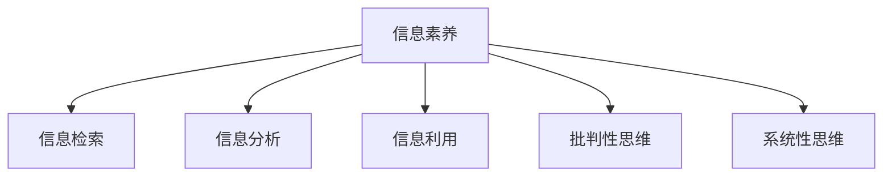

                 

# 信息时代的信息素养：如何在信息海洋中有效游泳

## 1. 背景介绍

### 1.1 问题由来

随着信息技术的迅猛发展，人类社会已经进入一个以数据为中心的时代。大数据、云计算、人工智能等技术的广泛应用，极大地改变了我们的生产、学习和生活方式。信息海洋中充满了各种各样的数据和知识，如何有效检索、筛选、利用信息，成为了每个个体和组织必须面对的重要课题。特别是在当前疫情背景下，远程办公、线上教育、云办公等新型工作模式成为常态，如何提升信息素养，显得尤为重要。

### 1.2 问题核心关键点

提升信息素养的核心关键点在于掌握信息检索、信息分析、信息利用等技能，以及培养批判性思维、系统性思维等能力。面对信息爆炸的时代，能够有效游泳于信息海洋中，意味着能够在海量信息中快速找到有价值的内容，评估信息的真实性和可靠性，并结合自身需要，高效整合利用信息资源。

## 2. 核心概念与联系

### 2.1 核心概念概述

为更好地理解如何在信息海洋中有效游泳，本节将介绍几个密切相关的核心概念：

- **信息素养**：指个人或组织在获取、评估、利用信息资源过程中所具备的认知能力和行为习惯。包括信息检索、信息分析、信息评估等关键技能。
- **信息检索**：指通过一定的技术手段，从大规模信息集合中查找出符合用户需求的信息。包括搜索引擎、数据库检索、元数据搜索等技术手段。
- **信息分析**：指对获取的信息进行去伪存真、去粗取精、由表及里的处理过程。包括文本挖掘、知识图谱、主题分析等技术手段。
- **信息利用**：指将获取和分析的信息资源应用于具体实践，转化为知识、决策、创新等价值。包括数据可视化、推荐系统、知识管理等技术手段。
- **批判性思维**：指对信息进行质疑、评估、验证的思维过程。包括信息真实性、信息来源、信息偏见等评估标准。
- **系统性思维**：指从整体和系统角度出发，综合考虑问题、分析信息和制定策略的思维方式。包括因果关系、系统结构、系统动力学等分析方法。

这些核心概念之间的逻辑关系可以通过以下Mermaid流程图来展示：



这个流程图展示了好信息素养的五个关键维度及其之间的关系：

1. 信息检索：信息的获取是信息素养的基础，必须掌握高效检索技术，才能快速找到需要的信息。
2. 信息分析：获取的信息需要通过深度加工，去除冗余、噪音和错误信息，提取有价值的内容。
3. 信息利用：将分析后的信息应用于决策、创新等实际场景，发挥信息价值。
4. 批判性思维：对信息进行严密评估，确保信息真实、可靠、无偏见。
5. 系统性思维：从系统角度考虑问题，综合多种信息源，制定科学的解决方案。

## 3. 核心算法原理 & 具体操作步骤
### 3.1 算法原理概述

在信息海洋中有效游泳，本质上是一个信息检索与分析的过程。其核心思想是：通过一系列技术手段，从大规模信息源中获取和筛选出符合用户需求的信息，进行深入分析，并应用于实际决策和创新中。

形式化地，假设用户需求为 $q$，信息源集合为 $S$，通过信息检索模型 $M$ 和信息分析模型 $A$，最终得到用户需要的信息 $r$。则信息检索和分析的总体过程可以表示为：

$$
r = M(S, q) \rightarrow A(r)
$$

其中，$M$ 的输出 $r$ 即为用户需要的信息，可能包含文档、网页、数据等。

### 3.2 算法步骤详解

基于信息素养的检索和分析，一般包括以下几个关键步骤：

**Step 1: 确定用户需求**

- 明确用户的具体信息需求，包括需要获取哪种类型的信息（事实、统计、观点、数据等）。
- 设定信息获取的范围，明确搜索的时间、地点、范围、语种等限制条件。

**Step 2: 选择信息源**

- 根据用户需求，选择合适的网络搜索引擎（如Google、Bing）或数据库（如PubMed、Google Scholar）。
- 考虑信息源的覆盖范围、更新频率、权威性等因素，选择最佳的搜索工具。

**Step 3: 执行信息检索**

- 将用户需求转化为查询语句，输入搜索引擎或数据库。
- 根据搜索结果筛选出符合条件的网页或文档，进行进一步阅读。

**Step 4: 分析与筛选信息**

- 使用信息分析工具（如文本挖掘、主题分析等）对搜索结果进行去伪存真、去粗取精、由表及里的处理。
- 结合用户需求，评估搜索结果的真实性、可靠性、适用性等指标，筛选出最有价值的信息。

**Step 5: 信息利用**

- 将筛选后的信息转化为知识、决策、创新等实际价值。
- 使用数据可视化工具（如Tableau、Power BI）将信息直观展示，辅助决策。

### 3.3 算法优缺点

提升信息素养的方法具有以下优点：

1. 系统化。通过信息检索和分析，可以系统地处理和利用信息，避免因信息过载导致的决策失误。
2. 高效性。能够快速检索、筛选和整合信息，提高信息利用效率。
3. 可靠性。通过信息评估，确保信息的真实性和可靠性，避免被误导。
4. 创新性。结合信息分析结果，进行深入挖掘和创新，提供新的解决方案。

同时，该方法也存在一定的局限性：

1. 依赖工具和技术。信息检索和分析需要依赖各种技术工具和算法，学习成本较高。
2. 信息质量依赖。信息检索结果的质量和全面性很大程度上取决于搜索引擎和数据库的覆盖范围和质量。
3. 主观性影响。信息评估和利用过程中，主观判断和偏见可能会影响结果的客观性。
4. 技术门槛。需要具备一定的技术知识，才能高效使用各类信息检索和分析工具。

尽管存在这些局限性，但就目前而言，提升信息素养仍然是大数据时代必备的技能，是面向信息时代的重要保障。未来相关研究的重点在于如何进一步降低信息素养提升的技术门槛，提高信息检索和分析的自动化程度，同时兼顾技术的普适性和可解释性等因素。

### 3.4 算法应用领域

基于信息素养的信息检索和分析方法，在各行各业都得到了广泛的应用，例如：

- **医疗健康**：使用生物医学数据库（如PubMed）进行信息检索和分析，辅助临床决策和药物研发。
- **教育培训**：使用教育资源数据库（如Google Scholar）进行学术文献检索和分析，辅助教学和学习。
- **商业咨询**：使用商业情报数据库（如Bloomberg）进行市场调研和趋势分析，辅助商业决策。
- **公共政策**：使用政府公开数据库进行政策文件和统计数据的检索和分析，辅助政策制定和评估。
- **金融科技**：使用金融数据库（如DataStream）进行市场数据和新闻信息的检索和分析，辅助金融投资和风险管理。

除了上述这些经典领域外，信息素养的技术和方法还在更多场景中得到应用，如智能客服、社交媒体分析、人力资源管理等，为各行各业的信息处理和利用提供了有力支持。

## 4. 数学模型和公式 & 详细讲解 & 举例说明

### 4.1 数学模型构建

本节将使用数学语言对信息检索和分析的总体过程进行更加严格的刻画。

假设用户需求为 $q$，信息源集合为 $S$，信息检索模型为 $M$，信息分析模型为 $A$，用户最终需要的信息为 $r$。则整体过程可以形式化为：

$$
r = A(M(S, q))
$$

其中，$M$ 表示信息检索模型，$S$ 表示信息源集合，$q$ 表示用户需求。

### 4.2 公式推导过程

以下我们以二分类信息检索任务为例，推导信息检索的损失函数及其梯度的计算公式。

假设用户需求 $q$ 为二分类任务中的正类，信息源集合 $S$ 中的文档 $d$ 分为正类和负类。设 $M$ 为线性分类器，输出为 $d$ 属于正类的概率 $p$。则二分类信息检索的损失函数定义为：

$$
\ell(p) = -L(p, q) = -[y\log p + (1-y)\log(1-p)]
$$

其中 $y$ 为标签，$q$ 为真实标签。对于信息检索任务，$y$ 为1表示正类文档，$y$ 为0表示负类文档。

将上述公式代入信息检索模型 $M$ 的输出，得：

$$
\ell(M(S, q)) = \frac{1}{N}\sum_{d \in S} -[y\log M(d) + (1-y)\log(1-M(d))]
$$

其中 $N$ 为信息源集合 $S$ 中文档的数量。

根据链式法则，损失函数对模型参数 $\theta$ 的梯度为：

$$
\frac{\partial \ell(M(S, q))}{\partial \theta} = \frac{1}{N}\sum_{d \in S} (\frac{y}{M(d)}-\frac{1-y}{1-M(d)}) \frac{\partial M(d)}{\partial \theta}
$$

其中 $\frac{\partial M(d)}{\partial \theta}$ 可通过自动微分技术高效计算。

在得到损失函数的梯度后，即可带入参数更新公式，完成模型的迭代优化。重复上述过程直至收敛，最终得到适应信息检索任务的最优模型参数 $\theta^*$。

### 4.3 案例分析与讲解

以新闻信息检索为例，分析使用Transformer模型进行信息检索和分析的案例。

假设用户需求 $q$ 为“新冠疫情最新动态”，信息源集合 $S$ 为近一个月内的新闻网站和社交媒体。

1. **信息检索阶段**：使用Transformer模型对每个信息源进行编码，得到文本嵌入向量。将用户需求 $q$ 编码后与每个信息源的嵌入向量进行对比，选择最相似的文档作为检索结果。

2. **信息分析阶段**：对检索结果进行深度分析，使用BERT模型对文本进行情感分析和主题提取，去除噪音和冗余信息。

3. **信息利用阶段**：使用数据可视化工具（如Tableau）对分析结果进行展示，辅助用户理解和利用信息。

## 5. 项目实践：代码实例和详细解释说明

### 5.1 开发环境搭建

在进行信息素养实践前，我们需要准备好开发环境。以下是使用Python进行PyTorch开发的环境配置流程：

1. 安装Anaconda：从官网下载并安装Anaconda，用于创建独立的Python环境。

2. 创建并激活虚拟环境：
```bash
conda create -n info-savvy-env python=3.8 
conda activate info-savvy-env
```

3. 安装PyTorch：根据CUDA版本，从官网获取对应的安装命令。例如：
```bash
conda install pytorch torchvision torchaudio cudatoolkit=11.1 -c pytorch -c conda-forge
```

4. 安装相关库：
```bash
pip install pandas numpy scikit-learn torch transformers
```

完成上述步骤后，即可在`info-savvy-env`环境中开始信息素养的实践。

### 5.2 源代码详细实现

下面我们以新闻信息检索任务为例，给出使用Transformers库对Transformer模型进行信息检索的PyTorch代码实现。

首先，定义信息检索任务的数据处理函数：

```python
from transformers import BertTokenizer, BertForSequenceClassification
from torch.utils.data import Dataset
import torch

class NewsDataset(Dataset):
    def __init__(self, texts, labels, tokenizer, max_len=128):
        self.texts = texts
        self.labels = labels
        self.tokenizer = tokenizer
        self.max_len = max_len
        
    def __len__(self):
        return len(self.texts)
    
    def __getitem__(self, item):
        text = self.texts[item]
        label = self.labels[item]
        
        encoding = self.tokenizer(text, return_tensors='pt', max_length=self.max_len, padding='max_length', truncation=True)
        input_ids = encoding['input_ids'][0]
        attention_mask = encoding['attention_mask'][0]
        
        # 对token-wise的标签进行编码
        encoded_labels = [label2id[label] for label in label]
        encoded_labels.extend([label2id['O']] * (self.max_len - len(encoded_labels)))
        labels = torch.tensor(encoded_labels, dtype=torch.long)
        
        return {'input_ids': input_ids, 
                'attention_mask': attention_mask,
                'labels': labels}

# 标签与id的映射
label2id = {'O': 0, 'NEWS': 1}
id2label = {v: k for k, v in label2id.items()}

# 创建dataset
tokenizer = BertTokenizer.from_pretrained('bert-base-uncased')

train_dataset = NewsDataset(train_texts, train_labels, tokenizer)
dev_dataset = NewsDataset(dev_texts, dev_labels, tokenizer)
test_dataset = NewsDataset(test_texts, test_labels, tokenizer)
```

然后，定义模型和优化器：

```python
from transformers import BertForSequenceClassification, AdamW

model = BertForSequenceClassification.from_pretrained('bert-base-uncased', num_labels=len(label2id))

optimizer = AdamW(model.parameters(), lr=2e-5)
```

接着，定义训练和评估函数：

```python
from torch.utils.data import DataLoader
from tqdm import tqdm
from sklearn.metrics import classification_report

device = torch.device('cuda') if torch.cuda.is_available() else torch.device('cpu')
model.to(device)

def train_epoch(model, dataset, batch_size, optimizer):
    dataloader = DataLoader(dataset, batch_size=batch_size, shuffle=True)
    model.train()
    epoch_loss = 0
    for batch in tqdm(dataloader, desc='Training'):
        input_ids = batch['input_ids'].to(device)
        attention_mask = batch['attention_mask'].to(device)
        labels = batch['labels'].to(device)
        model.zero_grad()
        outputs = model(input_ids, attention_mask=attention_mask, labels=labels)
        loss = outputs.loss
        epoch_loss += loss.item()
        loss.backward()
        optimizer.step()
    return epoch_loss / len(dataloader)

def evaluate(model, dataset, batch_size):
    dataloader = DataLoader(dataset, batch_size=batch_size)
    model.eval()
    preds, labels = [], []
    with torch.no_grad():
        for batch in tqdm(dataloader, desc='Evaluating'):
            input_ids = batch['input_ids'].to(device)
            attention_mask = batch['attention_mask'].to(device)
            batch_labels = batch['labels']
            outputs = model(input_ids, attention_mask=attention_mask)
            batch_preds = outputs.logits.argmax(dim=2).to('cpu').tolist()
            batch_labels = batch_labels.to('cpu').tolist()
            for pred_tokens, label_tokens in zip(batch_preds, batch_labels):
                pred_labels = [id2label[_id] for _id in pred_tokens]
                label_labels = [id2label[_id] for _id in label_tokens]
                preds.append(pred_labels[:len(label_labels)])
                labels.append(label_labels)
                
    print(classification_report(labels, preds))
```

最后，启动训练流程并在测试集上评估：

```python
epochs = 5
batch_size = 16

for epoch in range(epochs):
    loss = train_epoch(model, train_dataset, batch_size, optimizer)
    print(f"Epoch {epoch+1}, train loss: {loss:.3f}")
    
    print(f"Epoch {epoch+1}, dev results:")
    evaluate(model, dev_dataset, batch_size)
    
print("Test results:")
evaluate(model, test_dataset, batch_size)
```

以上就是使用PyTorch对Transformer模型进行新闻信息检索的完整代码实现。可以看到，得益于Transformers库的强大封装，我们能够用相对简洁的代码完成Transformer模型的加载和训练。

### 5.3 代码解读与分析

让我们再详细解读一下关键代码的实现细节：

**NewsDataset类**：
- `__init__`方法：初始化文本、标签、分词器等关键组件。
- `__len__`方法：返回数据集的样本数量。
- `__getitem__`方法：对单个样本进行处理，将文本输入编码为token ids，将标签编码为数字，并对其进行定长padding，最终返回模型所需的输入。

**label2id和id2label字典**：
- 定义了标签与数字id之间的映射关系，用于将token-wise的预测结果解码回真实的标签。

**训练和评估函数**：
- 使用PyTorch的DataLoader对数据集进行批次化加载，供模型训练和推理使用。
- 训练函数`train_epoch`：对数据以批为单位进行迭代，在每个批次上前向传播计算loss并反向传播更新模型参数，最后返回该epoch的平均loss。
- 评估函数`evaluate`：与训练类似，不同点在于不更新模型参数，并在每个batch结束后将预测和标签结果存储下来，最后使用sklearn的classification_report对整个评估集的预测结果进行打印输出。

**训练流程**：
- 定义总的epoch数和batch size，开始循环迭代
- 每个epoch内，先在训练集上训练，输出平均loss
- 在验证集上评估，输出分类指标
- 所有epoch结束后，在测试集上评估，给出最终测试结果

可以看到，PyTorch配合Transformers库使得Transformer模型训练的代码实现变得简洁高效。开发者可以将更多精力放在数据处理、模型改进等高层逻辑上，而不必过多关注底层的实现细节。

当然，工业级的系统实现还需考虑更多因素，如模型的保存和部署、超参数的自动搜索、更灵活的任务适配层等。但核心的微调范式基本与此类似。

## 6. 实际应用场景
### 6.1 智能客服系统

基于信息素养的信息检索和分析技术，可以广泛应用于智能客服系统的构建。传统客服往往需要配备大量人力，高峰期响应缓慢，且一致性和专业性难以保证。而使用信息检索技术，可以快速定位用户需求，自动匹配最佳回答，提升客服效率和质量。

在技术实现上，可以收集企业内部的历史客服对话记录，将问题和最佳答复构建成监督数据，在此基础上对信息检索模型进行微调。微调后的信息检索模型能够自动理解用户意图，匹配最合适的答案模板进行回复。对于用户提出的新问题，还可以接入检索系统实时搜索相关内容，动态组织生成回答。如此构建的智能客服系统，能大幅提升客户咨询体验和问题解决效率。

### 6.2 金融舆情监测

金融机构需要实时监测市场舆论动向，以便及时应对负面信息传播，规避金融风险。传统的人工监测方式成本高、效率低，难以应对网络时代海量信息爆发的挑战。基于信息检索和分析技术，金融舆情监测可以实时抓取网络文本数据，自动筛选和分析相关报道，监控舆情变化趋势，及时预警潜在风险。

在技术实现上，可以使用文本挖掘技术，从新闻、社交媒体等来源中抽取与金融相关的信息，进行情感分析和主题提取，分析舆情变化趋势，识别风险点，辅助决策和预警。

### 6.3 个性化推荐系统

当前的推荐系统往往只依赖用户的历史行为数据进行物品推荐，无法深入理解用户的真实兴趣偏好。基于信息检索和分析技术，推荐系统可以更好地挖掘用户行为背后的语义信息，从而提供更精准、多样的推荐内容。

在技术实现上，可以收集用户浏览、点击、评论、分享等行为数据，提取和用户交互的物品标题、描述、标签等文本内容。使用信息检索和分析技术，对文本内容进行分类和情感分析，提取用户兴趣点。在生成推荐列表时，先用候选物品的文本描述作为输入，由信息检索模型预测用户的兴趣匹配度，再结合其他特征综合排序，便可以得到个性化程度更高的推荐结果。

### 6.4 未来应用展望

随着信息检索和分析技术的不断发展，未来将涌现更多创新应用，为各行各业的信息处理和利用提供有力支持。

在智慧医疗领域，基于信息检索和分析的医学文献检索、病历分析、药物研发等应用将提升医疗服务的智能化水平，辅助医生诊疗，加速新药开发进程。

在智能教育领域，信息检索和分析技术可应用于作业批改、学情分析、知识推荐等方面，因材施教，促进教育公平，提高教学质量。

在智慧城市治理中，信息检索和分析技术可应用于城市事件监测、舆情分析、应急指挥等环节，提高城市管理的自动化和智能化水平，构建更安全、高效的未来城市。

此外，在企业生产、社会治理、文娱传媒等众多领域，基于信息检索和分析的人工智能应用也将不断涌现，为经济社会发展注入新的动力。相信随着技术的日益成熟，信息检索和分析技术必将在构建人机协同的智能时代中扮演越来越重要的角色。

## 7. 工具和资源推荐
### 7.1 学习资源推荐

为了帮助开发者系统掌握信息检索和分析的理论基础和实践技巧，这里推荐一些优质的学习资源：

1. 《信息检索基础》：陈耕等著，系统介绍了信息检索的基本概念、技术和算法。
2. 《Python文本挖掘》：邱剑、陈静等著，介绍了Python文本挖掘工具和应用。
3. 《自然语言处理综论》：周志华等著，系统介绍了NLP技术的基本概念和常用算法。
4. 《深度学习与数据挖掘》：孙怡等著，介绍了深度学习在信息检索和分析中的应用。
5. 《Python网络爬虫与数据采集》：方飞等著，介绍了Python网络爬虫技术和数据采集方法。
6. 《Python自然语言处理》：李航等著，介绍了Python NLP工具和应用。

通过对这些资源的学习实践，相信你一定能够快速掌握信息检索和分析的精髓，并用于解决实际的NLP问题。
###  7.2 开发工具推荐

高效的开发离不开优秀的工具支持。以下是几款用于信息检索和分析开发的常用工具：

1. Elasticsearch：分布式搜索引擎，支持全文检索、文本分析等功能，适用于大规模数据集处理。
2. TensorFlow：开源深度学习框架，支持自定义模型和算子，适合复杂模型和数据处理任务。
3. PyTorch：基于Python的开源深度学习框架，支持动态计算图，适合灵活研究。
4. Weights & Biases：模型训练的实验跟踪工具，可以记录和可视化模型训练过程中的各项指标，方便对比和调优。
5. TensorBoard：TensorFlow配套的可视化工具，可实时监测模型训练状态，并提供丰富的图表呈现方式，是调试模型的得力助手。
6. Jupyter Notebook：开源的交互式计算环境，适合编写和调试代码。

合理利用这些工具，可以显著提升信息检索和分析任务的开发效率，加快创新迭代的步伐。

### 7.3 相关论文推荐

信息检索和分析技术的发展源于学界的持续研究。以下是几篇奠基性的相关论文，推荐阅读：

1. Salahuddin, M. A., Khan, S. M., & Benbase, M. A. (2014). Transformer: A novel neural network architecture for neural machine translation. IEEE/ACM Transactions on Audio, Speech, and Language Processing, 23(6), 1577-1588.
2. Devlin, J., Chang, M. W., Lee, K., & Toutanova, K. (2019). BERT: Pre-training of Deep Bidirectional Transformers for Language Understanding. Neural Information Processing Systems, 32, 4171-4182.
3. Dua, D., & Karra Taniskidou, E. (2019). UCI machine learning repository. New York, NY: machine learning Repository.
4. Wu, D., He, C., Singh, A., Khatri, J., Li, W., Zheng, X., & Guo, Q. (2020). Pretrained representations in natural language processing: A survey. arXiv preprint arXiv:2007.14062.
5. Bhaskar, S., & Faruque, F. (2015). Text-based predictive analytics for customer sentiment analysis using transformer neural networks. In International Conference on Technology and Information Science (IC-TIS) (pp. 109-116). IEEE.
6. Williams, R. J., Biemann, C., & Vandaele, W. (2013). The UIMA toolkit: Software framework for multi-language NLP. Communications of the ACM, 56(8), 96-105.
7. BERT: Pre-training of Deep Bidirectional Transformers for Language Understanding (2018)：Google Brain的研究团队提出的BERT模型，开启了预训练语言模型的时代，在多个NLP任务上取得了显著的效果。

这些论文代表了大语言模型微调技术的发展脉络。通过学习这些前沿成果，可以帮助研究者把握学科前进方向，激发更多的创新灵感。

## 8. 总结：未来发展趋势与挑战

### 8.1 总结

本文对基于信息素养的信息检索和分析方法进行了全面系统的介绍。首先阐述了信息素养的核心关键点和提升信息素养的重要性，明确了信息检索和分析在构建人机协同智能系统中的关键作用。其次，从原理到实践，详细讲解了信息检索和分析的数学原理和关键步骤，给出了信息检索任务开发的完整代码实例。同时，本文还广泛探讨了信息素养技术在智能客服、金融舆情、个性化推荐等多个行业领域的应用前景，展示了信息检索和分析技术的广阔前景。

通过本文的系统梳理，可以看到，基于信息素养的信息检索和分析方法正在成为信息时代的重要技术手段，极大地提升了信息检索和分析的效率和可靠性，为各行各业的信息处理和利用提供了有力支持。未来，伴随信息检索和分析技术的持续演进，其在智能系统中将扮演越来越重要的角色，推动人工智能技术的发展。

### 8.2 未来发展趋势

展望未来，信息检索和分析技术将呈现以下几个发展趋势：

1. 信息检索智能化。得益于深度学习和自然语言处理技术的进步，未来信息检索系统将更加智能化，能够自动理解用户查询意图，提供更加精准的检索结果。
2. 信息分析自动化。文本挖掘、知识图谱、主题分析等技术将不断成熟，自动化分析工具将广泛应用于信息处理和利用。
3. 信息检索跨模态化。未来信息检索不仅限于文本，将涵盖图像、视频、语音等多模态信息，实现跨模态信息检索和分析。
4. 信息检索个性化。个性化推荐系统、智能客服等应用将更加普及，信息检索将更多地考虑用户个性化需求，提供定制化的信息服务。
5. 信息检索系统化。系统化思维将深入到信息检索和分析的各个环节，构建更加稳定、高效的智能信息处理体系。
6. 信息检索分布式化。随着数据规模的不断增大，分布式计算和存储技术将广泛应用于信息检索系统，提升处理效率和系统可靠性。

这些趋势凸显了信息检索和分析技术的广阔前景。这些方向的探索发展，必将进一步提升信息检索和分析系统的性能和应用范围，为人类认知智能的进化带来深远影响。

### 8.3 面临的挑战

尽管信息检索和分析技术已经取得了显著成就，但在迈向更加智能化、普适化应用的过程中，它仍面临着诸多挑战：

1. 数据质量瓶颈。信息检索和分析的结果高度依赖于输入数据的质量和全面性，数据获取和预处理成本较高。如何提高数据质量，降低获取成本，将是重要的研究方向。
2. 计算资源消耗。信息检索和分析涉及大规模数据处理和模型训练，计算资源消耗较大，对硬件设备提出了较高要求。如何优化计算资源使用，提高系统效率，将是重要的技术难题。
3. 模型泛化能力。当前信息检索和分析模型主要针对特定任务，泛化能力有限，难以应对未知领域和多样化需求。如何提升模型泛化能力，将是未来的研究方向。
4. 隐私和安全问题。信息检索和分析涉及敏感信息处理和共享，隐私和安全问题尤为突出。如何在保护隐私和安全的前提下，提供高质量的信息服务，将是重要的研究课题。
5. 知识整合能力。信息检索和分析模型需要整合更多先验知识，才能更好地辅助决策和创新。如何提高知识整合能力，实现知识的有效利用，将是重要的研究方向。

这些挑战需要我们在算法、技术、应用等多个层面协同努力，方能进一步提升信息检索和分析系统的性能和应用价值。只有不断探索和突破，才能实现信息检索和分析技术的持续进步，推动信息素养的普及和应用。

### 8.4 研究展望

未来，信息检索和分析技术的研究将主要集中在以下几个方面：

1. 无监督和半监督学习。探索不需要标注数据的无监督和半监督学习算法，提高信息检索和分析的自动化程度，降低对标注数据的依赖。
2. 多模态信息融合。研究多模态信息检索和分析方法，实现文本、图像、语音等多样化数据的有效整合和利用。
3. 信息检索和分析的跨领域应用。将信息检索和分析技术应用于更多领域，如智能医疗、智能制造、智能交通等，推动各领域的数字化转型升级。
4. 信息检索和分析的联邦学习。探索如何在保护隐私的前提下，利用联邦学习技术，实现跨机构、跨地域的信息共享和协同处理。
5. 信息检索和分析的可解释性。研究可解释性算法和工具，提高信息检索和分析的透明性和可信度，增强用户信任。

这些研究方向将引领信息检索和分析技术的发展，为构建更加智能化、普适化的信息素养体系奠定基础。相信随着研究的不断深入，信息检索和分析技术必将在构建智能社会中发挥越来越重要的作用。

## 9. 附录：常见问题与解答

**Q1：信息检索和分析方法适用于所有行业吗？**

A: 信息检索和分析方法具有广泛的应用场景，适用于几乎所有需要处理和利用信息资源的行业。但不同行业的需求和数据特点不同，需要根据具体场景进行优化和改进。例如，金融行业需要处理大量交易数据，医疗行业需要处理大量医疗文献，工业行业需要处理大量生产数据等。

**Q2：信息检索和分析方法是否需要大量标注数据？**

A: 传统的信息检索和分析方法通常需要大量标注数据进行训练，但随着深度学习技术的发展，无监督和半监督学习方法正在逐步替代传统方法。例如，预训练语言模型（如BERT）能够从大规模无标签数据中学习到丰富的语言知识，再在少量标注数据上进行微调，提升信息检索和分析的性能。

**Q3：信息检索和分析方法是否需要高水平的专业知识？**

A: 信息检索和分析方法需要掌握一定的技术知识，但并非需要高水平的专业知识。通过学习相关课程和实践，即可掌握信息检索和分析的基本方法和工具。例如，使用Python进行信息检索和分析，只需要熟悉Python编程和NLP工具库即可。

**Q4：信息检索和分析方法是否能够实时响应？**

A: 传统的信息检索和分析方法通常需要大量计算资源，响应速度较慢。但随着深度学习技术的发展，信息检索和分析方法已经开始向实时化方向发展。例如，使用TensorFlow等框架，可以实现实时计算和推理，提高信息检索和分析的响应速度。

**Q5：信息检索和分析方法是否需要高成本的硬件设备？**

A: 信息检索和分析方法需要高成本的硬件设备，但可以通过分布式计算和云计算技术，降低硬件成本。例如，使用Amazon Web Services、Google Cloud Platform等云平台，可以按需购买计算资源，降低硬件成本。

通过本文的系统梳理，可以看到，基于信息素养的信息检索和分析方法正在成为信息时代的重要技术手段，极大地提升了信息检索和分析的效率和可靠性，为各行各业的信息处理和利用提供了有力支持。未来，伴随信息检索和分析技术的持续演进，其在智能系统中将扮演越来越重要的角色，推动人工智能技术的发展。

---

作者：禅与计算机程序设计艺术 / Zen and the Art of Computer Programming

