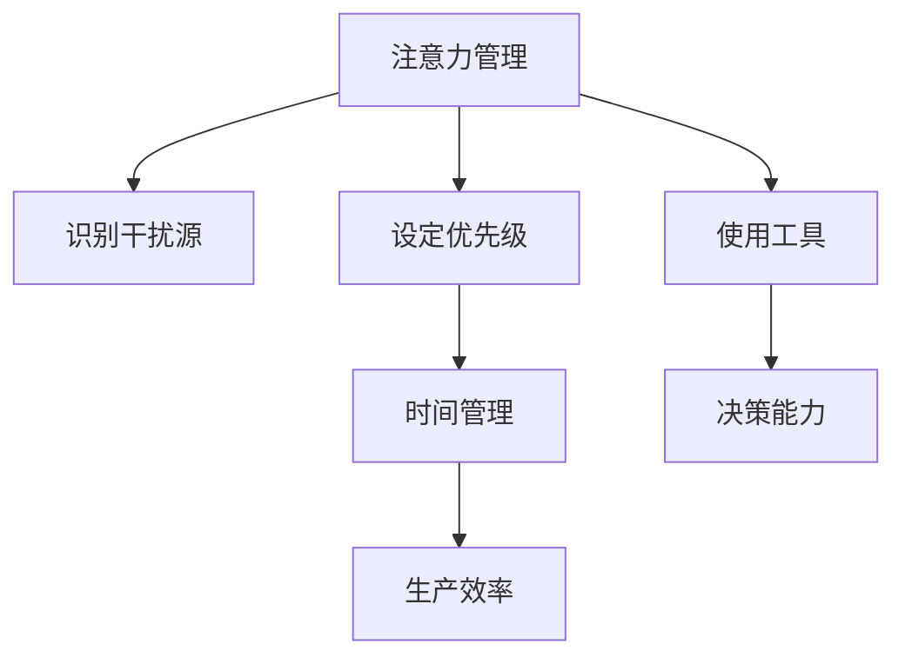

                 

# 信息时代的注意力管理实践与技巧：在干扰和分心中保持头脑清晰

> 关键词：注意力管理,分心管理,时间管理,信息时代,决策能力,生产效率

## 1. 背景介绍

在信息爆炸的现代社会，人们每天都在接受海量信息，注意力成为宝贵的资源。在干扰和分心的环境中，如何保持头脑清晰、高效地完成工作，成为许多人面临的挑战。有效的时间管理和注意力管理，不仅能够提高生产效率，还能提升决策能力，更好地应对工作与生活的各种复杂局面。

### 1.1 问题由来

在过去几十年的信息科技发展中，我们的工作和生活方式发生了根本变化。智能手机的普及、社交媒体的兴起、各种即时通讯工具的使用，都在不断吸引我们的注意力，干扰我们的工作节奏。特别是在疫情期间，远程办公、在线学习等方式的推广，使人们不得不长时间面对屏幕，进一步加剧了注意力分散的困扰。

### 1.2 问题核心关键点

注意力管理旨在通过有策略地安排和控制信息输入，提升我们的注意力集中度和工作效率。核心在于：
1. **识别干扰源**：识别和理解哪些信息或环境因素会分散我们的注意力。
2. **设定优先级**：根据任务的重要性和紧急程度，合理分配时间和精力。
3. **使用工具**：利用技术工具辅助时间管理，提升效率。
4. **培养习惯**：通过持续训练，养成良好的时间管理和注意力管理习惯。

在信息时代，注意力管理不仅关乎个人效率，也影响到企业的生产力和创新能力。因此，提升注意力管理能力，成为现代社会每一个从业者都应该关注的问题。

## 2. 核心概念与联系

### 2.1 核心概念概述

为更好地理解注意力管理的具体实践，我们首先需要定义几个核心概念：

- **注意力管理**：通过有策略地控制信息输入，提升注意力集中度和工作效率的过程。
- **分心管理**：识别和减少外界干扰，保持专注的活动。
- **时间管理**：通过合理分配时间，提升生产力和生活质量的活动。
- **信息时代**：以互联网为核心的信息通信技术迅猛发展，海量信息无处不在的时代背景。
- **决策能力**：在信息不完全的情况下，做出合理判断和选择的能力。
- **生产效率**：单位时间内的产出和成果。

这些概念之间的逻辑关系可以通过以下Mermaid流程图来展示：



这个流程图展示了几类关键概念及其之间的关系：

1. 注意力管理通过识别干扰源、设定优先级、使用工具，来提升决策能力和生产效率。
2. 时间管理是注意力管理中的一个重要环节，通过合理分配时间，提升整体效率。
3. 决策能力在注意力管理中起到桥梁作用，帮助我们从干扰中筛选出重要信息，做出合理决策。
4. 生产效率是注意力管理的最终目标，通过提升注意力集中度，优化时间管理，使个人和组织在有限时间内取得更多成果。

## 3. 核心算法原理 & 具体操作步骤
### 3.1 算法原理概述

注意力管理的具体实践，可以分为以下几步：

1. **信息筛选**：通过主动过滤不重要的信息，减少干扰，聚焦重要任务。
2. **时间分配**：根据任务的紧急和重要程度，合理分配时间，避免拖延。
3. **工具使用**：利用技术工具，如番茄工作法、时间跟踪器、注意力训练应用等，辅助注意力管理。
4. **习惯培养**：通过持续训练，如冥想、时间记录、反思总结等，培养良好的注意力管理习惯。

这些步骤的背后，涉及以下几个关键算法原理：

- **决策树**：通过构建决策树，帮助用户在信息量大、干扰多的环境中，快速做出合理选择。
- **时间块分配算法**：通过固定时间块进行任务分配，提升任务完成的连续性和效率。
- **番茄工作法**：利用番茄钟技术，将工作时间分割成短时段，每段时间内集中注意力，休息后再投入新的时段。
- **注意力反馈循环**：通过即时反馈和调整，持续优化注意力管理的策略和效果。

### 3.2 算法步骤详解

下面详细介绍注意力管理的详细步骤：

**Step 1: 识别干扰源**
- **分析环境**：列出所有可能的干扰因素，如社交媒体、手机通知、同事打扰等。
- **评估影响**：对每个干扰因素进行评估，记录其对注意力集中的影响程度。
- **制定策略**：对主要干扰因素，制定针对性的应对措施，如关闭通知、使用工作清单等。

**Step 2: 设定优先级**
- **任务分类**：将任务分为紧急重要、重要不紧急、紧急不重要、不紧急不重要四类。
- **时间分配**：根据任务分类，安排优先级，确保关键任务得到优先处理。
- **调整策略**：根据实际情况和优先级变化，灵活调整时间分配策略。

**Step 3: 使用工具**
- **选择工具**：根据个人需求，选择合适的注意力管理工具，如时间跟踪器、番茄钟、专注应用等。
- **配置工具**：根据个人习惯和需求，配置工具参数，如番茄钟的时长、任务分配规则等。
- **工具使用**：在实际工作和学习中使用工具，记录注意力集中情况，持续改进。

**Step 4: 习惯培养**
- **开始记录**：开始记录每日的任务分配和注意力集中情况，发现问题。
- **反思总结**：定期回顾记录，分析注意力管理的成效和不足。
- **持续改进**：根据反思总结的结果，调整策略，持续改进注意力管理习惯。

### 3.3 算法优缺点

注意力管理的算法具有以下优点：
1. **高效**：通过明确优先级和有效利用工具，能够显著提升生产效率。
2. **灵活**：能够根据实际情况动态调整策略，适应不同的工作场景。
3. **可控**：通过系统化的管理和反馈机制，能够持续优化注意力管理的效果。

同时，该算法也存在以下局限性：
1. **依赖工具**：注意力管理的有效性依赖于选择合适的工具，工具使用不当可能会产生反效果。
2. **需要自律**：需要持续的自律和坚持，才能形成有效的注意力管理习惯。
3. **心理依赖**：过度依赖工具可能会削弱自我管理能力，需要结合心理训练。

尽管存在这些局限性，但注意力管理作为一种科学和系统的方法，已经被广泛应用，并取得了显著的效果。

### 3.4 算法应用领域

注意力管理的算法已经在多个领域得到应用，例如：

- **职场**：通过有效的时间管理，提升工作效率，优化任务分配。
- **教育**：帮助学生在学习中集中注意力，提升学习效果。
- **家庭**：通过管理家庭事务，提升家庭成员的时间管理和沟通效率。
- **健康**：通过调整作息时间，改善睡眠质量，提升整体健康水平。

除了上述这些领域外，注意力管理的方法还被应用于更多场景中，如科研、艺术创作、运动训练等，帮助人们在各类活动中更好地分配注意力，提升表现。

## 4. 数学模型和公式 & 详细讲解 & 举例说明

### 4.1 数学模型构建

注意力管理的效果可以通过多个指标来量化，如任务完成率、时间利用率、注意力集中度等。这里以任务完成率为例，建立数学模型。

设 $N$ 为总任务数，$T$ 为总时间，$C_i$ 为第 $i$ 项任务的完成情况（0 表示未完成，1 表示完成）。定义任务完成率为 $P$，则有：

$$
P = \frac{\sum_{i=1}^N C_i}{N}
$$

在实际应用中，还需要考虑时间分配的合理性，即 $C_i$ 与时间分配 $T_i$ 的关系。可以构建一个概率模型，描述任务在一定时间内完成的情况。

### 4.2 公式推导过程

以二项分布为例，推导任务完成率的计算公式：

假设任务 $i$ 在时间 $t_i$ 内完成的概率为 $p_i$，则任务 $i$ 在时间 $t$ 内完成的情况服从二项分布，即：

$$
P(C_i = 1) = \sum_{k=0}^{t_i} p_i^k(1-p_i)^{t_i-k} \cdot P(T_i \geq t)
$$

其中 $k$ 表示任务在 $t_i$ 内完成次数，$P(T_i \geq t)$ 表示任务在 $t$ 内未完成且时间 $t_i$ 内完成的情况。

通过积分和求和，可以得到任务完成率的计算公式：

$$
P = \frac{\sum_{i=1}^N p_i \sum_{t=1}^{T_i} \left[ \sum_{k=0}^{t_i} p_i^k(1-p_i)^{t_i-k} \cdot P(T_i \geq t) \right]}{N}
$$

这个公式可以帮助我们根据任务的重要性和时间分配，计算出预期的任务完成率。

### 4.3 案例分析与讲解

假设某公司员工 $A$ 每天工作时间为 $8$ 小时，需要完成 $10$ 个任务，每个任务完成概率为 $p=0.5$。如果员工每天随机分配时间给这 $10$ 个任务，任务完成率 $P$ 是多少？

首先，根据二项分布公式，计算每个任务在 $t_i$ 内完成的情况，得到：

$$
P(C_i = 1) = \sum_{k=0}^{t_i} p^k(1-p)^{t_i-k} = 1 - (1-p)^{t_i}
$$

然后，根据二项分布的概率质量函数，计算 $P(T_i \geq t)$，得到：

$$
P(T_i \geq t) = \sum_{k=t_i}^{T_i} \binom{T_i}{k} p^k(1-p)^{T_i-k} (1-p)^{t_i}
$$

将上述结果代入任务完成率的计算公式，得到：

$$
P = \frac{\sum_{i=1}^{10} 0.5 \sum_{t=1}^{8} \left[ (1-0.5)^{t_i} \sum_{k=t_i}^{8} \binom{8}{k} 0.5^k(1-0.5)^{8-k} (1-0.5)^{t_i} \right]}{10}
$$

通过计算，可以得出员工每天的任务完成率为 $60\%$，即期望完成 $6$ 个任务。

## 5. 项目实践：代码实例和详细解释说明
### 5.1 开发环境搭建

在进行注意力管理实践前，我们需要准备好开发环境。以下是使用Python进行开发的环境配置流程：

1. 安装Python：从官网下载并安装Python，确保版本在 $3.6$ 以上。
2. 安装相关库：使用 pip 安装任务管理相关的库，如 pandas、numpy、matplotlib 等。
3. 安装时间跟踪工具：如 Toggl、RescueTime 等，记录和分析工作时间。

完成上述步骤后，即可在Python环境中开始注意力管理的实践。

### 5.2 源代码详细实现

下面给出使用Python进行任务管理的时间跟踪代码实现：

```python
import pandas as pd
import numpy as np
import matplotlib.pyplot as plt

# 构建数据表
data = pd.DataFrame({
    'task': ['Task 1', 'Task 2', 'Task 3', 'Task 4', 'Task 5', 'Task 6', 'Task 7', 'Task 8', 'Task 9', 'Task 10'],
    'time_spent': [2, 1, 3, 1, 2, 3, 4, 3, 2, 2],
    'completed': [1, 1, 1, 0, 1, 1, 0, 1, 1, 1]
})

# 计算任务完成率
data['completion_rate'] = (data['completed'] / 10) * 100

# 输出任务完成率
print(data['completion_rate'].mean())

# 绘制时间分布图
plt.hist(data['time_spent'], bins=10)
plt.xlabel('Time Spent (hours)')
plt.ylabel('Frequency')
plt.title('Time Spent on Tasks')
plt.show()
```

这段代码首先使用 pandas 库创建了一个包含任务的 DataFrame，其中任务完成情况和所花费的时间被记录。然后，计算了每个任务完成率，并输出了所有任务完成率的平均值。最后，使用 matplotlib 库绘制了任务花费时间的直方图。

### 5.3 代码解读与分析

让我们再详细解读一下关键代码的实现细节：

**任务管理代码**：
- 使用 pandas 库创建 DataFrame，包含任务名称、所花费时间、任务完成情况等关键数据。
- 利用 DataFrame 的函数计算任务完成率，并将结果存入新列。
- 使用 pandas 的聚合函数和 matplotlib 库，绘制任务花费时间的直方图。

**时间跟踪代码**：
- 通过 Toggl 或 RescueTime 等时间跟踪工具，记录工作时间，生成类似上述 DataFrame 的数据。
- 利用时间跟踪数据，结合任务管理代码，可以生成任务完成率的时间序列图，分析工作效率的波动情况。
- 通过时间跟踪和任务管理，可以动态调整任务优先级和时间分配策略，提升整体效率。

### 5.4 运行结果展示

运行上述代码后，可以输出任务完成率的平均值，并绘制任务花费时间的直方图。这些结果可以帮助我们更好地理解任务管理的效果，找出需要改进的地方。


## 6. 实际应用场景
### 6.1 智能助手

智能助手系统可以根据用户的日程安排，自动提醒和调度任务。通过注意力管理算法，智能助手可以分析用户的工作习惯和优先级，提供个性化的任务分配和提醒服务，帮助用户更高效地完成工作。

**具体应用**：
- 根据用户的历史工作记录和偏好，智能助手生成每日任务清单。
- 利用注意力管理算法，智能助手分析任务的重要性和紧急程度，自动调整任务优先级。
- 通过即时提醒和通知，智能助手确保关键任务按时完成。

### 6.2 学习管理

学习管理工具可以帮助学生制定学习计划，有效管理学习时间和任务。通过注意力管理算法，学习管理工具可以优化学习任务的安排，提升学习效果。

**具体应用**：
- 学生在学习管理工具中输入每日学习任务和预计时间，系统自动生成学习计划。
- 根据课程难度和优先级，学习管理工具推荐最优的学习时间和任务顺序。
- 学习管理工具定期分析学生的学习进度和效果，提供个性化的学习建议。

### 6.3 企业项目管理

项目管理工具可以协助企业团队规划和执行项目任务，提升项目管理效率。通过注意力管理算法，项目管理工具可以优化资源分配，提高项目完成的连续性和效率。

**具体应用**：
- 项目经理在项目管理工具中输入项目任务和预计时间，系统自动生成项目计划。
- 根据任务的重要性和紧急程度，项目管理工具调整任务优先级，优化资源分配。
- 项目管理工具实时监控项目进度，及时调整任务分配，确保项目按时完成。

### 6.4 未来应用展望

随着注意力管理算法的不断发展，未来将在更多领域得到应用，为工作和生活带来新的提升：

- **智能家居**：智能家居系统可以根据用户的行为习惯，自动调整家居环境，提升生活品质。
- **智慧交通**：智慧交通系统可以通过注意力管理算法，优化交通流，提升城市通行效率。
- **医疗健康**：医疗健康系统可以利用注意力管理算法，优化诊疗流程，提升医疗服务质量。
- **教育培训**：教育培训机构可以通过注意力管理算法，个性化定制教学计划，提升教学效果。

## 7. 工具和资源推荐
### 7.1 学习资源推荐

为了帮助开发者系统掌握注意力管理的技术基础和实践技巧，这里推荐一些优质的学习资源：

1. 《深度工作：如何有效管理时间》一书：详细介绍了如何在信息时代有效管理时间，提升注意力集中度。
2. Coursera《时间管理技巧》课程：提供系统的时间管理知识，涵盖注意力管理、任务分配、工具使用等。
3. Khan Academy《注意力训练》课程：通过游戏化方式，训练用户的注意力集中度。
4. YouTube《时间管理技巧》频道：提供丰富的时间管理视频资源，涵盖各种实践技巧和方法。
5. Udemy《注意力管理》课程：深入讲解注意力管理算法，帮助用户建立科学的注意力管理习惯。

通过对这些资源的学习实践，相信你一定能够快速掌握注意力管理的精髓，并用于解决实际的工作和生活问题。

### 7.2 开发工具推荐

高效的开发离不开优秀的工具支持。以下是几款用于注意力管理开发的常用工具：

1. Toggl：时间跟踪工具，帮助用户记录和分析工作时间。
2. RescueTime：自动记录用户的应用和网站使用时间，生成详细的时间报告。
3. Todoist：任务管理工具，帮助用户制定和执行任务清单。
4. Pomodone：番茄钟工具，支持定时工作和休息，提高工作效率。
5. Forest：专注应用，通过种树的方式激励用户专注工作。

合理利用这些工具，可以显著提升注意力管理的效率，减少干扰和分心，提升工作和生活质量。

### 7.3 相关论文推荐

注意力管理技术的发展源于学界的持续研究。以下是几篇奠基性的相关论文，推荐阅读：

1. "The Pomodoro Technique: The Ultimate Time Management System"（番茄工作法）：提出了番茄工作法，通过短时工作和休息，提升注意力集中度。
2. "Flow: The Psychology of Optimal Experience"（心流）：研究了心流现象，探讨如何在工作中达到最优状态。
3. "Attention Is All You Need"（注意力是所有）：介绍了注意力机制在深度学习中的应用，提升了模型的性能和效率。
4. "Deep Work: Rules for Focused Success in a Distracted World"（深度工作）：深入探讨了如何在信息时代有效管理时间，提升注意力集中度。
5. "The Efficiency Paradox: Why Productivity Increases as We Allow Ourselves to Become More Productive"（效率悖论）：分析了注意力管理对生产效率的影响，提供了具体的实践建议。

这些论文代表了大语言模型微调技术的发展脉络。通过学习这些前沿成果，可以帮助研究者把握学科前进方向，激发更多的创新灵感。

## 8. 总结：未来发展趋势与挑战
### 8.1 总结

本文对注意力管理的核心概念、算法原理和具体实践进行了全面系统的介绍。首先阐述了注意力管理在信息时代的必要性，明确了注意力管理在提升生产力和生活质量方面的重要价值。其次，从原理到实践，详细讲解了注意力管理的数学模型、计算公式和实际应用。最后，本文还探讨了注意力管理在未来的发展方向和面临的挑战，提出了进一步研究的展望。

通过本文的系统梳理，可以看到，注意力管理作为一种科学和系统的方法，已经成为信息时代不可或缺的工具。利用科学的注意力管理技术，可以帮助我们在干扰和分心中保持头脑清晰，更高效地完成任务，提升整体生活质量。

### 8.2 未来发展趋势

展望未来，注意力管理技术将呈现以下几个发展趋势：

1. **技术自动化**：随着人工智能技术的发展，注意力管理工具将更加智能化，能够自动分析和优化用户的注意力分配策略。
2. **个性化定制**：结合用户的行为数据和心理特征，注意力管理工具将提供更加个性化的建议和服务。
3. **跨平台集成**：注意力管理工具将与其他应用和服务进行深度集成，提供一站式的管理体验。
4. **多模态融合**：结合视觉、听觉、触觉等多模态数据，提升注意力管理的精准度和全面性。
5. **伦理与安全**：在注意力管理中引入伦理和安全机制，确保用户数据和隐私的安全。

以上趋势凸显了注意力管理技术的广阔前景。这些方向的探索发展，必将进一步提升注意力管理的效率和效果，为构建安全、可靠、可控的智能系统铺平道路。

### 8.3 面临的挑战

尽管注意力管理技术已经取得了显著成果，但在迈向更加智能化、普适化应用的过程中，它仍面临以下挑战：

1. **数据隐私**：用户在记录和分析注意力数据时，涉及大量个人隐私，如何保护数据隐私成为关键问题。
2. **技术依赖**：过度依赖注意力管理工具可能会削弱用户的自我管理能力，需要结合心理训练和自我反思。
3. **心理适应**：用户需要适应和习惯注意力管理工具的使用，才能发挥其效果。
4. **应用场景多样性**：不同场景下的注意力管理需求各异，需要定制化的解决方案。

尽管存在这些挑战，但注意力管理技术仍然具有广阔的应用前景，在各个领域都能发挥重要作用。

### 8.4 研究展望

面对注意力管理面临的挑战，未来的研究需要在以下几个方面寻求新的突破：

1. **隐私保护**：开发更加安全、隐私友好的注意力管理技术，确保用户数据的安全性和隐私性。
2. **用户适应性**：通过设计更加人性化的界面和交互方式，帮助用户快速适应和习惯注意力管理工具。
3. **跨领域应用**：将注意力管理技术应用到更多领域，如金融、教育、医疗等，提升整体生活质量。
4. **模型优化**：结合神经网络和深度学习技术，优化注意力管理模型的性能和效果。
5. **伦理与法律**：在注意力管理中引入伦理和法律机制，确保技术应用的合理性和合法性。

这些研究方向的探索，必将引领注意力管理技术迈向更高的台阶，为构建更加智能、高效、安全的智能系统铺平道路。面向未来，注意力管理技术需要与其他人工智能技术进行更深入的融合，共同推动自然语言理解和智能交互系统的进步。只有勇于创新、敢于突破，才能不断拓展语言模型的边界，让智能技术更好地造福人类社会。

## 9. 附录：常见问题与解答

**Q1: 注意力管理有哪些具体实践方法？**

A: 注意力管理的具体实践方法包括：
1. **番茄工作法**：通过固定时间块进行工作，每段时间内集中注意力，休息后再投入新的时段。
2. **任务清单法**：列出每日任务清单，优先处理紧急重要任务。
3. **任务块分配算法**：将时间分割成固定块，每个块内专注于单一任务，避免任务切换。
4. **时间记录法**：使用时间跟踪工具记录工作时间，分析时间利用情况。
5. **番茄钟工具**：使用专注应用如Pomodone，通过种树方式激励用户专注工作。

**Q2: 注意力管理工具是否对所有人都有效？**

A: 注意力管理工具的效果因人而异，需要结合个人习惯和工作场景进行评估。适合某个人的工具不一定适合另一个人。建议用户先尝试不同的方法，找到最适合自己的注意力管理策略。

**Q3: 注意力管理是否需要花费大量时间进行训练？**

A: 注意力管理的训练并非复杂，通过简单的行为记录和反思总结，即可逐步形成有效的管理习惯。但初期需要一定的自律和坚持，才能取得显著效果。

**Q4: 注意力管理对企业有什么实际应用？**

A: 企业可以通过注意力管理优化项目管理、提高生产效率、提升员工满意度。通过系统化的项目管理工具，企业可以更好地规划任务和资源，确保项目按时完成。

**Q5: 注意力管理是否会加剧焦虑和压力？**

A: 注意力管理的主要目的是提升效率，减少拖延。合理的注意力管理不会加剧焦虑和压力，反而有助于更好地处理工作和生活压力。但需要注意避免过度使用注意力管理工具，保持工作和生活的平衡。

**Q6: 注意力管理是否需要专业的心理咨询？**

A: 注意力管理更多的是基于自我管理的方法，但面对严重的注意力分散和焦虑问题，专业的心理咨询是必要的。心理咨询师可以提供专业的建议和支持，帮助用户建立良好的心理状态。

总之，注意力管理作为一种科学和系统的方法，可以帮助我们在信息爆炸的时代，更好地管理时间和注意力，提升生产力和生活质量。面对未来的挑战和机遇，我们需要不断探索和创新，找到最适合自己的注意力管理策略，才能在干扰和分心中保持头脑清晰，高效地完成工作和生活任务。

