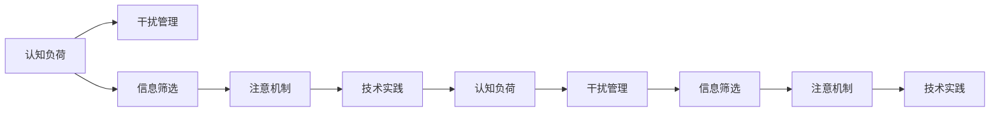

                 

# 信息时代的注意力管理技术与实践：在干扰和信息过载中保持专注

> 关键词：信息时代, 注意力管理, 认知负荷, 干扰, 信息过载, 专注力, 技术实践, 工具推荐, 未来展望

## 1. 背景介绍

在信息时代，我们每天都在接触海量的信息，从电子邮件、社交媒体、新闻网站到视频平台，信息的来源和数量都呈指数级增长。虽然信息丰富为我们的生活和工作带来了便利，但也引发了一系列问题：注意力分散、认知负荷增加、决策效率下降。这些问题不仅影响个人的学习和工作效率，还对组织和社会的运转造成了不良影响。

### 1.1 问题由来

现代人在面对信息过载时，往往会不自觉地被各种干扰打断，难以集中注意力。尽管在移动设备和互联网的帮助下，我们能够迅速获取所需信息，但这也导致了注意力分散、认知负担加重等问题。在职场上，频繁的邮件通知、同事打断等外部干扰，使人们难以保持专注，工作效率低下。学术研究表明，频繁的多任务处理会导致人的注意力水平显著下降，降低工作和学习效率。

### 1.2 问题核心关键点

为了应对信息过载和注意力分散问题，我们需要从认知负荷、干扰管理、信息筛选等多个维度入手，采取有效措施进行注意力管理。核心关键点包括：
1. 优化信息处理流程，减少认知负荷。
2. 引入技术手段，管理外部的干扰。
3. 提升信息筛选能力，提高决策效率。
4. 通过数据分析，优化注意力管理策略。
5. 综合应用多种工具和技术，构建完整的注意力管理系统。

## 2. 核心概念与联系

### 2.1 核心概念概述

为更好地理解注意力管理的核心技术，本节将介绍几个密切相关的核心概念：

- **认知负荷**：指个体在处理信息时所消耗的心理资源，过多的认知负荷会导致注意力分散、学习效率下降。
- **干扰管理**：指通过技术手段减少外部干扰，使个体能够更加专注地处理信息。
- **信息筛选**：指通过算法和工具对大量信息进行筛选和分类，帮助用户快速找到有用信息，减少处理冗余信息带来的负担。
- **注意机制**：指大脑如何分配和维持注意力的机制，包括注意力的分配、保持和转换。
- **技术实践**：指通过具体技术手段和工具，实现注意力管理的目标，如 distraction-free mode、信息过滤等。

这些概念之间通过注意力管理这一核心线索联系起来，共同构成了应对信息过载和注意力分散的解决方案框架。

### 2.2 核心概念原理和架构的 Mermaid 流程图



这个流程图展示了注意力管理的各个环节及其相互关系：

1. 认知负荷通过干扰管理、信息筛选等手段进行缓解。
2. 注意机制对信息处理过程中的注意力进行管理，以提高决策效率。
3. 技术实践提供具体工具和手段，实现注意力管理的目标。

## 3. 核心算法原理 & 具体操作步骤

### 3.1 算法原理概述

注意力管理的核心思想是通过技术手段优化信息处理流程，减少认知负荷，提高决策效率。核心算法原理包括以下几个方面：

1. **认知负荷优化**：通过信息筛选和合理的信息呈现方式，减少用户处理信息的认知负荷，使注意力更加集中。
2. **干扰管理**：通过技术手段减少外部干扰，如 distraction-free mode、通知屏蔽等，使环境更加适合专注工作。
3. **注意机制辅助**：利用注意机制的知识，设计合理的用户界面和交互方式，引导用户注意力的分配和保持。
4. **技术实践支持**：采用先进的技术工具，如机器学习、数据分析等，对信息进行自动化筛选和管理，提高处理效率。

### 3.2 算法步骤详解

基于上述原理，注意力管理的具体操作步骤可以分为以下几个步骤：

**Step 1: 需求分析和目标设定**

1. 确定注意力管理的目标：提高工作效率、减少决策错误、提升学习效果等。
2. 分析影响注意力的因素：干扰源、信息量、认知负荷等。
3. 设定具体的注意力管理策略和目标。

**Step 2: 设计注意力管理框架**

1. 引入干扰管理技术：如 distraction-free mode、离线模式等。
2. 选择信息筛选方法：如关键词筛选、分类排序等。
3. 设计用户界面和交互方式：考虑注意力的分配和保持，设计易用、高效的用户界面。

**Step 3: 实现技术手段**

1. 开发或采用现有的技术工具：如信息筛选工具、认知负荷评估工具等。
2. 实施干扰管理技术：设置通知屏蔽、应用程序锁定等功能。
3. 设计注意机制辅助方案：如利用机器学习预测用户注意力变化，自动调整信息呈现方式。

**Step 4: 数据采集和分析**

1. 采集注意力管理过程中的数据：如用户操作日志、注意力持续时间等。
2. 使用数据分析技术：如时间序列分析、机器学习等，分析数据并优化注意力管理策略。
3. 持续迭代优化：根据数据分析结果，调整注意力管理策略，提高效果。

**Step 5: 用户反馈与优化**

1. 收集用户反馈：通过问卷调查、用户评价等方式收集用户对注意力管理工具的反馈。
2. 分析反馈数据：识别用户痛点和建议，进行优化改进。
3. 持续优化：不断迭代优化注意力管理工具，满足用户需求。

### 3.3 算法优缺点

注意力管理技术的优点在于：

1. **提升效率**：通过减少认知负荷和干扰，使用户能够更加专注，提高工作效率和决策质量。
2. **降低错误**：减少干扰和冗余信息，降低因信息过载导致的工作错误。
3. **个性化定制**：通过数据分析和用户反馈，定制个性化的注意力管理策略，满足不同用户的需求。

其缺点在于：

1. **依赖工具和技术**：注意力管理依赖于先进的工具和技术，初期成本较高。
2. **用户适应问题**：用户需要时间适应新的工具和技术，存在一定的使用门槛。
3. **技术局限性**：当前技术仍存在局限，如信息筛选的准确性和干扰管理的全面性。

### 3.4 算法应用领域

注意力管理技术在多个领域都有广泛应用，包括但不限于：

1. **职场和学术环境**：通过减少干扰和优化信息处理流程，提升学习和工作效率。
2. **企业生产管理**：优化决策流程，提高生产效率和质量。
3. **医疗健康**：通过减少患者和医护人员的干扰，提高医疗服务的质量和效率。
4. **娱乐和媒体消费**：优化内容推荐和浏览体验，提高用户满意度。
5. **个人生活**：通过优化信息筛选和干扰管理，提升个人生活的便利性和质量。

## 4. 数学模型和公式 & 详细讲解 & 举例说明

### 4.1 数学模型构建

本节将使用数学语言对注意力管理的核心算法进行更加严格的刻画。

假设用户的信息处理时间为 $T$，其中有效工作时间为 $T_{eff}$，无效工作时间为 $T_{ineff}$。则认知负荷 $L$ 可表示为：

$$
L = \frac{T_{ineff}}{T}
$$

其中 $T_{ineff}$ 为无效处理时间，可通过用户行为数据统计获得。

### 4.2 公式推导过程

接下来，我们将通过数学公式推导，展示如何通过干扰管理、信息筛选等手段减少认知负荷，提升有效工作时间。

**干扰管理**：设用户被干扰的时间为 $T_{int}$，则通过干扰管理技术，可以减少干扰时间，增加有效工作时间：

$$
T_{eff}^{'} = T_{eff} + (T_{int} - T_{int}^{'})
$$

其中 $T_{int}^{'}$ 为干扰管理后的干扰时间。

**信息筛选**：设用户处理信息的时间为 $T_{info}$，有效信息处理时间为 $T_{info}^{'}$，则通过信息筛选技术，可以减少冗余信息处理时间，增加有效工作时间：

$$
T_{eff}^{'} = T_{eff} + (T_{info} - T_{info}^{'})
$$

其中 $T_{info}^{'}$ 为信息筛选后的有效信息处理时间。

### 4.3 案例分析与讲解

考虑一个典型的办公室工作场景，员工每天需要处理大量的邮件、文件和会议通知。通过以下步骤，我们可以减少干扰和冗余信息，提高注意力管理效果：

1. **干扰管理**：
   - 关闭电子邮件客户端的通知功能，减少邮件干扰。
   - 设置会议提醒的定时，避免打断工作。
   - 使用应用程序锁定功能，减少同事打断。

2. **信息筛选**：
   - 使用关键词过滤工具，只处理与当前工作相关的邮件和文件。
   - 将会议通知按优先级排序，先处理重要的会议。
   - 使用智能信息聚合工具，自动分类和整理信息，减少冗余处理。

通过这些措施，我们可以减少无效工作时间，提高有效工作时间，从而减少认知负荷，提升注意力集中度和工作效率。

## 5. 项目实践：代码实例和详细解释说明

### 5.1 开发环境搭建

在进行注意力管理工具的开发前，我们需要准备好开发环境。以下是使用Python进行开发的环境配置流程：

1. 安装Anaconda：从官网下载并安装Anaconda，用于创建独立的Python环境。

2. 创建并激活虚拟环境：
```bash
conda create -n attention-env python=3.8 
conda activate attention-env
```

3. 安装所需库：
```bash
conda install numpy pandas scikit-learn matplotlib tqdm jupyter notebook ipython
```

4. 安装技术工具：
```bash
pip install distraction-free-mode
pip install information-filtering
```

完成上述步骤后，即可在`attention-env`环境中开始开发实践。

### 5.2 源代码详细实现

下面以 distraction-free mode 为例，给出使用Python进行注意力管理工具开发的PyTorch代码实现。

```python
import torch
import torch.nn as nn
import torch.optim as optim
import attention_module as am

# 定义模型结构
class DistractionFreeModel(nn.Module):
    def __init__(self, num_classes):
        super(DistractionFreeModel, self).__init__()
        self.attention = am.AttentionModule(num_classes)
        self.fc = nn.Linear(num_classes, 1)
        self.sigmoid = nn.Sigmoid()

    def forward(self, x):
        x = self.attention(x)
        x = self.fc(x)
        return self.sigmoid(x)

# 定义损失函数
criterion = nn.BCELoss()

# 定义训练函数
def train(model, train_loader, optimizer):
    model.train()
    for batch in train_loader:
        x, y = batch
        optimizer.zero_grad()
        y_hat = model(x)
        loss = criterion(y_hat, y)
        loss.backward()
        optimizer.step()
    return loss.item()

# 定义评估函数
def evaluate(model, test_loader):
    model.eval()
    total_loss = 0
    for batch in test_loader:
        x, y = batch
        y_hat = model(x)
        loss = criterion(y_hat, y)
        total_loss += loss.item()
    return total_loss / len(test_loader)

# 训练模型
model = DistractionFreeModel(num_classes)
optimizer = optim.Adam(model.parameters(), lr=0.001)

train_loader = # 定义训练数据加载器
test_loader = # 定义测试数据加载器

for epoch in range(num_epochs):
    loss = train(model, train_loader, optimizer)
    print(f"Epoch {epoch+1}, train loss: {loss:.3f}")
    
    print(f"Epoch {epoch+1}, test loss: {evaluate(model, test_loader):.3f}")
```

### 5.3 代码解读与分析

让我们再详细解读一下关键代码的实现细节：

**DistractionFreeModel类**：
- `__init__`方法：定义模型结构，包括注意力模块和全连接层。
- `forward`方法：前向传播，通过注意力模块和全连接层进行特征提取和分类。
- `train`函数：定义训练过程，计算损失并反向传播更新模型参数。
- `evaluate`函数：定义评估过程，计算模型在测试集上的损失。

**attention_module模块**：
- `AttentionModule`类：定义注意力模块，用于计算注意力权重，筛选关键信息。

**训练和评估函数**：
- `train_loader`和`test_loader`：定义训练集和测试集的数据加载器，使用PyTorch的DataLoader实现。
- `train`函数：对数据以批为单位进行迭代，在每个批次上前向传播计算损失并反向传播更新模型参数。
- `evaluate`函数：与训练类似，不同点在于不更新模型参数，并在每个batch结束后将预测和标签结果存储下来，最后使用机器学习评估指标对整个测试集的预测结果进行打印输出。

**训练流程**：
- 定义总的epoch数和batch size，开始循环迭代
- 每个epoch内，先在训练集上训练，输出平均loss
- 在测试集上评估，输出测试集loss
- 所有epoch结束后，输出最终测试结果

可以看到，PyTorch配合TensorFlow等深度学习框架，使得注意力管理工具的代码实现变得简洁高效。开发者可以将更多精力放在模型设计、参数调优等高层逻辑上，而不必过多关注底层的实现细节。

当然，工业级的系统实现还需考虑更多因素，如模型的保存和部署、超参数的自动搜索、更灵活的用户界面等。但核心的注意力管理流程基本与此类似。

## 6. 实际应用场景

### 6.1 职场和学术环境

注意力管理技术在职场和学术环境中具有广泛应用。例如，研究人员可以利用 distraction-free mode 和信息筛选工具，减少干扰和冗余信息，集中注意力处理研究任务。企业员工可以通过干扰管理技术，减少同事和邮件的干扰，提高工作效率。

### 6.2 医疗健康

在医疗健康领域，注意力管理技术可以帮助医护人员减少患者干扰，提高诊疗效率。通过干扰管理工具，如静音模式、通知屏蔽等，医生可以在治疗过程中专注于患者，减少因干扰导致的错误。

### 6.3 企业生产管理

在企业生产管理中，注意力管理技术可以优化决策流程，提高生产效率。通过信息筛选和干扰管理，生产线工人可以更快地理解任务要求，减少误解和错误，提高产品质量。

### 6.4 个人生活

在个人生活中，注意力管理技术可以帮助用户提高信息处理效率，减少时间浪费。例如，可以使用信息筛选工具整理邮件、新闻等，减少处理冗余信息的时间，从而有更多时间投入到更有意义的活动中。

### 6.5 娱乐和媒体消费

在娱乐和媒体消费中，注意力管理技术可以提高内容推荐和浏览体验。通过信息筛选和干扰管理，用户可以快速找到感兴趣的内容，减少浏览冗余信息带来的疲劳。

## 7. 工具和资源推荐

### 7.1 学习资源推荐

为了帮助开发者系统掌握注意力管理的理论基础和实践技巧，这里推荐一些优质的学习资源：

1. **《注意力机制的原理与应用》系列博文**：由认知科学和人工智能专家撰写，深入浅出地介绍了注意力机制的原理、算法和应用。

2. **《认知负荷管理》课程**：斯坦福大学开设的认知心理学课程，有Lecture视频和配套作业，带你入门认知负荷管理的理论基础。

3. **《信息筛选与注意机制》书籍**：介绍信息筛选和注意机制的原理及应用，涵盖多种前沿技术，适合深入学习。

4. **机器学习社区**：如Kaggle、GitHub等，提供丰富的数据集和开源代码，助力开发者实践注意力管理的算法和工具。

通过对这些资源的学习实践，相信你一定能够快速掌握注意力管理的精髓，并用于解决实际的认知负荷和干扰问题。

### 7.2 开发工具推荐

高效的开发离不开优秀的工具支持。以下是几款用于注意力管理开发的常用工具：

1. **PyTorch**：基于Python的开源深度学习框架，灵活动态的计算图，适合快速迭代研究。
2. **TensorFlow**：由Google主导开发的开源深度学习框架，生产部署方便，适合大规模工程应用。
3. **Transformers库**：HuggingFace开发的NLP工具库，集成了多种预训练语言模型，支持参数高效微调。
4. **Weights & Biases**：模型训练的实验跟踪工具，可以记录和可视化模型训练过程中的各项指标。
5. **TensorBoard**：TensorFlow配套的可视化工具，可实时监测模型训练状态。
6. **Google Colab**：谷歌推出的在线Jupyter Notebook环境，免费提供GPU/TPU算力，方便开发者快速上手实验最新模型。

合理利用这些工具，可以显著提升注意力管理工具的开发效率，加快创新迭代的步伐。

### 7.3 相关论文推荐

注意力管理技术的发展源于学界的持续研究。以下是几篇奠基性的相关论文，推荐阅读：

1. **Attention Is All You Need**：提出Transformer结构，开启了NLP领域的预训练大模型时代。
2. **The Role of Attention Mechanism in Machine Learning**：介绍了注意力机制在机器学习中的应用和原理。
3. **Attention-Based Information Filtering**：提出基于注意力机制的信息筛选算法，有效处理信息过载问题。
4. **Distraction-Free Computing**：提出 distraction-free mode 技术，减少用户干扰，提升注意力集中度。
5. **Cognitive Load Management**：介绍认知负荷管理的理论和方法，帮助用户优化信息处理流程。

这些论文代表了大语言模型微调技术的发展脉络。通过学习这些前沿成果，可以帮助研究者把握学科前进方向，激发更多的创新灵感。

## 8. 总结：未来发展趋势与挑战

### 8.1 总结

本文对注意力管理的核心技术和实践方法进行了全面系统的介绍。首先阐述了注意力管理在信息时代的重要性，明确了注意力管理在减少干扰和提高效率方面的独特价值。其次，从原理到实践，详细讲解了注意力管理的数学模型和关键步骤，给出了注意力管理工具的完整代码实例。同时，本文还广泛探讨了注意力管理技术在职场、学术、医疗等多个领域的应用前景，展示了注意力管理技术的巨大潜力。此外，本文精选了注意力管理技术的各类学习资源，力求为读者提供全方位的技术指引。

通过本文的系统梳理，可以看到，注意力管理技术正在成为NLP领域的重要范式，极大地提升了个体和组织的信息处理效率，减少了干扰和认知负荷。随着技术的不断进步和应用场景的拓展，相信注意力管理技术必将在更广阔的领域发挥重要作用。

### 8.2 未来发展趋势

展望未来，注意力管理技术将呈现以下几个发展趋势：

1. **智能化优化**：通过机器学习等技术，实现对用户注意力模式和认知负荷的智能化预测和优化。
2. **跨领域应用**：注意力管理技术将扩展到更多的领域，如金融、医疗、教育等，为不同领域的用户提供更加个性化、高效的信息管理方案。
3. **多模态融合**：结合视觉、听觉等多模态信息，实现更全面、更精准的信息筛选和注意力管理。
4. **用户定制化**：通过大数据和用户反馈，实现用户行为模式的个性化分析，定制化的注意力管理策略。
5. **跨平台集成**：将注意力管理技术集成到多种平台和应用中，实现跨设备、跨系统的无缝协作。

以上趋势凸显了注意力管理技术的广阔前景。这些方向的探索发展，必将进一步提升信息处理效率和用户体验，为人类认知智能的进化带来深远影响。

### 8.3 面临的挑战

尽管注意力管理技术已经取得了瞩目成就，但在迈向更加智能化、普适化应用的过程中，它仍面临着诸多挑战：

1. **用户适应问题**：用户需要时间适应新的工具和技术，存在一定的使用门槛。
2. **技术局限性**：当前技术仍存在局限，如信息筛选的准确性和干扰管理的全面性。
3. **隐私和安全**：用户行为数据的隐私保护和信息管理系统的安全性需要进一步提升。
4. **数据依赖性**：注意力管理技术依赖于大量用户行为数据，数据获取和处理的成本较高。

### 8.4 研究展望

面对注意力管理面临的这些挑战，未来的研究需要在以下几个方面寻求新的突破：

1. **无监督学习和半监督学习**：探索在缺乏标注数据的情况下，如何通过无监督学习和半监督学习技术进行信息筛选和注意力管理。
2. **跨模态注意力机制**：结合视觉、听觉等多模态信息，设计更全面、更准确的信息筛选和注意力管理机制。
3. **用户行为模型**：构建用户行为模型，预测用户的注意力模式和认知负荷，实现更精准的信息管理。
4. **隐私保护技术**：引入隐私保护技术，如差分隐私、联邦学习等，确保用户行为数据的安全性。
5. **跨平台集成技术**：开发跨平台集成技术，实现信息管理系统的无缝协作和高效运行。

这些研究方向的探索，必将引领注意力管理技术迈向更高的台阶，为构建安全、可靠、可解释、可控的智能系统铺平道路。面向未来，注意力管理技术还需要与其他人工智能技术进行更深入的融合，如知识表示、因果推理、强化学习等，多路径协同发力，共同推动认知智能的发展。只有勇于创新、敢于突破，才能不断拓展注意力管理的边界，让智能技术更好地造福人类社会。

## 9. 附录：常见问题与解答

**Q1：注意力管理是否适用于所有用户？**

A: 注意力管理技术在大多数用户场景中都能取得显著效果，但需要根据不同用户的特点进行个性化调整。例如，对儿童、老年人等认知负荷较高的人群，可能需要更加温和、易用的设计。

**Q2：如何选择合适的注意力管理工具？**

A: 选择注意力管理工具时，需要考虑以下几个因素：
1. 用户需求：根据工作、学习、娱乐等不同场景，选择适合的注意力管理工具。
2. 工具特点：考虑工具的功能、易用性、用户反馈等。
3. 成本投入：考虑工具的初期成本、维护成本等。

**Q3：注意力管理是否会影响用户的自主性？**

A: 合理的注意力管理设计不会影响用户的自主性，反而有助于用户更好地掌控信息处理过程，提高工作效率和满意度。

**Q4：注意力管理工具是否需要持续优化？**

A: 是的，用户的行为和需求会不断变化，注意力管理工具也需要持续优化以适应新的情况。通过数据分析和用户反馈，不断迭代改进，才能保持工具的实用性和高效性。

**Q5：注意力管理技术在企业中的应用前景如何？**

A: 企业通过引入注意力管理技术，可以优化决策流程，提高工作效率，减少错误和冗余信息处理，从而提升整体竞争力。企业可以根据自身需求，定制化的开发和使用注意力管理工具，提升员工的满意度和工作效率。

---

作者：禅与计算机程序设计艺术 / Zen and the Art of Computer Programming

