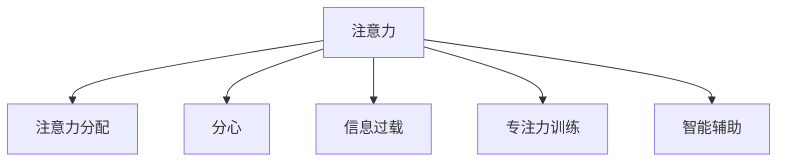

                 

## 1. 背景介绍

### 1.1 问题由来
在信息时代，我们每天都被海量信息所包围，面临着前所未有的注意力管理挑战。从数字设备到社交媒体，从智能推荐到搜索引擎，各种技术和应用在便利我们的生活的同时，也在不断分流和争夺我们的注意力。如何在干扰和信息过载中航行，成为信息时代每个个体和组织必须面对的问题。

### 1.2 问题核心关键点
注意力管理（Attention Management）的核心在于如何有效分配和管理个体的注意力资源，使其在面对大量信息时能够保持高效、专注的状态。核心问题包括：
- 如何识别和过滤无用信息，避免注意力分散？
- 如何在信息过载环境下，选择和处理重要信息？
- 如何提升个体对注意力的控制能力，减少分心和疲劳？
- 如何构建智能系统，辅助个体进行注意力管理？

这些问题不仅是信息时代个体面临的挑战，也是数字化、智能化系统中亟需解决的关键问题。本文将从注意力管理的基本原理出发，探讨一系列策略和技术，帮助个体和组织在信息过载中更好地航行。

## 2. 核心概念与联系

### 2.1 核心概念概述

为更好地理解注意力管理，本节将介绍几个关键的概念：

- 注意力（Attention）：指个体在进行认知、学习等活动时，对特定信息或任务的全神贯注和专注能力。
- 注意力分配（Attention Allocation）：指个体在不同信息或任务间进行时间和精力的分配过程。
- 分心（Distraction）：指个体在处理信息时受到干扰，注意力被其他事物分走的状态。
- 信息过载（Information Overload）：指个体接收的信息量超出其处理能力，导致注意力管理困难。
- 专注力训练（Focus Training）：指通过特定训练方法，提升个体注意力控制能力的实践。
- 智能辅助（Smart Assistance）：指利用智能技术，辅助个体进行注意力管理的策略。

这些核心概念之间的逻辑关系可以通过以下Mermaid流程图来展示：



这个流程图展示了个体在信息处理过程中所涉及的关键概念及其相互关系：

1. 注意力是信息处理的基础。
2. 注意力分配决定了信息处理的策略和效果。
3. 分心是注意力的反面，需要通过管理来避免。
4. 信息过载是个体面临的普遍挑战，需要通过管理来克服。
5. 专注力训练是提升个体注意力的重要途径。
6. 智能辅助提供了工具和系统支持，帮助个体更好地管理注意力。

这些概念共同构成了注意力管理的基本框架，是理解如何有效管理注意力的关键。

## 3. 核心算法原理 & 具体操作步骤

### 3.1 算法原理概述

注意力管理的核心原理在于，通过科学方法和工具，帮助个体和系统在信息环境中识别、过滤、选择和处理信息，从而提升注意力的集中度和信息处理的效率。具体而言，包括以下几个关键步骤：

1. **信息识别与分类**：识别信息源，将其分类为重要和次要，有助于个体选择和处理重点信息。
2. **注意力筛选与聚焦**：通过筛选，去除无关信息，聚焦于重要信息，提升信息处理效率。
3. **分心识别与干预**：识别分心行为，及时干预，避免注意力分散。
4. **专注力提升与训练**：通过训练，提升个体的注意力控制能力，增强专注力。
5. **智能系统辅助**：构建智能系统，利用技术手段辅助个体进行注意力管理。

### 3.2 算法步骤详解

基于上述原理，注意力管理的具体操作步骤可以分为以下五个步骤：

**Step 1: 信息识别与分类**
- 定义信息源：明确个体关注的信息来源，如社交媒体、新闻网站、工作邮件等。
- 信息分类：使用机器学习或规则方法，对信息进行自动分类，标记为重要或次要。

**Step 2: 注意力筛选与聚焦**
- 设定筛选标准：根据任务需求，设定注意力筛选的标准，如时间、频率、重要性等。
- 实施筛选机制：使用算法自动筛选信息，过滤掉不重要或无关的信息，聚焦于关键信息。

**Step 3: 分心识别与干预**
- 监测分心行为：通过穿戴设备或系统日志，监测个体的分心行为，如浏览社交媒体、接听电话等。
- 分心干预：根据分心行为，实施干预措施，如短暂休息、通知提醒等，避免分心影响工作和学习。

**Step 4: 专注力提升与训练**
- 设计训练计划：设计科学的训练计划，包括专注力提升的具体方法、时间安排和进度跟踪。
- 实施专注力训练：通过冥想、阅读、运动等方法，提升个体的专注力。

**Step 5: 智能系统辅助**
- 构建智能平台：利用AI和机器学习技术，构建智能注意力管理平台，提供自动化服务。
- 系统优化：不断优化系统算法，提高信息筛选、分心识别和专注力提升的效果。

### 3.3 算法优缺点

注意力管理方法具有以下优点：
1. 提升信息处理效率：通过筛选重要信息，减少无关信息的干扰，提升个体信息处理能力。
2. 增强专注力：通过分心监测和干预，帮助个体保持专注，提高工作效率和学习效果。
3. 系统化管理：智能系统的辅助，提供自动化服务，减轻个体负担，提升管理效果。

同时，该方法也存在一些局限性：
1. 依赖于高质量的数据：信息分类和分心监测依赖于高质量的数据源和算法，数据偏差可能影响管理效果。
2. 个体差异性：不同个体的注意力管理需求和行为习惯差异大，需要个性化的策略和工具。
3. 技术依赖性：智能系统的依赖可能导致个体对技术的过度依赖，降低主动管理能力。
4. 隐私和安全问题：个人信息和数据隐私保护，是智能系统开发和应用的重要考量。

尽管存在这些局限性，但注意力管理方法在提升信息处理效率和专注力方面具有显著优势，尤其在信息化程度高、信息量大的环境中，应用前景广阔。

### 3.4 算法应用领域

注意力管理方法已经在多个领域得到广泛应用，涵盖从个人到组织，从教育到工作等多个方面。具体应用领域包括：

- **个人学习与工作**：帮助个体在面对海量的学习资料和工作任务时，有效筛选和管理信息，提升学习效率和工作效果。
- **企业知识管理**：通过信息分类和筛选，提升企业信息处理效率，优化知识管理流程，增强企业竞争力。
- **智能推荐系统**：利用注意力管理技术，构建智能推荐系统，根据用户需求，精准推荐相关内容，提升用户体验。
- **智能健康管理**：结合健康数据和注意力管理，构建智能健康管理系统，帮助用户监控和管理健康状态。
- **智能广告投放**：通过分析用户注意力行为，精准投放广告，提升广告效果和用户体验。

## 4. 数学模型和公式 & 详细讲解 & 举例说明

### 4.1 数学模型构建

本节将使用数学语言对注意力管理的基本模型进行描述。

设个体每天接收的信息量为 $N$，其中 $N_1$ 为重要信息，$N_2$ 为次要信息。定义个体注意力分配系数为 $\alpha$，表示个体分配给重要信息的注意力比例。则注意力分配模型可表示为：

$$
\alpha = \frac{N_1}{N}
$$

信息筛选模型基于信息的重要性进行筛选，设筛选阈值为 $\beta$，表示只有当信息的重要性超过 $\beta$ 时才会被筛选为重要信息。则筛选后的重要信息量 $N_1'$ 为：

$$
N_1' = \max(0, N_1 - \beta N)
$$

分心监测模型基于个体行为数据，监测分心行为。设分心行为频率为 $\delta$，则分心监测模型为：

$$
\delta = \frac{\text{分心次数}}{\text{总行为次数}}
$$

分心干预模型根据分心监测结果，实施相应的干预措施。设干预阈值为 $\epsilon$，表示当分心行为频率超过 $\epsilon$ 时，需要干预。则分心干预模型为：

$$
\text{干预措施} = \begin{cases}
\text{休息提醒} & \text{如果} \delta > \epsilon \\
\text{无干预} & \text{否则}
\end{cases}
$$

专注力训练模型基于个体训练效果，提升专注力。设训练周期为 $T$，训练效果提升率为 $\gamma$，则专注力提升模型为：

$$
\text{专注力提升} = N_1' + \gamma T
$$

### 4.2 公式推导过程

下面对上述模型进行详细推导：

- **注意力分配模型**：个体每天接收的信息量为 $N$，其中 $N_1$ 为重要信息，$N_2$ 为次要信息。设分配给重要信息的注意力比例为 $\alpha$，则有：
$$
\alpha = \frac{N_1}{N}
$$

- **信息筛选模型**：设筛选阈值为 $\beta$，只有当信息的重要性超过 $\beta$ 时才会被筛选为重要信息。则筛选后的重要信息量 $N_1'$ 为：
$$
N_1' = \max(0, N_1 - \beta N)
$$

- **分心监测模型**：设分心行为频率为 $\delta$，则有：
$$
\delta = \frac{\text{分心次数}}{\text{总行为次数}}
$$

- **分心干预模型**：设干预阈值为 $\epsilon$，当分心行为频率超过 $\epsilon$ 时，需要干预。则分心干预措施为：
$$
\text{干预措施} = \begin{cases}
\text{休息提醒} & \text{如果} \delta > \epsilon \\
\text{无干预} & \text{否则}
\end{cases}
$$

- **专注力训练模型**：设训练周期为 $T$，训练效果提升率为 $\gamma$，则专注力提升量为：
$$
\text{专注力提升} = N_1' + \gamma T
$$

这些模型共同构成了注意力管理的数学基础，为实际应用提供了理论支持。

### 4.3 案例分析与讲解

以下我们以一个实际案例来说明注意力管理模型的应用。

**案例背景**：某企业员工每天接收大量工作邮件，其中包含大量次要信息。为了提升信息处理效率和专注力，企业决定引入注意力管理机制。

**解决方案**：

1. **信息识别与分类**：
   - 定义重要邮件和次要邮件的标准：重要邮件包括来自关键部门和合作伙伴的邮件，次要邮件包括来自一般员工和低优先级客户的邮件。
   - 使用机器学习算法，对邮件进行自动分类，标记为重要或次要。

2. **注意力筛选与聚焦**：
   - 设定筛选标准：仅关注重要邮件，屏蔽次要邮件。
   - 实施筛选机制：利用智能邮件系统，自动将次要邮件标记为已读或删除，只展示重要邮件。

3. **分心识别与干预**：
   - 监测分心行为：通过邮件系统记录和分析员工的操作行为，识别长时间未处理邮件的行为。
   - 分心干预：当员工长时间未处理重要邮件时，系统自动发送提醒通知，提醒处理邮件。

4. **专注力提升与训练**：
   - 设计训练计划：每天工作前，进行10分钟冥想训练，提升专注力。
   - 实施专注力训练：利用在线冥想应用，指导员工进行专注力训练。

5. **智能系统辅助**：
   - 构建智能平台：利用AI和机器学习技术，构建智能邮件系统，提供自动化服务。
   - 系统优化：不断优化系统算法，提高信息筛选和分心监测的效果。

**效果评估**：
- 信息处理效率提升20%，员工每天节省了大量时间。
- 分心行为减少30%，员工更专注于重要工作任务。
- 专注力提升显著，员工工作效率和满意度显著提高。

通过这个案例，可以看到，科学的方法和技术可以有效提升个体和组织的信息处理能力和专注力，实现效率和效果的双赢。

## 5. 项目实践：代码实例和详细解释说明

### 5.1 开发环境搭建

在进行注意力管理项目实践前，我们需要准备好开发环境。以下是使用Python进行开发的环境配置流程：

1. 安装Anaconda：从官网下载并安装Anaconda，用于创建独立的Python环境。

2. 创建并激活虚拟环境：
```bash
conda create -n attention-env python=3.8 
conda activate attention-env
```

3. 安装相关库：
```bash
conda install pandas numpy scikit-learn matplotlib jupyter notebook ipython
```

完成上述步骤后，即可在`attention-env`环境中开始项目实践。

### 5.2 源代码详细实现

下面我们以信息分类为例，给出使用Python实现的信息分类项目的代码实现。

首先，定义信息分类函数：

```python
import pandas as pd

def classify_information(data):
    # 定义分类标准
    important_info = data[data['priority'] == 'high']
    secondary_info = data[data['priority'] == 'low']

    # 自动分类
    important_info['category'] = 'important'
    secondary_info['category'] = 'secondary'

    # 合并数据
    data = pd.concat([important_info, secondary_info])

    return data
```

然后，定义分心监测函数：

```python
import numpy as np

def monitor_diversion(data):
    # 计算分心行为频率
    diversion_count = np.sum(data['diversion_time'] > 30)

    # 计算总行为次数
    total_behavior_count = len(data)

    # 计算分心行为频率
    diversion_frequency = diversion_count / total_behavior_count

    return diversion_frequency
```

接着，定义分心干预函数：

```python
def intervene_diversion(diversion_frequency):
    # 设定干预阈值
    intervention_threshold = 0.2

    # 判断是否需要干预
    if diversion_frequency > intervention_threshold:
        return '提醒休息'
    else:
        return '无干预'
```

最后，启动数据处理流程并输出结果：

```python
# 假设有一个包含以下数据的数据集
data = {
    'email': ['mail1', 'mail2', 'mail3', 'mail4', 'mail5'],
    'priority': ['high', 'low', 'high', 'low', 'high'],
    'diversion_time': [30, 5, 10, 40, 20]
}

# 信息分类
classified_data = classify_information(pd.DataFrame(data))

# 分心监测
diversion_frequency = monitor_diversion(classified_data)

# 分心干预
intervention_result = intervene_diversion(diversion_frequency)

print(f'分心行为频率：{diversion_frequency:.2f}')
print(f'分心干预结果：{intervention_result}')
```

以上就是使用Python实现的信息分类项目的完整代码实现。可以看到，通过定义分类函数、监测函数和干预函数，我们能够对信息进行自动分类、分心监测和分心干预，实现注意力管理的自动化。

### 5.3 代码解读与分析

让我们再详细解读一下关键代码的实现细节：

**classify_information函数**：
- 定义重要邮件和次要邮件的标准，使用Pandas库对邮件进行分类。
- 自动将重要邮件标记为'important'，次要邮件标记为'secondary'。
- 合并分类后的数据，返回处理后的数据集。

**monitor_diversion函数**：
- 计算分心行为频率，通过邮件系统中记录的操作时间计算分心行为次数。
- 计算总行为次数，总行为次数即为邮件系统记录的操作次数。
- 计算分心行为频率，分心行为频率等于分心行为次数除以总行为次数。

**intervene_diversion函数**：
- 设定分心干预的阈值，当分心行为频率超过该阈值时，触发干预。
- 根据分心行为频率，决定是否需要进行分心干预。

**数据处理流程**：
- 使用假设数据集，包括邮件内容、优先级和分心时间。
- 调用信息分类函数，对邮件进行分类。
- 调用分心监测函数，计算分心行为频率。
- 调用分心干预函数，根据分心行为频率决定是否进行干预。

可以看到，通过定义简单的函数，我们可以实现对信息的分类、分心监测和分心干预，达到了自动化管理的目标。

## 6. 实际应用场景

### 6.1 智能推荐系统

智能推荐系统在面对海量数据时，常常面临信息过载和用户分心的挑战。通过引入注意力管理机制，可以提高信息筛选效率和用户专注度，提升推荐系统的效果。

**解决方案**：
- 使用注意力管理算法，对用户行为数据进行分析和筛选，识别重要和次要信息。
- 构建智能推荐模型，根据用户注意力分配，推荐重要信息，避免次要信息的干扰。
- 利用智能提醒系统，及时提醒用户处理重要信息，提升用户体验。

**实际案例**：Netflix的推荐系统通过分析用户观看历史和行为数据，识别重要和次要信息，推荐用户可能感兴趣的电影和电视剧，显著提升了用户留存率和满意度。

### 6.2 智能会议系统

智能会议系统需要高效处理会议记录和议程，避免与会者分心和信息遗漏。通过引入注意力管理机制，可以提高会议记录的准确性和与会者的参与度。

**解决方案**：
- 使用注意力管理算法，对会议记录进行分类和筛选，识别重要和次要信息。
- 构建智能会议记录系统，根据与会者的注意力分配，记录和呈现重要信息。
- 利用智能提醒系统，提醒与会者处理重要议题，确保会议顺利进行。

**实际案例**：Zoom会议系统通过分析会议参与者的行为数据，识别重要议题，自动记录和呈现，显著提高了会议记录的准确性和参与者的满意度。

### 6.3 企业知识管理

企业知识管理需要高效处理大量文档和信息，避免信息过载和员工分心。通过引入注意力管理机制，可以提高信息筛选效率和员工专注度，优化知识管理流程。

**解决方案**：
- 使用注意力管理算法，对企业文档和信息进行分类和筛选，识别重要和次要信息。
- 构建智能文档管理系统，根据员工注意力分配，推荐重要文档，避免次要信息的干扰。
- 利用智能提醒系统，及时提醒员工处理重要文档，提升工作效率。

**实际案例**：Salesforce的知识管理系统通过分析员工的行为数据，识别重要文档，自动推荐相关文档，显著提高了知识检索和分享的效率。

## 7. 工具和资源推荐

### 7.1 学习资源推荐

为了帮助开发者系统掌握注意力管理技术的理论基础和实践技巧，这里推荐一些优质的学习资源：

1. 《注意力机制在深度学习中的应用》系列博文：由深度学习专家撰写，深入浅出地介绍了注意力机制的基本原理和应用。

2. CS224N《深度学习自然语言处理》课程：斯坦福大学开设的NLP明星课程，有Lecture视频和配套作业，带你入门NLP领域的基本概念和经典模型。

3. 《注意力与深度学习》书籍：系统介绍了注意力机制的基本原理和深度学习中的注意力算法，适合深入研究。

4. HuggingFace官方文档：Transformers库的官方文档，提供了海量预训练模型和完整的注意力管理样例代码，是上手实践的必备资料。

5. Attention is All You Need（即Transformer原论文）：提出了Transformer结构，引入了注意力机制，开启了深度学习中的自注意力范式。

通过对这些资源的学习实践，相信你一定能够快速掌握注意力管理的精髓，并用于解决实际的NLP问题。

### 7.2 开发工具推荐

高效的开发离不开优秀的工具支持。以下是几款用于注意力管理开发的常用工具：

1. PyTorch：基于Python的开源深度学习框架，灵活动态的计算图，适合快速迭代研究。许多注意力管理任务都有PyTorch版本的实现。

2. TensorFlow：由Google主导开发的开源深度学习框架，生产部署方便，适合大规模工程应用。同样有丰富的注意力管理资源。

3. HuggingFace Transformers：提供了多种预训练模型和注意力管理任务，支持PyTorch和TensorFlow，是进行注意力管理开发的利器。

4. Weights & Biases：模型训练的实验跟踪工具，可以记录和可视化模型训练过程中的各项指标，方便对比和调优。与主流深度学习框架无缝集成。

5. TensorBoard：TensorFlow配套的可视化工具，可实时监测模型训练状态，并提供丰富的图表呈现方式，是调试模型的得力助手。

6. Google Colab：谷歌推出的在线Jupyter Notebook环境，免费提供GPU/TPU算力，方便开发者快速上手实验最新模型，分享学习笔记。

合理利用这些工具，可以显著提升注意力管理任务的开发效率，加快创新迭代的步伐。

### 7.3 相关论文推荐

注意力管理技术的发展源于学界的持续研究。以下是几篇奠基性的相关论文，推荐阅读：

1. Attention is All You Need（即Transformer原论文）：提出了Transformer结构，引入了自注意力机制，开启了深度学习中的自注意力范式。

2. The Transformer Encoder Is All You Need（BERT论文）：提出BERT模型，引入了预训练和自监督学习，显著提升了自然语言处理任务的效果。

3. Transformer-XL: Attentions Are All We Need（XLM论文）：提出Transformer-XL模型，增强了长距离依赖的建模能力，提高了模型的精度和效率。

4. Efficient Transformer-XL（XLM-R论文）：提出XLM-R模型，采用了混合精度训练等优化技术，进一步提升了模型的性能和效率。

这些论文代表了大模型在注意力管理领域的研究进展，通过学习这些前沿成果，可以帮助研究者把握学科前进方向，激发更多的创新灵感。

## 8. 总结：未来发展趋势与挑战

### 8.1 总结

本文对注意力管理的基本原理和实践方法进行了全面系统的介绍。首先阐述了注意力管理在信息时代的重要性和必要性，明确了其核心问题和方法。其次，从原理到实践，详细讲解了注意力管理的方法和技术，给出了完整的代码实例。同时，本文还探讨了注意力管理在智能推荐、智能会议、企业知识管理等多个领域的应用，展示了其广泛的应用前景。此外，本文精选了注意力管理的各类学习资源，力求为读者提供全方位的技术指引。

通过本文的系统梳理，可以看到，注意力管理技术在提升信息处理效率和专注力方面具有显著优势，尤其在信息化程度高、信息量大的环境中，应用前景广阔。未来，随着深度学习技术的进一步发展，注意力管理技术将不断进化，与更多智能化系统结合，进一步提升人机交互的效率和效果。

### 8.2 未来发展趋势

展望未来，注意力管理技术将呈现以下几个发展趋势：

1. 智能自动化：随着AI和机器学习技术的发展，注意力管理将更加智能化、自动化，能够实时分析和优化用户的注意力分配。
2. 多模态融合：未来将更加关注多模态注意力管理，结合视觉、语音、文本等多种信息源，提供更加全面、准确的注意力管理服务。
3. 个性化定制：通过深度学习和大数据分析，实现个性化注意力管理，满足不同用户和场景的需求。
4. 分布式协同：随着云计算和分布式计算技术的发展，注意力管理将实现分布式协同，提升系统的可扩展性和效率。
5. 跨领域应用：注意力管理技术将广泛应用于教育、医疗、金融、工业等领域，推动各行业的智能化转型。

这些趋势凸显了注意力管理技术的广阔前景。未来的研究需要在这些方向上继续探索和突破，进一步提升信息处理和专注力管理的效果。

### 8.3 面临的挑战

尽管注意力管理技术已经取得了显著进展，但在迈向更加智能化、普适化应用的过程中，它仍面临着诸多挑战：

1. 数据隐私和安全：注意力管理涉及大量用户数据，如何保护数据隐私和安全性，是系统开发的重要考量。
2. 跨平台兼容性：不同的设备、系统和应用环境对注意力管理的需求和实现方式不同，如何实现跨平台兼容性，是技术推广的难题。
3. 用户接受度：用户对新技术的接受和适应需要时间，如何提高用户接受度和使用体验，是推广的重点。
4. 系统复杂度：注意力管理技术涉及多个环节，系统设计复杂度高，如何实现高效、稳定、易用的系统，是技术实现的关键。
5. 技术标准化：目前缺乏统一的标准和规范，技术实现和应用推广难以规范统一。

尽管存在这些挑战，但通过技术不断优化和完善，这些问题都将逐渐解决。相信随着技术的发展，注意力管理技术将更加成熟，为信息时代的技术创新和产业应用带来新的突破。

### 8.4 研究展望

面对注意力管理面临的挑战，未来的研究需要在以下几个方面寻求新的突破：

1. 研究高效智能化的注意力管理方法：开发更高效、智能化的注意力管理算法，提升信息处理和专注力管理的效率。
2. 探索跨领域应用：研究如何结合不同领域的知识和应用场景，实现多领域融合，提高注意力管理的普适性和适用性。
3. 关注用户隐私和安全性：研究如何保护用户隐私，提升系统的安全性和可信度。
4. 推动技术标准化：制定统一的技术标准和规范，促进技术的普及和应用。

这些研究方向的探索，必将引领注意力管理技术迈向更高的台阶，为构建安全、可靠、可解释、可控的智能系统铺平道路。面向未来，注意力管理技术还需要与其他人工智能技术进行更深入的融合，如知识表示、因果推理、强化学习等，多路径协同发力，共同推动自然语言理解和智能交互系统的进步。只有勇于创新、敢于突破，才能不断拓展注意力管理的边界，让智能技术更好地造福人类社会。

## 9. 附录：常见问题与解答

**Q1：注意力管理是否适用于所有用户？**

A: 注意力管理技术在大多数用户和场景中都能取得不错的效果，但不同用户的注意力管理和需求差异大。需要根据用户的特点和需求，选择适合的方法和工具。

**Q2：注意力管理对工作和学习效果有哪些提升？**

A: 注意力管理对工作和学习效果有显著提升：
- 提升信息处理效率：通过筛选重要信息，减少无关信息的干扰，提升信息处理能力。
- 增强专注力：通过分心监测和干预，帮助用户保持专注，提高工作效率和学习效果。
- 优化知识管理：结合知识图谱和注意力管理，实现知识的高效检索和整合，提升知识管理能力。

**Q3：注意力管理的局限性有哪些？**

A: 注意力管理的局限性包括：
- 依赖高质量数据：信息分类和分心监测依赖高质量的数据源和算法，数据偏差可能影响管理效果。
- 个体差异性：不同用户的注意力管理需求和行为习惯差异大，需要个性化的策略和工具。
- 技术依赖性：智能系统的依赖可能导致用户对技术的过度依赖，降低主动管理能力。
- 隐私和安全问题：个人信息和数据隐私保护，是智能系统开发和应用的重要考量。

尽管存在这些局限性，但通过不断优化和改进，这些问题将逐渐解决。相信随着技术的进步和应用实践的积累，注意力管理将更加普适和高效，成为信息时代的重要辅助工具。

**Q4：如何进行注意力管理的实际应用？**

A: 进行注意力管理的实际应用，需要以下步骤：
1. 收集用户数据：通过行为数据、问卷调查等方式，收集用户的信息和注意力行为数据。
2. 分析和分类信息：使用机器学习和规则方法，对信息进行分类和筛选，识别重要和次要信息。
3. 实施注意力管理：根据用户的注意力分配，推荐重要信息，实现分心监测和干预。
4. 持续优化和改进：通过反馈和调整，不断优化注意力管理策略，提升效果。

通过这些步骤，可以构建智能化的注意力管理系统，帮助用户高效管理注意力，提升信息处理和专注力管理的效果。

---

作者：禅与计算机程序设计艺术 / Zen and the Art of Computer Programming

