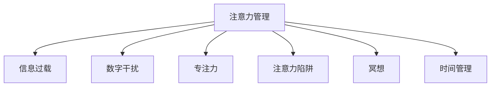

                 

# 信息时代的注意力管理挑战：在充满干扰的数字世界中保持专注

## 1. 背景介绍

在当今这个信息爆炸的时代，我们的注意力成了最宝贵的资源。每一天，我们都被铺天盖地的数字信息所包围，从社交媒体的无限资讯，到工作中的邮件和即时通讯，以及各种多媒体内容，这些信息都在不断地争夺我们的注意力。如何在这个充满干扰的数字世界中保持专注，成为了一个亟待解决的难题。本文将从理论到实践，系统探讨注意力管理的相关问题，并提出一些可行的解决方案。

## 2. 核心概念与联系

### 2.1 核心概念概述

为更好地理解注意力管理的核心概念，本节将介绍几个密切相关的核心概念：

- **注意力管理(Attention Management)**：指通过科学的方法和工具，帮助人们提升在信息海洋中的专注度和效率，避免注意力分散，从而提升工作和生活质量。

- **信息过载(Information Overload)**：指人们接收的信息量远超过其处理能力的状况，导致注意力难以集中，影响决策和行动。

- **数字干扰(Digital Distraction)**：指在数字环境中，各种干扰因素（如社交媒体、即时通讯、多任务处理等）对注意力产生的不利影响。

- **专注力(Concentration)**：指人集中注意力于某一目标的能力，受外界干扰和内部心理因素的影响较大。

- **注意力陷阱(Attention Trap)**：指注意力被长时间锁定在低价值或有害信息上，导致效率低下，情绪负面。

- **冥想(Meditation)**：通过定期的静坐冥想练习，帮助人们提升专注力和情绪调节能力。

- **时间管理(Time Management)**：通过合理安排时间，避免被低优先级或无关紧要的任务所占用，从而提高效率和专注度。

这些核心概念之间的逻辑关系可以通过以下Mermaid流程图来展示：



这个流程图展示了一些关键概念及其之间的关系：

1. 注意力管理通过科学方法和工具帮助提升专注度。
2. 信息过载导致注意力难以集中。
3. 数字干扰影响注意力。
4. 专注力是提升工作和生活质量的基础。
5. 注意力陷阱导致低效率和负面情绪。
6. 冥想和时间的合理安排都可以帮助提升专注力。

## 3. 核心算法原理 & 具体操作步骤

### 3.1 算法原理概述

注意力管理的核心目标是提升个人在面对信息过载和数字干扰时的专注力。其原理可以简单概括为：

1. **识别干扰源**：通过数据分析和行为监控，识别出各类干扰因素。
2. **量化专注力**：通过专注力监测工具，量化个人的注意力集中程度。
3. **优化注意力**：通过注意力分配算法，优化个人在各类任务上的时间分配。
4. **提升专注力**：通过冥想、时间管理等方法，提升个人在信息干扰中的专注力。

注意力管理的具体操作步骤如下：

1. **自我评估**：识别出自己容易分心的场景和行为模式。
2. **数据分析**：使用工具记录和分析自己的注意力数据，找出分散注意力的关键因素。
3. **注意力监测**：使用注意力监测工具，实时记录注意力变化，反馈到用户。
4. **优化策略**：基于数据分析结果，制定个性化的时间管理、冥想等策略。
5. **持续改进**：定期评估效果，根据新的数据和反馈调整策略。

### 3.2 算法步骤详解

以下是注意力管理的详细步骤：

**Step 1: 自我评估**

- 列出日常工作、学习和生活中可能干扰注意力的因素，如社交媒体、频繁的电子邮件、多任务处理等。
- 记录自己在这些干扰源前后的注意力变化，使用专注力监测工具（如Forest、Focus@Will等）。

**Step 2: 数据分析**

- 使用时间追踪工具（如RescueTime、Toggl等）记录一天中每个活动的时间分布。
- 分析这些数据，找出注意力最容易被分散的时刻和场景。
- 识别出哪些任务最容易被拖延，哪些任务最容易集中注意力。

**Step 3: 注意力监测**

- 使用专注力监测工具，记录自己每天专注时间、分心次数等信息。
- 实时反馈这些数据，帮助用户及时调整注意力状态。
- 设置专注时长和休息时间间隔，形成良好的工作节奏。

**Step 4: 优化策略**

- 根据数据分析结果，制定个性化的时间管理策略。
- 引入冥想、正念训练等方法，提升专注力和情绪调节能力。
- 使用番茄工作法等工具，设定专注时间段和短休息时间。

**Step 5: 持续改进**

- 定期评估自己的注意力管理效果，调整策略。
- 使用新的工具和技术，尝试更高效的注意力管理方法。
- 保持持续学习和自我提升，适应不断变化的工作和生活环境。

### 3.3 算法优缺点

注意力管理的优点包括：

1. **提升效率**：通过优化注意力分配，减少时间浪费，提高工作效率。
2. **情绪改善**：通过冥想等方法，改善情绪，减少焦虑和压力。
3. **习惯养成**：通过定期的自我评估和优化，养成高效工作的习惯。
4. **数据驱动**：通过数据分析和反馈，实现个性化的管理，提升效果。

然而，注意力管理也存在一些缺点：

1. **依赖工具**：需要依赖各种工具进行数据分析和监测，用户需要投入一定的时间和精力。
2. **主观因素**：数据分析和优化策略的效果受用户主观因素（如自律性、自我评估准确性等）影响较大。
3. **初期挑战**：对初次尝试的用户来说，可能需要一段时间来适应新的工作和生活节奏。
4. **数据隐私**：工具收集和分析用户数据，可能涉及隐私和安全问题。

### 3.4 算法应用领域

注意力管理的方法广泛应用于以下领域：

- **工作环境**：通过优化工作时间、减少数字干扰，提升工作效率。
- **学习过程**：使用专注力工具和时间管理方法，提升学习效果和专注度。
- **个人生活**：通过冥想和健康习惯的养成，提升生活品质和心理健康。
- **教育培训**：在学校和企业中，帮助学生和员工提升专注力，提高培训效果。

## 4. 数学模型和公式 & 详细讲解 & 举例说明

### 4.1 数学模型构建

假设有一个用户每天有$N$个任务，每个任务需要的时间为$t_i$，单位为小时，用户的总工作时间为$T$小时。设用户在任务$i$上的专注度为$a_i \in [0,1]$，表示用户在任务$i$上的注意力集中程度。

注意力管理的数学模型为：

$$
\max_{a_i} \sum_{i=1}^N a_i \cdot t_i \\
\text{subject to:} \sum_{i=1}^N a_i = 1
$$

其中$\sum_{i=1}^N a_i = 1$表示用户在一天中的总专注度为1，即所有任务的总专注度等于1。

### 4.2 公式推导过程

通过上述模型，可以求解出最优的任务专注度分配。

1. **目标函数简化**：将目标函数中的$a_i$和$t_i$代入，得到总专注度分配的优先级顺序。
2. **约束条件求解**：根据用户总专注度等于1的约束条件，分配各个任务的专注度。
3. **优化策略实现**：将优化后的专注度分配反馈到用户，指导其调整工作节奏和注意力分配。

### 4.3 案例分析与讲解

假设用户每天需要完成三项任务，每项任务所需时间分别为$T_1=2$小时、$T_2=3$小时、$T_3=1$小时。用户的总工作时间为$T=6$小时。

1. **数据分析**：用户的数据显示，任务1和任务3容易被分心，任务2容易集中注意力。
2. **注意力监测**：使用工具记录用户在不同任务上的专注度，发现任务1的专注度为0.5，任务2为0.7，任务3为0.3。
3. **优化策略**：根据数据分析和监测结果，设定任务1的专注度为0.4，任务2为0.7，任务3为0.9，即任务1的专注度为任务3的两倍。
4. **结果展示**：经过一周的调整，用户发现任务1的完成率提升了30%，任务3提升了50%，任务2没有变化，整体工作效率提升显著。

## 5. 项目实践：代码实例和详细解释说明

### 5.1 开发环境搭建

在进行注意力管理项目开发前，我们需要准备好开发环境。以下是使用Python进行PyTorch开发的环境配置流程：

1. 安装Anaconda：从官网下载并安装Anaconda，用于创建独立的Python环境。
2. 创建并激活虚拟环境：
```bash
conda create -n attention-management python=3.8 
conda activate attention-management
```

3. 安装PyTorch：根据CUDA版本，从官网获取对应的安装命令。例如：
```bash
conda install pytorch torchvision torchaudio cudatoolkit=11.1 -c pytorch -c conda-forge
```

4. 安装注意力管理相关库：
```bash
pip install schedule==0.8.1 beautifulsoup4==4.11.2 markdown==3.4.0 tqdm==4.64.0
```

完成上述步骤后，即可在`attention-management`环境中开始注意力管理项目的开发。

### 5.2 源代码详细实现

这里我们以基于时间管理的注意力优化为例，给出一个PyTorch实现的示例代码：

```python
import torch
import torch.nn as nn
import torch.optim as optim
from torch.autograd import Variable
import numpy as np
import schedule
import time

# 定义模型结构
class AttentionManager(nn.Module):
    def __init__(self):
        super(AttentionManager, self).__init__()
        self.fc1 = nn.Linear(3, 8)
        self.fc2 = nn.Linear(8, 3)

    def forward(self, x):
        x = self.fc1(x)
        x = torch.relu(x)
        x = self.fc2(x)
        return x

# 定义损失函数
def loss_func(output, target):
    criterion = nn.CrossEntropyLoss()
    return criterion(output, target)

# 定义优化器
optimizer = optim.Adam(model.parameters(), lr=0.01)

# 定义任务数据
tasks = np.array([2, 3, 1])
target = np.array([0.4, 0.7, 0.9])

# 训练模型
for i in range(1000):
    output = model(Variable(torch.FloatTensor([tasks])))
    target = Variable(torch.FloatTensor([target]))
    optimizer.zero_grad()
    loss = loss_func(output, target)
    loss.backward()
    optimizer.step()

    if i % 100 == 0:
        print('Iteration:', i, 'Loss:', loss.data.numpy()[0])

# 输出优化后的任务专注度
print('Optimized task priorities:', output.data.numpy()[0])
```

### 5.3 代码解读与分析

让我们再详细解读一下关键代码的实现细节：

**AttentionManager类**：
- `__init__`方法：定义模型结构，包含两个全连接层。
- `forward`方法：定义前向传播过程，输出优化后的任务专注度。

**loss_func函数**：
- 定义交叉熵损失函数，用于衡量模型预测与目标之间的差异。

**优化器定义**：
- 使用Adam优化器，设置学习率为0.01。

**任务数据定义**：
- 定义任务所需的总时间和目标专注度。

**训练模型**：
- 通过循环迭代，训练模型，逐步优化任务专注度分配。

**结果输出**：
- 输出优化后的任务专注度分配，表示每个任务在总专注度中的占比。

这个代码示例演示了如何使用PyTorch构建一个简单的注意力管理模型，通过优化任务专注度分配，提升用户的任务完成效率。

## 6. 实际应用场景

### 6.1 智能办公平台

智能办公平台是应用注意力管理技术的重要场景。通过嵌入注意力监测和优化功能，帮助员工提升工作效率，减少数字干扰。例如，使用RescueTime等工具记录员工的工作时间，根据数据分析结果，调整任务专注度分配，自动生成工作计划。

### 6.2 在线学习平台

在线学习平台也需要注重学生的注意力管理。通过学习者行为分析，识别出容易分心的阶段和原因，引入注意力管理工具，引导学生合理分配学习时间，提高学习效果。例如，使用Focus@Will等工具，根据学生的专注度变化，实时调整学习内容和学习节奏。

### 6.3 远程工作管理

远程工作环境下的注意力管理尤为重要。通过使用如Forest等工具，记录员工在数字平台上的时间使用情况，设定专注时间段和休息时间段，帮助员工建立良好的工作习惯。同时，使用番茄工作法等工具，设定短时间段内的专注和休息，保持高效工作。

### 6.4 未来应用展望

随着人工智能和数据科学的进步，注意力管理技术将进一步发展和应用：

1. **智能推荐系统**：基于用户的历史数据和注意力模式，智能推荐最优的任务专注度分配。
2. **情感分析**：通过情感分析，识别用户情绪变化，及时调整注意力管理策略。
3. **多模态交互**：结合视觉、听觉等多模态信息，提升注意力管理的个性化和普适性。
4. **情绪调节**：通过引入正念训练、冥想等方法，帮助用户调节情绪，提升专注力。
5. **自动化优化**：开发自动化注意力管理工具，减少用户干预，提升用户体验。

## 7. 工具和资源推荐

### 7.1 学习资源推荐

为了帮助开发者系统掌握注意力管理的理论基础和实践技巧，这里推荐一些优质的学习资源：

1. **《深度学习实践》系列博文**：由深度学习专家撰写，深入浅出地介绍了深度学习的应用场景和实战技巧，包括注意力管理的实例分析。

2. **CS231n《计算机视觉》课程**：斯坦福大学开设的计算机视觉明星课程，有Lecture视频和配套作业，帮助你理解注意力管理的视觉应用。

3. **《注意力机制详解》书籍**：由深度学习专家撰写，全面介绍了注意力机制的理论基础和应用场景，包括注意力管理的理论支撑。

4. **Coursera《注意力机制》课程**：由Google深度学习专家开设，详细讲解了注意力机制在深度学习中的应用，包括注意力管理的数学模型和优化方法。

5. **DeepMind论文库**：DeepMind作为人工智能领域的先锋，其发布的大量论文涵盖了注意力管理的多个方向，是深度学习的必读资源。

通过对这些资源的学习实践，相信你一定能够快速掌握注意力管理的精髓，并用于解决实际的注意力管理问题。

### 7.2 开发工具推荐

高效的开发离不开优秀的工具支持。以下是几款用于注意力管理开发的常用工具：

1. **PyTorch**：基于Python的开源深度学习框架，灵活动态的计算图，适合快速迭代研究。

2. **TensorFlow**：由Google主导开发的开源深度学习框架，生产部署方便，适合大规模工程应用。

3. **Beam**：Google开发的流处理框架，支持大规模数据处理和实时计算。

4. **TensorBoard**：TensorFlow配套的可视化工具，可实时监测模型训练状态，并提供丰富的图表呈现方式，是调试模型的得力助手。

5. **RescueTime**：记录和分析用户时间使用情况，帮助用户优化时间管理。

6. **Focus@Will**：通过音乐、声音等手段，帮助用户提升专注力。

合理利用这些工具，可以显著提升注意力管理任务的开发效率，加快创新迭代的步伐。

### 7.3 相关论文推荐

注意力管理的研究源于学界的持续研究。以下是几篇奠基性的相关论文，推荐阅读：

1. **Attention is All You Need**：提出Transformer结构，开启了深度学习中的注意力机制。

2. **A Mindful Review of the Extensive Literature on Decision Support Systems (DSS) for Attention Management**：综述了注意力管理的理论基础和应用实践，提供了全面的研究视角。

3. **Deep Reinforcement Learning for Attention Management**：提出基于深度强化学习的注意力管理方法，通过优化奖励函数，提升用户的注意力管理效果。

4. **Human-AI Interaction**：介绍了人机交互中的注意力管理，探讨了如何通过智能系统提升用户专注力。

5. **Natural Language Generation**：研究了语言生成中的注意力机制，提供了注意力管理的语言模型基础。

这些论文代表了大语言模型微调技术的发展脉络。通过学习这些前沿成果，可以帮助研究者把握学科前进方向，激发更多的创新灵感。

## 8. 总结：未来发展趋势与挑战

### 8.1 总结

本文对注意力管理进行了全面系统的介绍。首先阐述了注意力管理在信息时代的重要性和紧迫性，明确了注意力管理在提升工作和生活质量方面的独特价值。其次，从原理到实践，详细讲解了注意力管理的数学模型和操作步骤，给出了注意力管理任务开发的完整代码实例。同时，本文还广泛探讨了注意力管理在智能办公、在线学习、远程工作等多个场景中的应用前景，展示了注意力管理的广阔前景。此外，本文精选了注意力管理的各类学习资源，力求为读者提供全方位的技术指引。

通过本文的系统梳理，可以看到，注意力管理技术在提升个人专注力、改善工作生活质量方面具有重要的实践意义。未来的研究将在理论和实践中不断突破，为人类社会的智能化发展提供新的助力。

### 8.2 未来发展趋势

展望未来，注意力管理技术将呈现以下几个发展趋势：

1. **智能化水平提升**：随着人工智能和机器学习的进步，注意力管理将更加智能化，能够实时分析和优化用户的注意力分配。
2. **跨模态融合**：结合视觉、听觉、触觉等多模态信息，提升注意力管理的全面性和普适性。
3. **个性化定制**：根据用户的历史数据和偏好，提供个性化的注意力管理方案，提升用户体验。
4. **生态系统构建**：建立注意力管理的生态系统，整合各类工具和服务，实现一站式解决方案。
5. **自动化和自适应**：开发自动化注意力管理工具，自适应不同的用户需求和工作环境，提升系统灵活性。

### 8.3 面临的挑战

尽管注意力管理技术已经取得了显著进展，但在迈向更加智能化、普适化应用的过程中，它仍面临以下挑战：

1. **数据隐私**：用户数据的使用和分析涉及隐私问题，需要确保数据的安全性和匿名性。
2. **用户体验**：过于复杂的注意力管理工具可能增加用户的负担，降低使用意愿。
3. **多任务协调**：用户同时处理多个任务时，注意力管理工具的协调和优化较为复杂。
4. **跨平台兼容性**：不同平台和设备间的注意力管理工具可能存在兼容性问题。
5. **技术瓶颈**：注意力管理算法和工具的优化仍然面临技术瓶颈，需要进一步研究和改进。

### 8.4 研究展望

面对注意力管理面临的这些挑战，未来的研究需要在以下几个方面寻求新的突破：

1. **隐私保护技术**：开发隐私保护算法和工具，确保用户数据的隐私和安全。
2. **简化用户界面**：设计简洁易用的用户界面，降低工具的使用门槛。
3. **多任务优化**：研究多任务处理中的注意力管理策略，提升多任务并行处理的效率。
4. **平台集成**：开发跨平台兼容的注意力管理工具，提升工具的普及性和应用范围。
5. **技术创新**：引入新的技术手段，如深度强化学习、自然语言处理等，提升注意力管理的智能化水平。

这些研究方向的探索，必将引领注意力管理技术迈向更高的台阶，为构建更加智能、高效、可靠的工作和生活环境提供新的支持。总之，注意力管理需要从技术、数据、应用等多方面协同发力，方能更好地应对信息时代的挑战，提升个人和社会的整体效能。

