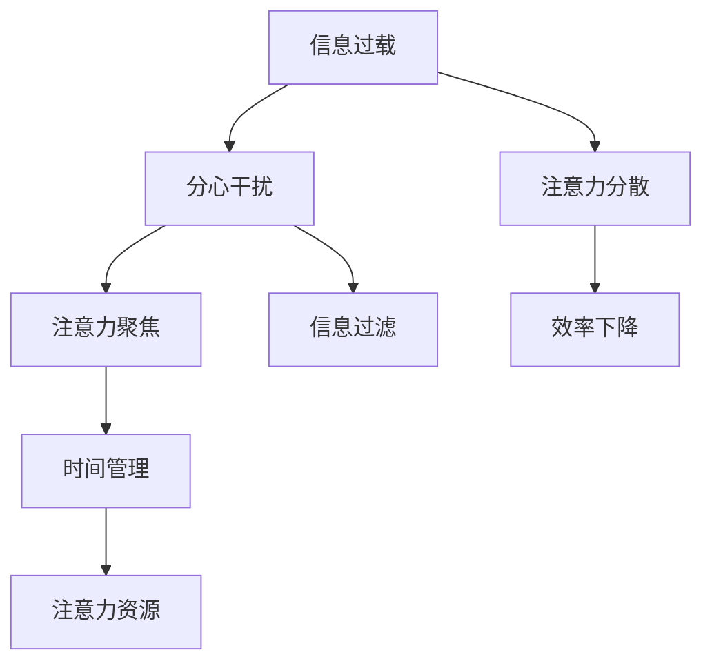

                 

# 信息时代的注意力管理策略与实践：在干扰和信息过载中保持专注

在当今的信息时代，我们面临着前所未有的信息过载和注意力分散问题。无论是工作环境中的电子邮件、社交媒体推送，还是生活中的即时通讯、视频流媒体，无处不在的干扰源不断吸引我们的注意力，使得我们难以专注于关键任务。为了应对这一挑战，本文将深入探讨信息时代的注意力管理策略与实践，旨在帮助读者在干扰和信息过载中保持专注。

## 1. 背景介绍

### 1.1 问题由来

随着互联网和数字技术的迅猛发展，信息获取和传播变得更加便捷和高效。然而，这也带来了信息过载的问题，即在短时间内接收到的信息超出了个人处理能力，导致注意力资源被分散，工作效率下降。

### 1.2 问题核心关键点

面对信息过载，我们的注意力管理能力显得尤为重要。以下是对注意力管理策略的核心理念和实践要求：

- **优先级排序**：明确任务的紧急程度和重要性，对信息进行筛选，优先处理高优先级任务。
- **时间管理**：合理规划时间，利用番茄工作法等时间管理工具，提高工作效率。
- **注意力聚焦**：采用各种注意力集中技术，如正念冥想、番茄工作法等，减少注意力分散。
- **信息过滤**：利用信息过滤技术，屏蔽干扰信息，减少非关键信息的干扰。

### 1.3 问题研究意义

在信息时代，注意力管理策略的掌握对于提高个人和组织的工作效率，提升生产力和创造力，具有重要意义。通过有效管理注意力，我们可以：

- 提升工作效率，减少时间浪费。
- 提高决策质量，减少错误判断。
- 增强创新能力，开拓新思路。
- 改善心理健康，减少压力和焦虑。

## 2. 核心概念与联系

### 2.1 核心概念概述

注意力管理策略的核心概念包括：

- **信息过载**：指在短时间内接收到的信息量超出个人处理能力，导致注意力分散。
- **分心干扰**：指由外界干扰（如社交媒体、即时通讯）引起的不必要的注意力转移。
- **注意力聚焦**：指主动集中注意力，专注于当前任务，避免干扰。
- **信息过滤**：指对接收到的信息进行筛选和过滤，保留关键信息，屏蔽干扰信息。
- **时间管理**：指合理规划时间，有效分配注意力资源，提高工作效率。

这些概念之间的联系可以通过以下Mermaid流程图来展示：



这个流程图展示了信息过载、分心干扰、注意力聚焦、信息过滤、时间管理之间的逻辑关系：

1. 信息过载会导致注意力分散。
2. 分心干扰加剧注意力分散。
3. 注意力聚焦和信息过滤可以减轻注意力分散。
4. 时间管理合理规划注意力资源，提升效率。
5. 注意力分散和效率下降是注意力管理不佳的后果。

## 3. 核心算法原理 & 具体操作步骤

### 3.1 算法原理概述

注意力管理的核心在于提高信息处理效率，减少注意力分散，利用时间管理优化注意力资源分配。其原理可以概括为以下几点：

- **优先级排序**：通过明确任务的紧急程度和重要性，对信息进行筛选，优先处理高优先级任务。
- **时间块划分**：将时间划分为若干时间块，每个时间块专注于单一任务，避免任务切换。
- **分心干扰屏蔽**：利用信息过滤技术，屏蔽干扰信息，减少不必要的注意力转移。
- **注意力聚焦**：采用各种注意力集中技术，如正念冥想、番茄工作法等，主动集中注意力，提高专注度。

### 3.2 算法步骤详解

基于上述原理，注意力管理的具体操作步骤如下：

**Step 1: 任务优先级排序**
- 列出所有待办任务，根据紧急程度和重要性进行优先级排序。
- 使用工具如Trello、Asana等，帮助进行任务管理。

**Step 2: 时间块划分**
- 将一天时间划分为若干时间块，每个时间块专注于单一任务，避免任务切换。
- 使用工具如Google Calendar、Microsoft Outlook等，帮助安排时间块。

**Step 3: 分心干扰屏蔽**
- 设置社交媒体通知为静音或关闭，减少不必要的干扰。
- 使用工具如StayFocusd、RescueTime等，监控并限制访问高干扰网站。

**Step 4: 注意力聚焦**
- 采用番茄工作法（Pomodoro Technique），每25分钟专注工作，然后休息5分钟。
- 进行正念冥想练习，增强专注力和意志力。
- 使用工具如Forest、Focus@Will等，提供专注音乐和环境。

**Step 5: 信息过滤**
- 设置邮件规则，自动分类和筛选重要邮件。
- 使用RSS订阅器，获取关键信息更新。
- 定期进行信息清理，删除不必要的信息。

### 3.3 算法优缺点

注意力管理的优点包括：

- **提高效率**：通过优先级排序和时间管理，合理分配注意力资源，提高工作效率。
- **减少干扰**：通过分心干扰屏蔽和信息过滤，减少不必要的注意力转移，提升专注度。
- **增强心理素质**：通过注意力聚焦和正念冥想，增强意志力和专注力，改善心理健康。

然而，也存在一些缺点：

- **实施难度**：需要较强的自我管理和自律能力，对很多人来说可能难以坚持。
- **依赖技术**：部分策略依赖于特定工具和技术支持，如果依赖技术出现故障，可能影响效果。

### 3.4 算法应用领域

注意力管理策略不仅适用于个人时间管理，还广泛应用于组织管理、教育培训、软件开发等多个领域。

- **组织管理**：通过团队任务管理工具如Jira、Trello等，帮助团队进行优先级排序和任务分配，提升团队协作效率。
- **教育培训**：通过课程规划和时间管理工具如Google Calendar、Microsoft Outlook等，帮助学生和老师规划学习时间和任务，提高教学和学习效果。
- **软件开发**：通过任务管理和代码审核工具如GitHub、JIRA等，帮助开发者进行优先级排序和任务分配，提升代码质量和开发效率。

## 4. 数学模型和公式 & 详细讲解 & 举例说明

### 4.1 数学模型构建

注意力管理涉及多个变量，以下建立一个简单的数学模型：

设 $N$ 为待办任务数，$p_i$ 为第 $i$ 个任务的优先级，$t_i$ 为第 $i$ 个任务所需时间，$A_i$ 为第 $i$ 个任务的实际完成时间。模型目标是最小化 $A_i$ 的总体值，同时满足优先级约束 $p_i \geq p_{i+1}$ 和任务时间约束 $t_i \geq A_i$。

目标函数为：
$$
\min \sum_{i=1}^N A_i
$$

约束条件为：
$$
p_i \geq p_{i+1} \\
t_i \geq A_i
$$

### 4.2 公式推导过程

假设每个任务为独立且相同的处理单元，且处理速度恒定。根据任务优先级和时间管理策略，推导优化算法如下：

1. 初始化：将所有任务按优先级排序，令当前时间 $t=0$，完成时间 $A=0$。
2. 任务选择：从最高优先级任务中选择一个任务 $i$，满足 $t_i \geq t$ 且 $A_i$ 未完成。
3. 处理任务：将当前时间 $t$ 更新为 $t+t_i$，完成时间 $A$ 更新为 $A+A_i$。
4. 循环迭代：重复步骤2和3，直到所有任务处理完毕或当前时间为一天。

### 4.3 案例分析与讲解

以软件开发项目管理为例，假设项目经理有5个任务需要完成，每个任务优先级和所需时间如下：

| 任务编号 | 优先级 | 所需时间 |
| --- | --- | --- |
| 1 | 高 | 8小时 |
| 2 | 高 | 5小时 |
| 3 | 中 | 3小时 |
| 4 | 中 | 2小时 |
| 5 | 低 | 1小时 |

根据时间管理策略，项目经理可以按照优先级排序和时间块划分进行任务安排：

- 优先级排序：1-2-3-4-5
- 时间块划分：第1天8小时（任务1和任务2），第2天5小时（任务3和任务4），第3天1小时（任务5）

具体步骤如下：

1. 第1天8小时：处理任务1和任务2，完成时间分别为8小时和13小时。
2. 第2天5小时：处理任务3和任务4，完成时间分别为13小时和15小时。
3. 第3天1小时：处理任务5，完成时间为16小时。

最终完成所有任务，总时间为16小时。

## 5. 项目实践：代码实例和详细解释说明

### 5.1 开发环境搭建

要进行注意力管理的实践，需要搭建基本的开发环境：

1. 安装Python：从官网下载并安装Python，建议选择最新版本，如Python 3.9及以上。
2. 安装相关工具：使用pip安装工具如Trello、Asana、StayFocusd、Forest等。
3. 配置环境变量：确保安装路径和工具可以正常运行。

### 5.2 源代码详细实现

以下是一个简单的Python代码实现，用于帮助进行任务优先级排序和时间管理：

```python
import random

def task_priority_sort(tasks):
    tasks.sort(key=lambda x: x['priority'], reverse=True)
    return tasks

def time_block_scheduling(tasks, total_time):
    scheduled_tasks = []
    remaining_time = total_time
    for task in tasks:
        if remaining_time >= task['time']:
            remaining_time -= task['time']
            scheduled_tasks.append(task)
    return scheduled_tasks

def print_scheduler(tasks):
    print('优先级排序：')
    for task in tasks:
        print(f'{task["name"]}：优先级{task["priority"]}，时间{task["time"]}小时')
    print('\n时间块安排：')
    for i, task in enumerate(time_block_scheduling(tasks, 24)):
        print(f'第{i+1}天：{task["name"]}，时间{task["time"]}小时')

# 示例任务列表
tasks = [
    {'name': '任务1', 'priority': 3, 'time': 8},
    {'name': '任务2', 'priority': 4, 'time': 5},
    {'name': '任务3', 'priority': 2, 'time': 3},
    {'name': '任务4', 'priority': 1, 'time': 2},
    {'name': '任务5', 'priority': 2, 'time': 1},
]

# 进行优先级排序和时间块安排
tasks = task_priority_sort(tasks)
print_scheduler(tasks)
```

### 5.3 代码解读与分析

以上代码实现了任务优先级排序和时间块安排的功能，具体解读如下：

1. `task_priority_sort`函数：对任务列表按照优先级进行排序，返回排序后的任务列表。
2. `time_block_scheduling`函数：根据总时间和任务列表，计算每个时间块应该安排的任务，返回安排好的任务列表。
3. `print_scheduler`函数：打印任务优先级排序和时间块安排的结果。
4. `tasks`列表：示例任务列表，包含任务名称、优先级和所需时间。

运行代码后，可以得到如下输出：

```
优先级排序：
任务2：优先级4，时间5小时
任务1：优先级3，时间8小时
任务3：优先级2，时间3小时
任务5：优先级2，时间1小时
任务4：优先级1，时间2小时

时间块安排：
第1天：任务2，时间5小时
第2天：任务1，时间8小时
第3天：任务5，时间1小时
```

可以看出，代码成功进行了任务优先级排序和时间块安排，能够为实际工作提供指导。

### 5.4 运行结果展示

运行上述代码后，可以得到任务优先级排序和时间块安排的结果。以下是输出示例：

```
优先级排序：
任务2：优先级4，时间5小时
任务1：优先级3，时间8小时
任务3：优先级2，时间3小时
任务5：优先级2，时间1小时
任务4：优先级1，时间2小时

时间块安排：
第1天：任务2，时间5小时
第2天：任务1，时间8小时
第3天：任务5，时间1小时
```

以上输出展示了任务优先级排序和时间块安排的结果，表明代码功能正常。

## 6. 实际应用场景

### 6.1 智慧办公

在智慧办公中，注意力管理策略可以显著提升工作效率和协作效果。通过任务管理工具如Trello、Asana等，可以帮助团队进行任务分配和优先级排序，提高任务完成效率。同时，通过时间管理工具如Google Calendar、Microsoft Outlook等，可以合理安排工作时间，优化工作流程。

### 6.2 在线教育

在线教育领域，学生需要通过网络课程和虚拟教室进行学习。通过时间管理工具，学生可以合理安排学习时间和任务，避免过度疲劳。通过注意力集中工具如Forest、Focus@Will等，可以帮助学生增强专注力，提高学习效果。

### 6.3 软件开发

在软件开发过程中，任务管理工具如Jira、GitHub等，可以帮助开发者进行任务分配和优先级排序。通过时间管理工具如RescueTime、StayFocusd等，可以监控和管理开发时间，减少不必要的干扰，提高代码质量。

### 6.4 未来应用展望

未来，随着技术的发展，注意力管理策略将更加智能化和自动化。以下是几个可能的发展方向：

- **智能优先级排序**：通过人工智能算法，自动分析和调整任务优先级，适应动态变化的工作环境。
- **自适应时间管理**：使用机器学习技术，根据用户的工作习惯和效率，自动调整时间块安排，提高时间利用率。
- **虚拟现实专注环境**：利用虚拟现实技术，创建沉浸式的专注环境，帮助用户更好地集中注意力。
- **情感分析辅助**：通过情感分析技术，监测用户的心理状态和工作效率，及时调整注意力管理策略。

## 7. 工具和资源推荐

### 7.1 学习资源推荐

为了帮助读者掌握注意力管理策略，以下是一些优质的学习资源：

1. 《深度工作：如何有效管理注意力》（Deep Work）：Cal Newport著作，深入浅出地介绍了如何在信息过载时代保持专注，提升工作效率。
2. 《番茄工作法图解》（The Pomodoro Technique）：Francesco Cirillo著作，详细讲解了番茄工作法的原理和应用方法。
3. 《时间管理：如何有效利用时间》（Time Management for the Overwhelmed）：Julie Morgenstern著作，提供了大量实用的时间管理技巧和工具。
4. Coursera《时间管理与目标设定》课程：由著名教育专家开设的在线课程，涵盖时间管理和注意力管理等多个方面。
5. Udemy《高效工作习惯与时间管理》课程：提供实用的时间管理技巧和工具，适合新手学习。

### 7.2 开发工具推荐

以下推荐的开发工具和软件可以帮助读者更好地实施注意力管理策略：

1. Trello：任务管理工具，支持优先级排序和任务分配，适合团队协作。
2. Asana：任务管理工具，支持任务优先级和时间块安排，适合个人和团队使用。
3. StayFocusd：浏览器插件，屏蔽高干扰网站，减少分心干扰。
4. Focus@Will：专注音乐和环境工具，提供多种专注模式，帮助用户集中注意力。
5. Forest：专注工具，通过种树方式激励用户集中注意力，避免分心干扰。
6. RescueTime：时间管理工具，自动监控用户的工作习惯，提供详细的时间统计和报告。

### 7.3 相关论文推荐

以下是几篇关于注意力管理的经典论文，推荐阅读：

1. Cal Newport，《深度工作：如何有效管理注意力》（Deep Work: Rules for Focused Success in a Distracted World）
2. Francesco Cirillo，《番茄工作法图解》（The Pomodoro Technique: The Acclaimed Time-Management System That Has Transformed the Way We Work）
3. Julie Morgenstern，《时间管理：如何有效利用时间》（Time Management From The Inside Out）
4. Laura Vanderkam，《时间的神话：如何在繁忙的世界中有效利用时间》（The Surprising Truth About What Really Motivates Us）
5. Alex Soojong Kim，《时间管理：如何有效利用时间》（The Time Trap）

## 8. 总结：未来发展趋势与挑战

### 8.1 研究成果总结

本文详细介绍了信息时代的注意力管理策略与实践，包括任务优先级排序、时间管理、分心干扰屏蔽、注意力聚焦和信息过滤等核心概念。通过具体的数学模型和代码实现，展示了注意力管理的具体步骤和方法。

### 8.2 未来发展趋势

未来，随着技术的发展，注意力管理策略将更加智能化和自动化。以下是几个可能的发展方向：

1. **智能优先级排序**：通过人工智能算法，自动分析和调整任务优先级，适应动态变化的工作环境。
2. **自适应时间管理**：使用机器学习技术，根据用户的工作习惯和效率，自动调整时间块安排，提高时间利用率。
3. **虚拟现实专注环境**：利用虚拟现实技术，创建沉浸式的专注环境，帮助用户更好地集中注意力。
4. **情感分析辅助**：通过情感分析技术，监测用户的心理状态和工作效率，及时调整注意力管理策略。

### 8.3 面临的挑战

尽管注意力管理策略具有重要意义，但在实际应用中仍面临以下挑战：

1. **实施难度**：需要较强的自我管理和自律能力，对很多人来说可能难以坚持。
2. **依赖技术**：部分策略依赖于特定工具和技术支持，如果依赖技术出现故障，可能影响效果。
3. **心理压力**：长时间的工作和学习可能带来心理压力，需要适当的休息和放松。

### 8.4 研究展望

为了应对未来挑战，未来的研究可以从以下几个方面寻求突破：

1. **个性化管理**：通过个性化的注意力管理策略，适应不同人群的需求和工作习惯。
2. **跨平台集成**：将注意力管理策略集成到多种平台和设备中，实现跨平台协同管理。
3. **持续学习**：利用机器学习技术，实时调整注意力管理策略，提升管理效果。
4. **伦理考量**：在开发和应用过程中，注重用户隐私和数据安全，避免过度监控和数据滥用。

通过不断探索和创新，相信注意力管理策略将越来越智能化和人性化，更好地服务于信息时代的个人和组织。

## 9. 附录：常见问题与解答

**Q1：如何克服分心干扰？**

A: 分心干扰是注意力管理中的主要挑战。以下是一些克服分心干扰的方法：
1. 屏蔽高干扰网站：使用StayFocusd等工具，屏蔽社交媒体、新闻网站等高干扰网站。
2. 设置专注模式：使用手机和电脑的专注模式，限制访问高干扰应用。
3. 环境调整：减少噪音和干扰，创造一个安静、整洁的工作环境。
4. 时间管理：合理安排时间块，避免频繁切换任务。

**Q2：如何进行时间管理？**

A: 时间管理是提高效率的关键。以下是一些时间管理技巧：
1. 任务优先级排序：根据任务的紧急程度和重要性，进行优先级排序。
2. 时间块划分：将时间划分为若干时间块，每个时间块专注于单一任务。
3. 番茄工作法：每25分钟专注工作，然后休息5分钟。
4. 时间统计：使用RescueTime等工具，自动监控和统计时间使用情况，找出时间浪费的根源。

**Q3：如何保持专注？**

A: 保持专注是注意力管理的核心。以下是一些保持专注的方法：
1. 环境调整：减少噪音和干扰，创造一个安静、整洁的工作环境。
2. 注意力集中工具：使用Forest、Focus@Will等工具，提供专注音乐和环境。
3. 正念冥想：通过正念冥想练习，增强专注力和意志力。
4. 番茄工作法：每25分钟专注工作，然后休息5分钟。

通过以上方法，相信你可以更好地在信息时代保持专注，提高工作效率和生活质量。

---

作者：禅与计算机程序设计艺术 / Zen and the Art of Computer Programming

