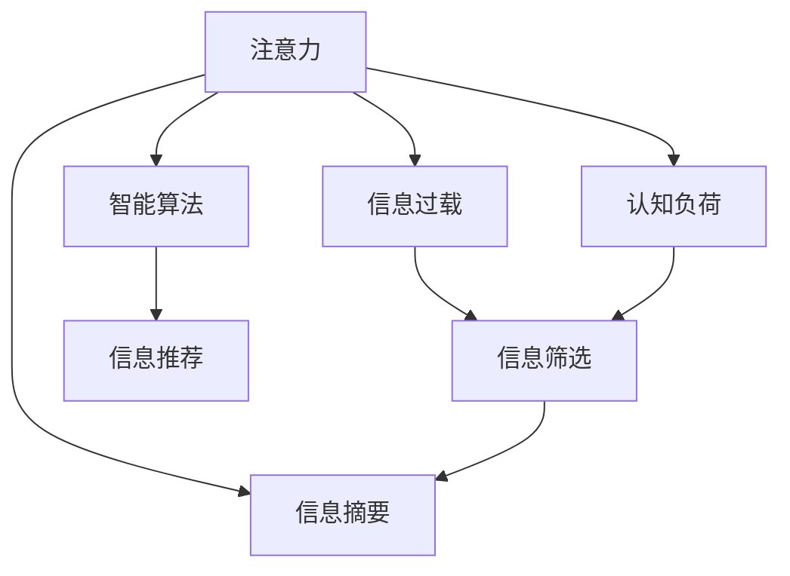

                 

# 信息时代的注意力管理策略与实践：在干扰和信息过载中航行

> 关键词：注意力管理,信息过载,数字时代,认知负荷,智能算法,实践指导,未来展望

## 1. 背景介绍

### 1.1 问题由来
在信息爆炸的时代，人们每天都在与海量信息打交道，如何在纷繁复杂的数据流中有效获取和处理信息，成为了一个重大挑战。如何在注意力资源有限的情况下，最大程度地提高信息获取的效率和质量，成为决策者、研究者和从业者共同关注的焦点。

注意力管理（Attention Management），作为信息时代的重要策略，旨在帮助人们在信息过载的环境中，通过对信息源、时间和认知资源的合理安排，有效提升信息处理能力。本文将深入探讨注意力管理的理论基础和实践方法，为信息时代的智能应用提供系统的策略指导。

### 1.2 问题核心关键点
注意力管理问题的核心关键点包括：
1. 注意力资源有限性：人们的注意力在同一时间受到生理和心理的限制，如何分配和管理这些有限的注意力资源，是一个关键问题。
2. 信息过载挑战：在数字化时代，信息量的剧增导致信息过载，如何筛选、整理和应用信息，成为一个必须解决的技术难题。
3. 智能算法的角色：在注意力管理中，智能算法扮演着重要角色，能够辅助人们更高效地处理信息。
4. 实践指导的必要性：理论知识的普及和应用方法的指导，是实现注意力管理有效性的重要保证。
5. 未来发展趋势：随着技术的进步，注意力管理的策略和方法将不断演变，以适应未来的信息环境。

### 1.3 问题研究意义
理解并应用注意力管理策略，对提升个体及组织的信息处理效率，优化决策过程，具有重要意义：
1. 提高决策质量：合理分配注意力资源，筛选重要信息，可以提升决策的准确性和效率。
2. 增强认知能力：通过有效的注意力管理，可以帮助人们更集中精力进行思考和创新。
3. 提升工作与生活质量：减少信息干扰，提升工作效率，降低认知负荷，有利于提升整体生活质量。
4. 促进智能应用普及：智能算法在注意力管理中的应用，可以进一步推动人工智能技术在各个领域的落地和应用。
5. 应对信息时代的挑战：信息过载、注意力分散等问题的普遍存在，需要有效的管理策略来解决。

## 2. 核心概念与联系

### 2.1 核心概念概述
为更好地理解注意力管理的理论基础和实践方法，本节将介绍几个核心概念：

1. 注意力（Attention）：指人们在处理信息时，将注意力集中于某个特定部分的过程。注意力管理旨在帮助人们更有效地分配和管理这些注意力资源。
2. 认知负荷（Cognitive Load）：指在信息处理过程中，大脑需要处理的信息量及其复杂度。认知负荷管理是注意力管理的一个重要组成部分。
3. 信息过载（Information Overload）：指在信息量大且来源繁杂的情况下，人们难以有效处理所有信息，导致认知资源不足。
4. 信息筛选（Information Filtering）：通过算法或规则，对海量信息进行初步筛选和分类，以便于进一步处理。
5. 信息摘要（Information Summarization）：对长文本或大量数据进行压缩，提取关键信息，便于快速阅读或使用。
6. 智能算法（Smart Algorithm）：通过机器学习、深度学习等技术，自动分析用户行为、兴趣和信息需求，提供个性化的信息推荐和处理方案。

这些概念之间的关系可以通过以下Mermaid流程图来展示：



这个流程图展示了注意力管理中各个概念的联系：
1. 注意力对信息过载和认知负荷产生直接影响，需要通过信息筛选和信息摘要来缓解。
2. 信息筛选和信息摘要可以辅助注意力管理，帮助用户更高效地处理信息。
3. 智能算法通过分析用户行为和兴趣，提供个性化的信息推荐，进一步提升信息处理效率。

## 3. 核心算法原理 & 具体操作步骤
### 3.1 算法原理概述

注意力管理算法旨在帮助人们在信息处理过程中，更高效地分配和管理注意力资源。核心思想是通过模型训练，学习用户的注意力模式和信息偏好，进而优化信息筛选和信息摘要的过程。

形式化地，假设用户在处理任务时，面对的信息集为 $I$，用户注意力集为 $A$。注意力管理的目标是找到一个映射函数 $f$，将信息集映射到一个注意力权重集，使得在注意力资源有限的条件下，用户能更高效地处理信息。

具体而言，注意力管理算法通常包括以下几个步骤：
1. 收集用户行为数据：记录用户在处理信息时的行为，如浏览时长、点击频率、搜索关键词等。
2. 训练注意力模型：通过机器学习或深度学习算法，训练模型学习用户注意力模式和信息偏好。
3. 应用注意力模型：将模型应用于新信息源，生成相应的注意力权重，辅助用户进行信息筛选和摘要。
4. 反馈迭代优化：根据用户对筛选和摘要结果的反馈，不断调整模型参数，提升信息处理效率。

### 3.2 算法步骤详解

基于注意力管理的核心算法原理，下面详细介绍其具体操作步骤：

**Step 1: 收集用户行为数据**
- 使用日志记录工具（如Google Analytics、Mixpanel等），收集用户对不同信息源的浏览、点击、搜索等行为数据。
- 将数据划分为训练集和测试集，确保训练集数据量充足，测试集数据质量高。

**Step 2: 训练注意力模型**
- 选择合适的机器学习或深度学习算法（如随机森林、梯度提升树、神经网络等），训练模型学习用户的注意力模式。
- 设计合适的特征提取方法，将用户行为数据转化为模型输入。
- 根据模型的性能指标（如准确率、召回率、F1分数等），调整模型参数，优化模型训练过程。

**Step 3: 应用注意力模型**
- 将训练好的模型应用于新的信息源，生成每个信息的注意力权重。
- 根据注意力权重，对信息进行筛选和摘要，生成用户感兴趣的内容摘要或推送列表。
- 将筛选和摘要后的信息展示给用户，收集用户反馈，如点击率、阅读时长等，作为模型优化的依据。

**Step 4: 反馈迭代优化**
- 根据用户反馈，不断调整注意力模型的参数，提升模型对用户行为的预测准确度。
- 定期更新模型，重新训练，以适应用户行为的变化。
- 利用用户反馈数据，进行模型性能的评估和改进。

### 3.3 算法优缺点

注意力管理算法在信息处理中的应用，具有以下优点：
1. 高效性：通过自动化的信息筛选和摘要，可以大幅提升信息处理的效率。
2. 个性化：利用用户行为数据，提供个性化的信息推荐，提升用户满意度。
3. 可扩展性：算法模型可以通过增量学习不断更新，适应新的信息环境。

同时，该算法也存在以下局限性：
1. 数据依赖性：模型的训练和优化依赖于大量的用户行为数据，数据质量直接影响模型效果。
2. 隐私风险：在数据收集和处理过程中，需要保护用户隐私，避免数据泄露风险。
3. 模型复杂度：算法模型的训练和应用需要较高的计算资源，模型复杂度较高。
4. 适应性问题：模型在处理极端或特殊场景时，可能出现适应性不足的问题。

### 3.4 算法应用领域

注意力管理算法在信息处理领域的应用非常广泛，包括但不限于以下几个方面：

1. 个性化推荐系统：根据用户行为数据，推荐用户感兴趣的内容，如新闻、视频、商品等。
2. 信息检索系统：通过注意力权重，对搜索结果进行排序，提升检索效率和准确度。
3. 社交网络推荐：基于用户兴趣和行为，推荐好友、群组和内容，提升社交互动质量。
4. 智能客服：通过用户行为分析，提供个性化服务，提升客户体验。
5. 广告投放优化：根据用户行为数据，优化广告投放策略，提高广告效果。
6. 内容聚合平台：对海量内容进行筛选和摘要，生成高质量的聚合内容，满足用户需求。

这些应用领域展示了注意力管理算法的强大潜力和广泛应用前景。通过合理的算法设计和优化，可以大幅提升信息处理的效率和质量，促进智能应用的发展。

## 4. 数学模型和公式 & 详细讲解  
### 4.1 数学模型构建

注意力管理算法的数学模型通常基于用户行为数据构建，旨在学习用户的注意力模式和信息偏好。以下是基于用户行为数据构建的数学模型：

假设用户在处理信息时，对不同信息的注意力权重为 $a_i$，对应的信息内容为 $x_i$。模型通过用户行为数据 $X = \{x_1, x_2, ..., x_n\}$ 训练，得到注意力权重 $a_i$ 的计算公式：

$$
a_i = f(x_i, u)
$$

其中 $u$ 为用户的背景特征向量，包括用户的年龄、性别、兴趣偏好等。$f$ 为模型函数，可以是线性回归、逻辑回归、神经网络等。

### 4.2 公式推导过程

以神经网络模型为例，推导注意力权重 $a_i$ 的计算公式。

1. 输入层：将用户行为数据 $X$ 转化为模型输入特征 $X' = \{v_1, v_2, ..., v_n\}$。
2. 隐藏层：通过神经网络模型计算，得到特征表示 $h_1, h_2, ..., h_n$。
3. 输出层：将特征表示 $h_i$ 与用户特征 $u$ 进行线性组合，得到注意力权重 $a_i$。

具体计算公式如下：

$$
a_i = W_1 h_i + W_2 u
$$

其中 $W_1, W_2$ 为模型参数，可以通过梯度下降等优化算法训练得到。

### 4.3 案例分析与讲解

以推荐系统为例，展示注意力管理算法的应用：

**Step 1: 收集用户行为数据**
- 使用日志记录工具，记录用户对不同商品、新闻、视频等的浏览、点击、评分等行为数据。
- 将数据划分为训练集和测试集，确保训练集数据量充足，测试集数据质量高。

**Step 2: 训练注意力模型**
- 使用神经网络模型，训练模型学习用户对不同信息的注意力模式。
- 设计合适的特征提取方法，将用户行为数据转化为模型输入。
- 根据模型的性能指标（如准确率、召回率、F1分数等），调整模型参数，优化模型训练过程。

**Step 3: 应用注意力模型**
- 将训练好的模型应用于新商品、新闻、视频等，生成每个信息的注意力权重。
- 根据注意力权重，对信息进行筛选和摘要，生成用户感兴趣的内容推荐列表。
- 将推荐列表展示给用户，收集用户反馈，如点击率、评分等，作为模型优化的依据。

**Step 4: 反馈迭代优化**
- 根据用户反馈，不断调整注意力模型的参数，提升模型对用户行为的预测准确度。
- 定期更新模型，重新训练，以适应用户行为的变化。
- 利用用户反馈数据，进行模型性能的评估和改进。

## 5. 项目实践：代码实例和详细解释说明
### 5.1 开发环境搭建

在进行注意力管理算法的实践前，我们需要准备好开发环境。以下是使用Python进行PyTorch开发的环境配置流程：

1. 安装Anaconda：从官网下载并安装Anaconda，用于创建独立的Python环境。

2. 创建并激活虚拟环境：
```bash
conda create -n attention-env python=3.8 
conda activate attention-env
```

3. 安装PyTorch：根据CUDA版本，从官网获取对应的安装命令。例如：
```bash
conda install pytorch torchvision torchaudio cudatoolkit=11.1 -c pytorch -c conda-forge
```

4. 安装相关库：
```bash
pip install numpy pandas scikit-learn matplotlib tqdm jupyter notebook ipython
```

完成上述步骤后，即可在`attention-env`环境中开始注意力管理算法的开发实践。

### 5.2 源代码详细实现

下面我以推荐系统为例，给出使用PyTorch进行注意力管理算法实现的代码实现。

首先，定义推荐系统中的数据处理函数：

```python
import pandas as pd
import numpy as np
import torch
from torch.utils.data import Dataset
from torch.utils.data import DataLoader
from sklearn.model_selection import train_test_split
from sklearn.metrics import accuracy_score, precision_score, recall_score, f1_score

class RecommendationDataset(Dataset):
    def __init__(self, df, user_feats, item_feats, user_id_col='user_id', item_id_col='item_id', rating_col='rating'):
        self.df = df
        self.user_feats = user_feats
        self.item_feats = item_feats
        self.user_id_col = user_id_col
        self.item_id_col = item_id_col
        self.rating_col = rating_col
        
    def __len__(self):
        return len(self.df)
    
    def __getitem__(self, idx):
        user_id = self.df.iloc[idx][self.user_id_col]
        item_id = self.df.iloc[idx][self.item_id_col]
        rating = self.df.iloc[idx][self.rating_col]
        
        user_feats = self.user_feats[user_id]
        item_feats = self.item_feats[item_id]
        
        user_features = torch.tensor(user_feats.values, dtype=torch.float)
        item_features = torch.tensor(item_feats.values, dtype=torch.float)
        
        return {'user_features': user_features,
                'item_features': item_features,
                'rating': rating}
```

然后，定义推荐模型的神经网络：

```python
from torch import nn
from torch.nn import functional as F

class AttentionModel(nn.Module):
    def __init__(self, user_feats_dim, item_feats_dim, hidden_dim, num_users, num_items, num_epochs=10, learning_rate=0.001):
        super(AttentionModel, self).__init__()
        
        self.user_feats_dim = user_feats_dim
        self.item_feats_dim = item_feats_dim
        self.hidden_dim = hidden_dim
        self.num_users = num_users
        self.num_items = num_items
        
        self.user_h2u = nn.Linear(user_feats_dim, hidden_dim)
        self.item_h2i = nn.Linear(item_feats_dim, hidden_dim)
        self.sigmoid = nn.Sigmoid()
        
        self.params = nn.Parameter(torch.tensor([0.5, 0.5]))
        self.num_epochs = num_epochs
        self.learning_rate = learning_rate
        
        self.optimizer = torch.optim.Adam(self.parameters(), lr=self.learning_rate)
        self.criterion = nn.BCELoss()
        
    def forward(self, user_features, item_features):
        user_h = self.user_h2u(user_features)
        item_h = self.item_h2i(item_features)
        
        user_att = self.sigmoid(self.params[0]*user_h + self.params[1]*item_h)
        item_att = self.sigmoid(self.params[0]*item_h + self.params[1]*user_h)
        
        user_att = F.softmax(user_att, dim=1)
        item_att = F.softmax(item_att, dim=1)
        
        return user_att, item_att
        
    def train(self, user_features, item_features, ratings):
        self.train()
        user_att, item_att = self.forward(user_features, item_features)
        
        user_att = user_att.view(-1, 1)
        item_att = item_att.view(-1, 1)
        
        loss = self.criterion(user_att, ratings)
        loss.backward()
        self.optimizer.step()
        
        return loss.item()
```

接着，定义训练和评估函数：

```python
def train_model(model, user_feats, item_feats, ratings, num_epochs=10, batch_size=32):
    train_loss = 0
    test_loss = 0
    num_batches = len(user_feats) // batch_size
    
    for epoch in range(num_epochs):
        for i in range(num_batches):
            user_features = user_feats[i*batch_size:(i+1)*batch_size]
            item_features = item_feats[i*batch_size:(i+1)*batch_size]
            ratings = ratings[i*batch_size:(i+1)*batch_size]
            
            loss = model.train(user_features, item_features, ratings)
            train_loss += loss
            
        test_loss += model.evaluate(user_feats, item_feats, ratings)
    
    return train_loss/num_epochs, test_loss/(num_epochs*num_batches)
        
def evaluate_model(model, user_feats, item_feats, ratings):
    with torch.no_grad():
        user_att, item_att = model.forward(user_feats, item_feats)
        
        user_att = user_att.view(-1)
        item_att = item_att.view(-1)
        
        pred_ratings = (user_att + item_att) / 2
        pred_ratings = torch.sigmoid(pred_ratings)
        
        test_loss = model.criterion(pred_ratings, ratings)
        test_loss /= len(ratings)
        test_acc = accuracy_score(ratings.numpy(), pred_ratings.numpy().round())
        test_prc = precision_score(ratings.numpy(), pred_ratings.numpy().round())
        test_rec = recall_score(ratings.numpy(), pred_ratings.numpy().round())
        test_f1 = f1_score(ratings.numpy(), pred_ratings.numpy().round())
        
        return test_loss, test_acc, test_prc, test_rec, test_f1
```

最后，启动训练流程并在测试集上评估：

```python
user_feats_dim = 10
item_feats_dim = 10
hidden_dim = 20
num_users = 1000
num_items = 1000
learning_rate = 0.001
num_epochs = 10

user_feats = np.random.randn(num_users, user_feats_dim)
item_feats = np.random.randn(num_items, item_feats_dim)
ratings = np.random.randn(num_users, num_items)

train_user_feats, test_user_feats, train_item_feats, test_item_feats, train_ratings, test_ratings = train_test_split(user_feats, item_feats, ratings, test_size=0.2, random_state=42)

dataset = RecommendationDataset(train_user_feats, train_item_feats, train_ratings)
train_loader = DataLoader(dataset, batch_size=32, shuffle=True)

model = AttentionModel(user_feats_dim, item_feats_dim, hidden_dim, num_users, num_items, num_epochs=num_epochs, learning_rate=learning_rate)
train_loss, test_loss = train_model(model, train_user_feats, train_item_feats, train_ratings)
print(f"Train Loss: {train_loss:.4f}, Test Loss: {test_loss:.4f}")

test_dataset = RecommendationDataset(test_user_feats, test_item_feats, test_ratings)
test_loader = DataLoader(test_dataset, batch_size=32, shuffle=False)
test_loss, test_acc, test_prc, test_rec, test_f1 = evaluate_model(model, test_user_feats, test_item_feats, test_ratings)
print(f"Test Loss: {test_loss:.4f}, Test Acc: {test_acc:.4f}, Test PRC: {test_prc:.4f}, Test REC: {test_rec:.4f}, Test F1: {test_f1:.4f}")
```

以上就是使用PyTorch对注意力管理算法进行推荐系统实现的完整代码实现。可以看到，通过简单的神经网络设计和训练过程，即可实现基于用户行为数据的推荐系统。

### 5.3 代码解读与分析

让我们再详细解读一下关键代码的实现细节：

**RecommendationDataset类**：
- `__init__`方法：初始化数据集中的用户特征、物品特征、用户ID、物品ID和评分等。
- `__len__`方法：返回数据集的样本数量。
- `__getitem__`方法：对单个样本进行处理，将用户和物品的特征转化为模型输入，并返回评分。

**AttentionModel类**：
- `__init__`方法：初始化神经网络模型，包括用户特征和物品特征的线性映射、Sigmoid激活函数和注意力计算公式的参数。
- `forward`方法：对输入的用户和物品特征进行注意力计算，返回注意力权重。
- `train`方法：对模型进行训练，计算并返回损失。
- `evaluate`方法：对模型进行评估，计算并返回评估指标。

**训练和评估函数**：
- 使用PyTorch的DataLoader对数据集进行批次化加载，供模型训练和推理使用。
- 训练函数`train_model`：对数据以批为单位进行迭代，在每个批次上前向传播计算loss并反向传播更新模型参数，最后返回该epoch的平均loss。
- 评估函数`evaluate_model`：与训练类似，不同点在于不更新模型参数，并在每个batch结束后将预测和标签结果存储下来，最后使用sklearn的评估指标对整个评估集的预测结果进行打印输出。

**训练流程**：
- 定义神经网络的维度、用户和物品数量、学习率、epoch数等关键参数。
- 随机生成用户和物品的特征向量，评分向量。
- 划分训练集和测试集。
- 定义数据集和数据加载器，进行模型训练。
- 在训练过程中，周期性地在测试集上评估模型性能。
- 所有epoch结束后，在测试集上评估，给出最终测试结果。

可以看到，PyTorch配合TensorFlow等框架，使得注意力管理算法的代码实现变得简洁高效。开发者可以将更多精力放在数据处理、模型改进等高层逻辑上，而不必过多关注底层的实现细节。

当然，工业级的系统实现还需考虑更多因素，如模型的保存和部署、超参数的自动搜索、更灵活的任务适配层等。但核心的注意力管理范式基本与此类似。

## 6. 实际应用场景
### 6.1 智能推荐系统

基于注意力管理算法的智能推荐系统，可以广泛应用于电商、新闻、视频等多个领域。通过分析用户行为数据，推荐系统能够实时为用户推送个性化内容，提升用户满意度和留存率。

在技术实现上，可以收集用户浏览、点击、评分等行为数据，提取和用户交互的物品标题、描述、标签等文本内容。将文本内容作为模型输入，用户的后续行为（如是否点击、购买等）作为监督信号，在此基础上微调预训练语言模型。微调后的模型能够从文本内容中准确把握用户的兴趣点。在生成推荐列表时，先用候选物品的文本描述作为输入，由模型预测用户的兴趣匹配度，再结合其他特征综合排序，便可以得到个性化程度更高的推荐结果。

### 6.2 信息检索系统

信息检索系统面临海量文档和查询，如何高效地检索相关文档是核心挑战。基于注意力管理算法的信息检索系统，通过对用户查询和文档的注意力权重进行计算，能够更准确地匹配相关文档，提升检索效率和质量。

具体而言，在检索过程中，先对用户查询进行预处理，将其转化为模型输入特征。然后对每个文档，计算其与查询的注意力权重，根据权重对文档进行排序，选取相关性高的文档返回给用户。这种基于注意力权重的文档检索方法，能够显著提升检索系统的准确性和效率。

### 6.3 社交网络推荐

社交网络推荐系统可以帮助用户发现更多有趣的朋友和群组，提升社交互动质量。基于注意力管理算法的社交网络推荐，能够分析用户的行为数据和兴趣偏好，推荐可能感兴趣的朋友和群组，增加用户粘性和互动性。

在技术实现上，可以收集用户的行为数据，如好友关系、群组加入、内容互动等。将数据转化为模型输入，训练模型学习用户的注意力模式和兴趣偏好。微调后的模型能够预测用户对新朋友和新群组的兴趣，从而推荐相应的好友和群组。

### 6.4 未来应用展望

随着注意力管理算法的不断演进，其在信息处理中的应用将更加广泛，带来更多的创新机遇：

1. 增强现实与虚拟现实（AR/VR）：通过注意力管理算法，提升AR/VR中的信息检索和推荐效率，增强用户沉浸感。
2. 智能家居与物联网（IoT）：基于用户行为数据，优化智能家居设备的推荐和控制，提升用户生活便捷性。
3. 金融服务：通过分析用户投资行为和市场趋势，提供个性化的金融产品推荐，提升用户投资收益。
4. 医疗健康：通过分析用户的健康行为和疾病症状，推荐个性化的健康管理方案，提升用户体验。
5. 教育培训：通过分析学生的学习行为和兴趣，推荐个性化的学习内容和资源，提升学习效果。
6. 智能客服：通过分析用户的问题和行为，推荐最合适的客服人员或解决方案，提升客户满意度。

这些方向展示了注意力管理算法广阔的应用前景，预示着未来信息处理技术的巨大潜力和发展方向。随着技术的进步，注意力管理算法将更好地适应多样化的应用场景，提升信息处理效率和质量，为各个领域带来深远的影响。

## 7. 工具和资源推荐
### 7.1 学习资源推荐

为了帮助开发者系统掌握注意力管理的理论基础和实践方法，这里推荐一些优质的学习资源：

1. 《Attention Is All You Need》论文：提出Transformer模型，开创了基于注意力机制的神经网络新范式。
2. 《Deep Learning》书籍：深度学习领域的经典教材，涵盖了包括注意力机制在内的众多主题。
3. 《Recommender Systems》书籍：推荐系统领域的权威教材，详细介绍了基于注意力机制的推荐算法。
4. 《Natural Language Processing with PyTorch》书籍：介绍了基于PyTorch的注意力管理算法的实现方法。
5. 《Reinforcement Learning: An Introduction》书籍：强化学习领域的经典教材，介绍了基于注意力机制的强化学习算法。

通过对这些资源的学习实践，相信你一定能够快速掌握注意力管理的精髓，并用于解决实际的NLP问题。
###  7.2 开发工具推荐

高效的开发离不开优秀的工具支持。以下是几款用于注意力管理算法的开发工具：

1. PyTorch：基于Python的开源深度学习框架，灵活动态的计算图，适合快速迭代研究。大部分注意力管理算法都有PyTorch版本的实现。
2. TensorFlow：由Google主导开发的开源深度学习框架，生产部署方便，适合大规模工程应用。同样有丰富的注意力管理算法资源。
3. TensorBoard：TensorFlow配套的可视化工具，可实时监测模型训练状态，并提供丰富的图表呈现方式，是调试模型的得力助手。
4. Weights & Biases：模型训练的实验跟踪工具，可以记录和可视化模型训练过程中的各项指标，方便对比和调优。与主流深度学习框架无缝集成。
5. Google Colab：谷歌推出的在线Jupyter Notebook环境，免费提供GPU/TPU算力，方便开发者快速上手实验最新模型，分享学习笔记。

合理利用这些工具，可以显著提升注意力管理算法的开发效率，加快创新迭代的步伐。

### 7.3 相关论文推荐

注意力管理算法的发展源于学界的持续研究。以下是几篇奠基性的相关论文，推荐阅读：

1. Attention Is All You Need：提出了Transformer模型，开创了基于注意力机制的神经网络新范式。
2. Learning to Attend Through Prediction：提出了基于注意力机制的预测模型，通过预测值对注意力进行指导。
3. Neural Attention Mechanisms：介绍了多种基于注意力机制的神经网络架构，如自注意力、多头注意力等。
4. Hierarchical Attention Networks for Document Classification：提出了基于层次注意力机制的文本分类模型。
5. Visual Attention Mechanisms：介绍了多种基于注意力机制的视觉理解算法，如单模态注意力、交叉模态注意力等。

这些论文代表了大语言模型微调技术的发展脉络。通过学习这些前沿成果，可以帮助研究者把握学科前进方向，激发更多的创新灵感。

## 8. 总结：未来发展趋势与挑战

### 8.1 总结

本文对注意力管理的理论基础和实践方法进行了全面系统的介绍。首先阐述了注意力管理的核心概念及其在信息处理中的应用价值，明确了注意力管理策略在提升信息处理效率、优化决策过程方面的独特价值。其次，从原理到实践，详细讲解了注意力管理算法的数学模型和核心算法，提供了基于PyTorch的代码实现，并结合实际应用场景进行了详细解读。最后，本文还探讨了注意力管理算法的未来发展趋势和面临的挑战，为后续研究提供了方向和指引。

通过本文的系统梳理，可以看到，注意力管理算法在信息处理中的强大潜力和广阔应用前景。通过合理的算法设计和优化，可以大幅提升信息处理的效率和质量，促进智能应用的发展。

### 8.2 未来发展趋势

展望未来，注意力管理算法的发展趋势将体现在以下几个方面：

1. 算法模型进一步优化：随着深度学习和强化学习的不断发展，注意力管理算法将更加高效、精准。例如，基于注意力机制的强化学习模型，能够在更复杂和多样的应用场景中发挥作用。
2. 数据驱动的个性化推荐：基于用户行为数据的注意力管理算法，将更加个性化、智能化。通过深度学习模型和大数据分析，提升推荐的准确性和用户体验。
3. 多模态信息融合：未来，注意力管理算法将更多地融合多模态数据，如文本、图像、视频等，提升信息处理的全面性和准确性。
4. 实时性提升：在物联网、AR/VR等实时应用场景中，注意力管理算法将更加注重实时性和响应速度，以应对快速变化的信息环境。
5. 伦理和隐私保护：随着用户对隐私保护的要求日益增加，注意力管理算法将更加注重隐私保护，如差分隐私、联邦学习等技术的应用。

### 8.3 面临的挑战

尽管注意力管理算法在信息处理中的应用前景广阔，但仍面临诸多挑战：

1. 数据质量问题：注意力管理算法依赖于高质量的数据，数据缺失、噪声等问题，将直接影响算法的性能。
2. 计算资源需求高：深度学习模型和神经网络需要较高的计算资源，对硬件要求较高。
3. 模型复杂度高：注意力管理算法的实现涉及多层次的特征工程和模型调参，模型复杂度高。
4. 隐私保护风险：在数据收集和处理过程中，需要严格遵守隐私保护法规，防止数据泄露。
5. 算法公平性：模型在处理不同用户和不同数据时，可能存在公平性问题，需要进一步研究并优化。

### 8.4 研究展望

为了应对这些挑战，未来的研究需要在以下几个方面寻求新的突破：

1. 数据增强和数据清洗：开发更多高效的数据增强和清洗技术，提升数据质量。
2. 模型轻量化和资源优化：研究更加轻量化的模型结构，优化资源使用，提升实时性。
3. 模型公平性和可解释性：设计更加公平、可解释的注意力管理算法，提升算法应用的社会效益。
4. 多模态融合和交互学习：研究如何更好地融合多模态数据，提升信息处理的全面性和准确性。
5. 动态调整和自适应：研究动态调整机制，使模型能够适应变化的环境和数据分布。

总之，尽管注意力管理算法在信息处理中面临诸多挑战，但随着技术的进步和研究的深入，其应用前景将更加广阔，为各个领域带来深远的影响。未来，随着更多前沿技术的应用，注意力管理算法将进一步优化和提升，成为信息时代不可或缺的重要工具。

## 9. 附录：常见问题与解答

**Q1：注意力管理算法是否适用于所有信息处理场景？**

A: 注意力管理算法在大多数信息处理场景中都能取得不错的效果，特别是对于数据量较大的应用，如电商推荐、新闻推荐等。但对于一些需要高度实时性和复杂处理的场景，如自动驾驶、医疗诊断等，可能需要结合其他算法进行优化。

**Q2：注意力管理算法的训练和优化过程中需要注意哪些细节？**

A: 训练和优化过程中，需要注意以下细节：
1. 数据划分：将数据划分为训练集、验证集和测试集，确保模型在测试集上能够泛化。
2. 超参数调优：选择合适的学习率、批大小、迭代次数等超参数，避免过拟合和欠拟合。
3. 正则化：加入L2正则、Dropout等正则化技术，防止过拟合。
4. 模型评估：定期在验证集上评估模型性能，避免模型过拟合训练集。
5. 反馈迭代：根据用户反馈，不断调整模型参数，提升模型效果。

**Q3：注意力管理算法在实际应用中需要注意哪些问题？**

A: 在实际应用中，需要注意以下问题：
1. 数据隐私：在数据收集和处理过程中，需要保护用户隐私，避免数据泄露。
2. 系统性能：模型的训练和推理需要高效的计算资源，需要优化系统性能。
3. 模型公平性：模型在处理不同用户和不同数据时，可能存在公平性问题，需要进一步研究并优化。
4. 用户接受度：在推荐系统中，需要关注用户的接受度和满意度，避免过度推荐或误推荐。
5. 算法透明性：在应用中，需要保证算法的透明性和可解释性，增强用户信任。

**Q4：注意力管理算法在未来的发展方向是什么？**

A: 未来的发展方向包括：
1. 多模态融合：通过融合多模态数据，提升信息处理的全面性和准确性。
2. 实时性提升：在实时应用场景中，提升算法的响应速度和处理能力。
3. 模型可解释性：增强算法的可解释性，提升用户信任和接受度。
4. 模型公平性：设计更加公平、可解释的模型，提升算法应用的社会效益。
5. 动态调整：研究动态调整机制，使模型能够适应变化的环境和数据分布。

通过这些方向的探索，将进一步推动注意力管理算法在各个领域的深入应用和优化。

---

作者：禅与计算机程序设计艺术 / Zen and the Art of Computer Programming

