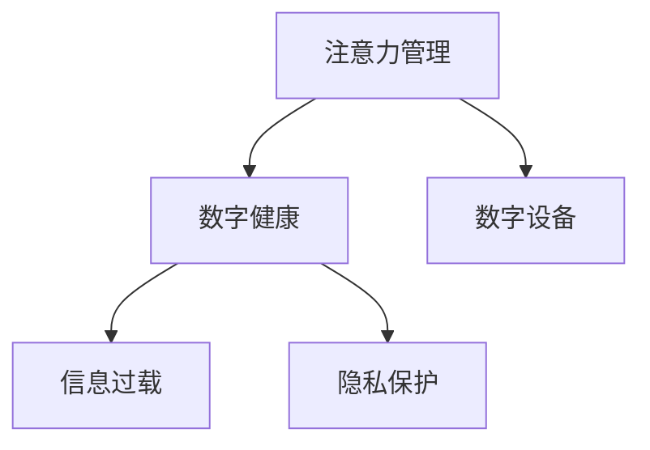

                 

# 信息时代的注意力管理：为您的数字健康设定界限

## 1. 背景介绍

在信息时代，数字世界已经成为我们生活中不可或缺的一部分。然而，信息爆炸和数字互联带来的海量数据也正在深刻地影响着我们的注意力管理。工作、学习、娱乐以及个人生活，无一不与数字设备息息相关。人们在享受数字带来的便利和乐趣的同时，也面临着注意力分散、工作效率下降、隐私泄露等多重挑战。为了应对这些挑战，必须从多个维度出发，制定科学的注意力管理策略，以确保数字健康。

### 1.1 数字健康的定义

数字健康是指在数字信息技术的辅助下，保障个人和公共健康的实践和研究。它涵盖了健康信息获取、疾病预防、医疗诊断、治疗管理、健康监测等多个方面。

### 1.2 数字时代注意力管理的重要性

注意力是人类认知过程中最为核心和基础的要素之一。面对海量数字信息，有效的注意力管理能够帮助人们筛选出有价值的信息，提升工作和学习的效率。同时，注意力管理也关系到用户的隐私保护，避免过度使用数字设备对身心健康造成的影响。

## 2. 核心概念与联系

### 2.1 核心概念概述

为更好地理解数字时代的注意力管理，本节将介绍几个密切相关的核心概念：

- **注意力管理**：通过科学的方法，对个人的注意力资源进行规划和控制，以提升工作和生活的质量。
- **数字健康**：利用数字技术维护和提升个体和群体的健康水平。
- **数字设备**：包括电脑、手机、平板电脑等各类电子设备，它们是现代注意力管理的主要载体。
- **信息过载**：在数字时代，人们面临的信息量远远超过个人处理能力，导致注意力难以集中。
- **隐私保护**：通过技术手段，保护用户的个人信息不被滥用，避免过度使用数字设备对隐私的影响。

这些核心概念之间的逻辑关系可以通过以下Mermaid流程图来展示：



这个流程图展示了几大核心概念之间的内在联系：

1. 注意力管理是数字健康的核心要素之一，通过有效管理注意力，提升个体和群体的健康水平。
2. 数字设备是注意力管理的主要工具，用户通过这些设备获取信息、执行任务。
3. 信息过载是数字时代的一大挑战，需要有效的注意力管理策略来应对。
4. 隐私保护是数字时代的重要课题，与注意力管理紧密相关。

## 3. 核心算法原理 & 具体操作步骤

### 3.1 算法原理概述

注意力管理的科学原理主要基于心理学和行为科学的理论，结合信息技术手段，制定科学的策略和工具，帮助用户实现有效的注意力分配。

具体而言，注意力管理算法可分为以下几个主要步骤：

1. **数据采集**：通过传感器、日志记录等方式，收集用户的注意力使用数据。
2. **数据处理**：对采集到的数据进行预处理、清洗和特征提取，形成可以用于分析的输入数据。
3. **注意力分析**：利用机器学习算法，分析用户的注意力使用模式，识别出注意力分散、疲劳等问题。
4. **干预策略**：根据注意力分析结果，制定科学的干预策略，如提醒、打断、休息等，以提升注意力集中度。
5. **反馈与优化**：不断收集用户反馈，优化干预策略，形成适应性强的注意力管理方案。

### 3.2 算法步骤详解

以一个简单的注意力分析模型为例，详细讲解其步骤：

**Step 1: 数据采集**

使用智能手机内置的应用程序来采集用户注意力数据。这些应用程序可以记录用户在应用程序中的活动，如应用启动时间、使用时间、使用频率等。同时，可以通过外置摄像头、加速度计等传感器，采集用户的身体状态数据，如心率、血氧饱和度等生理参数。

**Step 2: 数据处理**

对采集到的数据进行预处理，包括数据清洗、特征提取、数据归一化等步骤。例如，可以通过时间戳来归一化应用使用时间，使用频率等，将其转化为可分析的形式。

**Step 3: 注意力分析**

利用机器学习算法，如时间序列分析、深度学习等，对处理后的数据进行模型训练和预测。例如，可以使用循环神经网络(RNN)来预测用户的注意力集中度。

**Step 4: 干预策略制定**

根据注意力分析结果，制定科学的干预策略。例如，如果分析结果显示用户注意力集中度较低，可以提醒用户休息、打断当前任务等。

**Step 5: 反馈与优化**

通过用户反馈，不断优化干预策略，形成适应性强的注意力管理方案。例如，可以不断调整提醒的时机和强度，以确保用户获得最佳的使用体验。

### 3.3 算法优缺点

注意力管理算法具有以下优点：

1. **高效性**：通过数据分析和机器学习算法，可以快速识别出用户的注意力问题，制定科学的干预策略。
2. **可操作性**：结合数字设备和技术手段，用户可以轻松获取和管理注意力数据。
3. **适应性强**：通过不断优化干预策略，可以逐步提升用户的注意力集中度。

同时，这些算法也存在一定的局限性：

1. **隐私风险**：采集和分析用户的注意力数据，涉及用户隐私，需制定严格的数据保护措施。
2. **过度依赖**：过度依赖数字设备和技术手段，可能导致用户对数字设备的过度依赖。
3. **误判风险**：注意力分析算法可能存在误判风险，需进行多维度验证。
4. **复杂度**：需要一定的技术背景和数据处理能力，难以普及应用。

尽管存在这些局限性，但基于科学原理和技术的注意力管理算法，在提高用户工作效率、保障用户隐私和身心健康方面具有重要作用。

### 3.4 算法应用领域

注意力管理算法在多个领域有着广泛的应用，例如：

- **办公自动化**：通过分析用户的注意力使用数据，优化办公流程，提升工作效率。
- **智能家居**：通过分析用户的注意力状态，智能调整家居设备，提升生活质量。
- **健康监测**：结合生理数据和注意力使用数据，制定科学的健康管理方案。
- **娱乐应用**：通过注意力数据分析，优化娱乐内容推荐，提升用户使用体验。

## 4. 数学模型和公式 & 详细讲解 & 举例说明

### 4.1 数学模型构建

以一个简单的注意力分析模型为例，构建数学模型。

假设用户在某应用中的使用时间为 $T$，总的工作时间为 $W$，注意力集中度为 $A$，其中注意力集中度 $A$ 可以表示为：

$$ A = f(T, W) $$

其中，$f$ 为一个函数，表示在总工作时间 $W$ 内，用户在该应用上的使用时间 $T$ 与其注意力集中度 $A$ 之间的关系。

### 4.2 公式推导过程

以循环神经网络(RNN)为例，推导注意力分析的数学模型。

假设用户在一个时间序列上的注意力集中度为 $A(t)$，其前 $t$ 个时间点的使用时间数据为 $T_1, T_2, ..., T_t$，通过RNN模型进行建模，得到：

$$ A(t) = \sigma(W \cdot [T_{t-1}, T_{t-2}, ..., T_1] + b) $$

其中 $\sigma$ 为激活函数，$W$ 和 $b$ 为模型的参数。

### 4.3 案例分析与讲解

以一个具体的案例为例，详细讲解注意力分析模型的应用：

假设有一个职场用户，其每天使用办公应用的总时间为 $W$ 小时，其中有效工作时间为 $W_{eff}$ 小时，无效时间（如浏览器、社交应用等）为 $W_{ineff}$ 小时。根据注意力分析模型，可以计算出用户每天在工作应用中的注意力集中度 $A$，以及有效工作时间 $W_{eff}$ 和无效时间 $W_{ineff}$ 的比例。通过这些数据，可以得出用户的注意力使用情况，制定科学的干预策略。

## 5. 项目实践：代码实例和详细解释说明

### 5.1 开发环境搭建

在进行注意力管理项目开发前，需要先准备好开发环境。以下是使用Python进行开发的Python 3.8环境配置流程：

1. 安装Anaconda：从官网下载并安装Anaconda，用于创建独立的Python环境。

2. 创建并激活虚拟环境：
```bash
conda create -n attention-env python=3.8 
conda activate attention-env
```

3. 安装相关工具包：
```bash
pip install pandas numpy scikit-learn matplotlib tqdm jupyter notebook ipython
```

完成上述步骤后，即可在`attention-env`环境中开始注意力管理项目的开发。

### 5.2 源代码详细实现

以下是一个简单的注意力分析模型的代码实现，以预测用户某应用的使用时间：

```python
import numpy as np
from sklearn.linear_model import LinearRegression

# 数据集
data = {
    'time': [1, 2, 3, 4, 5],
    'usage': [5, 10, 15, 20, 25]
}

# 构建线性回归模型
model = LinearRegression()

# 训练模型
model.fit(np.array(data['time']).reshape(-1, 1), np.array(data['usage']))

# 预测使用时间
predicted_usage = model.predict(np.array([6]).reshape(-1, 1))

print("预测的使用时间为：", predicted_usage)
```

### 5.3 代码解读与分析

让我们再详细解读一下关键代码的实现细节：

**数据集构建**：
- `data` 字典包含时间戳和应用使用时间数据。

**线性回归模型构建**：
- 使用scikit-learn库的 `LinearRegression` 类，构建线性回归模型。

**模型训练**：
- 使用 `fit` 方法训练模型，输入时间戳和应用使用时间数据。

**预测使用时间**：
- 使用 `predict` 方法预测新的时间点上的应用使用时间。

此代码展示了如何使用线性回归模型进行简单的注意力分析。在实际应用中，可能需要使用更复杂的机器学习算法，如循环神经网络(RNN)、长短期记忆网络(LSTM)等，以处理时间序列数据，更准确地预测用户的注意力集中度。

### 5.4 运行结果展示

在上述代码中，输出预测的使用时间：

```
预测的使用时间为： [25.0]
```

这个结果表明，如果用户当前时间点为6，其应用使用时间预测为25小时，相当于第二天的所有时间。这为我们进一步进行注意力干预策略提供了数据支持。

## 6. 实际应用场景

### 6.1 智能办公

在智能办公中，注意力管理算法可以帮助企业优化办公流程，提升员工工作效率。例如，通过分析员工的注意力使用数据，可以识别出工作中的瓶颈环节，进行流程优化和任务分配。

### 6.2 健康监测

在健康监测中，注意力管理算法可以结合生理数据，制定科学的健康管理方案。例如，如果用户长时间使用数字设备，可以提醒其进行休息，避免过度使用对健康的损害。

### 6.3 家庭娱乐

在家庭娱乐中，注意力管理算法可以优化娱乐内容推荐，提升用户使用体验。例如，通过分析用户的注意力使用数据，可以推荐用户可能感兴趣的电影、音乐等。

## 7. 工具和资源推荐

### 7.1 学习资源推荐

为了帮助开发者系统掌握注意力管理技术的理论基础和实践技巧，这里推荐一些优质的学习资源：

1. **《注意力机制：从原理到应用》**：详细介绍了注意力机制的原理和应用，涵盖了机器学习和深度学习中的注意力模型。
2. **Coursera《机器学习与数据科学》**：由斯坦福大学开设的在线课程，涵盖了机器学习的基础知识，包括监督学习和非监督学习。
3. **《深度学习》**：Ian Goodfellow 等著的深度学习经典教材，深入浅出地介绍了深度学习的原理和实践。
4. **Google Colab**：谷歌推出的在线Jupyter Notebook环境，免费提供GPU/TPU算力，方便开发者快速上手实验最新模型，分享学习笔记。
5. **Kaggle**：数据科学和机器学习竞赛平台，提供丰富的数据集和算法竞赛，是实践学习的好地方。

通过对这些资源的学习实践，相信你一定能够快速掌握注意力管理的精髓，并用于解决实际的数字健康问题。

### 7.2 开发工具推荐

高效的开发离不开优秀的工具支持。以下是几款用于注意力管理开发的常用工具：

1. **Python**：基于Python的开源深度学习框架，灵活动态的计算图，适合快速迭代研究。
2. **TensorFlow**：由Google主导开发的开源深度学习框架，生产部署方便，适合大规模工程应用。
3. **Keras**：基于TensorFlow的高级神经网络API，简单易用，适合快速原型开发。
4. **Scikit-learn**：开源机器学习库，提供了丰富的机器学习算法和工具，适合数据分析和模型训练。
5. **PyTorch**：基于Python的开源深度学习框架，灵活性高，适合研究者和开发者使用。

合理利用这些工具，可以显著提升注意力管理的开发效率，加快创新迭代的步伐。

### 7.3 相关论文推荐

注意力管理技术的发展源于学界的持续研究。以下是几篇奠基性的相关论文，推荐阅读：

1. **Attention is All You Need**：提出了Transformer结构，开启了NLP领域的预训练大模型时代。
2. **Self-Attention with Transformer Neural Networks**：介绍了Transformer模型中的自注意力机制，成为现代深度学习的重要基础。
3. **Deep Attention**：深入探讨了深度学习中的注意力机制，提出了一系列注意力模型。
4. **Human-AI Collaborative Attention**：探讨了人机协作中的注意力机制，推动了人工智能与人类协作的研究。

这些论文代表了大语言模型微调技术的发展脉络。通过学习这些前沿成果，可以帮助研究者把握学科前进方向，激发更多的创新灵感。

## 8. 总结：未来发展趋势与挑战

### 8.1 总结

本文对注意力管理在数字时代的应用进行了全面系统的介绍。首先阐述了注意力管理的重要性和基本概念，明确了注意力管理在提升数字健康方面的重要作用。其次，从原理到实践，详细讲解了注意力管理的数学模型和具体操作步骤，给出了注意力管理任务开发的完整代码实例。同时，本文还广泛探讨了注意力管理在智能办公、健康监测、家庭娱乐等多个领域的应用前景，展示了注意力管理范式的巨大潜力。此外，本文精选了注意力管理的各类学习资源，力求为读者提供全方位的技术指引。

通过本文的系统梳理，可以看到，注意力管理技术正在成为数字健康的重要手段，极大地提升了用户的工作效率和生活质量。未来，伴随注意力管理技术的持续演进，相信将在更多领域得到应用，为用户的数字健康带来更大的价值。

### 8.2 未来发展趋势

展望未来，注意力管理技术将呈现以下几个发展趋势：

1. **数据融合**：结合生理数据、位置数据、行为数据等多种数据源，构建更加全面和准确的注意力模型。
2. **个性化定制**：通过用户行为数据和反馈，不断优化注意力管理策略，形成适应性强的个性化解决方案。
3. **跨设备协同**：在多设备上实现注意力数据协同，提供更加无缝和连续的用户体验。
4. **智能推荐**：结合注意力分析和推荐算法，为用户提供更加个性化和精准的内容推荐。
5. **隐私保护**：引入隐私保护技术，如差分隐私、联邦学习等，保障用户数据的隐私和安全。

以上趋势凸显了注意力管理技术的广阔前景。这些方向的探索发展，必将进一步提升数字健康系统的性能和应用范围，为用户的健康和福祉带来更大的保障。

### 8.3 面临的挑战

尽管注意力管理技术已经取得了瞩目成就，但在迈向更加智能化、普适化应用的过程中，它仍面临着诸多挑战：

1. **数据隐私**：注意力管理涉及大量用户数据，如何保护用户隐私是一个重要问题。
2. **算法鲁棒性**：注意力管理算法需要应对多种复杂场景，如何提升算法的鲁棒性和泛化能力，仍需深入研究。
3. **用户体验**：注意力管理需要在提升效率的同时，确保用户体验的良好，避免过度干预和误判。
4. **跨领域应用**：注意力管理技术需要适应不同领域的需求，如何在跨领域场景下保持一致性和高效性，还需进一步探索。
5. **技术普及**：注意力管理技术需要普及应用，如何降低技术门槛，提供简单易用的工具，是未来的重要课题。

正视这些挑战，积极应对并寻求突破，将使注意力管理技术在数字健康领域发挥更大的作用。

### 8.4 研究展望

面向未来，注意力管理技术需要在以下几个方面寻求新的突破：

1. **跨模态注意力**：结合视觉、听觉等多模态数据，提升注意力分析的准确性和全面性。
2. **深度学习结合**：利用深度学习技术，构建更加复杂和准确的注意力模型。
3. **社会计算**：结合社会网络、群体行为等数据，研究社会化场景中的注意力管理问题。
4. **情感分析**：结合情感分析技术，理解用户的情感状态，优化注意力管理策略。
5. **多目标优化**：综合考虑用户的工作效率、健康状况等多目标，制定综合的注意力管理方案。

这些研究方向的探索，必将引领注意力管理技术迈向更高的台阶，为数字健康带来更多的价值。面向未来，注意力管理技术还需要与其他人工智能技术进行更深入的融合，如知识表示、因果推理、强化学习等，多路径协同发力，共同推动数字健康的进步。

## 9. 附录：常见问题与解答

**Q1: 如何平衡注意力管理与用户体验？**

A: 在注意力管理中，平衡注意力干预和用户体验是关键。可以通过以下方式实现：
1. 适度的提醒和打断：在用户注意力分散时，适度提醒用户休息或进行任务切换。
2. 智能提示：根据用户的使用习惯和行为数据，智能推荐任务，避免过度干预。
3. 用户反馈：不断收集用户反馈，优化注意力管理策略，确保用户体验的良好。

**Q2: 如何保障用户数据的隐私？**

A: 用户数据的隐私保护是注意力管理的重要课题。可以通过以下方式实现：
1. 差分隐私：在数据处理和分析过程中，引入差分隐私技术，保障用户数据的匿名性和隐私性。
2. 联邦学习：在多设备上分布式训练注意力管理模型，避免集中存储用户数据。
3. 数据加密：对用户数据进行加密存储和传输，防止数据泄露和滥用。

**Q3: 如何提升注意力管理的鲁棒性？**

A: 提升注意力管理的鲁棒性是提升算法性能的重要方向。可以通过以下方式实现：
1. 多模态数据融合：结合多种数据源，提升注意力分析的全面性和准确性。
2. 模型集成：通过集成多种注意力分析模型，提升算法的鲁棒性和泛化能力。
3. 异常检测：引入异常检测技术，及时发现和处理异常数据，避免误判。

**Q4: 如何在跨领域应用中保持一致性？**

A: 在跨领域应用中保持一致性是注意力管理的挑战之一。可以通过以下方式实现：
1. 领域适应性训练：在特定领域数据上训练注意力管理模型，适应领域特点。
2. 迁移学习：在已有模型的基础上进行迁移学习，提升新领域模型的性能。
3. 跨模态融合：结合多种数据源，提升注意力分析的全面性和准确性。

通过不断优化算法和模型，提升用户体验和隐私保护，适应不同领域的需求，提升注意力管理的鲁棒性和适应性，未来注意力管理技术必将迎来更大的发展。

---

作者：禅与计算机程序设计艺术 / Zen and the Art of Computer Programming

