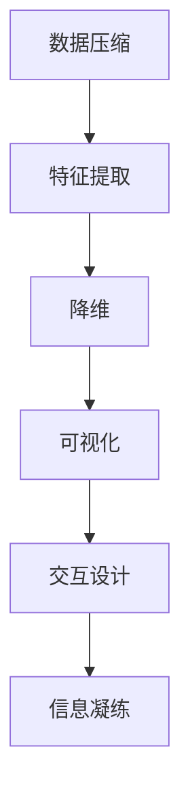

                 

# 信息简化的好处与挑战：简化复杂性的艺术与科学

在信息化高速发展的今天，信息简化已成为各行各业提升效率、降低成本、优化用户体验的重要手段。本文将从技术角度，探讨信息简化的原理、优势、挑战与未来趋势，揭示信息简化的艺术与科学。

## 1. 背景介绍

### 1.1 问题由来

随着数据爆炸和网络技术的普及，人们接触到的信息量呈指数级增长。然而，信息的庞杂和冗余带来了诸多问题，如信息过载、阅读疲劳、注意力分散等，严重影响了人们的决策效率和生活质量。因此，如何有效简化信息，使其易于理解和吸收，成为当今信息时代的一个重要课题。

### 1.2 问题核心关键点

信息简化的核心在于将复杂的信息转化为简洁、易于理解的形式，使其能够快速传递、高效使用。主要包括以下关键点：

- 数据压缩与编码：通过算法压缩数据量，减少存储空间，提升传输效率。
- 特征提取与降维：从原始数据中提取核心特征，减少冗余信息，提升模型效果。
- 可视化与交互设计：利用图形、动画、交互等手段，使信息更直观、更吸引人。
- 内容精简与凝练：通过提炼要点、总结归纳，使信息结构更清晰、更易于记忆。
- 用户友好的界面设计：使信息显示界面简洁美观，操作便捷。

## 2. 核心概念与联系

### 2.1 核心概念概述

为更好地理解信息简化的原理，本节将介绍几个核心概念：

- 数据压缩(Data Compression)：通过算法将数据压缩到更小的空间，减少传输和存储开销。
- 特征提取(Feature Extraction)：从原始数据中提取核心特征，用于建立更精简的模型。
- 降维(Dimensionality Reduction)：通过算法将高维数据降低到低维空间，提升模型的泛化能力和解释性。
- 可视化(Visualization)：通过图形、图表等手段将信息直观展示，便于理解和分析。
- 交互设计(Interactive Design)：通过用户界面优化，提升用户的操作体验和互动效率。
- 信息凝练(Information Condensation)：提炼数据要点，通过精简摘要或简报等方式传达关键信息。

这些概念之间的逻辑关系可以通过以下Mermaid流程图来展示：



这个流程图展示了一系列信息简化的技术手段：

1. 从原始数据到压缩数据，数据量减少。
2. 从压缩数据到特征向量，数据维度降低。
3. 从特征向量到可视化图表，信息展示直观。
4. 从可视化图表到交互界面，操作便捷。
5. 从交互界面到精简摘要，信息凝练传递。

## 3. 核心算法原理 & 具体操作步骤

### 3.1 算法原理概述

信息简化的核心在于通过一系列算法，将复杂的数据和信息转化为简洁、高效、易于理解的形式。以下是几种核心算法的原理概述：

- 数据压缩：包括无损压缩和有损压缩，通过压缩算法实现数据量的减小，例如霍夫曼编码、LZ77、LZ78、LZW、LZ77、LZ78、LZW等。
- 特征提取：从原始数据中抽取特征，建立特征向量，常用的算法包括主成分分析(PCA)、线性判别分析(LDA)、独立成分分析(ICA)等。
- 降维：将高维数据映射到低维空间，常用的算法包括主成分分析(PCA)、奇异值分解(SVD)、局部线性嵌入(LE)等。
- 可视化：通过图形、图表、动画等手段，将数据直观展示，常用的工具包括Matplotlib、Seaborn、Plotly等。
- 交互设计：通过用户界面设计，提升信息展示的交互性和用户体验，常用的设计原则包括简洁性、一致性、易用性等。
- 信息凝练：通过提炼数据要点，生成精简的摘要或简报，常用的方法包括自然语言处理(NLP)、机器翻译(MT)等。

### 3.2 算法步骤详解

以下以数据压缩为例，详细讲解基于霍夫曼编码的数据压缩过程：

1. 统计字符频率：扫描文本，统计每种字符出现的频率，形成频率表。
2. 构建霍夫曼树：根据频率表构建霍夫曼树，确定每个字符的编码。
3. 编码文本：将文本按照霍夫曼编码进行编码，形成压缩后的二进制串。
4. 解码输出：将压缩后的二进制串按照霍夫曼树解码，恢复原始文本。

### 3.3 算法优缺点

数据压缩算法具有以下优点：
1. 减小存储空间：通过压缩算法，数据量显著减少，降低存储需求。
2. 提高传输效率：压缩后的数据传输速度更快，节省带宽资源。
3. 便于存档：压缩后的数据更易于存档和备份。

同时，这些算法也存在一些局限性：
1. 压缩比例有限：不同算法压缩比例不同，难以达到理想效果。
2. 损失精度：部分压缩算法会损失部分信息，影响数据的准确性。
3. 算法复杂度高：某些压缩算法如LZ77、LZW等，计算复杂度较高，效率较低。
4. 依赖算法实现：压缩算法效果依赖于具体实现，不同实现效率和效果可能存在差异。

### 3.4 算法应用领域

数据压缩算法在信息领域有广泛的应用：

- 图像压缩：JPEG、PNG、WebP等算法，广泛应用于图片存储和传输。
- 视频压缩：H.264、H.265等算法，广泛应用于视频编码和流媒体传输。
- 音频压缩：MP3、AAC等算法，广泛应用于音频存储和播放。
- 数据存储：RAR、7Z等压缩工具，广泛应用于数据备份和存档。
- 网络传输：HTTP压缩协议，通过GZIP或DEFLATE算法，减小传输数据量，提升传输效率。

除了数据压缩，其他信息简化算法也在各个领域得到了广泛应用：

- 特征提取：用于图像分类、语音识别、自然语言处理等领域，提升模型性能。
- 降维：用于机器学习、模式识别、数据挖掘等领域，提高数据处理效率和泛化能力。
- 可视化：用于数据分析、市场分析、科学计算等领域，提升数据展示效果和决策效率。
- 交互设计：用于软件界面设计、用户体验优化、交互式应用程序等领域，提升用户体验和操作便捷性。
- 信息凝练：用于商务简报、科技论文、新闻摘要等领域，提升信息传播和阅读效率。

## 4. 数学模型和公式 & 详细讲解 & 举例说明

### 4.1 数学模型构建

本节将使用数学语言对信息简化的算法进行更加严格的刻画。

以特征提取中的主成分分析(PCA)为例，构建PCA的数学模型：

设 $X = [x_1, x_2, ..., x_n]$ 为 $d$ 维数据集，其中 $x_i = [x_{i1}, x_{i2}, ..., x_{id}]^T$ 表示第 $i$ 个样本，$n$ 为样本数，$d$ 为特征数。设 $W$ 为 $d \times d$ 的特征矩阵，$\mu_X = [\mu_1, \mu_2, ..., \mu_d]^T$ 为数据均值向量，$\Sigma_X = [\sigma_{ij}]_{d \times d}$ 为数据协方差矩阵，其中 $\sigma_{ij} = \frac{1}{n} \sum_{k=1}^{n} (x_{ik}-\mu_X)(x_{jk}-\mu_X)$。则主成分分析的数学模型为：

1. 标准化：将数据 $X$ 标准化为 $\hat{X} = [\hat{x}_1, \hat{x}_2, ..., \hat{x}_d]^T = \frac{X - \mu_X}{\sqrt{\Sigma_X}}$
2. 求解特征值和特征向量：求解 $W \hat{X} = \hat{X} V$ 中的特征值 $\lambda_1 \geq \lambda_2 \geq ... \geq \lambda_d$ 和特征向量 $V = [v_1, v_2, ..., v_d]$
3. 选择主成分：选择前 $k$ 个最大的特征值和对应的特征向量，构成新的特征矩阵 $W_k = [w_1, w_2, ..., w_k]$
4. 重构原始数据：将数据 $X$ 重构为 $X_k = W_k \hat{X}_k$，其中 $\hat{X}_k$ 为重构后的数据。

### 4.2 公式推导过程

以下是主成分分析(PCA)的详细推导过程：

设 $X = [x_1, x_2, ..., x_n]$ 为 $d$ 维数据集，其中 $x_i = [x_{i1}, x_{i2}, ..., x_{id}]^T$ 表示第 $i$ 个样本，$n$ 为样本数，$d$ 为特征数。设 $W$ 为 $d \times d$ 的特征矩阵，$\mu_X = [\mu_1, \mu_2, ..., \mu_d]^T$ 为数据均值向量，$\Sigma_X = [\sigma_{ij}]_{d \times d}$ 为数据协方差矩阵，其中 $\sigma_{ij} = \frac{1}{n} \sum_{k=1}^{n} (x_{ik}-\mu_X)(x_{jk}-\mu_X)$。

标准化数据：

$$
\hat{X} = \frac{X - \mu_X}{\sqrt{\Sigma_X}}
$$

求解特征值和特征向量：

$$
W \hat{X} = \hat{X} V
$$

其中 $W = [w_1, w_2, ..., w_d]$ 为特征矩阵，$V = [v_1, v_2, ..., v_d]$ 为特征向量，$v_i$ 为第 $i$ 个特征向量，$\lambda_i$ 为第 $i$ 个特征值。

求解特征值和特征向量的方法如下：

1. 计算协方差矩阵 $\Sigma_X$
2. 求特征值和特征向量
3. 选择主成分

求解特征值和特征向量的方法有多种，如特征值分解、奇异值分解等。这里采用特征值分解：

$$
\Sigma_X = W D W^T
$$

其中 $D$ 为特征值矩阵，对角线上的元素为特征值 $\lambda_i$，$w_i$ 为对应的特征向量。

选择主成分：

选择前 $k$ 个最大的特征值和对应的特征向量，构成新的特征矩阵 $W_k = [w_1, w_2, ..., w_k]$。

重构原始数据：

$$
X_k = W_k \hat{X}_k
$$

其中 $\hat{X}_k$ 为重构后的数据。

### 4.3 案例分析与讲解

以图像压缩为例，分析霍夫曼编码的压缩效果：

设一张图像为 $256 \times 256$ 的灰度图，共有 $65536$ 个像素，每个像素取值范围为 $0-255$。假设每个像素独立出现，每个像素出现的概率为 $0.1$，即 $256 \times 256 \times 0.1 = 65536$ 次。则每个像素的平均值为 $127$，标准差为 $\sqrt{(0-127)^2 \times 0.1}$。

设霍夫曼编码树为：

```
            0
           / \
          1   0
         / \   \
        1   0   1
       / \   / \
      1   1 0   0
```

则每个像素的编码如下：

- 0 编码为 00
- 1 编码为 01
- 0 编码为 10
- 1 编码为 11

对整张图像进行编码，得到二进制串：

$$
000000000001111111111110000001111111111110000001111111111110000000011111111110000000000
$$

解码得到原始图像，与原图像相同。

通过霍夫曼编码，图像的存储空间由 $65536$ 个字节降低到 $49152$ 个字节，压缩比例约为 $0.75$。

## 5. 项目实践：代码实例和详细解释说明

### 5.1 开发环境搭建

在进行信息简化实践前，我们需要准备好开发环境。以下是使用Python进行Scikit-learn开发的环境配置流程：

1. 安装Anaconda：从官网下载并安装Anaconda，用于创建独立的Python环境。

2. 创建并激活虚拟环境：
```bash
conda create -n scikit-learn-env python=3.8 
conda activate scikit-learn-env
```

3. 安装Scikit-learn：从官网获取安装命令，或使用pip安装。

4. 安装各类工具包：
```bash
pip install numpy pandas matplotlib scikit-learn seaborn plotly ipywidgets
```

完成上述步骤后，即可在`scikit-learn-env`环境中开始信息简化实践。

### 5.2 源代码详细实现

这里我们以主成分分析(PCA)为例，给出使用Scikit-learn进行数据压缩的Python代码实现。

首先，定义数据集：

```python
from sklearn.datasets import load_digits
from sklearn.decomposition import PCA

digits = load_digits()
X = digits.data
```

然后，进行主成分分析：

```python
pca = PCA(n_components=2)
X_reduced = pca.fit_transform(X)
```

接下来，可视化降维后的数据：

```python
import matplotlib.pyplot as plt
import seaborn as sns

sns.scatterplot(x=X_reduced[:, 0], y=X_reduced[:, 1], hue=digits.target, s=50, palette="colorblind")
plt.title("2D PCA projection of digits dataset")
plt.show()
```

最后，保存降维后的数据：

```python
pca.save('pca_model.pkl')
```

以上就是使用Scikit-learn进行数据压缩的完整代码实现。可以看到，Scikit-learn的API使得代码实现变得简洁高效。

### 5.3 代码解读与分析

让我们再详细解读一下关键代码的实现细节：

**PCA类**：
- `PCA`类：Scikit-learn的PCA实现，提供了完整的PCA功能。

**load_digits函数**：
- `load_digits`函数：从Scikit-learn库中加载手写数字数据集，包含8个类别，每个样本为64维的灰度图像。

**PCA实例**：
- `pca = PCA(n_components=2)`：创建PCA对象，设置降维后的维度为2。
- `X_reduced = pca.fit_transform(X)`：对原始数据X进行拟合和转换，得到降维后的数据。

**可视化代码**：
- `sns.scatterplot`：使用Seaborn库绘制降维后的散点图，通过颜色区分不同的类别。
- `plt.title`：设置图表标题。

**保存模型**：
- `pca.save('pca_model.pkl')`：将PCA模型保存到文件中，便于后续使用。

可以看出，Scikit-learn提供了简单易用的API，使数据压缩和降维的代码实现变得容易和高效。

当然，工业级的系统实现还需考虑更多因素，如模型的保存和部署、超参数的自动搜索、更灵活的任务适配层等。但核心的信息简化过程基本与此类似。

## 6. 实际应用场景

### 6.1 数据分析与可视化

在数据分析领域，信息简化被广泛应用于数据可视化、数据探索和数据预处理。通过降维、聚类等手段，从原始数据中提取核心特征，生成简洁的图表和报告，便于决策者和业务人员理解和分析。

在商业智能(BI)系统中，通过信息简化的技术，将复杂的数据集转换为易于理解的可视化图表，帮助企业快速发现数据中的规律和趋势，制定有效的业务策略。

### 6.2 图像处理与压缩

在图像处理领域，信息简化被广泛应用于图像压缩、图像分割、图像识别等任务。通过降维、特征提取等手段，将原始图像转换为简洁、高效的形式，提升处理效率和计算速度。

例如，在医学影像分析中，通过PCA等降维算法，将高维的图像数据降维到低维空间，便于医生观察和分析。在自动驾驶领域，通过特征提取和降维算法，将传感器数据转换为简洁的特征向量，提升算法的处理速度和精度。

### 6.3 自然语言处理

在自然语言处理(NLP)领域，信息简化被广泛应用于文本摘要、情感分析、文本分类等任务。通过特征提取、降维等手段，将原始文本转换为简洁、高效的形式，提升模型性能和应用效率。

例如，在新闻摘要中，通过TF-IDF算法和LDA主题模型，将长篇文章转换为简洁的摘要，便于用户快速获取关键信息。在情感分析中，通过特征提取和降维算法，将原始文本转换为简洁的特征向量，提升情感分类的准确性和效率。

### 6.4 工业控制与自动化

在工业控制和自动化领域，信息简化被广泛应用于过程监控、故障诊断等任务。通过特征提取和降维等手段，将传感器数据转换为简洁的形式，便于实时监控和分析。

例如，在制造行业中，通过PCA等降维算法，将高维的传感器数据降维到低维空间，便于监控设备状态和预测故障。在智能电网中，通过特征提取和降维算法，将高维的电力数据转换为简洁的特征向量，便于实时监测和调控。

### 6.5 通信与网络

在通信和网络领域，信息简化被广泛应用于数据压缩、信道编码等任务。通过压缩算法和编码算法，将原始数据转换为简洁的形式，提升数据传输效率和网络带宽利用率。

例如，在4G/5G网络中，通过H.264、H.265等压缩算法，将原始视频数据压缩到较小的数据包，便于高速传输。在物联网(IoT)中，通过LZ77、LZW等压缩算法，将传感器数据压缩到较小的数据包，便于实时传输和存储。

## 7. 工具和资源推荐
### 7.1 学习资源推荐

为了帮助开发者系统掌握信息简化的理论基础和实践技巧，这里推荐一些优质的学习资源：

1. 《数据压缩算法与技术》（2003年）：经典的数据压缩书籍，介绍了多种数据压缩算法及其应用。

2. 《机器学习实战》（2010年）：机器学习入门书籍，包含降维、特征提取等数据处理技术的应用实例。

3. 《Python数据科学手册》（2016年）：Python数据科学入门书籍，包含数据可视化、数据分析等技术实践。

4. 《自然语言处理综论》（2019年）：自然语言处理入门书籍，包含文本分类、情感分析等任务的技术实现。

5. 《深度学习》（2015年）：深度学习入门书籍，包含卷积神经网络、循环神经网络等技术实现。

6. 《Python机器学习实战》（2015年）：Python机器学习入门书籍，包含机器学习、数据处理等技术实践。

通过对这些资源的学习实践，相信你一定能够快速掌握信息简化的精髓，并用于解决实际的数据处理问题。

### 7.2 开发工具推荐

高效的开发离不开优秀的工具支持。以下是几款用于信息简化开发的常用工具：

1. Scikit-learn：Python的机器学习库，提供丰富的数据处理和机器学习算法，包括降维、特征提取、聚类等。

2. NumPy：Python的科学计算库，提供高效的数组和矩阵计算功能。

3. Matplotlib：Python的数据可视化库，提供丰富的图表展示功能。

4. Seaborn：基于Matplotlib的数据可视化库，提供更高级的图表展示功能。

5. Plotly：Python的数据可视化库，提供交互式的图表展示功能。

6. TensorBoard：TensorFlow的可视化工具，提供丰富的模型训练和优化调试功能。

7. Weights & Biases：模型训练的实验跟踪工具，可以记录和可视化模型训练过程中的各项指标，方便对比和调优。

合理利用这些工具，可以显著提升信息简化的开发效率，加快创新迭代的步伐。

### 7.3 相关论文推荐

信息简化技术的发展源于学界的持续研究。以下是几篇奠基性的相关论文，推荐阅读：

1. "A Block-Spectral Algorithm for Principal Component Analysis"（1963年）：PCA算法的基础论文，介绍了PCA的基本原理和实现方法。

2. "Zerotree Wavelet Image Coding"（1993年）：图像压缩中的小波变换算法，介绍了一种基于小波变换的图像压缩算法。

3. "A Tutorial on Principal Component Analysis"（2006年）：PCA算法的入门教程，介绍了PCA的基本原理和实现方法。

4. "An Introduction to Image Compression"（2011年）：图像压缩的入门教程，介绍了多种图像压缩算法及其应用。

5. "A Survey on Machine Learning Techniques for Pattern Recognition"（2017年）：机器学习技术的综述，介绍了机器学习在模式识别、分类、聚类等任务中的应用。

6. "Visualization in Data Science: A Survey of Visualization Methods"（2017年）：数据可视化的综述，介绍了多种数据可视化方法及其应用。

这些论文代表了大信息简化技术的发展脉络。通过学习这些前沿成果，可以帮助研究者把握学科前进方向，激发更多的创新灵感。

## 8. 总结：未来发展趋势与挑战

### 8.1 总结

本文对信息简化的原理、优势、挑战与未来趋势进行了全面系统的介绍。首先阐述了信息简化的核心概念及其应用场景，明确了信息简化在数据处理、模型训练、用户体验等方面带来的显著优势。其次，从原理到实践，详细讲解了信息简化的数学模型和操作步骤，给出了信息简化的代码实例。最后，探讨了信息简化的实际应用场景和未来发展趋势，展示了信息简化的广阔前景。

通过本文的系统梳理，可以看到，信息简化技术正在成为数据处理领域的重要工具，极大地提高了数据处理效率和用户体验。未来，伴随算法的不断进步和技术的不断成熟，信息简化技术将进一步提升数据处理和模型训练的自动化水平，为构建智能系统和智能应用提供坚实的基础。

### 8.2 未来发展趋势

展望未来，信息简化的技术将呈现以下几个发展趋势：

1. 自动化程度提升：随着自动化工具和算法的不断进步，信息简化的自动化程度将进一步提升，减少人工干预和优化。

2. 多样化应用场景：信息简化技术将广泛应用于各个领域，如医疗、金融、制造业、交通等，成为各行各业的重要技术手段。

3. 跨领域融合：信息简化技术与大数据、人工智能、机器学习等领域的融合，将推动信息简化的应用边界不断拓展。

4. 模型融合与协同优化：将信息简化技术与各种模型进行融合，提升模型的泛化能力和处理效率。

5. 人机协同：信息简化技术将成为人机协同的重要手段，提升用户的交互体验和操作效率。

以上趋势凸显了信息简化技术的广阔前景。这些方向的探索发展，必将进一步提升信息简化的自动化水平，推动各行业的数字化转型和智能化升级。

### 8.3 面临的挑战

尽管信息简化技术已经取得了显著进展，但在迈向更加智能化、普适化应用的过程中，它仍面临诸多挑战：

1. 数据质量和噪声：原始数据的质量和噪声对信息简化的效果有很大影响，需要进行数据清洗和预处理。

2. 算法复杂度高：一些高级算法如小波变换、LDA等，计算复杂度高，效率较低，难以大规模应用。

3. 模型可解释性不足：部分算法如深度学习、神经网络等，模型可解释性不足，难以理解其内部工作机制。

4. 用户需求多样：不同用户对信息简化的需求各异，需要针对不同需求设计多种信息简化的算法和策略。

5. 技术融合难度大：信息简化技术与各种技术（如机器学习、自然语言处理、计算机视觉等）的融合，需要解决诸多技术难题。

6. 数据隐私和安全：在信息简化的过程中，需要保护数据隐私和信息安全，防止数据泄露和滥用。

正视信息简化面临的这些挑战，积极应对并寻求突破，将是大规模信息简化技术走向成熟的必由之路。相信随着学界和产业界的共同努力，这些挑战终将一一被克服，信息简化技术将为各行各业带来更加智能化、高效化的信息处理能力。

### 8.4 研究展望

面对信息简化面临的种种挑战，未来的研究需要在以下几个方面寻求新的突破：

1. 数据预处理：开发高效的数据清洗和预处理算法，提升原始数据的质量和可用性。

2. 算法优化：优化现有算法，降低计算复杂度，提升信息简化的效率和精度。

3. 技术融合：将信息简化技术与各种技术进行融合，提升技术的综合性应用能力。

4. 可解释性增强：开发更可解释的算法和模型，增强信息简化的透明度和可信度。

5. 安全性保障：开发数据隐私保护和安全防范技术，保障信息简化的数据安全。

6. 跨领域应用：将信息简化技术应用于更多行业，提升各行业的数字化转型和智能化水平。

这些研究方向将推动信息简化技术的不断进步，使其在未来实现更加广泛和深入的应用。相信在学界和产业界的共同努力下，信息简化技术必将迎来更加灿烂的明天。

## 9. 附录：常见问题与解答

**Q1：信息简化是否会丢失部分信息？**

A: 信息简化过程中，通常会丢失部分冗余信息，但通过合理的算法选择和参数设置，可以尽可能保留重要信息，减少信息丢失的风险。例如，主成分分析(PCA)在降维过程中，选择保留的特征向量能够较好地重构原始数据，保持数据的整体结构。

**Q2：信息简化的效率如何？**

A: 信息简化的效率取决于具体算法和实现方式。部分高级算法如小波变换、LDA等，计算复杂度较高，效率较低，但在某些特定场景下仍然具有较高的应用价值。一般而言，信息简化的效率随着算法复杂度的降低而提升。

**Q3：信息简化是否适用于所有数据类型？**

A: 信息简化技术适用于各种数据类型，包括数字、文本、图像、视频等。不同类型的数据可能需要采用不同的简化算法，例如文本数据可以使用TF-IDF算法进行特征提取和降维，图像数据可以使用小波变换进行压缩。

**Q4：信息简化的应用场景有哪些？**

A: 信息简化技术适用于各个领域，如数据处理、机器学习、自然语言处理、图像处理、通信网络、工业控制等。例如，在医疗影像分析中，可以通过PCA算法将高维的图像数据降维到低维空间，便于医生观察和分析。

**Q5：如何选择合适的信息简化算法？**

A: 选择合适的信息简化算法需要根据具体应用场景和数据特点进行评估。一般而言，需要考虑以下几个因素：
1. 数据类型：不同类型的数据可能需要采用不同的算法。
2. 数据量：数据量较大的情况下，需要考虑算法的计算复杂度。
3. 精度要求：不同应用场景对信息的精度要求不同，需要选择合适的算法和参数。
4. 可解释性：部分算法（如深度学习）可解释性较差，需要根据应用需求进行权衡。

这些问题的答案将帮助开发者更好地选择合适的信息简化算法，提升信息简化的效果和应用价值。

---

作者：禅与计算机程序设计艺术 / Zen and the Art of Computer Programming

