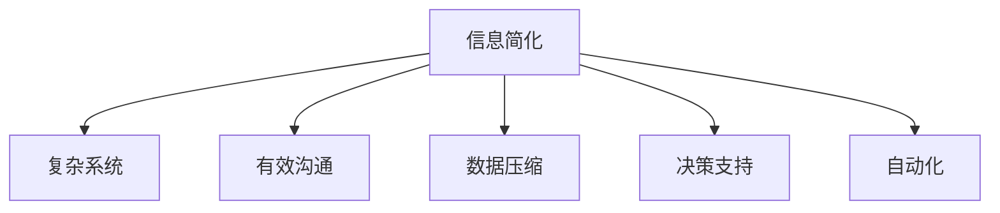

                 

# 信息简化的好处与艺术：在复杂世界中简化以提高生活质量和效率

> 关键词：信息简化,复杂系统,有效沟通,数据压缩,决策支持,自动化,生活优化

## 1. 背景介绍

### 1.1 问题由来
在现代信息爆炸的时代，人们每天都被海量数据和信息所淹没。从新闻资讯到社交媒体，从电子邮件到在线文档，信息量的增长速度远超我们的处理能力。面对如此庞杂的信息流，如何筛选和简化信息，有效提取有用的知识，成为了提升生活质量和效率的关键。

### 1.2 问题核心关键点
信息简化的核心在于如何通过减少数据量、压缩信息表达、提高信息可读性等手段，使我们能够更快地理解复杂系统、做出更准确的决策、提高工作效率，从而改善生活质量。

## 2. 核心概念与联系

### 2.1 核心概念概述

为了更好地理解信息简化的原理和实践方法，本节将介绍几个核心概念：

- 信息简化(Information Simplification)：通过去除冗余信息、压缩表达、提取关键内容等手段，将复杂信息转化为易于理解和处理的简单形式。
- 复杂系统(Complex System)：由大量相互关联的元素组成，内部运作机制复杂多变，难以直观理解的系统，如金融市场、气候系统等。
- 有效沟通(Effective Communication)：以简单明了的语言、图表等方式，将复杂问题、决策结果、研究成果等准确传达给他人的过程。
- 数据压缩(Data Compression)：通过算法将大量冗余数据减少到最小，同时尽可能保留原有信息的过程。
- 决策支持(Decision Support)：通过简化的信息帮助决策者快速做出高质量的决策。
- 自动化(Automatic)：利用计算机算法自动执行信息简化任务，提高效率。

这些概念之间的逻辑关系可以通过以下Mermaid流程图来展示：



这个流程图展示的信息简化的核心概念及其与其他概念的联系：

1. 信息简化使得复杂系统更容易理解，从而支持有效沟通和决策支持。
2. 数据压缩是信息简化的基础技术，用于减少冗余信息。
3. 自动化利用算法提高信息简化的效率，使整个过程更加高效。

## 3. 核心算法原理 & 具体操作步骤
### 3.1 算法原理概述

信息简化通常采用以下几种策略：

- **信息压缩(Information Compression)**：去除冗余信息，压缩表达。
- **信息提取(Information Extraction)**：从原始数据中提取关键信息。
- **信息摘要(Information Summarization)**：通过算法自动生成简明扼要的摘要。
- **信息可视化(Information Visualization)**：将复杂数据转化为图表形式，便于理解。
- **信息过滤(Information Filtering)**：通过算法筛选重要信息，忽略次要信息。

这些策略相互配合，可以帮助我们更高效地处理和理解复杂系统。

### 3.2 算法步骤详解

以下是一个典型的信息简化流程：

**Step 1: 数据收集与预处理**
- 收集相关的数据和信息。
- 对数据进行预处理，如清洗、标准化、归一化等。

**Step 2: 信息压缩与提取**
- 使用信息压缩算法，去除冗余信息。
- 通过信息提取算法，提取关键信息。

**Step 3: 信息摘要与可视化**
- 生成简洁的信息摘要。
- 将数据可视化，通过图表展示关键信息。

**Step 4: 信息过滤与决策支持**
- 通过信息过滤算法，筛选重要信息。
- 利用简化的信息辅助决策。

### 3.3 算法优缺点

信息简化的主要优点包括：
- **效率提升**：通过去除冗余信息，压缩表达，使信息处理更加高效。
- **易理解性**：简化的信息更容易理解，减少了沟通成本。
- **决策支持**：简化的信息有助于快速做出高质量决策。

然而，信息简化也存在一些缺点：
- **信息损失**：简化的过程中可能丢失一些细节信息。
- **依赖算法**：算法的选择和性能对信息简化的效果有重要影响。
- **主观性**：信息简化的过程可能受到主观因素的影响。

### 3.4 算法应用领域

信息简化的应用领域非常广泛，以下是几个典型案例：

- **金融分析**：通过简化的财务报表、新闻摘要，帮助分析师快速把握市场动向，做出投资决策。
- **医疗诊断**：简化患者病历和诊断报告，帮助医生快速识别疾病，制定治疗方案。
- **项目管理**：简化项目计划和进展报告，帮助管理层及时掌握项目状态，做出调整。
- **科学研究**：简化的科研文献和数据集，加速科研进展，促进知识共享。
- **日常办公**：简化电子邮件和文档，提高办公效率，减少信息过载。

## 4. 数学模型和公式 & 详细讲解  
### 4.1 数学模型构建

信息简化的数学模型通常涉及以下几个方面：

- **信息熵(Information Entropy)**：衡量信息的不确定性，用于评估信息的复杂度。
- **信息压缩算法**：如霍夫曼编码、算术编码等。
- **信息提取算法**：如命名实体识别、关键句子抽取等。
- **信息摘要算法**：如文本摘要算法、摘要生成模型等。
- **信息可视化算法**：如热力图、散点图等。

### 4.2 公式推导过程

以下以文本摘要为例，推导一个简化的数学模型。

假设有一段文本 $T=\{t_1, t_2, \ldots, t_n\}$，其中 $t_i$ 为第 $i$ 个句子。定义句子 $t_i$ 的重要性为 $w_i$，则文本的摘要长度 $L$ 可以表示为：

$$
L = \min \left( \sum_{i=1}^n w_i, K \right)
$$

其中 $K$ 为预设的摘要长度。

对于句子 $t_i$ 的重要性 $w_i$，可以采用以下方法计算：

$$
w_i = \frac{s_i}{\sum_{j=1}^n s_j}
$$

其中 $s_i$ 为句子 $t_i$ 的信息熵，即：

$$
s_i = -\frac{1}{m} \sum_{k=1}^m \log p_{ik}
$$

其中 $m$ 为句子 $t_i$ 的长度，$p_{ik}$ 为第 $i$ 个句子中第 $k$ 个词出现的概率。

### 4.3 案例分析与讲解

以一个简单的示例来说明上述过程：

假设有一篇新闻报道，内容如下：

```
一个普通的日子，约翰和他的朋友在公园里散步。突然，一只狗跑了过来，咬了约翰的小腿。约翰的脚踝很快开始肿胀，随后出现紫色的斑点。约翰被送往医院，医生诊断为败血症，需要紧急手术。约翰在手术室里度过了漫长的一夜，最终被成功救治。
```

使用上述公式，我们首先计算每个句子的信息熵，然后按照信息熵的大小排序，最后取前三个句子作为摘要，得到简化的文本：

```
一个普通的日子，约翰和他的朋友在公园里散步。
突然，一只狗跑了过来，咬了约翰的小腿。
约翰的脚踝很快开始肿胀，随后出现紫色的斑点。
```

这个简化的文本保留了一段关键事件链，但省略了一些细节，帮助读者快速把握事件核心。

## 5. 项目实践：代码实例和详细解释说明
### 5.1 开发环境搭建

在进行信息简化的实践前，我们需要准备好开发环境。以下是使用Python进行NLTK和spaCy开发的环境配置流程：

1. 安装Anaconda：从官网下载并安装Anaconda，用于创建独立的Python环境。

2. 创建并激活虚拟环境：
```bash
conda create -n info-simplification python=3.8 
conda activate info-simplification
```

3. 安装必要的库：
```bash
pip install nltk spacy
```

4. 下载预训练模型：
```bash
python -m spacy download en_core_web_sm
```

完成上述步骤后，即可在`info-simplification`环境中开始信息简化的实践。

### 5.2 源代码详细实现

下面我们以文本摘要为例，给出使用NLTK和spaCy进行信息简化的PyTorch代码实现。

首先，定义一个简单的句子和其信息熵：

```python
from nltk.corpus import stopwords
from nltk.tokenize import word_tokenize
from nltk.probability import FreqDist
from nltk import ngrams
import spacy
import math

def calculate_entropy(text):
    tokens = word_tokenize(text.lower())
    stop_words = set(stopwords.words('english'))
    tokens = [token for token in tokens if token.isalpha() and token not in stop_words]
    freq_dist = FreqDist(tokens)
    probabilities = [freq_dist[word] / len(tokens) for word in tokens]
    entropy = -sum([p * math.log(p, 2) for p in probabilities])
    return entropy
```

接着，定义信息熵排序函数：

```python
def sort_by_entropy(text):
    sentences = text.split('.')
    sentences = [sentence.strip() for sentence in sentences if sentence.strip()]
    sentence_entropies = [calculate_entropy(sentence) for sentence in sentences]
    sorted_index = sorted(range(len(sentences)), key=lambda k: sentence_entropies[k], reverse=True)
    return [sentence for sentence in sentences[sorted_index]]
```

最后，使用NLTK和spaCy进行信息简化的实践：

```python
from nltk.corpus import stopwords
from nltk.tokenize import word_tokenize
from nltk.probability import FreqDist
from nltk import ngrams
import spacy
import math

def calculate_entropy(text):
    tokens = word_tokenize(text.lower())
    stop_words = set(stopwords.words('english'))
    tokens = [token for token in tokens if token.isalpha() and token not in stop_words]
    freq_dist = FreqDist(tokens)
    probabilities = [freq_dist[word] / len(tokens) for word in tokens]
    entropy = -sum([p * math.log(p, 2) for p in probabilities])
    return entropy

def sort_by_entropy(text):
    sentences = text.split('.')
    sentences = [sentence.strip() for sentence in sentences if sentence.strip()]
    sentence_entropies = [calculate_entropy(sentence) for sentence in sentences]
    sorted_index = sorted(range(len(sentences)), key=lambda k: sentence_entropies[k], reverse=True)
    return [sentence for sentence in sentences[sorted_index]]

def extract_top_sentences(text, num_sentences):
    sentences = sort_by_entropy(text)
    return sentences[:num_sentences]

text = "一个普通的日子，约翰和他的朋友在公园里散步。突然，一只狗跑了过来，咬了约翰的小腿。约翰的脚踝很快开始肿胀，随后出现紫色的斑点。约翰被送往医院，医生诊断为败血症，需要紧急手术。约翰在手术室里度过了漫长的一夜，最终被成功救治。"
summary = extract_top_sentences(text, 3)
print(summary)
```

以上代码展示了如何通过计算句子信息熵，并对句子进行排序，从而实现文本摘要。

### 5.3 代码解读与分析

让我们再详细解读一下关键代码的实现细节：

**calculate_entropy函数**：
- 计算给定文本的每个句子的信息熵。
- 使用NLTK的FreqDist计算句子中每个单词出现的频率。
- 使用信息熵公式计算每个句子的信息熵。

**sort_by_entropy函数**：
- 将文本按照信息熵的大小进行排序。
- 返回排序后的句子列表。

**extract_top_sentences函数**：
- 调用sort_by_entropy函数，获取排序后的句子列表。
- 返回前三个句子作为摘要。

可以看到，使用NLTK和spaCy的结合，可以方便地实现文本摘要的自动化处理。开发者可以进一步优化和扩展这些函数，实现更复杂的摘要算法。

## 6. 实际应用场景
### 6.1 智能客服系统

基于信息简化的智能客服系统，可以显著提高客户咨询体验和处理效率。传统客服系统依赖人工处理客户咨询，存在响应时间长、人力成本高、处理效率低等问题。而使用信息简化的智能客服系统，可以将客户咨询信息自动摘要，提取关键问题，生成简明答复，快速响应客户需求。

在技术实现上，可以收集企业内部的历史客服对话记录，将其进行信息简化处理，生成简明摘要。然后将摘要作为输入，通过微调后的预训练模型进行自动回复，提供更加精准、高效的客户服务。

### 6.2 金融舆情监测

金融舆情监测系统需要实时处理大量新闻、评论、报道等文本信息，提取其中的关键事件和情绪，帮助分析师快速把握市场动向。传统的人工处理方式成本高、效率低，难以满足实时性要求。基于信息简化的舆情监测系统，可以通过自动化的信息摘要和情感分析，快速筛选重要信息，及时预警市场异常。

具体而言，可以构建信息摘要和情感分析模型，将收集到的金融新闻、评论、报告等信息输入，生成简明的摘要，并提取情感倾向。然后将摘要和情感分析结果作为输入，进行实时监测和预警，帮助分析师快速把握市场动向，做出投资决策。

### 6.3 个性化推荐系统

在个性化推荐系统中，用户的历史行为和偏好信息往往庞大复杂。传统的方法需要人工处理这些信息，工作量大、效率低。基于信息简化的推荐系统，可以通过自动化的信息摘要和特征提取，快速生成用户简明的信息摘要，从中提取关键特征，用于生成推荐结果。

具体而言，可以构建信息摘要模型，将用户的历史行为和偏好信息生成简明的摘要。然后将摘要作为输入，通过推荐算法生成个性化推荐结果，提升推荐效果和用户满意度。

### 6.4 未来应用展望

伴随信息简化技术的不断演进，其在更多领域的应用前景将更加广阔：

- **智慧医疗**：基于信息简化的病历分析、诊断报告，帮助医生快速诊断疾病，制定治疗方案，提高诊疗效率。
- **智能教育**：简化学生的作业、测试和反馈信息，帮助教师快速评估学生学习情况，提供个性化的教学建议。
- **智慧城市**：通过简化城市事件和交通数据的摘要，帮助城市管理者快速做出决策，提升城市管理水平。
- **智能制造**：简化生产数据和设备状态信息，帮助工厂快速发现生产异常，提高生产效率。

## 7. 工具和资源推荐
### 7.1 学习资源推荐

为了帮助开发者系统掌握信息简化的理论基础和实践技巧，这里推荐一些优质的学习资源：

1. 《信息简化的艺术与实践》系列博文：由信息简化专家撰写，深入浅出地介绍了信息简化的原理、方法和应用。

2. Coursera《数据压缩与信息理论》课程：斯坦福大学开设的课程，讲解数据压缩的基本原理和经典算法。

3. 《信息简化的数学基础》书籍：介绍信息熵、信息压缩等数学原理，适合深入学习。

4. NLTK和spaCy官方文档：详细介绍了信息处理和自然语言处理的基础工具和算法，是学习信息简化的必备资料。

5. 《信息简化的理论与实践》开源项目：包含大量代码示例和实际应用案例，方便开发者实践和参考。

通过对这些资源的学习实践，相信你一定能够快速掌握信息简化的精髓，并用于解决实际的NLP问题。

### 7.2 开发工具推荐

高效的开发离不开优秀的工具支持。以下是几款用于信息简化的开发工具：

1. NLTK：用于自然语言处理的基础工具，包含丰富的数据集和算法，适合信息处理和文本分析。

2. spaCy：用于自然语言处理的工具库，支持高效的句法分析和实体识别，适合构建信息摘要和信息抽取系统。

3. TensorFlow和PyTorch：用于深度学习的框架，支持信息压缩和摘要生成等任务。

4. Weights & Biases：模型训练的实验跟踪工具，可以记录和可视化模型训练过程中的各项指标，方便对比和调优。

5. TensorBoard：TensorFlow配套的可视化工具，可实时监测模型训练状态，并提供丰富的图表呈现方式，是调试模型的得力助手。

6. Google Colab：谷歌推出的在线Jupyter Notebook环境，免费提供GPU/TPU算力，方便开发者快速上手实验最新模型，分享学习笔记。

合理利用这些工具，可以显著提升信息简化的开发效率，加快创新迭代的步伐。

### 7.3 相关论文推荐

信息简化的研究源于学界的持续研究。以下是几篇奠基性的相关论文，推荐阅读：

1. "A Survey of Text Summarization Techniques"：对文本摘要技术的全面综述，介绍了多种摘要算法和模型。

2. "Information Retrieval: A Survey"：对信息检索技术的全面综述，介绍了多种信息压缩和信息抽取技术。

3. "Decision Support Systems: A Survey"：对决策支持系统的全面综述，介绍了多种信息简化的应用场景和技术。

4. "The Importance of Information Simplification in Machine Learning"：介绍了信息简化在机器学习中的应用，强调其重要性。

5. "Automating Information Simplification for Decision Support"：探讨了如何通过自动化的信息简化技术，提高决策支持系统的效率和效果。

这些论文代表了大信息简化技术的发展脉络。通过学习这些前沿成果，可以帮助研究者把握学科前进方向，激发更多的创新灵感。

## 8. 总结：未来发展趋势与挑战

### 8.1 总结

本文对信息简化的原理和实践进行了全面系统的介绍。首先阐述了信息简化的研究背景和意义，明确了信息简化在提升生活质量和效率方面的独特价值。其次，从原理到实践，详细讲解了信息简化的数学原理和关键步骤，给出了信息简化的完整代码实例。同时，本文还探讨了信息简化的实际应用场景，展示了信息简化技术的巨大潜力。

通过本文的系统梳理，可以看到，信息简化技术在提高生活质量和效率方面具有重要意义。在信息爆炸的时代，如何通过简化信息，提升处理速度和理解能力，将成为我们应对复杂系统的重要手段。

### 8.2 未来发展趋势

展望未来，信息简化的发展趋势将呈现以下几个方向：

1. **自动化水平提升**：随着算法和算力的进步，信息简化的自动化水平将不断提高，减少人工干预，提高处理速度。
2. **多模态融合**：信息简化的技术将更多地应用于多模态数据，如文本、图像、语音等，实现信息融合，提高信息利用率。
3. **实时化处理**：信息简化的系统将更加注重实时性，能够快速处理和输出简化的信息，满足实时应用的需求。
4. **智能辅助决策**：基于信息简化的决策支持系统将更加智能化，能够自动提取关键信息，辅助决策者做出高质量决策。

这些趋势将推动信息简化技术在更多领域的应用，为人类生活和工作带来更高效、更便捷的体验。

### 8.3 面临的挑战

尽管信息简化技术已经取得了重要进展，但在迈向更加智能化、普适化应用的过程中，它仍面临一些挑战：

1. **信息丢失风险**：在简化信息的过程中，可能丢失一些重要细节，影响决策的准确性。
2. **算法复杂度**：信息简化的算法复杂度高，实现难度大，需要更高效的算法和更强的计算能力。
3. **主观性和偏见**：信息简化的过程可能受到主观因素的影响，导致信息简化的结果有偏差。
4. **多模态数据处理**：多模态数据的融合和处理难度大，需要更多的算法和技术支持。

这些挑战需要我们在算法、算法复杂度、数据处理等方面进一步探索和突破。

### 8.4 研究展望

未来的研究需要在这几个方面寻求新的突破：

1. **更高效的信息摘要算法**：开发更高效、更智能的信息摘要算法，减少人工干预，提高自动化水平。
2. **多模态数据融合技术**：探索多模态数据融合方法，实现不同类型信息的协同处理和理解。
3. **自动化信息筛选技术**：研究自动化信息筛选算法，提高信息处理的效率和效果。
4. **智能决策支持系统**：构建智能化的决策支持系统，利用信息简化的结果，帮助决策者快速做出高质量决策。

这些研究方向将推动信息简化技术在更多领域的应用，为人类生活和工作带来更高效、更便捷的体验。

## 9. 附录：常见问题与解答

**Q1：信息简化的过程是否会损失信息？**

A: 信息简化的过程可能会丢失一些细节信息，但通常会保留主要的关键信息，不影响决策的总体效果。可以通过优化算法和增加人工干预来减少信息丢失的风险。

**Q2：信息简化的自动化程度如何？**

A: 信息简化的自动化程度取决于所使用的算法和技术。目前已有许多基于机器学习和深度学习的自动化信息简化算法，但需要进一步优化和提高。未来随着算法和算力的进步，信息简化的自动化水平将进一步提高。

**Q3：信息简化技术能否应用到非文本数据上？**

A: 信息简化的技术可以扩展到非文本数据，如图像、视频、音频等。例如，可以对图像进行视觉特征提取和降维，生成简化的视觉摘要。

**Q4：信息简化与数据压缩有何区别？**

A: 信息简化和数据压缩都是信息处理的重要技术，但目的不同。数据压缩的目的是减少数据量，以便存储和传输，而信息简化的目的是减少信息复杂度，以便理解和处理。

**Q5：信息简化技术在未来有哪些新的应用领域？**

A: 信息简化的技术将在更多领域得到应用，如医疗、金融、教育、智能制造等。未来随着技术的不断发展，信息简化将帮助各行各业更好地应对复杂多变的数据环境，提升效率和效果。

---

作者：禅与计算机程序设计艺术 / Zen and the Art of Computer Programming

